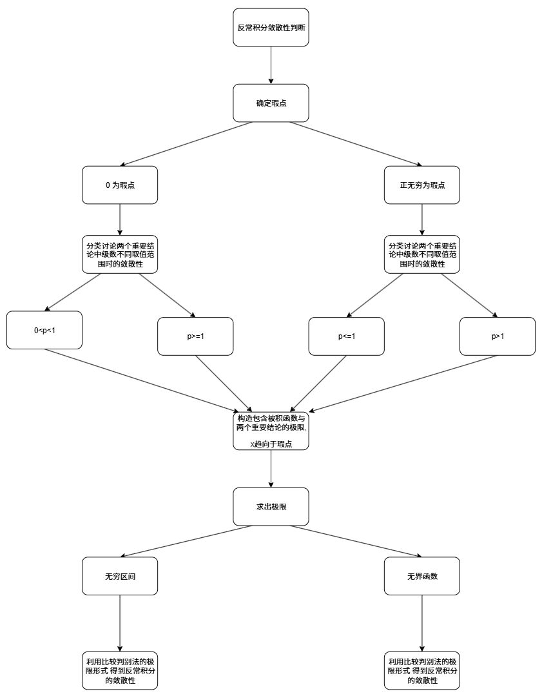

# 第一讲

### 各函数趋向于 $+\infty$ 的速度比较
$e^x>x>\ln x$
### 无穷小 $\times$ 有界函数
$\lim x \cdot \sin \frac{1}{x}$ =0

$\infty \sin \infty=无界震荡$


# 第六讲

## 辅助函数
看到 $f(x)g(x)\pm h(x)q(x)$ 时，常使用① ②的方式构造辅助函数
[中值定理](1-3.%20一元函数微分学/3.%20应用/2.%20中值定理、微分等式与微分不等式/中值定理.md#辅助函数)

## 1. 罗尔定理
- 若要证明方程 $f(x)=0$ 在某区间内有根（或讨论根的个数），可先构造辅助函数 $F(x)$，使得 $F'(x)=f(x)$（该方程常需由题设变形后得到）。
- 先验证罗尔定理三条件：$F(x)$ 在 $[a,b]$ 上连续、在 $(a,b)$ 内可导，且 $F(a)=F(b)$。
- 由罗尔定理可得：存在 $\xi\in(a,b)$，使 $F'(\xi)=0$，从而 $f(\xi)=0$，即目标方程在区间内至少有一个零点。
- 若要证明有多个零点，通常需要在多个子区间重复使用罗尔定理，或结合单调性等条件进一步判定。

### 流程图

```mehrmaid
flowchart TD
A("目标：证明/讨论 $f(x)=0$ 的零点") --> B("构造辅助函数 $F(x)$，使 $F'(x)=f(x)$")
B --> C("验证条件：$F$ 在 $[a,b]$ 连续、在 $(a,b)$ 可导")
C --> D("验证端点：$F(a)=F(b)$")
D --> E("套用罗尔定理：$\exists\xi\in(a,b),\ F'(\xi)=0$")
E --> F("推出：$f(\xi)=0$，至少一根")
F --> G("若需根的个数：多个子区间重复使用，或结合单调性")
```
题目：[[Excalidraw/1000题/基础篇/第六章.md#^efo1OoCy]]
[[Excalidraw/1000题/基础篇/第六章.md#^FpwugYmA]]

## 2. 拉格朗日中值定理
- 看到 $f(x)$ 与 $f'(x)$、 $f(b)-f(a)$、$\dfrac{f(b)-f(a)}{b-a}$、函数增量、“证明不等式/估计变化量”时，优先想到拉格朗日中值定理。
- 基本做法是把题目化成 $f(b)-f(a)=f'(\xi)(b-a)$，再利用 $f'(x)$ 的符号、上下界或单调性推出结论。
- 常见结论：若 $|f'(x)|\le M$，则 $|f(b)-f(a)|\le M|b-a|$；若 $f'(x)>0$，则 $f(x)$ 单调递增。

## 3. 柯西中值定理
- 看到两个函数的比值、分式导数、$\dfrac{f(x)-f(a)}{g(x)-g(a)}$ 这类结构时，优先考虑柯西中值定理。
- 常见操作是构造
  $$
  \frac{f(b)-f(a)}{g(b)-g(a)}=\frac{f'(\xi)}{g'(\xi)}
  $$
  再把问题转成导数比值的估计、比较或单调性判断。
- 它经常用于证明 $\dfrac{f(x)}{g(x)}$ 的单调性，以及处理指数、对数、幂函数之间的比较。

## 4. 泰勒公式
- 看到 $f(x)$ 与 $f^{(n)}(x)$
- 看到极限、比较高阶无穷小、局部近似、证明不等式，通常先想泰勒公式。
- 常用方式是把函数展开到需要的阶数，再保留主项和余项，判断极限或符号。
- 常见判断：谁是主项、谁是高阶无穷小、展开到几阶才能看出结论。

## 5. 零点定理与罗尔定理推论
- 证明方程有根，常先用连续性和异号性套零点定理；若要证明根的个数，则常转向罗尔定理及其推论。
- 典型套路是“先证至少有一个根，再用求导后根的个数限制原方程根的个数”。
- 题目中若出现“至多 n 个根”“唯一实根”，通常要先联想到高阶导数的根数控制。

## 6. 导数符号与函数性态
- 看到单调性、极值、凹凸性、取值范围，通常先考虑导数符号和二阶导数符号。
- 常见做法是把不等式问题转化为函数差、构造新函数，再用单调性或极值证明。
- 若题目中有“证明 $f(x)$ 被某个常数夹住”，常尝试把问题转为证明单调、凸性或最值。

### 流程图

```mehrmaid
flowchart TD
A("题目给出什么结构？") --> B{"出现 $f(b)-f(a)$ 或增量？"}
B -->|是| C("优先想拉格朗日中值定理")
B -->|否| D{"出现两个函数之比或 $f/g$？"}
D -->|是| E("优先想柯西中值定理")
D -->|否| F{"出现极限、无穷小比较、局部近似？"}
F -->|是| G("优先想泰勒公式")
F -->|否| H{"出现方程根、零点、根的个数？"}
H -->|是| I("优先想零点定理 / 罗尔定理及其推论")
H -->|否| J("再检查单调性、极值、凹凸性等函数性态工具")
```


## 第八讲

### 反常积分的判敛问题
**求解题目中反常积分敛散性时，常构造包含被积函数与[两个重要结论](1-4.%20一元函数积分学/1.%20概念/反常积分.md#比较判别法的极限形式)的极限，再利用比较判别法判断反常积分的敛散性**
#### 比较方法
1. 放缩法（无界区间与无界函数结论不同）
	1. [反常积分](1-4.%20一元函数积分学/1.%20概念/反常积分.md#比较判别法)
	2. [反常积分](1-4.%20一元函数积分学/1.%20概念/反常积分.md#比较判别法)
2. 计算法（无界区间与无界函数结论不同）
	1. [反常积分](1-4.%20一元函数积分学/1.%20概念/反常积分.md#比较判别法的极限形式)
	2. [反常积分](1-4.%20一元函数积分学/1.%20概念/反常积分.md#比较判别法的极限形式)
3. [两个重要结论](1-4.%20一元函数积分学/1.%20概念/反常积分.md#比较判别法的极限形式)
#### 常见解题步骤


例题
[[Excalidraw/例题/第八讲例题.md#^6ibGWAJu]]
[[Excalidraw/例题/第八讲例题.md#^AAFQuRL3]]
[[Excalidraw/例题/第八讲例题.md#^ICcwntqv]]
[[Excalidraw/例题/第八讲例题.md#^FIMTVCgd]]


> [!info] 
> 此处记录一些杂乱的做题小技巧，随时记录，随时整理。

## 证明题

### 证明有界

$$
|f(x)| \le M, ~ x \ge 0
$$

证明有界就是证明绝对值小于等于某个正数。

> [!tip] 
> 
> - 放缩时尽量消除变量，因为要证明小于常数！
> - 假如要证的函数 $F(x)$ 里面包含另一个有界函数 $f(x)$ ，则可以将其直接缩放为 $M$。

