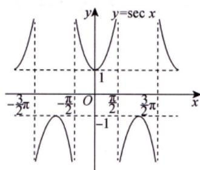
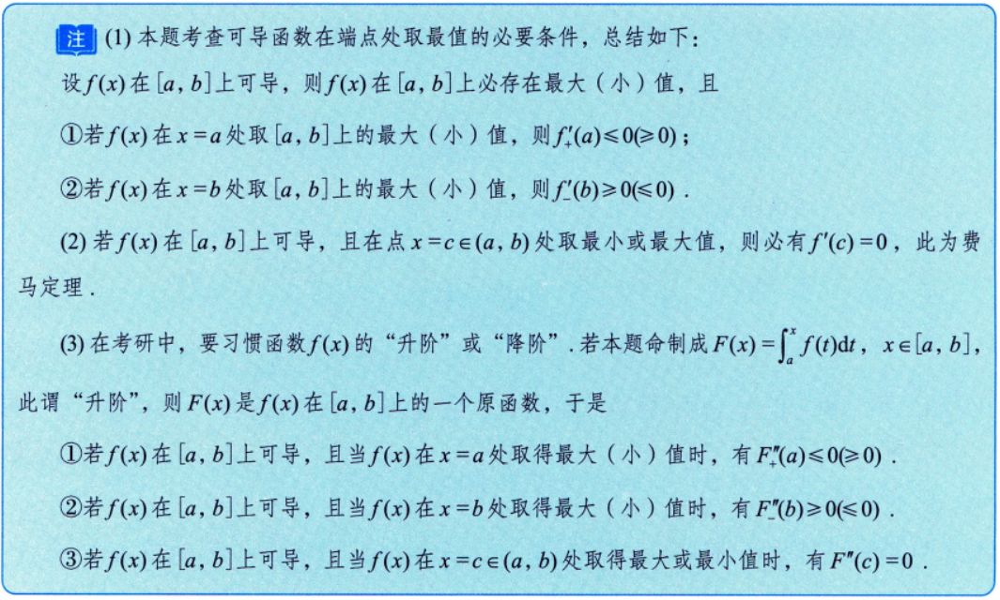

来源：张宇考研基础30讲教材，请自行对照完成。

```
1. 函数极限计算
例题：
1.19
1.20
1.28
1.29
1.33
1.38

1000题：
1.14
1.16
```

```
2. 数列极限
例题：
2.8 
2.11
2.12
2.14（十分综合，请完全掌握该“范例”！）

1000题：
2.8 （简化版压缩映射原理）
2.9 （比2.8多一步拉格朗日中值定理的运用）
```

```
3. 一元函数微分学的概念
例题：
3.5 （重要结论）
3.10 （理解并使用微分的概念）

1000题：
3.5（长得别扭，抓定义）
3.7（经典例题背住，但考试可以用特例法）
3.8（培养思维链，恒等变形和构造）
```

---
# 第四讲：一元函数微分学的计算
## 例题 ：
### 4 .1
- 多项求导的思路
### 4 .7
- 反函数求导
### 4 .8
- 较复杂的计算，但在考研中为常见类型
### 4 .10
- 综合性：参数方程、隐函数求导
### 4.18
- 如何使用泰勒展开式计算高阶导
### 4.19
- 综合使用莱布尼茨公式以及泰勒展开式
---
## 习题 ：
### 4.6
- 复合求导
[[../Excalidraw/习题/第四讲习题#^Oa823I8L]]
### 4.7
- 导数定义+导数计算
[[../Excalidraw/习题/第四讲习题#^j4L8BWoC]]
---
## 1000 题
### 4.1
[复合函数导数](../1-3.%20一元函数微分学/2.%20计算/复合函数导数.md)
[[../Excalidraw/1000题/基础篇/第四章#^PLaLwxgq]]
### 4.2 
- 提取特殊项
- 阶乘中有负号的处理方法
[[../Excalidraw/1000题/基础篇/第四章#^eBSJZPo8]]
相似题目： [[../Excalidraw/例题/第四讲例题#^Zen2LAda]]
### 4.3
- 未知函数绝对值处理方法
[[../Excalidraw/1000题/基础篇/第四章#^MeemaDGU]]
### 4.4
- [复合函数导数](../1-3.%20一元函数微分学/2.%20计算/复合函数导数.md)
[[../Excalidraw/1000题/基础篇/第四章#^0g4X4L9e]]
### 4.5
- 反函数求导
- [反函数导数](../1-3.%20一元函数微分学/2.%20计算/反函数导数.md)
- $$\frac{dx}{dy}=\frac{1}{\frac{dy}{dx}}$$
[[../Excalidraw/1000题/基础篇/第四章#^xo1ZtCWF]]
### 4.6
- 对数运算
[[../Excalidraw/1000题/基础篇/第四章#^iDTsASa3]]
### 4.7
- 参数方程+隐函数
- [参数方程函数导数](../1-3.%20一元函数微分学/2.%20计算/参数方程函数导数.md)
- [隐函数导数](../1-3.%20一元函数微分学/2.%20计算/隐函数导数.md)
[[../Excalidraw/1000题/基础篇/第四章#^aXqnNWqf]]
相似题目：[[../Excalidraw/例题/第四讲例题#^Y6BhJorB]]
### 4.8
- 参数方程的二阶导数
- [参数方程函数导数](../1-3.%20一元函数微分学/2.%20计算/参数方程函数导数.md)
- $$
\frac{\mathrm{d}^2y}{\mathrm{d}x^2} = \frac{\mathrm{d}(\frac{\mathrm{d}y}{\mathrm{d}x})}{\mathrm{d}x} 
$$
- $\sec x$


$$\sec 0=1$$

[[../Excalidraw/1000题/基础篇/第四章#^ND4qzVny]]
[[../Excalidraw/1000题/基础篇/第四章#^8hW26BX6]]
### 4.9&4.10
- 奇函数的性质
$$
f(-x)=-f(x)
$$
- 奇函数求一阶导变为偶函数，再求导，又变为奇函数
- [变限积分的计算](../1-4.%20一元函数积分学/2.%20计算/变限积分的计算.md#重要结论)
[[../Excalidraw/1000题/基础篇/第四章#^5y639gZB]]
[[../Excalidraw/1000题/基础篇/第四章#^PaXJc3pP]]
相似题目：[[../Excalidraw/例题/第四讲例题#^F3HjFJo3]]
### 4.11
- 泰勒展开求高阶导数
- [高阶导数求导](../1-3.%20一元函数微分学/2.%20计算/高阶导数求导.md#泰勒展开式)
### 4.12
- $1^\infty$ 的极限（**熟记!** 不要把 **e** 忘了）
- [函数极限的计算](../1-1.%20函数的极限与连续/函数极限的计算.md#1%20infty%20型未定式计算)
- 抓大头
[[../Excalidraw/1000题/基础篇/第四章#^XDbKdIRP]]
### 4.13
- $1^\infty$ 的极限（**熟记!** 不要把 **e** 忘了）
- [函数极限的计算](../1-1.%20函数的极限与连续/函数极限的计算.md#1%20infty%20型未定式计算)
[[../Excalidraw/1000题/基础篇/第四章#^VxTdt9vv]]
### 4.14
- 需要自己求解的分段函数 （max{f(x),g(x)}型）
[[../Excalidraw/1000题/基础篇/第四章#^QVjXlNg2]]
相似题目：[[../Excalidraw/1000题/基础篇/第三章#^f8NxajU8]]
### 4.15
- 参数方程+切线方程
- [参数方程函数导数](../1-3.%20一元函数微分学/2.%20计算/参数方程函数导数.md)
[[../Excalidraw/1000题/基础篇/第四章#^DvNtvT22]]
### 4.16
- 参数方程二阶导数
- [参数方程函数导数](../1-3.%20一元函数微分学/2.%20计算/参数方程函数导数.md#参数方程的二阶导数)
- $\ln|x|$
- [基本求导公式](../1-3.%20一元函数微分学/2.%20计算/基本求导公式.md#^14tsh7)
[[../Excalidraw/1000题/基础篇/第四章#^8hW26BX6]]
### 4.17
- 莱布尼兹公式求高阶导数
- [高阶导数求导](../1-3.%20一元函数微分学/2.%20计算/高阶导数求导.md#莱布尼茨公式)
- 排列组合
- [常用公式](常用公式.md#排列组合)
[[../Excalidraw/1000题/基础篇/第四章#^iUWgugmK]]
### 4.18 #困难 
- 方法一：莱布尼兹公式求高阶导数（**形式特殊**）
- [高阶导数求导](../1-3.%20一元函数微分学/2.%20计算/高阶导数求导.md#莱布尼茨公式)
- 方法二：泰勒公式
- [高阶导数求导](../1-3.%20一元函数微分学/2.%20计算/高阶导数求导.md#泰勒展开式)
	1. 诱导公式拆分 $\sin x$
	2. 泰勒公式求解 11 次方项的系数
[[../Excalidraw/1000题/基础篇/第四章#^Qaodd8Vl]]

---


# 第五讲：一元函数微分学的应用（一）
## 例题：
### 5.1
- 变换题目所给条件
[[Excalidraw/例题/第五讲例题.md#^sd8FvVOO]]
### 5.2（等号条件）
- 判别极值的充分条件的反向使用
- 已知函数二阶可导+在一点取极大值 $\rightarrow$ $f''(x_{0})\leq0$
- [单调性与极值的判别](1-3.%20一元函数微分学/3.%20应用/1.%20几何应用/单调性与极值的判别.md#第二充分条件)
[[Excalidraw/例题/第五讲例题.md#^3NHZ1KA7]]
### 5.3（计算复杂）
- 隐函数
- [隐函数导数](../1-3.%20一元函数微分学/2.%20计算/隐函数导数.md)
- 极值
- [单调性与极值的判别](../1-3.%20一元函数微分学/3.%20应用/1.%20几何应用/单调性与极值的判别.md)
[[Excalidraw/例题/第五讲例题.md#^kZui0lpF]]
相关题目：[隐函数导数](1-3.%20一元函数微分学/2.%20计算/隐函数导数.md#例题)
### 5.4
- 莱布尼兹法求高阶导数
- [高阶导数求导](1-3.%20一元函数微分学/2.%20计算/高阶导数求导.md#莱布尼茨公式)
- 极值
- [单调性与极值的判别](../1-3.%20一元函数微分学/3.%20应用/1.%20几何应用/单调性与极值的判别.md)
- **看好是求那个函数的极值、极值点**
[[Excalidraw/例题/第五讲例题.md#^lCZowi9q]]
相关题目：[[Excalidraw/例题/第四讲例题.md#^AWVVVLvc]]
### 5.5
- 判别拐点的充分条件三
- [凹凸性与拐点的判别](1-3.%20一元函数微分学/3.%20应用/1.%20几何应用/凹凸性与拐点的判别.md#第三充分条件)
[[Excalidraw/例题/第五讲例题.md#^gKNNPRFb]]
结论：拐点，在可导点处，一定不是极值点
### 5.6
- 函数在该点处不可导，不能用**极值判别第二、三充分条件**来判别极值点，可以用**定义**、**极值判别第一充分条件**判断极值点
- 拿到题目后要先判断函数**是否可导**
- **注意拐点的写法**

> [!tip]
> 极值判别第二、三充分条件要求函数在二阶/n 阶可导 
> [单调性与极值的判别](1-3.%20一元函数微分学/3.%20应用/1.%20几何应用/单调性与极值的判别.md#判别极值的充分条件)

- 在不可导点处，极值点与拐点可同时存在
- [极值点与拐点的重要结论](1-3.%20一元函数微分学/3.%20应用/1.%20几何应用/极值点与拐点的重要结论.md#^hqj5dt)
[[Excalidraw/例题/第五讲例题.md#^JvkC9r6V]]
相关题目：[[Excalidraw/例题/第四讲例题.md#^IWOvQLTy]]
### 5.7
- 重要结论 #重要
- [极值点与拐点的重要结论](1-3.%20一元函数微分学/3.%20应用/1.%20几何应用/极值点与拐点的重要结论.md#^3b9ega)
- [启航教育在线考研官网-考研辅导培训_启航教育考研网络课堂](https://www.iqihang.com/ark/record/1022067/126329/12067828/985C0623679ED630B463AB73BD4C026B/3/3654/1/1720/0) 18 分钟
[[Excalidraw/例题/第五讲例题.md#^jWcrXSC5]]
### 5.8
- 拐点个数
- **拐点个数**为 $k_{1} + 2k_{2} + 3k_{3} - 2$
- **极值点个数**为 $k_{1} + 2k_{2} + k_{3} - 1$ 
- [极值点与拐点的重要结论](1-3.%20一元函数微分学/3.%20应用/1.%20几何应用/极值点与拐点的重要结论.md#^o8dqx9)
[[Excalidraw/例题/第五讲例题.md#^L463idnk]]
### 5.9（计算较复杂）
- 找渐近线
- [渐近线](1-3.%20一元函数微分学/3.%20应用/1.%20几何应用/渐近线.md#^ug2hzt)
- 对含 $e^x$ 的函数求极限时，**左右极限**都要求
- 铅直渐近线**不能写成垂直渐近线**
- 求解 $\lim_\limits{x \to \infty} \frac{\ln(1+e^x)}{x}$ 不能使用抓大头将 1 去掉
- 注意斜渐近线的表达方式
- $\ln{1}=0$
- [函数极限的计算](1-1.%20函数的极限与连续/函数极限的计算.md#抓大头)
- **驻点处无渐近线**
[[Excalidraw/例题/第五讲例题.md#^VS9pZIDm]]
### 5.10
- 求最值
- [最值或取值范围](../1-3.%20一元函数微分学/3.%20应用/1.%20几何应用/最值或取值范围.md)
- 数列 [数列的相关概念](1-2.%20数列极限/数列的相关概念.md#^9vnk61)
	n 要取正整数
- $\sqrt[x]{x}=x^{\frac{1}{x}}=e^{\frac{\ln x}{x}}$
- 找可疑点
	**驻点，不可导点，端点**
- $+\infty \times(-\infty)=-\infty$
- 用一阶导求函数单调性，结合可疑点画出函数图像
[[Excalidraw/例题/第五讲例题.md#^Gkk85tpj]]
### 5.11
- 画函数图像[作函数图像](../1-3.%20一元函数微分学/3.%20应用/1.%20几何应用/作函数图像.md)
- 确定定义域
- 判断图像特性，原点对称，x, y 轴对称...
	可**简化题目**，只求部分象限即可
- 求函数轴上的点
- 求一阶导数，求**驻点**，判断函数**单调性**
- 求二阶导导数，求**拐点**，判断函数**凹凸性**
- 渐近线: 前提是函数要**远离原点**，本题函数无渐近线
[[Excalidraw/例题/第五讲例题.md#^1Tbe78ta]]

> [!note] 
> 一般不会直接考画函数图像，但有些题画出函数图像后易于分析

### 5.12
- 画函数图像[作函数图像](../1-3.%20一元函数微分学/3.%20应用/1.%20几何应用/作函数图像.md)
-  确定定义域
- 判断图像特性，原点对称，x, y 轴对称...
	可**简化题目**，只求部分象限即可
- 求函数轴上的点
- 求一阶导数，求**驻点**，判断函数**单调性**
- 求二阶导导数，求**拐点**，判断函数**凹凸性**
- 渐近线[渐近线](../1-3.%20一元函数微分学/3.%20应用/1.%20几何应用/渐近线.md)
	本题函数发散，有渐近线
	找端点，无定义点，分段点求**铅直渐近线**（**驻点**处无铅直渐近线）
	$x \rightarrow \infty$ 求水平渐近线
[[Excalidraw/例题/第五讲例题.md#^ChL9wxOW]]
### 5.13
- 同 5.11，5.12
[[Excalidraw/例题/第五讲例题.md#^5Sd5YrOH]]
### 5.14（用直角坐标系的观点去画极坐标的图）
- 降幂公式（附录四）
- 图像变换（附录一）
- 极坐标 $\rightarrow$ 直角坐标系
[[Excalidraw/例题/第五讲例题.md#^DCTFKyAU]]
### 5.15
- 参数方程导数[参数方程函数导数](../1-3.%20一元函数微分学/2.%20计算/参数方程函数导数.md)
- 曲率[曲率与曲率半径](../1-3.%20一元函数微分学/3.%20应用/1.%20几何应用/曲率与曲率半径.md)
[[Excalidraw/例题/第五讲例题.md#^DCTFKyAU]]
## 课后习题：
### 5.1
- $f(x)$ 在 $x_{0}$ 处是否取得极值，与该点二阶导数无关。只有在**该点为驻点**时，才与二阶导有关
	某一点为驻点+ $y''<0$ (凸函数) $\rightarrow$ 函数在该点取极大值
- 极值点处一阶导为 0
[[Excalidraw/习题/第五讲习题.md#^KnvZxkkQ]]
### 5.2		
- 导数定义判断区间端点最值[导数](../1-3.%20一元函数微分学/1.%20概念/导数.md)
- 
[[Excalidraw/习题/第五讲习题.md#^JLUYNxiM]]
### 5.3
- 渐近线[渐近线](../1-3.%20一元函数微分学/3.%20应用/1.%20几何应用/渐近线.md)
- 
[[Excalidraw/习题/第五讲习题.md#^F0UtURqp]]
### 5.4
- 求一点处切线
- 隐函数求导，得到一阶导数，带入切线方程
- [隐函数导数](../1-3.%20一元函数微分学/2.%20计算/隐函数导数.md)
[[Excalidraw/习题/第五讲习题.md#^BNWDVfF9]]
### 5.5 
- 求二阶导判断拐点[凹凸性与拐点的判别](1-3.%20一元函数微分学/3.%20应用/1.%20几何应用/凹凸性与拐点的判别.md#^3m8pp3)
- 注意，本题不能使用[极值点与拐点的重要结论](1-3.%20一元函数微分学/3.%20应用/1.%20几何应用/极值点与拐点的重要结论.md#^3b9ega)这个方法来判断，这个方法需要指数 n 大于 1
[[Excalidraw/习题/第五讲习题.md#^wK0D0nw3]]
### 5.6
- 求最值[最值或取值范围](../1-3.%20一元函数微分学/3.%20应用/1.%20几何应用/最值或取值范围.md)
- 可疑点：驻点，不可导点，区间端点
[[Excalidraw/习题/第五讲习题.md#^iXbtG8Ig]]
### 5.7
- 斜渐近线[渐近线](1-3.%20一元函数微分学/3.%20应用/1.%20几何应用/渐近线.md#斜渐近线)
- 看清楚求什么再算!!! 熟记求 a, b 的方程
- 本题求 b 的极限较难（提取 $\rightarrow$ 重组 $\rightarrow$ 凑 $\frac{0}{0}$）
- [[Excalidraw/习题/第五讲习题.md#^xKbIjbSP]]
### 5.8
- 曲率[曲率与曲率半径](../1-3.%20一元函数微分学/3.%20应用/1.%20几何应用/曲率与曲率半径.md)
- 熟记曲率公式
[[Excalidraw/习题/第五讲习题.md#^r93ARPyx]]
### 5.9  
- 求驻点，并判断是否为极值点[单调性与极值的判别](../1-3.%20一元函数微分学/3.%20应用/1.%20几何应用/单调性与极值的判别.md)
- 求一阶导，令一阶导为 0，求 x, 得到驻点
- 求二阶导，将一阶导, x, y 带入，得到二阶导数值；根据[单调性与极值的判别](1-3.%20一元函数微分学/3.%20应用/1.%20几何应用/单调性与极值的判别.md#第二充分条件)判断是否为极值
[[Excalidraw/习题/第五讲习题.md#^5h8wYA5J]]

## 1000 题
### 1.
- 求**最小值**[最值或取值范围](../1-3.%20一元函数微分学/3.%20应用/1.%20几何应用/最值或取值范围.md)
- 方法一：
	1. 求导，得驻点，判断驻点是否为极值点
	2. 与区间端点进行比较
- 方法二：基本不等式
[[Excalidraw/1000题/基础篇/第五章.md#^EoiUfhEI]]
### 2. 
- **极值**点
- **极值点小于 0** 指的是 $x<0$
[[Excalidraw/1000题/基础篇/第五章.md#^Z4Yxr1Zm]]
### 3 .
- 判断**分段函数**分段点处是否可导，是否是极值
- 本题 $x=0$ 为**不可导点**，**不**能用**第二充分条件**判断极值点，**要用第一充分条件**
- [单调性与极值的判别](1-3.%20一元函数微分学/3.%20应用/1.%20几何应用/单调性与极值的判别.md#第一充分条件)
[[Excalidraw/1000题/基础篇/第五章.md#^Wdy56LG7]]
### 4.
- 求**最值**点（题目较隐晦）[最值或取值范围](../1-3.%20一元函数微分学/3.%20应用/1.%20几何应用/最值或取值范围.md)
- 求最值时，不用求无穷远处的值
[[Excalidraw/1000题/基础篇/第五章.md#^XHjXLc41]]
### 5.
- 根据二阶导图像找**拐点**
- 二阶导不存在处也可能是拐点（**二阶导图像中的分段点**）[凹凸性与拐点的判别](../1-3.%20一元函数微分学/3.%20应用/1.%20几何应用/凹凸性与拐点的判别.md)
- 二阶导为 0 的点不一定是拐点，$f''(x) = 0, f'''(x) \ne 0$ 或二阶导左右变号的点才是拐点
[[Excalidraw/1000题/基础篇/第五章.md#^mmnLiTl4]]
### 6.
- 求导，带入数值
- 求二阶导是，有重复求一阶导的部分可直接写为 $y'$，简便计算 #重要 
[[Excalidraw/1000题/基础篇/第五章.md#^9uhc0vSE]]
### 7.
- 求斜渐近线[渐近线](1-3.%20一元函数微分学/3.%20应用/1.%20几何应用/渐近线.md#斜渐近线)
- #熟记 求 a, b 的公式
- #重要  $\infty-\infty$ 中有对数，考虑使用**对数运算**[常用公式](0.%20杂项/常用公式.md#对数运算法则)
[[Excalidraw/1000题/基础篇/第五章.md#^1fb9OfRp]]
### 8.
- 求斜渐近线[渐近线](1-3.%20一元函数微分学/3.%20应用/1.%20几何应用/渐近线.md#斜渐近线)
- 求极限（对数运算+倒代换）
[[Excalidraw/1000题/基础篇/第五章.md#^45izNin7]]
### 9.
- 求曲率[曲率与曲率半径](../1-3.%20一元函数微分学/3.%20应用/1.%20几何应用/曲率与曲率半径.md)
- #熟记 曲率公式
- 求导计算时要仔细!!!
[[Excalidraw/1000题/基础篇/第五章.md#^gZCMgO7Z]]
### 10. #困难 
- [启航教育在线考研官网-考研辅导培训_启航教育考研网络课堂](https://www.iqihang.com/ark/record/1106598/128196/13117861/CA7487961398B603753C612EB38A8D5A/3/3911/1/4477/0)时间 1:04:00
- 已知曲率圆方程求其他值
- 对曲率圆方程求导，得到 $f'(0)$ 和 $f''(0)$，带入泰勒展开式[泰勒公式](1-1.%20函数的极限与连续/泰勒公式.md#定义)
[[Excalidraw/1000题/基础篇/第五章.md#^sPebbelg]]
### 11. #困难 
- 判断函数单调性
- 对问题函数进行求导，判断一阶导的正负
- 先判断一阶导各**部分**的正负，再得到**整体**的正负
[[Excalidraw/1000题/基础篇/第五章.md#^r4GZ90bj]]
### 12. #困难 
- 极值判断
- **连续函数，极限值等于函数值**[函数的连续与间断](1-1.%20函数的极限与连续/函数的连续与间断.md#官方定义)
- 保号性[函数极限](1-1.%20函数的极限与连续/函数极限.md#局部保号性%20重要)
[[Excalidraw/1000题/基础篇/第五章.md#^UGNEIMag]]
### 13.
- 求数列最值 
- 令数列的通式为函数，求函数的最值
- **不要只求驻点的值，还要求出端点，不可导点的值进行对比**
[[Excalidraw/1000题/基础篇/第五章.md#^CHm91NjN]]
相似题目：[题目](0.%20杂项/题目.md#5%2010)
### 14.
- 求驻点，再求当 $n \rightarrow \infty$ 时横坐标的极限
[[Excalidraw/1000题/基础篇/第五章.md#^ItPpWGWh]]
### 15.
- 渐近线[渐近线](../1-3.%20一元函数微分学/3.%20应用/1.%20几何应用/渐近线.md)
- **不要乱用等价无穷小**，要看好 x 趋向于什么[等价无穷小](../1-1.%20函数的极限与连续/等价无穷小.md)
[[Excalidraw/1000题/基础篇/第五章.md#^WzO0roDG]]
### 16.
- 一阶导单增 $\rightarrow f''(x)>0\rightarrow$ 凹函数
- 求解选项中的每个函数都是怎么的到的 #困难 
[[Excalidraw/1000题/基础篇/第五章.md#^UdbIxwge]]
### 17.
- 判别极值（第二充分条件）[单调性与极值的判别](1-3.%20一元函数微分学/3.%20应用/1.%20几何应用/单调性与极值的判别.md#第二充分条件)
- $e^x$ 函数图像[函数的概念、特性与图像](1-1.%20函数的极限与连续/函数的概念、特性与图像.md#6%204%20指数函数%20y%20a%20x%20（%20a%200%20a%20ne1%20）)
- 曲线可导点不能同时为极值点和拐点；但不可导点可以[极值点与拐点的重要结论](1-3.%20一元函数微分学/3.%20应用/1.%20几何应用/极值点与拐点的重要结论.md#^hqj5dt)
[[Excalidraw/1000题/基础篇/第五章.md#^ddAyHlF6]]
### 18.
- 增减区间，极值，拐点
- [单调性与极值的判别](1-3.%20一元函数微分学/3.%20应用/1.%20几何应用/单调性与极值的判别.md#第二充分条件)
- [凹凸性与拐点的判别](1-3.%20一元函数微分学/3.%20应用/1.%20几何应用/凹凸性与拐点的判别.md#第二充分条件)
- 拐点要写为 $(x,y)$ 的形式 #重要 
 [[Excalidraw/1000题/基础篇/第五章.md#^2zLxB4MI]]
### 19.
- 求出极值，**与端点值进行比较，得到最值**，再求最值的极限[单调性与极值的判别](../1-3.%20一元函数微分学/3.%20应用/1.%20几何应用/单调性与极值的判别.md)
[[Excalidraw/1000题/基础篇/第五章.md#^ewbwniME]]
### 20.
- 求渐近线
- b 的求解较 #困难 
- **本题函数为偶函数，关于 y 轴对称，渐近线也关于 y 轴对称，有两条**
### 21.
- 渐近线[渐近线](../1-3.%20一元函数微分学/3.%20应用/1.%20几何应用/渐近线.md)
[[Excalidraw/1000题/基础篇/第五章.md#^ewbwniME]]
### 22.
- 求斜渐近线[渐近线](1-3.%20一元函数微分学/3.%20应用/1.%20几何应用/渐近线.md#斜渐近线)
- b 的极限较 #困难 
[[Excalidraw/1000题/基础篇/第五章.md#^00i0cksj]]
### 23.
- 求斜渐近线
- 极限中有 $\sqrt{x^2}$ 一般都要考虑**左右极限** #重要 
- 使用倒代换求解 b
[[Excalidraw/1000题/基础篇/第五章.md#^KcEgQDgO]]
### 24.
- 求一点处曲率圆方程
	1. 求一、二阶导
	2. 求曲率
	3. 求曲率半径（曲率的倒数）
	4. 求曲率圆方程（**不要直接将这一点坐标直接带入，要求这一点曲率圆的半径**）
[[Excalidraw/1000题/基础篇/第五章.md#^GQD6eJ2K]]


# 第六讲. 一元函数微分学的应用（二）
## 例题：
### 6.1
- 零点定理 [中值定理](1-3.%20一元函数微分学/3.%20应用/2.%20中值定理、微分等式与微分不等式/中值定理.md#4%20零点定理)
[[Excalidraw/例题/第六讲例题.md#^6cFp1Iap]]
### 6.2
- 保号性 [函数极限](1-1.%20函数的极限与连续/函数极限.md#局部保号性%20重要)
- 零点定理 [中值定理](1-3.%20一元函数微分学/3.%20应用/2.%20中值定理、微分等式与微分不等式/中值定理.md#4%20零点定理)
[[Excalidraw/例题/第六讲例题.md#^3NnGbPzx]]
### 6.3
- 导数零点定理的证明 
[[Excalidraw/例题/第六讲例题.md#^fNCMfkDF]]
### 6.4（平均值定理 + 罗尔定理）
- 平均值定理 [中值定理](1-3.%20一元函数微分学/3.%20应用/2.%20中值定理、微分等式与微分不等式/中值定理.md#3%20平均值定理)
- 罗尔定理 [中值定理](1-3.%20一元函数微分学/3.%20应用/2.%20中值定理、微分等式与微分不等式/中值定理.md#6%20罗尔定理)
[[Excalidraw/例题/第六讲例题.md#^bVzglslR]]
### 6.5 
- 构造辅助函数 c  [中值定理](1-3.%20一元函数微分学/3.%20应用/2.%20中值定理、微分等式与微分不等式/中值定理.md#辅助函数)
- 罗尔定理 [中值定理](1-3.%20一元函数微分学/3.%20应用/2.%20中值定理、微分等式与微分不等式/中值定理.md#多次罗尔定理)
[[Excalidraw/例题/第六讲例题.md#^V6FN3gga]]
### 6.6 #困难 
- 根据题目写出直线方程
- 构造辅助函数
- 多次罗尔定理[中值定理](1-3.%20一元函数微分学/3.%20应用/2.%20中值定理、微分等式与微分不等式/中值定理.md#多次罗尔定理)
[[Excalidraw/例题/第六讲例题.md#^PHQqICBE]]
### 6.7
- 同 [[Excalidraw/例题/第六讲例题.md#^3NnGbPzx]] 证明区间内存在一个实根
- 构造辅助函数 b [中值定理](1-3.%20一元函数微分学/3.%20应用/2.%20中值定理、微分等式与微分不等式/中值定理.md#辅助函数)
- 多次罗尔定理[中值定理](1-3.%20一元函数微分学/3.%20应用/2.%20中值定理、微分等式与微分不等式/中值定理.md#多次罗尔定理)
[[Excalidraw/例题/第六讲例题.md#^29tcYyzc]]
### 6.8
- [启航教育在线考研官网-考研辅导培训_启航教育考研网络课堂](https://www.iqihang.com/ark/record/1029273/126454/12067828/3E66121F1D810531B463AB73BD4C026B/3/3654/1/4659/0) 1:03:27
- 拉格朗日中值定理 [中值定理](1-3.%20一元函数微分学/3.%20应用/2.%20中值定理、微分等式与微分不等式/中值定理.md#7%20拉格朗日中值定理)
- 有界的使用方法
- 导函数有界**不能推出**函数有界，只有在有限区间内才能这样推
[[Excalidraw/例题/第六讲例题.md#^RpDpg6lF]]
### 6.9
- 构造辅助函数 a [中值定理](1-3.%20一元函数微分学/3.%20应用/2.%20中值定理、微分等式与微分不等式/中值定理.md#辅助函数)
- 拉格朗日中值定理 [中值定理](1-3.%20一元函数微分学/3.%20应用/2.%20中值定理、微分等式与微分不等式/中值定理.md#7%20拉格朗日中值定理)
[[Excalidraw/例题/第六讲例题.md#^0O2mdCrg]]
### 6.10（拉格朗日中值定理经典题目，可以变形）
- 根据选项构造辅助函数
- 求导，判断辅助函数的单调性
- 拉格朗日中值定理，联系导函数与函数[中值定理](1-3.%20一元函数微分学/3.%20应用/2.%20中值定理、微分等式与微分不等式/中值定理.md#7%20拉格朗日中值定理)
	若 $f(0)=0$, 通常用 $f(0)$ 来凑拉格朗日中值定理 #重要 
[[Excalidraw/例题/第六讲例题.md#^3oJvcPWP]]
### 6.11
- 对数四则运算，找到具体函数[常用公式](0.%20杂项/常用公式.md#对数运算法则)
- 凑柯西中值定理 [中值定理](1-3.%20一元函数微分学/3.%20应用/2.%20中值定理、微分等式与微分不等式/中值定理.md#8%20柯西中值定理)
[[Excalidraw/例题/第六讲例题.md#^QUHadDW6]]
### 6.12
- 泰勒公式 (带拉格朗日余项) [中值定理](1-3.%20一元函数微分学/3.%20应用/2.%20中值定理、微分等式与微分不等式/中值定理.md#9%20泰勒公式)
[[Excalidraw/例题/第六讲例题.md#^N5vdqTeQ]]
### 6.13
- 写出泰勒公式[中值定理](1-3.%20一元函数微分学/3.%20应用/2.%20中值定理、微分等式与微分不等式/中值定理.md#9%20泰勒公式)
- 选取**点**带入泰勒公式
	选取**点**的方法：1. 题目中给的点  2. 使式子尽量简单 #重要 
- 平均值定理[中值定理](1-3.%20一元函数微分学/3.%20应用/2.%20中值定理、微分等式与微分不等式/中值定理.md#3%20平均值定理)
[[Excalidraw/例题/第六讲例题.md#^hS9W0DXC]]
### 6.14
- 判断函数奇偶性
	若函数有奇偶性，只研究一侧即可
- 求解满足题目条件的区间（**常带入 0、1、题目中给的特殊点，得到函数存在的区间**） #重要  
- 使用零点定理，单调性判断根的个数[微分等式](1-3.%20一元函数微分学/3.%20应用/2.%20中值定理、微分等式与微分不等式/微分等式.md#1%20零点定理)  [微分等式](1-3.%20一元函数微分学/3.%20应用/2.%20中值定理、微分等式与微分不等式/微分等式.md#2%20单调性)
- 本题为偶函数，判断完一侧后**不要忘记另外一侧也有相同的结论**
[[Excalidraw/例题/第六讲例题.md#^1DVUUP6a]]
### 6.15
- 实系数奇次方程至少有一个实根 [微分等式](1-3.%20一元函数微分学/3.%20应用/2.%20中值定理、微分等式与微分不等式/微分等式.md#4%20实系数奇次方程%20至少有一个实根)
- 求一阶导数，一阶导数 $\Delta<0$ ,一阶导数无界
- 根据罗尔定理，原函数至多有 1 个实根[微分等式](1-3.%20一元函数微分学/3.%20应用/2.%20中值定理、微分等式与微分不等式/微分等式.md#3%20罗尔定理及其推论)
[[Excalidraw/例题/第六讲例题.md#^T7BWY4cJ]]
### 6.16
- 带入点，初步判断实根的位置
- 求导，利用罗尔定理，求根的个数 [微分等式](1-3.%20一元函数微分学/3.%20应用/2.%20中值定理、微分等式与微分不等式/微分等式.md#3%20罗尔定理及其推论)
[[Excalidraw/例题/第六讲例题.md#^AwWhMF9B]]
### 6.17（现在考研爱考：含参方程）
- 变换函数形式，将变换后的参数方程看作两个函数
- 同例题 5.13 求函数图像[[Excalidraw/例题/第五讲例题.md#^5Sd5YrOH]]
	注意，**分数求导时，不要与洛必达混淆**，洛必达是上下分别求导，分数求导要根据求导法则进行求解
- 找两函数只有一个交点的情况，即为仅有一个实根的范围
[[Excalidraw/例题/第六讲例题.md#^kK8bof2i]]
### 6.18
- 带特殊值，利用零点定理，求根存在的范围
- 求导，判断单调性，确定根的个数
[[Excalidraw/例题/第六讲例题.md#^7weuHC6F]]
### 6.19
- 法一：单调性
	- 变换题目不等式的形式
	- 设辅助函数
	- 判断不等式另一侧与辅助函数的关系
	- 求导，判断函数的单调性[微分不等式](../1-3.%20一元函数微分学/3.%20应用/2.%20中值定理、微分等式与微分不等式/微分不等式.md)
		- 通常需要求两次导才能判断出单调性
		- 对于一阶导已知正负的部分，可以不对其求二阶导，将未知正负的部分设为令一函数，求新函数的单调性，结合题目条件判断该部分的正负
- 法二：凹凸性
	- 求二阶导数，判断凹凸性
	- 求端点的函数值，根据[微分不等式](1-3.%20一元函数微分学/3.%20应用/2.%20中值定理、微分等式与微分不等式/微分不等式.md#^3s6qfd)进行判断
[[Excalidraw/例题/第六讲例题.md#^uArUye19]]

> [!tip] 
> 本题的答案也是一个重要结论[放缩法](1-2.%20数列极限/放缩法.md#2%20重要不等式)
> $$
\sin x>\frac{2x}{\pi} (0<x<\frac{\pi}{2})
$$
### 6.20 #困难 
- 左右开根号，注意绝对值
- 使用拉格朗日中值定理，判断绝对值内式子的正负，去绝对值[中值定理](1-3.%20一元函数微分学/3.%20应用/2.%20中值定理、微分等式与微分不等式/中值定理.md#7%20拉格朗日中值定理)
- 构造辅助函数
- 对辅助函数求导，判断函数单调性
- 求辅助函数的极限，得到辅助函数的值域
[[Excalidraw/例题/第六讲例题.md#^4ekk2HNe]]
### 6.21
- 构造辅助函数，比较微分方程的大小
- 均值不等式[常用公式](0.%20杂项/常用公式.md#均值不等式（%20注意%20a%20b%20都要大于%200%20）)
- 求导，判断函数单调性[微分不等式](../1-3.%20一元函数微分学/3.%20应用/2.%20中值定理、微分等式与微分不等式/微分不等式.md)
[[Excalidraw/例题/第六讲例题.md#^KrWeOiLc]]

## 课后习题

### 6.1
- 求零点个数
- 求导，判断单调区间
- 判断单调区间内的正负变化，使用[零点定理](1-3.%20一元函数微分学/3.%20应用/2.%20中值定理、微分等式与微分不等式/中值定理.md#4%20零点定理)判断零点个数
[[Excalidraw/习题/第六讲习题.md#^h75M5Eql]]
### 6.2
- 函数连续 $\rightarrow$ 函数有定义 $\rightarrow$ 对于本题，分母不为 0 #重要 
	- 连续不能推出可导
- 构造辅助函数
- 求辅助函数的值域
[[Excalidraw/习题/第六讲习题.md#^W7DHfJVm]]
### 6.3
- 观察要证明的等式与已知方程的关系，构造辅助函数
- 利用[罗尔定理](1-3.%20一元函数微分学/3.%20应用/2.%20中值定理、微分等式与微分不等式/中值定理.md#6%20罗尔定理)证明在区间内存在根
[[Excalidraw/习题/第六讲习题.md#^qFSa3WTe]]
### 6.4
- 第一问
	- 构造辅助函数
	- 求解特殊点的函数值
	- 利用[罗尔定理](1-3.%20一元函数微分学/3.%20应用/2.%20中值定理、微分等式与微分不等式/中值定理.md#6%20罗尔定理)证明等式
- 第二问
	- 构造[辅助函数](1-3.%20一元函数微分学/3.%20应用/2.%20中值定理、微分等式与微分不等式/中值定理.md#辅助函数) c 
	- 求解特殊点函数值
	- 利用[罗尔定理](1-3.%20一元函数微分学/3.%20应用/2.%20中值定理、微分等式与微分不等式/中值定理.md#6%20罗尔定理)证明等式

> [!note]  #重要 
> 看到[辅助函数](1-3.%20一元函数微分学/3.%20应用/2.%20中值定理、微分等式与微分不等式/中值定理.md#辅助函数)中的几种形式，要想起构造辅助函数

[[Excalidraw/习题/第六讲习题.md#^zqRpWlqq]]
### 6.5
- 构造辅助函数
- 使用[拉格朗日中值定理](1-3.%20一元函数微分学/3.%20应用/2.%20中值定理、微分等式与微分不等式/中值定理.md#7%20拉格朗日中值定理)证明等式

> [!tip]  #重要 
> 拿到题目时可能不清楚是用罗尔，还是拉格朗日，可以先带入特殊点进行观察，特殊点的值相等，可能是用罗尔，不相等可以尝试拉格朗日

[[Excalidraw/习题/第六讲习题.md#^bAjDWsZY]]
### 6.6
- 第一问
	- 构造辅助函数
	- 使用[零点定理](1-3.%20一元函数微分学/3.%20应用/2.%20中值定理、微分等式与微分不等式/中值定理.md#4%20零点定理)证明等式
- 第二问
	- 利用 $\xi$ 划分区间
	- 使用[拉格朗日中值定理](1-3.%20一元函数微分学/3.%20应用/2.%20中值定理、微分等式与微分不等式/中值定理.md#7%20拉格朗日中值定理)联系函数与导数
[[Excalidraw/习题/第六讲习题.md#^x8tbVumi]]
### 6.7（答案方法：泰勒 / 补充方法：牛顿插值）
- 分别利用[拉格朗日中值定理](1-3.%20一元函数微分学/3.%20应用/2.%20中值定理、微分等式与微分不等式/中值定理.md#7%20拉格朗日中值定理)和[柯西中值定理](1-3.%20一元函数微分学/3.%20应用/2.%20中值定理、微分等式与微分不等式/中值定理.md#8%20柯西中值定理)得到 $f(b)-f(a)$ 的值，联立，证明等式成立
- 构造辅助函数，凑柯西中值定理
[[Excalidraw/习题/第六讲习题.md#^nGkKFNks]]
### 6.8 #困难 
- 第一问
	- 默写带拉格朗日余项的泰勒公式
- 第二问
	- 将特殊点带入泰勒公式
	- 两式相减
	- 使用[三角不等式](0.%20杂项/常用公式.md#三角不等式)并结合题目中给的**未知数取值范围**证明微分不等式
[[Excalidraw/习题/第六讲习题.md#^IuUnubl1]]
### 6.9
- 构造辅助函数
- 带入端点，得到端点值相同
- 求辅助函数的二阶导，判断凹凸性，证明微分不等式
[[Excalidraw/习题/第六讲习题.md#^lo1yEnJ0]]
### 6.10
- 构造[辅助函数](1-3.%20一元函数微分学/3.%20应用/2.%20中值定理、微分等式与微分不等式/中值定理.md#辅助函数)
- 求辅助函数的二阶导，判断凹凸性
- 求函数的极值，本题在区间内仅有一个极值点，该极值点为最值点
- 证明微分不等式成立
[[Excalidraw/习题/第六讲习题.md#^iLZrG4QU]]
## 1000 题

### 1.
- 方法一
	- 求导，判断单调性，凹凸性，求函数最值
	- 判断零点个数
- 方法二
	- 使用两次[罗尔中值定理](1-3.%20一元函数微分学/3.%20应用/2.%20中值定理、微分等式与微分不等式/中值定理.md#6%20罗尔定理)
[[Excalidraw/1000题/基础篇/第六章.md#^5Jv6RcSj]]
### 2.
- 构造辅助函数
- 代入端点
	- 本题不能取 $x=0$，可以求在 0 点的极限，再根据[保号性](1-1.%20函数的极限与连续/函数极限.md#局部保号性%20重要)判断邻域内函数的正负
- 利用零点定理，求 K 的取值范围，**不要忽略等于 0 的情况**
[[Excalidraw/1000题/基础篇/第六章.md#^JpWjuQUs]]
### 3.
- 求导，判断单调性，凹凸性，求函数最值
- 已知函数有两个解，凹函数 $\rightarrow$ 最小值小于 0

> [!attention] 注意
> 本题没有给 $b>0$, 需要自己证明

[[Excalidraw/1000题/基础篇/第六章.md#^q2MhTIgq]]
### 4.
- 求导，判断单调性，凹凸性，求函数最值
- 已知函数有两个解，凸函数 $\rightarrow$ 最大值大于 0
[[Excalidraw/1000题/基础篇/第六章.md#^uTa9yC7S]]
### 5.
- 反解出 $\theta$
	- **注意绝对值**
- 求极限
	- 根据[放缩法](1-2.%20数列极限/放缩法.md#2%20重要不等式) ⑨判断根号内的正负，可简化计算
	- [等价无穷小](1-1.%20函数的极限与连续/等价无穷小.md#常用等价无穷小)
[[Excalidraw/1000题/基础篇/第六章.md#^j27KBmLt]]
### 6.
- 右侧
	- 构造辅助函数
	- 求导，判断函数单调性，极值
- 左侧
	- 构造辅助函数
	- 观察函数间的关系，有导数的联系，考虑使用[拉格朗日中值定理](1-3.%20一元函数微分学/3.%20应用/2.%20中值定理、微分等式与微分不等式/中值定理.md#7%20拉格朗日中值定理)
	- 将 $\xi$ 的取值范围带入即可得到不等关系
[[Excalidraw/1000题/基础篇/第六章.md#^fCCwDZO8]]
### 7.
- 将 $\ln$ 内的函数进行通分，可以使用[对数运算法则](0.%20杂项/常用公式.md#对数运算法则)
- [拉格朗日中值定理](1-3.%20一元函数微分学/3.%20应用/2.%20中值定理、微分等式与微分不等式/中值定理.md#7%20拉格朗日中值定理)求解不等关系
[[Excalidraw/1000题/基础篇/第六章.md#^2FQz8bF1]]
### 8.
- 使用[拉格朗日中值定理](1-3.%20一元函数微分学/3.%20应用/2.%20中值定理、微分等式与微分不等式/中值定理.md#7%20拉格朗日中值定理)得到函数与导数的关系
- 结合题目条件，证明不等关系

> [!note]  #重要 
> 构造辅助函数时，如果要对辅助函数求导，必须要先确定辅助函数可导
> 本题辅助函数中存在 $|f(x)|$, 根据题目条件不能证明其可导，方法一错误

[[Excalidraw/1000题/基础篇/第六章.md#^LYzhqap4]]
### 9.
- 先根据导数的极限趋向于 0 可初步判断选项
- 使用[拉格朗日中值定理](1-3.%20一元函数微分学/3.%20应用/2.%20中值定理、微分等式与微分不等式/中值定理.md#7%20拉格朗日中值定理)证明选项
### 10.
- 方法一
	- 导数定义
- 方法二
	- 构造辅助函数
	- 使用[柯西中值定理](1-3.%20一元函数微分学/3.%20应用/2.%20中值定理、微分等式与微分不等式/中值定理.md#8%20柯西中值定理)将要求的极限转化
- 方法三
	- 洛必达

> [!tip] 
> 题目中给出一个具体函数，一个抽象函数时，可以考虑使用柯西中值定理

[[Excalidraw/1000题/基础篇/第六章.md#^jMwScM09]]
### 11.
- 本题未说明函数在 $x=1$ 处一阶导连续，不能使用柯西或洛必达
- 可以使用 10 的方法一
### 12.
- 第一问
	- [带拉格朗日余项的n阶泰勒公式](1-3.%20一元函数微分学/3.%20应用/2.%20中值定理、微分等式与微分不等式/中值定理.md#带拉格朗日余项的n阶泰勒公式（在邻域内%20n%201%20阶导数存在）)默写
- 第二问
	- 将泰勒公式带入式子
	- $\sin x$ 的最大值为 1，利用这个函数值的性质，证明微分不等式

> [!note] 
> 熟记**带拉格朗日余项的n阶泰勒公式**和**带佩亚诺余项的n阶泰勒公式**

[[Excalidraw/1000题/基础篇/第六章.md#^Cih9jmhG]]
相似题目：[[Excalidraw/习题/第六讲习题.md#^IuUnubl1]]
### 13.
- #待完善 
### 14.
- #待完善 
### 15.
- 求导，判断单调性，凹凸性，求函数最值
- 已知函数有两个解，凹函数 $\rightarrow$ 最小值小于 0
[[Excalidraw/1000题/基础篇/第六章.md#^WLLz8Dfn]]
### 16.
- 求导，判断单调性，求函数最值
- 带入最值点两侧的值，判断函数凹凸性
[[Excalidraw/1000题/基础篇/第六章.md#^1Foxkp8J]]
### 17.
- #待完善 
### 18.
- 右侧：
	- 构造辅助函数
	- 求端点值，端点值相同，使用[罗尔中值定理](1-3.%20一元函数微分学/3.%20应用/2.%20中值定理、微分等式与微分不等式/中值定理.md#6%20罗尔定理)证明微分不等式
	- 求二阶导，判断函数凹凸性
- 左侧
	- 构造辅助函数
	- 求导，判断单调性，凹凸性，求函数最值
[[Excalidraw/1000题/基础篇/第六章.md#^HhtEEd2T]]
### 19.
- 构造辅助函数
- 求辅助函数的导数，判断函数单调性，凹凸性，极值，拐点
- 画函数图像（**注意，本题的定义域是正负无穷，图像要画完整!!!**）
- 求辅助函数与常函数 $-k$ 的交点个数
[[Excalidraw/1000题/基础篇/第六章.md#^IOr8lU4d]]
### 20.
- 构造[辅助函数](1-3.%20一元函数微分学/3.%20应用/2.%20中值定理、微分等式与微分不等式/中值定理.md#辅助函数)
- 将端点值带入，得到端点值相等，使用[罗尔中值定理](1-3.%20一元函数微分学/3.%20应用/2.%20中值定理、微分等式与微分不等式/中值定理.md#6%20罗尔定理)，证明根的个数

> [!note] 
> 本题构造辅助函数不太容易想到，且题目带有一定的迷惑性，容易被误导使用拉格朗日中值定理

[[Excalidraw/1000题/基础篇/第六章.md#^efo1OoCy]]
### 21.
- 构造辅助函数
	- 为题目设的等式乘一个 $x$，再对其求导后就能得到要证明的关系式，是一种常见的构造辅助函数的方式 #重要 
- 将端点值带入辅助函数，得到端点值相同，利用[罗尔中值定理](1-3.%20一元函数微分学/3.%20应用/2.%20中值定理、微分等式与微分不等式/中值定理.md#6%20罗尔定理)证明根的个数
[[Excalidraw/1000题/基础篇/第六章.md#^FpwugYmA]]
相似题目：[[Excalidraw/习题/第六讲习题.md#^qFSa3WTe]]
### 22.
- #待完善 
# 第七讲 一元函数微分学的应用（三）

## 例题：
### 7.1（只用掌握这一种形式即可，更综合的请等待第15讲）


8. 一元函数积分学的概念与性质
例题：
8.3（十分综合，覆盖面广，可以作为综合复习用）
8.4（几何法，理解积分的几何意义更好做题）
8.6（考研经常出现的题型，掌握精确定义）
8.14（害怕纸老虎。别怕，多看，看熟练！）
8.15（母题，深刻理解比阶的含义）
8.18（重要题目，记住结论！）
8.19（重要题目，记住结论！）
8.17（综合性极高，每个选项都会，那就都会了！）
```

```
9. 一元函数积分学的计算
例题：
9.1（最基本的凑微分。一定要熟练掌握凑微分的方法，熟记基本积分公式！）
9.4（考研正确方向，多练）
9.12（有一步使用定积分的定义）
9.14（使用不同的解法完成这道题：换元、分部积分）
9.15（和上一个配套做，凑平方差）
9.19（小综合题）
9.21（绝对值问题 + 泰勒多项式）
9.28
```

```
10. 一元函数积分学的应用（一）
例题：
10.2（参数方程）
10.8（绕直线旋转）
```

```
11. 一元函数积分学的应用（二）
例题
每道题都很重要，全部都要做！！！
```

```
12. 一元函数积分学的应用（三）
例题
12.1（应用题，翻译成数学语言、引入记号）
其实都挺简单的，差不多做一做就行
```

```
13. 多元函数微分学
例题：
13.9（非常基础的计算，对于基础不好的同学来说异常复杂）
13.19（考研常见计算题，计算极值）
```

```
14. 二重积分
例题：
14.2（椭圆面积，不用计算只用性质解题）
14.6（考研常考，计算量较大，综合性较高）
14.9（重要！二重积分复习的标杆！）
```

```
15. 微分方程
例题：
15.6（微分方程几何上的使用）
15.7（思考量少，计算量大，多练类似的）
15.9（考研就考这种题！）
```

---

```
1. 行列式
例题：
1.9（涉及到了矩阵的特征值特征向量，有实际用途）

```

```
2. 矩阵
例题：
2.13（必考，基本功要掌握）
```