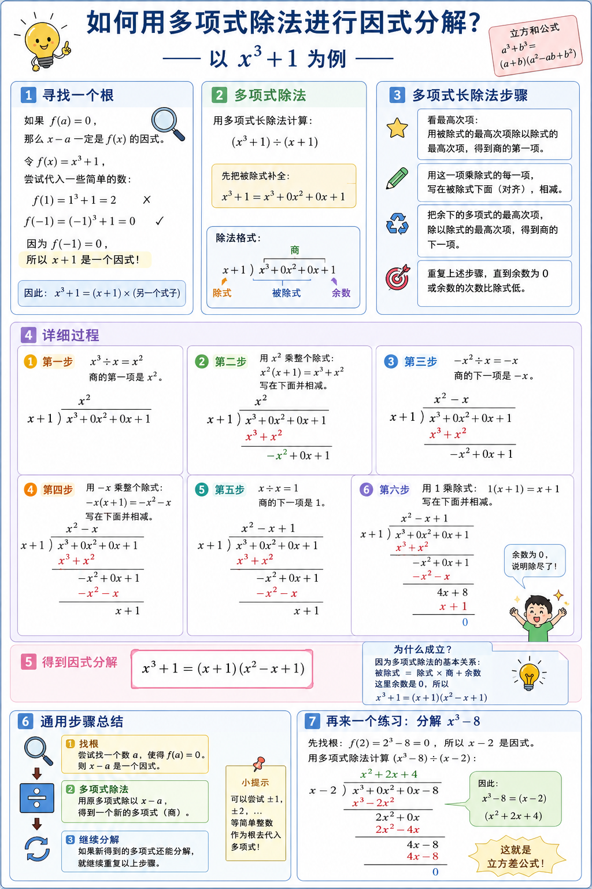
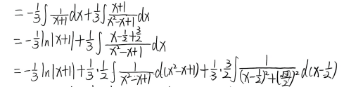

# 第一组解题技巧汇总（第1—26题）

## 引言

第1—26题涵盖的不定积分类型可分为**九大类**，每一类有明确的识别标志和解题套路。拿到一道题，先判断属于哪一类，再按固定流程走。

特别说明：第18—26题都围绕"$c^2+x^2$"展开，是第6、7题的扩展（把 $ax^2+b$ 换成具体的 $c^2+x^2$，并升级分母的幂次）。所以这些题目大量复用前17题的"分子是分母的导数""拆分子""部分分式"等技巧，并新增两个核心方法：**凑 $d\!\left(\frac{1}{c^2+x^2}\right)$** 和**分部积分递推**。

---

## 类型一：直接凑微分

### 识别标志
被积函数是 $ax+b$ 的初等函数，$x$ 不单独出现，只出现在 $ax+b$ 的线性组合中。

### 解法
设 $u=ax+b$，则 $du=a\,dx$，$dx=\frac{1}{a}du$：

$$\int f(ax+b)\,dx = \frac{1}{a}\int f(u)\,du$$

### 对应题目

**第1题** $\displaystyle\int\frac{dx}{ax+b}$

直接凑：$\displaystyle\int\frac{dx}{ax+b}=\frac{1}{a}\int\frac{du}{u}=\frac{1}{a}\ln|ax+b|+C$

---

**第2题** $\displaystyle\int(ax+b)^{\mu}dx$

直接凑：$\displaystyle\int(ax+b)^{\mu}dx=\frac{1}{a}\int u^{\mu}du=\frac{1}{a(\mu+1)}(ax+b)^{\mu+1}+C$

---

## 类型二：拆分子

### 识别标志
被积函数的分子是 $x$ 的低次幂，分母是 $ax+b$、$(ax+b)^n$、$c^2+x^2$ 等简单形式；目标是把分子凑出"分母本身"或"分母的倍数"，从而把积分降阶为基本公式。

### 解法
把分子拆成 $(\text{分母的倍数}) - (\text{剩余项})$：
- 拆出"分母本身"的那项 → 直接积分为简单项（$x$ 的多项式）
- 剩下的项 → 凑 $d(ax+b)$ 或 $d(c^2+x^2)$，得到对数项

> [!tip] 拆分子通用套路
> 见到 $\int\frac{P(x)}{Q(x)}dx$，若 $P(x)$ 次数 $\geq Q(x)$ 次数，先用**多项式除法**或**凑项**把 $P(x)$ 拆成 $Q(x)$ 的整数倍 + 余项；余项次数 $< Q(x)$ 次数时，剩下部分用其他方法（部分分式、直接凑微分）处理。

### 对应题目

**第3题** $\displaystyle\int\frac{x}{ax+b}dx$

$$x=\frac{1}{a}(ax+b)-\frac{b}{a}$$

$$\int\frac{x}{ax+b}dx=\frac{1}{a}\int\left(1-\frac{b}{ax+b}\right)dx=\frac{x}{a}-\frac{b}{a^2}\ln|ax+b|+C$$

---

**第5题** $\displaystyle\int\frac{x}{(ax+b)^2}dx$

同样拆分 $x=\frac{1}{a}(ax+b)-\frac{b}{a}$：

$$\int\frac{x}{(ax+b)^2}dx=\frac{1}{a}\int\left[\frac{1}{ax+b}-\frac{b}{(ax+b)^2}\right]dx=\frac{1}{a^2}\left(\ln|ax+b|+\frac{b}{ax+b}\right)+C$$

> **注意**：第二项 $-\frac{b}{(ax+b)^2}$ 不能直接凑 $\ln$，因为 $d(ax+b)=a\,dx$ 会多出系数 $a$。正确做法是写成 $-\frac{b}{a}\cdot d\!\left(\frac{1}{ax+b}\right)$，积分为 $-\frac{b}{a}\cdot\frac{1}{ax+b}$，合并后得到上式。

---

**第23题** $\displaystyle\int\frac{x^2}{c^2+x^2}dx$

拆 $x^2=(c^2+x^2)-c^2$：

$$\int\frac{x^2}{c^2+x^2}dx=\int 1\,dx - c^2\int\frac{dx}{c^2+x^2}=x - c\arctan\frac{x}{c}+C$$

> **秒杀技巧**：见到 $\int\frac{x^2}{c^2+x^2}dx$，**永远先拆** $x^2=(c^2+x^2)-c^2$，把 $c^2+x^2$ 消掉，剩下常数乘 $\int\frac{dx}{c^2+x^2}$（即第18题）。

---

**第25题** $\displaystyle\int\frac{x^3}{c^2+x^2}dx$

拆 $x^3=x(c^2+x^2)-c^2x$：

$$\int\frac{x^3}{c^2+x^2}dx=\int x\,dx - c^2\int\frac{x}{c^2+x^2}dx=\frac{x^2}{2}-\frac{c^2}{2}\ln(c^2+x^2)+C$$

> [!tip] 拆分子的"魔术拆法"
> 见到 $\int\frac{x^{2k+1}}{c^2+x^2}dx$（分子是 $x$ 的奇数次幂），**永远**拆 $x^{2k+1}=x^{2k-1}(c^2+x^2)-c^2x^{2k-1}$，把分母约掉，剩下 $\int x^{2k-1}dx$（幂函数积分）和 $\int\frac{x^{2k-1}}{c^2+x^2}dx$（$k=1$ 时退化为第21题"凑 $\ln$"；$k=2$ 时为 $\int\frac{x^3}{(c^2+x^2)^?}dx$，见第26题）。这样"分母降次"思路可以无限递归。

> [!warning] 避坑
> 第25题原解法用分部积分（$x^3$ 进 $\ln$）也能做，但**计算量翻倍**。**优先用多项式除法/凑项**拆分子，这是最快的路径。

---

## 类型三：部分分式分解

### 识别标志
分母是多个因子相乘的形式：线性×线性、线性×二次、二次×线性×线性等。分子次数低于分母。

### 解法（三步走）

**第一步：因式分解分母，确定拆分形式**

| 分母结构 | 拆分形式 |
|---|---|
| $(x-x_1)(x-x_2)$ | $\frac{A}{x-x_1}+\frac{B}{x-x_2}$ |
| $(x-x_1)(x^2+px+q)$ | $\frac{A}{x-x_1}+\frac{Bx+C}{x^2+px+q}$ |
| $(x-x_1)(x-x_2)(x^2+px+q)$ | $\frac{A}{x-x_1}+\frac{B}{x-x_2}+\frac{Cx+D}{x^2+px+q}$ |

**第二步：通分后比较系数**

通分后得到分子恒等式，按 $x$ 的各次幂系数列方程组，解出 $A,B,C,\cdots$

**第三步：逐项积分**

- 分母是线性项 $\frac{A}{x-x_0}$ → $\ln|x-x_0|$
- 分母是二次项 $\frac{Bx+C}{x^2+px+q}$ → 拆成 $\frac{\frac{B}{2}(2x+p)}{x^2+px+q}+\frac{C-\frac{Bp}{2}}{x^2+px+q}$
  - $\frac{2x+p}{x^2+px+q}$ → 凑 $\ln$
  - $\frac{1}{x^2+px+q}$ → 配方后凑 $\arctan$

### 对应题目

**第4题** $\displaystyle\int\frac{dx}{x(ax+b)}$

分母含两个线性因子，设：
$$\frac{1}{x(ax+b)}=\frac{A}{x}+\frac{B}{ax+b}$$

通分：$A(ax+b)+Bx=1$，即 $(Aa+B)x+Ab=1$

$$\begin{cases}Ab=1\\Aa+B=0\end{cases}\Rightarrow A=\frac{1}{b},\;B=-\frac{a}{b}$$

$$\int\frac{dx}{x(ax+b)}=\frac{1}{b}\int\frac{dx}{x}-\frac{a}{b}\int\frac{dx}{ax+b}=\frac{1}{b}\ln|x|-\frac{1}{b}\ln|ax+b|+C$$

---

**第8题** $\displaystyle\int\frac{dx}{1-x^2}$

分母 $1-x^2=(1+x)(1-x)$，设：
$$\frac{1}{1-x^2}=\frac{A}{1+x}+\frac{B}{1-x}$$

通分：$A(1-x)+B(1+x)=1$，即 $(B-A)x+(A+B)=1$

$$\begin{cases}A+B=1\\B-A=0\end{cases}\Rightarrow A=B=\frac{1}{2}$$

$$\int\frac{dx}{1-x^2}=\frac{1}{2}\int\frac{dx}{1+x}+\frac{1}{2}\int\frac{dx}{1-x}=\frac{1}{2}\ln\left|\frac{1+x}{1-x}\right|+C$$

---

**第13题** $\displaystyle\int\frac{dx}{1-x^4}$

分母 $1-x^4=(1-x)(1+x)(1+x^2)$，设：
$$\frac{1}{(1-x)(1+x)(1+x^2)}=\frac{A}{1-x}+\frac{B}{1+x}+\frac{Cx+D}{1+x^2}$$

通分比较系数，解得 $A=\frac{1}{4},\;B=\frac{1}{4},\;C=0,\;D=\frac{1}{2}$：
$$\frac{1}{(1-x)(1+x)(1+x^2)}=\frac{1}{4(1-x)}+\frac{1}{4(1+x)}+\frac{1}{2(1+x^2)}$$

逐项积分：
$$\int\frac{dx}{1-x^4}=-\frac{1}{4}\ln|1-x|+\frac{1}{4}\ln|1+x|+\frac{1}{2}\arctan x+C=\frac{1}{4}\ln\left|\frac{1+x}{1-x}\right|+\frac{1}{2}\arctan x+C$$

> **易错提醒**：第4题用待定系数法需解方程组；第8题方程简单可观察；第13、17题各有四个系数（三因子各出一个分子），需认真列方程组。

---

**第17题** $\displaystyle\int\frac{x}{1-x^4}dx$

分母 $1-x^4=(1-x)(1+x)(1+x^2)$，设：
$$\frac{x}{(1-x)(1+x)(1+x^2)}=\frac{A}{1-x}+\frac{B}{1+x}+\frac{Cx+D}{1+x^2}$$

通分比较系数，解得 $A=\frac{1}{4},\;B=-\frac{1}{4},\;C=\frac{1}{2},\;D=0$：
$$\frac{x}{1-x^4}=\frac{1}{4(1-x)}-\frac{1}{4(1+x)}+\frac{x}{2(1+x^2)}$$

逐项积分：
$$\int\frac{x}{1-x^4}dx=-\frac{1}{4}\ln|1-x|-\frac{1}{4}\ln|1+x|+\frac{1}{4}\ln(1+x^2)+C=\frac{1}{4}\ln\left|\frac{1+x^2}{1-x^2}\right|+C$$

---

## 类型四：分子是分母的导数——直接凑 $\ln$

### 识别标志
分子是 $x$ 的一次项（奇数次幂），分母是 $x^2$ 的二次多项式（$1+x^2$、$c^2+x^2$、$ax^2+b$ 等）。**核心：分母的导数 $d(\text{分母})$ 恰好等于分子乘以一个常数**。

### 解法
设 $u$ 为分母，则 $du$ 与分子只差一个常数系数：

$$\int\frac{x}{1+x^2}dx=\frac{1}{2}\int\frac{d(1+x^2)}{1+x^2}=\frac{1}{2}\ln(1+x^2)+C$$

> [!tip] 秒杀识别
> **分子是 $x$ 的一次（奇数次），分母是 $x^2$ 的二次多项式** → 看分母的导数是不是分子的常数倍。
> - 是 → 凑 $\ln$
> - 不是（例：分子是 $x$ 但分母是 $1+x^3$）→ 走类型五（立方分解）

### 对应题目

**第7题** $\displaystyle\int\frac{x}{ax^2+b}dx$

分母是 $ax^2+b$，分子是 $x$，$d(ax^2+b)=2ax\,dx$，分子差一个 $2a$ 倍：

$$\int\frac{x}{ax^2+b}dx=\frac{1}{2a}\int\frac{d(ax^2+b)}{ax^2+b}=\frac{1}{2a}\ln|ax^2+b|+C$$

---

**第9题** $\displaystyle\int\frac{x}{1+x^2}dx$

$$d(1+x^2)=2x\,dx\quad\Rightarrow\quad\int\frac{x}{1+x^2}dx=\frac{1}{2}\ln(1+x^2)+C$$

---

**第16题** $\displaystyle\int\frac{x}{1+x^4}dx$

设 $u=x^2$，则 $du=2x\,dx$，$x\,dx=\frac{1}{2}du$：

$$\int\frac{x}{1+x^4}dx=\frac{1}{2}\int\frac{du}{1+u^2}=\frac{1}{2}\arctan u+C=\frac{1}{2}\arctan x^2+C$$

> **技巧**：见到分母是 $x$ 的四次幂，分子是 $x$（一次），先把 $x^2$ 看作整体 $u$，分母变成 $1+u^2$，分子凑 $du$，得到 $\arctan$。

---

**第21题** $\displaystyle\int\frac{x}{c^2+x^2}dx$ ← 新增

$$d(c^2+x^2)=2x\,dx\quad\Rightarrow\quad\int\frac{x}{c^2+x^2}dx=\frac{1}{2}\int\frac{d(c^2+x^2)}{c^2+x^2}=\frac{1}{2}\ln(c^2+x^2)+C$$

> **秒杀识别**：本式和第7、9题完全一类——$c^2$ 就是常数，$c^2$ 视为 $b$。即"$\int\frac{x}{x^2+\text{常数}}dx$ 型"全部归到本类型。

---

## 类型五：分母为立方和/差 $1\pm x^3$——因式分解 + 配方

### 识别标志
分母是 $1+x^3=(1+x)(x^2-x+1)$ 或 $1-x^3=(1-x)(x^2+x+1)$。

### 解法（四步走）

**第一步：使用多项式除法拆分分母**

**第二步：部分分式分解**

设 $\frac{1}{1+x^3}=\frac{A}{1+x}+\frac{Bx+C}{x^2-x+1}$，待定系数求解。

**第三步：拆分二次项分子**
拆出 $x-\alpha$，凑微分，能凑成类似 $\int\frac{{1}}{x^2-x+1}d(x^2-x+1)$ 的形式 

> [!note] 怎么凑
> 先求 $(x^2-x+1)'=2x-1=2\left( x-\frac{1}{2} \right)$ ，$x-\frac{1}{2}$ 即为要拆出的 $x-\alpha$

**第四步：对二次项配方凑积分** ^zve3q4

> [!tip] 
> 无法拆分的二次多项式 $\rightarrow$ 凑基本积分公式 $\int \frac{1}{a^2+x^2}dx$

$x^2-x+1=\left(x-\frac{1}{2}\right)^2+\frac{3}{4}$

> [!note] 怎么凑
> 先凑出 $x^2$ 和 $-x$，在通过加一个常数来调节等式

将 $\frac{Bx+C}{x^2-x+1}$ 中的分子拆成导数项 + 常数项：

$$Bx+C=\frac{B}{2}(2x-1)+\left(C-\frac{B}{2}\right)$$

- $\frac{2x-1}{x^2-x+1}$ → 凑 $\ln$
- $\frac{1}{x^2-x+1}$ → 配方后凑 $\arctan$

### 对应题目

**第10题** $\displaystyle\int\frac{dx}{1+x^3}$

分解：
$$\frac{1}{1+x^3}=\frac{A}{1+x}+\frac{Bx+C}{x^2-x+1}$$

解方程得 $A=\frac{1}{3},\;B=-\frac{1}{3},\;C=\frac{2}{3}$：

$$\frac{1}{1+x^3}=\frac{1}{3}\cdot\frac{1}{1+x}+\frac{1}{3}\cdot\frac{2-x}{x^2-x+1}$$

对 $\frac{2-x}{x^2-x+1}$ 继续拆分：
$$2-x=-\frac{1}{2}(2x-1)+\frac{3}{2}$$

于是：
$$\int\frac{dx}{1+x^3}=\frac{1}{3}\ln|1+x|-\frac{1}{6}\ln(x^2-x+1)+\frac{1}{2}\int\frac{dx}{\left(x-\frac{1}{2}\right)^2+\left(\frac{\sqrt{3}}{2}\right)^2}$$

后半部分令 $u=x-\frac{1}{2}$，凑 $\arctan$：

$$\frac{1}{2}\cdot\frac{2}{\sqrt{3}}\arctan\frac{x-\frac{1}{2}}{\frac{\sqrt{3}}{2}}=\frac{1}{\sqrt{3}}\arctan\frac{2x-1}{\sqrt{3}}$$

---

**第11题** $\displaystyle\int\frac{dx}{1-x^3}$

分解：
$$\frac{1}{1-x^3}=\frac{A}{1-x}+\frac{Bx+C}{x^2+x+1}$$

解得 $A=\frac{1}{3},\;B=\frac{1}{3},\;C=\frac{2}{3}$，后续处理步骤与第10题相同。

---

**第14题** $\displaystyle\int\frac{x}{1+x^3}dx$

同样先部分分式分解：
$$\frac{x}{1+x^3}=\frac{A}{1+x}+\frac{Bx+C}{x^2-x+1}$$

待定系数求解后，对二次项配方积分。

---

**第15题** $\displaystyle\int\frac{x}{1-x^3}dx$

处理方法同第14题。

---

## 类型六：分母为 $1+x^4$——分子分母同除 $x^2$

### 识别标志
分母是 $1+x^4$，分子是 $dx$（没有 $x$ 因子）。

### 解法
分子分母同除以 $x^2$（$x=0$ 时单独处理，不影响积分结果），将积分拆成两部分，分别凑 $d\!\left(x-\frac{1}{x}\right)$ 和 $d\!\left(x+\frac{1}{x}\right)$：

$$\frac{dx}{1+x^4}=\frac{1}{2}\left(\frac{1+\frac{1}{x^2}}{x^2+\frac{1}{x^2}}-\frac{1-\frac{1}{x^2}}{x^2+\frac{1}{x^2}}\right)dx$$

- 第一项：$d\!\left(x-\frac{1}{x}\right)=\left(1+\frac{1}{x^2}\right)dx$，分母 $= \left(x-\frac{1}{x}\right)^2+2$ → $\arctan$
- 第二项：$d\!\left(x+\frac{1}{x}\right)=\left(1-\frac{1}{x^2}\right)dx$，分母 $= \left(x+\frac{1}{x}\right)^2-2$ → $\ln$

### 对应题目

**第12题** $\displaystyle\int\frac{dx}{1+x^4}$

$$\frac{dx}{1+x^4}=\frac{1}{2}\int\frac{1+\frac{1}{x^2}}{x^2+\frac{1}{x^2}}dx-\frac{1}{2}\int\frac{1-\frac{1}{x^2}}{x^2+\frac{1}{x^2}}dx$$

**第一项**：$d\!\left(x-\frac{1}{x}\right)=\left(1+\frac{1}{x^2}\right)dx$，而 $x^2+\frac{1}{x^2}=\left(x-\frac{1}{x}\right)^2+2$，于是：

$$\int\frac{1+\frac{1}{x^2}}{x^2+\frac{1}{x^2}}dx=\int\frac{d\!\left(x-\frac{1}{x}\right)}{\left(x-\frac{1}{x}\right)^2+2}=\frac{1}{\sqrt{2}}\arctan\frac{x-\frac{1}{x}}{\sqrt{2}}+C$$

**第二项**：$d\!\left(x+\frac{1}{x}\right)=\left(1-\frac{1}{x^2}\right)dx$，而 $x^2+\frac{1}{x^2}=\left(x+\frac{1}{x}\right)^2-2$，于是：

$$\int\frac{1-\frac{1}{x^2}}{x^2+\frac{1}{x^2}}dx=\int\frac{d\!\left(x+\frac{1}{x}\right)}{\left(x+\frac{1}{x}\right)^2-2}=\frac{1}{2\sqrt{2}}\ln\left|\frac{x+\frac{1}{x}-\sqrt{2}}{x+\frac{1}{x}+\sqrt{2}}\right|+C$$

合成后化简即为标准答案。

---

## 类型七：$\displaystyle\int\frac{dx}{ax^2+b}$——按 $b$ 的符号分情况

### 识别标志
分母是 $ax^2+b$（$a\neq 0$），没有 $x$ 的一次项，分子是 $dx$。

### 解法

**情况一：$b>0$**（配方后成 $\arctan$ 型）

$$ax^2+b=a\left[\left(\sqrt{\frac{a}{b}}x\right)^2+1\right]$$

令 $u=\sqrt{\frac{a}{b}}\,x$：

$$\int\frac{dx}{ax^2+b}=\frac{1}{a}\cdot\frac{1}{\frac{a}{b}}\int\frac{du}{u^2+1}=\frac{1}{\sqrt{ab}}\arctan\sqrt{\frac{a}{b}}\,x+C$$

**情况二：$b<0$**（分母可写成平方差，拆成对数型）

此时 $ax^2+b=(\sqrt{a}x+\sqrt{-b})(\sqrt{a}x-\sqrt{-b})$，设：

$$\frac{1}{ax^2+b}=\frac{1}{2\sqrt{-b}}\left(\frac{1}{\sqrt{a}x-\sqrt{-b}}-\frac{1}{\sqrt{a}x+\sqrt{-b}}\right)$$

积分后得到：

$$\int\frac{dx}{ax^2+b}=\frac{1}{2\sqrt{-ab}}\ln\left|\frac{\sqrt{a}\,x-\sqrt{-b}}{\sqrt{a}\,x+\sqrt{-b}}\right|+C$$

> **注意**：当 $b=0$ 时，$\displaystyle\int\frac{dx}{ax^2}=\frac{1}{a}\int x^{-2}dx=-\frac{1}{ax}+C$，属于幂函数积分，不属于此类型。

### 对应题目

**第6题** $\displaystyle\int\frac{dx}{ax^2+b}$

- $b>0$：$\displaystyle\int\frac{dx}{ax^2+b}=\frac{1}{\sqrt{ab}}\arctan\sqrt{\frac{a}{b}}\,x+C$
- $b<0$：$\displaystyle\int\frac{dx}{ax^2+b}=\frac{1}{2\sqrt{-ab}}\ln\left|\frac{\sqrt{a}\,x-\sqrt{-b}}{\sqrt{a}\,x+\sqrt{-b}}\right|+C$

---

**第18题** $\displaystyle\int\frac{dx}{c^2+x^2}$ ← 新增

本质上是第6题在 $a=1,\;b=c^2$ 时的特例，直接按 $b>0$ 配方：

$$\int\frac{dx}{c^2+x^2}=\int\frac{dx}{c^2\left[1+\left(\frac{x}{c}\right)^2\right]}=\frac{1}{c}\int\frac{d\!\left(\frac{x}{c}\right)}{1+\left(\frac{x}{c}\right)^2}=\frac{1}{c}\arctan\frac{x}{c}+C$$

> [!warning] 易错提醒
> 最后一步的系数 $\frac{1}{c}$ **不能省**！很多同学写成 $\arctan\frac{x}{c}$ 就交卷，少了 $\frac{1}{c}$ 直接扣一半分。

> [!tip] 与第6题的关系
> 把 $a=1,\,b=c^2$ 代入第6题公式 $\frac{1}{\sqrt{ab}}=\frac{1}{\sqrt{1\cdot c^2}}=\frac{1}{c}$，结果完全一致。本题就是第6题"裸的"$c$ 形式，**重点记结论**。

---

## 类型八：分母为 $(c^2+x^2)^n$（$n\geq 2$）的递推积分 ← 新增

### 识别标志
被积函数是 $\displaystyle\frac{dx}{(c^2+x^2)^n}$，分子是 $1$，分母是 $c^2+x^2$ 的高次幂（$\geq 2$）。

### 难点
- 被积函数分子没有 $x$ 因子，**无法直接凑** $d\!\left(\frac{1}{c^2+x^2}\right)$；
- 也无法直接用拆分子（分子是常数，不是 $x$ 的幂次）；
- 唯一可行的方法：**分部积分 + 部分分式**。

### 解法（三步走）

**第一步：分部积分（强行引入 $\frac{1}{x}$）**

利用微分关系 $d\!\left(\frac{1}{(c^2+x^2)^{n-1}}\right) = -\frac{2(n-1)x}{(c^2+x^2)^n}dx$，把被积函数改写为：

$$\int\frac{dx}{(c^2+x^2)^n} = -\frac{1}{2(n-1)}\int\frac{1}{x}\cdot\frac{2(n-1)x}{(c^2+x^2)^n}dx = -\frac{1}{2(n-1)}\int\frac{1}{x}\,d\!\left(\frac{1}{(c^2+x^2)^{n-1}}\right)$$

分部积分：

$$=-\frac{1}{2(n-1)x(c^2+x^2)^{n-1}} - \frac{1}{2(n-1)}\int\frac{dx}{x^2(c^2+x^2)^{n-1}}$$

**第二步：部分分式分解 $\frac{1}{x^2(c^2+x^2)^{n-1}}$**

对 $n=2$（对应第19题）：
$$\frac{1}{x^2(c^2+x^2)} = \frac{1}{c^2}\left(\frac{1}{x^2}-\frac{1}{c^2+x^2}\right)$$

对 $n=3$（对应第20题）：待定系数设
$$\frac{1}{x^2(c^2+x^2)^2} = \frac{A}{x^2}+\frac{B}{c^2+x^2}+\frac{C}{(c^2+x^2)^2}$$
两端乘 $x^2(c^2+x^2)^2$，比较系数解得 $A=\frac{1}{c^4},\;B=-\frac{1}{c^4},\;C=-\frac{1}{c^2}$。

**第三步：逐项积分**

- $\frac{1}{x^2}\to -\frac{1}{x}$
- $\frac{1}{c^2+x^2}\to \frac{1}{c}\arctan\frac{x}{c}$
- $\frac{1}{(c^2+x^2)^2}\to $ 用第19题结论

### 对应题目

**第19题** $\displaystyle\int\frac{dx}{(c^2+x^2)^2}$ ← 新增

$$-\frac{1}{2}\int\frac{1}{x}\,d\!\left(\frac{1}{c^2+x^2}\right) = -\frac{1}{2x(c^2+x^2)} - \frac{1}{2}\int\frac{dx}{x^2(c^2+x^2)}$$

部分分式分解：

$$\frac{1}{x^2(c^2+x^2)} = \frac{1}{c^2}\left(\frac{1}{x^2}-\frac{1}{c^2+x^2}\right)$$

逐项积分：

$$= -\frac{1}{2x(c^2+x^2)} - \frac{1}{2c^2}\left(-\frac{1}{x} - \frac{1}{c}\arctan\frac{x}{c}\right) + C$$
$$= \frac{1}{2c^3}\left(\frac{cx}{c^2+x^2} + \arctan\frac{x}{c}\right) + C$$

> [!tip] 套路总结
> 处理 $\int\frac{dx}{(c^2+x^2)^n}$ 的标准三步：
> 1. 分部积分引入 $\frac{1}{x}$
> 2. 对 $\int\frac{dx}{x^2(c^2+x^2)^{n-1}}$ 做部分分式
> 3. 逐项积分（每项都是已知基本公式）

---

**第20题** $\displaystyle\int\frac{dx}{(c^2+x^2)^3}$ ← 新增

$$-\frac{1}{4}\int\frac{1}{x}\,d\!\left(\frac{1}{(c^2+x^2)^2}\right) = -\frac{1}{4x(c^2+x^2)^2} - \frac{1}{4}\int\frac{dx}{x^2(c^2+x^2)^2}$$

部分分式分解 $\frac{1}{x^2(c^2+x^2)^2}$（待定系数，已在第二步给出）：

$$= -\frac{1}{4x(c^2+x^2)^2} - \frac{1}{4}\left[\int\frac{dx}{c^4x^2} - \int\frac{dx}{c^4(c^2+x^2)} - \int\frac{dx}{c^2(c^2+x^2)^2}\right]$$

逐项积分（第三项套用第19题结论）：

$$= -\frac{1}{4x(c^2+x^2)^2} + \frac{1}{4c^4x} + \frac{1}{4c^5}\arctan\frac{x}{c} + \frac{1}{8c^5}\left(\frac{cx}{c^2+x^2} + 3\arctan\frac{x}{c}\right) + C$$

整理得：
$$= \frac{1}{8c^5}\left(\frac{cx}{c^2+x^2} + 3\arctan\frac{x}{c}\right) - \frac{1}{4x(c^2+x^2)^2} + \frac{1}{4c^4x} + C$$

> [!warning] 避坑
> 第20题**不需要死记结论**。考场上的标准操作：写出递推公式 → 设待定系数 → 解方程 → 套第19题。**重在流程，不在结果**。
>
> 如果时间紧，可以直接写"由递推公式（分部积分 + 部分分式），结果为 …" 并写出关键步骤，得步骤分。

---

## 类型九：凑 $\displaystyle d\!\left(\frac{1}{c^2+x^2}\right)$——核心微分公式 ← 新增

### 核心公式
$$\boxed{d\!\left(\frac{1}{c^2+x^2}\right) = -\frac{2x}{(c^2+x^2)^2}dx}$$

这个公式的特征：
- 分母是 $(c^2+x^2)^2$（**平方**）
- 分子含 $x$ 的**一次**项

凡是分母是 $(c^2+x^2)^2$，分子含 $x$，**必先想这个公式**。

### 三个应用层级

**应用一：直接凑——分子只有 $x$（第22题）**

$$\int\frac{x}{(c^2+x^2)^2}dx = -\frac{1}{2}\int d\!\left(\frac{1}{c^2+x^2}\right) = -\frac{1}{2(c^2+x^2)} + C$$

**应用二：分部积分凑——分子是 $x^2$（第24题）**

把 $x^2$ 拆成 $x\cdot x$，让一个 $x$ 进微分：

$$\int\frac{x^2}{(c^2+x^2)^2}dx = -\frac{1}{2}\int x\,d\!\left(\frac{1}{c^2+x^2}\right)$$

分部积分：

$$= -\frac{x}{2(c^2+x^2)} + \frac{1}{2}\int\frac{1}{c^2+x^2}dx = -\frac{x}{2(c^2+x^2)} + \frac{1}{2c}\arctan\frac{x}{c} + C$$

**应用三：分部积分凑——分子是 $x^3$（第26题）**

把 $x^3$ 拆成 $x^2\cdot x$，让 $x$ 进微分：

$$\int\frac{x^3}{(c^2+x^2)^2}dx = -\frac{1}{2}\int x^2\,d\!\left(\frac{1}{c^2+x^2}\right)$$

分部积分：

$$= -\frac{x^2}{2(c^2+x^2)} + \int\frac{x}{c^2+x^2}dx$$

注意：$\int\frac{x}{c^2+x^2}dx$ 正好是**第21题**的结论（类型四）！

$$= -\frac{x^2}{2(c^2+x^2)} + \frac{1}{2}\ln(c^2+x^2) + C_1$$

化简 $-\frac{x^2}{2(c^2+x^2)} = \frac{c^2}{2(c^2+x^2)} - \frac{1}{2}$（因为 $-\frac{x^2}{2(c^2+x^2)} = \frac{c^2-x^2}{2(c^2+x^2)} = \frac{(c^2+x^2)-2x^2}{2(c^2+x^2)} = \frac{1}{2} - \frac{x^2}{c^2+x^2}$，化简后得 $\frac{c^2}{2(c^2+x^2)} - \frac{1}{2}$），吸收常数 $\frac{1}{2}$ 入 $C_1$：

$$= \frac{c^2}{2(c^2+x^2)} + \frac{1}{2}\ln(c^2+x^2) + C$$

> [!tip] 速查规律
> 分母 $(c^2+x^2)^2$，分子是 $x^n$：
>
> | 分子 | 方法 | 化归到 |
> |---|---|---|
> | $x$（$n=1$） | 直接凑 | ✓ 完成 |
> | $x^2$（$n=2$） | 分部积分 | 第18题（$\arctan$） |
> | $x^3$（$n=3$） | 分部积分 | 第21题（$\ln$） |
> | $x^4$（$n=4$） | 分部积分 + 拆 $x^4=x^2(c^2+x^2)-c^2x^2$ | 化归到 $n=2$ |
> | … | 递归 | … |
>
> **核心原则**：每做一次分部积分，分子降一次 $x$ 的幂，**最终化归到能直接积分的形式**。

### 对应题目

**第22题** $\displaystyle\int\frac{x}{(c^2+x^2)^2}dx$ ← 新增

$$d\!\left(\frac{1}{c^2+x^2}\right) = -\frac{2x}{(c^2+x^2)^2}dx \quad\Rightarrow\quad \frac{x}{(c^2+x^2)^2}dx = -\frac{1}{2}d\!\left(\frac{1}{c^2+x^2}\right)$$

$$\int\frac{x}{(c^2+x^2)^2}dx = -\frac{1}{2}\int d\!\left(\frac{1}{c^2+x^2}\right) = -\frac{1}{2(c^2+x^2)} + C$$

> [!tip] 秒杀识别
> 见到 $\int\frac{x}{(c^2+x^2)^2}dx$，**直接写答案** $-\frac{1}{2(c^2+x^2)}+C$，无需其他步骤。这是第22题的最大价值——让你少花 30 秒。

---

**第24题** $\displaystyle\int\frac{x^2}{(c^2+x^2)^2}dx$ ← 新增

$$\int\frac{x^2}{(c^2+x^2)^2}dx = -\frac{1}{2}\int x\,d\!\left(\frac{1}{c^2+x^2}\right)$$

分部积分 $u=x,\;dv=-\frac{1}{2}d\!\left(\frac{1}{c^2+x^2}\right)$：

$$= -\frac{x}{2(c^2+x^2)} + \frac{1}{2}\int\frac{dx}{c^2+x^2} = -\frac{x}{2(c^2+x^2)} + \frac{1}{2c}\arctan\frac{x}{c} + C$$

> **与类型四的桥梁**：分部积分后剩下的 $\int\frac{dx}{c^2+x^2}$ 就是第18题（类型七）。所以这一题实际上是"类型九 + 类型七"的组合。

---

**第26题** $\displaystyle\int\frac{x^3}{(c^2+x^2)^2}dx$ ← 新增

$$\int\frac{x^3}{(c^2+x^2)^2}dx = -\frac{1}{2}\int x^2\,d\!\left(\frac{1}{c^2+x^2}\right)$$

分部积分 $u=x^2$：

$$= -\frac{x^2}{2(c^2+x^2)} + \int\frac{x}{c^2+x^2}dx$$

剩下的 $\int\frac{x}{c^2+x^2}dx$ 正好是**第21题**的结论（类型四）：

$$= -\frac{x^2}{2(c^2+x^2)} + \frac{1}{2}\ln(c^2+x^2) + C_1$$

化简：
$$= \frac{c^2}{2(c^2+x^2)} + \frac{1}{2}\ln(c^2+x^2) + C$$

> **与类型四的桥梁**：分部积分后剩下 $\int\frac{x}{c^2+x^2}dx$，正是第21题（类型四"分子是分母的导数"）。所以这一题是"类型九 + 类型四"的组合。

---

## 考场速查表

| 题号 | 类型 | 关键操作 | 化归到 |
|---|---|---|---|
| 1 | 一·直接凑微分 | $u=ax+b$ | $\int u^{-1}du$ |
| 2 | 一·直接凑微分 | $u=ax+b$ | $\int u^{\mu}du$ |
| 3 | 二·拆分子 | $x=\frac{1}{a}(ax+b)-\frac{b}{a}$ | 类型一 + 凑 $\ln$ |
| 4 | 三·部分分式 | $x(ax+b)$ → $\frac{A}{x}+\frac{B}{ax+b}$ | 类型一 |
| 5 | 二·拆分子 | $x=\frac{1}{a}(ax+b)-\frac{b}{a}$ | 类型一 |
| 6 | 七·$ax^2+b$ 分情况 | $b>0$ → $\arctan$；$b<0$ → 拆 $\ln$ | — |
| 7 | 四·分子是导数 | $\frac{1}{2a}\ln(ax^2+b)$ | 凑 $\ln$ |
| 8 | 三·部分分式 | $(1-x)(1+x)$ → $\frac{A}{1+x}+\frac{B}{1-x}$ | 类型一 |
| 9 | 四·分子是导数 | $\frac{1}{2}\ln(1+x^2)$ | 凑 $\ln$ |
| 10 | 五·立方和分解 | $1+x^3=(1+x)(x^2-x+1)$，配方凑 $\arctan$ | 类型三 + 凑 $\ln$ |
| 11 | 五·立方差分解 | $1-x^3=(1-x)(x^2+x+1)$，配方凑 $\arctan$ | 类型三 + 凑 $\ln$ |
| 12 | 六·同除 $x^2$ | 造 $d(x-\frac{1}{x})$ 和 $d(x+\frac{1}{x})$ | $\arctan$ + $\ln$ |
| 13 | 三·部分分式 | $(1-x)(1+x)(1+x^2)$ → 三项拆分 | 类型一 + $\arctan$ |
| 14 | 五·立方和分解 | 同第10题 | 类型三 |
| 15 | 五·立方差分解 | 同第11题 | 类型三 |
| 16 | 四·分子是导数 | $u=x^2$，$\frac{1}{2}\arctan x^2$ | 凑 $\arctan$ |
| 17 | 三·部分分式 | $(1-x)(1+x)(1+x^2)$ → 三项拆分；第三项 $\frac{x}{1+x^2}$ 凑 $\ln$ | 类型四 |
| 18 | 七·$ax^2+b$ 在 $a=1,b=c^2$ | $\frac{1}{c}\arctan\frac{x}{c}$ | — |
| 19 | 八·递推积分 | 分部积分（引入 $\frac{1}{x}$） + 部分分式 | $\frac{1}{x}$ + 类型七 |
| 20 | 八·递推积分 | 同第19题，$n=3$ 情形 | 第19题 + $\frac{1}{x}$ + 类型七 |
| 21 | 四·分子是导数 | $\frac{1}{2}\ln(c^2+x^2)$ | 凑 $\ln$（同第7、9题） |
| 22 | 九·凑 $d(1/(c^2+x^2))$ | $-\frac{1}{2(c^2+x^2)}$ | 直接凑 |
| 23 | 二·拆分子 | $x^2=(c^2+x^2)-c^2$ | 类型七 |
| 24 | 九·凑 $d(1/(c^2+x^2))$ + 分部积分 | $-\frac{x}{2(c^2+x^2)}+\frac{1}{2c}\arctan\frac{x}{c}$ | 类型七（第18题） |
| 25 | 二·拆分子 | $x^3=x(c^2+x^2)-c^2x$ | 类型四（第21题） |
| 26 | 九·凑 $d(1/(c^2+x^2))$ + 分部积分 | $\frac{c^2}{2(c^2+x^2)}+\frac{1}{2}\ln(c^2+x^2)$ | 类型四（第21题） |

---

## 整体方法论总结

### 拿到一道 $\int\frac{P(x)}{Q(x)}dx$ 的判断流程

1. **看分子分母是否只含 $x$ 的某种"整体"**（如 $ax+b$）？
   - 是 → 类型一（直接凑微分）
2. **看分子次数是否 $\geq$ 分母次数**？
   - 是 → 类型二（拆分子 / 多项式除法）
3. **看分母是否是几个因子相乘**？
   - 是 → 类型三（部分分式分解）
   - 特别地：$1\pm x^3$ 形式 → 类型五
   - 特别地：$1+x^4$ 形式 → 类型六
4. **看分子是否是 $x$ 的一次（奇数次），分母是否是 $x^2$ 的二次多项式**？
   - 是 → 类型四（分子是分母的导数 → 凑 $\ln$）
5. **看分母是否是 $ax^2+b$ 形式**？
   - 是 → 类型七
6. **看分母是否是 $(c^2+x^2)^n$，$n\geq 2$**？
   - 是 → 类型八（递推积分，分部积分 + 部分分式）
7. **看分母是否是 $(c^2+x^2)^2$，分子含 $x$**？
   - 是 → 类型九（凑 $d(1/(c^2+x^2))$）

### 第18—26题的核心心法

> **"$c^2+x^2$ 是 $ax^2+b$ 的特例，$(c^2+x^2)^2$ 是 $(c^2+x^2)^2$，所有问题都是 $\arctan$、$\ln$、$\frac{1}{c^2+x^2}$ 的组合。"**

- **分子是 $x$ 的偶数次**（$x^2,\,x^4,\ldots$）→ 拆分子（类型二），化归到 $x^0$ 项
- **分子是 $x$ 的奇数次**（$x,\,x^3,\ldots$）→ 类型四（凑 $\ln$）或类型九（凑 $d(1/(c^2+x^2))$）
- **分子是常数**（无 $x$）→ 类型八（分部积分递推）

> [!warning] 必背结论
> 1. $\int\frac{dx}{c^2+x^2}=\frac{1}{c}\arctan\frac{x}{c}+C$ ← 漏 $\frac{1}{c}$ 必扣分
> 2. $\int\frac{x}{c^2+x^2}dx=\frac{1}{2}\ln(c^2+x^2)+C$
> 3. $\int\frac{x}{(c^2+x^2)^2}dx=-\frac{1}{2(c^2+x^2)}+C$ ← 看到直接写答案
> 4. $\int\frac{x^2}{c^2+x^2}dx=x-c\arctan\frac{x}{c}+C$
> 5. $\int\frac{x^3}{c^2+x^2}dx=\frac{x^2}{2}-\frac{c^2}{2}\ln(c^2+x^2)+C$
