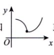
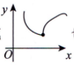

## 凹凸性的定义

### 定义1

函数 $f(x)$ 在区间连续，区间内任取两点 $x_1, x_2$ ，有：

$$
f \left ( \frac{x_1 + x_2}{2} \right ) < \frac{f(x_1) + f(x_2)}{2}
$$

则称 $f(x)$ 的**图形是凹的**（或凹弧）。反之则为**凸的**（凸弧）

> [!tip] 注
> 事实上，当图形为凹时，可以将 $f\left(\frac{1}{2} x_1 + \frac{1}{2} x_2\right) < \frac{1}{2} f(x_1) + \frac{1}{2} f(x_2)$ 更一般地写为
> 
> $$
> f \left(\lambda_ {1} x _ {1} + \lambda_ {2} x _ {2}\right) <   \lambda_ {1} f \left(x _ {1}\right) + \lambda_ {2} f \left(x _ {2}\right),
> $$
> 其中 $0 < \lambda_1 < 1, 0 < \lambda_2 < 1, \lambda_1 + \lambda_2 = 1$

### 定义2

$f(x)$ 在闭区间连续，开区间内可导，对开区间内任意 $x$ 及 $x_0$ 均有：

$$
f(x_0)+f’(x_0)(x-x_0) < f(x)
$$

则 $f(x)$ 在区间内的图形时**凹的**。反之则是**凸的**。

> [!tip] 
> 
> 不好理解？可以这样想：
> 
> 假如图形是凹的，那么如果在任意点作切线，其附近的函数图像都应该在其之上；凸曲线则在切线下方。
>
> 

## 拐点的定义

**连续**曲线的 *凹弧与凸弧的分界点* 称为曲线拐点。
$①$ 间断点不可能为拐点；  
$②$ 形如  或  也称为有拐点；  
$③$ 极值点只写横坐标 $x = x_0$ ，拐点应写 $(x_0, f(x_0))$ 

$①$ 拐点处只需连续.   
$②$ 判别拐点时凹凸不分先后.   
$③$ 拐点在曲线上，写 $(x_0, f(x_0))$
