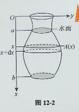
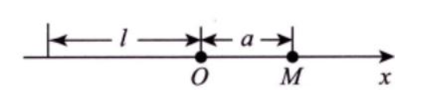

## 变力沿直线做功

设方向沿 $x$ 轴正向的力函数 $y=F(x) (a \le x \le b)$ ，则当物体从 $a$ 移动到 $b$ 变力做功为： $$W=\int^{b}_{a} F(x) \mathrm{d}x$$

![[int_force.png]]

纵坐标为力的大小 $F$ ，横坐标为位移 $x$ 。

功的微元是 $\mathrm{d}W = F(x) \mathrm{d}x$ 。

> [!note]
> - 力做功的基础方程是 $W = Fx$ 力乘以位移。因为此时力是一个函数，随时都在变化，因此使用微元法进行积分。
> - 变力做功可以理解为曲边梯形的面积。
> - 应用题需要将文字描述转换为数学语言。

## 抽水做功

假设一个奇形怪状的瓶子，每一个深度的截面积都不相同，如图：

水深为 $a-b$ ，截面积函数为 $A(x)$ ，则将容器中的水全部抽出所用的功为： $$W=\rho g \int^{b}_{a} xA(x) \mathrm{d}x$$

其中水的密度为 $\rho$ ，重力加速度为 $g$ 。

> [!note] 
> - 每一层水的质量为 $\rho g A(x) \mathrm{d}x$ ；
> - 每一层水被抽出的路程为 $x$ ；
> - 所以功的微元为 $\mathrm{d}W = \rho gx A(x) \mathrm{d}x$
> - 因此只需要确定 **截面积的函数 $A(x)$** 即可，其余都是常量。

## 静水压力

垂直浸没在水中的平板 $ABCD$ 的 **一侧** 受到的水压力为： $$P = \rho g \int^{b}_{a} x[f(x)-h(x)] \mathrm{d}x$$

![[int_pressure.png]]

> [!note] 
> - $AB$ 曲线方程为 $y=h(x)$ ， $DC$ 曲线方程为 $f=f(x)$；
> - 对于微元矩形条，近似认为其受到水压相等： $\mathrm{d}P = \rho g x \cdot S = \rho g x[f(x)-h(x)]\mathrm{d}x$；
> - 矩形条面积为宽度 $f(x)-h(x)$ 乘以高度 $\mathrm{d}x$；
> - 因此只需要确定 **水深 $x$ 处的平板宽度 $f(x)-h(x)$** 即可。

### 题型 4：万有引力（细杆对质点）

**识别标志**：细杆（线密度 $\mu$）对某点处质点的引力。

**引力微元**（取杆上 $dx$ 段）：
$$dF = \frac{G \cdot \mu\,dx \cdot m}{(a-x)^2}$$

$\mu\,dx$ 为细杆微元的质量

其中 $a-x$ 是质点到微元的距离（$x$ 为负时要用绝对值或平方消去符号）。
因为**细杆的右侧为原点**，所以质点到微元的距离是 $a-x$

**例题（细杆对杆外质点）**：
- 杆长 $L$，线密度 $\mu$（均匀），右端外距离 $a$ 处有质点 $m$
- 求：杆对质点的引力

**公式**：
$$F = \int_{-L}^0 \frac{G\mu m}{(a-x)^2}\,dx$$

> **易错提醒**：距离要平方 $(a-x)^2$。$x$ 是负值时，$a-x > 0$，所以平方后符号自动消掉。不要写成 $x-a$。