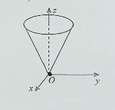

# 第13讲 多元函数的极值与最值

> 本讲是多元微分学的**应用收官**:把"多元"从概念层落到"极值/最值"的可操作判别上。
>
> 本讲四大块:
> 1. **极值与最值的概念**(局部 vs 整体)
> 2. **二元取极值 ⇔ 一元取极值**(例 13.17,选 A 充分条件)
> 3. **高阶偏导与极大值的关系**(例 13.18,选 D)
> 4. **无条件极值的完整判别法**:必要条件 → 可疑点 → $\Delta$ 判别法 → 例 13.19

---

## 一、极值与最值的概念(局部 vs 整体)

### 1. 极值的概念(局部)

> **极值是** **"邻域内"** **的局部概念**——只看这一点的**附近**。

设存在点 $(x_0, y_0)$ 的某个**邻域**(即局部小范围 $U$),使得在 $U$ 内任意一点 $(x,y)$ 处,均有:

$$f(x, y) \leqslant f(x_0, y_0) \quad (\text{或} \geqslant)$$

则称 $(x_0, y_0)$ 为 $f$ 的**极大值点**(或**极小值点**),$f(x_0, y_0)$ 为对应的**极大值**(或**极小值**)。

> [!tip] 类比一元
> 跟一元函数极值的定义**形式完全一致**,只是"邻域"从一维区间换成了二维小圆。
>
>

### 2. 极值点不要求连续或可微 ⚠️

**反直觉的一点**: 极值点**并不要求在该点连续或可微**。讲课老师举了两个反例:

**(反例 1:尖点)** 折线/尖锥顶上的极值点——偏导不存在,但是极值点。
**(反例 2:断掉)** 极小值点甚至可以**不连续**(可去间断点类比)。

> [!warning] 易错提醒
> 不要把"极值点"想成"必须是光滑山顶"。极值只看**附近函数值大小**,跟连续/可微**没有必然联系**。
>
>

### 3. 最值的概念(整体)

> **最值是** **"整个定义域"** **的整体概念**——看全部。
> 有界+闭区间+连续 $\Rightarrow$ 存在最值 #重要 

设 $(x_0, y_0)$ 为 $f(x, y)$ 定义域 $D$ 内一点,若对**整个定义域** $D$ 内任意一点 $(x,y)$ 均有:

$$f(x, y) \leqslant f(x_0, y_0) \quad (\text{或} \geqslant)$$

则称 $f(x_0, y_0)$ 为 $f(x,y)$ 的**最大值**(或**最小值**)。

### 4. 局部 vs 整体:一个例子秒懂

> [!example] 100 分的悲剧
> 你考 100 分,周围同学都考 99 分 → 你叫**极大值点**(局部最厉害)
>
> 但全班有考 101 分的 → 人家才是**最大值**(整体最厉害)
>
> 你只是**局部冠军**,不是**全校冠军**。

**两者的关系**:

| 概念 | 看哪儿 | 范围 |
|------|--------|------|
| **极值** | 邻域 $U$ | **局部** |
| **最值** | 整个定义域 $D$ | **整体** |

> **避坑**:
> - 最值是**极值**当且仅当定义域是某点的邻域(整个定义域就一个点)
> - **极值不一定是最值**(局部冠军不一定是全校冠军)
> - 反过来,**最值一定是极值点**(全校冠军在他的邻域里也是冠军)


---

## 二、例 13.17:二元取极值 ⇔ 一元取极值(选 A)

### 1. 题目

二元函数 $f(x,y)$ 在 $(x_0, y_0)$ 处取得极值是**一元函数 $f(x, y_0)$ 和 $f(x_0, y)$ 分别在 $x_0$ 和 $y_0$ 处取得极值**的( )。

(A) 充分条件
(B) 必要条件
(C) 充要条件
(D) 既非充分也非必要条件

### 2. 分析:几何直觉

**关键动作**:**用一个平面去切曲面**,把二元退化成两个一元。

设 $f(x, y)$ 在 $(x_0, y_0)$ 处取得极大值,则在邻域内 $f(x, y) \leqslant f(x_0, y_0)$。

- **固定 $y = y_0$**(用 $y=y_0$ 平面切一刀):得到一元 $f(x, y_0)$,这条曲线上 $f(x, y_0) \leqslant f(x_0, y_0)$,即 $f(x, y_0)$ 在 $x_0$ 处取极大值 ✓
- **固定 $x = x_0$**(用 $x=x_0$ 平面切一刀):同理 $f(x_0, y)$ 在 $y_0$ 处取极大值 ✓

### 3. 结论:正方向(充分)成立 ⚠️

**二元取极值 ⇒ 两个一元都取极值**,这是**充分条件**。

> [!tip] 一句话记忆
> "局部冠军"切两条线出来,线上的冠军也得是这两个点"。这是**充分**,不是必要。
>
>

### 4. 反方向(必要)不成立 ⚠️

**两个一元都取极值 ⇒ 二元取极值**?

**不一定!** 反例(教材 line 49):

$$f(x, y) = x^4 + y^4 - (x+y)^2$$

**验证在 $(0, 0)$ 处**:

| 路径 | 函数值 | 符号 |
|------|--------|------|
| $y = -x$ | $f(x, -x) = 2x^4$ | $> 0$ |
| $y = x$ | $f(x, x) = 2x^4 - 4x^2$ | $< 0$ (当 $x \neq 0$ 时) |
| $f(0, 0)$ | $0$ | - |

沿 $y = -x$ 路径, $f > 0 = f(0,0)$;沿 $y = x$ 路径, $f < 0 = f(0,0)$。**两侧有比它大也有比它小的值** → $(0,0)$ **不是极值点**。

但 $f(x, 0) = x^4 - x^2 < 0 = f(0,0)$ → $f(x, 0)$ 在 $x=0$ 取**极大值**;同理 $f(0, y)$ 在 $y=0$ 取**极大值**。

> [!warning] 反例方向审计 ⭐
> **本反例反的是**"两个一元都取极值 ⇒ 二元取极值"**这个推理方向(必要性)**。
>
> 教材定理(充分方向)**仍然成立**:二元取极值 ⇒ 两个一元取极值。
>
> 这就是为什么选 **(A) 充分条件** 而不是 (D)。
>
>

### 5. 答案与口诀

> **教材答案**:**(A) 充分条件** ✓

> **秒杀口诀**:**"二元极值推一元极值,反过来不行"**——单向箭头。

---

## 三、例 13.18:二阶偏导与极大值(选 D)

### 1. 题目

设 $f(x, y)$ 具有二阶连续偏导数,且在 $(x_0, y_0)$ 处取极大值,记

$$a = \left.\frac{\partial^2 f}{\partial x^2}\right|_{(x_0, y_0)}, \quad b = \left.\frac{\partial^2 f}{\partial y^2}\right|_{(x_0, y_0)}$$

则 ( )。

(A) $a > 0, b > 0$
(B) $a \geqslant 0, b \geqslant 0$
(C) $a < 0, b < 0$
(D) $a \leqslant 0, b \leqslant 0$

### 2. 一元类比(为什么 D 对)

> [!tip]  高阶导数判别法
[一元函数极值的判别](1-3.%20一元函数微分学/3.%20应用/1.%20几何应用/单调性与极值的判别.md#第二充分条件)

一元函数取极大值的判别:

$$f'(x_0) = 0, \quad f''(x_0) \leqslant 0$$

(允许 $f''(x_0) = 0$,比如 $-(x^4)$ 在 $x=0$ 取极大值,二阶导为零)

推广到二元:取极大值的点沿任何方向都是极大,特别是沿 $y = y_0$ 方向,得到一元 $g(x) = f(x, y_0)$,它在 $x_0$ 取极大值 → $g''(x_0) \leqslant 0$ → 即 $a \leqslant 0$;同理 $b \leqslant 0$。

### 3. 特例验证(讲课时老师口述的反例思路)

**特例 1:** $f(x,y) = -(x^2 + y^2)$ 在 $(0,0)$ 取极大值 → $a = b = -2 < 0$ → 排除 (A)、(B)。

**特例 2:** $f(x,y) = -(x^4 + y^4)$ 在 $(0,0)$ 取极大值 →

$$a = -12x^2\big|_{(0,0)} = 0, \quad b = -12y^2\big|_{(0,0)} = 0$$

→ 排除 (C)。

**所以选 (D)** $a \leqslant 0, b \leqslant 0$。

> [!warning] 易错提醒
> **等号不能扔**!$a = 0, b = 0$ 完全合法,只要 $a, b$ 不是正数就行。
>
> 原因跟一元的 $-(x^4)$ 在 $x=0$ 类似:函数**趋向极大值的速度太快**(高阶无穷小),二阶导数**测不到**变化率。
>
>

### 4. 答案

> **教材答案**:**(D)** $a \leqslant 0, b \leqslant 0$ ✓

> [!note] 讲课老师点拨
> 这题是给一元函数**第 5 讲**的"高阶导数判别法"做个呼应——为什么要有高阶判别?因为二阶判不到的时候,四阶能判到。**这就是带不带等号的本质原因**。

---

## 四、无条件极值的判别流程(本讲核心)

### 1. 全流程概览

```mehrmaid
flowchart TD
    Start["求二元函数 $f(x,y)$ 的极值"]:::startEnd
    S1A["$\dfrac{\partial f}{\partial x} = 0$ 且 $\dfrac{\partial f}{\partial y} = 0$ 的点"]:::sub
    S1B["$\dfrac{\partial f}{\partial x}$ 或 $\dfrac{\partial f}{\partial y}$<br/>不存在的点"]:::sub
    S2{"② $\Delta$ 判别法<br/>$\Delta = AC - B^2$"}:::dec
    R1(["极大值<br/>$\Delta > 0,\ A < 0$"]):::rMax
    R2(["极小值<br/>$\Delta > 0,\ A > 0$"]):::rMin
    R3(["不是极值<br/>$\Delta < 0$"]):::rNo
    R4(["方法失效<br/>$\Delta = 0$"]):::rFail

    Start --> S1A
    Start --> S1B
    S1A --> S2
    S1B --> S2
    S2 --> R1
    S2 --> R2
    S2 --> R3
    S2 --> R4

    classDef startEnd fill:#fef3c7,stroke:#d97706,stroke-width:2px,color:#000
    classDef sub fill:#e0f2fe,stroke:#0369a1,stroke-width:1.5px,color:#000
    classDef dec fill:#fce7f3,stroke:#be185d,stroke-width:2px,color:#000
    classDef rMax fill:#fee2e2,stroke:#b91c1c,stroke-width:2px,color:#000
    classDef rMin fill:#dcfce7,stroke:#15803d,stroke-width:2px,color:#000
    classDef rNo fill:#f3f4f6,stroke:#6b7280,stroke-width:2px,color:#000
    classDef rFail fill:#fef9c3,stroke:#a16207,stroke-width:2px,color:#000
```

> [!tip] 怎么读这张图
> - **黄色**:入口 / 极大值结论(开不开心少年团之「不开心」)
> - **绿色**:极小值结论(开不开心少年团之「开心」)
> - **粉色菱形**:Δ 判别法的核心决策点
> - **灰色**:非极值(小哑巴猪)
> - **土黄**:Δ = 0 方法失效(大鼻子爷爷)
>
> **记忆口诀**:大鼻子爷爷(Δ=0)→ 失效;小哑巴猪(Δ<0)→ 否;开(Δ>0 & A>0)→ 极小;不开心(Δ>0 & A<0)→ 极大。

### 2. 步骤 ① 求可疑点:两个必要条件

#### (1) 必要条件(类比一元费马定理)

> **若 $z = f(x, y)$ 在 $(x_0, y_0)$ 处**
> - **一阶偏导数存在**
> - **取极值**
>
> **则 $f'_x(x_0, y_0) = 0$ 且 $f'_y(x_0, y_0) = 0$**。

类比一元:可导 + 取极值 ⇒ $f'(x_0) = 0$ (费马定理)。

> [!tip] 一元 → 多元的对应
> | 一元 | 多元 |
> |------|------|
> | 可导 | **两个一阶偏导数都存在** |
> | 取极值 | 取极值 |
> | $f'(x_0) = 0$ | $f'_x = f'_y = 0$ |
>
>

**几何直觉**: 极值点切线必须水平 → 沿任何方向(不只 $x$ 和 $y$)切线都得水平 → 沿 $x$ 方向、沿 $y$ 方向的切线(也就是偏导数)都得是 0。

> [!warning] 必要条件不是充分条件
> $f'_x = f'_y = 0$ 推不出极值。反例:$y = x^3$ 在 $x=0$ 偏导为 0 但**不是极值**(马鞍面类比)。
>
>

#### (2) 偏导不存在的点也可能是极值点


**反例**: $z = \sqrt{x^2 + y^2}$ 在 $(0, 0)$ 处取**极小值** (因为 $z \geqslant 0$,原点最小),但 $z'_x(0,0)$、$z'_y(0,0)$ 都**不存在**。

> [!tip] 小结:**可疑点的两类**
> 1. $f'_x(x_0, y_0) = 0$ **且** $f'_y(x_0, y_0) = 0$ 的点
> 2. $f'_x$ 或 $f'_y$ **不存在**的点
>
> 这两类统称**"可疑点(suspected point)"**,需进一步判别。
>
> ^ixz3iw

### 3. 步骤 ② Δ 判别法(充分条件)

#### (1) 前提条件

设 $f(x, y)$ 在 $(x_0, y_0)$ 的某邻域内连续,且有**一阶及二阶连续偏导数**,又 $f'_x(x_0, y_0) = 0$, $f'_y(x_0, y_0) = 0$。

记:

$$A = f''_{xx}(x_0, y_0), \quad B = f''_{xy}(x_0, y_0), \quad C = f''_{yy}(x_0, y_0)$$

#### (2) 判别公式

> $$\boxed{\Delta = AC - B^2 \begin{cases} > 0 & \Rightarrow \text{极值} \begin{cases} A < 0 \Rightarrow \text{极大值} \\ A > 0 \Rightarrow \text{极小值} \end{cases} \\ < 0 & \Rightarrow \text{非极值} \\ = 0 & \Rightarrow \text{方法失效,另谋他法} \end{cases}}$$

#### (3) 关键推论:$\Delta > 0$ 时 $A, C$ 同号 ⚠️

> **若 $\Delta > 0$,则 $AC > B^2 \geqslant 0$,即 $AC$ 同号**。
>
> 所以 $\Delta > 0$ 时**必有**:
> - 要么 $A > 0, C > 0$
> - 要么 $A < 0, C < 0$
>
> **不可能**出现 $A > 0, C < 0$ 这种"异号"情况。
>
>

#### (4) 记号:$\Delta$ 不是字母 A ⚠️

> [!warning] 易错提醒
> $\Delta$ (希腊字母 delta,大写)是 **判别量**,**不是字母 $A$**。
>
> $\Delta = AC - B^2$ 是**一个数**,跟 $A$、$B$、$C$ 是**不同的东西**。
>
> 教材 line 131 排版有误(写成 "$A = AC - B^2$"),**实际是 $\Delta = AC - B^2$**。下面所有判别都是基于 $\Delta$。
>
>

### 4. 必背记忆法:开不开心少年团 🎯

讲课老师的核心记忆法——把 4 种情况拟人化:

| 画像                                                | 角色           | 判别条件                | 结论                |
| ------------------------------------------------- | ------------ | ------------------- | ----------------- |
|  | **开心** 😊    | $\Delta > 0, A > 0$ | **极小值**(嘴巴一弯笑)    |
|  | **不开心** 😢   | $\Delta > 0, A < 0$ | **极大值**(嘴巴一撇哭)    |
|  | **大鼻子爷爷** 🧓 | $\Delta = 0$        | **方法失效**(胡子太乱说不清) |
|  | **小哑巴猪** 🐷  | $\Delta < 0$        | **非极值**(打叉 = 否定)  |
> **结构记忆**:
> - 大鼻子爷爷 ($\Delta = 0$) 养小哑巴猪 ($\Delta < 0$)
> - 大鼻子爷爷牵两个孙子 → **开不开心少年团**
> - $\Delta > 0$ 是"**加号**" (鼻子里的 $+$, 代表 $AC$ 同号)
> - $A > 0$ 是"**眼睛正**" (开心); $A < 0$ 是"**眼睛负**" (不开心)

> [!warning] 避坑
> **$\Delta > 0$ 时,只需要看 $A$ 的符号就行,不用再单独看 $C$**!
> 因为 $AC$ 同号 → $A$ 正则 $C$ 必正,$A$ 负则 $C$ 必负。
>
>

### 5. 答题步骤口诀

> [!tip] 答题三步走
> 1. **求可疑点** —— 用必要条件(偏导 = 0) + 偏导不存在的点
> 2. **算 $A, B, C$** —— 在可疑点处代入二阶偏导
> 3. **判别** —— 算 $\Delta = AC - B^2$,对照开不开心少年团定结论
>
>

---

## 五、例 13.19:隐函数极值(完整计算流程)

### 1. 题目

已知函数 $z = z(x, y)$ 由方程

$$(x^2 + y^2)z + \ln z + 2(x + y + 1) = 0$$

确定,求 $z(x, y)$ 的极值。

### 2. 思路

**两步走**:
1. **求可疑点**:对 $x, y$ 求偏导 → 令偏导 = 0 → 解出 $(x, y, z)$
2. **判别极值**:算 $A, B, C$ → 算 $\Delta$ → 开不开心少年团定结论

> [!warning] 易错提醒
> 隐函数求偏导时**别忘了 $z$ 是 $x, y$ 的函数**——$\ln z$ 求导要乘 $\frac{1}{z} \cdot \frac{\partial z}{\partial x}$。
>
>

### 3. 步骤 ①:对 $x$ 求偏导

方程两边对 $x$ 求偏导($y$ 当常数,$z$ 是 $x, y$ 的函数):

$$2xz + (x^2 + y^2) \frac{\partial z}{\partial x} + \frac{1}{z} \frac{\partial z}{\partial x} + 2 = 0 \tag{*}$$

> 轮换对称:对 $y$ 求偏导时**只需把 $x$ 换成 $y$**:

$$2yz + (x^2 + y^2) \frac{\partial z}{\partial y} + \frac{1}{z} \frac{\partial z}{\partial y} + 2 = 0 \tag{*}$$

> [!tip] 轮换对称性
> 方程里 $x$ 和 $y$ **完全等价** → 求 $y$ 的偏导只需要把 $x$ 换成 $y$,字母差而已。
>
>

### 4. 步骤 ②:求可疑点

令 $\frac{\partial z}{\partial x} = 0, \frac{\partial z}{\partial y} = 0$,代入 $(*)$:

$$2xz + 2 = 0 \implies x = -\frac{1}{z}$$
$$2yz + 2 = 0 \implies y = -\frac{1}{z}$$

代回原方程:

$$\left(\frac{1}{z^2} + \frac{1}{z^2}\right) z + \ln z + 2\left(-\frac{2}{z} + 1\right) = 0$$

$$\frac{2}{z} + \ln z - \frac{4}{z} + 2 = 0$$

$$\ln z - \frac{2}{z} + 2 = 0$$

> [!tip] **观察法**解超越方程
> 因为 $z > 0$ (有 $\ln z$),**观察** $z = 1$:
> $$\ln 1 - 2 + 2 = 0 \checkmark$$
>
>

所以 $z = 1$,$x = y = -1$,**可疑点为 $(-1, -1, 1)$**。

> [!warning] 偏导不存在的点?
> 隐函数由方程确定,其一阶偏导数**必连续**(因为方程右端连续可微),**不用担心偏导不存在**。
>
>

### 5. 步骤 ③:求二阶偏导

把 $(*)$ 两式**再对 $x, y$ 各求一次偏导**(只列关键项):

**(对 $x$ 求):**

$$2z + 4x \frac{\partial z}{\partial x} + (x^2 + y^2) \frac{\partial^2 z}{\partial x^2} - \frac{1}{z^2}\left(\frac{\partial z}{\partial x}\right)^2 + \frac{1}{z} \frac{\partial^2 z}{\partial x^2} = 0$$

**(对 $y$ 求):**

$$2z + 4y \frac{\partial z}{\partial y} + (x^2 + y^2) \frac{\partial^2 z}{\partial y^2} - \frac{1}{z^2}\left(\frac{\partial z}{\partial y}\right)^2 + \frac{1}{z} \frac{\partial^2 z}{\partial y^2} = 0$$

**(交叉):**

$$2x \frac{\partial z}{\partial y} + 2y \frac{\partial z}{\partial x} + (x^2 + y^2) \frac{\partial^2 z}{\partial x \partial y} - \frac{1}{z^2}\frac{\partial z}{\partial x}\frac{\partial z}{\partial y} + \frac{1}{z} \frac{\partial^2 z}{\partial x \partial y} = 0$$

> [!tip] 关键化简
> 在**可疑点处**, $\frac{\partial z}{\partial x} = \frac{\partial z}{\partial y} = 0$,**凡是带一阶偏导的项全部删掉**。
>
> 这就是为什么讲课时老师说"**不难解**"——化简后只剩三项。
>
>

化简后只剩:

$$2z + \left[(x^2 + y^2) + \frac{1}{z}\right] \frac{\partial^2 z}{\partial x^2} = 0$$
$$2z + \left[(x^2 + y^2) + \frac{1}{z}\right] \frac{\partial^2 z}{\partial y^2} = 0$$
$$\left[(x^2 + y^2) + \frac{1}{z}\right] \frac{\partial^2 z}{\partial x \partial y} = 0$$

### 6. 步骤 ④:代入可疑点 $(-1, -1, 1)$

此时 $x^2 + y^2 = 2$,$z = 1$,括号内 $= 2 + 1 = 3$。

$$A = f''_{xx}(-1, -1) = -\frac{2z}{3}\bigg|_{z=1} = -\frac{2}{3}$$
$$B = f''_{xy}(-1, -1) = 0$$
$$C = f''_{yy}(-1, -1) = -\frac{2z}{3}\bigg|_{z=1} = -\frac{2}{3}$$

> ✅ **教材核对 (full.md:168)**:$A = B = C = 0$? **不**,教材原文是:
> $$A = \frac{\partial^2 z}{\partial x^2}\bigg|_{(-1, -1)} = -\frac{2}{3}, \quad B = \frac{\partial^2 z}{\partial x \partial y}\bigg|_{(-1, -1)} = 0, \quad C = \frac{\partial^2 z}{\partial y^2}\bigg|_{(-1, -1)} = -\frac{2}{3}$$
>
> ⚠️ **ASR 修正**:讲课稿把 "$-\frac{2}{3}$" 误听成 "$-2$" (分数线被吞)。**实际数值必须用 $-\frac{2}{3}$**。

### 7. 步骤 ⑤:开不开心少年团判别

$$\Delta = AC - B^2 = \left(-\frac{2}{3}\right) \times \left(-\frac{2}{3}\right) - 0 = \frac{4}{9} > 0$$

$A = -\frac{2}{3} < 0$ → **不开心** → **极大值**!

> **教材答案 (full.md:168-170)**:$z(-1, -1) = 1$ 是 $z(x, y)$ 的极大值 ✓

---

## 六、本讲方法对照表

| 一元函数 | 多元函数 | 关键区别 |
|----------|----------|---------|
| 可导 + 极值 ⇒ $f'(x_0) = 0$ | 偏导存在 + 极值 ⇒ $f'_x = f'_y = 0$ | ⚠️ 多元要**两个**都成立 |
| $f'(x_0) = 0$ 推不出极值 | $f'_x = f'_y = 0$ 推不出极值 | 一致 |
| 二阶导判别: $f'' \ne 0$ | $\Delta$ 判别法 | 多元更复杂 |
| $f''(x_0) > 0$ 极小 | $\Delta > 0, A > 0$ 极小 | ⚠️ 多元**还要看 $\Delta$** |
| $f''(x_0) < 0$ 极大 | $\Delta > 0, A < 0$ 极大 | ⚠️ 多元**还要看 $\Delta$** |
| — | $\Delta < 0$ 非极值 | 多元独有 |
| $f''(x_0) = 0$ 失效 | $\Delta = 0$ 失效 | 都要另谋他法 |

> [!tip] 一句话记住这一讲
>
> 1. **极值是局部,最值是整体**——别混
> 2. **二元取极值 ⇒ 一元取极值**(充分),**反过来不行**——单向箭头
> 3. **极大值的二阶偏导必 $\leqslant 0$**——等号不能扔,因为高阶才能测到变化率
> 4. **可疑点两类**:偏导 = 0 + 偏导不存在
> 5. **判别靠 $\Delta$**:$\Delta > 0$ 看 $A$ 符号;$\Delta < 0$ 不是极值;$\Delta = 0$ 失效
> 6. **记忆**:大鼻子爷爷($\Delta = 0$)、小哑巴猪($\Delta < 0$)、开不开心少年团($\Delta > 0$)
