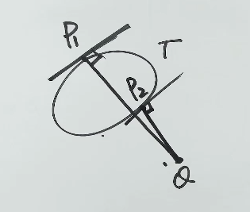
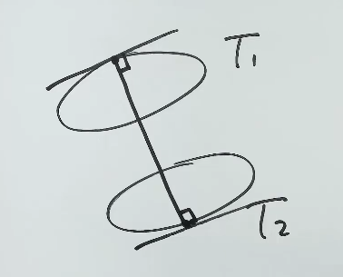

# 第13讲 条件最值与拉格朗日乘数法

> 本讲是第13讲"多元函数极值与最值"的**条件篇**(上一讲次讲的是无条件极值 + Δ 判别法)。
>
> 本讲四大块:
> 1. **条件最值的拉格朗日乘数法**(标准算法:构造辅助函数 → 求偏导 → 解方程组)
> 2. **垂线原理**(几何秒杀法,数一数二都能用,数三考纲外)
> 3. **有界闭区域上连续函数的最值问题**(内部 + 边界 + 端点全找)
> 4. **三道例题实战**:例 13.20(不封闭约束) + 例 13.21(垂线原理) + 例 13.22(全微分 + 有界闭区域)

---

## 一、条件最值的拉格朗日乘数法(标准算法)

### 1. 适用场景

> [!note] 什么时候用?
> 给定**目标函数** $u = f(x, y, z)$ 和**约束条件**(一个或多个等式):
> $$\varphi(x, y, z) = 0, \quad \psi(x, y, z) = 0$$
> 求 $f$ 在这些约束下的**最值**(不是极值)。

> 跟无条件极值的区别:
> - **无条件极值**:**没有**约束,直接对 $f$ 求偏导找可疑点 → Δ 判别
> - **条件极值**(本讲):**有**约束,求的是**最值**(不判极值,只看端点 + 边界)

### 2. 四步流程 ⚠️ 必背

> [!tip] **口诀:抄 → 列 → 解 → 比**

| 步骤 | 动作 | 关键 |
|------|------|------|
| **① 构造辅助函数** | 把目标函数 + 约束抄一遍,前面乘个拉格朗日乘数 | $\lambda, \mu$ 是**变量**,不是常数 |
| **② 列方程组** | 对每个自变量(目标函数的 + 约束的)求偏导,令其为 0 | 自变量个数 = 目标函数自变量 + 约束个数 |
| **③ 解方程组** | 求出所有可疑点 $P_i$ | 用代入 / 加减消元 |
| **④ 比函数值** | 把所有 $P_i$ 代回目标函数,取 max / min | "**不需要** δ 判别法",只看最大最小 |

### 3. 公式(标准写法)✅ 教材核对

**① 构造辅助函数:**

$$F(x, y, z, \lambda, \mu) = f(x, y, z) + \lambda \varphi(x, y, z) + \mu \psi(x, y, z)$$

**② 列方程组(共 $n + k$ 个方程, $n$ 是目标函数自变量个数, $k$ 是约束个数):**

$$\begin{cases}
F'_x = f'_x + \lambda \varphi'_x + \mu \psi'_x = 0 \\
F'_y = f'_y + \lambda \varphi'_y + \mu \psi'_y = 0 \\
F'_z = f'_z + \lambda \varphi'_z + \mu \psi'_z = 0 \\
F'_\lambda = \varphi(x, y, z) = 0 \\
F'_\mu = \psi(x, y, z) = 0
\end{cases}$$

**③ 解方程组**,得备选点 $P_i$, $i = 1, 2, \dots, n$。

**④ 比函数值**: 取其最大者为 $u_{\max}$,最小者为 $u_{\min}$。

**最后注** (教材 line 37):**根据实际问题,必存在最值,所得即为所求**——这句话是写全解答的"必加句",有这 7 分到手。

### 4. 拉格朗日乘数 $\lambda, \mu$ 是变量 ⚠️

> [!warning] 易错提醒
> 形式上,辅助函数像是"线性组合",**但** $\lambda, \mu$ **不是常数**——它们是**独立变量**。
>
> 所以辅助函数的**自变量个数 = 目标函数自变量个数 + 约束个数**:
> - 例 13.20: 目标函数 $S(a, b)$ 有 2 个自变量,1 个约束 → $F(a, b, \lambda)$ 是 **3 元函数**
> - 教材标准:目标函数 $u(x, y, z)$ 有 3 个,2 个约束 → $F(x, y, z, \lambda, \mu)$ 是 **5 元函数**

### 5. 替代法:代入消元 ✅ 教材核对

> [!tip] **如果能从约束条件里解出 $z = z(x, y)$,那就直接代入!**
>
> 1. 把 $f(x, y, z)$ 变成 $f[x, y, z(x, y)]$ → **降维**(少一个变量)
> 2. 变成**无条件最值问题** → 用上一讲次的 Δ 判别法
> 3. 适用于小步骤 / 选择题,大题往往用拉格朗日更稳

> [!warning] 实战注意
> **大题往往不奏效**——约束解不出 $z = z(x, y)$ 或者解出来很丑,还是老实写拉格朗日。

### 6. 算法流程图 ⚠️ 决策路径

```mehrmaid
flowchart TD
    A["有约束条件的最值问题<br/>目标 $f$ + 约束 $\varphi = 0$"] --> B{"约束能解出显式<br/>$z=z(x,y)$ 吗?"}
    
    B -->|"能"| C["代入消元<br/>$f \rightarrow f(x, y, z(x,y))$"]
    C --> D["降维成无条件最值<br/>求偏导 = 0 → $\Delta$ 判别法"]
    D --> E["比所有可疑点<br/>取 max / min"]
    
    B -->|"不能（大题通常走这条）"| F["拉格朗日乘数法"]
    
    F --> F1["1. 构造辅助函数<br/>$F = f + \lambda\varphi + \mu\psi$<br/>注意: $\lambda, \mu$ 是变量不是常数"]
    F1 --> F2["2. 列方程组<br/>对每个自变量求偏导 = 0<br/>方程数 = 自变量数 + 约束数"]
    F2 --> F3["3. 解方程组<br/>代入消元或加减消元<br/>得可疑点 $P_1, P_2, \ldots$"]
    F3 --> F4{"4. 约束是否封闭?"}
    
    F4 -->|"封闭：完整圆、椭圆等"| F5["直接比所有可疑点<br/>取 max / min"]
    F4 -->|"不封闭：弧段、线段等"| F6["额外加端点比较<br/>把约束的端点也代入 $f$"]
    F6 --> F5
    
    E --> G["得最大值 / 最小值"]
    F5 --> G
```

> [!tip] 流程图的三个关键分叉
> 1. **代入 vs 拉格朗日**: 能解出显式 → 代入降维；解不出 → 老实写拉格朗日
> 2. **封闭 vs 不封闭**: 封闭曲线 → 只比内部可疑点；不封闭 → **必须加端点**
> 3. **终点一致**: 不管走哪条路，最后都是**比所有候选点的函数值**，取 max/min

---

## 二、例 13.20:不封闭约束下的条件最值

### 1. 题目 ✅ 教材核对 (full.md:41)

设 $a, b$ 满足 $\displaystyle\int_a^b |x| \, dx = \frac{1}{2}$ ($a \leqslant 0, b \geqslant 0$),求曲线 $y = x^2 + ax$ 与直线 $y = bx$ 所围区域面积的**最大值和最小值**。

### 2. 翻译题目(关键)

讲课老师一步步翻译:

**(1) 翻译积分条件:**

$$\int_a^b |x| \, dx = \int_a^0 (-x) dx + \int_0^b x \, dx = \frac{1}{2}(a^2 + b^2) = \frac{1}{2}$$

所以约束条件是:

$$\boxed{a^2 + b^2 = 1, \quad a \leqslant 0, b \geqslant 0}$$

**几何含义**: $a^2 + b^2 = 1$ 是单位圆,但是因为 $a \leqslant 0, b \geqslant 0$,**只取第二象限那部分**(四分之一圆弧)。

> [!warning] 不封闭曲线 ⚠️
> 约束条件**不是完整的圆**,只是第二象限的弧段。
> 用拉格朗日乘数法后,**还必须比较两个端点** $a = -1, b = 0$ 和 $a = 0, b = 1$ 的函数值。

### 3. 求目标函数(所围面积)

**联立方程** $y = x^2 + ax = bx$:

$$x^2 + (a - b)x = 0 \implies x(x + a - b) = 0$$

**两个交点的横坐标**: $x_1 = 0$, $x_2 = b - a$。

**对应的纵坐标**:
- $x_1 = 0$ 时, $y_1 = 0$
- $x_2 = b - a$ 时, $y_2 = b(b - a) = b^2 - ab$ (这个值后面求面积时不直接用)

**面积**:

$$S = \int_0^{b-a} [bx - (x^2 + ax)] dx$$

> [!tip] 为什么不需要绝对值?
> 直线 $y = bx$ 是**斜直线**,抛物线 $y = x^2 + ax$ 是**凹曲线**(开口向上, $y'' = 2 > 0$)。
> 直观: 抛物线**在直线下方**(在交点之间),所以 $bx - (x^2 + ax) \geqslant 0$,**绝对值可省**。
>
> 另一种判断: 在 $[0, b-a]$ 上,$b - a \geqslant 0$,被积函数 $= (b - a)x - x^2 = x[(b-a) - x] \geqslant 0$。

**积分计算**:

$$S = \int_0^{b-a} [(b - a)x - x^2] dx = (b - a) \cdot \frac{x^2}{2} \bigg|_0^{b-a} - \frac{x^3}{3} \bigg|_0^{b-a}$$

$$= \frac{(b - a)^3}{2} - \frac{(b - a)^3}{3} = \frac{(b - a)^3}{6}$$

### 4. ✅ 教材核对·简化关键一步(幂函数单调性)

> [!important] 简化:**$S$ 的最值点 ≡ $(b - a)$ 的最值点** ⚠️
> 因为 $\frac{1}{6}(b - a)^3$ 在 $b - a > 0$ 时是**单调增函数**(跟 $\frac{1}{6}x^3$ 一样)。
>
> 所以求 $S$ 的最值 = 求 $S^* = b - a$ 在约束 $a^2 + b^2 = 1$ 下的最值。

**这步简化是第一讲的幂函数性质**:$y = x^3$ 在 $x > 0$ 时单调增,**最值点不变**。

### 5. 拉格朗日乘数法求解

构造辅助函数:

$$F(a, b, \lambda) = (b - a) + \lambda(a^2 + b^2 - 1)$$

求偏导,令其为 0:

$$\begin{cases}
F'_a = -1 + 2\lambda a = 0 \\
F'_b = 1 + 2\lambda b = 0 \\
F'_\lambda = a^2 + b^2 - 1 = 0
\end{cases}$$

### 6. 解方程组

由前两式相加: $2\lambda(a + b) = 0$。

- 若 $\lambda = 0$,则 $-1 = 0$ 矛盾 ❌
- 所以 $\lambda \neq 0$,只能 $a + b = 0$,即 $b = -a$

> [!tip] 这步处理很关键
> $\lambda = 0$ 会跟 $F'_a = -1$ **矛盾**,所以必然 $a + b = 0$。

代入约束: $a^2 + a^2 = 1 \implies a = \pm \frac{\sqrt{2}}{2}$。

结合 $a \leqslant 0, b \geqslant 0$:

$$a = -\frac{\sqrt{2}}{2}, \quad b = \frac{\sqrt{2}}{2}$$

此时:

$$S = \frac{1}{6}(b - a)^3 = \frac{1}{6} \left(\frac{\sqrt{2}}{2} + \frac{\sqrt{2}}{2}\right)^3 = \frac{1}{6} (\sqrt{2})^3 = \frac{1}{6} \cdot 2\sqrt{2} = \frac{\sqrt{2}}{3}$$

### 7. 比较端点(不封闭约束的必加步骤)

| 点 | $a$ | $b$ | $b - a$ | $S = \frac{(b-a)^3}{6}$ |
|----|-----|-----|---------|------------------------|
| 内部可疑点 | $-\frac{\sqrt{2}}{2}$ | $\frac{\sqrt{2}}{2}$ | $\sqrt{2}$ | $\frac{\sqrt{2}}{3}$ |
| 端点 1 | $0$ | $1$ | $1$ | $\frac{1}{6}$ |
| 端点 2 | $-1$ | $0$ | $1$ | $\frac{1}{6}$ |

### 8. 答案 ✅ 教材核对 (full.md:67)

> **最大值**: $S_{\max} = \dfrac{\sqrt{2}}{3}$ (在 $a = -\dfrac{\sqrt{2}}{2}, b = \dfrac{\sqrt{2}}{2}$ 处)
>
> **最小值**: $S_{\min} = \dfrac{1}{6}$ (在端点 $a = 0, b = 1$ 或 $a = -1, b = 0$ 处)

> [!tip] 一句话总结:例 13.20 的核心考点
> **不封闭约束条件 → 解完方程组后必须比端点**。
> 如果约束是完整圆 / 闭曲线,端点值 = 边界值,**不需要单独比**;但弧段必须比。

---

## 三、最远(近)点的垂线原理 ✅ 教材核对 (full.md:73-83)

### 1. 原理:单条曲线 + 外点

> [!important] 定理(垂线原理,单曲线版)
> 设 $\Gamma$ 是一条光滑闭曲线,点 $Q$ 是 $\Gamma$ 外的一个点,点 $P_1, P_2$ 分别是 $\Gamma$ 上**与 $Q$ 最远和最近**的点,则直线 $P_1 Q, P_2 Q$ 分别在 $P_1, P_2$ 处与 $\Gamma$ **垂直**。
>
> 即: $P_1 Q, P_2 Q$ 分别与点 $P_1, P_2$ 的切线**垂直**。

**几何含义**:
- 最远/最近点的**连线** ⊥ 曲线在该点的**切线**
- 也就是说连线方向 = 曲线的**法向量**

### 2. 原理:两条曲线之间

> [!important] 定理(垂线原理,双曲线版)
> 若光滑曲线 $\Gamma_1, \Gamma_2$ 不相交,点 $P_1, P_2$ 分别是它们之间的**最远 / 最近点**,则直线 $P_1 P_2$ 是 $\Gamma_1, \Gamma_2$ 的**公垂线**——即 $P_1 P_2$ 同时垂直于 $\Gamma_1, \Gamma_2$ 在这两个点处的切线。

**几何含义**:
- 最远/最近点的**连线** ⊥ $\Gamma_1$ 在该点的切线
- 同时 ⊥ $\Gamma_2$ 在该点的切线
- **两条曲线的切线相互平行**(都垂直于连线)

### 3. 应用前提

> [!warning] 易错提醒
> 1. **光滑** —— 曲线在该点有**切线**(否则切线方向都定不了,原理失效)
> 2. **闭曲线 / 不相交** —— 否则"最远/最近"的几何意义会变
> 3. **数三考纲外** —— 但数一数二都能用;讲课老师说"可以放心使用"

### 4. 用法

- **已知目标曲线**: 找到 $P$ 点处的**切向量 / 切线斜率**
- **已知几何对象**(直线 / 曲线): 找到它的**法向量**(因为 $P$ 到对象的连线 = 对象法向)
- **让两者垂直**(切向量 · 法向量 = 0)
- 得到 $P$ 满足的关系 → 代入曲线方程 → 求 $P$

> 这个方法比"构造拉格朗日 + 解方程组"快很多,尤其对椭圆 + 直线这种几何关系清楚的题。

---

## 四、例 13.21:椭圆到直线的最近点(双方法对比)

### 1. 题目 ✅ 教材核对 (full.md:85)

求曲线 $x^2 + 4y^2 = 4$ 上到直线 $2x + 3y - 6 = 0$ 的距离**最近**的点。

### 2. 方法一:点到直线距离公式 + 拉格朗日(数一数二通用)

#### (1) 列目标函数

点 $P(x, y)$ 到直线 $2x + 3y - 6 = 0$ 的距离:

$$d = \frac{|2x + 3y - 6|}{\sqrt{2^2 + 3^2}} = \frac{|2x + 3y - 6|}{\sqrt{13}}$$

**关键化简**: $d$ 的最值点 ≡ $d^2$ 的最值点(因为 $d \geqslant 0$, $\sqrt{\cdot}$ 单调)。

$$d^2 = \frac{1}{13}(2x + 3y - 6)^2$$

#### (2) 拉格朗日

构造辅助函数:

$$F(x, y, \lambda) = \frac{1}{13}(2x + 3y - 6)^2 + \lambda(x^2 + 4y^2 - 4)$$

求偏导:

$$\begin{cases}
F'_x = \frac{4}{13}(2x + 3y - 6) + 2\lambda x = 0 \quad (①) \\
F'_y = \frac{6}{13}(2x + 3y - 6) + 8\lambda y = 0 \quad (②) \\
F'_\lambda = x^2 + 4y^2 - 4 = 0 \quad (③)
\end{cases}$$

#### (3) 解方程组

**情况 1**: $\lambda = 0$。
则 $2x + 3y - 6 = 0$,代入 (③) 看椭圆和直线有没有交点。
实际上,直线 $2x + 3y = 6$ 和椭圆 $x^2 + 4y^2 = 4$ **不相交**(把 $y = (6 - 2x)/3$ 代入,化简得到 $\Delta < 0$),所以**无解**。

**情况 2**: $\lambda \neq 0$。
由 (①) / (②) (注意符号):

$$\frac{\frac{4}{13}(2x + 3y - 6)}{\frac{6}{13}(2x + 3y - 6)} = \frac{-2\lambda x}{-8\lambda y} = \frac{x}{4y}$$

左边 = $\frac{4}{6} = \frac{2}{3}$(注意 $(2x + 3y - 6)$ 约掉了,因为它在两端都是系数)。

所以:

$$\frac{x}{4y} = \frac{2}{3} \implies 3x = 8y \implies x = \frac{8}{3} y$$

代入 (③):

$$\left(\frac{8}{3}y\right)^2 + 4y^2 = 4 \implies \frac{64}{9} y^2 + 4 y^2 = 4 \implies \frac{100}{9} y^2 = 4 \implies y^2 = \frac{9}{25}$$

$$y_1 = \frac{3}{5}, \quad y_2 = -\frac{3}{5}$$

对应的 $x$:

$$x_1 = \frac{8}{3} \cdot \frac{3}{5} = \frac{8}{5}, \quad x_2 = -\frac{8}{5}$$

#### (4) 比距离

$$d_1 = \frac{|2 \cdot \frac{8}{5} + 3 \cdot \frac{3}{5} - 6|}{\sqrt{13}} = \frac{|\frac{16}{5} + \frac{9}{5} - \frac{30}{5}|}{\sqrt{13}} = \frac{|-1|}{\sqrt{13}} = \frac{1}{\sqrt{13}}$$

$$d_2 = \frac{|2 \cdot (-\frac{8}{5}) + 3 \cdot (-\frac{3}{5}) - 6|}{\sqrt{13}} = \frac{|-\frac{16}{5} - \frac{9}{5} - \frac{30}{5}|}{\sqrt{13}} = \frac{|-11|}{\sqrt{13}} = \frac{11}{\sqrt{13}}$$

> [!tip] 最近点是 $(x_1, y_1) = \left(\dfrac{8}{5}, \dfrac{3}{5}\right)$,最远点是 $\left(-\dfrac{8}{5}, -\dfrac{3}{5}\right)$。

### 3. 方法二:垂线原理(几何秒杀)

#### (1) 隐函数求导(求曲线斜率)

椭圆 $x^2 + 4y^2 = 4$,令 $F_1(x, y) = x^2 + 4y^2 - 4$:

$$\frac{dy}{dx} = -\frac{F_{1x}'}{F_{1y}'} = -\frac{2x}{8y} = -\frac{x}{4y}$$

直线 $2x + 3y - 6 = 0$,令 $F_2(x, y) = 2x + 3y - 6$:

$$\frac{dy}{dx} = -\frac{F_{2x}'}{F_{2y}'} = -\frac{2}{3}$$

直线**自身的法向量** $\mathbf{n} = (2, 3)$(因为直线是 $Ax + By + C = 0$,法向量就是 $(A, B)$)。

#### (2) 垂线原理:公垂线

由垂线原理(双曲线版),最近点 $P$ 处:**$P$ 到直线的垂线** ⊥ 椭圆切线 ⊥ 直线(因为直线是"另一条曲线")。

更具体: 椭圆在 $P$ 处的切向量 $\tau = (1, -\frac{x}{4y})$(取 $\frac{dx}{1} = \frac{dy}{-x/4y}$,即 $dx = 1$, $dy = -\frac{x}{4y}$)。

直线法向量 $\mathbf{n} = (2, 3)$ 是"$P$ 到直线"的方向(因为这条线就是公垂线)。

由 $\mathbf{n} \cdot \tau = 0$:

$$2 \cdot 1 + 3 \cdot \left(-\frac{x}{4y}\right) = 0 \implies 2 = \frac{3x}{4y} \implies x = \frac{8}{3} y$$

**这跟方法一得到的 $x = \frac{8}{3}y$ 一模一样**,但是**直接看斜率相等就出来**!

> [!tip] 简化记忆
> **椭圆切线斜率 = 直线法线斜率** (因为 $\tau \perp \mathbf{n}$,斜率互为负倒数)
>
> 但这里更直接: 椭圆在 $P$ 处的**法向量**应当跟**直线的法向量平行**(都是公垂线的方向)。

#### (3) 后续

代入 $x^2 + 4y^2 = 4$ 解得 $\left(\frac{8}{5}, \frac{3}{5}\right)$,跟方法一**完全一致**。

### 4. 方法对比

| | 方法一(拉格朗日) | 方法二(垂线原理) |
|---|---|---|
| **适用** | 数一、数二 | 数一(数三考纲外) |
| **步骤** | 构造辅助函数 + 解方程组 | 求斜率 → 让斜率满足垂直 → 代回 |
| **复杂度** | 计算量大,需要讨论 $\lambda = 0$ | 几何关系清楚,直接秒杀 |
| **结论** | $\left(\frac{8}{5}, \frac{3}{5}\right)$ | $\left(\frac{8}{5}, \frac{3}{5}\right)$ |

> [!tip] 实战推荐
> 凡是能**一眼看出几何对象**(椭圆、圆、直线、抛物线),**优先用垂线原理**——算得少,出错概率低。
> 几何关系不清楚(比如抽象的 $\varphi(x,y) = 0$),老实写拉格朗日。

---

## 五、有界闭区域上连续函数的最值问题 ✅ 教材核对 (full.md:151-161)

### 1. 理论依据

> [!important] 最大值与最小值定理(多元版)
> 有界闭区域 $D$ 上的**多元连续函数**,在区域 $D$ 上**一定有最大值和最小值**。
>
> 跟一元闭区间 $[a, b]$ 上的连续函数必有最值**形式完全一致**。

### 2. 求法(跟一元的对比)

> [!tip] 一元 vs 多元 类比表 ⚠️

| 一元闭区间 $[a, b]$ | 多元有界闭区域 $D$ | 说明 |
|---|---|---|
| ① 求内部可疑点: $f'(x_0) = 0$ 或不存在 | ① 求内部可疑点: $f'_x = f'_y = 0$ 或不存在 | **形式一致**,多元要两个偏导 |
| ② 直接看端点值 $f(a), f(b)$ | ② 用**拉格朗日乘数法**求**边界**上的可疑点(边界 = 约束!) | ⚠️ **多元的"端点"是"边界曲线"** |
| ③ 比所有可疑点函数值 | ③ 比所有可疑点函数值 | 一致 |

> [!important] 关键差异 ⚠️
> - 一元的"端点"是两个点 → 直接代值
> - 多元的"端点"是**整条边界曲线** → 用**拉格朗日乘数法**处理(边界 = 约束)

### 3. 三步流程(完整版)

> **① 内部**: 求 $f'_x = f'_y = 0$ 的点和偏导不存在的点
> **② 边界**: 把边界曲线作为**约束条件**,用拉格朗日求可疑点
> **③ 比大小**: 取 max / min

> 也可以用**代入消元法**: 把边界方程解出来代入 $f$,降维成无条件最值(适合椭圆 / 圆这种简单情形)。

### 4. 跟拉格朗日乘数法的关系 ⚠️

| 场景 | 用什么 |
|------|--------|
| 只有**约束**没有"有界闭区域" | 拉格朗日乘数法直接做(例 13.20) |
| 约束是**整个边界** + 要求区域内的最值 | **先内部再边界**(例 13.22) |

> 例 13.20 是"约束是第二象限弧段",不是"区域",所以**没有内部**,只解边界(弧段)就行。
> 例 13.22 是"椭圆域",**有内部 + 有边界**,**两边都要找**。

---

## 六、例 13.22:全微分还原 + 椭圆域最值

### 1. 题目 ✅ 教材核对 (full.md:163)

已知函数 $z = f(x, y)$ 的全微分 $dz = 2x \, dx - 2y \, dy$,并且 $f(1, 1) = 2$。求 $f(x, y)$ 在椭圆域 $D = \left\{(x, y) \mid x^2 + \dfrac{y^2}{4} \leqslant 1\right\}$ 上的**最大值和最小值**。

### 2. 还原 $f(x, y)$(全微分 → 函数)

由 $dz = \dfrac{\partial f}{\partial x} dx + \dfrac{\partial f}{\partial y} dy = 2x \, dx - 2y \, dy$,得:

$$\frac{\partial f}{\partial x} = 2x, \quad \frac{\partial f}{\partial y} = -2y$$

> [!important] 全微分 ↔ 偏导的口诀
> $dz$ 展开里 $dx$ 系数 = $f'_x$, $dy$ 系数 = $f'_y$。

对 $x$ 积分: $f(x, y) = x^2 + C(y)$(把 $y$ 当常数)。

再对 $y$ 求偏导: $f'_y = C'(y) = -2y \implies C(y) = -y^2 + C_0$。

所以 $f(x, y) = x^2 - y^2 + C$。

代入 $f(1, 1) = 2$:

$$1 - 1 + C = 2 \implies C = 2$$

$$\boxed{f(x, y) = x^2 - y^2 + 2}$$

### 3. 内部可疑点

$$\frac{\partial f}{\partial x} = 2x = 0, \quad \frac{\partial f}{\partial y} = -2y = 0$$

$$\implies (x, y) = (0, 0)$$

此时 $f(0, 0) = 0 - 0 + 2 = 2$。

### 4. 边界:两种方法

**椭圆边界**: $x^2 + \dfrac{y^2}{4} = 1$。

#### 方法一:代入消元(简化降维)

从边界解 $y^2 = 4(1 - x^2)$,代入:

$$z = x^2 - 4(1 - x^2) + 2 = x^2 - 4 + 4x^2 + 2 = 5x^2 - 2$$

此时 $-1 \leqslant x \leqslant 1$,求 $5x^2 - 2$ 的最值:

- 顶点: $x = 0$ 时 $z = -2$ (最小)
- 端点: $x = \pm 1$ 时 $z = 5 - 2 = 3$ (最大)

> [!tip] 这就是抛物线 $z = 5x^2 - 2$ 在 $[-1, 1]$ 上的最值——**降维成 1 元**!

#### 方法二:拉格朗日乘数法

构造辅助函数:

$$F(x, y, \lambda) = x^2 - y^2 + 2 + \lambda \left(x^2 + \frac{y^2}{4} - 1\right)$$

求偏导:

$$\begin{cases}
F'_x = 2x + 2\lambda x = 0 \\
F'_y = -2y + \frac{\lambda}{2} y = 0 \\
F'_\lambda = x^2 + \frac{y^2}{4} - 1 = 0
\end{cases}$$

**情况 1**: $1 + \lambda = 0 \implies \lambda = -1$。

此时 $-2y - \dfrac{y}{2} = 0 \implies -\dfrac{5y}{2} = 0 \implies y = 0$。

代入约束: $x^2 = 1 \implies x = \pm 1$。

得 $M_3(1, 0)$, $M_4(-1, 0)$。

**情况 2**: $1 + \lambda \neq 0$,则 $x = 0$。

由第二式 $-2y + \frac{\lambda}{2} y = y(-2 + \frac{\lambda}{2}) = 0$。

- 若 $y \neq 0$: $\lambda = 4$,跟"情况 2 前提 $\lambda \neq -1$"不冲突,代入约束 $0 + y^2/4 = 1 \implies y = \pm 2$。得 $M_1(0, 2)$, $M_2(0, -2)$。
- 若 $y = 0$ + $x = 0$: 跟约束 $0 + 0 = 1$ 矛盾,舍去。

**四个边界可疑点**:

| 点 | $(x, y)$ | $f$ 值 |
|---|---|---|
| $M_1$ | $(0, 2)$ | $0 - 4 + 2 = -2$ |
| $M_2$ | $(0, -2)$ | $0 - 4 + 2 = -2$ |
| $M_3$ | $(1, 0)$ | $1 - 0 + 2 = 3$ |
| $M_4$ | $(-1, 0)$ | $1 - 0 + 2 = 3$ |

### 5. 比所有可疑点

| 来源 | 点 | $f$ 值 |
|------|---|-------|
| 内部 | $(0, 0)$ | $2$ |
| 边界 | $(0, 2)$ | $-2$ |
| 边界 | $(0, -2)$ | $-2$ |
| 边界 | $(1, 0)$ | $3$ |
| 边界 | $(-1, 0)$ | $3$ |

### 6. 答案 ✅ 教材核对 (full.md:180)

> **最大值**: $f_{\max} = 3$ (在 $(\pm 1, 0)$ 处)
>
> **最小值**: $f_{\min} = -2$ (在 $(0, \pm 2)$ 处)

### 7. 方法对比 ✅ 教材核对

> [!tip] 实战推荐
> 椭圆 / 圆这类**代数对称**的边界方程,**优先用代入消元**(降维到 1 元),算起来比解拉格朗日方程组快。
> 只有边界是抽象 $\varphi(x,y) = 0$,或者写不出 $y = y(x)$ 的,才上拉格朗日。

---

## 七、本讲三道例题方法对照表

| 例题 | 目标函数 | 约束 | 方法 | 关键考点 |
|------|---------|------|------|---------|
| 13.20 | $S = \frac{(b-a)^3}{6}$ (面积) | $a^2 + b^2 = 1$, $a \leqslant 0, b \geqslant 0$ | 拉格朗日 + **比端点** | **不封闭曲线**,比端点是必备步骤 |
| 13.21 | $d^2 = \frac{1}{13}(2x + 3y - 6)^2$ | $x^2 + 4y^2 = 4$ | 拉格朗日 / **垂线原理** | 数一数二通用;垂线原理是几何秒杀 |
| 13.22 | $z = x^2 - y^2 + 2$ | 椭圆域 $D$ | **内部 + 边界**(代入消元) | 全微分还原 $f$;代入消元降维 |

---

## 八、本讲方法对照表(原理层)

| 题型 | 用什么 |
|------|--------|
| **无条件极值** | 求偏导 = 0 → Δ 判别法(上一讲次) |
| **条件极值**(只有约束,无区域) | 拉格朗日乘数法,**注意不封闭要加端点** |
| **有界闭区域上的最值** | **内部 + 边界**: 内部求偏导 = 0;边界拉格朗日或代入消元 |
| **垂线原理适用**(数一数二) | 几何对象清楚时**优先**,算得少 |

> [!tip] 一句话记住这一讲
> 1. **拉格朗日乘数法四步**:抄 → 列 → 解 → 比,**不需要判极值**,直接比大小
> 2. **$\lambda, \mu$ 是变量不是常数**,辅助函数自变量个数 = 目标函数自变量 + 约束个数
> 3. **不封闭约束** → 解完方程组**必须比端点**(例 13.20)
> 4. **有界闭区域** → 内部找 + 边界找,缺一不可(例 13.22)
> 5. **垂线原理**(数一): 最远 / 最近点的连线 ⊥ 曲线在该点的切线;**两曲线**时是公垂线(两边切线都垂直)
> 6. **垂线原理实战**: 椭圆 + 直线 → 椭圆切线斜率 = 直线法线方向 → 秒杀例 13.21
