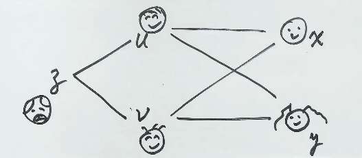
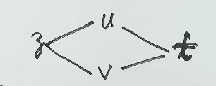

# 第13讲 多元函数微分学（续篇：链式求导规则 · 高阶偏导 · 换元反求）

> 本讲是第13讲"换元反求与可微"的**姐妹篇**。核心任务:**把一元链式求导的"祖孙三代"规则彻底搬到多元**,并解决多元里特有的两个记号坑:① 中间位置用 $1, 2$ 编号;② 复合函数求高阶导时**结构不变**。
>
> 本讲三大块:
> 1. **链式求导规则**(祖孙三代类比 + 偏导/全导)
> 2. **高阶偏导中复合结构不变性**(例 13.9)
> 3. **复合函数记号: $f_1'$ vs $f_x'$**(例 13.10) + **换元反求参数**(例 13.11)

---

## 一、链式求导规则:一元 → 多元的"一脉相承 + 创新"

### 1. 一元情况(复习 + 引子)

> [!note] 类比一元: 链式求导 = "**一层一层剥开他的心**"

如果 $y = f[g(x)]$,则
$$\frac{dy}{dx} = \frac{dy}{dg}\cdot \frac{dg}{dx}$$
**含义**:对自变量 $x$ 求导,先对**中间变量 $g$** 求导,再乘上 $g$ 对 $x$ 求导。两层就是两个因子相乘。

### 2. 多元情况:祖孙三代登场

> [!tip] 老师核心比喻:**祖孙三代——爷爷对每个孩子的爱是不变的** 🎯
>
> | 角色 | 现实身份 | 函数地位 |
> |------|----------|----------|
> | **爷爷** | $z$ | 因变量(出钱方) |
> | **爸妈** | $u, v$ | 中间变量(传话方) |
> | **孙子孙女** | $x, y$ | 自变量(花钱方) |

**故事**: 爷爷对孙子孙女花钱的"**消耗率**" = 爷爷对爸妈花钱的消耗率 × 爸妈对孙辈花钱的消耗率。

但注意: **一个爷爷有多个孙子孙女**时, 爷爷"**偏心**"——他只往一个方向花钱时, 写**偏导数**;两个方向**都**花时, 是**导数之和**。

### 3. 严格公式

设 $z = f(u, v)$, $u = \varphi(x, y)$, $v = \psi(x, y)$, 则
$$\boxed{\frac{\partial z}{\partial x} = \frac{\partial z}{\partial u}\frac{\partial u}{\partial x} + \frac{\partial z}{\partial v}\frac{\partial v}{\partial x}, \quad \frac{\partial z}{\partial y} = \frac{\partial z}{\partial u}\frac{\partial u}{\partial y} + \frac{\partial z}{\partial v}\frac{\partial v}{\partial y}}$$

**结构记忆法**:
- 从 $z$ 走到 $x$ 有**几条路**(几分叉),就**几项相加**——分叉 = 偏导
- 每条路**有几段**(从 z 到 u 再到 x 这种),就**几个因子相乘**——链长 = 乘积

### 4. 特殊情况:**全导数**(一条路 + 一人专享)

> [!warning] 当**两个中间变量都只服务一个自变量 $t$** 时:
> - 中间变量之间**不分叉**——分叉=0,所以只有"加 0 项"或干脆不用分叉
> - 自变量那边**不分心**——写**全导数**(导数,不带"偏"字)
> - 几何含义:爷爷**全心全意**给这唯一一个孙子花钱

设 $z = f(u, v)$, $u = \varphi(t)$, $v = \psi(t)$, 则
$$\frac{dz}{dt} = \frac{\partial z}{\partial u}\frac{du}{dt} + \frac{\partial z}{\partial v}\frac{dv}{dt}$$

**注意**:左边是 $\dfrac{dz}{dt}$(全导数),右边**两个偏导**——这是"分叉"的体现,虽然只有一个自变量。

> [!tip] 口诀
> - **分叉 + 分心** = 偏导数(左右都带 $\partial$)
> - **不分叉 + 不分心** = 全导数($\dfrac{dz}{dt}$,一面 $\dfrac{d}{dt}$)
> - **分叉 + 不分心** = 上述全导数公式(**最常考**,例 13.10 重点)

### 5. 高阶导中复合结构不变性(考点)

> [!important] 无论 $z$ 对哪个变量求导,也不论 $z$ 已经求了几阶导, **求导后的新函数仍然具有与原函数完全相同的复合结构**。

**口诀**: 爷爷对孩子的热情**无条件的**, 无论给了谁、给了多少次, 复合结构图**永远不变**。

**实战意义**: 求二阶偏导 $\dfrac{\partial^2 z}{\partial x \partial y}$ 时:
- 先把 $\dfrac{\partial z}{\partial x}$ 算出来(它还是 $u, v$ 的函数, $u, v$ 仍是 $x, y$ 的函数)
- 再对 $y$ 求导时, 复合结构图**原样复用**——把 $f_1', f_2'$ 当作"**新爷爷**"继续往下走

---

## 二、例 13.9:二阶混合偏导(结构不变性实战)

### 1. 题目

设 $z = f(e^x \sin y,\; x^2 + y^2)$, 其中 $f$ 具有二阶连续偏导数, $f_1'(0, 0) = 1$, $f_2'(0, 0) = -1$, 则
$$\left.\frac{\partial^2 z}{\partial x \partial y}\right|_{(0, 0)} = \;(\quad)$$

> **教材答案 (full.md:45-53)**: 应选 **(B) 1**。备选: (A) 0, (C) 2, (D) -1。✅ 已核对

### 2. 复合结构图(关键)

> 手绘祖孙三代结构图 —— **爷爷偏心**: 大胡子爷爷 $f$ 给两个中间位置(爸妈)花钱,爸妈**互相穿过**对 $x$、$y$ 都有路径(图中 X 形交叉),$x$、$y$ 后面是"孙辈"(笑脸/小猫)。

<svg xmlns="http://www.w3.org/2000/svg" viewBox="0 0 700 250" style="background:#faf8f0;border:1px solid #ddd;border-radius:8px;display:block;margin:12px auto;font-family:'Kaiti','楷体',serif;">
  <defs>
    <marker id="arr" viewBox="0 0 10 10" refX="9" refY="5" markerWidth="7" markerHeight="7" orient="auto">
      <path d="M0,0 L10,5 L0,10 z" fill="#222"/>
    </marker>
    <marker id="arrThin" viewBox="0 0 10 10" refX="9" refY="5" markerWidth="6" markerHeight="6" orient="auto">
      <path d="M0,0 L10,5 L0,10 z" fill="#444"/>
    </marker>
  </defs>

  <!-- ===== 左：爷爷 f 框(竖长方形,虚线) ===== -->
  <rect x="20" y="80" width="160" height="100" rx="6" fill="none" stroke="#222" stroke-width="2.5" stroke-dasharray="6,4"/>
  <text x="100" y="70" text-anchor="middle" font-size="22" fill="#222" font-style="italic">f</text>
  <text x="100" y="200" text-anchor="middle" font-size="14" fill="#666">爷爷</text>
  <!-- 框内单行写完整函数: z = f(e^x sin y, x²+y²) -->
  <text x="100" y="138" text-anchor="middle" font-size="14" fill="#222" font-style="italic">z = f(<tspan fill="#c0392b">e<tspan baseline-shift="super" font-size="10">x sin y</tspan></tspan>, <tspan fill="#c0392b">x² + y²</tspan>)</text>
  <!-- 框下方两个小星号(占位,具体含义待确认) -->
  <text x="100" y="194" text-anchor="middle" font-size="10" fill="#999">**</text>

  <!-- ===== 爷爷伸出 > 形两叉,指向两个表达式 ===== -->
  <!-- 上分支: 爷爷右上 → e^x sin y 左上 -->
  <line x1="180" y1="110" x2="220" y2="55" stroke="#222" stroke-width="2.5" marker-end="url(#arr)"/>
  <!-- 下分支: 爷爷右下 → x²+y² 左下 -->
  <line x1="180" y1="150" x2="220" y2="195" stroke="#222" stroke-width="2.5" marker-end="url(#arr)"/>

  <!-- ===== 中间：两个表达式(爸妈, 中间变量) ===== -->
  <!-- 1号位置: 在 e^x sin y 正上方 -->
  <text x="270" y="32" text-anchor="middle" font-size="13" fill="#c0392b" font-weight="bold">1号位置</text>
  <text x="270" y="62" text-anchor="middle" font-size="18" fill="#222" font-style="italic">e<tspan baseline-shift="super" font-size="12">x sin y</tspan></text>

  <!-- 2号位置: 在 x²+y² 正下方 -->
  <text x="270" y="185" text-anchor="middle" font-size="18" fill="#222" font-style="italic">x² + y²</text>
  <text x="270" y="210" text-anchor="middle" font-size="13" fill="#c0392b" font-weight="bold">2号位置</text>

  <!-- ===== X 形交叉(分段:在文字附近中断,避免贴边穿出) ===== -->
  <!-- 上半:左上 → 文字左上 -->
  <line x1="350" y1="75" x2="395" y2="113" stroke="#222" stroke-width="2.5"/>
  <!-- 上半:文字右上 → 右上 -->
  <line x1="421" y1="135" x2="465" y2="170" stroke="#222" stroke-width="2.5"/>
  <!-- 下半:左下 → 文字左下 -->
  <line x1="350" y1="170" x2="395" y2="138" stroke="#222" stroke-width="2.5"/>
  <!-- 下半:文字右下 → 右下 -->
  <line x1="421" y1="115" x2="465" y2="75" stroke="#222" stroke-width="2.5"/>
  <!-- (老的分支交叉白底+文字已下移到 svg 末尾,确保压住 X 线) -->

  <!-- ===== 最右：x + 笑脸, y + 小猫 ===== -->
  <!-- x + 笑脸 -->
  <line x1="465" y1="75" x2="500" y2="75" stroke="#222" stroke-width="2" marker-end="url(#arrThin)"/>
  <text x="515" y="82" font-size="20" fill="#222" font-style="italic">x</text>
  <g transform="translate(552,75)">
    <circle cx="0" cy="0" r="14" fill="none" stroke="#222" stroke-width="2"/>
    <circle cx="-5" cy="-3" r="1.5" fill="#222"/>
    <circle cx="5" cy="-3" r="1.5" fill="#222"/>
    <path d="M-6,4 Q0,9 6,4" fill="none" stroke="#222" stroke-width="1.8" stroke-linecap="round"/>
  </g>

  <!-- y + 小猫 -->
  <line x1="465" y1="170" x2="500" y2="170" stroke="#222" stroke-width="2" marker-end="url(#arrThin)"/>
  <text x="515" y="177" font-size="20" fill="#222" font-style="italic">y</text>
  <g transform="translate(552,170)">
    <path d="M-12,4 Q-14,-13 -8,-11 L-3,-7 L3,-7 L8,-11 Q14,-13 12,4 Q12,12 0,12 Q-12,12 -12,4 Z"
          fill="none" stroke="#222" stroke-width="2" stroke-linejoin="round"/>
    <circle cx="-4" cy="-2" r="1.3" fill="#222"/>
    <circle cx="4" cy="-2" r="1.3" fill="#222"/>
    <path d="M-2,4 L-1,5 L1,5 L2,4" fill="none" stroke="#222" stroke-width="1.5" stroke-linecap="round"/>
  </g>

  <!-- ===== 底部图例 ===== -->
  <text x="350" y="263" text-anchor="middle" font-size="12" fill="#666" font-style="italic">
    复合结构图 · 祖孙三代 · 爷爷偏心 → 偏导
  </text>

  <!-- "分支交叉"深色加粗字(白底矩形,最后画以确保盖住X线) -->
  <rect x="392" y="113" width="32" height="24" rx="3" fill="#faf8f0" stroke="#888" stroke-width="0.5"/>
  <text x="408" y="129" text-anchor="middle" font-size="12" fill="#444" font-weight="bold">分支交叉</text>
</svg>
### 3. 记号约定 ⚠️(必背)

| 场景 | 记号 | 含义 |
|------|------|------|
| **非复合** $z = f(x, y)$ | $f_x'(x, y)$ | 对第 1 个变量 $x$ 求偏导 |
| **复合** $z = f(u, v)$ | $f_1'$ | 对**第 1 个位置**求导(与位置里是什么无关) |
| | $f_2'$ | 对**第 2 个位置**求导 |
| | $f_{11}''$ | 对**第 1 个位置**求**二阶**导 |
| | $f_{12}''$ | 先对 1 号位求导再对 2 号位求导 |

> [!important] 核心区分
> - **位置 ≠ 变量**: $f_1'$ 是对"**第 1 个位置**"求导, 不管位置里填的是 $e^x \sin y$ 还是 $\cos x$ 还是别的, **这一步不变**
> - **下一步才体现** "位置里是什么": 才会出现 $e^x \cos y$ 之类的具体导数
> - 在简单情形下, 有时也写成 $f_x', f_y'$, 但**严格说**这只用于"无复合"或"对自变量求导"的场合

### 4. 求解过程

> **教材核对 (full.md:122-130)**: ✅ 已核对,所有公式与教材一致。

**第一步**:对 $x$ 求一阶偏导(分叉 = 两项相加)

$$\frac{\partial z}{\partial x} = f_1' \cdot e^x \sin y + f_2' \cdot 2x$$

**第二步**:对 $y$ 求二阶偏导(复合结构不变——把 $f_1', f_2'$ 当新爷爷)

$$\frac{\partial^2 z}{\partial x \partial y} = \frac{\partial}{\partial y}\big(f_1' \cdot e^x \sin y\big) + \frac{\partial}{\partial y}\big(f_2' \cdot 2x\big)$$

$$= \underbrace{\frac{\partial f_1'}{\partial y}}_{f_1' \text{对 }y\text{ 走祖孙路}} \cdot e^x \sin y + f_1' \cdot e^x \cos y + 2x \cdot \underbrace{\frac{\partial f_2'}{\partial y}}_{f_2' \text{对 }y\text{ 走祖孙路}}$$

**第三步**:对 $f_1', f_2'$ 各自再展开链式求导

$$\frac{\partial f_1'}{\partial y} = f_{11}'' \cdot e^x \cos y + f_{12}'' \cdot 2y$$

$$\frac{\partial f_2'}{\partial y} = f_{21}'' \cdot e^x \cos y + f_{22}'' \cdot 2y$$

**第四步**:代入(完整展开)

$$\frac{\partial^2 z}{\partial x \partial y} = e^{2x} \sin y \cos y \cdot f_{11}'' + 2e^x(y \sin y + x \cos y) \cdot f_{12}'' + 4xy \cdot f_{22}'' + e^x \cos y \cdot f_1'$$

### 5. 秒杀答案(代 $(0,0)$ 后的化简)

> [!tip] 代入 $(0, 0)$ 后的关键观察
> - $e^x \to 1$
> - $\sin y, y \to 0$ (因为 $y = 0$)
> - $2x \to 0$ (因为 $x = 0$)
> - $\cos y \to 1$
>
> → **绝大多数项**都被 $\sin 0 = 0$ 或 $2x = 0$ 干掉了
> → 只剩 $e^x \cos y \cdot f_1' = 1 \cdot 1 \cdot f_1' = f_1'$

$$\left.\frac{\partial^2 z}{\partial x \partial y}\right|_{(0, 0)} = f_1'(0, 0) = \boxed{1}$$

**答案: (B)**

> [!warning] 易错提醒
> - 不要把 $f_2'(0, 0) = -1$ 也代进去——它前面**乘着 $2x$**, 在 $x=0$ 处**整项消失**!
> - $f_{12}''$ 项前面**乘着 $y$ 或 $x$**——在 $(0,0)$ 处也消失
> - 老师吐槽: "客观题可以这么偷懒, 主观题老老实实展开"

### 6. 一句话总结

> **祖孙三代结构不变** + **代入特殊点时多数项消失** = 秒杀客观题。

---

## 三、例 13.10:复合函数记号坑(对位置求导 vs 对自变量求导)

### 1. 题目

设函数 $f(x, e^x) = x + e^x$, 且 $f_x'(x, y)\big|_{y=e^x} = 1 + 2e^x$, 则 $f_y'(x, y)\big|_{y=e^x} =$ \_\_\_\_.

> **教材答案 (full.md:139)**: 应填 $\mathbf{-1}$。✅ 已核对

### 2. 复合结构图 + 求导时序(关键 ⚠️)

> [!danger] **最易错**的认知: "左边 $f(x, e^x) = x + e^x$, 所以 $f(x, y) = x + y$" ❌❌❌
>
> 这是**陷阱**! $f$ 的具体形式**不能从它自己确定**——必须**严格按照复合结构图**,配合下面的已知条件反推。
<svg xmlns="http://www.w3.org/2000/svg" viewBox="0 0 560 250" style="background:#faf8f0;border:1px solid #ddd;border-radius:8px;display:block;margin:12px auto;font-family:'Kaiti','楷体',serif;">
  <defs>
    <marker id="arr" viewBox="0 0 10 10" refX="9" refY="5" markerWidth="7" markerHeight="7" orient="auto">
      <path d="M0,0 L10,5 L0,10 z" fill="#222"/>
    </marker>
  </defs>

  <!-- ===== 左:爷爷 f(直接一个斜体字母,跟示例图同款) ===== -->
  <text x="60" y="135" text-anchor="middle" font-size="34" fill="#222" font-style="italic">f</text>

  <!-- ===== 中:1号位 x(上) + 2号位 e^x(下) ===== -->
  <!-- 1号位置标签(上方) -->
  <text x="240" y="50" text-anchor="middle" font-size="13" fill="#c0392b" font-weight="bold">1号位置</text>
  <!-- 1号位 x 方框 -->
  <rect x="210" y="70" width="60" height="42" rx="4" fill="#fff" stroke="#222" stroke-width="2"/>
  <text x="240" y="100" text-anchor="middle" font-size="22" fill="#222" font-style="italic">x</text>

  <!-- 2号位置标签(下方) -->
  <text x="240" y="220" text-anchor="middle" font-size="13" fill="#c0392b" font-weight="bold">2号位置</text>
  <!-- 2号位 e^x 方框 -->
  <rect x="210" y="145" width="60" height="42" rx="4" fill="#fff" stroke="#222" stroke-width="2"/>
  <text x="240" y="175" text-anchor="middle" font-size="20" fill="#222" font-style="italic">e<tspan baseline-shift="super" font-size="13">x</tspan></text>

  <!-- ===== 4 条箭头(菱形钻石结构) ===== -->
  <!-- 左半:f → 1号位 x(斜上) -->
  <line x1="95" y1="120" x2="205" y2="90" stroke="#222" stroke-width="2" marker-end="url(#arr)"/>
  <!-- 左半:f → 2号位 e^x(斜下) -->
  <line x1="95" y1="150" x2="205" y2="168" stroke="#222" stroke-width="2" marker-end="url(#arr)"/>

  <!-- 右半:1号位 x → 右端 x(斜下) -->
  <line x1="270" y1="90" x2="455" y2="120" stroke="#222" stroke-width="2" marker-end="url(#arr)"/>
  <!-- 右半:2号位 e^x → 右端 x(斜上) -->
  <line x1="270" y1="168" x2="455" y2="150" stroke="#222" stroke-width="2" marker-end="url(#arr)"/>

  <!-- ===== 右:自变量 x ===== -->
  <text x="480" y="138" text-anchor="middle" font-size="34" fill="#222" font-style="italic">x</text>
</svg>

**已知信息**:
1. $f(x, e^x) = x + e^x$ — 只知道在**第 2 个位置填 $e^x$** 时, 输出是 $x + e^x$
2. $f_x'(x, y)\big|_{y=e^x} = 1 + 2e^x$ — 知道 $f$ 对**第 1 个位置**求导后, 在 $y = e^x$ 处的值

### 3. 求解(链式求导规则 + 全导数)

> **教材核对 (full.md:141-147)**: ✅ 已核对,公式与教材一致。

左边是 $f(x, e^x)$, 把它看作 $t$ 的函数, **两边对 $x$ 求导**:

$$\frac{d[f(x, e^x)]}{dx} = \frac{d[x + e^x]}{dx} = 1 + e^x$$

右边按**链式求导规则**(全导数, $f$ 对 $x$ 走两条路):

$$\frac{d[f(x, e^x)]}{dx} = f_x'(x, y)\big|_{y=e^x} \cdot 1 + f_y'(x, y)\big|_{y=e^x} \cdot e^x$$

$$= (1 + 2e^x) + f_y'(x, y)\big|_{y=e^x} \cdot e^x$$

**联立**:
$$1 + e^x = (1 + 2e^x) + f_y'(x, y)\big|_{y=e^x} \cdot e^x$$

解得:
$$\boxed{f_y'(x, y)\big|_{y=e^x} = -1}$$

### 4. 记号辨析(老师反复强调) ⚠️

> [!important] 关键易错点
> - $f_x'(x, y)\big|_{y=e^x}$ **不是** "把 $y = e^x$ 代入 $f_x'$ 后再求导"
> - 它**就是** $f_x'(x, e^x)$ — 即"第 1 个位置求导的结果在第 2 个位置填 $e^x$ 处的值"
> - **求导在前, 代入在后** — 但这**两步是分开写的**, 数学上等价于"先求导, 再把 $y$ 换成 $e^x$"
>
> **口诀**: $f_y'(x, \square)$ 是对第 2 个位置求导, 把 $\square$ 当作"门后的人"——求导时**不管门后是谁**, 关上求, 下一步才看门后。

### 5. 抽象类比(更复杂的写法)

> [!note] **同结构不变性**: $f_1'$ 只对"**第 1 个位置**"求导, 跟第 1 个位置里是什么**完全无关**。
> 例如, $f$ 后面是 $x$ 或 $x^2$ 或 $\cos x$ 或 $\sin x$, $f_1'$ 这**一步结果都不变**;**改变的是下一步**——"位置里的具体表达式"对 $x$ 求导时, 才有差异($\cos x$、$2x$、$-\sin x$、$\cos x$)。

| 第 1 位置 | $f_1'$(对位置求导) | 位置对 $x$ 求导 |
|----------|--------------------|----------------|
| $x$ | $f_1'$ | $1$ |
| $x^2$ | $f_1'$(不变) | $2x$ |
| $\cos x$ | $f_1'$(不变) | $-\sin x$ |

**实战意义**: 写公式时**先写对位置求导部分**, **最后才代入具体函数**。

### 6. 一句话总结

> 求 $f$ 对 $x$ 求导 = $f$ 对**位置**求导(永远不变) × 位置对 $x$ 求导(由具体函数决定)。**记号看清、求导顺序看清, 别管"门后是谁"。**

---

## 四、例 13.11:换元反求参数(链式求导综合应用)

### 1. 题目

设对任意的 $x, y$ 有 $\left(\dfrac{\partial f}{\partial x}\right)^2 + \left(\dfrac{\partial f}{\partial y}\right)^2 = 4$, 用变量代换 $x = uv$, $y = \dfrac{u^2 - v^2}{2}$ 将函数 $f(x, y)$ 变换成函数 $g(u, v)$, 且满足关系式
$$a\left(\frac{\partial g}{\partial u}\right)^2 - b\left(\frac{\partial g}{\partial v}\right)^2 = u^2 + v^2$$
求 $a, b$.

> **教材答案 (full.md:177)**: $a = \dfrac{1}{4}$, $b = -\dfrac{1}{4}$。✅ 已核对

### 2. 复合结构图(祖孙三代 · 同款 13.9 风格)

> 这道题的复合结构和 **例 13.9 几乎一样** —— 爷 $f$ → 爸 $x, y$ → 孙 $u, v$,只是变量名不同。**关键差异**:这里**"换元"是反着求**(已知 $g$ 的关系,反推参数),不是正向求导。

<svg xmlns="http://www.w3.org/2000/svg" viewBox="0 0 560 260" style="background:#faf8f0;border:1px solid #ddd;border-radius:8px;display:block;margin:12px auto;font-family:'Kaiti','楷体',serif;">
  <defs>
    <marker id="arr" viewBox="0 0 10 10" refX="9" refY="5" markerWidth="7" markerHeight="7" orient="auto">
      <path d="M0,0 L10,5 L0,10 z" fill="#222"/>
    </marker>
  </defs>

  <!-- ===== 左:爷爷 f(直接一个斜体字母,跟 13.9 同款) ===== -->
  <text x="60" y="135" text-anchor="middle" font-size="34" fill="#222" font-style="italic">f</text>

  <!-- ===== 中:1号位 x(上) + 2号位 y(下) ===== -->
  <text x="240" y="50" text-anchor="middle" font-size="13" fill="#c0392b" font-weight="bold">1号位置</text>
  <text x="240" y="100" text-anchor="middle" font-size="22" fill="#222" font-style="italic">x</text>
  <text x="240" y="175" text-anchor="middle" font-size="22" fill="#222" font-style="italic">y</text>
  <text x="240" y="220" text-anchor="middle" font-size="13" fill="#c0392b" font-weight="bold">2号位置</text>

  <!-- ===== 右:孙辈 u(上)、v(下) —— 13.11 跟 13.10/13.9 不同的关键:u, v 都依赖 x, y,所以是蝴蝶结/沙漏形 ===== -->
  <text x="490" y="100" text-anchor="middle" font-size="22" fill="#222" font-style="italic">u</text>
  <text x="490" y="175" text-anchor="middle" font-size="22" fill="#222" font-style="italic">v</text>
  <text x="490" y="220" text-anchor="middle" font-size="11" fill="#888" font-style="italic">自变量</text>

  <!-- ===== 6 条边(蝴蝶结/沙漏结构,跟示例图完全同款) ===== -->
  <!-- ① f → x(斜上) -->
  <line x1="95" y1="120" x2="225" y2="92" stroke="#222" stroke-width="2" marker-end="url(#arr)"/>
  <!-- ② f → y(斜下) -->
  <line x1="95" y1="150" x2="225" y2="170" stroke="#222" stroke-width="2" marker-end="url(#arr)"/>

  <!-- ③ x → u(水平,上沿) -->
  <line x1="258" y1="92" x2="475" y2="92" stroke="#222" stroke-width="2" marker-end="url(#arr)"/>
  <!-- ④ y → v(水平,下沿) -->
  <line x1="258" y1="170" x2="475" y2="170" stroke="#222" stroke-width="2" marker-end="url(#arr)"/>

  <!-- ⑤ x → v(交叉斜下,蝴蝶结的右下分支) -->
  <line x1="258" y1="100" x2="475" y2="160" stroke="#222" stroke-width="2" marker-end="url(#arr)"/>
  <!-- ⑥ y → u(交叉斜上,蝴蝶结的右上分支) -->
  <line x1="258" y1="160" x2="475" y2="100" stroke="#222" stroke-width="2" marker-end="url(#arr)"/>

  <!-- ===== 底部图例(13.9 同款:单行斜体灰字) ===== -->
  <text x="280" y="252" text-anchor="middle" font-size="11" fill="#666" font-style="italic">
    复合结构图 · 祖孙三代 · 蝴蝶结形 —— u, v 都依赖 x, y(都经过交叉)
  </text>
</svg>

**变量代换**(这是 13.11 区别于 13.9 的地方):

$$\begin{cases} x = uv \\ y = \dfrac{u^2 - v^2}{2} \end{cases}$$

**结构图告诉我们的**:**求 $\dfrac{\partial g}{\partial u}$ 时走两条路**——从 $u$ 出发,经过 $x = uv$ 这条路走 $v$ 因子,经过 $y = \frac{u^2-v^2}{2}$ 这条路走 $u$ 因子:

$$\frac{\partial g}{\partial u} = \frac{\partial f}{\partial x} \cdot \underbrace{\frac{\partial x}{\partial u}}_{v} + \frac{\partial f}{\partial y} \cdot \underbrace{\frac{\partial y}{\partial u}}_{u}$$

### 3. 思路

> [!tip] **核心策略**: 已知 $g$ 的关系, 反求参数 $a, b$。**把 $g$ 的偏导用 $f$ 的偏导表示**, 代入关系式, 让等式**对所有 $u, v$ 恒成立**, 解出 $a, b$。

### 3. 求解

**第一步**:把 $g(u, v)$ 写成 $f$ 的复合

$$g(u, v) = f\left(uv,\; \frac{u^2 - v^2}{2}\right)$$

**第二步**:用链式求导(全导数, 对 $u$ 求导分两条路)

$$\frac{\partial g}{\partial u} = \frac{\partial f}{\partial x} \cdot v + \frac{\partial f}{\partial y} \cdot u$$

$$\frac{\partial g}{\partial v} = \frac{\partial f}{\partial x} \cdot u - \frac{\partial f}{\partial y} \cdot v$$

**第三步**:代入关系式

$$a\left(\frac{\partial f}{\partial x} v + \frac{\partial f}{\partial y} u\right)^2 - b\left(\frac{\partial f}{\partial x} u - \frac{\partial f}{\partial y} v\right)^2 = u^2 + v^2$$

展开整理得(✅ 已与教材 full.md:168 对照):
$$(a v^2 - b u^2)\left(\frac{\partial f}{\partial x}\right)^2 + 2(a + b)uv \frac{\partial f}{\partial x}\frac{\partial f}{\partial y} + (a u^2 - b v^2)\left(\frac{\partial f}{\partial y}\right)^2 = u^2 + v^2$$

**第四步**:利用条件 $\left(\dfrac{\partial f}{\partial x}\right)^2 + \left(\dfrac{\partial f}{\partial y}\right)^2 = 4$, 把 $\left(\dfrac{\partial f}{\partial y}\right)^2 = 4 - \left(\dfrac{\partial f}{\partial x}\right)^2$ 代入

整理后得(✅ 已与教材 full.md:174 对照):
$$(a + b)(v^2 - u^2)\left(\frac{\partial f}{\partial x}\right)^2 + 2(a + b)uv \frac{\partial f}{\partial x}\frac{\partial f}{\partial y} + 4(a u^2 - b v^2) = u^2 + v^2$$

**第五步**:对比系数, 解出 $a, b$

要使等式对**所有** $u, v$ 和所有满足条件的 $f$ 成立:

| 项 | 系数 | 必须为 |
|----|------|--------|
| $\left(\frac{\partial f}{\partial x}\right)^2$ 前 | $(a + b)(v^2 - u^2)$ | 不可能恒为 0(因为 $u, v$ 任取) → 系数 $a + b = 0$ |
| $uv$ 交叉项 | $2(a + b)$ | $a + b = 0$(同上) |
| $u^2$ 系数 | $4a$ | $4a = 1$ → $a = \dfrac{1}{4}$ |
| $v^2$ 系数 | $-4b$ | $-4b = 1$ → $b = -\dfrac{1}{4}$ |

### 4. 最终答案

$$\boxed{a = \frac{1}{4}, \quad b = -\frac{1}{4}}$$

> [!warning] 易错提醒
> - 逐字稿中"老师最后说 $a=1/4$, $b=1/(-4)$"——和教材一致($b = -1/4$),**别看错符号**
> - 关键是**先定 $a + b = 0$**,再分头解 $4a = 1$ 和 $-4b = 1$。**千万别**先解出一个再代

### 5. 一句话总结

> **链式求导展开** + **代入已知条件** + **对比系数** = 偏微分方程参数反求三步走。

---

## 五、本讲总结:链式求导"四件套"速查

| 场景                                           | 公式                                                                                                                                                             | 关键                   |
| -------------------------------------------- | -------------------------------------------------------------------------------------------------------------------------------------------------------------- | -------------------- |
| **多元→多元** ($z = f(u,v)$, $u, v$ 是 $x, y$ 函数) | $\dfrac{\partial z}{\partial x} = \dfrac{\partial z}{\partial u}\dfrac{\partial u}{\partial x} + \dfrac{\partial z}{\partial v}\dfrac{\partial v}{\partial x}$ | 分叉 → 偏导;分心 → 偏导      |
| **多元→一元** ($z = f(u,v)$, $u, v$ 都是 $t$ 函数)   | $\dfrac{dz}{dt} = \dfrac{\partial z}{\partial u}\dfrac{du}{dt} + \dfrac{\partial z}{\partial v}\dfrac{dv}{dt}$                                                 | 分叉 → 偏导;一心 → 全导      |
| **记号** $z = f(u, v)$                         | $f_1', f_2', f_{11}'', f_{12}'',f_x', f_y'$                                                                                                                    | 对**位置**求导, 与位置里是什么无关 |
| **结构不变性**                                    | 求完导后 $f_1', f_2'$ 仍按原结构走                                                                                                                                       | 祖孙三代, 爷爷热情不变         |
| **路径数 = 项数**                                 | 几条路就几项相加                                                                                                                                                       | 类比概率论的加法原理           |
| **链段数 = 乘数**                                 | 一条路有几段就几个因子相乘                                                                                                                                                  | 类比概率论的乘法原理           |

---

> **一句话记住这一讲**:
> - 链式求导 = **祖孙三代**——**分叉用偏、不分叉用全**;**有几条路几项相加, 每条路几段几项相乘**
> - 高阶偏导 = **爷爷热情不变**, 求完导**复合结构图原样复用**
> - 记号坑 = **$f_1'$ 对位置、$f_x'$ 对自变量**, 严格区分
> - 换元反求 = **链式展开 + 代入条件 + 对比系数**, 关键**先定 $a+b=0$**
