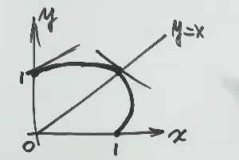

# 第14讲 二重积分(第四节:极坐标系下的计算)

> 本节对应教材 **§2 极坐标系下的计算方法**(full.md:23-109)
>
> 上一节讲了二重积分的**直角坐标系计算**(X 型 / Y 型 + 四句话定限)。本节进入**三大方法中的第二个——极坐标**。
>
> 本节四大块:
> 1. **极坐标的标志**:用圆弧 + 射线切"扇形丁",$d\sigma = r\,dr\,d\theta$ **(注意多一个 $r$)**
> 2. **直角 ↔ 极坐标转换桥梁**:$x = r\cos\theta,\ y = r\sin\theta$ + $x^2+y^2 = r^2$
> 3. **极坐标选择的两条硬规则**(教材原话)+ **三类位置公式**(极点 O 在 D 外 / 边界上 / 内部)
> 4. **两道例题**:例 14.8(圆域 + 轮换对称性化简) + 例 14.9(非圆边界 + 描点法画图 + 极坐标 + 凑微分)

---

## 一、极坐标的标志:多出来的那个 $r$

> 教材原话(full.md:37):"则有 $d\sigma = dr \cdot r\,d\theta = r\,dr\,d\theta$,近似看成矩形."

### 1. 物理图像:扇形丁(不是矩形)
![[二重积分极坐标系的计算-1783578725065.webp|317]]
直角坐标系用**平行坐标轴**的网格线切——切出来是**矩形**([土豆丁](AI课程总结/基础篇/第14讲/二重积分直角坐标系的计算.md#1%20物理图像%20切土豆丁))。
极坐标系用 **$r = r_0$ 圆弧 + $\theta = \theta_0$ 射线** 两族曲线切——切出来近似是**扇形**(扇形丁)。

| 维度 | 切的工具 | 切出来的小块 | 标志写法 |
|------|---------|------------|----------|
| 直角坐标 | 平行坐标轴的直线 | 矩形 | $d\sigma = dx\,dy$ |
| **极坐标** | **$r=r_0$ 圆弧 + $\theta=\theta_0$ 射线** | **扇形** | $d\sigma = r\,dr\,d\theta$ ⚠️ **多一个 $r$** |

### 2. 为什么多一个 $r$?——弧长公式

一小块扇形丁的两条边:

- **径向边**(沿 $\theta = \theta_0$ 方向):长度 = $dr$
- **横向边**(沿 $r = r_0$ 圆弧方向):**不是 $d\theta$**!而是 $r\,d\theta$ #注意  

> 几何:半径为 $r$ 的圆,角度增加 $d\theta$ 对应弧长 = $r \cdot d\theta$ (圆弧长公式)。

所以面积: #易错 
$$d\sigma = (\text{径向 }dr) \times (\text{弧长 }r\,d\theta) = r\,dr\,d\theta$$ 

> [!warning] 易错点速查
> - 直角坐标 $d\sigma = dx\,dy$ → **两个微分变量相乘**
> - 极坐标 $d\sigma = r\,dr\,d\theta$ → **三个,中间多个 $r$**
> - 写极坐标累次积分**永远别忘乘这个 $r$**,丢一次整道题 0 分
> - 检验:把极坐标累次积分结果代一个简单情形(如 $D$ 是半径 $R$ 的圆,$\iint_D 1\,d\sigma = \pi R^2$)—— 漏乘 $r$ 会算成 0

---

## 二、直角 ↔ 极坐标的转换桥梁

> 教材原话(full.md:29):"直角坐标与极坐标关系 $x = r\cos\theta,\ y = r\sin\theta$ — 转换桥梁"

### 1. 基本桥梁(必背)

$$\boxed{\begin{cases} x = r\cos\theta \\ y = r\sin\theta \end{cases}} \qquad \boxed{x^2 + y^2 = r^2,\quad \frac{y}{x} = \tan\theta}$$

### 2. 选择极坐标的两条硬规则(教材原话)

> 教材 full.md:63-69 注:
> "一般来说,给出一个二重积分 → 是否用极坐标系计算主要看 .
> **①** 看被积函数是否为 $f(x^2+y^2)$,$f(y/x)$,$f(x/y)$ 等形式;
> **②** 看积分区域是否为**圆或者圆的一部分**.
> 如果 **①** **②** 至少满足其中之一,那么优先选用极坐标系,否则,就优先考虑直角坐标系."

|           满足下列任一            | 优先选极坐标 |
| :-------------------------: | :----: |
| 被积函数含 $x^2+y^2$,$y/x$,$x/y$ |   ✅    |
|      积分区域是圆 / 圆弧 / 扇形       |   ✅    |
|           两条件都不满足           | ❌ 直角坐标 |

> [!tip] 老王补充(讲课稿)
> "优先选极坐标"的真正判据:把 $x^2+y^2 = r^2$,$y/x = \tan\theta$ 代入,看**被积函数是否能化简**。第一步化简得了,第二步的积分就交给公式。不要教条。

---

## 三、极坐标下的"四句话"定限(后积 $\theta$,先积 $r$)

> 教材 full.md:53-59 + 讲课稿
> 极坐标是"中心对称图像",所以**一般先积 $r$,后积 $\theta$**。

### 1. 口诀:跟直角坐标完全一样,只是换了字母

| 口诀    | 直角坐标(Y 型)        | 极坐标                      |
| ----- | ---------------- | ------------------------ |
| 后积先定线 | 先定 $y$ 的范围       | 先定 $\theta$ 的范围          |
| 线内画条线 | 在 $y$ 范围内画水平线    | 在 $\theta$ 范围内画射线        |
| 先交写下限 | 先交 $D$ 写下限 $x_1$ | 先交 $D$ 写下限 $r_1(\theta)$ |
| 后交写上限 | 后交 $D$ 写上限 $x_2$ | 后交 $D$ 写上限 $r_2(\theta)$ |
![[二重积分极坐标系的计算-1783580617633.webp|583]]
### 2. 三种位置(极点 $O$ 与 $D$ 的关系)—— 教材 full.md:55-59

$$\boxed{\text{情况 (1): 极点 } O \text{ 在 } D \text{ 外部}}$$

$$\iint_D f(x,y)\,d\sigma = \int_\alpha^\beta d\theta \int_{r_1(\theta)}^{r_2(\theta)} f(r\cos\theta, r\sin\theta)\, r\,dr$$

> 从 $Ox$ 轴逆时针出发,**先碰到 D 记 $\theta = \alpha$,后离开记 $\theta = \beta$**。在 $[\alpha, \beta]$ 内任意画一条射线,先交 D 写下限 $r_1(\theta)$,后交写上限 $r_2(\theta)$。

$$\boxed{\text{情况 (2): 极点 } O \text{ 在 } D \text{ 边界上}}$$

$$\iint_D f(x,y)\,d\sigma = \int_\alpha^\beta d\theta \int_0^{r(\theta)} f(r\cos\theta, r\sin\theta)\, r\,dr$$

> $r$ 下限 = 0(射线从极点出发,先碰到 D 那一头就是极点本身)。

$$\boxed{\text{情况 (3): 极点 } O \text{ 在 } D \text{ 内部}}$$

$$\iint_D f(x,y)\,d\sigma = \int_0^{2\pi} d\theta \int_0^{r(\theta)} f(r\cos\theta, r\sin\theta)\, r\,dr$$

> 射线转一圈 $0 \to 2\pi$ 都碰到 D;$r$ 下限恒为 0。

### 3. 内曲线 vs 外曲线(老王强调)

**先交内曲线 = 离极点近的曲线**(写下限);**后交外曲线 = 离极点远的曲线**(写上限)。

不是按"内外"字面理解,而是**按射线穿过 D 的先后顺序**:先穿入的那段半径小,后穿出的那段半径大。

---

## 四、例 14.8:圆域 + 轮换对称性化简 ⚠️ 易错点密集

> 教材 full.md:71-81 **原例**
> 讲课稿 ✅ 跟教材对得上;**唯一坑**:被积函数**不是平方和**,必须先用对称性化简再用极坐标。

### 1. 题目 ✅ 教材核对 (full.md:71)

设区域 $D = \{(x,y) \mid x^2 + y^2 \leqslant \sqrt{2}\}$,则
$$\iint_D \left(x^2 + \frac{y^2}{2}\right) dx\,dy = \underline{\quad\quad}.$$

### 2. 第一眼:能不能用极坐标?

- ✅ 区域 D 是圆(满足规则 ②)
- ❌ 被积函数 $x^2 + y^2/2$ **不是** $x^2+y^2$ 的函数(规则 ① 不直接满足)

> 老王:"直接上极坐标会算得很复杂 —— 你代进去 $\int_0^{2\pi}(r^2\cos^2\theta + r^2\sin^2\theta/2)r\,dr$ 算不下去。"

### 3. 第一步:用轮换对称性化简被积函数 ⚠️ 关键

> 教材 full.md:73 提示:"注意到 $x$ 与 $y$ 互换时,积分区域 $D$ 不变,说明 $D$ 关于 $y=x$ **对称**,此时考虑**轮换对称性**"

[轮换对称性](AI课程总结/基础篇/第14讲/二重积分的对称性(普通+轮换).md#3%20轮换对称性的严格定义)(全章必背,见第三节笔记):
$$\iint_D f(x,y)\,d\sigma = \frac{1}{2}\iint_D [f(x,y) + f(y,x)]\,d\sigma \quad (D \text{ 关于 } y=x \text{ 对称})$$

应用到本题:
$$\iint_D \left(x^2 + \frac{y^2}{2}\right) d\sigma \stackrel{f(y,x)}{=} \iint_D \left(y^2 + \frac{x^2}{2}\right) d\sigma$$

两式相加除以 2:
$$= \frac{1}{2}\iint_D \left[\left(x^2 + \frac{y^2}{2}\right) + \left(y^2 + \frac{x^2}{2}\right)\right] d\sigma = \frac{1}{2} \cdot \frac{3}{2}\iint_D (x^2 + y^2)\,d\sigma = \frac{3}{4}\iint_D (x^2 + y^2)\,d\sigma$$

> ✅ **被积函数化成了 $x^2+y^2$** —— 这才进入极坐标的"甜蜜区"。

### 4. 第二步:极坐标计算

$D$ 是半径 $\sqrt[4]{2}$ 的圆(因为 $x^2 + y^2 \leqslant \sqrt{2} = 2^{1/2}$,半径 $r = 2^{1/4}$)。**极点 O 在 D 内部** → 套公式 (3):

$$\iint_D (x^2+y^2)\,d\sigma = \int_0^{2\pi} d\theta \int_0^{2^{1/4}} r^2 \cdot r\,dr = 2\pi \cdot \frac{r^4}{4}\bigg|_0^{2^{1/4}} = 2\pi \cdot \frac{(\sqrt[4]{2})^4}{4} = 2\pi \cdot \frac{2}{4} = \pi$$

所以:
$$\iint_D \left(x^2 + \frac{y^2}{2}\right) d\sigma = \frac{3}{4} \cdot \pi = \boxed{\frac{3\pi}{4}}$$

> ✅ 跟教材 full.md:75 答案 **$\frac{3\pi}{4}$** 一致。

### 5. ⚠️ 易错点速查(例 14.8 专项)

| 错点 | 错的方式 | 对的方式 |
|------|---------|---------|
| **直接代极坐标** | $\int_0^{2\pi}\int_0^{2^{1/4}}(r^2\cos^2\theta + r^2\sin^2\theta/2)r\,dr$ 算了半天算不下去 | 先轮换对称性化简为 $\frac{3}{4}(x^2+y^2)$ |
| **忘乘 $r$** | 算出 $\frac{3\pi}{8}$ 或类似 | 永远检查 $d\sigma = r\,dr\,d\theta$ 那个 $r$ |
| **$r$ 上限写错** | 写成 $\sqrt{2}$ | 上限是**半径** $2^{1/4}$,不是 $x^2+y^2 \leqslant \sqrt{2}$ 里的 $\sqrt{2}$ |

> [!tip] 老王:★★★ 二重积分复习标杆题
> 这道题是"对称性 + 极坐标"两个工具**复合**的标杆。看到"圆域但被积函数非 $f(x^2+y^2)$" → 第一反应永远是**轮换对称性先把被积函数化成 $f(x^2+y^2)$**。

---

## 五、例 14.9:非圆边界 + 描点法 + 极坐标 + 凑微分 ⚠️⭐⭐⭐ 重点题

> 教材 full.md:83-107 **原例**
> 讲课稿 ✅ 数值答案一致;**坑**在:(1) 边界图不是圆,是椭圆;(2) 描点法 vs 二次型法;(3) 凑微分 $\int \frac{d\tan\theta}{3+\tan^2\theta}$ 是第九讲学过的。

### 1. 题目 ✅ 教材核对 (full.md:83)

设平面有界区域 $D$ 位于**第一象限**,由曲线
$$x^2 + y^2 - xy = 1,\quad x^2 + y^2 - xy = 2$$
与直线
$$y = \sqrt{3}\,x,\quad y = 0$$
围成,计算
$$\iint_D \frac{1}{3x^2 + y^2}\,dx\,dy.$$

### 2. ⚠️ 这道题的关键判断(老王)

- **区域 D 是不是圆?** ❌ 不是圆弧,是**椭圆**(转过角度的椭圆,详见 2.5 节)
- **能不能用极坐标?** ✅ **可以**
  - 曲线含 $x^2+y^2$ 项 → 满足规则 ①
  - 被积函数分母 $3x^2 + y^2$ 也是 $x^2+y^2$ 形式 → 化简得了
  - $\theta$ 范围好定:$y=0$ 对应 $\theta=0$,$y=\sqrt{3}x$ 对应 $\theta=\pi/3$
- **直角坐标能不能做?** 老王原话:"困难 —— 你切分起来两条射线穿过去跟曲线的交点都很难讨论"

### 3. 第一步:画 D 的图(两种方法)

**方法 A:描点法**(讲课稿用的,基础阶段够用)

曲线 $x^2 + y^2 - xy = 1$ 的特殊点:
- $(1, 0)$:$x=0 \Rightarrow y^2 = 1 \Rightarrow y = 1$,得 $(0, 1)$
- $(0, 1)$:$y=0 \Rightarrow x^2 = 1 \Rightarrow x = 1$,得 $(1, 0)$
- $(1, 1)$:令 $x = y$,得 $x^2 = 1$,得 $(1, 1)$
- $y'_{(0,1)}$:隐函数求导 $2x + 2yy' - y - xy' = 0$,代入 $(0,1)$ 得 $y' = 1/2 > 0$(上升)
- $y'_{(1,0)}$:代入 $(1,0)$ 得 $y' = -1 < 0$(下降)

> ⚠️ 隐函数求导老王在第一象限画图,因对称性 $y=x$ 只画一段,另一边镜像。

曲线 $x^2 + y^2 - xy = 2$ 类似,在第一象限过 $(0, \sqrt{2})$,$(\sqrt{2}, 0)$,$(\sqrt{2}, \sqrt{2})$ 三点 —— 是 $x^2+y^2-xy=1$ 的**外圈**。

直线 $y = 0$ 是 $x$ 轴,直线 $y = \sqrt{3}x$ 是**与 $x$ 轴夹角 $60°$ 的射线**(因为 $\tan 60° = \sqrt{3}$)。

![[二重积分极坐标系的计算-1783585212195.webp]]

**方法 B:二次型 / 配方法**(教材提示,基础阶段不用掌握,知道结论就行)

$$x^2 + y^2 - xy = \left(x - \frac{1}{2}y\right)^2 + \frac{3}{4}y^2$$

配成标准椭圆形式 $\frac{1}{2}y_1^2 + \frac{3}{2}y_2^2 = 1$,即**椭圆**(转过角度)。$x^2+y^2-xy = 1$ 和 $= 2$ 都是**同心椭圆**。

> 老王:"基础阶段用描点法就够,强化阶段会专门总结这一块。学完线性代数后,这是个标准的二次型化简问题。"

### 4. 第二步:定极坐标上下限

$$\boxed{\theta \in \left[0, \frac{\pi}{3}\right]}$$

(因为 $y=0 \Rightarrow \theta = 0$,$y = \sqrt{3}\,x \Rightarrow \tan\theta = \sqrt{3} \Rightarrow \theta = \pi/3$)

**内曲线** $x^2 + y^2 - xy = 1$ 化为极坐标:
$$r^2 - r^2\cos\theta\sin\theta = 1 \Rightarrow r^2(1 - \cos\theta\sin\theta) = 1 \Rightarrow r = \sqrt{\frac{1}{1-\cos\theta\sin\theta}}$$

**外曲线** $x^2 + y^2 - xy = 2$:
$$r = \sqrt{\frac{2}{1-\cos\theta\sin\theta}}$$

> ⚠️ 看到 $r$ 表达式复杂不要慌 —— 下面化简时会**全部约掉**。

### 5. 第三步:被积函数 + $d\sigma$ 一起化简

$$\frac{1}{3x^2+y^2} \cdot d\sigma = \frac{1}{r^2(3\cos^2\theta + \sin^2\theta)} \cdot r\,dr\,d\theta = \frac{1}{3\cos^2\theta+\sin^2\theta} \cdot \frac{dr}{r}\,d\theta$$

> 注意:被积函数分子的 $r^2$ 跟 $d\sigma$ 里的 $r$ 约掉一个,变成 $\frac{1}{r}$ —— 凑出 $\ln r$ 的形状。

### 6. 第四步:积分

**先积 $r$**(对数):
$$\int_{\sqrt{1/(1-\cos\theta\sin\theta)}}^{\sqrt{2/(1-\cos\theta\sin\theta)}} \frac{1}{r}\,dr = \ln r\,\bigg|_{r_1}^{r_2} = \ln\frac{r_2}{r_1} = \ln\sqrt{2} = \frac{\ln 2}{2}$$

> 老王:"$r_2/r_1 = \sqrt{2/(1-\cos\theta\sin\theta)} \div \sqrt{1/(1-\cos\theta\sin\theta)} = \sqrt{2}$,所以 ln 直接是 $\frac{1}{2}\ln 2$,**跟 $\theta$ 无关**!"

**再积 $\theta$**(三角函数,凑微分):
$$\frac{\ln 2}{2}\int_0^{\pi/3}\frac{d\theta}{3\cos^2\theta+\sin^2\theta}$$

分子分母除以 $\cos^2\theta$,凑微分 $d\tan\theta$:
$$= \frac{\ln 2}{2}\int_0^{\pi/3}\frac{1}{3+\tan^2\theta}\,d\tan\theta$$

套公式 $\int \frac{du}{a^2+u^2} = \frac{1}{a}\arctan\frac{u}{a} + C$(第九讲老王讲过):
$$= \frac{\ln 2}{2} \cdot \frac{1}{\sqrt{3}}\arctan\frac{\tan\theta}{\sqrt{3}}\,\bigg|_0^{\pi/3}$$

代入上下限:
$$= \frac{\ln 2}{2\sqrt{3}}\left(\arctan\frac{\tan(\pi/3)}{\sqrt{3}} - \arctan 0\right) = \frac{\ln 2}{2\sqrt{3}}\left(\arctan 1 - 0\right) = \frac{\ln 2}{2\sqrt{3}} \cdot \frac{\pi}{3}$$

> ⚠️ 讲课稿里老王说"$\arctan\frac{\tan(\pi/3)}{\sqrt 3}$",$\tan(\pi/3) = \sqrt{3}$,代入 $\frac{\sqrt 3}{\sqrt 3} = 1$。**讲课稿说"$24$ 分之 $\sqrt{3}\ln 2 \times \pi$",教材答案 $\frac{\sqrt 3 \ln 2}{24}\pi$ 一致**。

$$= \boxed{\frac{\sqrt{3}\,\ln 2}{24}\,\pi}$$

> ✅ 跟教材 full.md:92-93 最终答案 **$\frac{\sqrt 3 \ln 2}{24}\pi$** 一致。

### 7. ⚠️ 易错点速查(例 14.9 专项)

| 错点 | 错的方式 | 对的方式 |
|------|---------|---------|
| **忘乘 $d\sigma$ 的 $r$** | 被积函数直接写 $\frac{1}{3\cos^2+\sin^2}$ | 必须乘 $r\,dr\,d\theta$,约掉 $r^2$ 后是 $\frac{1}{r}$ |
| **$r$ 上下限写反** | 写成 $\sqrt{2/(...)} \to \sqrt{1/(...)}$ | 内曲线(离极点近)写下限 $r_1 = \sqrt{1/(...)}$ |
| **直接放弃复杂 $r$** | "这表达式太复杂,做不下去" | $r_2/r_1 = \sqrt 2$ 直接出 $\frac{1}{2}\ln 2$,**结构化简掉** |
| **三角积分乱做** | 用万能公式 $\sin\theta=\frac{2t}{1+t^2}$ 等 | 直接凑微分 $d\tan\theta$,变 $\int \frac{du}{a^2+u^2}$ |
| **漏乘 $\frac{1}{\sqrt 3}$** | 算成 $\frac{\pi\ln 2}{6}$ | $\arctan\frac{u}{a}$ 公式前有 $\frac{1}{a} = \frac{1}{\sqrt 3}$ |

---

## 六、本节方法总结

> 教材 full.md:61-69 + 讲课稿

### 1. 三步判断流程(实战口诀)

看到二重积分 $\iint_D f(x,y)\,d\sigma$:

```
第一步:看被积函数 f 是否含 $x^2+y^2$, $y/x$, $x/y$
        ├─ 是 → 极坐标
        └─ 否 ↓
第二步:看区域 D 是否是圆/圆弧/扇形
        ├─ 是 → 极坐标
        └─ 否 → 直角坐标
第三步(保险):能不能用对称性把 f 化简成 $f(x^2+y^2)$?
        └─ 是 → 极坐标更优
```

### 2. 极坐标下的"四句话"(跟直角坐标一样,只是字母换)

> 跟第三节直角坐标 Y 型区域**完全平行**:
> **后积先定线**(定 $\theta$) → **线内画条线**(画射线) → **先交写下限**($r_1$) → **后交写上限**($r_2$)

### 3. 三类位置的公式(按极点 O 与 D 的位置选)

| 位置 | 公式 |
|------|------|
| O 在 D 外 | $\int_\alpha^\beta d\theta \int_{r_1}^{r_2} f \cdot r\,dr$ |
| O 在 D 边界 | $\int_\alpha^\beta d\theta \int_0^{r(\theta)} f \cdot r\,dr$ |
| O 在 D 内部 | $\int_0^{2\pi} d\theta \int_0^{r(\theta)} f \cdot r\,dr$ |

### 4. 本节两题对照

| 题 | 区域 | 被积函数 | 用到的工具 |
|----|------|---------|----------|
| 例 14.8 | 圆(标准) | $x^2 + y^2/2$(非 $f(x^2+y^2)$) | **轮换对称性化简** + 极坐标 |
| 例 14.9 | 椭圆间区域(非圆) | $1/(3x^2+y^2)$(已经是 $f$ 形式) | **描点法画图** + 极坐标 + 凑微分 |

---

## 七、本节易错点速查

| # | 易错点 | 怎么避 |
|---|--------|--------|
| 1 | $d\sigma = r\,dr\,d\theta$ 漏乘 $r$ | 写累次积分时**强制在脑子里复述"r dr dθ"** 三次 |
| 2 | 直角坐标 vs 极坐标选错 | 两步硬规则:**含 $x^2+y^2$ 或 $y/x$ → 极坐标;圆/圆弧 → 极坐标** |
| 3 | 极点位置判断错 | 看射线从 O 出发能不能穿过 D:穿不过 → 外;沿边界进入 → 边界;能进能出 → 内 |
| 4 | 内外曲线判断错(写反上下限) | 射线**先碰到** D 是内曲线(下限),**后离开** 是外曲线(上限) |
| 5 | 把"$D$ 关于 $y=x$ 对称"写成"$Y=U$/$YU=V$ 对称"(ASR 误听) | 写笔记/答题时**直接写 $y=x$**,不被 ASR 残缺版本带跑 |
| 6 | 圆域但被积函数非 $f(x^2+y^2)$ 时直接上极坐标 | 先看能不能用**轮换对称性**把 $f$ 化简成 $x^2+y^2$ 的函数(例 14.8 的核心教训) |
| 7 | 三角积分用万能公式硬做 | **凑 $d\tan\theta$** 优先,把 $\int \frac{d\theta}{a\cos^2+b\sin^2}$ 化成 $\int \frac{du}{a+bu^2}$(第九讲的老手法) |
| 8 | $\arctan\frac{u}{a}$ 公式漏乘 $\frac{1}{a}$ | 套公式时**逐项核对** $\int\frac{du}{a^2+u^2}=\frac{1}{a}\arctan\frac{u}{a}+C$ |

---

## 八、与前几节笔记的衔接

- **第三节**(直角坐标):用 $d\sigma = dx\,dy$,四句话定限(后积先定限 → 线内画条线 → 先交写下限 → 后交写上限)
- **第三节**(对称性):见[轮换对称性核心恒等式](AI课程总结/基础篇/第14讲/二重积分的对称性(普通+轮换).md#4%20抽象出来的核心恒等式%20重要),本节例 14.8 用了**轮换对称性**公式 $\iint_D f(x,y)d\sigma = \frac{1}{2}\iint_D [f(x,y)+f(y,x)]d\sigma$
- **第四节**(本节):用 $d\sigma = r\,dr\,d\theta$,四句话同样适用,**只换字母**($y \to \theta$, $x \to r$)
- **第九讲**(定积分):例 14.9 最后的 $\int \frac{d\tan\theta}{3+\tan^2\theta} = \frac{1}{\sqrt 3}\arctan\frac{\tan\theta}{\sqrt 3}$ 是**第九讲老讲过的凑微分公式**,数二的学生应该很熟

> [!note] 老王原话(打星)
> "这道题(14.9)寄托了命题老师对同学们的殷切期望:**第一要会画图,第二要会做计算**。图难画 + 计算难做,这两步过了,基本就能把这道题拿下。"
> "大家千万不要总是记所谓的题型 —— 题型是事后总结,你做完这张卷子总结到原来的题型里,思维永远是落后的。**根本东西是**:看到 $\theta=0$ 起点、$\theta=\pi/3$ 终点、射线穿过去碰到内外曲线 —— 这个'思考程序'才是关键。强化阶段我会做全面总结。"
