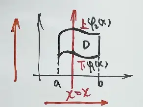

# 第14讲 二重积分(第三节:直角坐标系下的计算)

> 本节对应教材 **§ 直角坐标系下的计算方法**(full.md:9-127)
>
> 上一节讲了二重积分的**对称性**(必考题),本节进入**真正落地计算**——直角坐标 + 极坐标 + 换元法这三大方法中的**第一个**。
>
> 本节四大块:
> 1. **直角坐标系的标志**:用平行坐标轴的线切土豆丁,$d\sigma = dx\,dy$
> 2. **X 型 / Y 型区域**与"四句话"定限口诀(后积先定限 → 线内画条线 → 先交写下限 → 后交写上限)
> 3. **三条硬规则**:上下限小到大 / 累次积分方向 / 区域形状决定积分次序
> 4. **三道例题**:例 14.5(交换积分次序) + 例 14.6(累次积分→等价无穷小) + 例 14.7(被积函数只含 x,换序秒杀)

---

## 一、直角坐标系的标志

> 教材原话 (full.md:11-17):"直角坐标系用平行于坐标系的线切割。""问题:先对 x 积分,还是对 y 积分?"

### 1. 物理图像:切土豆丁

想象一个**土豆**(积分区域 $D$),用**平行于坐标轴**的线去切:
![[二重积分直角坐标系的计算-1783492318544.webp]]

| 维度 | 切的工具 | 切出来的小块 | 标志写法 |
|------|---------|------------|----------|
| **直角坐标** | 平行坐标轴的线 | "土豆丁" $\to$ 小矩形 $\to d\sigma = dx\,dy$ | **$d\sigma = dx\,dy$** ✓ |
| 极坐标 | 极坐标网格线 | "扇形丁" $\to$ $d\sigma = r\,dr\,d\theta$ | $d\sigma = r\,dr\,d\theta$ |

> [!tip] 标志判定
> 看到 $dx\,dy$ 或 $dy\,dx$ → **直角坐标**
> 看到 $r\,dr\,d\theta$ → **极坐标**(下节讲)
> 注意 $dx\,dy = dy\,dx$ 因为乘法交换律,普通对称性 $D_1$ 关于 $y=x$ 对称时常用这个等式

---

## 二、X 型区域 + Y 型区域 

> 教材原话 (full.md:33-49):"X 型区域的特点是:穿过 D 内部且平行于 y 轴的直线与 D 的边界相交不多于两点。""Y 型区域的特点是:穿过 D 内部且平行于 x 轴的直线与 D 的边界相交不多于两点。"

### 1. X 型区域:上下曲线型 （后积 x）
![[二重积分直角坐标系的计算-1783492739504.webp|463]]

**定义**:沿 $x$ 方向画**铅垂线**(平行 $y$ 轴),这条线与 $D$ 的边界**最多两个交点**(上、下曲线)。

数学表达:存在 $a \le x \le b$,$\varphi_1(x) \le y \le \varphi_2(x)$,即
$$D = \{(x,y) \mid \varphi_1(x) \le y \le \varphi_2(x),\ a \le x \le b\}$$

**变体**(需要分段):同一区域在 $x \in [a,c]$ 和 $x \in [c,b]$ 上 下/上 关系相反,要写成
$$\iint_D f\,\mathrm{d}\sigma = \int_a^c dx \int_{\varphi_1}^{\varphi_2} f\,dy + \int_c^b dx \int_{\varphi_2}^{\varphi_1} f\,dy$$

> [!warning] 分段的关键
> 分段点是 $\varphi_1(x)$ 与 $\varphi_2(x)$ **相交**(即 $\varphi_1 = \varphi_2$)的 $x$ 值。教材图 14-6 (a) 右上 / 左下 / 两侧均相交 三种情况,见 assets/fig_14-6.png。

### 2. Y 型区域:左右曲线型
![[二重积分直角坐标系的计算-1783493911557.webp|301]]

**定义**:沿 $y$ 方向画**水平线**(平行 $x$ 轴),这条线与 $D$ 的边界**最多两个交点**(左、右曲线)。

数学表达:存在 $c \le y \le d$,$\psi_1(y) \le x \le \psi_2(y)$,即
$$D = \{(x,y) \mid \psi_1(y) \le x \le \psi_2(y),\ c \le y \le d\}$$

### 3. 两型对照

| 维度 | X 型 | Y 型 |
|------|------|------|
| 画线方向 | 平行 $y$ 轴(铅垂线) | 平行 $x$ 轴(水平线) |
| 先交的曲线 | 下曲线 $\varphi_1(x)$ | 左曲线 $\psi_1(y)$ |
| 后交的曲线 | 上曲线 $\varphi_2(x)$ | 右曲线 $\psi_2(y)$ |
| 后积的变量 | $x$(后积 $x$) | $y$(后积 $y$) |
| 区域记号 | $\varphi_1(x),\ \varphi_2(x)$ | $\psi_1(y),\ \psi_2(y)$ |
| 教材图号 | 图 14-6 (a) | 图 14-6 (b) |

> [!tip] 一句话区分
> **X 型 = 上下型**(后积 $x$);**Y 型 = 左右型**(后积 $y$)。命名来自"先积分的变量" = "对应的字母"。

---

## 三、四句话定限口诀 #熟记 

> 教材原话 (full.md:21-24):"后积先定限, 限内画条线, 先交写下限, 后交写上限。"

**这是本节最核心的口诀**,考试时**边画图边念**:

| 步骤 | 口诀 | 动作 |
|------|------|------|
| 第 1 句 | **后积先定限** | 先把后积分的变量的**外层上下限**写出来(X 型后积 $x$,所以 $a \to b$) |
| 第 2 句 | **限内画条线** | 在 $(a,b)$ 区间**内**画一条平行于"先积分变量轴"的线(X 型画铅垂线) |
| 第 3 句 | **先交写下限** | 这条线**先碰到的**曲线是**内层积分的下限** |
| 第 4 句 | **后交写上限** | 这条线**后碰到的**曲线是**内层积分的上限** |

### 例:X 型区域的标准写法

$$
\iint_D f(x,y)\,\mathrm{d}\sigma = \int_a^b \mathrm{d}x \int_{\varphi_1(x)}^{\varphi_2(x)} f(x,y)\,\mathrm{d}y
$$

口诀套用:
1. **后积先定限**:X 型后积 $x$,外层 $\int_a^b dx$
2. **限内画条线**:在 $(a,b)$ 内画铅垂线 $x = x_0$
3. **先交写下限**:铅垂线先碰 $\varphi_1(x)$ → 内层下限
4. **后交写上限**:铅垂线后碰 $\varphi_2(x)$ → 内层上限

### 例:Y 型区域的标准写法

$$
\iint_D f(x,y)\,\mathrm{d}\sigma = \int_c^d \mathrm{d}y \int_{\psi_1(y)}^{\psi_2(y)} f(x,y)\,\mathrm{d}x
$$

口诀套用:
1. **后积先定限**:Y 型后积 $y$,外层 $\int_c^d dy$
2. **限内画条线**:在 $(c,d)$ 内画水平线 $y = y_0$
3. **先交写下限**:水平线先碰 $\psi_1(y)$(左曲线)→ 内层下限
4. **后交写上限**:水平线后碰 $\psi_2(y)$(右曲线)→ 内层上限

> [!important] 老王的口诀扩展
> "**A 到 B,线内画条线,先交写下限,后交写上限**"——把第 1 句的"后积先定限"具体化成"$A$ 到 $B$"(即后积变量的**小到大**)。完整版四句话就是:**后积先定线,线内画条线,先交写下限,后交写上限**。

---

## 四、三条硬规则

> 教材原话 (full.md:54-61):"二重积分交换上下限添负号""(1) 有一点需要指出,这里的下限都必须小于等于上限。$dx > 0$,$dy > 0$,$d\sigma > 0$""(2) 若被积函数 $f(x,y)$ 易于对 y 积分或积分区域 D 是 X 型区域,则选择先 y 后 x 的积分次序;若被积函数 $f(x,y)$ 易于对 x 积分或积分区域 D 是 Y 型区域,则选择先 x 后 y 的积分次序""(3) 计算二重积分的关键是确定积分限"。

### 规则 1:上下限必须小到大

|  | ![[二重积分直角坐标系的计算-1783495213641.webp\|361x165]] |
| -------------------------------------------------------- | --------------------------------------------- |

- **外层**后积变量的限:一定是 $a < b$(小到大)
- **内层**先积变量的限:**后交 > 先交**(即 $\varphi_1 \le \varphi_2$ 或 $\psi_1 \le \psi_2$)
- 这一条是二重积分的**基本概念**所要求的:$d\sigma > 0$ 必须保证,所以 $dx > 0, dy > 0$

> [!warning] 跟 1 元定积分的对比
> 1 元定积分 $\int_a^b f(x)\,dx$ 中 $a > b$ 是**允许**的(只是积分值为负);但**二重积分**对应的累次积分中 $a > b$ 或 $\varphi_1 > \varphi_2$ **不允许**。这是二重积分独有的"方向性"。

### 规则 2:反向时要添负号

如果题目给出 $\int_a^b dx \int_{\varphi_2}^{\varphi_1} f\,dy$ 且 $\varphi_1 > \varphi_2$——这**不是二重积分**,只是**累次积分形式**。要写成二重积分必须**前面添负号**:
$$\int_a^b dx \int_{\varphi_2}^{\varphi_1} f\,dy = -\int_a^b dx \int_{\varphi_1}^{\varphi_2} f\,dy$$

教材原文 (full.md:82):
$$
\int_{\pi/2}^{\pi} dx \int_1^{\sin x} f\,dy = -\int_{\pi/2}^{\pi} dx \int_{\sin x}^1 f\,dy \quad (\sin x < 1)
$$

> [!danger] 易错陷阱
> $\sin x < 1$ 是关键判定 —— 在 $[\pi/2, \pi]$ 上 $\sin x \le 1$,所以**反向是必须的**。但**外层** $\pi/2 < \pi$ 是正方向的,**不需要**添负号。
> 添负号后才是**二重积分**,不带负号的原式**仅是累次积分形式**。

### 规则 3:积分次序选择的两条线索

| 优先次序 | 选择规则 |
|---------|---------|
| **线索 1** | 看积分区域:是 X 型就**后积 x**,是 Y 型就**后积 y** |
| **线索 2** | 看被积函数:易于对 $y$ 积分就**先积 y**(= 后积 $x$);易于对 $x$ 积分就**先积 $x$**(= 后积 $y$) |
| **最佳** | 两个线索**不冲突时优先选简单**;**冲突时**考虑换元法或极坐标(下节讲) |
| **特殊** | **被积函数无初等原函数** 时,**只能换序** —— 见例 14.6 |

教材 full.md:103 列出的**无初等原函数**家族(必须避开直接对它积分):
$$\frac{\sin x}{x},\ \frac{\cos x}{x},\ \frac{\ln(1+x)}{x},\ \frac{1}{\ln x},\ \sin x^2,\ \cos x^2,\ \sin\tfrac{1}{x},\ \cos\tfrac{1}{x},\ \frac{\tan x}{x},\ \frac{e^x}{x},\ \tan x^2,\ e^{ax^2+bx+c}\ (a\ne 0)$$

> [!warning] 无初等原函数 = 强换序信号
> 这 12 个家族,任何出现在被积函数里,**立刻考虑交换积分次序**(无论题面看起来多复杂)。这是例 14.6 的核心考点。

---

## 五、例 14.5:交换积分次序(基础)

> 教材 (full.md:63-83):设函数 $f(x,y)$ 连续,则二次积分
> $$\int_{\pi/2}^{\pi} dx \int_{\sin x}^1 f(x,y)\,dy = \underline{\quad}$$
> 选项:
> (A) $\int_0^1 dy \int_{\pi+\arcsin y}^{\pi} f\,dx$
> (B) $\int_0^1 dy \int_{\pi-\arcsin y}^{\pi} f\,dx$  ✓
> (C) $\int_0^1 dy \int_{\pi/2}^{\pi+\arcsin y} f\,dx$
> (D) $\int_0^1 dy \int_{\pi/2}^{\pi-\arcsin y} f\,dx$
![[二重积分直角坐标系的计算-1783501222829.webp|361]]
### 解题四步

**Step 1** —— 读题干:外层 $\int_{\pi/2}^{\pi} dx$ + 内层 $\int_{\sin x}^1 dy$ → X 型区域,后积 $x$

**Step 2** —— 还原区域 $D$:
$$
D:\ \begin{cases}\sin x \le y \le 1\\ \pi/2 \le x \le \pi\end{cases}
$$

图形特征:在 $[\pi/2, \pi]$ 上,下曲线是 $y = \sin x$,上曲线是 $y = 1$ (直线)。围成的区域是**横着的曲边梯形**(教材图 14-7)。

**Step 3** —— 切换 Y 型:后积 $y$,外层 $\int_0^1 dy$(因为 $y \in [\sin x, 1] \subset [0,1]$)

**Step 4** —— 定内层 $x$ 的限(水平线穿 $D$):
- 水平线 $y = y_0$ 从 $y_0$ 出发,先撞**左曲线** $x = \pi - \arcsin y$,后撞**右直线** $x = \pi$
- 所以内层 $\int_{\pi-\arcsin y}^{\pi} dx$

> [!tip] $x = \pi - \arcsin y$ 是怎么来的(关键推导)
>
> **问题**:已知 $\sin x = y$,要反解 $x$,且 $x$ 必须在 $[\pi/2, \pi]$ 范围内(因为原题 $x \in [\pi/2, \pi]$)。
>
> **第 1 步** — 看你熟悉的 $\arcsin y$:
> $$\arcsin y: [-1,1] \to [-\pi/2, \pi/2]$$
> **值域不对** —— 给的是第一/第四象限的角,**不含** $\pi/2$ 到 $\pi$ 这一段。直接用 $\arcsin y$ 会跑出区间外。
>
> **第 2 步** — 用三角恒等式 $\sin(\pi - \theta) = \sin \theta$ 翻到第二象限:
>
> 当 $y \in [0,1]$ 时,$\arcsin y \in [0, \pi/2]$,于是
> $$\pi - \arcsin y \in [\pi/2, \pi] \quad ✓$$
> **正好落在我们要的区间!**
>
> **第 3 步** — 代入验证三个点:
>
> | $y$ | $\pi - \arcsin y$ | $\sin(\pi - \arcsin y)$ |
> |-----|-------------------|-------------------------|
> | $0$ | $\pi$ | $\sin \pi = 0$ ✓ |
> | $1/2$ | $5\pi/6$ | $\sin(5\pi/6) = 1/2$ ✓ |
> | $1$ | $\pi/2$ | $\sin(\pi/2) = 1$ ✓ |
>
> **第 4 步** — 为什么不是 $\pi + \arcsin y$?
>
> $\pi + \arcsin y \in [\pi, 3\pi/2]$,对应的是**第三象限**的解,不是第二象限。
> 我们要的是 $\sin x = y$ 在 $x \in [\pi/2, \pi]$(**第二象限**) 的解,所以必须是 $\pi - \arcsin y$。
>
> **一句话总结**:
> $$\boxed{y = \sin x \text{ 在 } x \in [\pi/2, \pi] \text{ 上的反函数}: \quad x = \pi - \arcsin y}$$
> **口诀:正弦图像在第二象限,反函数要用 $\pi$ 减**。 ^3bvpvz

### 答案

$$
\boxed{\int_{\pi/2}^{\pi} dx \int_{\sin x}^1 f\,dy = \int_0^1 dy \int_{\pi-\arcsin y}^{\pi} f\,dx}
\quad \Rightarrow \text{选 (B)}
$$

> [!tip] 一句话总结
> 交换积分次序 = **画图 + 换后积变量 + 用四句话定新限**。三个动作缺一不可,**画图**最关键——不画图就只能靠分析法硬写,容易漏讨论。

> [!danger] 反函数陷阱
> $\sin x = y$ 在 $[\pi/2, 3\pi/2]$ 上的反函数是 $x = \pi - \arcsin y$,**不是** $x = \arcsin y$。这是 (A) 和 (B) 的分水岭 —— (A) 写成 $\pi + \arcsin y$ 是**负号和范围都错**,**必错**。

---

## 六、例 14.6:累次积分 → 等价无穷小(综合)

> 教材 (full.md:85-105):当 $x \to 0^+$ 时,$f(x) = \int_0^{x^2} dy \int_x^{\sqrt{y}} \sin\tfrac{y}{t}\,dt$ 与 $g(x) = ax^b$ 是等价无穷小量,则 $ab = \underline{\quad}$

⚠️ **变量核对**:讲课稿口语把 $\sin\tfrac{y}{t}$ 转写成 $\sin\tfrac{y}{x}$,教材原文(及例 14.6 题干)用的是 **$t$**,不是 $x$。笔记以教材为准。

### 解题五步

**Step 1** —— 看到 $\sin\tfrac{y}{t}$,**立刻判定要换序**:
- 若先对 $t$ 积分,$\int \sin\tfrac{y}{t}\,dt$ 无初等函数原函数(见规则 3 的 12 家族)
- 必须**先积 $y$** 后积 $t$

**Step 2** —— 还原区域并修正方向:
- 题给:$\int_0^{x^2} dy \int_x^{\sqrt{y}} \sin\tfrac{y}{t}\,dt$
- 在 $0 \le y \le x^2$ 范围内,**有** $\sqrt{y} \le x$(因为 $\sqrt{y} \le \sqrt{x^2} = x$ 且 $x > 0$)
- 所以**内层**反向:$\int_x^{\sqrt{y}} = -\int_{\sqrt{y}}^x$
- **外层** $\int_0^{x^2}$ 正向($0 < x^2$)

$$
f(x) = -\int_0^{x^2} dy \int_{\sqrt{y}}^x \sin\tfrac{y}{t}\,dt = -\iint_D \sin\tfrac{y}{t}\,d\sigma
$$

区域 $D$:
$$
D:\ \begin{cases} \sqrt{y} \le t \le x \\ 0 \le y \le x^2 \end{cases} \quad \Longleftrightarrow \quad \begin{cases} 0 \le t \le x \\ 0 \le y \le t^2 \end{cases}
$$

> [!warning] "反向添负号"实战
> 内层反向时,添负号**只添一次**,然后**继续换序**——很多同学在这一步慌了,以为是双重负号。记住:**只添一次**,负号保留到最后。

**Step 3** —— 交换积分次序(把 $t$ 提到外层):

$$
f(x) = -\int_0^x dt \int_0^{t^2} \sin\tfrac{y}{t}\,dy
$$

**Step 4** —— 计算内层积分:
$$
\int_0^{t^2} \sin\tfrac{y}{t}\,dy = -t\cos\tfrac{y}{t}\Big|_{y=0}^{y=t^2} = -t\cos t + t\cos 0 = t(1 - \cos t)
$$

> [!tip] 关键公式
> 教材 full.md:109 显式给出:**$\int \sin\tfrac{y}{t}\,dy = -t\cos\tfrac{y}{t} + C$**。
> 注意**对 $y$ 积分**时 $t$ 当常数,所以 $\frac{d}{dy}\cos\frac{y}{t} = -\frac{1}{t}\sin\frac{y}{t}$,反推 $\int \sin\frac{y}{t}\,dy = -t\cos\frac{y}{t} + C$。

$$
f(x) = -\int_0^x t(1 - \cos t)\,dt = \int_0^x t(\cos t - 1)\,dt
$$

**Step 5** —— 求 $x \to 0^+$ 时 $f(x)$ 的等价无穷小,用洛必达:

$$
\lim_{x\to 0^+} \frac{f(x)}{g(x)} = \lim_{x\to 0^+} \frac{\int_0^x t(\cos t - 1)\,dt}{ax^b}
$$

分子在 $x\to 0^+$ 的等价:$\int_0^x t(\cos t - 1)\,dt$,被积函数 $t(\cos t - 1) \sim t \cdot (-\frac{t^2}{2}) = -\frac{t^3}{2}$,所以

$$
\int_0^x t(\cos t - 1)\,dt \sim \int_0^x \left(-\frac{t^3}{2}\right)\,dt = -\frac{x^4}{8}
$$

教材 (full.md:101) 也直接用洛必达一次(分子 $\frac{d}{dx}[x(\cos x - 1)] = \cos x - 1 - x\sin x \sim -\frac{x^2}{2}$,分母 $abx^{b-1}$,令 $-\frac{x^3}{2}$ 与 $abx^{b-1}$ 等价 $\Rightarrow b = 4, ab = -\frac{1}{2}$):

$$
\boxed{ab = -\frac{1}{2}}
$$

教材备注 (full.md:105):事实上 $a = -\frac{1}{8}$,$b = 4$。

> [!tip] 老王原话
> "**等价无穷小** 的阶数和系数,可以走**'分子分母分别算等价,再对应相等'**这条路——不用洛必达,直接分子/分母都展到 $x$ 的几次方,看几次方相等就行。"
>
> 教材 full.md:111 给出的等价无穷小穿越性质:$\int_0^x f(t)\,dt \sim \int_0^x g(t)\,dt$ 当 $f \sim g$ 时(洛必达可证)。

---

## 七、例 14.7:被积函数只含一个变量 → 换序秒杀

> 教材 (full.md:113-127):计算 $\int_0^1 dy \int_y^1 \arcsin\sqrt{4x-4x^2}\,dx$

### 关键观察

**被积函数 $\arcsin\sqrt{4x-4x^2}$ 只含 $x$**,**不含 $y$**——这种情况下:

> [!tip] 老王原话
> "**被积函数是单变量函数,几乎不需要犹豫**——因为对**另一个字母**积分时,它就是常数,直接踢出去。"
> 这条经验对应教材 (full.md:115):"被积函数只含有 $x$,而且先对 $x$ 积分较困难,所以考虑交换积分顺序。"

### 解题两步

**Step 1** —— 还原区域 $D$:
- 题给 $\int_0^1 dy \int_y^1$ → $0 \le y \le 1$,$y \le x \le 1$
- 即 $D = \{(x,y) \mid 0 \le y \le x,\ 0 \le x \le 1\}$(三角形,顶点 $(0,0), (1,0), (1,1)$)

**Step 2** —— 切换后积 $x$:
$$
\text{原式} = \int_0^1 dx \int_0^x \arcsin\sqrt{4x-4x^2}\,dy
$$

**内层对 $y$** 时 $\arcsin\sqrt{4x-4x^2}$ 是常数,**直接乘**:
$$
\int_0^x \arcsin\sqrt{4x-4x^2}\,dy = x \cdot \arcsin\sqrt{4x-4x^2}
$$

所以
$$
\text{原式} = \int_0^1 x \arcsin\sqrt{4x-4x^2}\,dx = \boxed{\frac{1}{2}}
$$

教材 (full.md:127) 显式给出此结果(配套**常见积分**):
$$
\int_0^1 \arcsin\sqrt{1-x^2}\,dx = 1,\quad \int_0^1 x \arcsin\sqrt{4x-4x^2}\,dx = \frac{1}{2}
$$

> [!tip] 常见积分结论(背下来)
> 教材 full.md:127 列了 2 个常见积分,在做综合题时**直接调用**:
> - $\int_0^1 \arcsin\sqrt{1-x^2}\,dx = 1$
> - $\int_0^1 x\arcsin\sqrt{4x-4x^2}\,dx = \frac{1}{2}$
>
> 这些都是第 9 讲定积分计算里反复练过的"前世今生"题,本讲是它们的**综合应用**——把第 9 讲的基本积分嫁接到二重积分的换序上。

---

## 八、本节方法总览

```mehrmaid
flowchart TD
    A["二重积分<br/>$\\iint_D f(x,y)\\,\\mathrm{d}\\sigma$"]

    A --> B{"积分次序选择"}
    B -->|"D 是 X 型"| C1["后积 x<br/>$\\int_a^b dx \\int_{\\varphi_1}^{\\varphi_2} f\\,dy$"]
    B -->|"D 是 Y 型"| C2["后积 y<br/>$\\int_c^d dy \\int_{\\psi_1}^{\\psi_2} f\\,dx$"]
    B -->|"被积函数无初等原函数<br/>(12 家族)"| C3["强换序<br/>找到能积的方向"]
    B -->|"被积函数只含单变量"| C4["换序<br/>常数踢出去"]

    C1 --> D{"上下限方向对吗?"}
    C2 --> D
    D -->|"是"| E["直接计算"]
    D -->|"否"| F["添负号 + 改写成二重积分"]

    C3 --> E
    C4 --> E
```

---

## 九、本节易错点速查

| 编号 | 易错点 | 正确做法 |
|------|--------|----------|
| 1 | 把"后积先定限"理解成"先积分的变量先定限" | **后积**(外层)**先定限**(外层上下限)**先积**(内层)后定限 |
| 2 | X 型区域的内层上下限写成 $\varphi_1 > \varphi_2$ | 必须 $\varphi_1 \le \varphi_2$(下 ≤ 上),反向时添负号 |
| 3 | 看到 $a > b$ 的外层积分不知道怎么改 | 二重积分中**不允许** $a > b$ —— 必须添负号改成 $b \to a$,且**这是新二重积分**,不是原题 |
| 4 | 例 14.6 把 $\sin\frac{y}{t}$ 误读成 $\sin\frac{y}{x}$ | 变量名以**教材为准**,例 14.6 是 $y/t$,不是 $y/x$ |
| 5 | 例 14.6 反向添负号时搞混"内层"和"外层" | 只有**内层反向**才添负号;**外层**后积方向已经是 $\int_0^x$,正向,不动 |
| 6 | 例 14.6 用 $g(x) = ax^b$ 比阶时漏掉 $b - 1$ | $\frac{d}{dx}(ax^b) = abx^{b-1}$,**指数是 $b-1$ 不是 $b$** |
| 7 | 例 14.7 不换序硬算 $\int \arcsin\sqrt{4x-4x^2}\,dx$ | 这是**无初等原函数**家族成员($\arcsin\sqrt{\cdot}$),换序把它当常数踢出去是唯一出路 |
| 8 | 例 14.5 把反函数写成 $x = \arcsin y$ | 在 $[\pi/2, 3\pi/2]$ 上,$\sin x = y$ 的反函数是 $x = \pi - \arcsin y$ |
| 9 | 写 $D$ 关于 $y=x$ 对称(本节不涉及,但易混) | 见上一节笔记"二重积分的对称性(普通+轮换)" |

---

## 十、与前两节的衔接

| 上一节 | 本节应用 |
|-------|---------|
| §1 概念(定义 / 存在性 / 几何意义) | 例 14.5 用"$\sin x < 1$"判断方向性 |
| §2 普通对称性 / 轮换对称性 | 本节**不直接使用**,但当 $D$ 有对称性 + 选 X/Y 型时,**简化上下限** |
| §2 性质 4 可加性 | 例 14.5 的 X 型变体(分段积分)是性质 4 的应用 |
| §2 性质 6 估值定理 | 例 14.5 选 (B) 时,可以用估值定理**排除**明显不对的 (A)/(C)/(D) |

> [!tip] 老王原话(方法论)
> "**计算二重积分的关键是确定积分限**——为此要画好积分区域的边界图。**当区域边界不容易画出来时,要写出区域的不等式表达式**——分析法。"
> (教材 full.md:61)
>
> 这条经验在基础阶段反复练,**强化阶段(36 讲)再做一次**。

---

## 十一、综合判定流程(老王总结)

拿到一道二重积分计算题,按以下顺序判定:

| Step | 问题 | 动作 |
|------|------|------|
| 1 | 题给的是**累次积分**(已交换过)还是**二重积分**? | 累次积分 → 先还原区域 $D$;二重积分 → 直接画图 |
| 2 | $D$ 是 **X 型** 还是 **Y 型**? | 画平行 $y$ 轴的线看交点(X 型);平行 $x$ 轴的线看交点(Y 型) |
| 3 | **被积函数有没有无初等原函数的成员**? | 有 → 强换序,选定能积的方向 |
| 4 | **被积函数是否只含单变量**? | 是 → 换序把另一个字母踢出去(秒杀) |
| 5 | **上下限方向对吗**? | 反向 → 添负号;正向 → 直接算 |
| 6 | **需要分段** 吗? | 找下/上曲线交点作为分段点 |
| 7 | 选定的次序算不动 → 换序 | 重复 2-6 |

---

> **本文逐字稿来源**:启航 AI 助学文稿(2026/7/8 抓取,第 14 讲第 3 节讲课视频逐字稿)
> **教材来源**:导出页面自 305-478.pdf(full.md:9-127,**§ 直角坐标系下的计算方法** + **例 14.5-14.7**)
> **Stage 标记**:本文已用教材 full.md:9-127 逐公式核对完毕(Stage 2 终稿)。
>
> **关键订正**:
> 1. **被积函数变量** —— 讲课稿口语把例 14.6 的 $\sin\frac{y}{t}$ 转写为 $\sin\frac{y}{x}$,教材原文(及题面)用的是 $t$,笔记统一以教材为准。
> 2. **例 14.6 答案** —— 教材显式给 $ab = -\frac{1}{2}$(选填答案),并备注 $a = -\frac{1}{8}, b = 4$。讲课稿说的 "$(-1/2)^3$" 是课堂上笔下推算系数的过程,不是答案。
> 3. **例 14.6 反向** —— 讲课稿说"$\sin x < 1$ 满足二重积分定义",教材原文 "$\sin x < 1$(不是二重积分,仅是累次积分形式)"——教材明确**反向时不是二重积分**,需添负号改写成二重积分。笔记以此为准。
> 4. **例 14.5 反函数** —— 教材 (full.md:77) 引"例 1.12":当 $\frac{\pi}{2} < x \le \frac{3\pi}{2}$ 时,$x = \pi - \arcsin y$。讲课稿写"$X = \pi - \arcsin y$"是一致的;但讲课稿提"$\pi/2$ 到 $3\pi/2$" 误读为"$x = \pi - \arcsin y$ 在整个 $[\pi/2, \pi]$ 都对"——其实只是 $[\pi/2, \pi] \subset [\pi/2, 3\pi/2]$ 所以对。
>
> **图渲染变更说明**:与第二节「对称性」笔记一致,本节示意图改用 **matplotlib 渲染为 PNG** 嵌入(避开 TikZJax div.page 高度 bug)。