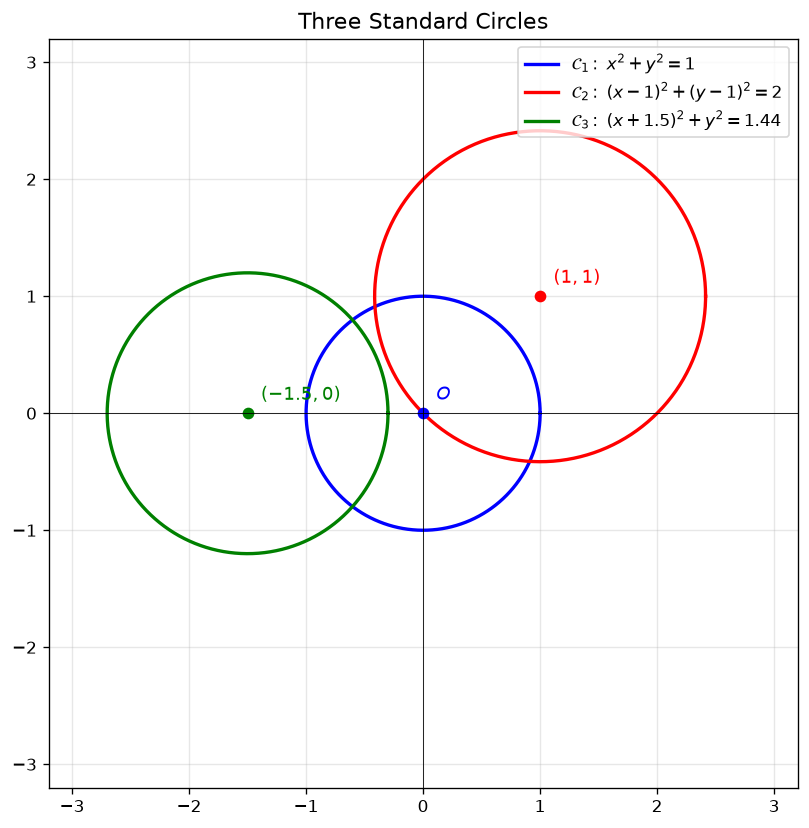
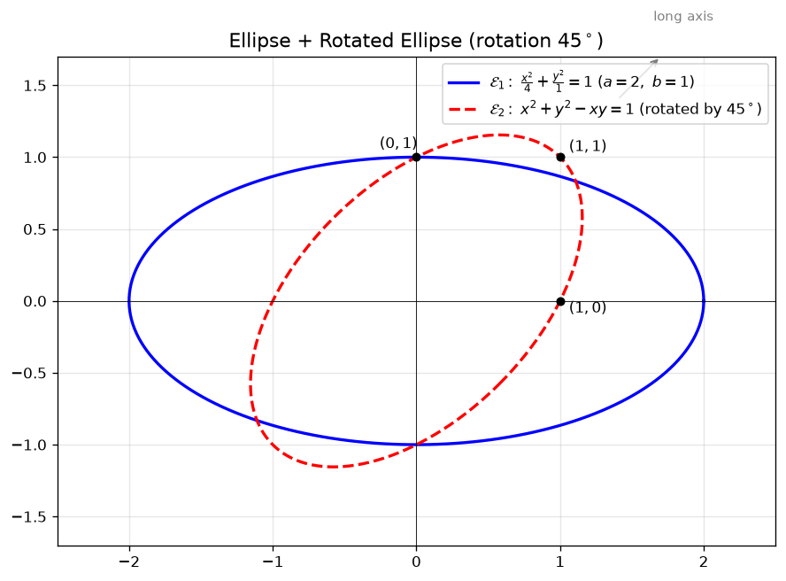

# 第 14 讲工具笔记:圆与椭圆方程(积分区域 D 画图速查)

> **本笔记的定位**:不展开讲二重积分,只把**画积分区域 D 时最常出现的两类曲线 —— 圆 + 椭圆 —— 的方程、配方法、极坐标化简、画图要点**压成一张速查表,翻一眼能上战场。
>
> **不写**:不讲二重积分的计算方法、不讲对称性、不讲例题。**这些都在 [画图三大体系](二重积分区域D的画图(三大体系).md) / [对称性](二重积分的对称性(普通+轮换).md) / [极坐标](二重积分极坐标系的计算.md) 三篇兄弟笔记里**。
>
> **不画**:本笔记全程用 **matplotlib 渲染 PNG**(没有 SVG / TikZ)。图放在 `assets/`,配图 1~3。

---

## 一、为什么需要这一篇

二重积分 $\iint_D f(x,y)\,d\sigma$ 真正干活的两个步骤:

1. **认区域 D**(画图)
2. **选坐标系 + 定限**(计算)

而第 1 步里有两类边界线**出现频率极高**,几乎每隔两题就碰到一次,不管哪个老师讲都一样:

- **圆**(真圆)
- **椭圆**(含**转过一个角度**的椭圆 —— 例 14.9、2019 真题都在这里翻车)

把这两类曲线的方程公式 + 化成极坐标的 $r(\theta)$ + 转过角度怎么改写**一次性背熟**,画图时就是 5 秒画一个,不再瞎猜。

---

## 二、标准圆

### 1. 标准方程速查 #重要 

$$\boxed{x^2 + y^2 = R^2} \quad \text{(圆心 } (0,0),\ \text{半径 } R>0\text{)}$$

### 2. 一般方程

$$\boxed{(x-a)^2 + (y-b)^2 = R^2} \quad \text{(圆心 } (a,b),\ \text{半径 } R\text{)}$$

**四种等价写法**(考试里见招拆招):

| 写法 | 例 | 识别要点 |
|------|-----|--------|
| **标准式** | $(x-1)^2 + (y-1)^2 = 2$ | 完全平方,直接读出圆心和半径 |
| **展开式** | $x^2 + y^2 - 2x - 2y = 0$ | $x^2,y^2$ 系数同号且相等、无 $xy$ 项 |
| **参数式** | $\begin{cases} x = 1+\sqrt{2}\cos\theta \\ y = 1+\sqrt{2}\sin\theta \end{cases}$ | 显式 $\theta$ 范围,直接进极坐标 |
| **极坐标式** | $\rho = R$ (圆心在极点) 或 $\rho = 2R\cos\theta$ (过原点的直径) | 区分圆心位置 |

### 3. 极坐标(分三种位置)⚠️⭐ 真题必有

> 圆心 $(a,b)$ 在直角坐标 → 化成极坐标公式**最常考**,三种位置是 [第四节笔记 §三.3](二重积分极坐标系的计算.md#3%20三类位置的公式%20按极点%20O%20与%20D%20的位置选) 的核心内容。

| 圆心位置 | 极坐标方程 $\rho(\theta)$ | 来源 |
|---------|------------------------|------|
| **圆心在极点 $O$** | $\rho = R$ | $x = \rho\cos\theta, y = \rho\sin\theta$ 代入 $\rho^2 = R^2$ |
| **圆心在 $x$ 轴上**(过原点,直径沿 $x$ 轴) | $\rho = 2R\cos\theta$ | $x^2 + y^2 = 2Rx \Rightarrow \rho^2 = 2R\rho\cos\theta$ |
| **圆心在 $y$ 轴上**(过原点,直径沿 $y$ 轴) | $\rho = 2R\sin\theta$ | $x^2 + y^2 = 2Ry \Rightarrow \rho^2 = 2R\rho\sin\theta$ |
| **一般位置**(圆心 $(a, b)$) | $\rho = 2a\cos\theta + 2b\sin\theta \pm \sqrt{\cdots}$ | 复杂,**真题不直接考**,优先用直角描点 |

> [!tip] **秒杀技巧:看到 $x^2 + y^2 \le 2ax$ 这种 → 直接配方**
> $x^2 + y^2 \le 2ax \iff (x-a)^2 + y^2 \le a^2$ → 圆心 $(a,0)$,半径 $a$。**配方就是答案**,**别直接上极坐标**。

### 4. 识别切线 ⚠️ 老王密传

判断"$x+y=0$ 是 $(x-1)^2+(y-1)^2=2$ 的切线吗?"

> **判定公式**:圆心到直线的距离 = 半径 ⇔ 是切线
> $$d = \frac{|1+1-0|}{\sqrt{2}} = \sqrt{2} = R \quad ✓$$

> 详细实战见 [画图三大体系 §三.2 圆 + 直线组合](二重积分区域D的画图(三大体系).md#2%20圆%20直线组合%20⚠️⭐%20真题高频)(例 (7))。

---

## 三、标准椭圆(正放,不转角度)

### 1. 标准方程速查(中心在原点) #重要 

$$\boxed{\frac{x^2}{a^2} + \frac{y^2}{b^2} = 1} \qquad a > b > 0$$

| 量 | 公式 | 记法 |
|----|------|------|
| 长半轴 | $a$ | $x^2$ 下面那个 |
| 短半轴 | $b$ | $y^2$ 下面那个 |
| 焦距(半焦距) | $c = \sqrt{a^2-b^2}$ | $a^2 - b^2$ 的根号 |
> [!warning] 注意
> 若题目给的椭圆方程是**平方根的形式**，只有 $x$ 轴**上半部分**的椭圆
> 因为题目中的平方根默认是**算数平方根**
> [14. 二重积分](0.%20杂项/题目/14.%20二重积分.md#13%20二重积分计算（椭圆）)

### 2. 椭圆 vs 圆的本质区别 ⚠️

$$\text{圆: } a = b \qquad \text{椭圆: } a \neq b \qquad \text{特例:圆的极限 }b\to a \text{ 就是椭圆}$$

**对积分区域的影响**:椭圆的边界**不是任意角度的圆弧**,所以**能不能用极坐标要看被积函数**。见 § 四。

### 3. 几何位置

- **椭圆在矩形框 $-a \le x \le a, -b \le y \le b$ 之内**(不占满矩形),矩形面积为 $4ab$,椭圆面积是 $\pi ab$
- **顶点**:$(\pm a, 0)$ 和 $(0, \pm b)$ — 椭圆最远的 4 个点(常用于描点画图)

### 4. 极坐标公式(正放、不转角) ⭐ 老王爱用

> **推导**:代入 $x = \rho\cos\theta, y = \rho\sin\theta$,化简并开方($\rho > 0$):

$$\boxed{\rho(\theta) = \frac{ab}{\sqrt{a^2 \sin^2\theta + b^2 \cos^2\theta}}}$$

**关键观察**:

- $\theta = 0$ 时(沿 $x$ 轴正方向):$\rho = ab/b = a$ —— **离原点最远 = 长半轴**
- $\theta = \pi/2$ 时(沿 $y$ 轴正方向):$\rho = ab/a = b$ —— **离原点最近 = 短半轴**
- $\rho$ 永远在 $[b, a]$ 之间(不可能超出长轴,也不可能短于短轴)

**化简易错点**:

$$\text{错:} \quad \rho = \frac{ab}{\sqrt{a^2\cos^2\theta + b^2\sin^2\theta}}$$

$\sin$ / $\cos$ **位置反了**。验算时 $\theta=0$ 必须回 $\rho=a$,三角函数在分母里要跟被它"对齐坐标轴"的那一项同位:

- $x^2$ 配 $\cos^2\theta$
- $y^2$ 配 $\sin^2\theta$

---

## 四、转角椭圆 ⭐⭐⭐ 真题核心难点

> **重头戏**。二重积分真题的椭圆**几乎都是转角的**,标准 $\frac{x^2}{a^2}+\frac{y^2}{b^2}=1$ 反而少见。

### 1. 形如 $x^2 + y^2 - xy = c$ 的一般式(老王原题频率最高)

$$\boxed{x^2 + y^2 \pm xy = c} \quad (c > 0,\ \text{含 }xy\text{ 项 ⇒ 转了 }45°)$$

**实战例子**(见 [第四节例 14.9 完整题目](二重积分极坐标系的计算.md#1%20题目%20✅%20教材核对%20full%20md%2083)):

$$x^2 + y^2 - xy = 1, \qquad x^2 + y^2 - xy = 2$$

两条同心椭圆,在第一象限 + 与两条射线 $\theta = 0, \theta = \pi/3$ 围出积分区域 $D$。

### 2. 配方法 / 二次型(知道结论就行,基础阶段不用展开推) ⚠️ 重点

$$x^2 + y^2 - xy = \underbrace{x^2 - xy}_{\text{配方}} + y^2 = \left(x - \frac{y}{2}\right)^2 + \frac{3}{4}y^2$$

令 $u = x - y/2, v = y$,则:

$$\left(x - \tfrac{y}{2}\right)^2 + \tfrac{3}{4}y^2 = c \quad \Longrightarrow \quad u^2 + \tfrac{3}{4}v^2 = c$$

两边除以 $c$:

$$\frac{u^2}{c} + \frac{v^2}{4c/3} = 1$$

所以沿 $u = x - \frac{y}{2}$ 方向半轴 $= \sqrt{c}$,沿 $v = y$ 方向半轴 $= \sqrt{4c/3} = \frac{2\sqrt{c}}{\sqrt{3}}$。

> [!warning] 二次型对角化(老王原话:**基础阶段不展开**,知道结论)
> 严格说,应该用矩阵对角化。令 $u = (x+y)/\sqrt{2}, v = (x-y)/\sqrt{2}$,矩阵 $\begin{pmatrix}1 & -1/2\\-1/2 & 1\end{pmatrix}$ 对角化为 $\begin{pmatrix}1/2 & 0\\0 & 3/2\end{pmatrix}$,得
> $$x^2+y^2-xy = \tfrac{1}{2}u^2 + \tfrac{3}{2}v^2 = c$$
> 写成椭圆标准式 $\dfrac{u^2}{2c} + \dfrac{v^2}{2c/3} = 1$:
> - **沿 $u = (x+y)/\sqrt{2}$ 方向** = $(1,1)$ 方向(斜率 $+1$):半轴 $= \sqrt{2c}$ = **长轴**
> - **沿 $v = (x-y)/\sqrt{2}$ 方向** = $(1,-1)$ 方向(斜率 $-1$):半轴 $= \sqrt{2c/3}$ = **短轴**
>
> 所以这曲线**长轴沿 $(1,1)$ 方向**,**短轴沿 $(1,-1)$ 方向** —— 跟我们图 2 的红线(长轴指向 $(\sqrt{2}, \sqrt{2})$ 和 $(-\sqrt{2}, -\sqrt{2})$,斜率 $+1$ 对角线)**完全一致**。
>
> ⚠️ **跟上面配方表的关系**:上面 § 4.2 配方给的是**斜交坐标下**($u = x-y/2$ 跟 $v = y$ 不是正交的),不是主轴。下表是斜交坐标下的两个**极端值**,**不是**椭圆长/短轴,只是因为坐标选得巧能直接写出两根半轴长。

代入两条曲线(沿 $u = x-y/2$ / 沿 $v = y$ 两个方向的半轴长):

| 方程 | 沿 $u = x - y/2$ 方向 | 沿 $v = y$ 方向 |
|------|-----------|-----------|
| $x^2+y^2-xy=1$ | $1$ | $\frac{2}{\sqrt{3}} \approx 1.155$ |
| $x^2+y^2-xy=2$ | $\sqrt{2} \approx 1.414$ | $\frac{2\sqrt{2}}{\sqrt{3}} \approx 1.633$ |

> [!warning] 易混 / 老王不展开
> 上面这张表是**斜交坐标下**的两个数值,**不是**椭圆长/短轴(真长/短轴见上面 callout,半轴分别 $\sqrt 2$ 和 $\sqrt{2/3}$)。基础阶段拿到 $x^2+y^2-xy=c$ 这种,**直接走 § 4.3 描点法**(快),**不用配方**。  
> 用二次型矩阵对角化算**真正的长/短轴**比直接配方快,但基础阶段**不考** —— 掌握"含 $xy$ 项 → 转角椭圆、长轴不在坐标轴方向"这一条就够了。

### 3. 描点法(老王实战首选) ⭐⭐⭐

> "**我不写精化推导,只取几个特殊 $\theta$ 描几个关键点就够了**"(老王原话)

**画 $x^2+y^2-xy=1$ 在第一象限的图像**(同 [极坐标笔记例 14.9 §3 画图](二重积分极坐标系的计算.md#3%20第一步%20画%20D%20的图%20两种方法)):

| 路径 | 代入 | 解 | 描的点 |
|------|------|----|--------|
| $x = 0$ | $y^2 = 1$ | $y = 1$ | $(0, 1)$ |
| $y = 0$ | $x^2 = 1$ | $x = 1$ | $(1, 0)$ |
| $x = y$ | $x^2 + x^2 - x^2 = x^2 = 1$ | $x = 1$ | $(1, 1)$(对角线 $y=x$ 上) |
| $x = -y$ | $y^2 + y^2 - (-y^2) = 3y^2 = 1$ | $y = 1/\sqrt{3}$ | $(\mp 1/\sqrt{3}, \pm 1/\sqrt{3})$(对角线 $y=-x$ 上 2 点) |

**4 个点 + 隐函数求导断凹凸** → 第一象限曲线就出来了。剩下的象限**轮换镜像**(详见 [对称性笔记 §三.3 轮换对称性的严格定义](二重积分的对称性(普通+轮换).md#3%20轮换对称性的严格定义))。

### 4. 转角椭圆的极坐标公式 ⭐ 计算关键

代入 $x = \rho\cos\theta, y = \rho\sin\theta$,$\rho^2 - \rho^2\cos\theta\sin\theta = c$,即:

$$\boxed{\rho^2(1 - \cos\theta\sin\theta) = c \quad \Longrightarrow \quad \rho(\theta) = \sqrt{\frac{c}{1 - \cos\theta\sin\theta}}}$$

**考试时关键观察**(老王原话):

> "$r_2/r_1 = \sqrt{2/(1-\cos\theta\sin\theta)} \div \sqrt{1/(1-\cos\theta\sin\theta)} = \sqrt{2}$,**跟 $\theta$ 无关**!"
> → 半径比直接出 $\ln\sqrt{2} = \frac{\ln 2}{2}$,**两椭圆比值永远 $\sqrt{c_2/c_1}$**

这个化简是例 14.9 的命脉,**见 [极坐标笔记例 14.9 第三步](二重积分极坐标系的计算.md#5%20第三步%20被积函数%20d%20sigma%20一起化简) 全过程**。

---

## 五、画积分区域 D 时的"圆/椭圆"速查表 ⚠️ 装备表

| 看懂的表达式 | 你应该画的 | 用什么坐标 |
|------------|-----------|----------|
| $x^2+y^2 \le R^2$ | 单位圆(原点) | **极坐标 $\int_0^{2\pi}\int_0^R$** |
| $(x-a)^2+(y-b)^2 \le R^2$ | $(a,b)$ 为圆心、半径 $R$ | 极坐标需平移,**多数用 [轮换对称性](二重积分的对称性(普通+轮换).md) + 极坐标** |
| $\dfrac{x^2}{a^2}+\dfrac{y^2}{b^2} \le 1$ | 正放椭圆 | 看被积函数决定,常 [描点 + 直角坐标](二重积分区域D的画图(三大体系).md) |
| $x^2+y^2-xy = c$ | **转 45° 椭圆** | 极坐标 $\rho^2(1-\cos\theta\sin\theta)=c$ |
| $(x^2+y^2)^2 \le xy$ (4 次齐次) | 双纽线 / 一瓣 | 极坐标必选 — 见 [画图笔记 §三.4 双纽线](二重积分区域D的画图(三大体系).md#4%20双纽线%20⚠️⭐%20老王重点讲) |

---

## 六、极坐标下的 $r(\theta)$ 直观(圆 vs 椭圆) ⭐

> 极坐标累次积分的第一步是**心算** $r(\theta)$。背公式之前先有图。

![Fig 3: $r(\theta)$ 对照(圆是常数,椭圆在 $[b,a]$ 振动)](assets/fig3_polar_r.png)

> [!tip] **核心命题**(老王反复强调)
> $\displaystyle \iint_D f(x^2+y^2)\,d\sigma = \int_\alpha^\beta d\theta \int_0^{\rho(\theta)} \cdots r\,dr$
>
> **被积函数是 $r^2$ 形式 + $d\sigma$ 带一个 $r$** → 凑出一个 $\frac{1}{r}$ → **对数 $d\ln\rho$** 的形状。
> 见 [极坐标笔记例 14.9 第三步](二重积分极坐标系的计算.md#5%20第三步%20被积函数%20d%20sigma%20一起化简) 完整计算过程。

---

## 七、考场应急速查卡

| 见到... | 你应该... | 时间 |
|--------|---------|------|
| $x^2+y^2 \le M^2$ | 直接极坐标,$\theta\in[0,2\pi],r\in[0,M]$ | 30 秒 |
| $(x-a)^2+(y-b)^2 \le R^2$ | 看 $f$;若 $f$ 不是 $x^2+y^2$,先 [轮换对称性](二重积分的对称性(普通+轮换).md) 化简 | 1 分钟 |
| $\dfrac{x^2}{a^2}+\dfrac{y^2}{b^2} \le 1$ | 看 $f$;若 $f$ 是 $x^2$ 或 $y^2$ 单独 → 直角坐标;若 $x^2+y^2$ → 极坐标 $\rho = ab/\sqrt{\cdots}$ | 1 分钟 |
| $x^2+y^2 \pm xy = c$ | **4 次齐次 → 极坐标**,$\rho^2(1\pm\cos\theta\sin\theta)=c$,**别死磕配方** | 1 分钟 |
| $(x^2+y^2)^2 \le kxy$ | **双纽线类**,直接 $\rho = \sqrt{k\sin 2\theta}$ | 1 分钟 |

---

## 八、配套图与源文件位置

| 图 | 文件 |
|----|------|
| 三个标准圆 | `assets/fig1_three_circles.png` |
| 正放椭圆 + 转 45° 椭圆 | `assets/fig2_ellipse_rotated.png` |
| $r(\theta)$ 对照(圆 vs 椭圆) | `assets/fig3_polar_r.png` |

> [!note] **关于本笔记的图**
> 三张图全部用 matplotlib 渲染。原 `.py` 脚本在 vault 外的 `.hermes/desktop-attachments/gen_circle_ellipse_figs.py`,可改参数后重新跑(改完跑 `python <脚本路径>` 直接覆盖 PNG)。

---

## 九、与前几节笔记的衔接

- **画区域 D 实战**:见 [二重积分区域 D 的画图(三大体系)](二重积分区域D的画图(三大体系).md) —— 这里给出 60+ 例的「表达式 ↔ 图」双向互译
- **D 含圆/椭圆时的对称性**:见 [二重积分的对称性(普通 + 轮换)](二重积分的对称性(普通+轮换).md) —— 例 14.8 用的就是圆域 + 轮换对称性
- **D 含圆/椭圆时的极坐标**:见 [二重积分极坐标系的计算](二重积分极坐标系的计算.md) —— 例 14.8 (标准圆)、例 14.9 (旋转椭圆)、2019 真题都在这
