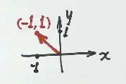

# 线性代数入门——向量概念与几何直观

> **第 0 讲第 1 节**(线代第一讲,基础阶段入门)

---

## 〇、考情定位

考研线代共 **6 讲**,分 3 大版块:

| 版块 | 涵盖讲次 | 题型定位 |
|------|---------|----------|
| 基础版块 | 行列式、矩阵 | 计算工具 |
| 主题版块 | 向量组、方程组 | 传统主线 |
| ★ **应用版块** | 特征值、二次型 | **命题区分度所在** |

「避坑」**特征值 + 二次型**打星——大题大概率出在这两块里。其余 4 个小题分散在 6 部分,保证知识全面性。

---

## 一、线性代数到底在研究什么

**一句话**:线性代数是**一种代数结构**,基石叫**向量空间**,研究**向量与向量之间的关系**。

「避坑」**为什么线代容易学糊**:零碎概念多,各种小结论/方法/说法交织,同一意思换 3 种说法。**主线要抓牢**——「向量空间里向量之间的关系」,所有具体内容都是这条主线的展开。

---

## 二、向量基本概念

### 2.1 定义

> **向量 = 拼在一起的有序数组**

两条核心:
1. **有序**:顺序不能换。$[-1, 1]$ 和 $[1, -1]$ 是**两个不同的向量**。
2. **数的个数** = **维数**。

### 2.2 行向量 vs 列向量

| 写法 | 名称 |
|------|------|
| 横着写 $[-1, 1]$ | **行向量** |
| 竖着写 $\begin{bmatrix} -1 \\ 1 \end{bmatrix}$ | **列向量** |

「避坑」行/列**纯粹是写法**,数学意义上没区别。区分用途 = 为后续运算做准备。

### 2.3 三种维数对照

| 维数  | 例子              | 图像                                                                 |
| --- | --------------- | ------------------------------------------------------------------ |
| 2 维 | $[-1, 1]$       |  |
| 3 维 | $[1, 2, -1]$    | ![[线性代数入门——向量概念与几何直观-1785133768869.webp\|181]]                     |
| 4 维 | $[1, 2, -1, 3]$ |                                                                    |

「秒杀技巧」看到一串被中括号(或小括号)包着的数 → **先反应:几维? 行还是列?**

---

## 三、几何直观:从 2 维到 4 维

向量 $\vec{v}$ = **空间里一根箭头**,从原点指向坐标对应的点。中学的「点的坐标」换个名字就是「向量」。

**高维为什么「既能看到又看不到」**:人是三维生物,四维的东西只能**通过三维截面截出来**研究,看不到全貌。

「避坑」**不要试图一把画出四维整体图**——做不到。研究高维只能靠**变换截面**(平移/旋转)从不同角度截。

---

## 四、向量的意义:数据 = 信息的载体

### 4.1 兴趣程度例子

把一个人对**运动、音乐**的兴趣分 3 档:

| 程度 | 数值 |
|------|------|
| 不喜欢 | $-1$ |
| 无所谓 | $0$ |
| 喜欢 | $+1$ |

那这个人的兴趣就是一个 **2 维向量**:

$$[\text{运动兴趣},\ \text{音乐兴趣}]$$

- $[-1, 1]$ = **不喜欢运动,但喜欢音乐**
- $[0, 1]$ = **对运动无所谓,但喜欢音乐**

「考点」**向量 = 储存信息的方式**。一组有序数组 = 一个对象的多个属性。现代数学(尤其大数据/机器学习)的核心就是**用向量存信息,用向量间的关系做判断**。

「避坑」**这就是为什么线代越来越重要**——现代技术建立在现代数学之上,而向量化是处理海量数据的核心工具。

---

## 五、点积:衡量向量亲疏(入门引入)

### 5.1 定义

**行 × 列,对应相乘再相加**:

$$\begin{bmatrix} a_1 & a_2 \end{bmatrix} \cdot \begin{bmatrix} b_1 \\ b_2 \end{bmatrix} = a_1 b_1 + a_2 b_2$$

「避坑」**为什么必须一行一列?** 人为规定的写法规则——让"对应相乘"在视觉上对齐。

### 5.2 亲疏判断

| 人 | 运动 | 音乐 | 向量 |
|----|------|------|------|
| A | $-1$ | $+1$ | $[-1, 1]$ |
| $B_1$ | $+1$ | $0$ | $[1, 0]$ |
| $B_2$ | $-1$ | $+1$ | $[-1, 1]$ |

- $A \cdot B_1 = (-1)(1) + (1)(0) = \mathbf{-1}$
- $A \cdot B_2 = (-1)(-1) + (1)(1) = \mathbf{2}$

「秒杀技巧」**点积越大,两个向量越"亲"**。$-1 < 2$,**A 跟 $B_2$ 更聊得来**(兴趣相投)。

### 5.3 高维扩展

判断一本书是不是某作家写的:把代表作和待判定的书都拆成 **10 万维**向量,做点积——**点积大的那本 = 该作家写的**。

「避坑」考试里最多算 3 对点积,但底层逻辑都一样:**把信息装进向量,用点积衡量亲疏**。

---

## 六、本节 3 件核心(必背)

1. **线代是什么**:向量空间 + 向量与向量的关系
2. **向量是什么**:有序数组(几维? 行还是列?)
3. **向量能干什么**:表达信息 + 用运算衡量关系

**下节预告**:向量的运算(加减、数乘、转置) + **矩阵** —— 矩阵本质上是向量的「打包」。