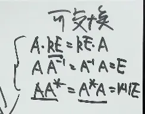

# 第 2 讲第 2 节 · 矩阵的基本运算与乘法

> 本节接 [矩阵的定义及其基本运算](矩阵的定义及其基本运算.md) ——上一节学了"矩阵本质 / 基 / Gram 矩阵"，本节把矩阵的**5 类基本运算**（相等、加法、数乘、乘法、转置）+ **方阵的行列式 6 条**+ **几类特殊矩阵**一次性收口。
>
> **本节灵魂（老王原话）**：**矩阵乘法 = 主要记哪些不能用**——加法、数乘跟中学代数一样，**唯独乘法彻底改规矩**。

---

## 〇、本节一句话方向

加法、数乘保留中学代数；**乘法满足 3 条、不满足 2 条**。后者是考研重点。

| 满足的 3 条 | 不满足的 2 条 ★★★ |
|------------|------------------|
| 结合律 $(AB)C=A(BC)$ | 交换律 $AB\neq BA$（一般情况） |
| 左 / 右分配律 $A(B+C)=AB+AC$ | 消去律 $AB=AC\Rightarrow B=C$（一般不成立） |
| 数乘结合律 $(kA)B=k(AB)$ |  |

---

## 一、矩阵的形状 / 相等 / 加减 / 数乘（老王开篇 4 件套）

### 1. $M\times N$ 矩阵——不一定是方阵

$m$ 行 $n$ 列的矩阵，简记 $A=(a_{ij})_{m\times n}$。当 $m=n$ 时称 $A$ 为 $n$ 阶方阵。

> [!避坑] **矩阵不一定是方的**。老王原话："你只有两个指标去取……那只能取两个人的身高体重……这个显然是有局限性的，他不应该这样。"——方阵是特殊情况，**$1000\times 2$ / $2\times 1000$ / $m\times s$ 都合法**。这跟 [第 1 讲 Gram 矩阵](矩阵的定义及其基本运算.md#三、矩阵里数据的关系%20从%20Gram%20矩阵看%20A%5ET%20A) "**$A^T A$ 必为方阵**"是配套的——任何形状的 $A$，一做 $A^T A$ 立刻得到方阵。

### 2. 同型矩阵

两个矩阵 $A=(a_{ij})_{m\times n}$、$B=(b_{ij})_{s\times k}$，若 $m=s$ **且** $n=k$，称 $A$ 与 $B$ **同型**。

### 3. 矩阵相等 $A=B$

$$A=B\;\Longleftrightarrow\;A,B\text{ 同型},\text{且}\;a_{ij}=b_{ij}\;(\forall i,j)$$

即**同型 + 对应元素全相等**。

### 4. 加法（"数据平移"）

**同型**矩阵才能相加。$C=A+B=(c_{ij})$，其中 $c_{ij}=a_{ij}+b_{ij}$——**对应元素相加**。

「考点」**老王解释**：加法 = "**把它从非中心位置移回到中心位置**"——两组数据各自的中心移到原点，就是相加。从向量角度看，就是**向量加法**。

> [!避坑] **不同型不能加**。这一条是矩阵加法和数乘**跟中学代数最大的"形而上"区别**——数字可以随便加，矩阵必须先配型。

### 5. 数乘矩阵

$kA$：$A$ 的**每个元素**都乘 $k$。**不是**只乘某一行/列。

> [!避坑] 数乘矩阵的"系统性"——见 [第 1 讲 § 1.2](矩阵的定义及其基本运算.md#2%20数乘矩阵%20vs%20数乘行列式%20为什么"系统性不变"%20#易错) 已经讲过"只乘一行/列会破坏比例"。老王这一节再次强调"**每个元素都要乘**"——这是矩阵的数乘和行列式的数乘**最核心的区别**（回忆 $\vert kA\vert = k^n \vert A\vert$ 的 $k^n$ 根因）。

### 6. 减法 = 加法 + 数乘的推论

$$A-B=A+(-1)\times B$$
### 7. 4 条运算律（老王原话："跟中学代数一样"）

| # | 运算律 | 公式 | 条件 |
|---|--------|------|------|
| ① | 加法**交换律** | $A+B=B+A$ | $A,B$ 同型 |
| ② | 加法**结合律** | $(A+B)+C=A+(B+C)$ | $A,B,C$ 同型 |
| ③ | **分配律**（双侧） | $k(A+B)=kA+kB$，$(k+l)A=kA+lA$ | $k,l$ 常数 |
| ④ | **数乘结合律** | $k(lA)=(kl)A=l(kA)$ | $k,l$ 常数 |

---

## 二、矩阵的乘法

### 1. 怎么乘

设 $A$ 是 $m\times s$ 矩阵，$B$ 是 $s\times n$ 矩阵（**$A$ 的列数 = $B$ 的行数**），则乘积 $C=AB$ 是 $m\times n$ 矩阵：

$$c_{ij}=A\text{ 第 }i\text{ 行}\cdot B\text{ 第 }j\text{ 列}=\sum_{k=1}^s a_{ik}b_{kj}$$![[矩阵的乘法及其运算律-1785748537027.webp|700|487x250]]
**口诀**：每行乘每列 = **内积**。

### 2. 几何意义（老王重点讲 1 段）

每行乘每列 = **内积** = **模 × 模 × 夹角余弦**。所以一个乘完之后，每个格子同时编码：

- 两向量的**大小**（模长乘积）
- 两向量的**夹角**（$\cos\theta$，即余弦相似度）

这跟 [Gram 矩阵](矩阵的定义及其基本运算.md#三、矩阵里数据的关系%20从%20Gram%20矩阵看%20A%5ET%20A) 的 $A^T A$ 是**同一件事**——$A^T A$ 之所以重要，就是把"内积"系统化地装进一个**必为方阵**的矩阵。
![[矩阵的乘法及其运算律-1785748849748.webp|700|510x261]]
### 3. 必背结论：$A^T A$ 必为方阵 #熟记 

$$A\ (m\times n)\ \Longrightarrow\ A^T\ (n\times m)\ \Longrightarrow\ A^T A\ (n\times n)$$

「考点」**任何形状的 $A$，$A^T A$ 一定是方阵**——这是 [Gram 矩阵](矩阵的定义及其基本运算.md#三、矩阵里数据的关系%20从%20Gram%20矩阵看%20A%5ET%20A) 的"为什么"。**只有方阵才有特征值、才有逆、才能做分解**——这就是"非方阵 → $A^T A$ 强制变方阵"的几何意义。

---
## 三、矩阵乘法满足的运算律
 
①结合律：$(A_{m\times s}B_{s\times n})C_n = A_{m\times s}(B_{s\times n}C_n)$
 
②分配律：$A_{m\times s}(B_{s\times n} + C_{s\times n}) = A_{m\times s}B_{s\times n} + A_{m\times s}C_{s\times n}$
$(A_{m\times s} + B_{m\times s})C_{s\times n} = A_{m\times s}C_{s\times n} + B_{m\times s}C_{s\times n}$

③数乘与矩阵乘积的结合律：$(kA_{m\times s})B_{s\times n} = A_{m\times s}(kB_{s\times n}) = k(A_{m\times s}B_{s\times n})$

## 四、矩阵乘法不满足的两条 #易错 
### 1. 交换律 $AB\neq BA$（一般情况）

$$A=\begin{bmatrix}1&1\\-1&-1\end{bmatrix},\quad B=\begin{bmatrix}1&-1\\-1&1\end{bmatrix}\boxed{AB=\begin{bmatrix}0&0\\0&0\end{bmatrix}\neq\begin{bmatrix}2&2\\-2&-2\end{bmatrix}=BA}$$

> [!避坑] 一个反例 = **两件事**：
> - $AB\neq BA$（不满足交换律）
> - $AB=O$ **不能**推出 $A=O$ 或 $B= O$（不满足消去律的根因，详见下条）
> - **可交换**的情况

### 2. 消去律 $AB=AC\not\Rightarrow B=C$

**推导 4 步走**（老王讲法）：
1. $AB=AC$
2. 移项得 $A(B-C)=O$
3. 由上一条反例 $AB=O\not\Rightarrow A=O$，所以 $B-C$ 也**不一定为 $O$**
4. 所以 $B$ 不一定等于 $C$

「秒杀技巧」**这两条反例是同源的**——只要记住 $AB=O\not\Rightarrow A=O$ 那个矩阵对，消去律不满足自动记住。

---

## 五、转置矩阵

### 转置

![[矩阵的乘法及其运算律-1785750349232.webp|514|548x182]]
### Gram 矩阵：
$$A^{T}A = \begin{bmatrix} a_{11} & a_{21} \\ a_{12} & a_{22} \\ a_{13} & a_{23} \end{bmatrix} \begin{bmatrix} a_{11} & a_{12} & a_{13} \\ a_{21} & a_{22} & a_{23} \end{bmatrix} = \begin{bmatrix} (a_1, a_1) & (a_1, a_2) & (a_1, a_3) \\ (a_2, a_1) & (a_2, a_2) & (a_2, a_3) \\ (a_3, a_1) & (a_3, a_2) & (a_3, a_3) \end{bmatrix}$$
$(a_1, a_1)$ 表示**内积**
### 1. 4 条运算律

| #   | 公式                   | 老王注解                                                         |
| --- | -------------------- | ------------------------------------------------------------ |
| ①   | $(A^T)^T=A$          | 翻两次回去                                                        |
| ②   | $(kA)^T=kA^T$        | $k$ 提出来**还是 $k$**（跟 $\vert kA\vert=k^n\vert A\vert$ **不一样**） |
| ③   | $(A+B)^T=A^T+B^T$    | 加法对转置可分配                                                     |
| ④   | $(AB)^T=B^TA^T$ #熟记  | **★ 穿脱原则**                                                   |

### 2. 穿脱原则 ★（老王命名）

$$\boxed{(ABC)^T=C^TB^TA^T}$$

老王原话："**穿衣服先穿里再穿外，脱衣服先脱外再脱内**"——原式从左到右写，转置后**从右到左写并各取转置**。

---

## 六、方阵的幂与矩阵多项式

### 1. 4 个"中学公式"全不能用（因为 $AB\neq BA$） #易错 

| 想写的"中学公式"                 | 实际展开                    | 错在哪         |
| ------------------------- | ----------------------- | ----------- |
| $(A+B)^2 \ne A^2+2AB+B^2$ | $A^2+\boxed{AB+BA}+B^2$ | $AB\neq BA$ |
| $(A-B)^2\ne A^2-2AB+B^2$  | $A^2-\boxed{AB+BA}+B^2$ | 同上          |
| $(A+B)(A-B)\ne A^2-B^2$   | $A^2+\boxed{BA-AB}-B^2$ | 同上          |
| $(AB)^m\ne A^mB^m$        | $(AB)(AB)\dots(AB)$     | 同上          |
> [!tip] 
> 单位阵+一般矩阵 (A+E) 可以使用两数之和的 n 次方公式
> [第二讲](0.%20杂项/题目/线代/第二讲.md#2%203%20矩阵拆分) ^o70b4u

### 2. 矩阵多项式 $f(A)$（必背形式）

设 $f(x)=a_0+a_1x+\cdots+a_mx^m$，则

$$\boxed{f(A)=a_0E+a_1A+a_2A^2+\cdots+a_mA^m}$$

> [!避坑] **常数项 $a_0$ 必须乘单位阵 $E$** ——$a_0$ 是数，$A$ 是矩阵，不能直接相加。$f(A)$ 之所以能这么直接换元，根因是 $AE=EA=A$——单位阵跟任何同阶方阵**可交换**，$f$ 里所有 $x$ 之间的乘法交换律不再需要。

---

## 七、方阵的行列式 6 条

老王原话："**矩阵的加减乘转置和行列式，在基本运算上的结论说完了**"——下表是这 6 条的总结。

| #   | 公式                                                                         | 关键提醒                                                           | 考频  |
| --- | -------------------------------------------------------------------------- | -------------------------------------------------------------- | --- |
| ①   | $\vert kA\vert=k^n\vert A\vert \neq k\vert A\vert$（$n\geq 2$, $k\neq 0,1$） | $k$ 提 $n$ 次（$n$ = 阶数）                                          | ★★  |
| ②   | $\vert A+B\vert\neq \vert A\vert+\vert B\vert$（一般地）                        | 行列式不是线性算子                                                      |     |
| ③   | $A\neq O\;\nRightarrow\vert A\vert\neq 0$                                  | $A$ 是"对应法则"非零 ≠ 测度非零                                           | ★★  |
| ④   | $A\neq B\;\nRightarrow\vert A\vert\neq \vert B\vert$                       | 同上                                                             |     |
| ⑤   | $\vert A^T\vert=\vert A\vert$                                              | [行列式七大性质之首](AI课程总结/基础篇/线代/第1讲/行列式的性质.md#二、性质%201%20行列互换%20值不变) |     |
| ⑥   | $\vert AB\vert=\vert A\vert\vert B\vert$（$A,B$ 同阶方阵）                       | 行列式**唯一可乘**的"对应法则"                                             | ★★★ |

### 反例：$A\neq O$ 但 $\vert A\vert = 0$

$$A=\begin{bmatrix}1&1\\-1&-1\end{bmatrix}\neq O,\quad \vert A\vert=1\cdot(-1)-1\cdot(-1)=0$$

两行成比例（[第 1 讲七大性质之一](AI课程总结/基础篇/线代/第1讲/行列式的性质.md)）⇒ 行列式 = 0。

> [!避坑] "**矩阵非零 ⇏ 行列式非零**"和"**矩阵不等 ⇏ 行列式不等**"是同一类陷阱——把"对应法则"和"测度"两件事混为一谈。**对非方阵**连这两个推论都不能用（行列式压根不存在）。

---

## 八、几类重要矩阵

### 1. 单位矩阵 $E$

主对角线全 1、其余全 0 的 $n$ 阶方阵，记 $E_n$（或 $I$）。
![[矩阵的乘法及其运算律-1785752656748.webp]]
$$\boxed{E_nA=AE_n=A}$$

> [!避坑] 当 $A$ 是 $3\times 2$、$B$ 是 $2\times 3$ 时，$AB$ 是 $3\times 3$，要乘的"1" 是 $E_3$；$BA$ 是 $2\times 2$，要乘的是 $E_2$

### 2. 数量矩阵 $kE$ #常用 

数 $k$ 乘单位阵 $kE$。**核心性质**：
![[矩阵的乘法及其运算律-1785752673299.webp]]
$$\boxed{kE\cdot A=A\cdot kE=kA}$$

> [!考点] 数量阵是**唯一一类"可跟任何同阶方阵交换"的特殊矩阵**——一旦看到 $kE$，在乘法里**可以自由左右挪**。老王原话："**虽然现在你觉得很简单，以后大有用处**"。

### 3. 对角矩阵 $\Lambda$ #重要 

非主对角线元素全为 0 的方阵，记

$$\Lambda=\operatorname{diag}(\lambda_1,\lambda_2,\ldots,\lambda_n)$$
![[矩阵的乘法及其运算律-1785752867710.webp|220]]
- **单位阵** = 主对角线全 1 的对角阵
- **数量阵** = 主对角线全 $k$ 的对角阵

> [!考点] 对角阵是后续**特征值、相似对角化、二次型标准形**的统一目标形态。**考研大题最终几乎都要化到对角阵**——这是大题链的"终点"。

### 4. 上 / 下三角矩阵

主对角线某一侧全 0 的方阵。**三角阵的行列式 = 主对角线元素乘积**：

$$\begin{vmatrix}a_{11}&a_{12}&a_{13}\\0&a_{22}&a_{23}\\0&0&a_{33}\end{vmatrix}=a_{11}a_{22}a_{33}$$
![[矩阵的乘法及其运算律-1785753095272.webp|328|391x324]]

> [!秒杀技巧] 遇到三角阵求行列式，**直接连乘主对角线**——比 [按行（列）展开](AI课程总结/基础篇/线代/第1讲/行列式的展开定理(第三种定义).md) 秒杀。

### 5. 对称矩阵 #重要 #必考 

满足 $A^T=A$（$\Leftrightarrow a_{ij}=a_{ji}$）的方阵。

$$A=\begin{bmatrix}1&-2&1\\-2&0&3\\1&3&-1\end{bmatrix},\quad A^T=\begin{bmatrix}1&-2&1\\-2&0&3\\1&3&-1\end{bmatrix}=A$$

> [!考点] **老王原话**：**"考研大题 12 分那种大题，它一定是对称阵"**——特征值、相似对角化、二次型标准形，一旦题目给"对称阵"，就有正交相似对角化、二次型化标准形两条主线可选。
>
> 「秒杀技巧」**Gram 矩阵 $A^T A$ 必为对称阵**（不论 $A$ 是不是方阵）——这是上一节 Gram 矩阵的"为什么必为对称"。

### 6. 反对称矩阵

满足 $A^T=-A$ 的方阵，等价于

$$a_{ij}=-a_{ji}\;(i\neq j),\quad a_{ii}=0$$

> [!避坑] **反对称阵 = 主对角线必为 0、对称位互为相反数**。老王原话："**反对称阵相对来讲就不是这个阶段它的重点，近 10-15 年的考题里，好像从来没有出现过纯反对称阵的考题**"——要复习，但**不是大题重点**。
> 例如：
> ![[矩阵的乘法及其运算律-1785753744540.webp|299x159]]

### 7. 行 / 列向量

| 名称 | 形状 | 别名 |
|------|------|------|
| **行矩阵** | $1\times n$ | 行向量 $\boldsymbol{\alpha}^T$ |
| **列矩阵** | $n\times 1$ | 列向量 $\boldsymbol{\alpha}$ |

> [!避坑] 线性代数里**默认"向量 = 列向量"**。行向量写作 $\boldsymbol{\alpha}^T$。前面 [第 0 讲线性变换](AI课程总结/基础篇/线代/第0讲/线性代数入门——运算、矩阵与线性变换.md) 里 $A\boldsymbol{\alpha}=\boldsymbol{\beta}$ 的 $\boldsymbol{\alpha}$ 默认就是列向量。

---

## 九、本节一句话总结

> **矩阵的 5 类基本运算 = 相等 + 加法 + 数乘 + 乘法 + 转置**。**加法 / 数乘** 跟中学一样（含 4 条运算律 + "系统性不变"）。**乘法** = 每行乘每列做内积，**满足** 结合律 / 左/右分配律 / 数乘结合律，**不满足** 交换律 / 消去律（同源反例）。**转置**：$(AB)^T = B^TA^T$（穿脱原则）。**方阵的幂**：跟交换顺序有关的"中学公式"全作废。**矩阵多项式**：$f(A)=a_0E+a_1A+\cdots$，**$a_0$ 必须带 $E$**。**方阵的行列式 6 条**：唯一能乘的是 $\vert AB\vert=\vert A\vert\vert B\vert$。**几类矩阵**：单位阵 $E_n$（必写下标）/ 数量阵 $kE$（**以后大有用处**）/ 对角阵（**大题终点**）/ 三角阵（行列式 = 主对角线乘积）/ 对称阵（**大题主角**）/ 反对称阵（次重点）。**行/列向量**：默认列向量。

---

## 十、与下节衔接

- **§ 2.3 讲方阵的逆**——$AA^{-1}=E$，回接 [第 0 讲方程组求解](AI课程总结/基础篇/线代/第0讲/线性代数入门——方程组求解.md) 的 $A\boldsymbol{\alpha}=\boldsymbol{\beta}$
- **§ 2.4 讲矩阵分块法求逆**——老师原话："**逆矩阵的事要好好讲**"——分块求逆是常用工具
- **第 3 讲起** 进入[克拉默法则](AI课程总结/基础篇/线代/第1讲/克拉默法则(第10节).md) 的对角化版本，呼应本节 $\vert AB\vert=\vert A\vert\vert B\vert$

---

## 十一、避坑汇总（老王点过的 14 条）

| # | 坑 | 怎么避 |
|---|------|------|
| 1 | 矩阵当成方阵 | **不一定方**；$A^T A$ 必方是配套补救 |
| 2 | 不同型加法 $A+B$ | **行数列数都相等** 才能加 |
| 3 | 减法单独记运算律 | $A-B=A+(-1)B$，**用加法+数乘**的运算律 |
| 4 | $AB$ 维数算错 | **左列 = 右行**才能乘；结果形状 = (左行, 右列) |
| 5 | $AB=BA$ | **默认不相等**；题目没说 $AB=BA$ 时**严禁自己换成等式** |
| 6 | $AB=O$ 推出 $A=O$ 或 $B=O$ | 矩阵里**不能**；反例 $A=\begin{bmatrix}1&1\\-1&-1\end{bmatrix},B=\begin{bmatrix}1&-1\\-1&1\end{bmatrix}$ |
| 7 | 消去律 $AB=AC\Rightarrow B=C$ | 根因 = 第 6 条；$A(B-C)=O$ 推不出 $B-C=O$ |
| 8 | $(A+B)^2=A^2+2AB+B^2$ | **不能**；要展开 = $A^2+AB+BA+B^2$ |
| 9 | $(AB)^T=A^TB^T$ | **不能**；是 $B^TA^T$（穿脱原则） |
| 10 | $(kA)^T$ 的 $k$ 怎么提 | **还是 $k$**；跟 $\vert kA\vert=k^n\vert A\vert$（提 $k^n$）**不一样** |
| 11 | $f(A)$ 常数项漏写 $E$ | $a_0$ 必须**乘 $E$** 才能跟矩阵相加 |
| 12 | $A\neq O$ 推出 $\vert A\vert\neq 0$ | **不能**；反例 $A=\begin{bmatrix}1&1\\-1&-1\end{bmatrix}$ |
| 13 | $\vert A+B\vert=\vert A\vert+\vert B\vert$ | **不能**；行列式不是线性算子 |
| 14 | 单位阵 $E$ 漏写下标 | $AB$ 是几阶，$E$ 就是几阶 —— $E_2, E_3$ 不能混 |
