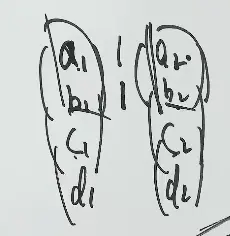

# 第 3 讲第 3 节 · 判别线性相关性的七大定理

> **本节结论**：七条定理不用分别死背，统一翻译成三句话：
>
> 1. 线性相关 $\\Longleftrightarrow$ 齐次方程组 $A\boldsymbol{x}=\boldsymbol{0}$ 有非零解；
> 2. 可线性表示 $\\Longleftrightarrow$ 非齐次方程组 $A\boldsymbol{x}=\boldsymbol{\beta}$ 有解；
> 3. 秩就是“真正独立方向数”，拿它和列数比，相关性立刻落地。

> **前情**：[线性相关的定义与本质](AI课程总结/基础篇/线代/第3讲/向量的内积、正交与线性表示.md#五、线性相关与线性无关：把定义翻译成“是否有多余向量”)已经说明“相关 = 有多余向量”；这一节把它升级为方程组、秩和七条考场判据。

---

## 一、七条定理总表：先把条件反射练出来

设

$$
A=[\boldsymbol{\alpha}_1,\boldsymbol{\alpha}_2,\ldots,\boldsymbol{\alpha}_m]
\in\mathbb{R}^{n\times m}.
$$

| 定理 | 题面信号 | 直接结论 |
|---|---|---|
| 1 | 某个向量能由其余向量表示 | 整组线性相关 |
| 2 | 无关组添入 $\boldsymbol{\beta}$ 后相关 | $\boldsymbol{\beta}$ 可由原无关组唯一表示 |
| 3 | $t$ 个向量可由 $s$ 个向量表示，且 $t>s$ | 这 $t$ 个向量线性相关 |
| 4 | 齐次方程组 $A\boldsymbol{x}=\boldsymbol{0}$ | 有非零解 $\Longleftrightarrow$ 列向量组相关 |
| 5 | 非齐次方程组 $A\boldsymbol{x}=\boldsymbol{\beta}$ | 有解 $\Longleftrightarrow$ $\boldsymbol{\beta}$ 可由 $A$ 的列向量表示 |
| 6 | 一部分向量已经相关 | 整体必相关 |
| 7 | 无关组的每个向量同步添加分量 | 新向量组仍无关 |

> [!秒杀技巧] 选择题先找关键词：**“齐次”看定理 4，“可表示”看定理 5，“一部分”看定理 6，“添分量”看定理 7**。题目换马甲，结论不换。

---

## 二、定理 1：相关的本质是“有人多余”

$$
\boxed{
\boldsymbol{\alpha}_1,\ldots,\boldsymbol{\alpha}_m\text{ 线性相关}
\Longleftrightarrow
\text{至少有一个向量可由其余向量线性表示}}
$$

若存在不全为零的 $k_1,\ldots,k_m$，使

$$
k_1\boldsymbol{\alpha}_1+\cdots+k_m\boldsymbol{\alpha}_m=\boldsymbol{0},
$$

取某个 $k_i\ne0$ 并移项，便有

$$
\boldsymbol{\alpha}_i
=-\sum_{j\ne i}\frac{k_j}{k_i}\boldsymbol{\alpha}_j.
$$

反过来，若某一向量可由其余向量表示，移项即可构造出一组不全为零的系数。

> [!考点] 判断相关时，只要明确找出一个“可被其余表示”的向量，证明就结束；别傻乎乎再去解整套齐次方程组。

---

## 三、定理 2：无关组中的表示法唯一

若 $\boldsymbol{\alpha}_1,\ldots,\boldsymbol{\alpha}_m$ 线性无关，而

$$
\boldsymbol{\beta},\boldsymbol{\alpha}_1,\ldots,\boldsymbol{\alpha}_m
$$

线性相关，则

$$
\boxed{
\boldsymbol{\beta}\text{ 可由 }\boldsymbol{\alpha}_1,\ldots,\boldsymbol{\alpha}_m
\text{ 线性表示，且表示法唯一}}
$$

### 1. 为什么一定能表示

原来的 $m$ 个向量无关，相关性不可能只发生在它们内部；因此新添的 $\boldsymbol{\beta}$ 必可由原向量组表示。

### 2. 为什么唯一

若

$$
\boldsymbol{\beta}=
\sum_{i=1}^m l_i\boldsymbol{\alpha}_i
=\sum_{i=1}^m h_i\boldsymbol{\alpha}_i,
$$

相减得

$$
\sum_{i=1}^m(l_i-h_i)\boldsymbol{\alpha}_i=\boldsymbol{0}.
$$

因原向量组无关，只能 $l_i-h_i=0$，即 $l_i=h_i$。

> [!易错提醒] “表示唯一”必须有**原向量组线性无关**这个前提。原组相关时，同一个向量通常能写出无穷多种表示，别把唯一性白送出去。

---

## 四、定理 3：以少表多，多的必相关

若 $\boldsymbol{\beta}_1,\ldots,\boldsymbol{\beta}_t$ 均可由 $s$ 个向量
$\boldsymbol{\alpha}_1,\ldots,\boldsymbol{\alpha}_s$ 线性表示，且 $t>s$，则

$$
\boxed{
\boldsymbol{\beta}_1,\ldots,\boldsymbol{\beta}_t\text{ 线性相关}}
$$

等价地，若 $\boldsymbol{\beta}_1,\ldots,\boldsymbol{\beta}_t$ 线性无关，且都可由 $s$ 个向量表示，则

$$
\boxed{t\le s}
$$

| 题面 | 结论 |
|---|---|
| $3$ 个向量都能由 $2$ 个向量表示 | 这 $3$ 个向量必相关 |
| $5$ 个向量均落在同一二维子空间 | 这 $5$ 个向量必相关 |
| $t$ 个无关向量都能由 $s$ 个向量表示 | 必有 $t\le s$ |

> [!秒杀技巧] 这里**不要求**那 $s$ 个向量无关。题目只要给出“以少表多”，就直接判“多的相关”；还去讨论前面那组是否相关，纯属给自己加戏。

---

## 五、定理 4：线性相关性与齐次方程组

把 $m$ 个 $n$ 维列向量并成矩阵

$$
A=[\boldsymbol{\alpha}_1,\ldots,\boldsymbol{\alpha}_m]
=\begin{bmatrix}
a_{11}&\cdots&a_{1m}\\
\vdots&&\vdots\\
a_{n1}&\cdots&a_{nm}
\end{bmatrix}.
$$

则

$$
A\boldsymbol{x}
=x_1\boldsymbol{\alpha}_1+\cdots+x_m\boldsymbol{\alpha}_m.
$$

因此

$$
\boxed{
\boldsymbol{\alpha}_1,\ldots,\boldsymbol{\alpha}_m\text{ 线性相关}
\Longleftrightarrow
A\boldsymbol{x}=\boldsymbol{0}\text{ 有非零解}
\Longleftrightarrow r(A)<m}
$$

反面就是

$$
\boxed{
\boldsymbol{\alpha}_1,\ldots,\boldsymbol{\alpha}_m\text{ 线性无关}
\Longleftrightarrow
A\boldsymbol{x}=\boldsymbol{0}\text{ 只有零解}
\Longleftrightarrow r(A)=m}
$$

### 1. 一个数，两个身份

在 $A\boldsymbol{x}=\boldsymbol{0}$ 中，$x_i$ 是方程组的**未知量**；在

$$
x_1\boldsymbol{\alpha}_1+\cdots+x_m\boldsymbol{\alpha}_m=\boldsymbol{0}
$$

中，它是线性组合**系数**。东西是同一个，叫法不同而已。

### 2. 三种形状，考场只抓结论

| 系数矩阵 $A$ 的形状 | 条件 | 对齐次方程组的判断 | 对列向量组的判断 |
|---|---|---|---|
| 胖矩阵 | $n<m$ | 必有非零解 | $m$ 个 $n$ 维向量必相关 |
| 方阵 | $n=m$ | $\vert A\vert=0$ 有非零解；$\vert A\vert\ne0$ 只有零解 | 分别相关；无关 |
| 瘦矩阵 | $n>m$ | 不能只凭形状判断 | 继续算秩或找列向量关系 |

> [!考点] **任何 $n+1$ 个 $n$ 维向量必线性相关。** 本质是 $r(A)\le n<n+1$，不是玄学，是列数超过了可提供的独立方向数。

> [!避坑] $n>m$ 的“瘦矩阵”当然可以写出来；真正不可能的是它有超过 $m$ 个**独立**方程。行化简后必有冗余行，别把“方程组不存在”这种口语当定理背。

---

## 六、定理 5：线性表示与非齐次方程组

$$
\boldsymbol{\beta}=x_1\boldsymbol{\alpha}_1+\cdots+x_s\boldsymbol{\alpha}_s
\Longleftrightarrow
A\boldsymbol{x}=\boldsymbol{\beta},
\qquad
A=[\boldsymbol{\alpha}_1,\ldots,\boldsymbol{\alpha}_s].
$$

所以

$$
\boxed{
\boldsymbol{\beta}\text{ 可由 }\boldsymbol{\alpha}_1,\ldots,\boldsymbol{\alpha}_s\text{ 线性表示}
\Longleftrightarrow
A\boldsymbol{x}=\boldsymbol{\beta}\text{ 有解}
\Longleftrightarrow
r(A)=r([A,\boldsymbol{\beta}])}
$$

若不能表示，则

$$
\boxed{
r([A,\boldsymbol{\beta}])=r(A)+1}
$$

因为新添的 $\boldsymbol{\beta}$ 不在 $A$ 的列向量所张成的空间中，恰好增加一个独立方向。

| $\boldsymbol{\beta}$ 的位置                                                        | 方程组 $A\boldsymbol{x}=\boldsymbol{\beta}$ | 秩                                  | 结论   |
| ------------------------------------------------------------------------------- | ---------------------------------------- | ---------------------------------- | ---- |
| 在 $\operatorname{span}\{\boldsymbol{\alpha}_1,\ldots,\boldsymbol{\alpha}_s\}$ 中 | 有解                                       | $r(A)=r([A,\boldsymbol{\beta}])$   | 可表示  |
| 不在该张成空间中                                                                        | 无解                                       | $r([A,\boldsymbol{\beta}])=r(A)+1$ | 不可表示 |

> [!秒杀技巧] 问“$\boldsymbol{\beta}$ 能不能由给定向量组表示”，翻译成**增广矩阵不增秩**。看到 $r(A)=r([A,\boldsymbol{\beta}])$，别再绕弯子。

> [!易错提醒] 线性表示的系数允许全为 $0$；当 $\boldsymbol{\beta}=\boldsymbol{0}$ 时，这正是一个合法表示。只有讨论“线性相关”时，系数才要求不全为 $0$。

---

## 七、定理 6：部分相关，整体必相关

$$
\boxed{
\text{若一个向量组中有一部分向量线性相关，则整个向量组线性相关}}
$$

设其中 $\boldsymbol{\alpha}_1,\ldots,\boldsymbol{\alpha}_j$ 已线性相关，则存在不全为零的 $k_1,\ldots,k_j$，使

$$
k_1\boldsymbol{\alpha}_1+\cdots+k_j\boldsymbol{\alpha}_j=\boldsymbol{0}.
$$

给剩余向量全部补系数 $0$，便有

$$
k_1\boldsymbol{\alpha}_1+\cdots+k_j\boldsymbol{\alpha}_j
+0\boldsymbol{\alpha}_{j+1}+\cdots+0\boldsymbol{\alpha}_m
=\boldsymbol{0}.
$$

因此整体仍相关。

逆否命题更常用：

$$
\boxed{
\text{整体线性无关}\Longrightarrow\text{任一部分向量组线性无关}}
$$

> [!考点] **部分相关，整体必相关；整体无关，部分必无关。** 这两句必须整组背，别只背前半句。

---

## 八、定理 7：同步添分量，不会毁掉无关性

设 $\boldsymbol{\alpha}_1,\ldots,\boldsymbol{\alpha}_s$ 是 $n$ 维线性无关向量。给每个向量都添加相同个数的分量，得到 $(n+p)$ 维新向量

$$
\boldsymbol{\alpha}_i^*
=\begin{bmatrix}
\boldsymbol{\alpha}_i\\
\boldsymbol{\gamma}_i
\end{bmatrix}
\qquad(i=1,\ldots,s).
$$

则

$$
\boxed{
\boldsymbol{\alpha}_1,\ldots,\boldsymbol{\alpha}_s\text{ 线性无关}
\Longrightarrow
\boldsymbol{\alpha}_1^*,\ldots,\boldsymbol{\alpha}_s^*\text{ 线性无关}}
$$

理由很简单：若

$$
x_1\boldsymbol{\alpha}_1^*+\cdots+x_s\boldsymbol{\alpha}_s^*=\boldsymbol{0},
$$

只看原来的前 $n$ 个分量，就得到

$$
x_1\boldsymbol{\alpha}_1+\cdots+x_s\boldsymbol{\alpha}_s=\boldsymbol{0}.
$$

原组无关，故所有 $x_i=0$，新组也无关。

其逆否命题：

$$
\boxed{
\text{原向量组线性相关}
\Longrightarrow
\text{各向量去掉相同位置的若干分量后仍线性相关}}
$$

> [!避坑] 定理 7 说的是**每个向量同步添同样个数的分量**，不是随便删一个向量，也不是把不同位置乱删一通。条件偷换，结论就没资格用。

---

## 九、一页必背：相关性判别翻译器

$$
\boxed{
\text{相关}
\Longleftrightarrow
A\boldsymbol{x}=\boldsymbol{0}\text{ 有非零解}
\Longleftrightarrow r(A)<\text{列数}}
$$

$$
\boxed{
\text{无关}
\Longleftrightarrow
A\boldsymbol{x}=\boldsymbol{0}\text{ 只有零解}
\Longleftrightarrow r(A)=\text{列数}}
$$

$$
\boxed{
\boldsymbol{\beta}\text{ 可由 }A\text{ 的列向量表示}
\Longleftrightarrow
A\boldsymbol{x}=\boldsymbol{\beta}\text{ 有解}
\Longleftrightarrow r(A)=r([A,\boldsymbol{\beta}])}
$$

$$
\boxed{
\begin{gathered}
\text{以少表多，多的相关；}\quad \text{无关组中，表示法唯一}\\
\text{部分相关，整体必相关；}\quad \text{整体无关，部分必无关}\\
\text{原来无关，延长必无关；}\quad \text{原来相关，缩短必相关}
\end{gathered}}
$$

**一句话记住**：先把向量组拼成矩阵。问相关性，盯齐次方程组和秩；问能否表示，盯非齐次方程组和增广矩阵的秩。考研数学不是学数学，是练题型——这七条练成条件反射，线代相关性题你就不会被题面带着跑。
