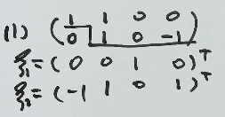
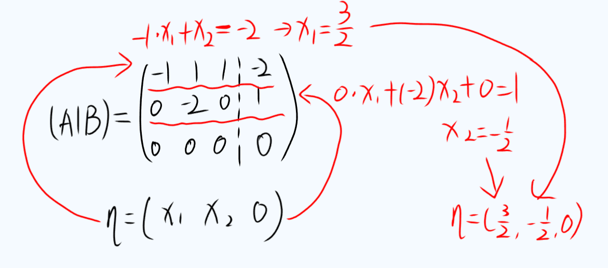

# 第 4 讲第 2 节 · 非齐次线性方程组

> **本节结论**：非齐次方程组 $A\boldsymbol{x}=\boldsymbol{b}$ 先看能不能解，再看有几个解；能不能解看 $r(A)$ 与 $r([A:\boldsymbol{b}])$，解的个数再与未知数个数 $n$ 比。
>
> **本节灵魂**：
>
> 1. $r(A)\ne r([A:\boldsymbol{b}])$：无解；
> 2. $r(A)=r([A:\boldsymbol{b}])=n$：唯一解；
> 3. $r(A)=r([A:\boldsymbol{b}])<n$：无穷多解；
> 4. 有解时，非齐次通解 $=$ 对应齐次通解 $+$ 一个非齐次特解。
>
> **前情**：[齐次方程组的基础解系与通解](AI课程总结/基础篇/线代/第4讲/齐次线性方程组.md#五、基础解系与通解)已经解决“齐次通解怎么写”；本节只增加“判有解、找特解、拼通解”三件事。

---

## 一、非齐次方程组：多出来的是自由项与增广矩阵

一般非齐次线性方程组写成

$$
A_{m\times n}\boldsymbol{x}=\boldsymbol{b},
\qquad
\boldsymbol{b}\ne\boldsymbol{0}.
$$

若把 $A$ 的列向量记为

$$
A=[\boldsymbol{\alpha}_1,\boldsymbol{\alpha}_2,
\ldots,\boldsymbol{\alpha}_n],
$$

则

$$
A\boldsymbol{x}=\boldsymbol{b}
\Longleftrightarrow
x_1\boldsymbol{\alpha}_1+x_2\boldsymbol{\alpha}_2+
\cdots+x_n\boldsymbol{\alpha}_n=\boldsymbol{b}.
$$

把自由项接到系数矩阵右侧，得到增广矩阵

$$
[A:\boldsymbol{b}].
$$

| 语言 | $A\boldsymbol{x}=\boldsymbol{b}$ 有解的含义 |
|---|---|
| 方程组 | 存在一组未知量满足全部方程 |
| 向量组 | $\boldsymbol{b}$ 可由 $A$ 的列向量线性表示 |
| 向量空间 | $\boldsymbol{b}$ 落在 $\operatorname{span}\{\boldsymbol{\alpha}_1,\ldots,\boldsymbol{\alpha}_n\}$ 中 |
| 秩 | 添入 $\boldsymbol{b}$ 后不增加独立方向，即 $r(A)=r([A:\boldsymbol{b}])$ |

$$
\boxed{
A\boldsymbol{x}=\boldsymbol{b}\text{ 有解}
\Longleftrightarrow
\boldsymbol{b}\in\operatorname{span}\{\boldsymbol{\alpha}_1,
\ldots,\boldsymbol{\alpha}_n\}
\Longleftrightarrow
r(A)=r([A:\boldsymbol{b}]).}
$$

> **前情**：[线性表示与非齐次方程组](AI课程总结/基础篇/线代/第3讲/判别线性相关性的七大定理.md#六、定理%205：线性表示与非齐次方程组)已经给出“可表示 $\Longleftrightarrow$ 有解”；这里把它作为所有判定题的总开关。

由于增广矩阵只比 $A$ 多一列，必有

$$
r(A)\le r([A:\boldsymbol{b}])\le r(A)+1.
$$

因此一旦两秩不相等，就只能是

$$
\boxed{r([A:\boldsymbol{b}])=r(A)+1,}
$$

即 $\boldsymbol{b}$ 新增了一个独立方向，方程组无解。

> [!考点] “有解”不是看 $r(A)$ 大不大，而是看添入 $\boldsymbol{b}$ 后秩变不变。

> [!易错提醒] 只给 $r(A)=n$ 或 $r(A)<n$，都不能直接断言非齐次方程组有解；你还没检查增广矩阵，先别急着下结论。

---

## 二、解的三种情况：先比两秩，再与 $n$ 比

设未知数个数为 $n$，则完整判定为

$$
\boxed{
\begin{cases}
r(A)\ne r([A:\boldsymbol{b}])
&\Longrightarrow \text{无解},\\[2mm]
r(A)=r([A:\boldsymbol{b}])=n
&\Longrightarrow \text{唯一解},\\[2mm]
r(A)=r([A:\boldsymbol{b}])<n
&\Longrightarrow \text{无穷多解}.
\end{cases}}
$$

| 第一步 | 第二步 | 结论 |
|---|---|---|
| $r(A)\ne r([A:\boldsymbol{b}])$ | 不必再比 | 无解 |
| $r(A)=r([A:\boldsymbol{b}])$ | 公共秩等于 $n$ | 唯一解 |
| $r(A)=r([A:\boldsymbol{b}])$ | 公共秩小于 $n$ | 无穷多解 |

其中

$$
n-r(A)
$$

就是有解时的自由变量个数。若它为 $0$，每个未知量都被确定；若它大于 $0$，自由变量可任意取值，因而有无穷多解。

> [!秒杀技巧] 非齐次“三岔路”固定顺序：**先比较 $r(A)$ 与 $r([A:\boldsymbol{b}])$，相等后再和列数 $n$ 比**。

> [!避坑] $m=n$ 只说明方程数等于未知数个数，什么解的结论都推不出来；不算秩就开口，基本就是给选项送人头。

---

## 三、解的性质与通解结构

设 $\boldsymbol{\eta}_1,\boldsymbol{\eta}_2$ 是

$$
A\boldsymbol{x}=\boldsymbol{b}
$$

的两个解，$\boldsymbol{\xi}$ 是对应齐次方程组

$$
A\boldsymbol{x}=\boldsymbol{0}
$$

的解。

### 1. 两个非齐次解作差，得到齐次解 #熟记 

$$
A(\boldsymbol{\eta}_1-\boldsymbol{\eta}_2)
=\boldsymbol{b}-\boldsymbol{b}
=\boldsymbol{0}.
$$

所以

$$
\boxed{
\boldsymbol{\eta}_1-\boldsymbol{\eta}_2
\text{ 是 }A\boldsymbol{x}=\boldsymbol{0}\text{ 的解}.}
$$

### 2. 齐次解加非齐次特解，仍是非齐次解 #熟记 

$$
A(k\boldsymbol{\xi}+\boldsymbol{\eta})
=k\boldsymbol{0}+\boldsymbol{b}
=\boldsymbol{b}.
$$

所以

$$
\boxed{
k\boldsymbol{\xi}+\boldsymbol{\eta}
\text{ 是 }A\boldsymbol{x}=\boldsymbol{b}\text{ 的解}.}
$$

若 $\boldsymbol{\xi}_1,\ldots,\boldsymbol{\xi}_{n-r}$ 是导出方程组的基础解系，$\boldsymbol{\eta}$ 是非齐次方程组的一个特解，则

$$
\boxed{
\boldsymbol{x}
=k_1\boldsymbol{\xi}_1+
\cdots+k_{n-r}\boldsymbol{\xi}_{n-r}
+\boldsymbol{\eta},
\qquad k_i\in\mathbb{R}.}
$$

这说明非齐次解集不是过原点的线性空间，而是把齐次解空间整体平移到 $\boldsymbol{\eta}$ 处得到的仿射空间。

| 运算            | 结果                                                                    |
| ------------- | --------------------------------------------------------------------- |
| 非齐次解 $-$ 非齐次解 | 齐次解                                                                   |
| 齐次解 $+$ 非齐次特解 | 非齐次解                                                                  |
| 两个非齐次解直接相加    | 设 $\alpha=\boldsymbol{\eta}_3+2\boldsymbol{\eta}_2$，$A \alpha=(1+2)b$ |

> [!考点] 抽象解向量题不要硬解方程组；先用 $A\boldsymbol{\eta}_i=\boldsymbol{b}$ 计算线性组合对应的自由项倍数。

> [!易错提醒] 特解不唯一，基础解系也不唯一；但“齐次通解 $+$ 一个特解”这个结构永远不变。

---

## 四、求非齐次通解的固定三步 #解题方法 

### 第一步：求导出方程组的通解

把自由项去掉，得到导出方程组

$$
A\boldsymbol{x}=\boldsymbol{0}.
$$

按[求齐次方程组通解的固定三步](AI课程总结/基础篇/线代/第4讲/齐次线性方程组.md#六、求齐次方程组通解的固定三步%20解题方法)：

1. 对 $A$ 作初等行变换，化为行阶梯形；
2. 由台阶数确定 $r(A)$，选定自由变量；
3. 自由变量位置摆单位阵，回代得到基础解系。

> [!tip] 其次通解的求解
> - 先判断系数矩阵秩的大小
> - 找出 $r$ 个列向量，这 $r$ 个列向量能组成秩为 $r$ 的矩阵
> - 使用 $s=n-r(A)$ 公式求出自由变量的个数
> - 第二步挑剩下的就是自由向量
> - 设 $\xi=(x_{1},x_{2},\dots x_{n})^T, n{为未知数的个数}$
> - 令自由变量位置所有的数组成的矩阵为单位矩阵
> - 系数矩阵各非零行向量 $\times$ $\xi$ =0
> - 带入求解：参考非齐次 $\eta$ 的求解
> 
### 第二步：求一个非齐次特解

回到增广矩阵 $[A:\boldsymbol{b}]$，只要求找到一个解即可。最省计算的固定操作是 #重要 

$$
\boxed{\text{求特解时，自由变量一律取 }0.}
$$
> [!tip] 非齐次特解求解的详细步骤
> - 设非齐次特解为 $\eta=(x_{1},x_{2},\dots x_{n})^T, n{为未知数的个数}$
> - 令**自由变量**(上一步求得)对应的位置都为 0。例如**列向量** $\alpha_{3},\alpha_5$ 为自**由变量**，则可以写成 $\eta=(x_1,x_2,0,x_4,0,\ldots,x_{n})^T$
> - 让 (初等行变换后的) 系数矩阵**每个非零行向量**乘 $\eta$ **等于**列向量 $b$ 中对应的值
> - 带入求解：
> 

### 第三步：相加

$$
\boxed{
\text{非齐次通解}
=\text{导出方程组通解}+\text{一个非齐次特解}.}
$$
---

## 五、示例：由增广矩阵写通解并还原线性表示
[第3讲](0.%20杂项/题目/线代/第3讲.md#3%201%20向量能否被其他向量表示)
已知增广矩阵已经化为

$$
[A:\boldsymbol{b}]
\sim
\begin{bmatrix}
1&2&0&3\\
0&-1&1&-2\\
0&0&0&0\\
0&0&0&0
\end{bmatrix}.
$$

因此

$$
r(A)=r([A:\boldsymbol{b}])=2<3,
$$

方程组有无穷多解。

### 1. 求导出组的基础解系

导出方程组为

$$
\begin{cases}
x_1+2x_2=0,\\
-x_2+x_3=0.
\end{cases}
$$

取自由变量 $x_2=1$，得到

$$
x_3=1,
\qquad
x_1=-2.
$$

故基础解系可取

$$
\boldsymbol{\xi}=
\begin{bmatrix}-2\\1\\1\end{bmatrix}.
$$

### 2. 求一个特解

求特解时令自由变量 $x_2=0$，则

$$
x_3=-2,
\qquad
x_1=3.
$$

故可取

$$
\boldsymbol{\eta}=
\begin{bmatrix}3\\0\\-2\end{bmatrix}.
$$

### 3. 写通解

$$
\boxed{
\boldsymbol{x}
=k\begin{bmatrix}-2\\1\\1\end{bmatrix}
+\begin{bmatrix}3\\0\\-2\end{bmatrix}
=\begin{bmatrix}-2k+3\\k\\k-2\end{bmatrix},
\qquad k\in\mathbb{R}.}
$$

若原方程表示

$$
x_1\boldsymbol{\alpha}_1+x_2\boldsymbol{\alpha}_2+
 x_3\boldsymbol{\alpha}_3=\boldsymbol{\beta},
$$

则

$$
\boxed{
\boldsymbol{\beta}
=(-2k+3)\boldsymbol{\alpha}_1
+k\boldsymbol{\alpha}_2
+(k-2)\boldsymbol{\alpha}_3.}
$$

> [!易错提醒] “表示方法不唯一”对应方程组有无穷多解；别看到教材与自己选出的特解不同就慌，只要代回成立就对。

---

## 六、题型迁移：多个右端一次行化简

若要求矩阵方程

$$
PA=B
$$

的所有解，可先转置：

$$
A^TP^T=B^T.
$$

把

$$
P^T=[\boldsymbol{p}_1,\ldots,\boldsymbol{p}_q],
\qquad
B^T=[\boldsymbol{b}_1,\ldots,\boldsymbol{b}_q],
$$

按列拆开，就得到若干个系数矩阵相同的方程组：

$$
A^T\boldsymbol{p}_j=\boldsymbol{b}_j.
$$

因此不必对每一列重复行化简，直接把所有右端拼在一起：

$$
[A^T:B^T]
\xrightarrow{\text{一次初等行变换}}
\text{同时读出 }\boldsymbol{p}_1,
\ldots,\boldsymbol{p}_q.
$$

若某一列 $\boldsymbol{b}_j=\boldsymbol{0}$，对应的是齐次方程组；其余列对应非齐次方程组。

若题目还要求 $P$ 可逆，则通解写完后必须追加

$$
\boxed{\det P\ne0}
$$

对参数进行限制。

> **前情**：[矩阵方程的三种标准型与通用解法](AI课程总结/基础篇/线代/第2讲/矩阵方程.md#二、矩阵方程的三种标准型%20通用解法)负责变形方向；本节补的是“把矩阵未知量按列拆成多个同系数方程组”。

> [!秒杀技巧] 多个右端、同一个系数矩阵：**右端全拼起来，只做一次行变换**，这是大题省时间的硬技巧。

> [!易错提醒] $PA=B$ 转置后是 $A^TP^T=B^T$，乘法顺序必须反过来；转置不“穿脱”，整题直接寄。

---

## 七、例 4.6：只给 $r(A)$，能否判断非齐次解

设

$$
A_{m\times n}\boldsymbol{x}=\boldsymbol{b}.
$$

当 $r(A)=m$ 时，$A$ 行满秩。由于增广矩阵也只有 $m$ 行，

$$
m=r(A)
\le r([A:\boldsymbol{b}])
\le m,
$$

所以

$$
r(A)=r([A:\boldsymbol{b}])=m.
$$

方程组必有解，故答案为

$$
\boxed{\text{A}.}
$$

| 条件 | 能推出什么 | 不能直接推出什么 |
|---|---|---|
| $r(A)=m$ | 对任意 $\boldsymbol{b}$ 都有解 | 是否唯一仍要比较 $m$ 与 $n$ |
| $r(A)=n$ | 导出组只有零解 | 非齐次组可能唯一解，也可能无解 |
| $m=n$ | $A$ 是方阵 | 无解、唯一解、无穷多解都可能 |
| $r(A)<n$ | 若有解则必有无穷多解 | 仍可能无解 |

> [!秒杀技巧] 看到 $r(A)=m$，用夹逼 $m\le r([A:\boldsymbol{b}])\le m$，一行锁死“必有解”。

---

## 八、例 4.7：正规方程与最佳近似解 ★★★

设 $A$ 是 $m\times n$ 实矩阵，$\boldsymbol{b}$ 是任意 $m$ 维列向量。这里**不是说原方程一定无解**：

$$
A\boldsymbol{x}=\boldsymbol{b}
$$

可能有解，也可能无解；当 $\boldsymbol{b}\notin\operatorname{Col}(A)$，即

$$
r(A)\ne r([A:\boldsymbol{b}]),
$$

它才无解。例题真正要证明的是：**无论原方程是否有解**，正规方程

$$
\boxed{
A^TA\boldsymbol{x}=A^T\boldsymbol{b}}
$$

都一定有解。

### 1. 几何来源：把 $\boldsymbol{b}$ 投影到列空间

要找最佳近似解 $\boldsymbol{x}_0$，就是让

$$
A\boldsymbol{x}_0
$$

成为 $\boldsymbol{b}$ 在 $A$ 的列空间上的正交投影。残差

$$
\boldsymbol{r}=\boldsymbol{b}-A\boldsymbol{x}_0
$$

必须垂直于 $A$ 的每个列向量，因此

$$
A^T(\boldsymbol{b}-A\boldsymbol{x}_0)=\boldsymbol{0}.
$$

整理得到

$$
\boxed{
A^TA\boldsymbol{x}_0=A^T\boldsymbol{b}.}
$$

此时 $\boldsymbol{x}_0$ 使

$$
\lVert A\boldsymbol{x}-\boldsymbol{b}\rVert
$$

达到最小。

### 2. 代数证明：正规方程一定有解

增广矩阵满足 

$$
[A^TA:A^T\boldsymbol{b}]
=A^T[A:\boldsymbol{b}].
$$

由秩的单调性，

$$
r([A^TA:A^T\boldsymbol{b}])
\le r(A^T)
=r(A).
$$

又由

$$
r(A^TA)=r(A),
$$

以及系数矩阵是增广矩阵的子矩阵，得到

$$
r(A^TA)
\le r([A^TA:A^T\boldsymbol{b}])
\le r(A)
=r(A^TA).
$$

于是

$$
\boxed{
r(A^TA)=r([A^TA:A^T\boldsymbol{b}]),}
$$

正规方程必有解。

> **前情**：[转置与 Gram 矩阵不改秩](AI课程总结/基础篇/线代/第2讲/矩阵的秩.md#五、补充%20r%20A%20T%20A%20r%20A%20A%20T%20r%20A%20老王结尾的「星星」)给出 $r(A^TA)=r(A)$，这是上面秩夹逼的核心。

### 3. 解是否唯一

$$
\boxed{
\begin{aligned}
r(A)=n
&\Longrightarrow A^TA\text{ 可逆，最佳近似解唯一},\\
r(A)<n
&\Longrightarrow A^TA\text{ 不满秩，正规方程有无穷多解}.
\end{aligned}}
$$

> [!考点] 原方程无解时不要停手；见到“最佳近似解、最小二乘解”，立刻改做 $A^TA\boldsymbol{x}=A^T\boldsymbol{b}$。

> [!易错提醒] 正规方程“必有解”不等于“必有唯一解”；唯一性还要补条件 $r(A)=n$。

---

## 九、例 4.8：存在两个不同解的参数题

设

$$
A=
\begin{bmatrix}
\lambda&1&1\\
0&\lambda-1&0\\
1&1&\lambda
\end{bmatrix},
\qquad
\boldsymbol{b}=
\begin{bmatrix}a\\1\\1\end{bmatrix}.
$$

已知 $A\boldsymbol{x}=\boldsymbol{b}$ 存在两个不同的解。

### 1. 把题意翻译成秩

非齐次方程组只可能无解、唯一解或无穷多解。存在两个不同解，说明必有无穷多解，因此

$$
\boxed{r(A)=r([A:\boldsymbol{b}])<3.}
$$

于是

$$
\det A=0.
$$

计算得

$$
\det A=(\lambda-1)^2(\lambda+1),
$$

故

$$
\lambda=1
\quad\text{或}\quad
\lambda=-1.
$$

### 2. 分支检验

当 $\lambda=1$ 时，第二个方程变成

$$
0=1,
$$

所以方程组无解，舍去。

当 $\lambda=-1$ 时，增广矩阵可化为

$$
[A:\boldsymbol{b}]
\sim
\begin{bmatrix}
-1&1&1&a\\
0&-2&0&1\\
0&0&0&a+2
\end{bmatrix}.
$$

有解要求

$$
a+2=0,
$$

所以

$$
\boxed{\lambda=-1,\qquad a=-2.}
$$

### 3. 求通解

此时方程组等价于

$$
\begin{cases}
x_1-x_3=\dfrac32,\\[1mm]
x_2=-\dfrac12.
\end{cases}
$$

令 $x_3=k$，得到

$$
\boxed{
\boldsymbol{x}
=k\begin{bmatrix}1\\0\\1\end{bmatrix}
+\begin{bmatrix}\frac32\\-\frac12\\0\end{bmatrix},
\qquad k\in\mathbb{R}.}
$$

> [!秒杀技巧] “存在两个不同解”直接翻译成“无穷多解”，先令 $\det A=0$ 找参数候选，再逐个代回增广矩阵筛掉无解分支。

> [!避坑] $\det A=0$ 只说明不可能唯一解，仍可能无解；参数候选必须回到增广矩阵检查两秩是否相等。

---

## 十、例 4.9：由若干非齐次解拼出通解

已知

$$
r(A_{4\times4})=2,
$$

且 $\boldsymbol{\eta}_1,\boldsymbol{\eta}_2,\boldsymbol{\eta}_3$ 都是 $A\boldsymbol{x}=\boldsymbol{b}$ 的解，并给出

$$
\boldsymbol{\eta}_1-\boldsymbol{\eta}_2
=\begin{bmatrix}-1\\0\\3\\-4\end{bmatrix},
$$

$$
\boldsymbol{\eta}_1+\boldsymbol{\eta}_2
=\begin{bmatrix}3\\2\\1\\-2\end{bmatrix},
$$

$$
\boldsymbol{\eta}_3+2\boldsymbol{\eta}_2
=\begin{bmatrix}5\\1\\0\\3\end{bmatrix}.
$$

### 1. 先定基础解系人数

$$
4-r(A)=4-2=2,
$$

所以导出组需要两个线性无关解。

### 2. 构造第一个齐次解

$$
A(\boldsymbol{\eta}_1-\boldsymbol{\eta}_2)
=\boldsymbol{b}-\boldsymbol{b}
=\boldsymbol{0}.
$$

可取

$$
\boldsymbol{\xi}_1=
\begin{bmatrix}-1\\0\\3\\-4\end{bmatrix}.
$$

### 3. 构造第二个齐次解

先看右端倍数：

$$
A(\boldsymbol{\eta}_1+\boldsymbol{\eta}_2)=2\boldsymbol{b},
$$

$$
A(\boldsymbol{\eta}_3+2\boldsymbol{\eta}_2)=3\boldsymbol{b}.
$$

把右端配成同倍数 $6\boldsymbol{b}$ 后作差：

$$
\boldsymbol{\xi}_2
=3(\boldsymbol{\eta}_1+\boldsymbol{\eta}_2)
-2(\boldsymbol{\eta}_3+2\boldsymbol{\eta}_2).
$$

计算得

$$
\boldsymbol{\xi}_2
=3\begin{bmatrix}3\\2\\1\\-2\end{bmatrix}
-2\begin{bmatrix}5\\1\\0\\3\end{bmatrix}
=\begin{bmatrix}-1\\4\\3\\-12\end{bmatrix}.
$$

$\boldsymbol{\xi}_1,\boldsymbol{\xi}_2$ 不成比例，因此线性无关。

### 4. 构造特解

因为

$$
A(\boldsymbol{\eta}_1+\boldsymbol{\eta}_2)=2\boldsymbol{b},
$$

故

$$
\boldsymbol{\eta}
=\frac12(\boldsymbol{\eta}_1+\boldsymbol{\eta}_2)
=\begin{bmatrix}\frac32\\1\\\frac12\\-1\end{bmatrix}
$$

是原非齐次方程组的一个特解。

因此通解为

$$
\boxed{
\boldsymbol{x}
=k_1\begin{bmatrix}-1\\0\\3\\-4\end{bmatrix}
+k_2\begin{bmatrix}-1\\4\\3\\-12\end{bmatrix}
+\begin{bmatrix}\frac32\\1\\\frac12\\-1\end{bmatrix},
\qquad k_1,k_2\in\mathbb{R}.}
$$

> [!秒杀技巧] 已知若干非齐次解时，先给每个组合贴上“$A\boldsymbol{v}=c\boldsymbol{b}$”标签；要造齐次解，就把两个 $c$ 配成相同后相减。

> [!易错提醒] 找到两个齐次解还没完，必须检查它们线性无关；基础解系差一个“无关”条件，照样不得分。

---

## 十一、例 4.10：抽象向量关系直接写通解

已知

$$
A=[\boldsymbol{\alpha}_1,\boldsymbol{\alpha}_2,
\boldsymbol{\alpha}_3,\boldsymbol{\alpha}_4],
\qquad r(A)=3,
$$

且

$$
\boldsymbol{\alpha}_1
=2\boldsymbol{\alpha}_2+\boldsymbol{\alpha}_3,
$$

$$
\boldsymbol{\beta}
=\boldsymbol{\alpha}_1+2\boldsymbol{\alpha}_2
+3\boldsymbol{\alpha}_3+4\boldsymbol{\alpha}_4.
$$

把第一个关系移到一边：

$$
\boldsymbol{\alpha}_1-2\boldsymbol{\alpha}_2
-\boldsymbol{\alpha}_3+0\boldsymbol{\alpha}_4
=\boldsymbol{0}.
$$

因此

$$
\boldsymbol{\xi}
=\begin{bmatrix}1\\-2\\-1\\0\end{bmatrix}
$$

是 $A\boldsymbol{x}=\boldsymbol{0}$ 的非零解。又因为

$$
4-r(A)=1,
$$

所以它单独构成基础解系。

由 $\boldsymbol{\beta}$ 的表示式可直接读出特解

$$
\boldsymbol{\eta}
=\begin{bmatrix}1\\2\\3\\4\end{bmatrix}.
$$

故

$$
\boxed{
\boldsymbol{x}
=k\begin{bmatrix}1\\-2\\-1\\0\end{bmatrix}
+\begin{bmatrix}1\\2\\3\\4\end{bmatrix},
\qquad k\in\mathbb{R}.}
$$
#熟记 
$$
\boxed{
\text{方程组的解，就是列向量线性组合中的表示系数}.}
$$

> [!考点] 抽象型方程组不给具体元素，考的不是行化简，而是把向量等式中的系数直接读成解向量。

---

## 十二、例 4.11：由通解反推向量组关系

已知

$$
\boldsymbol{\alpha}_1x_1+\boldsymbol{\alpha}_2x_2
+\boldsymbol{\alpha}_3x_3+\boldsymbol{\alpha}_4x_4
=\boldsymbol{\alpha}_5
$$

的通解为

$$
\boldsymbol{x}
=\begin{bmatrix}2\\0\\0\\1\end{bmatrix}
+k\begin{bmatrix}1\\-1\\2\\0\end{bmatrix}.
$$

### 1. 由齐次方向读秩

齐次通解只有一个基础解向量，所以

$$
1=4-r([\boldsymbol{\alpha}_1,\boldsymbol{\alpha}_2,
\boldsymbol{\alpha}_3,\boldsymbol{\alpha}_4]),
$$

从而

$$
r([\boldsymbol{\alpha}_1,\boldsymbol{\alpha}_2,
\boldsymbol{\alpha}_3,\boldsymbol{\alpha}_4])=3.
$$

齐次方向还给出

$$
\boxed{
\boldsymbol{\alpha}_1-\boldsymbol{\alpha}_2
+2\boldsymbol{\alpha}_3=\boldsymbol{0}.}
$$

因此 $\boldsymbol{\alpha}_1,\boldsymbol{\alpha}_2,\boldsymbol{\alpha}_3$ 的秩至多为 $2$。而四个向量的秩为 $3$，添入一个 $\boldsymbol{\alpha}_4$ 最多使秩增加 $1$，故

$$
r([\boldsymbol{\alpha}_1,\boldsymbol{\alpha}_2,
\boldsymbol{\alpha}_3])=2,
$$

并且 $\boldsymbol{\alpha}_4$ 不可由前三个向量线性表示。

### 2. 由完整通解读表示关系

展开通解：

$$
\boxed{
\boldsymbol{\alpha}_5
=(2+k)\boldsymbol{\alpha}_1
-k\boldsymbol{\alpha}_2
+2k\boldsymbol{\alpha}_3
+\boldsymbol{\alpha}_4.}
$$

$\boldsymbol{\alpha}_4$ 的系数恒为 $1$，不能通过改变 $k$ 消掉。因此

$$
\boxed{
\boldsymbol{\alpha}_4
\text{ 不能由 }
\boldsymbol{\alpha}_1,\boldsymbol{\alpha}_2,
\boldsymbol{\alpha}_3\text{ 线性表示}.}
$$

答案为

$$
\boxed{\text{B}.}
$$

其余选项可用特殊取值快速排除：

- 取 $k=-2$，有

$$
\boldsymbol{\alpha}_5
=2\boldsymbol{\alpha}_2-4\boldsymbol{\alpha}_3
+\boldsymbol{\alpha}_4,
$$

所以 $\boldsymbol{\alpha}_5$ 可由 $\boldsymbol{\alpha}_2,
\boldsymbol{\alpha}_3,\boldsymbol{\alpha}_4$ 表示；

- 取 $k=0$，有

$$
\boldsymbol{\alpha}_4
=\boldsymbol{\alpha}_5-2\boldsymbol{\alpha}_1,
$$

所以 $\boldsymbol{\alpha}_4$ 可由 $\boldsymbol{\alpha}_1,
\boldsymbol{\alpha}_2,\boldsymbol{\alpha}_5$ 表示。

> [!秒杀技巧] 通解里某个分量的系数恒不为零，说明对应列向量在所有表示中都不可缺；选项问“能否去掉它”，直接盯参数能不能把该系数变成 $0$。

> [!避坑] “某向量不可缺”必须结合秩或表示式证明；只凭肉眼看通解说它重要，不算数学答案。

---

## 十三、考场速记

$$
\boxed{
\begin{aligned}
A\boldsymbol{x}=\boldsymbol{b}\text{ 有解}
&\Longleftrightarrow r(A)=r([A:\boldsymbol{b}]),\\
\text{唯一解}
&\Longleftrightarrow r(A)=r([A:\boldsymbol{b}])=n,\\
\text{无穷多解}
&\Longleftrightarrow r(A)=r([A:\boldsymbol{b}])<n,\\
\text{无解}
&\Longleftrightarrow r(A)\ne r([A:\boldsymbol{b}]),\\
\boldsymbol{x}_{\text{非齐次通解}}
&=\boldsymbol{x}_{\text{齐次通解}}+\boldsymbol{\eta}_{\text{特解}},\\
\text{最佳近似解}
&:\quad A^TA\boldsymbol{x}=A^T\boldsymbol{b}.
\end{aligned}}
$$

| 题面关键词 | 第一反应 |
|---|---|
| 有解 / 无解 | 比较 $r(A)$ 与 $r([A:\boldsymbol{b}])$ |
| 唯一解 / 无穷多解 | 两秩先相等，再与列数 $n$ 比 |
| 存在两个不同解 | 直接翻译成无穷多解 |
| 求通解 | 导出组通解 $+$ 一个特解 |
| 求特解 | 自由变量取 $0$ |
| 若干非齐次解拼通解 | 先跟踪右端是几倍 $\boldsymbol{b}$ |
| 最佳近似解 / 最小二乘解 | 写正规方程 $A^TA\boldsymbol{x}=A^T\boldsymbol{b}$ |
| 抽象向量关系 | 把线性组合系数直接读成解向量 |
| 多个同系数右端 | 拼成一个增广块，只行化简一次 |

> [!考点] 这节不靠灵感：**两秩判有解，列数判个数，齐次通解加特解写答案**。把这三步练成肌肉记忆，非齐次方程组就是送分题。
