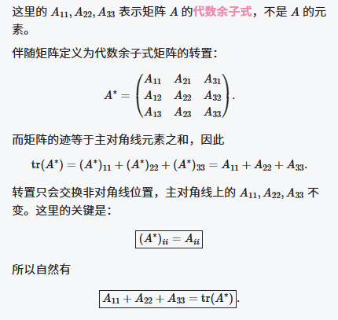

# 第 5 讲第 2 节 · 特征值与特征向量的性质及常用结论

> **本节结论**：看到特征值，先抓两件事：
>
> $$
> \boxed{\sum_{i=1}^{n}\lambda_i=\operatorname{tr}(A),\qquad
> \prod_{i=1}^{n}\lambda_i=\left\vert A\right\vert.}
> $$
>
> 然后把 $A$ 的“变形”直接换成 $\lambda$ 的同样变形：$f(A)\leftrightarrow f(\lambda)$，$A^{-1}\leftrightarrow\lambda^{-1}$，$A^*\leftrightarrow\dfrac{\left\vert A\right\vert}{\lambda}$。这节不靠硬算，靠结论秒。

---

## 一、特征值的两条核心性质

> **前情**：[特征值与特征向量：矩阵作用后只发生数乘](AI课程总结/基础篇/线代/第5讲/特征值与特征向量的定义及求法.md#一、特征值与特征向量：矩阵作用后只发生数乘)已经完成“先解特征方程，再求特征向量”的固定动作；本节开始用特征值反推行列式、主对角线和与未知参数。

### 1. 特征方程的逆用：把行列式为零翻译成特征值

$$
\boxed{
\left\vert\lambda_0E-A\right\vert=0
\Longleftrightarrow
\lambda_0\text{ 是 }A\text{ 的特征值}.
}
$$

因此，若 $\alpha\ne0$，且

$$
\left\vert\alpha A+\beta E\right\vert=0,
$$

则

$$
\alpha A+\beta E
=-\alpha\left[\left(-\frac{\beta}{\alpha}\right)E-A\right],
$$

从而

$$
\boxed{\lambda_0=-\frac{\beta}{\alpha}\text{ 是 }A\text{ 的特征值}.}
$$

例如，若 $\left\vert 2A-3E\right\vert=0$，立刻得到 $\lambda=\dfrac32$。

> [!考点] 题目把 $\left\vert\lambda E-A\right\vert=0$ 包装成 $\left\vert\alpha A+\beta E\right\vert=0$，别展开，直接令 $\lambda=-\dfrac{\beta}{\alpha}$。

> [!秒杀技巧] 矩阵前系数作分母、单位阵前系数变号作分子：$\alpha A+\beta E\Rightarrow-\dfrac{\beta}{\alpha}$。

### 2. 特征值的和与积

设 $n$ 阶矩阵 $A$ 的特征值为 $\lambda_1,\lambda_2,\ldots,\lambda_n$，重根按重数计，则

$$
\boxed{
\lambda_1+\lambda_2+\cdots+\lambda_n
=\operatorname{tr}(A)
=a_{11}+a_{22}+\cdots+a_{nn}.
}
$$

$$
\boxed{
\lambda_1\lambda_2\cdots\lambda_n
=\left\vert A\right\vert.
}
$$
> [!tip]  三角矩阵的特征值
> 需要区分是以哪条对角线为界：
> 
> 1. 以主对角线为界的上、下三角矩阵
> 
> 无论非零部分偏向左下还是右上，特征值都是主对角线元素：
> 
> $$
> \boxed{\lambda_1,\ldots,\lambda_n=a_{11},a_{22},\ldots,a_{nn}}
> $$
> 
> 2. 以副对角线为界的“左上、右下三角矩阵”
> 
> 如果你指的是关于**副对角线**呈三角形的矩阵，那么它们通常不属于标准的上、下三角矩阵，特征值**不能直接看副对角线元素**，必须计算：
> 
> $$
> \boxed{|\lambda E-A|=0}
> $$
> 
> 所以，只有关于**主对角线**的上三角或下三角矩阵，才能直接断定：特征值就是主对角线上的数。

由第二式马上得到

$$
\boxed{
A\text{ 可逆}
\Longleftrightarrow\left\vert A\right\vert\ne0
\Longleftrightarrow0\text{ 不是 }A\text{ 的特征值}.
}
$$

> [!考点] 已知全部特征值，行列式用“积”、主对角线元素和用“和”；这两件事是最常见的反问题入口。

> [!易错提醒] “特征值之和”必须按代数重数相加；三阶矩阵的二重根要算两次，别少加一份。

---

## 二、特征向量的五条结论：考场只认条件

### 1. 重特征值与线性无关特征向量的个数

若 $\lambda$ 是 $A$ 的 $k$ 重特征值，解

$$
(\lambda E-A)\boldsymbol{x}=\boldsymbol{0}
$$

得到的基础解系含 $s$ 个**向量**，则

$$
\boxed{1\leq s\leq k.}
$$

也就是说，$k$ 重特征值至多对应 $k$ 个线性无关的特征向量。

例如，三阶矩阵有二重特征值 $\lambda=3$ 时，解 $(3E-A)\boldsymbol{x}=\boldsymbol{0}$ 得到的线性无关特征向量个数只能为 $1$ 或 $2$，不会是 $3$。

> [!考点] 特征向量的线性无关个数，就是齐次方程组 $(\lambda E-A)\boldsymbol{x}=\boldsymbol{0}$ 的基础解系个数。

> [!避坑] $k$ 重特征值“至多 $k$ 个”是上界，不是必有 $k$ 个；代数重数和线性无关特征向量个数别混成一回事。

### 2. 不同特征值对应的特征向量线性无关

若 $\lambda_1\ne\lambda_2$，且

$$
A\boldsymbol{\xi}_1=\lambda_1\boldsymbol{\xi}_1,
\qquad
A\boldsymbol{\xi}_2=\lambda_2\boldsymbol{\xi}_2,
$$

则

$$
\boxed{\boldsymbol{\xi}_1,\boldsymbol{\xi}_2\text{ 线性无关}.}
$$

更一般地，属于两两不同特征值的特征向量组线性无关。

| 特征值关系                   | 对应特征向量的线性关系        |
| ----------------------- | ------------------ |
| $\lambda_1\ne\lambda_2$ | **一定**线性无关         |
| $\lambda_1=\lambda_2$   | **可能**线性相关，也可能线性无关 |

> [!note] 判断同一特征值的特征向量的线性关系
> 方法 1：
> 将特征值代入特征矩阵，判断特征矩阵的秩，即可得到线性无关向量的个数($s=n-r$)
> [[Excalidraw/例题/线代/第5讲例题.md#^WFszIAsb]]

> [!考点] “特征值不同 $\Rightarrow$ 特征向量线性无关”可以直接用；反过来不成立，别把充分条件硬写成充要条件。

### 3. 同一特征值：非零线性组合仍是特征向量

若 $\boldsymbol{\xi}_1,\boldsymbol{\xi}_2$ 都属于同一特征值 $\lambda$，则只要

$$
\boldsymbol{\eta}=k_1\boldsymbol{\xi}_1+k_2\boldsymbol{\xi}_2\ne\boldsymbol{0},
$$

就有

$$
A\boldsymbol{\eta}
=k_1A\boldsymbol{\xi}_1+k_2A\boldsymbol{\xi}_2
=\lambda\boldsymbol{\eta}.
$$

故

$$
\boxed{\boldsymbol{\eta}\text{ 仍是属于 }\lambda\text{ 的特征向量}.}
$$

> [!易错提醒] 非零条件不能漏：线性组合若恰好为零向量，就不是特征向量。

### 4. 不同特征值：两个方向混起来就不是特征向量

若 $\lambda_1\ne\lambda_2$，$k_1k_2\ne0$，则

$$
\boxed{
 k_1\boldsymbol{\xi}_1+k_2\boldsymbol{\xi}_2
\text{ 不是 }A\text{ 的任何特征值的特征向量}.
}
$$

反证时，若它属于特征值 $\mu$，则

$$
\begin{aligned}
A(k_1\boldsymbol{\xi}_1+k_2\boldsymbol{\xi}_2)
&=\mu(k_1\boldsymbol{\xi}_1+k_2\boldsymbol{\xi}_2),\\
k_1(\lambda_1-\mu)\boldsymbol{\xi}_1
+k_2(\lambda_2-\mu)\boldsymbol{\xi}_2
&=\boldsymbol{0}.
\end{aligned}
$$

由 $\boldsymbol{\xi}_1,\boldsymbol{\xi}_2$ 线性无关及 $k_1k_2\ne0$，必有 $\mu=\lambda_1=\lambda_2$，矛盾。

> [!秒杀技巧] 题目给“不同特征值 + 两个系数都非零”，线性组合直接判 **不是** 特征向量，没必要重新代矩阵。

### 5. 特征值与特征向量是专属配对

若 $\boldsymbol{\xi}\ne\boldsymbol{0}$ 同时对应 $\lambda_1$、$\lambda_2$，则

$$
A\boldsymbol{\xi}=\lambda_1\boldsymbol{\xi}
=\lambda_2\boldsymbol{\xi}
\Longrightarrow
(\lambda_1-\lambda_2)\boldsymbol{\xi}=\boldsymbol{0}
\Longrightarrow
\lambda_1=\lambda_2.
$$

$$
\boxed{\text{一个特征向量不可能属于两个不同的特征值}.}
$$

---

## 三、常用矩阵的特征值：把 $A$ 换成 $\lambda$ #熟记 

设

$$
A\boldsymbol{\xi}=\lambda\boldsymbol{\xi},
\qquad
\boldsymbol{\xi}\ne\boldsymbol{0}.
$$

| 矩阵变形       | 对应特征值                           | 对应特征向量                   | 使用条件               |
| ---------- | ------------------------------- | ------------------------ | ------------------ |
| $kA$       | $k\lambda$                      | $\boldsymbol{\xi}$       | $k$ 为常数            |
| $A^m$      | $\lambda^m$                     | $\boldsymbol{\xi}$       | $m\in\mathbb{N}^+$ |
| $f(A)$     | $f(\lambda)$                    | $\boldsymbol{\xi}$       | $f(x)$ 为多项式        |
| $A^{-1}$   | $\dfrac{1}{\lambda}$            | $\boldsymbol{\xi}$       | $A$ 可逆             |
| $A^*$ #重要  | $\dfrac{\vert A\vert}{\lambda}$ | $\boldsymbol{\xi}$       | $A$ 可逆             |
| $P^{-1}AP$ | $\lambda$                       | $P^{-1}\boldsymbol{\xi}$ | $P$ 可逆             |

其中最该背的是矩阵多项式： #重要 

$$
\boxed{
A\boldsymbol{\xi}=\lambda\boldsymbol{\xi}
\Longrightarrow
f(A)\boldsymbol{\xi}=f(\lambda)\boldsymbol{\xi}.
}
$$

例如，$A$ 的特征值为 $\lambda$ 时，$A^2-2A+3E$ 的对应特征值直接是

$$
\boxed{\lambda^2-2\lambda+3.}
$$

> [!考点] $A^{-1}$、$A^*$ 的公式中 $\lambda$ 在分母，前提必须是 $A$ 可逆，因此 $\lambda\ne0$。

> [!避坑] $P^{-1}AP$ 与 $A$ 的特征值相同，但特征向量变成 $P^{-1}\boldsymbol{\xi}$；前面五类变形恰好相反，特征向量仍可取 $\boldsymbol{\xi}$。

### 转置矩阵要单独记

$$
\left\vert\lambda E-A^{\mathrm T}\right\vert
=\left\vert(\lambda E-A)^{\mathrm T}\right\vert
=\left\vert\lambda E-A\right\vert.
$$

所以

$$
\boxed{A^{\mathrm T}\text{ 与 }A\text{ 的特征值相同}.}
$$

但 $(\lambda E-A)\boldsymbol{x}=\boldsymbol{0}$ 与 $(\lambda E-A^{\mathrm T})\boldsymbol{x}=\boldsymbol{0}$ 是两个不同方程组，因此 $A^{\mathrm T}$ 的**特征向量必须重新计算**。

> [!易错提醒] “转置后特征值不变”不等于“特征向量不变”；特征向量要回到 $(\lambda E-A^{\mathrm T})\boldsymbol{x}=\boldsymbol{0}$ 单独求。

---

## 四、两类高频矩阵：秩为 $1$ 与幂等阵

### 1. 秩为 $1$ 的 $n$ 阶矩阵

对 $n$ 阶矩阵 $A$，

$$
r(A)=1
\Longleftrightarrow
A=\boldsymbol{\alpha}\boldsymbol{\beta}^{\mathrm T},
$$

其中 $\boldsymbol{\alpha},\boldsymbol{\beta}$ 是非零 $n$ 维列向量。

此时 $A$ 的特征值为

$$
\boxed{
\underbrace{0,0,\ldots,0}_{n-1\text{ 个}},
\qquad
\boldsymbol{\beta}^{\mathrm T}\boldsymbol{\alpha}
=\operatorname{tr}(A).
}
$$

理由只抓两步：$r(A)=1$ 使方程 $A\boldsymbol{x}=\boldsymbol{0}$ 有 $n-1$ 个线性无关解，故 $0$ 至少是 $n-1$ 重特征值；最后一个特征值用特征值之和补出。

> [!秒杀技巧] 看到 $A=\boldsymbol{\alpha}\boldsymbol{\beta}^{\mathrm T}$，别去算 $n$ 阶特征方程：$0$ 写 $n-1$ 次，最后一个直接写 $\boldsymbol{\beta}^{\mathrm T}\boldsymbol{\alpha}$。

> [!易错提醒] $\boldsymbol{\beta}^{\mathrm T}\boldsymbol{\alpha}$ 可以为 $0$，所以非零秩一矩阵也可能全部特征值都为 $0$。

### 2. 幂等阵：$A^2=A$

由

$$
A^2-A=O
$$

以及 $f(A)=O\Rightarrow f(\lambda)=0$，得到任一特征值都满足

$$
\lambda^2-\lambda=0.
$$

因此

$$
\boxed{\lambda\in\{0,1\}.}
$$

这只是“特征值可能的取值”，不表示 $0$、$1$ 必须同时出现。

| 幂等阵示例 | 特征值 |
|---|---|
| $E$ | 全为 $1$ |
| $\begin{bmatrix}1&0\\0&0\end{bmatrix}$ | $1,0$ |
| $O$ | 全为 $0$ |

又因为 $E+A$ 的特征值为 $1+\lambda$，只能为 $1$ 或 $2$，均非零，故

$$
\boxed{E+A\text{ 一定可逆}.}
$$

> [!避坑] $\lambda^2-\lambda=0$ 是由已知矩阵关系导出的特征值约束，不是 $A$ 的特征方程；不能据此断言 $0$、$1$ 都是 $A$ 的特征值。

---

## 五、例题：把代数余子式和“每行求和”翻译成特征值

### 例 5.4：伴随矩阵的主对角线元素和

已知三阶矩阵 $A$ 的特征值为 $1,2,3$，求 $A_{11}+A_{22}+A_{33}$，其中 $A_{ii}$ 是元素 $a_{ii}$ 的代数余子式。

**结论先写**：

$$
A_{11}+A_{22}+A_{33}
=\operatorname{tr}(A^*).
$$
> [!tip] 
> 

而

$$
\left\vert A\right\vert=1\times2\times3=6.
$$

$A^*$ 的特征值依次为

$$
\frac{6}{1}=6,
\qquad
\frac{6}{2}=3,
\qquad
\frac{6}{3}=2.
$$

故

$$
\boxed{A_{11}+A_{22}+A_{33}=6+3+2=11.}
$$

> [!秒杀技巧] 三阶下，$A^*$ 的三个特征值就是“每次漏掉一个 $\lambda_i$ 后，其余两个相乘”；求主对角线和就把这三项相加。

### 例 5.5：每行元素和相等，先构造列 $1$ 向量

设 $A=(a_{ij})$ 为三阶矩阵，每行元素和均为 $2$，且 $\left\vert A\right\vert=3$，求 $A_{11}+A_{21}+A_{31}$。

令

$$
\boldsymbol{e}=
\begin{bmatrix}1\\1\\1\end{bmatrix},
$$

则“每行和均为 $2$”直接翻译为

$$
A\boldsymbol{e}=2\boldsymbol{e}.
$$

所以 $2$ 是 $A$ 的特征值，$\boldsymbol{e}$ 是对应特征向量。于是

$$
A^*\boldsymbol{e}
=\frac{\left\vert A\right\vert}{2}\boldsymbol{e}
=\frac32\boldsymbol{e}.
$$

又

$$
A^*=
\begin{bmatrix}
A_{11}&A_{21}&A_{31}\\
A_{12}&A_{22}&A_{32}\\
A_{13}&A_{23}&A_{33}
\end{bmatrix},
$$

比较第一分量，得

$$
\boxed{A_{11}+A_{21}+A_{31}=\frac32.}
$$

> [!考点] “每行元素和为 $c$”立刻写 $A\boldsymbol{e}=c\boldsymbol{e}$；“每列元素和为 $c$”则写 $\boldsymbol{e}^{\mathrm T}A=c\boldsymbol{e}^{\mathrm T}$，别左右写反。

---

## 六、考场速查：看到条件就条件反射

| 看到什么 | 立刻调用 |
|---|---|
| $\left\vert\alpha A+\beta E\right\vert=0$ | $-\dfrac{\beta}{\alpha}$ 是 $A$ 的特征值 |
| 已知全部特征值 | 和 $\to\operatorname{tr}(A)$，积 $\to\vert A\vert$ |
| $A$ 可逆 | $0$ 不是特征值，可用 $A^{-1}$、$A^*$ 的公式 |
| 不同特征值对应的向量 | 一定线性无关 |
| 同一特征值的非零线性组合 | 仍是该特征值的特征向量 |
| 不同特征值的向量，两个系数都非零 | 线性组合不是特征向量 |
| $f(A)=O$ | 任一特征值满足 $f(\lambda)=0$ |
| 每行元素和均为 $c$ | $c$ 是特征值，对应向量为全 $1$ 列向量 |

$$
\boxed{
\text{特征值题先看结构，不要先写 }\left\vert\lambda E-A\right\vert.
}
$$

> [!考点] 这一节的分不是靠证明磨出来的，而是看到“行列式、主对角线和、伴随、幂等、每行和”就翻译到特征值上。还在原矩阵里硬算，你是在拿计算量给自己上强度。
