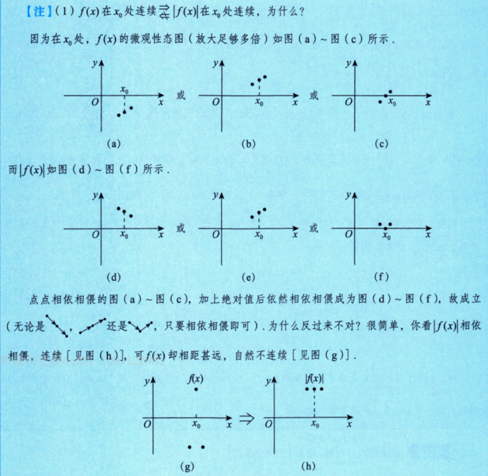
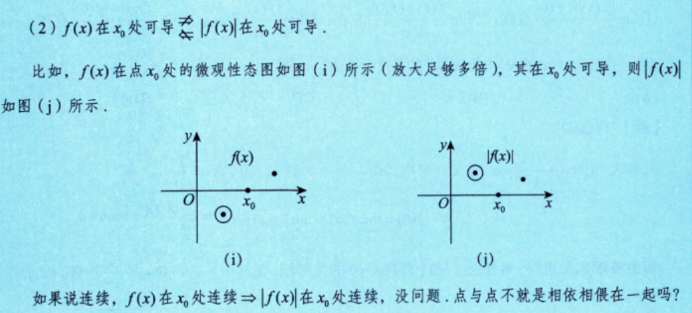
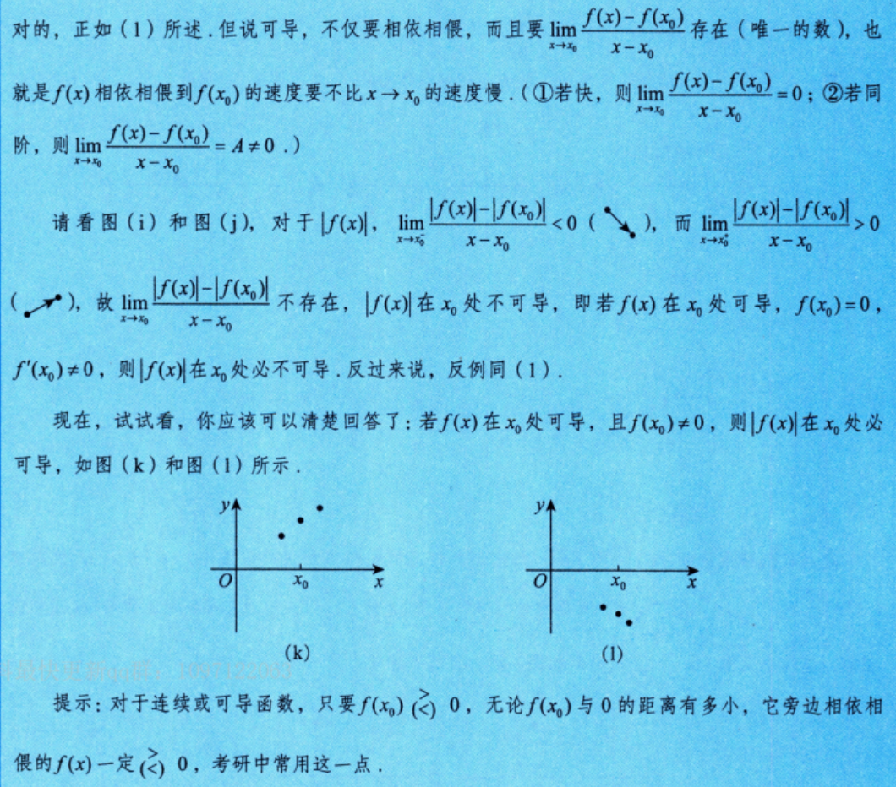

# 第3讲 一元函数微分学的概念（第3课）

> [!abstract] 本课目标：判断 $f(x)$ 与 $\lvert f(x)\rvert$ 在一点处的连续、可导关系
> 遇到绝对值函数，先看 $f(x_0)$ 是否为 $0$；非零时用连续性确定邻域内的符号并去绝对值，为零时改查左右变化率。方法框架见 [[../../导学课#二、三项解题法：O—P—D|OPD 解题法]]。

> [!info] 课程范围
> 教材第 26—29 页“三、$f(x)$ 与 $\lvert f(x)\rvert$ 连续、可导的关系总结”及例 3.3，结合本课逐字稿提炼方法；截至例 3.3。第 29 页“四、导函数 $f'(x)$ 的性质总结”属于下一课，本课不展开。

## 一、考场方法入口

| O：遇到什么问题 | P：用什么程序 | D：检查什么 |
| --- | --- | --- |
| 已知 $f$ 在 $x_0$ 处连续，判断 $\lvert f\rvert$ 是否连续 | 直接用绝对值函数的连续性，或用反三角不等式控制函数增量 | 只能正向推出；$\lvert f\rvert$ 连续一般不能反推 $f$ 连续 |
| 已知 $f$ 在 $x_0$ 处可导，判断 $\lvert f\rvert$ 是否可导 | 先分 $f(x_0)\ne0$ 与 $f(x_0)=0$ | 不能仅凭“$f$ 可导”直接下结论 |
| $f(x_0)\ne0$ | 用连续性保号，在邻域内把 $\lvert f(x)\rvert$ 换成 $f(x)$ 或 $-f(x)$ | 符号由 $f(x_0)$ 决定；只需局部同号 |
| $f(x_0)=0$ | 写 $\lvert f(x_0+h)\rvert/h$，分别比较 $h\to0^+$ 与 $h\to0^-$ | $f'(x_0)=0$ 时可导；$f'(x_0)\ne0$ 时左右导数相反 |
| 已知含 $\lvert f(x)\rvert$ 的差商极限存在，要求推出 $f'(0)$ | 分母趋零先推分子趋零，再确定 $f(0)$ 的符号或数值，最后去绝对值制造导数定义 | “极限存在”指有限双侧极限；不能漏用 $f$ 连续 |
| 出现 $\displaystyle\lim_{x\to0}\frac{\lvert f(x)\rvert}{x}$ | 用 $x>0$、$x<0$ 时商的符号相反，迫使双侧极限只能为 $0$ | 再由连续性推出 $f(0)=0$，才可写 $f'(0)=\lim f(x)/x$ |

## 二、连续性：取绝对值保持连续，反向一般不成立

### 1. 正向结论

若 $f$ 在 $x_0$ 处连续，则

$$
\lim_{x\to x_0}\lvert f(x)\rvert
=\left\lvert\lim_{x\to x_0}f(x)\right\rvert
=\lvert f(x_0)\rvert,
$$

所以 $\lvert f(x)\rvert$ 在 $x_0$ 处连续。

也可直接使用反三角不等式：

$$
\bigl\lvert\lvert f(x)\rvert-\lvert f(x_0)\rvert\bigr\rvert
\le \lvert f(x)-f(x_0)\rvert\to0.
$$

### 2. 为什么不能反推

取绝对值会把负值翻到 $x$ 轴上方，可能掩盖 $f(x)$ 本身的符号跳变。因此

$$
f\text{ 在 }x_0\text{ 处连续}
\Rightarrow
\lvert f\rvert\text{ 在 }x_0\text{ 处连续},
$$

但反向一般不成立。

> [!warning] 连续性只控制“点间距离”，不控制取绝对值前的符号
> $\lvert f\rvert$ 的函数值彼此接近，不能保证 $f$ 的函数值位于 $x$ 轴同一侧。

> [!note] 数形结合
> 

## 三、可导性：第一判断点是 $f(x_0)$ 是否为零

设 $f$ 在 $x_0$ 处可导，则 $f$ 在 $x_0$ 处连续。

> [!note]
> $$
> f(x)\text{ 在 }x_0\text{ 处可导}
> \mathrel{\substack{\nRightarrow\\ \nLeftarrow}}
> |f(x)|\text{ 在 }x_0\text{ 处可导}.
> $$

### 1. $f(x_0)\ne0$：先保号，再去绝对值

由连续函数的局部保号性：

- 若 $f(x_0)>0$，则在 $x_0$ 的某邻域内 $f(x)>0$，故 $\lvert f(x)\rvert=f(x)$；
- 若 $f(x_0)<0$，则在 $x_0$ 的某邻域内 $f(x)<0$，故 $\lvert f(x)\rvert=-f(x)$。

因此 $\lvert f(x)\rvert$ 在 $x_0$ 处必可导，且

$$
\left.\frac{\mathrm d\lvert f(x)\rvert}{\mathrm dx}\right|_{x=x_0}
=
\begin{cases}
f'(x_0),&f(x_0)>0,\\
-f'(x_0),&f(x_0)<0.
\end{cases}
$$

也可统一写成

$$
\left.\frac{\mathrm d\lvert f(x)\rvert}{\mathrm dx}\right|_{x=x_0}
=\frac{f(x_0)}{\lvert f(x_0)\rvert}f'(x_0),
\qquad f(x_0)\ne0.
$$

### 2. $f(x_0)=0$：比较左右变化率

令 $h=x-x_0$。由于 $f(x_0)=0$，

$$
\frac{\lvert f(x_0+h)\rvert-\lvert f(x_0)\rvert}{h}
=\frac{\lvert f(x_0+h)\rvert}{h}.
$$

若 $f'(x_0)=A$，则

$$
\lim_{h\to0^+}\frac{\lvert f(x_0+h)\rvert}{h}=\lvert A\rvert,
\qquad
\lim_{h\to0^-}\frac{\lvert f(x_0+h)\rvert}{h}=-\lvert A\rvert.
$$

所以：

- $A=0$ 时，两侧极限都为 $0$，$\lvert f\rvert$ 在 $x_0$ 处可导且导数为 $0$；
- $A\ne0$ 时，两侧极限互为相反数，$\lvert f\rvert$ 在 $x_0$ 处不可导。

### 3. 可直接调用的总判据

在已知 $f$ 于 $x_0$ 处可导的前提下，

$$
\lvert f\rvert\text{ 在 }x_0\text{ 处可导}
\Longleftrightarrow
f(x_0)\ne0\ \text{或}\ f'(x_0)=0.
$$

其中只有当 $f(x_0)=0$ 时，才需要额外检查 $f'(x_0)$。

> [!note] 数形结合
> 
> 

## 四、带绝对值差商：推出 $f$ 在 $0$ 处可导的固定程序

设 $f$ 在 $x=0$ 处连续，并且题目给出的差商极限存在且为有限值。

### P：四步程序

1. **分母趋零，先令分子趋零。** 若 $N(x)/x$ 有有限极限，则 $N(x)\to0$。
2. **联立连续性。** 使用

$$
f(0)=\lim_{x\to0}f(x),
\qquad
\lvert f(0)\rvert=\lim_{x\to0}\lvert f(x)\rvert,
$$

确定 $f(0)=0$、$f(0)\ge0$，或保留正负两种情况。
3. **按 $f(0)$ 分情况。** 若 $f(0)\ne0$，由局部保号性去绝对值；若 $f(0)=0$，转入 $\lvert f(x)\rvert/x$ 型。
4. **还原导数定义。** 最终制造

$$
f'(0)=\lim_{x\to0}\frac{f(x)-f(0)}x.
$$

### 四类常见条件及其入口

| 已知极限存在 | 先得到什么 | 怎样转成导数 |
| --- | --- | --- |
| $\displaystyle\lim_{x\to0}\frac{\lvert f(x)\rvert-f(0)}x$ | $\lvert f(0)\rvert=f(0)$，故 $f(0)\ge0$ | $f(0)=0$ 时转入第三类；$f(0)>0$ 时局部有 $\lvert f\rvert=f$ |
| $\displaystyle\lim_{x\to0}\frac{f(x)-\lvert f(0)\rvert}x$ | $f(0)=\lvert f(0)\rvert$，故 $f(0)\ge0$ | $f(0)=0$ 时转入第三类；$f(0)>0$ 时分子就是 $f(x)-f(0)$ |
| $\displaystyle\lim_{x\to0}\frac{\lvert f(x)\rvert}{x}$ | 双侧极限只能为 $0$，继而 $f(0)=0$ | $\left\lvert f(x)/x\right\rvert\to0$，故 $f'(0)=0$ |
| $\displaystyle\lim_{x\to0}\frac{\lvert f(x)\rvert-\lvert f(0)\rvert}x$ | 这是 $\lvert f\rvert$ 在 $0$ 处的导数定义 | $f(0)=0$ 时转入第三类；$f(0)>0$ 时去绝对值，$f(0)<0$ 时整体添负号 |

因此，在“$f$ 于 $0$ 处连续”的共同前提下，上表四类条件都足以推出 $f$ 在 $0$ 处可导。

## 五、核心工具：非负分子除以变号的一次量

若 $g(x)\ge0$，且双侧有限极限

$$
A=\lim_{x\to0}\frac{g(x)}x
$$

存在，则：

- $x\to0^+$ 时，$g(x)/x\ge0$，故 $A\ge0$；
- $x\to0^-$ 时，$g(x)/x\le0$，故 $A\le0$。

于是只能有

$$
A=0.
$$

这就是处理 $\lvert f(x)\rvert/x$ 型极限的最快入口。

> [!warning] 必须是双侧极限
> 若题目只给右极限，只能得到极限值非负；只给左极限，只能得到极限值非正，不能据此迫使极限为 $0$。

## 六、逻辑边界与常见误区

### 1. 两组关系不要混淆

$$
f\text{ 连续}\Rightarrow\lvert f\rvert\text{ 连续},
$$

但一般不能反推；而在没有补充条件时，

$$
f\text{ 可导}\quad\text{与}\quad\lvert f\rvert\text{ 可导}
$$

互不构成无条件的充分必要关系。

### 2. 不能把“函数值为零”和“导数为零”混为一谈

- $f(x_0)=0$：说明曲线经过 $x$ 轴，是绝对值翻折是否产生尖点的分界；
- $f'(x_0)=0$：说明一阶变化率为零，在 $f(x_0)=0$ 的前提下可消除翻折后的左右斜率冲突。

### 3. 局部保号必须先有连续性

只有已知 $f$ 在 $x_0$ 处连续且 $f(x_0)\ne0$，才能断言 $f(x)$ 在充分小邻域内与 $f(x_0)$ 同号。不能看到 $f(x_0)>0$ 就直接对附近的 $\lvert f(x)\rvert$ 去绝对值。

### 4. 选择题以逻辑推导为主

取特例可以辅助排除，但不能代替对定义、局部保号、左右极限和条件方向的检查；“所有条件都成立”也可能是正确结论。

## 七、交卷前检查

- [ ] 看到 $\lvert f(x)\rvert$ 时，是否先判断了 $f(x_0)$ 是否为 $0$？
- [ ] $f(x_0)\ne0$ 时，是否先用连续性保证局部同号，再去绝对值？
- [ ] $f(x_0)=0$ 时，是否分别检查了左、右导数？
- [ ] 是否记住：在 $f$ 可导的前提下，$\lvert f\rvert$ 可导当且仅当 $f(x_0)\ne0$ 或 $f'(x_0)=0$？
- [ ] 遇到“差商极限存在”时，是否先由分母趋零推出分子趋零？
- [ ] 遇到 $\lvert f(x)\rvert/x$ 时，是否利用双侧符号迫使极限为 $0$？
- [ ] 是否核对了题目给的是双侧极限还是单侧极限？
- [ ] 是否避免把连续性、函数值为零、导数为零相互替代？
