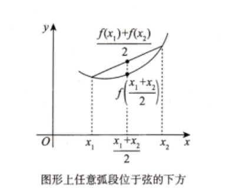
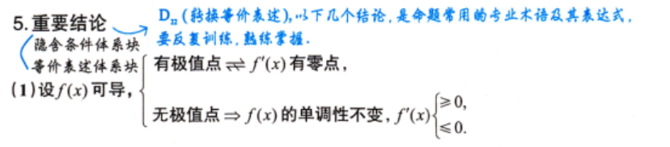
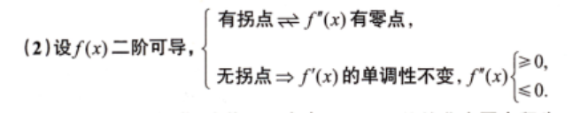

# 第5讲 一元函数微分学的应用（第2课）

> [!abstract] 本课目标：把函数性态的文字描述翻译成导数关系
> 单调性、极值、凹凸性和拐点题，先分清“一个点的导数值”与“一个邻域内导数的符号”，再判断条件能否由点推广到邻域。

## 一、考场方法入口

| O：遇到什么问题 | P：用什么程序 | D：检查什么 |
| --- | --- | --- |
| 判定函数在 $[a,b]$ 上严格单调 | 先查连续、可导条件，再看 $f'$ 在 $(a,b)$ 内的符号 | $f'$ 可以在有限多个点等于 $0$；严格单调不要求处处严格同号 |
| 题干出现极值点或无极值点 | 把极值翻译成 $f'$ 的零点与变号，把无极值翻译成 $f'$ 不变号 | 极值在双侧邻域内讨论；$f'(x_0)=0$ 只是候选条件 |
| 题干用弦或切线描述凹凸性 | 立即写对应不等式 | 本课约定：凹曲线在弦下方、切线上方；凸曲线相反 |
| 题干出现拐点或无拐点 | 先找 $f''=0$ 或 $f''$ 不存在的候选点，再查两侧凹凸性 | 拐点是 $(x_0,f(x_0))$；仅有 $f''(x_0)=0$ 不能下结论 |
| 已知含参函数无极值点但有拐点 | 分别让 $f'$ 不变号、$f''$ 发生变号，再取参数交集 | 始终同号的因子可先约去；二次因子用判别式时要区分 $\Delta\le0$ 与 $\Delta>0$ |
| 已知 $f$ 在 $x_0$ 处二阶可导，判断局部性态 | 先用“$f'$ 在 $x_0$ 连续”，再用保号性把点上的 $f'(x_0)$ 推到邻域 | 二阶可导不等于 $f''$ 连续，不能把 $f''(x_0)$ 的符号直接推广到邻域 |
| 给出曲率圆，并要求局部二阶信息 | 用公共点、公共切线和公共曲率得到 $f(x_0)$、$f'(x_0)$、$f''(x_0)$，再写二阶泰勒式 | 曲率圆方程需隐式求导两次；这是数一、数二内容 |

## 二、定义与常规判别

### 1. 严格单调性的判别

设 $f$ 在 $[a,b]$ 上连续，在 $(a,b)$ 内可导。

- 若 $f'(x)\ge0$，且等号仅在有限多个点成立，则 $f$ 在 $[a,b]$ 上严格单调增加；
- 若 $f'(x)\le0$，且等号仅在有限多个点成立，则 $f$ 在 $[a,b]$ 上严格单调减少。

这里“等号仅在有限多个点成立”是保证严格单调的充分条件。严格单调增加的定义仍是

$$
x_1<x_2\quad\Longrightarrow\quad f(x_1)<f(x_2).
$$

> [!warning] 点上的零导数不破坏严格单调
> 严格单调增加不推出 $f'(x)>0$ 处处成立；即使 $f'(x_0)=0$，函数仍可能在 $x_0$ 的邻域内严格单调增加。

### 2. 极值的定义

若存在 $\delta>0$，使得对所有满足 $0<\lvert x-x_0\rvert<\delta$ 的 $x$，均有

$$
f(x)\le f(x_0),
$$

则 $x_0$ 是极大值点，$f(x_0)$ 是极大值；将不等号改为 $\ge$，则得到极小值点与极小值。

**极值必须在双侧邻域内比较。** 因此按此定义，区间**端点**不讨论极值；端点是否取得区间上的最大值或最小值，属于最值问题。

### 3. 凹凸性的两种表述

设 $f$ 在区间 $I$ 上连续。

**弦的表述：** 对任意不同的 $x_1,x_2\in I$，若

$$
f\left(\frac{x_1+x_2}{2}\right)
<\frac{f(x_1)+f(x_2)}{2},
$$

则图形为凹；若不等号反向，则图形为凸。

**切线的表述：** 若 $f$ 在区间内部可导，对任意 $x\ne x_0$，有

$$
f(x_0)+f'(x_0)(x-x_0)<f(x),
$$

则图形为凹，即曲线位于各切线的上方；若不等号反向，则图形为凸，即曲线位于各切线的下方。

若把 $x=x_0$ 也包含在比较范围内，上述严格不等号分别改写为 $\le$ 与 $\ge$。

### 4. 拐点的定义 #易错 

连续曲线的凹弧与凸弧的分界点称为曲线的拐点。判定时固定写成

$$
\boxed{(x_0,f(x_0))},
$$

不能只写横坐标 $x_0$。若曲线在 $x_0$ 处不连续，或两侧凹凸性没有改变，则该点不是拐点。

## 三、极值与拐点的导数翻译

### 1. 极值问题看 $f'$ 的零点与变号

若 $f$ 在内点 $x_0$ 可导且取得极值，则

$$
\boxed{f'(x_0)=0.}
$$

**反向不成立**。找到驻点后必须检查 $f'$ 在两侧的符号：

| $f'$ 在 $x_0$ 两侧的变化 | 结论 |
| --- | --- |
| $+\to-$ | $x_0$ 为极大值点 |
| $-\to+$ | $x_0$ 为极小值点 |
| 不变号 | $x_0$ 不是极值点 |

因此，处理“无极值点”时，应检查 $f'$ 在定义域内不变号；允许 $f'$ 在个别点等于 $0$，但不能在这些点两侧变号。

### 2. 拐点问题看 $f''$ 的零点与变号

若 $f$ 在 $x_0$ 处二阶可导，且 $(x_0,f(x_0))$ 是拐点，则

$$
\boxed{f''(x_0)=0.}
$$

这只是必要条件。实际判定仍要检查 $f''$ 在 $x_0$ 两侧是否变号；若 $f''(x_0)$ 不存在，也要回到凹凸性的定义或检查 $f'$ 的单调性。

| $f''$ 在 $x_0$ 两侧的变化 | 结论              |
| ------------------- | --------------- |
| $+\to-$ 或 $-\to+$   | 凹凸性改变，且曲线连续时为拐点 |
| 不变号                 | 不是拐点            |

### 3. “无极值点但有拐点”的含参程序

若

$$
f'(x)=h(x)q_1(x),\qquad f''(x)=h(x)q_2(x),\qquad h(x)>0,
$$

则 $h(x)$ 不影响符号，可按以下顺序处理：

1. 由“无极值点”要求 $q_1(x)$ 不变号；
2. 由“有拐点”要求 $q_2(x)$ 存在变号零点；
3. 若 $q_1,q_2$ 是开口向上的二次多项式，分别使用
   $$
   \Delta_1\le0,\qquad \Delta_2>0;
   $$

4. 解出各自的参数范围并取交集，同时确认零点在定义域内、函数在零点处连续。

> [!important] 判别式边界
> 二次因子满足 $\Delta=0$ 时只有二重零点，通常不变号：它可以满足“无极值点”，但不能提供凹凸性改变所需的变号零点。

## 四、点值与邻域性态：不要混用 #熟记 
### 1. 一点的一阶导数能说明什么

若仅知 $f'(x_0)>0$，由导数定义和保号性只能得到：当 $x$ 充分接近 $x_0$ 时，

$$
x<x_0\Rightarrow f(x)<f(x_0),
\qquad
x>x_0\Rightarrow f(x)>f(x_0).
$$

它比较的是邻近点与中心点 $x_0$ 的函数值，**不能保证邻域内任意两点都按大小排列**，因此不能单独推出 $f$ 在**整个邻域**内单调增加。

### 2. 二阶可导补上了哪一环

若 $f$ 在 $x_0$ 处二阶可导，则 $f'$ 在 $x_0$ 处可导，从而 $f'$ 在 $x_0$ 处连续：

$$
\lim_{x\to x_0}f'(x)=f'(x_0).
$$

于是由保号性：

$$
f'(x_0)>0
\Rightarrow
f'(x)>0\text{ 在 }x_0\text{ 的某邻域内成立}
\Rightarrow
f\text{ 在该邻域内严格单调增加}.
$$

同理，若 $f'(x_0)<0$，则 $f$ 在 $x_0$ 的某邻域内严格单调减少。

### 3. 单调、凹凸命题的方向检查

| 已知条件                                 | 能推出                     | **不能**擅自加强为  |
| ------------------------------------ | ----------------------- | ------------ |
| $f$ 在 $x_0$ 的某邻域内单调增加，且 $f'(x_0)$ 存在 | $f'(x_0)\ge0$           | $f'(x_0)>0$  |
| $f$ 在 $x_0$ 的某邻域内为凹，且 $f''(x_0)$ 存在  | $f''(x_0)\ge0$          | $f''(x_0)>0$ |
| $f$ 在 $x_0$ 处二阶可导，且 $f'(x_0)>0$      | $f$ 在某邻域内单调增加           | 无需二阶可导也必然成立  |
| 仅有 $f''(x_0)>0$                      | 只能得到该点的二阶导数值            | 曲线在某邻域内必为凹   |
| $f''$ 在 $x_0$ 连续，且 $f''(x_0)>0$      | $f''$ 在某邻域内为正，曲线在该邻域内为凹 | —            |

两个最简检查模型：$x^3$ 在 $0$ 的邻域内严格单调增加，但 $f'(0)=0$；$x^4$ 在 $0$ 的邻域内为凹，但 $f''(0)=0$。

> [!warning] 可导阶数的含义
> “在 $x_0$ 处二阶可导”保证的是 $f'$ 在 $x_0$ 处连续，不保证 $f''$ 在 $x_0$ 处连续。因此可把 $f'(x_0)$ 的正负推广到邻域，却不能把 $f''(x_0)$ 的正负直接推广到邻域。

## 五、曲率圆给出的局部二阶信息（数一、数二）

若曲线 $y=f(x)$ 在 $P_0(x_0,y_0)$ 处的曲率圆方程为

$$
(x-a)^2+(y-b)^2=r^2,
$$

则曲线与曲率圆在 $P_0$ 处具有相同的函数值、切线和曲率，可写成 #熟记 

$$
f(x_0)=y_0,\qquad
f'(x_0)=y'(x_0),\qquad
f''(x_0)=y''(x_0).
$$

**P：**

1. 先把 $P_0$ 代入，得到 $f(x_0)=y_0$；
2. 对圆方程关于 $x$ 隐式求导一次，求 $y'(x_0)$；
3. 再求导一次，求 $y''(x_0)$；
4. 将三项代入二阶泰勒公式：

   $$
   \boxed{
   f(x)=f(x_0)+f'(x_0)(x-x_0)
   +\frac{f''(x_0)}{2}(x-x_0)^2
   +o\bigl((x-x_0)^2\bigr).
   }
   $$

**D：** 曲率圆是局部信息，只在展开点附近使用；隐式求导中若要除以含 $y$ 的因子，先检查该因子在 $P_0$ 处不为零。

## 六、交卷前检查

- [ ] 严格单调的导数判别是否允许有限个零点？
- [ ] 极值是否在双侧邻域内讨论，并区分了极值点与极值？
- [ ] 凹凸题是否把弦或切线的位置关系写成了正确不等式？
- [ ] 拐点是否写成 $(x_0,f(x_0))$，并检查了连续性与凹凸变号？
- [ ] 是否把 $f'(x_0)=0$、$f''(x_0)=0$ 误当成充分条件？
- [ ] 是否分清“二阶可导”和“二阶导数连续”？
- [ ] 含参题是否分别处理了 $f'$ 不变号与 $f''$ 变号，再取参数交集？
