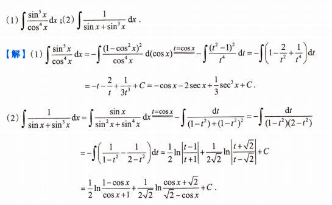
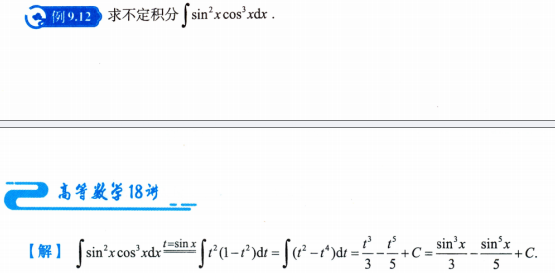
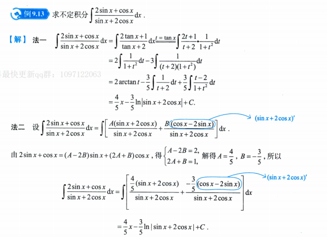

# 第9讲 一元函数积分学的计算（第4课）

> [!abstract] 本课目标：把三角有理式化为有理函数积分
> 先判断关于 $\sin x$、$\cos x$ 的变号规律，选择全角换元；能凑分母导数时直接凑微分；不便使用这些方法时，再用半角万能换元。

## 一、考场方法入口

形如

$$
\int R(\sin x,\cos x)\,\mathrm dx
$$

的积分称为三角有理式的积分，其中 $R$ 是关于两个中间变量的有理函数，即多项式之比。

| O：遇到什么问题 | P：用什么程序 | D：检查什么 |
| --- | --- | --- |
| $R(-\sin x,\cos x)=-R(\sin x,\cos x)$ | 令 $t=\cos x$，凑 $\sin x\,\mathrm dx=-\mathrm dt$，将其余偶次幂改写为 $\cos x$ 的式子 | 只将 $\sin x$ 整体变号；凑微分有负号 |
| $R(\sin x,-\cos x)=-R(\sin x,\cos x)$ | 令 $t=\sin x$，凑 $\cos x\,\mathrm dx=\mathrm dt$，将其余偶次幂改写为 $\sin x$ 的式子 | 只将 $\cos x$ 整体变号；凑微分没有负号 |
| $R(-\sin x,-\cos x)=R(\sin x,\cos x)$ | 化为关于 $\tan x$ 的有理式，令 $t=\tan x$ | 两个中间变量同时变号；$\mathrm dx=\mathrm dt/(1+t^2)$ |
| 分子、分母均为 $\sin x$ 与 $\cos x$ 的一次线性组合 | 把分子写成“分母＋分母导数”的线性组合，待定系数后直接积分 | 补偿系数与分母导数的负号；原分母不能为零 |
| $R(\sin x,\cos x)$ 不符合上述三种直接换元条件，且其他变形不便 | 令 $t=\tan(x/2)$，用万能公式同时替换 $\sin x$、$\cos x$ 与 $\mathrm dx$ | 代数式可能变复杂；换元后化为有理函数积分，最后回代 |

> [!warning] 判断的是中间变量的奇偶性
> 把 $\sin x$、$\cos x$ 分别看成独立变量 $u,v$，检查 $R(-u,v)$、$R(u,-v)$ 或 $R(-u,-v)$。这里不是把 $x$ 换成 $-x$，与“$\sin x$ 是奇函数、$\cos x$ 是偶函数”不是同一个判断。

## 二、全角换元：先看变号规律

> [!summary] 
> 对于 $\sin^m x\cos^n x$（$m,n$ 为非负整数），可以这样记：
> 
> |次方特点|选什么换元|怎么处理|
> |---|---|---|
> |$\sin x$ 是奇次幂|$t=\cos x$|拆出一个 $\sin x\,\mathrm dx$，剩余用 $\sin^2x=1-\cos^2x$|
> |$\cos x$ 是奇次幂|$t=\sin x$|拆出一个 $\cos x\,\mathrm dx$，剩余用 $\cos^2x=1-\sin^2x$|
> |两者都是偶次幂|可用 $t=\tan x$|同时变号不变；不过也可先看降幂公式是否更简单|
> |两者都是奇次幂|前两种都能用|选计算更简单的一种|
> 
> 但第三种条件更宽：**不是必须“两者都是偶次幂”，而是两者同时变号后，整个式子不变。**例如
> $$
> \frac{2\sin x+\cos x}{\sin x+2\cos x}
> $$
> 虽然含有加法，不能直接按某个次方判断，但同时给 $\sin x,\cos x$ 添负号，分子、分母都变号，比值不变，因此可以令 $t=\tan x$。

> [!attention] 注意
> 这里的“关于 $\sin x$ 或 $\cos x$ 为奇/偶”，是把它们看作中间变量，判断 $R(\sin x,\cos x)$ 对相应变量的奇偶性。
> **不是**按 $\sin(-x)=-\sin x$、$\cos(-x)=\cos x$ 判断；**而是**分别考察 $R(-\sin x,\cos x)$、$R(\sin x,-\cos x)$ 或 $R(-\sin x,-\cos x)$ 与原式的关系。

### 1. 关于 $\sin x$ 为奇函数：令 $t=\cos x$

**信号：**

$$
R(-\sin x,\cos x)=-R(\sin x,\cos x).
$$

**程序：**

1. 令 $t=\cos x$，以 $\sin x\,\mathrm dx=-\mathrm dt$ 为凑微分目标。
2. 有**奇次幂** $\sin^{2k+1}x$ 时，拆出一个 $\sin x$，将剩余部分改写为
   $$
   \sin^{2k}x=(1-\cos^2x)^k=(1-t^2)^k.
   $$
3. 如果 $\sin x$ **在分母**中，不能直接从分母“拿出”一个微分因子；可将分子、分母同乘 $\sin x$，使分子出现 $\sin x\,\mathrm dx$，分母出现 $\sin^2x$ 等偶次幂。 #注意 
4. 化为关于 $t$ 的有理函数积分，进行拆项或部分分式分解，积分后回代 $t=\cos x$。

**细节：**

- $k$ 为非负整数；替换前先确认剩余的 $\sin x$ 幂次均可用 $\sin^2x=1-\cos^2x$ 消去。
- $\mathrm d(\cos x)=-\sin x\,\mathrm dx$，负号必须保留。
- 同乘因子和约分在相应因子非零的区间内操作，最终以原被积函数的定义域为准。

> [!example] 
> 

### 2. 关于 $\cos x$ 为奇函数：令 $t=\sin x$

**信号：**

$$
R(\sin x,-\cos x)=-R(\sin x,\cos x).
$$

**程序：**

1. 令 $t=\sin x$，以 $\cos x\,\mathrm dx=\mathrm dt$ 为凑微分目标。
2. 有**奇次幂** $\cos^{2k+1}x$ 时，拆出一个 $\cos x$，将剩余部分改写为
   $$
   \cos^{2k}x=(1-\sin^2x)^k=(1-t^2)^k.
   $$
3. 若需凑出分子中的 $\cos x$，先作相应恒等变形，再把所有三角函数化为 $t$ 的式子。
4. 计算有理函数积分，回代 $t=\sin x$。

**细节：** 关于 $\cos x$ 为奇函数，指的是只给表达式中的 $\cos x$ 添负号后，整个表达式变成相反数；不能用 $\cos(-x)=\cos x$ 来判断这一条件。

> [!example] 
> 

### 3. 两者同时变号而不变：令 $t=\tan x$

**信号：**

$$
R(-\sin x,-\cos x)=R(\sin x,\cos x).
$$

这类三角有理式可写成关于 $\tan x$ 的有理式。

**程序：**

1. 根据表达式结构，分子、分母**同除**适当次幂的 $\cos x$，或用三角恒等式，**将被积函数化为关于** $\tan x$ **的有理式**。
2. 令 $t=\tan x$，同步替换
   $$
   \mathrm dt=(1+\tan^2x)\,\mathrm dx,
   \qquad
   \boxed{\mathrm dx=\frac{\mathrm dt}{1+t^2}}.
   $$
3. 将所得有理函数拆项、定系数并积分，最后回代 $t=\tan x$。

**细节：**

- 换元时不能只把 $\tan x$ 改成 $t$，遗漏 $\mathrm dx$ 带来的 $1/(1+t^2)$。
- 除以 $\cos x$ 与使用 $\tan x$ 时，先在 $\cos x\ne0$ 的区间内计算。
- 理论上，任意三角有理式都可分解为符合以上三种条件的部分，分别使用全角换元；实际分解可能繁琐，不必为套用全角换元而强行拆分。

> [!example] 
> 

## 三、线性组合之比：先试分母与分母导数

**信号：** 分子、分母都是 $\sin x$ 与 $\cos x$ 的一次线性组合。

设分母为

$$
Q(x)=a\sin x+b\cos x,
\qquad
Q'(x)=a\cos x-b\sin x,
\qquad a^2+b^2>0.
$$

**程序：**

1. 将分子 $N(x)$ 设为
   $$
   N(x)=A Q(x)+B Q'(x).
   $$
2. 展开右侧，分别比较 $\sin x$ 与 $\cos x$ 的系数，求出常数 $A,B$。
3. 拆成
   $$
   \frac{N(x)}{Q(x)}=A+B\frac{Q'(x)}{Q(x)}.
   $$
4. 直接调用
   $$
   \boxed{
   \int\frac{N(x)}{Q(x)}\,\mathrm dx
   =Ax+B\ln\lvert Q(x)\rvert+C.}
   $$

**细节：** $Q'(x)$ 中余弦项求导带负号；公式在 $Q(x)\ne0$ 的区间内使用，对数绝对值与积分常数不能遗漏。

## 四、半角万能换元：同时替换三项  #熟记

**信号：** 不符合三种直接全角换元条件，且不便凑微分或作其他简化。

令

$$
\boxed{t=\tan\frac x2},
$$

则

$$
\boxed{
\sin x=\frac{2t}{1+t^2},\qquad
\cos x=\frac{1-t^2}{1+t^2},\qquad
\mathrm dx=\frac{2}{1+t^2}\,\mathrm dt.}
$$

因此

$$
\int R(\sin x,\cos x)\,\mathrm dx
=\int R\left(\frac{2t}{1+t^2},\frac{1-t^2}{1+t^2}\right)
\frac{2}{1+t^2}\,\mathrm dt,
$$

必化为关于 $t$ 的有理函数积分。

**程序：**

1. 写出 $t=\tan(x/2)$ 与三条替换公式。
2. 同时替换 $\sin x$、$\cos x$、$\mathrm dx$；通分、约分，整理成多项式之比。
3. 按有理函数积分的方法计算：能直接凑微分就先凑，否则因式分解、部分分式拆项。
4. 回代 $t=\tan(x/2)$，补全对数绝对值与积分常数。

> [!warning] 万能表示能有理化，不表示计算最简
> 半角换元可能增加分子、分母次数。先检查全角换元与分母导数法，能直接简化就优先简化；使用万能公式时，$\mathrm dx$ 中的系数 $2$ 和分母 $1+t^2$ 都不能漏。

换元在 $\tan(x/2)$ 有定义的区间内进行；若积分区间跨越代换的间断点，应分段处理，不能把原函数有定义误当成代换在整个区间都有效。

## 五、交卷前检查

- [ ] 判断变号规律时，是改变 $\sin x$、$\cos x$ 整体，而不是改变 $x$ 吗？
- [ ] 关于 $\sin x$ 奇 → 换 $\cos x$；关于 $\cos x$ 奇 → 换 $\sin x$；同时变号不变 → 换 $\tan x$，是否选对？
- [ ] 凑 $\mathrm d(\cos x)$ 的负号、$\tan x$ 换元的 $1/(1+t^2)$、半角换元的 $2/(1+t^2)$ 是否保留？
- [ ] 换元后是否已经消去所有原三角函数，化为关于新变量的有理式？
- [ ] 线性组合之比是否可以先拆成分母与分母导数的线性组合？
- [ ] 原分母、约分因子及代换的定义区间是否检查？回代、对数绝对值和积分常数是否完整？
