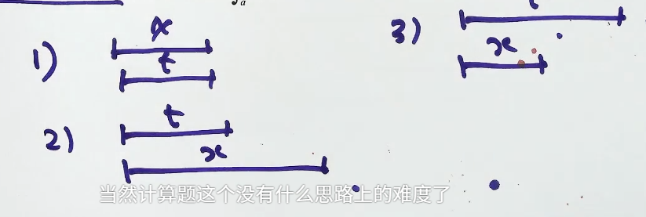

# 第9讲 一元函数积分学的计算（第7课）

> [!abstract] 本课目标：处理分段函数的积分，并把根式定积分化为经典几何面积
> 分段函数先找分段点，再按区间分别积分；求原函数时用分段点处的连续性衔接积分常数，求定积分时按分段点拆开相加，求变限积分时按上限的位置分类。根式能化为圆的方程时，优先用几何面积。

## 一、考场方法入口

| O：遇到什么问题 | P：用什么程序 | D：检查什么 |
| --- | --- | --- |
| 求分段函数的一个原函数或全体原函数 | 各段分别积分，再用分段点处的连续性确定各段积分常数的相对关系 | 原函数必须可导，因而必须连续；分段点不能漏查 |
| 求分段函数的定积分 | 必要时先换元，再在所有分段点处拆开并逐段积分 | 换元后上下限与分段点都要同步改变；各段积分取代数和 |
| 分段函数出现在变限积分中 | 按上限 $x$ 相对各分段点的位置分类，跨过的完整区间作为常数项累加 | 积分变量与上限变量要分清；不能始终只套同一段表达式 |
| 根式可化为 $\sqrt{a^2-u^2}$ | 配方、平移或换元后识别圆，再按积分区间取相应面积 | 半径、圆心和区间对应的是半圆还是四分之一圆 |

## 二、分段函数的不定积分：分段求原函数，再衔接常数

设

$$
f(x)=
\begin{cases}
f_1(x), & x\le c,\\
f_2(x), & x>c.
\end{cases}
$$

要求 $f$ 在整个区间上的原函数，先分别求

$$
F(x)=
\begin{cases}
F_1(x)+C_1, & x\le c,\\
F_2(x)+C_2, & x>c,
\end{cases}
\qquad F_i'(x)=f_i(x).
$$

### 1. 固定程序

1. 在每个非分段点区间内分别积分，暂时保留不同的积分常数。
2. 令左右两段在分段点处连续：

   $$
   F_1(c)+C_1=F_2(c)+C_2.
   $$

3. 由连续条件确定 $C_1,C_2$ 的相对关系。
4. 若求**一个原函数**，可任选一组满足关系的常数；若求**全体原函数**，保留一个统一的任意常数 $C$。
5. 最后检查分段点处的导数是否等于题设的 $f(c)$。

> [!warning] 每段各写一个任意常数，不等于得到了全体原函数
> 各段常数并非彼此独立。原函数在整个区间上可导，所以必须在分段点连续；连续条件先固定各段常数的差，最后只剩一个整体任意常数。

### 2. 选择题的快速判定

题目给出若干候选原函数时，不必先把所有积分完整重算：

1. 在各开区间内分别求导，排除导数与对应分段表达式不符的选项。
2. 检查候选函数在每个分段点处是否连续。
3. 检查分段点处是否可导，且导数是否等于该点的函数值 $f(c)$。

## 三、分段函数的定积分：先定位分段点，再拆开相加

若 $c\in(a,b)$，则

$$
\boxed{
\int_a^b f(x)\,\mathrm dx
=\int_a^c f_1(x)\,\mathrm dx
+\int_c^b f_2(x)\,\mathrm dx}.
$$

有多个分段点时，在积分区间内的每一个分段点处都要拆开。

### 固定程序

1. 写出积分变量的实际取值区间。
2. 找出落在该区间内的全部分段点，并按从小到大排列。
3. 在各分段点处拆积分，每段选用对应的函数表达式。
4. 分别计算后作代数相加。

> [!important] 定积分是代数和
> 分段后直接相加的是各段定积分，不是各段几何面积的绝对值之和。被积函数在 $x$ 轴下方时，对应部分应取负值。

### 含复合自变量时先换元

若积分中出现 $f(\varphi(x))$，原函数的分段点是针对 $\varphi(x)$ 而言。通常先令

$$
t=\varphi(x),
$$

完成被积函数、微分和上下限的同步变换，再根据 $t$ 的分段点拆分。特别地，平移型 $f(x-h)$ 换元后，原积分区间也整体平移：

$$
t=x-h.
$$

> [!warning] 不要按换元前的分段点机械拆分
> 应先确定分段函数的自变量实际取值。换元后，只有落入新积分区间的分段点才需要拆开。

## 四、分段函数的变限积分：按上限位置分类累加
[第6课](AI课程总结/强化篇/高数/第9讲%20一元函数积分学的计算/第6课.md#2%20取值区间决定是否需要分情况)

设

$$
F(x)=\int_a^x f(t)\,\mathrm dt,
$$

且 $f(t)$ 在 $t=c$ 处分段。判断方法不是把 $x$ 直接代入某一段，而是观察从固定下限 $a$ 到变动上限 $x$ 的积分路径是否跨过 $c$。

当 $a<c$ 时，典型写法为

$$
F(x)=
\begin{cases}
\displaystyle \int_a^x f_1(t)\,\mathrm dt, & a\le x\le c,\\[1.2em]
\displaystyle \int_a^c f_1(t)\,\mathrm dt
+\int_c^x f_2(t)\,\mathrm dt, & x>c.
\end{cases}
$$

### 固定程序

1. 标出积分变量 $t$ 的所有分段点。
2. 按上限 $x$ 位于哪个分段区间分类。
3. 从固定下限走到 $x$：已经完整跨过的区间写成定积分常数，最后一段写成以 $x$ 为上限的积分。
4. 若要继续求导、求极值或讨论连续性，再对所得分段表达式分别处理，并检查分界点。

> [!tip] 累加函数的核心
> $F(x)=\int_a^x f(t)\,\mathrm dt$ 表示从 $a$ 到 $x$ 的累计代数面积。$x$ 每跨过一个分段点，就要把此前完整区间的积分保留下来，不能丢掉。

## 五、几何法：化为圆的经典形式

### 1. 上半圆的经典积分

当 $a>0$ 时，

$$
y=\sqrt{a^2-x^2}
$$

表示圆 $x^2+y^2=a^2$ 的上半圆，因此

$$
\boxed{
\int_{-a}^{a}\sqrt{a^2-x^2}\,\mathrm dx
=\frac{\pi a^2}{2}}.
$$

对应的半区间为四分之一圆：

$$
\int_{-a}^{0}\sqrt{a^2-x^2}\,\mathrm dx
=\int_0^a\sqrt{a^2-x^2}\,\mathrm dx
=\frac{\pi a^2}{4}.
$$

### 2. $\sqrt{x(2a-x)}$ 型

识别恒等式

$$
x(2a-x)=a^2-(x-a)^2.
$$

因此 $y=\sqrt{x(2a-x)}$ 是圆心在 $(a,0)$、半径为 $a$ 的上半圆。于是

$$
\boxed{
\int_0^a\sqrt{x(2a-x)}\,\mathrm dx
=\frac{\pi a^2}{4}},
$$

$$
\boxed{
\int_0^{2a}\sqrt{x(2a-x)}\,\mathrm dx
=\frac{\pi a^2}{2}},
$$

$$
\boxed{
\int_a^{2a}\sqrt{x(2a-x)}\,\mathrm dx
=\frac{\pi a^2}{4}}.
$$

### 3. 几何法的识别程序

1. 看到二次根式，先配方，目标是化为

   $$
   \sqrt{R^2-(x-h)^2}.
   $$

2. 读出圆心横坐标 $h$ 与半径 $R$。
3. 把积分上下限对应到圆上的横坐标区间。
4. 判断积分覆盖上半圆、四分之一圆还是其他部分，再写面积。

> [!warning] 公式值由区间决定
> 同一个上半圆被积函数，在 $[h-R,h+R]$ 上是半圆面积，在 $[h-R,h]$ 或 $[h,h+R]$ 上才是四分之一圆面积。不能只看到根式结构就直接写 $\pi R^2/2$ 或 $\pi R^2/4$。

## 六、交卷前检查

- [ ] 求分段原函数时，是否先分段积分，再用连续性固定各段常数的相对关系？
- [ ] 求全体原函数时，最后是否只保留了一个整体任意常数？
- [ ] 分段点处是否检查了函数的连续性、可导性以及 $F'(c)=f(c)$？
- [ ] 定积分中是否找全了落在积分区间内的分段点，并按对应表达式逐段计算？
- [ ] 含 $f(\varphi(x))$ 时，是否先换元并同步更换上下限？
- [ ] 变限积分中，上限 $x$ 跨过分段点后，是否保留了此前完整区间的累计积分？
- [ ] 使用几何法前，是否配方确认了圆心、半径与积分区间对应的面积比例？
