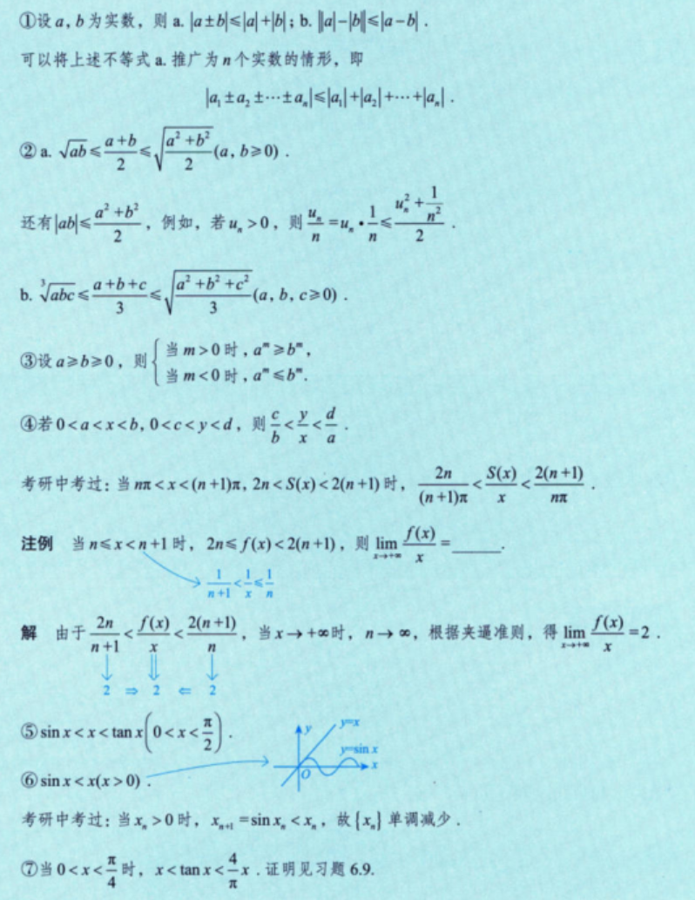
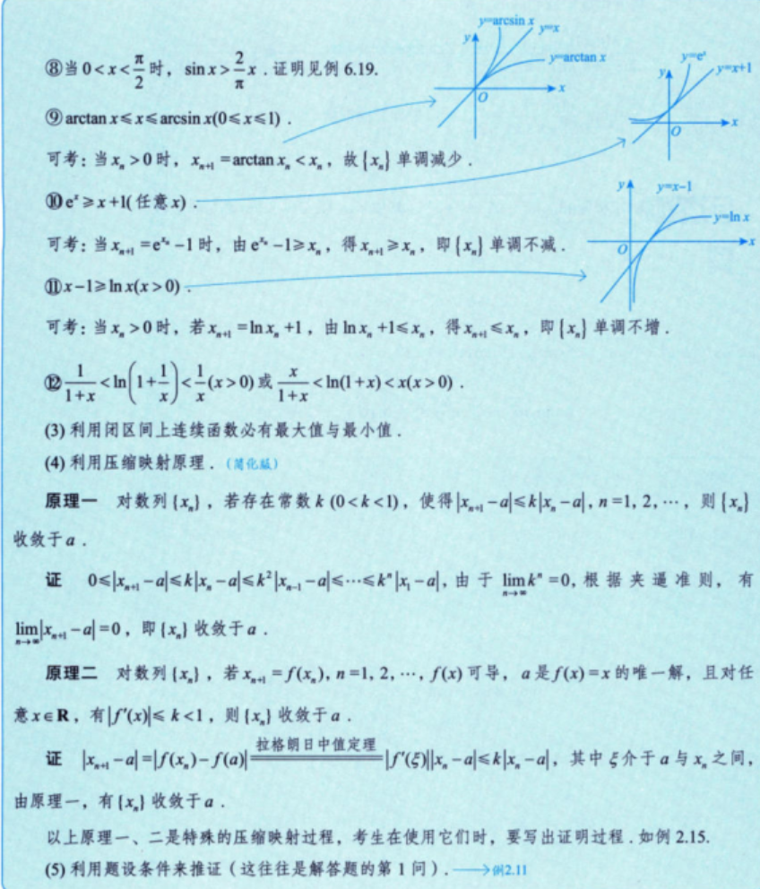

## 常用放缩

一般分为已知和未知两种。已知需要自己掌握，未知需要根据题目的提示进行推断。 

尽量在题目中寻找 **连续不等式** 进行放缩！

### 1. 简单的放大缩小

$$
\left \{ \begin{align}
&n \cdot u_{min} \le u_1 + u_2 + \cdots + u_n \le n \cdot u_{max}（当n趋向于无穷大时） \\
&当 u_1 \ge 0 时,~ 1 \cdot u_{max} \le u_1+u_2+\cdots +u_n \le n \cdot u_{max}（当n为有限数时）
\end{align}\right.
$$  
[例2.9](Excalidraw/例题/第二讲例题.md#^VEkWII1h)
[[Excalidraw/例题/第二讲例题.md#^ISb7jCJE|例2.10]]
### 2. 重要不等式
#重要 

> [!important] 
> 第 $1,2,4,12$ 条重要
>
> 第 $5$ 条常考

### 3. 闭区间连续函数性质

闭区间上连续函数必有最大值和最小值。

### 4. 压缩映射原理

通过这两个例题进行介绍：

