注2结合第1讲的知识，一个常见的问题：间断点可以是极值点吗？答案是肯定的.举四个例子供考生分析. 在0处有定义，且在0处的函数值比两边函数数值大，符合极大值点定义

(1) $f(x) = \begin{cases} 1, & x = 0, \\ |x|, & x \neq 0, \end{cases} x = 0$ 是 $f(x)$ 的可去间断点，但它是 $f(x)$ 的极大值点.  
(2) $f(x) = \begin{cases} 1, & x > 0, \\ -x, & x \leqslant 0, \end{cases} x = 0$ 是 $f(x)$ 的跳跃间断点，但它是 $f(x)$ 的极小值点.  
(3) $f(x) = \left\{ \begin{array}{ll} - 1, & x = 0,\\ \frac{1}{x^2}, & x\neq 0, \end{array} \right.$ $x = 0$ 是 $f(x)$ 的无穷间断点，但它是 $f(x)$ 的极小值点.  
(4) $f(x) = \left\{ \begin{array}{ll}2, & x = 0,\\ \sin {\frac{1}{x}}, & x\neq 0, \end{array} \right.$ （20 $x = 0$ 是 $f(x)$ 的振荡间断点，但它是 $f(x)$ 的极大值点.

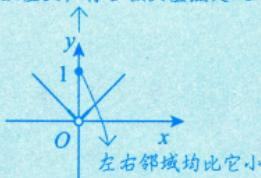

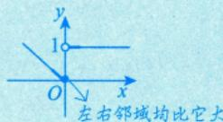

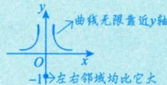

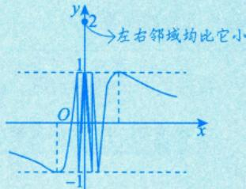

# 二 单调性与极值的判别

# 单调性的判别

若任意 $x\in (a,b),f^{\prime}(x) > 0$ ，则 $f(x)$ 在 $[a,b]$ 上严格单调增加，即 $(a,b)$ 内的每一点 $x$ ，对 $x$ 的左边点 $x_{1}$ 有 $f(x_{1}) <   f(x)$ ，对 $x$ 的右边点 $x_{2}$ 有 $f(x_{2}) > f(x)$ ，这样 $f(x)$ 就在 $[a,b]$ 上严格单调增加

设函数 $y = f(x)$ 在 $[a,b]$ 上连续，在 $(a,b)$ 内可导.

① 如果在 $(a, b)$ 内 $f'(x) \geqslant 0$ ，且等号仅在有限个点处成立，那么函数 $y = f(x)$ 在 $[a, b]$ 上严格单调增加；  
② 如果在 $(a, b)$ 内 $f'(x) \leqslant 0$ ，且等号仅在有限个点处成立，那么函数 $y = f(x)$ 在 $[a, b]$ 上严格单调减少.

注导数为0仅能说明在某点处的函数值变化充分小，而不能说明没变化，即导数大于0一定严格单调增加，而严格单调增加不一定导数大于0.

例如,函数 $y = {x}^{3}$ 在 $\left( {-\infty , + \infty }\right)$ 上连续且可导,且导函数 ${y}^{\prime } = 3{x}^{2} \geq  0$ ,等号仅在 $x = 0$ 处成立,则函数 $y = {x}^{3}$ 在 $\left( {-\infty , + \infty }\right)$ 上严格单调增加. 任意 $\delta  > 0$ ,这个 $\delta$ 是一个无穷小量. $f\left( x\right)  = {x}^{3}$ 在 $x = 0$ 处导数为0.代

任意 $\delta > 0$ ，这个 $\delta$ 是一个无穷小量。 $f(x) = x^3$ 在 $x = 0$ 处导数为 0，代表 $f(\delta) - f(0)$ 和 $f(0) - f(-\delta)$ 都是无穷小量，即 $f(x) = x^3$ 在 $x = 0$ 的无穷小邻域内，函数值变化率极小，所以 $f(x) = x^3$ 在 $x = 0$ 处导数值为 0

# 2 一阶可导点是极值点的必要条件

设 $f(x)$ 在 $x = x_0$ 处可导，且在点 $x_0$ 处取得极值，则必有 $f'(x_0) = 0$ ：

费马定理，此处不证明.

注1 事实上，若 $x = x_0$ 为曲线 $y = f(x)$ 的极值点，则只有以下两种情况.

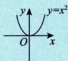

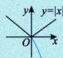  
(a) (b) 图5-1 极小值点，但不可导.

难点与不可导点

(1) $f^{\prime}(x_0) = 0$ ，如 $y = x^2$ 在 (0,0) 处的情形，如图5-1(a)所示. (2) $f^{\prime}(x_0)$ 不存在，如 $y = |x|$ 在 (0,0) 处的情形，如图5-1(b)所示.

注2 $f^{\prime}(x_0) = \lim_{x\to x_0}\frac{f(x) - f(x_0)}{x - x_0} = 0$ 仅能说明在 $x\rightarrow x_0$ 时， $f(x) - f(x_0)$ 为 $x - x_0$ 的高阶无穷小，不能说明 $f(x) = f(x_0)$ ，即当 $f^{\prime}(x_0) = 0$ 时， $f(x)$ 仍然可能是单调的，所以 $f^{\prime}(x_0) = 0$ 仅为 $f(x)$ 在 $x = x_0$ 处取得极值的必要条件.

找极值时的两种情况：①驻点；②不可导点.

# 3 判别极值的第一充分条件

排除了间断的情况。

需借助左、右邻域的一阶导数的正负来判断这一点处的极值情况

设 $f(x)$ 在 $x = x_0$ 处连续，且在 $x_0$ 的某去心邻域 $U(x_0,\delta)(\delta >0)$ 内可导.

① 若 $x \in (x_0 - \delta, x_0)$ 时， $f'(x) < 0$ ，而 $x \in (x_0, x_0 + \delta)$ 时， $f'(x) > 0$ ，则 $f(x)$ 在 $x = x_0$ 处取得极小值；  
② 若 $x \in (x_0 - \delta, x_0)$ 时， $f'(x) > 0$ ，而 $x \in (x_0, x_0 + \delta)$ 时， $f'(x) < 0$ ，则 $f(x)$ 在 $x = x_0$ 处取得极大值；  
③ 若 $f^{\prime}(x)$ 在 $(x_0 - \delta, x_0)$ 和 $(x_0, x_0 + \delta)$ 内不变号，则点 $x_0$ 不是极值点.

注 $f(x)$ 在 $x = x_0$ 处不一定可导，可能出现角点.

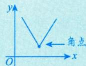

# 4 判别极值的第二充分条件

需借助 $x = x_0$ 一点处的二阶导数的正负，当一点处的信息较强时使用

设 $f(x)$ 在 $x = x_0$ 处二阶可导，且 $f^{\prime}(x_0) = 0$ ， $f''(x_0)\neq 0$ ：

① 若 $f^{\prime \prime}(x_0) < 0$ ，则 $f(x)$ 在 $x_0$ 处取得极大值；  
② 若 $f^{\prime \prime}(x_0) > 0$ ，则 $f(x)$ 在 $x_0$ 处取得极小值.

借助保号性推导如下.

设 $f^{\prime \prime}(x_0) = \lim_{x\to x_0}\frac{f'(x) - f'(x_0)}{x - x_0} = \lim_{x\to x_0}\frac{f'(x)}{x - x_0} >0$ ，由保号性可知：

(1)当 $x\in (x_0 - \delta ,x_0)$ 时， $x - x_0 <   0$ ，从而 $f^{\prime}(x) <   0$ ，所以 $f(x)$ 在 $x_0$ 的左邻域单调递减；  
(2)当 $x\in (x_0,x_0 + \delta)$ 时， $x - x_0 > 0$ ，从而 $f^{\prime}(x) > 0$ ，所以 $f(x)$ 在 $x_0$ 的右邻域单调递增.

所以 $f(x)$ 在 $x = x_0$ 处取得极小值.

同理，当 $f''(x_0) < 0$ 时， $f(x)$ 在 $x = x_0$ 处取得极大值.

上述第二充分条件可以推广为第三充分条件.

# 5 判别极值的第三充分条件 $\rightarrow$ 持续求导，直至 $n$ 阶导数不为0.

设 $f(x)$ 在 $x = x_0$ 处 $n$ 阶可导，且 $f^{(m)}(x_0) = 0(m = 1,2,\dots ,n - 1),f^{(n)}(x_0)\neq 0(n\geqslant 2)$ ，则

① 当 $n$ 为偶数且 $f^{(n)}(x_0) < 0$ 时， $f(x)$ 在 $x_0$ 处取得极大值；  
② 当 $n$ 为偶数且 $f^{(n)}(x_0) > 0$ 时， $f(x)$ 在 $x_0$ 处取得极小值.

第三充分条件的证明用洛必达法则或泰勒展开式，《全国硕士研究生招生考试数学考试大纲》对此不作要求.

注 上述第三充分条件的证明如下. 由于 $n$ 为偶数, 因此令 $n = {2k}$ , 构造极限

$$
\begin{array}{l} \lim  _ {x \rightarrow x _ {0}} {\frac {f (x) - f (x _ {0})}{(x - x _ {0}) ^ {2 k}}} {\frac {\text {洛 必 达 法 则}}{\lim  _ {x \rightarrow x _ {0}} {\frac {f ^ {\prime} (x)}{2 k (x - x _ {0}) ^ {2 k - 1}}}}} {\frac {\text {洛 必 达 法 则}}{\lim  _ {x \rightarrow x _ {0}} {\frac {f ^ {(2 k - 1)} (x)}{(2 k) ! (x - x _ {0})}}}} \\ = \lim  _ {x \rightarrow x _ {0}} \frac {f ^ {(2 k - 1)} (x) - f ^ {(2 k - 1)} \left(x _ {0}\right)}{(2 k) ! \left(x - x _ {0}\right)} = \frac {1}{(2 k) !} f ^ {(2 k)} \left(x _ {0}\right) \neq 0. \\ \end{array}
$$

上述洛必达法则成立的依据是最后的结果 $\frac{1}{(2k)!} f^{(2k)}(x_0)$ 是存在的.

当 $f^{(2k)}(x_0) < 0$ 时，由函数极限的局部保号性知，存在 $x_0$ 的某去心邻域，对于该邻域内的任意 $x$ ，有 $\frac{f(x) - f(x_0)}{(x - x_0)^{2k}} < 0$ ，即 $f(x) < f(x_0)$ ，故 $x_0$ 为极大值点；

当 $f^{(2k)}(x_0) > 0$ 时，由函数极限的局部保号性知，存在 $x_0$ 的某去心邻域，对于该邻域内的任意 $x$ ，有 $\frac{f(x) - f(x_0)}{(x - x_0)^{2k}} > 0$ ，即 $f(x) > f(x_0)$ ，故 $x_0$ 为极小值点。

例5.1 设函数 $f(x)$ 可导，且 $f(x)f'(x) > 0$ ，则（ ）.

(A) $f(1) > f(-1)$

(B) $f(1) <   f(-1)$

(C) $|f(1)| > |f(-1)|$

(D) $|f(1)| < |f(-1)|$

$\mathcal{P}$ 分析 见到 $f(x)\cdot f^{\prime}(x)$ ，联想 $\left\{[f(x)]^2\right\} ' = 2f(x)\bullet f'(x).$

解 应选(C).

由 $f(x)f^{\prime}(x) > 0$ 知 $\left[\frac{1}{2} f^{2}(x)\right]^{\prime} = f(x)f^{\prime}(x) > 0$ ，则 $\frac{1}{2} f^{2}(x)$ 单调增加，从而 $f^{2}(x)$ 单调增加，由此可知

$f^{2}(1) > f^{2}(-1)$ ，两端开方得 $\left|f(1)\right| > \left|f(-1)\right|$ . 故排除 (D)，选 (C).

取 $f(x) = -\mathrm{e}^{x}$ ， $f(x)f^{\prime}(x) > 0$ ，有 $f(1) <   f(-1)$ ；取 $f(x) = \mathrm{e}^{x}$ ， $f(x)f^{\prime}(x) > 0$ ，有 $f(1) > f(-1)$ .故排除(A)，(B).

注 (1) 对平方开根号时应注意, $\sqrt{u^2} = |u|$ 而非 $u$ .  
(2) 使用举例方式仅能排除选项而不能证明选项.

例5.2 设函数 $f(x)$ 二阶可导，且在 $x = x_0$ 处取极大值，则有（ ）.

(A) $f^{\prime \prime}(x_0) <   0$

(B) $f''(x_0)\leqslant 0$

(C) $f''(x_0) > 0$

(D) $f''(x_0)\geqslant 0$

充分条件：若 $f(x)$ 二阶可导，且在 $x = x_0$ 处取极大值，则 $\left\{ \begin{array}{l} f'(x_0) = 0, \\ f''(x_0) \leqslant 0. \end{array} \right.$

解 应选(B).

因 $f(x)$ 二阶可导，且 $f(x)$ 在 $x = x_0$ 处取得极值，故 $f^{\prime}(x_0) = 0$ .根据判别极值的第二充分条件，当 $f''(x_0) > 0$ 时， $f(x)$ 在 $x_0$ 处取得极小值，与已知矛盾.取 $f(x) = -x^{4}$ ，可知 $f(x)$ 在 $x = 0$ 处取极大值，此时 $f''(0) = 0$ ，因此 $f''(x_0)$ 可取0，故 $f''(x_0)\leqslant 0$ .故选(B).

方法总结 本题是借助判别极值的第二充分条件来解决的.

注 (1) ${f}^{\prime \prime }\left( {x}_{0}\right)  < 0$ (在 ${f}^{\prime }\left( {x}_{0}\right)  = 0$ 条件下)是 $f\left( x\right)$ 在 ${x}_{0}$ 处取得极大值的充分不必要条件.

(2) $f^{\prime \prime}(x_0) = 0$ 并不是 $f^{\prime}(x)$ 在 $x = 0$ 的邻域内无变化，而是变化的幅度很小，进一步分析也只能得出 $f(x)$ 的变化幅度小而不能得出无变化.

例5.3 设函数 $y = y(x)$ 由方程 $y^{3} + xy^{2} + x^{2}y + 6 = 0$ 确定，求 $y(x)$ 的极值.

解 在方程 $y^{3} + xy^{2} + x^{2}y + 6 = 0$ 两边关于 $x$ 求导，得

$$
3 y ^ {2} y ^ {\prime} + y ^ {2} + 2 x y y ^ {\prime} + 2 x y + x ^ {2} y ^ {\prime} = 0. \tag {*}
$$

令 $y' = 0$ ，得 $y^2 + 2xy = 0$ ，即 $y = 0$ 或 $y = -2x$ 。显然 $y = 0$ 时不满足已知方程，故 $y = -2x$ ，将其代入原方程，得 $-6x^3 + 6 = 0$ ，解得 $x = 1$ ， $y(1) = -2$ 。

在 (*) 式两边关于 $x$ 求导，得 $\left(3y^{2} + 2xy + x^{2}\right)y'' + 2(3y + x)\left(y'\right)^{2} + 4(y + x)y' + 2y = 0$ ，代入 $x = 1$ ， $y(1) = -2$ ， $y'(1) = 0$ ，解得 $y''(1) = \frac{4}{9} > 0$ 。根据判断极值的第二充分条件可知， $x = 1$ 为 $y(x)$ 的极小值点，极小值为 $y(1) = -2$ 。

例5.4 设 $f(x) = x\mathrm{e}^{x}$ ，求 $f^{(n)}(x)$ 的极值点和极值。

解 由例4.17知

$$
f ^ {(n)} (x) = (n + x) \mathrm {e} ^ {x}, f ^ {(n + 1)} (x) = (n + 1 + x) \mathrm {e} ^ {x}, f ^ {(n + 2)} (x) = (n + 2 + x) \mathrm {e} ^ {x}.
$$

令 $f^{(n + 1)}(x) = (n + 1 + x)\mathrm{e}^x = 0$ ，得函数 $f^{(n)}(x) = (n + x)\mathrm{e}^x$ 的驻点 $x = -(n + 1)$ .又

$$
f ^ {(n + 2)} [ - (n + 1) ] = \mathrm {e} ^ {- n - 1} > 0,
$$

所以 $x = -(n + 1)$ 是函数 $f^{(n)}(x) = (n + x)\mathrm{e}^x$ 的极小值点，极小值为

可记为 $F(x)$ 1 $f^{(n)}[-(n + 1)] = -\mathrm{e}^{-(n + 1)}$

方法总结 先求出表达式 $f^{(n)}(x)$ ，再求出此函数的驻点，然后代入 $f^{(n + 2)}(x)$ 验证即可。求极小值时将驻点代入 $f^{(n)}(x)$ 而非 $f(x)$ ：

# 三 凹凸性与拐点的概念

# 凹凸性的定义

《全国硕士研究生招生考试数学考试大纲》规定如下：

定义1 设函数 $f(x)$ 在区间 $I$ 上连续. 如果对 $I$ 上任意不同两点 $x_{1}, x_{2}$ ，恒有

横坐标中点的函数值在曲线上 $f\left(\frac{x_1 + x_2}{2}\right) < \frac{f(x_1) + f(x_2)}{2},$ 函数值的中点在弦上

则称 $y = f(x)$ 在 $I$ 上的图形是凹的（或凹弧），如图5-2(a)所示；如果恒有

$$
f \left(\frac {x _ {1} + x _ {2}}{2}\right) > \frac {f (x _ {1}) + f (x _ {2})}{2},
$$

则称 $y = f(x)$ 在 $I$ 上的图形是凸的（或凸弧），如图5-2(b)所示.

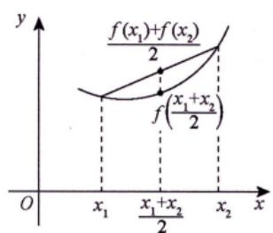

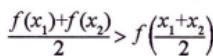  
图形上任意弧段位于弦的下方  
(a)

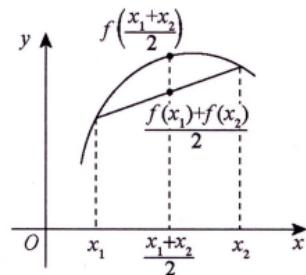

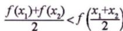  
图形上任意弧段位于弦的上方  
(b)   
图5-2

事实上，当图形为凹时，可以将 $f\left(\frac{1}{2} x_1 + \frac{1}{2} x_2\right) < \frac{1}{2} f(x_1) + \frac{1}{2} f(x_2)$ 更一般地写为

$$
f \left(\lambda_ {1} x _ {1} + \lambda_ {2} x _ {2}\right) <   \lambda_ {1} f \left(x _ {1}\right) + \lambda_ {2} f \left(x _ {2}\right),
$$

广义化的凹凸性定义

其中 $0 < \lambda_1 < 1, 0 < \lambda_2 < 1, \lambda_1 + \lambda_2 = 1$

${x}_{1} = \frac{2}{3},{x}_{2} =  - \frac{4}{3}$

定义2设 $f(x)$ 在 $[a,b]$ 上连续，在 $(a,b)$ 内可导，若对 $(a,b)$ 内的任意 $x$ 及 $x_0(x\neq x_0)$ ，均有

$$
\frac {f \left(x _ {0}\right) + f ^ {\prime} \left(x _ {0}\right) \left(x - x _ {0}\right)}{\downarrow} (<  ) \frac {f (x)}{\downarrow} \tag {*}
$$

则称 $f(x)$ 在 $[a,b]$ 的图形上是凹的.（凸）

切线方程

曲线方程

注（几何意义） $y = f(x_0) + f'(x_0)(x - x_0)$ 是曲线 $y = f(x)$ 在点 $(x_0, f(x_0))$ 处的切线方程，因此 (*) 式的几何意义如图 5-3 所示。若曲线 $y = f(x) (a < x < b)$ 在任意点处的切线（除该点外）总在曲线的下方（上方），则该曲线是凹（凸）的。

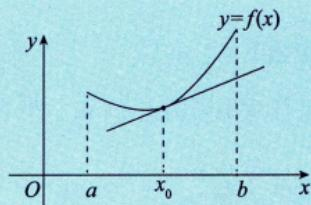  
(a)

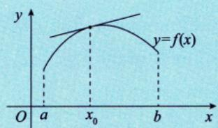  
(b)   
图5-3

# 2 拐点的定义

连续曲线的凹弧与凸弧的分界点称为该曲线的拐点.

$①$ 间断点不可能为拐点；  
$②$ 形如 或 也称为有拐点；  
③极值点只写横坐标 $x = x_0$ ，拐点应写 $(x_0, f(x_0))$ ：

# 凹凸性与拐点的判别

与极值点的判别结合记忆

# 判别凹凸性

设函数 $f(x)$ 在 $I$ 上二阶可导.

① 若在 $I$ 上 $f''(x) > 0$ ，则 $f(x)$ 在 $I$ 上的图形是凹的；  
② 若在 $I$ 上 $f''(x) < 0$ ，则 $f(x)$ 在 $I$ 上的图形是凸的。

$①$ 拐点处只需连续.   
②判别拐点时凹凸不分先后.   
③ 拐点在曲线上，写 $(x_0, f(x_0))$

# 2 二阶可导点是拐点的必要条件

设 $f^{\prime \prime}(x_0)$ 存在，且点 $(x_0,f(x_0))$ 为曲线的拐点，则 $f^{\prime \prime}(x_0) = 0$ ：

注 事实上，若点 $(x_0, f(x_0))$ 为曲线 $y = f(x)$ 的拐点，则只有以下两种情况。

(1) $f^{\prime \prime}(x_0) = 0$ ，如 $y = x^3$ 在 (0,0) 处的情形，如图5-4(a)所示.

二阶导数存在必为0

(2) $f''(x_0)$ 不存在，如 $y = \sqrt[3]{x}$ 在 $(0,0)$ 处的情形，如图5-4(b)所示.

二阶导数不存在的点也有可能是拐点

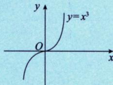  
(a)

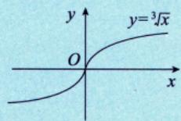  
(b)   
图5-4

# 3 判别拐点的第一充分条件 判别拐点最常用的方法

设 $f(x)$ 在点 $x = x_0$ 处连续，在点 $x = x_0$ 的某去心邻域 $U(x_0, \delta)$ 内二阶导数存在，且在该点的左、右邻域内 $f''(x)$ 变号（无论是由正变负，还是由负变正），则点 $(x_0, f(x_0))$ 为曲线的拐点。

需借助左、右邻域二阶导数的正负变化

注 $(x_0, f(x_0))$ 为曲线 $y = f(x)$ 的拐点，并不要求 $f(x)$ 在点 $x_0$ 的导数存在，如 $y = \sqrt[3]{x}$ 在 $x = 0$ 的情形，如图5-5所示，其中 $y' = \frac{1}{3} x^{-\frac{2}{3}}$ ， $y'' = -\frac{2}{9} x^{-\frac{5}{3}}$

当 $x > 0$ 时， $y'' < 0$ ；当 $x < 0$ 时， $y'' > 0$ ，故点 $(0,0)$ 为曲线 $y = \sqrt[3]{x}$ 的拐点，但在该点的导数不存在。

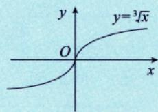  
图5-5

# 判别拐点的第二充分条件

设 $f(x)$ 在 $x = x_0$ 处三阶可导，且 $f''(x_0) = 0, f'''(x_0) \neq 0$ ，则点 $(x_0, f(x_0))$ 为曲线的拐点.

注 上述第二充分条件的证明如下：由于 $f^{\prime \prime}(x_0) = \lim_{x\to x_0}\frac{f^{\prime\prime}(x) - f^{\prime\prime}(x_0)}{x - x_0} = \lim_{x\to x_0}\frac{f^{\prime\prime}(x)}{x - x_0} \neq 0$ ，不妨设 $f^{\prime \prime}(x_0) > 0$ 。

由保号性可知：

① 当 $x \in (x_0 - \delta, x_0)$ 时， $x - x_0 < 0$ ，所以 $f''(x) < 0$ ，即曲线在 $x_0$ 的左邻域为凸的；  
② 当 $x \in (x_0, x_0 + \delta)$ 时， $x - x_0 > 0$ ，所以 $f''(x) > 0$ ，即曲线在 $x_0$ 的右邻域为凹的。

因此 $(x_0, f(x_0))$ 为拐点.

# 5 判别拐点的第三充分条件

对 $m = 1$ 无须求，故无须 $f^{\prime}(x_0) = 0$

设 $f(x)$ 在 $x_0$ 处 $n$ 阶可导，且 $f^{(m)}(x_0) = 0(m = 2,\dots ,n - 1),f^{(n)}(x_0)\neq 0(n\geqslant 3)$ ，则当 $n$ 为奇数时，点 $(x_0,f(x_0))$ 为曲线的拐点.证明可借助泰勒公式或洛必达法则，无须掌握

注1 上述第三充分条件的证明如下：由于 $n$ 为奇数，因此令 $n = 2k + 1$ ，构造极限

$$
\begin{array}{l} \lim  _ {x \to x _ {0}} {\frac {f ^ {\prime \prime} (x)}{\left(x - x _ {0}\right) ^ {2 k - 1}}} {\frac {\text {洛 必 达 法 则}}{…}} {\frac {\text {洛 必 达 法 则}}{…}} \lim  _ {x \to x _ {0}} {\frac {f ^ {(2 k)} (x)}{(2 k - 1) ! \left(x - x _ {0}\right)}} \\ = \lim  _ {x \rightarrow x _ {0}} \frac {f ^ {(2 k)} (x) - f ^ {(2 k)} \left(x _ {0}\right)}{(2 k - 1) ! \left(x - x _ {0}\right)} = \frac {1}{(2 k - 1) !} f ^ {(2 k + 1)} \left(x _ {0}\right) \neq 0. \\ \end{array}
$$

上述洛必达法则成立的依据是最后的结果 $\frac{1}{(2k - 1)!} f^{(2k + 1)}(x_0)$ 是存在的.

不妨设 $f^{(2k + 1)}(x_0) > 0$ ，由函数极限的局部保号性知，存在 $x_0$ 的某去心邻域，对于该邻域内的任意 $x$ ，有

$$
\frac {f ^ {\prime \prime} (x)}{(x - x _ {0}) ^ {2 k - 1}} > 0,
$$

当 $x \to x_0^+$ 时， $f''(x) > 0$ ；当 $x \to x_0^-$ 时， $f''(x) < 0$ ，故点 $(x_0, f(x_0))$ 为曲线的拐点。

注2 由上述证明过程可知，第三充分条件不需要 $f^{\prime}(x_0) = 0$ 这个条件.

例5.5 设函数 $f(x)$ 满足关系式 $f''(x) + [f'(x)]^2 = \sin x$ ，且 $f'(0) = 0$ ，则（ ）.

(A) $f(0)$ 是 $f(x)$ 的极大值  
(B) $f(0)$ 是 $f(x)$ 的极小值  
(C)点 $(0,f(0))$ 是曲线 $y = f(x)$ 的拐点  
(D) $f(0)$ 不是 $f(x)$ 的极值，点 $(0, f(0))$ 也不是曲线 $y = f(x)$ 的拐点

解 应选(C).

在等式 $f^{\prime \prime}(x) + [f^{\prime}(x)]^{2} = \sin x$ 中，令 $x = 0$ ，得 $f^{\prime \prime}(0) = 0$ ：

在等式 $f^{\prime \prime}(x) + [f^{\prime}(x)]^{2} = \sin x$ 两端对 $x$ 求导，得

$f^{\prime \prime}(x) = -[f^{\prime}(x)]^{2} + \sin x, f^{\prime}(x)$ 和

$\Rightarrow \sin x$ 均可导，故 $f''(x)$ 可导

$$
f ^ {\prime \prime} (x) + 2 f ^ {\prime} (x) f ^ {\prime \prime} (x) = \cos x,
$$

上式中令 $x = 0$ ，得 $f^{\prime \prime}(0) = 1 > 0$ ，则点 $(0,f(0))$ 是曲线 $y = f(x)$ 的拐点，由“五、①”知(A)，(B)错误.故应选(C).

方法总结 无须借助微分方程求解 $f(x)$ .仅需借助拐点的第二充分条件得出在 $x = 0$ 处的有效信息即可.

注 对等式而言，若等号一侧可导，则等号另外一侧也必然可导.

# 五 极值点与拐点的重要结论 常命制选择题

以下结论均可直接使用，不必证明.

① 曲线的可导点不可同时为极值点和拐点；曲线的不可导点可同时为极值点和拐点。

参考例5.5

$(x_0, f(x_0))$ 为拐点， $x = x_0$ 为极值点

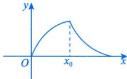

② 设多项式函数 $f(x) = (x - a)^n g(x)(n > 1)$ ，且 $g(a) \neq 0$ ，则当 $n$ 为偶数时， $x = a$ 是 $f(x)$ 的极值点；当 $n$ 为奇数时，点 $(a, 0)$ 是曲线 $f(x)$ 的拐点.  
③ 设多项式函数 $f(x) = (x - a_{1})^{n_{1}}(x - a_{2})^{n_{2}}\dots (x - a_{k})^{n_{k}}$ ，其中 $n_i$ 是正整数， $a_{i}$ 是实数且 $a_{i}$ 两两不等， $i = 1, 2, \dots, k$ 。

记 $k_{1}$ 为 $n_i = 1$ 的个数， $k_{2}$ 为 $n_i > 1$ 且 $n_i$ 为偶数的个数， $k_{3}$ 为 $n_i > 1$ 且 $n_i$ 为奇数的个数，则 $f(x)$ 的极值点个数为 $k_{1} + 2k_{2} + k_{3} - 1$ ，拐点个数为 $k_{1} + 2k_{2} + 3k_{3} - 2$ 。

例如， $f(x) = (x - 1)(x - 2)^{2}(x - 3)^{3}(x - 4)^{4}(x - 5)$ ，则 $k_{1} = 2,k_{2} = 2,k_{3} = 1$

从而极值点个数为 $2 + 4 + 1 - 1 = 6$ ，拐点个数为 $2 + 4 + 3 - 2 = 7$

例5.6 设函数 $y = \left|x\mathrm{e}^{-x}\right|$ ，则（ ）.

(A) $x = 0$ 是 $y$ 的极大值点，点 $(0,0)$ 不是曲线 $y$ 的拐点  
(B) $x = 0$ 是 $y$ 的极小值点，点 $(0,0)$ 不是曲线 $y$ 的拐点  
(C) $x = 0$ 是 $y$ 的极大值点，点 $(0,0)$ 是曲线 $y$ 的拐点  
(D) $x = 0$ 是 $y$ 的极小值点，点 $(0,0)$ 是曲线 $y$ 的拐点

分析 判断一点是否为极值点应分析该点左、右邻域内函数值与该点处函数值的大小关系.

判断一点是否为拐点应分析该点左、右邻域内二阶导数是否变号.

解 应选(D).

注意到 $y \big|_{x=0} = 0$ ，当 $x \neq 0$ 时， $y = |xe^{-x}| > 0$ ，由极值的定义可知 $x = 0$ 为 $y$ 的极小值点.

由例4.6知 $y^{\prime \prime} = \left\{ \begin{array}{ll}\mathrm{e}^{-x}(2 - x), & x < 0,\\ \mathrm{e}^{-x}(x - 2), & x > 0, \end{array} \right.$ 令 $y'' = 0$ ，得 $x = 2$ ：

当 $x < 0$ 时， $y'' = \mathrm{e}^{-x}(2 - x) > 0$ ；当 $0 < x < 2$ 时， $y'' = \mathrm{e}^{-x}(x - 2) < 0$ ，可知 $y''$ 在 $x = 0$ 的左、右邻域内符号不同。因此点 $(0,0)$ 为曲线 $y$ 的拐点。

故选 (D).

方法总结 绝对值函数属于分段函数，故应写成分段函数的形式再分析.

注实际上， $(2,y(2))$ 也是拐点，只是选项没有涉及而已.

例5.7 曲线 $y = (x - 1)(x - 2)^{2}(x - 3)^{3}(x - 4)^{4}$ 的一个拐点是（ ）.

(A) $(1,0)$

(B) $(2,0)$

(C) (3, 0)

(D) (4, 0)

解 应选(C).

令 $y = (x - 3)^{3}(x - 1)(x - 2)^{2}(x - 4)^{4} = (x - 3)^{3}g(x)$

显然 $g(3)\neq 0$ ，且 $n = 3$ 是奇数.由“五、 $②$ ”可知，点 $(3,0)$ 是 $y$ 的一个拐点，故选(C).

注 (1)由“五、③”可知， $k_{1} = 1,k_{2} = 2,k_{3} = 1$ ，故y的拐点个数为

$$
1 + 2 \times 2 + 3 \times 1 - 2 = 6.
$$

若 $\alpha$ 是 $f(x) = 0$ 的 $m(\geqslant 1)$ 重根，

则 $\alpha$ 是 $f^{\prime}(x) = 0$ 的 $m - 1$ 重根

若 $x - \alpha$ 是 $f(x)$ 的 $k$ 重因式，

则 $\alpha$ 称为 $f(x) = 0$ 的 $k$ 重根

(2)本题的常规解法：因为 $x = 3$ 是方程 $(x - 1)(x - 2)^{2}(x - 3)^{3}(x - 4)^{4} = 0$ 的三重根，所以它是方程 $y^{\prime \prime} = 0$ 的单根，从而函数 $y = (x - 1)(x - 2)^{2}(x - 3)^{3}(x - 4)^{4}$ 的二阶导数在点 $x = 3$ 的两侧附近改变正负号，故点(3,0)是曲线 $y = (x - 1)(x - 2)^{2}(x - 3)^{3}(x - 4)^{4}$ 的一个拐点.

例5.8 曲线 $f(x) = (x - 1)^2 (x - 3)^3$ 的拐点个数为（ ）.

(A) 0

(B) 1

(C) 2

(D) 3

分析 借助重要结论“五、③”即可.

解 应选(D).

由“五、③”可知， $k_{1} = 0, k_{2} = 1, k_{3} = 1$ ，则拐点个数为

$$
k _ {1} + 2 k _ {2} + 3 k _ {3} - 2 = 2 \times 1 + 3 \times 1 - 2 = 3.
$$

注 (1) 也可借助常规方法进行分析, 但计算量更大. 本题的常规解法: 由

$$
\begin{array}{l} f ^ {\prime} (x) = 2 (x - 1) (x - 3) ^ {3} + 3 (x - 1) ^ {2} (x - 3) ^ {2} \\ = (x - 1) (x - 3) ^ {2} (5 x - 9), \\ \end{array}
$$

易知 $f''(x)$ 中必含一次因式 $x - 3$ 。另由 $f'(1) = f'\left(\frac{9}{5}\right) = f'(3) = 0$ ，知必存在 $x_1 \in \left(1, \frac{9}{5}\right), x_2 \in \left(\frac{9}{5}, 3\right)$ ，使得 $f''(x_1) = f''(x_2) = 0$ ，故可令

$$
f ^ {\prime \prime} (x) = k \left(x - x _ {1}\right) \left(x - x _ {2}\right) (x - 3),
$$

其中 $k$ 是不为0的常数.由于 $f''(x)$ 在 $x = x_{1},x = x_{2},x = 3$ 两侧都异号，因此该曲线共有3个拐点.

(2)曲线 $y = (x - 1)^{2}(x - 3)^{2}$ 的极值点个数与拐点个数分别为（ ）.

(A)3，2

(B) 2, 3

(C)3，4

(D) 4, 3

解 应选(A).

由“五、③”可知， $k_{1} = 0, k_{2} = 2, k_{3} = 0$ ，于是极值点个数为 $0 + 2 \times 2 + 0 - 1 = 3$ ，拐点个数为 $0 + 2 \times 2 + 3 \times 0 - 2 = 2$ . 可直接得出答案.

# 渐近线

当曲线上的点远离原点时，曲线与某直线充分靠近，则称该直线为曲线的渐近线.

# 铅直渐近线

若 $\lim_{x\to x_0^+}f(x) = \infty$ （或 $\lim_{x\to x_0^-}f(x) = \infty$ ），则 $x = x_0$ 为一条铅直渐近线.

此处的 $x_0$ 或是函数的无定义点，或是函数定义区间的端点，或是分段函数的分段点。

例： $y = \tan x$ 在 $x = \frac{\pi}{2}$ 处

例： $y = \ln x(x > 0)$ 在 $x\to 0^{+}$ 处

例： $y = \left\{  {\frac{1}{x},x < 0}\right.$ 在 $x = 0$ 处

# 水平渐近线

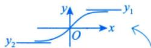

若 $\lim_{x\to +\infty}f(x) = y_1$ ，则 $y = y_{1}$ 为一条水平渐近线；若 $\lim_{x\to -\infty}f(x) = y_2$ ，则 $y = y_{2}$ 为一条水平渐近线；

若 $\lim_{x\to +\infty}f(x) = \lim_{x\to -\infty}f(x) = y_0$ ，则 $y = y_{0}$ 为一条水平渐近线.

$x \rightarrow +\infty$ 与 $x \rightarrow -\infty$ 时的水平渐近线可能相同，如 $y = \mathrm{e}^{-|x|}$ ；也可能不同，如 $y = \arctan x$ 。

# 3 斜渐近线

若 $\lim_{x\to +\infty}\frac{f(x)}{x} = a_1(a_1\neq 0),\lim_{x\to +\infty}[f(x) - a_1x] = b_1$ ，则 $y = a_{1}x + b_{1}$ 是曲线 $y = f(x)$ 的一条斜渐近线；

若 $\lim_{x\to \infty}\frac{f(x)}{x} = a_2(a_2\neq 0),\lim_{x\to \infty}[f(x) - a_2x] = b_2$ ，则 $y = a_{2}x + b_{2}$ 是曲线 $y = f(x)$ 的一条斜渐近线；

若 $\lim_{x\to +\infty}\frac{f(x)}{x} = \lim_{x\to -\infty}\frac{f(x)}{x} = a(a\neq 0),\lim_{x\to +\infty}[f(x) - ax] = \lim_{x\to -\infty}[f(x) - ax] = b$ ，则 $y = ax + b$ 是曲线 $y = f(x)$ 的一条斜渐近线.

注 $f(x)$ 向直线 $y = ax + b$ 趋近，表明二者在无穷远处无限接近.即对任意 $\varepsilon >0$ 都有 $\left|f(x) - (ax + b)\right| < \varepsilon$ 也即

$$
\lim  _ {x \rightarrow \infty} [ f (x) - (a x + b) ] = 0, \tag {1}
$$

从而

$$
\lim  _ {x \rightarrow \infty} \frac {f (x) - (a x + b)}{x} = 0, \text {即} \lim  _ {x \rightarrow \infty} \frac {f (x)}{x} = a (a \neq 0).
$$

将②结果代入①，可知

$$
\lim  _ {x \rightarrow \infty} [ f (x) - a x ] = b, \tag {③}
$$

由②，③，可以得出 $a$ 与 $b$ ，即可得到斜渐近线.

注2 $x\to +\infty$ 与 $x\rightarrow -\infty$ 时的斜渐近线可能相同，也可能不同.有时需分左右两侧分别去求.

注3 寻找渐近线的顺序：铅直渐近线、水平渐近线、斜渐近线.

若求曲线 $y = f(x)$ 的渐近线，要先找函数的无定义点，定义区间的端点或分段函数的分段点，具体说来，若 $\lim_{x \to x_0} f(x) = \infty$ （或 $\lim_{x \to x_0} f(x) = \infty$ ），则 $x = x_0$ 为一条铅直渐近线；然后判别 $\lim_{x \to \infty} f(x)$ 是否为常数，若是常数，则存在水平渐近线；若是 $\infty$ ，则最后判别 $\lim_{x \to \infty} \frac{f(x)}{x}$ 是否为非零常数 $a$ ，若是，则求出常数 $a$ ，再求 $b = \lim_{x \to \infty} [f(x) - ax]$ ，当 $a, b$ 都存在时，则存在斜渐近线，否则就没有斜渐近线。可总结成如下程序。

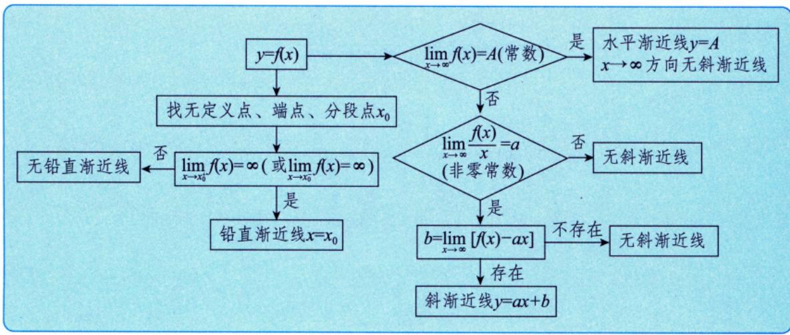

注4 ①求斜渐近线时， $a$ 与 $b$ 均应求出来才可以，仅求出 $a$ 不能确定有斜渐近线.

如 $y = x + \sin x$ ， $a = \lim_{x\to \infty}\frac{y}{x} = 1$ ，而 $b = \lim_{x\to \infty}(y - 1\cdot x) = \lim_{x\to \infty}\sin x$ 不存在.

所以 $y = x + \sin x$ 无斜渐近线.

$②$ 曲线与渐近线可能会有交点，如 $y = \frac{\sin x}{x}$

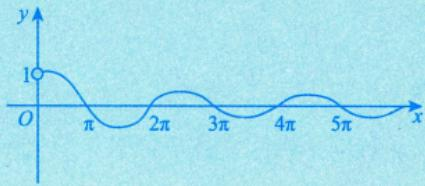

例5.9 求曲线 $y = \frac{1}{x} + \ln (1 + \mathrm{e}^x)$ 的渐近线.

$\rho$ 分析 按铅直、水平与斜渐近线的顺序依次去找，注意极限的计算.

解 因为

$$
\lim  _ {x \rightarrow 0} \left[ \frac {1}{x} + \ln (1 + e ^ {x}) \right] = \infty ,
$$

所以直线 $x = 0$ 是曲线 $y = \frac{1}{x} +\ln (1 + \mathrm{e}^{x})$ 的一条铅直渐近线.

因为

$$
\lim  _ {x \rightarrow - \infty} \left[ \frac {1}{x} + \ln (1 + e ^ {x}) \right] = 0,
$$

所以直线 $y = 0$ 是曲线 $y = \frac{1}{x} + \ln (1 + \mathrm{e}^x)$ 在 $x \to -\infty$ 时的一条水平渐近线.

因为

$\lim_{x\to +\infty}\frac{\frac{1}{x} + \ln(1 + e^{x})}{x} = \lim_{x\to +\infty}\left[\frac{1}{x^2} +\frac{x + \ln(1 + e^{-x})}{x}\right] = 1,$ $\begin{aligned} & \ln (1 + e^{x}) - x\\ & = \ln (1 + e^{x}) - \ln e^{x}\\ & = \ln \frac{1 + e^{x}}{e^{x}}\\ & = \ln (1 + e^{-x}) \end{aligned}$ 且 $\lim_{x\to +\infty}\left[\frac{1}{x} +\ln (1 + e^{x}) - x\right] = \lim_{x\to +\infty}\left[\frac{1}{x} +\ln (1 + e^{-x})\right] = 0,$

所以直线 $y = x$ 是曲线 $y = \frac{1}{x} + \ln (1 + \mathrm{e}^x)$ 在 $x \to +\infty$ 时的一条斜渐近线，其大致图形如图5-6所示.

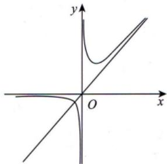  
图5-6

注 渐近线的求解是对考生的极限计算能力的考查.

# 七 最值或取值范围

# 最值的定义 整体概念，有别于极值

定义3设 $x_0$ 为 $f(x)$ 定义域内一点，若对于 $f(x)$ 的定义域内任意一点 $\mathcal{X}$ ，均有

$$
f (x) \leqslant f \left(x _ {0}\right) (\text {或} f (x) \geqslant f \left(x _ {0}\right))
$$

成立，则称 $f(x_0)$ 为 $f(x)$ 的最大值（或最小值）.

注 极值和最值是什么关系？我们通过两个例子来看.

① 设 $f(x) = \mathrm{e}^{x}, x \in [0, +\infty)$ ，则 $f(0) = \mathrm{e}^{0} = 1$ 为 $f(x)$ 在 $[0, +\infty)$ 内的最小值，即 $f(x) \geqslant f(0)$ 。但 $f(x)$ 在 $[0, +\infty)$ 内没有极值。细致说来，首先， $x = 0$ 是区间左端点，不存在双侧邻域 $U(0)$ ，使

$x \in U(0)$ 时， $f(x) \geqslant f(0)$ ，故不存在极值。其次，对于 $(0, +\infty)$ 内的任意一点 $x_0$ ，不论 $U(x_0)$ 取得多么小，对于 $x \in U(x_0)$ ，并不总有 $f(x) \geqslant f(x_0)$ ，所以 $f(x)$ 在 $[0, +\infty)$ 内无极小值，易见也无极大值。所以 $f(x)$ 在 $[0, +\infty)$ 内无极值。

② 设 $f(x) = 3x - x^3$ ，有

$$
f ^ {\prime} (x) = 3 \left(1 - x ^ {2}\right), f ^ {\prime \prime} (x) = - 6 x, f ^ {\prime} (\pm 1) = 0, f ^ {\prime \prime} (\pm 1) = \mp 6,
$$

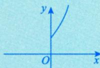

所以 $f(1) = 2$ 为极大值， $f(-1) = -2$ 为极小值。但 $f(x)$ 在 $(- \infty, +\infty)$ 内无最大值，也无最小值。

由此可见，极值点并不一定是最值点，最值点也不一定是极值点。

但是，下面这个结论是正确的：

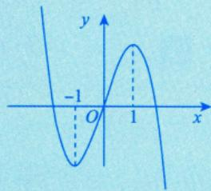

如果 $f(x)$ 在区间 $I$ 上有最值点 $x_0$ ，并且此最值点 $x_0$ 不是区间 $I$ 的端点而是 $I$ 内部的点，那么此 $x_0$ 必是 $f(x)$ 的一个极值点。

即 $f\left( {x}_{0}\right)$ 在定义域内最大(小),且存在左、右邻域, $f\left( {x}_{0}\right)$ 必大(小). 于邻域内点的函数值

事实上，设 $f(x_0)$ 为 $f(x)$ 在 $I$ 上的最大值，则对一切 $x \in I$ ，有 $f(x) \leqslant f(x_0)$ ，又因为 $x_0$ 为 $I$ 内部的点，故存在一个邻域 $U(x_0) \subset I$ ，当 $x \in U(x_0)$ 时， $f(x) \leqslant f(x_0)$ . 由极大值的定义知， $f(x_0)$ 为 $f(x)$ 的一个极大值.

# 2 求区间 $[a, b]$ 上连续函数 $f(x)$ 的最大值 $M$ 和最小值 $m$

$①$ 求出 $f(x)$ 在 $(a,b)$ 内的可疑点 驻点与不可导点，并求出这些可疑点处的函数值；

② 求出端点的函数值 $f(a)$ 和 $f(\overline{b})$

③ 比较以上所求得的所有函数值，其中最大者为 $f(x)$ 在 $[a, b]$ 上的最大值 $M$ ，最小者为 $f(x)$ 在 $[a, b]$ 上的最小值 $m$ 。

注 有时这类问题也可命制为“求连续函数 $f\left( x\right)$ 在区间 $\lbrack a,b\rbrack$ 上的值域 $\left\lbrack  {m,M}\right\rbrack$ ”.

# 3 求区间 $(a,b)$ 内连续函数 $f(x)$ 的最值或取值范围 开区间上的连续函数也可能有最值

① 求出 $f(x)$ 在 $(a, b)$ 内的可疑点——驻点与不可导点，并求出这些可疑点处的函数值；

② 求 $(a, b)$ 两端的单侧极限：若 $a, b$ 为有限常数，则求 $\lim_{x \to a^+} f(x)$ 与 $\lim_{x \to b^-} f(x)$ ；若 $a$ 为 $-\infty$ ，则求 $\lim_{x \to -\infty} f(x)$ ；若 $b$ 为 $+\infty$ ，则求 $\lim_{x \to +\infty} f(x)$ 。记以上所求左端极限为 $A$ ，右端极限为 $B$ ；

③比较①，②所得结果，确定最值或取值范围。

比较a.b.c中的结果

注1这类问题有时没有最大值、最小值.

注2 求区间 $(a, b]$ 或 $[a, b)$ 内连续函数 $f(x)$ 的最值或取值范围，只需在区间 $(a, b)$ 内得到的结果基础上加上 $f(b)$ 或 $f(a)$ 的值即可.

例5.10 求数列 $\left\{\sqrt[n]{n}\right\}$ 的最大项.

# 考研数学基础30讲·高等数学分册

分析 将数列连续化为函数后，观察其单调性.

幂指函数解设 $f(x) = x^{\frac{1}{x}}(x > 0)$ ，则

$$
f ^ {\prime} (x) = x ^ {\frac {1}{x}} \cdot \frac {1 - \ln x}{x ^ {2}},
$$

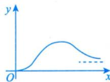

令 $f^{\prime}(x) = 0$ ，得唯一驻点 $x = e$ 。当 $x \in (0, e)$ 时， $f^{\prime}(x) > 0$ ，当 $x \in (e, +\infty)$ 时， $f^{\prime}(x) < 0$ ，所以 $f(x)$ 在 $x = e$ 处取得极大值，即最大值为 $f(e) = e^{\frac{1}{e}}$ ，又因为 $\sqrt{2} < \sqrt[3]{3}$ （利用 $(\sqrt{2})^{6} < (\sqrt[3]{3})^{6}$ 得出），故 $\sqrt[3]{3}$ 是数列 $\left\{ \sqrt[n]{n} \right\}$ 的最大项。

注1 $e \approx 2.718$ ，介于2与3之间，而 $x_{n} = n^{\frac{1}{n}}$ 中的 $n$ 无法取到e，故就近取 $n = 2$ 与 $n = 3$ ，比较大小即可.

注2 如果遇到最小值和最大值的实际问题，首先建立目标函数（即欲求其最值的那个函数），然后确定其定义区间，将它转化为函数的最值问题。特别地，如果所考虑的实际问题存在最小值或最大值，并且所建立的目标函数 $f(x)$ 有唯一的极值点 $x_0$ ，则 $f(x_0)$ 即为所求的最小值或最大值。

# 八 作函数图像

(1)给出函数 $f(x)$ ，作图的一般步骤：

见附录1

① 确定定义域，考查函数是否有奇偶性，周期性，并用好图像变换；  
②用导数工具（一阶导数确定函数的单调区间、极值点；二阶导数确定曲线的凹凸区间、拐点）；  
③考查渐近线；  
$④$ 作出函数图像.

这是基本功，一定要重视。

通常不会直接考查作图，但应学会分析函数性态。

注 常用曲线的图形见附录2，考生需熟练画出这些图形。（重点记忆心形线，星形线及平摆线）

例5.11 画出 $y^{2} = (1 - x^{2})^{3}$ 的图像.

分析 用好图像变换，借助对称性仅需画出第一象限的部分即可.

解首先，代入点 $(x,y),(-x,y)$ 知 $y^{2} = (1 - x^{2})^{3}$ 关于 $y$ 轴对称；代入点 $(x,y),(x, - y)$ 知 $y^{2} = (1 - x^{2})^{3}$ 关于 $x$ 轴对称，于是只需研究 $x\geqslant 0$ ， $y\geqslant 0$ 时的情形.由于 $y^{2}\geqslant 0$ ，知 $0\leqslant x\leqslant 1$ ，故 $0\leqslant y\leqslant 1$ ：

其次，用导数工具， $y = (1 - x^{2})^{\frac{3}{2}}$ ， $y' = \frac{3}{2} (1 - x^{2})^{\frac{1}{2}} \cdot (-2x)$ 令0，当 $x \geqslant 0$ ， $y \geqslant 0$ 时， $x = 0$ ， $x = 1$ ；又 $y'' = 3 \cdot \frac{2x^2 - 1}{\sqrt{1 - x^2}}$ ，令 $y'' = 0$ ，解得 $x = \frac{\sqrt{2}}{2}$ （拐点横坐标），代入得，拐点 $\left(\frac{\sqrt{2}}{2}, \left(\frac{1}{2}\right)^{\frac{3}{2}}\right)$ .

列表如下.

<table><tr><td>x</td><td>0</td><td>\( \left( {0,\frac{\sqrt{2}}{2}}\right) \)</td><td>\( \frac{\sqrt{2}}{2} \)</td><td>\( \left( {\frac{\sqrt{2}}{2},1}\right) \)</td><td>1</td></tr><tr><td>\( {y}^{\prime } \)</td><td>0</td><td>-</td><td></td><td>-</td><td>0</td></tr><tr><td>\( {y}^{\prime \prime } \)</td><td>-3</td><td>-</td><td>0</td><td>+</td><td></td></tr><tr><td>\( y \)</td><td>1</td><td>↘</td><td>拐点</td><td>↘</td><td>0</td></tr></table>

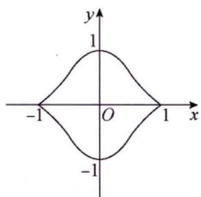  
图5-7

最后，画出图像，如图5-7所示.

注 也可借助上表分析出由每个分段点分出的区间内函数的单调性与曲线的凹凸性.

例5.12 画出 $y = x^x$ （ $x > 0$ ）的图像。

分析 幂指函数求导常用公式： $u^{\nu} = \mathrm{e}^{\nu \ln u}$

解 当 $x \to 0^{+}$ 时，

$$
\begin{array}{l} \lim  _ {x \rightarrow 0 ^ {+}} x ^ {x} = \lim  _ {x \rightarrow 0 ^ {+}} e ^ {x \ln x} = e ^ {\lim  _ {x \rightarrow 0 ^ {+}} x \ln x} = e ^ {\lim  _ {x \rightarrow 0 ^ {+}} \frac {\ln x}{1}} \\ = e ^ {\lim  _ {x \rightarrow 0 ^ {+}} \frac {\frac {1}{x}}{- \frac {1}{x ^ {2}}}} = e ^ {\lim  _ {x \rightarrow 0 ^ {+}} (- x)} = e ^ {0} = 1. \\ \end{array}
$$

令 $y = f(x)$ ，则

$$
f ^ {\prime} (x) = \left(x ^ {x}\right) ^ {\prime} = \left(\mathrm {e} ^ {x \ln x}\right) ^ {\prime} = x ^ {x} (1 + \ln x), \quad \longrightarrow \text {求 验 点}
$$

$$
\begin{array}{l} f ^ {\prime \prime} (x) = \left[ f ^ {\prime} (x) \right] ^ {\prime} = \left[ (1 + \ln x) f (x) \right] ^ {\prime} \\ = (1 + \ln x) f ^ {\prime} (x) + \frac {1}{x} f (x) \\ = x ^ {x} \left[ (1 + \ln x) ^ {2} + \frac {1}{x} \right]. \\ \end{array}
$$

由 $x > 0$ ，得 $x^{x} > 0$ ，故 $f(x) > 0$ ， $f''(x) > 0$ →无拐点

令 $f^{\prime}(x) = 0$ ，解得 $x = \frac{1}{\mathrm{e}}$ 。因此 $f(x)$ 在 $x = \frac{1}{\mathrm{e}}$ 处取得极小值，故函数图像如图5-8所示。

在 $\left(0, \frac{1}{\mathrm{e}}\right)$ 上， $f'(x) < 0$ ；在 $\left(\frac{1}{\mathrm{e}}, +\infty\right)$ 上， $f'(x) > 0$ 。

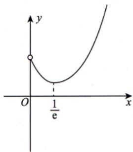  
图5-8

注 当 $x \to +\infty$ 时， $\lim_{x \to +\infty} x^x = \exp \left\{\lim_{x \to +\infty} x \ln x\right\} = +\infty$ ，且速度远超幂函数，从而也无斜渐近线。

例5.13 画出 $y = \frac{\mathrm{e}^x}{x}$ 的图像.

解 对于 $y = \frac{\mathrm{e}^x}{x}$ ， $y' = \frac{\mathrm{e}^x(x - 1)}{x^2}$ 令 $0$ ，得驻点 $x = 1$ ，且当 $x = 0$ 时 $y'$ 不存在。又 $y'' = \frac{\mathrm{e}^x(x^2 - 2x + 2)}{x^3} = \frac{\mathrm{e}^x[(x - 1)^2 + 1]}{x^3}$ ，当 $x > 0$ 时， $y'' > 0$ ；当 $x < 0$ 时， $y'' < 0$ ；当 $x = 0$ 时， $y''$ 不存在。故列表如下。

<table><tr><td>x</td><td>(−∞, 0)</td><td>0</td><td>(0, 1)</td><td>1</td><td>(1, +∞)</td></tr><tr><td>y&#x27;</td><td>-</td><td></td><td>-</td><td></td><td>+</td></tr><tr><td>y&quot;</td><td>-</td><td></td><td>+</td><td></td><td>+</td></tr><tr><td>y</td><td>\(\searrow\)</td><td></td><td>\(\rightarrow\)</td><td>e</td><td>\(\nearrow\)</td></tr></table>

由于 $\lim_{x\to -\infty}\frac{\mathrm{e}^x}{x} = 0,\lim_{x\to 0^{-}}\frac{\mathrm{e}^x}{x} = -\infty ,\lim_{x\to 0^{+}}\frac{\mathrm{e}^x}{x} = +\infty ,\lim_{x\to +\infty}\frac{\frac{\mathrm{e}^x}{x}}{x} = \lim_{x\to +\infty}\frac{\mathrm{e}^x}{x^2} = +\infty$ ，因此

图形有一条水平渐近线 $y = 0$ ，一条铅直渐近线 $x = 0$ ，没有斜渐近线。作图，如图5-9所示。

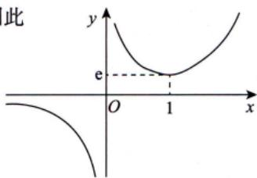  
图5-9

注 由表达式首先确定定义域为 $(- \infty, 0) \cup (0, +\infty)$ .

例5.14 画出 $r = \sin^2\theta (0\leqslant \theta \leqslant \pi)$ 在直角坐标系和极坐标系下的图像.

分析 学会用直角坐标系的观点画极坐标的图.

解 $r = \sin^2\theta = \frac{1 - \cos 2\theta}{2} (0\leqslant \theta \leqslant \pi).$

在直角坐标系的观点下，视 $\theta$ 为 $x$ ， $r$ 为 $y$ ，即可画出图像，如图5-10所示.

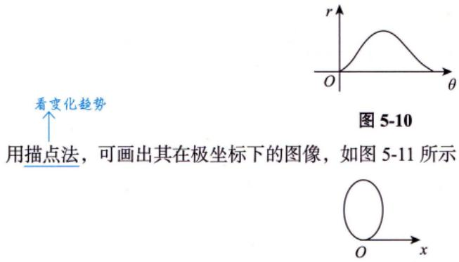  
图5-11

(2)给出参数方程.

a.描点法. 速度慢一些

直角坐标方程， $\longrightarrow$ 借助函数性态画图像b.化为极坐标方程. $\longrightarrow$ 借助直角坐标系的思想画极坐标图像

如 $\left\{ \begin{array}{l}x = \sin t,\\ y = \cos^3 t \end{array} \right.$ （20 $0\leqslant t\leqslant 2\pi)$ 化为直角坐标方程为 $y^{2} = (1 - x^{2})^{3}$

# 九 曲率及曲率半径（仅数学一、数学二）

表示曲线弯曲程度

设 $y(x)$ 二阶可导，则曲线 $y = y(x)$ 在点 $(x,y(x))$ 处的曲率公式为

曲率半径的计算公式 $k = \frac{\left|y^{\prime\prime}\right|}{\left[1 + \left(y^{\prime}\right)^{2}\right]^{\frac{3}{2}}}$

$$
R = \frac {1}{k} = \frac {\left[ 1 + \left(y ^ {\prime}\right) ^ {2} \right] ^ {\frac {3}{2}}}{\left| y ^ {\prime \prime} \right|} (y ^ {\prime \prime} \neq 0).
$$

注 弯曲程度越大，曲率越大，曲率圆的半径越小.

星形线方程 基本都是考填空例5.15 曲线 $\left\{ \begin{array}{l}x = \cos^3 t,\\ y = \sin^3 t \end{array} \right.$ 在 $t = \frac{\pi}{4}$ 对应点处的曲率为

分析 主要考查参数方程求导.

解 应填 $\frac{2}{3}$

用参数求导法，有

$$
\frac {\mathrm {d} y}{\mathrm {d} x} = \frac {y _ {t} ^ {\prime}}{x _ {t} ^ {\prime}} = \frac {3 \sin^ {2} t \cos t}{- 3 \cos^ {2} t \sin t} = - \tan t, \left. \frac {\mathrm {d} y}{\mathrm {d} x} \right| _ {t = \frac {\pi}{4}} = - 1,
$$

$$
\frac {\mathrm {d} ^ {2} y}{\mathrm {d} x ^ {2}} = (- \tan t) ^ {\prime} \frac {\mathrm {d} t}{\mathrm {d} x} = - \frac {1}{\cos^ {2} t} \cdot \frac {1}{- 3 \cos^ {2} t \sin t} = \frac {1}{3 \cos^ {4} t \sin t}, \left. \frac {\mathrm {d} ^ {2} y}{\mathrm {d} x ^ {2}} \right| _ {t = \frac {\pi}{4}} = \frac {4}{3} \sqrt {2}.
$$

按曲率公式， $t = \frac{\pi}{4}$ 对应点处的曲率为

$$
k = \frac {\left| \frac {\mathrm {d} ^ {2} y}{\mathrm {d} x ^ {2}} \right|}{\left[ 1 + \left(\frac {\mathrm {d} y}{\mathrm {d} x}\right) ^ {2} \right] ^ {3 / 2}} \Bigg | _ {t = \frac {\pi}{4}} = \frac {\frac {4}{3} \sqrt {2}}{2 ^ {3 / 2}} = \frac {2}{3}.
$$

# 基础习题精练

# 习题

5.1 设函数 $f(x)$ ， $g(x)$ 具有二阶导数，且 $g''(x) < 0$ 。若 $g(x_0) = a$ 是 $g(x)$ 的极值，则 $f[g(x)]$ 在 $x_0$ 取极大值的一个充分条件是（ ）：

(A) $f^{\prime}(a) <   0$

(B) $f^{\prime}(a) > 0$

(C) $f^{\prime \prime}(a) <   0$

(D) $f^{\prime \prime}(a) > 0$

5.2 设 $f(x)$ 在 $[a, b]$ 上可导，且在点 $x = a$ 处取最小值，在点 $x = b$ 处取最大值，则（ ）.

(A) $f_{+}^{\prime}(a) \leqslant 0$ , $f_{-}^{\prime}(b) \leqslant 0$

(B) $f_{+}^{\prime}(a)\leqslant 0,f_{-}^{\prime}(b)\geqslant 0$

(C) $f_{+}^{\prime}(a)\geqslant 0,f_{-}^{\prime}(b)\leqslant 0$

(D) $f_{+}^{\prime}(a)\geqslant 0,f_{-}^{\prime}(b)\geqslant 0$

5.3 曲线 $y = \frac{x^2 + x}{x^2 - 1}$ 的渐近线条数为  
5.4 曲线 $\tan \left(x + y + \frac{\pi}{4}\right) = \mathrm{e}^{y}$ 在点(0,0)处的切线方程为  
5.5 曲线 $y = (x - 5)x^{\frac{2}{3}}$ 的拐点坐标为  
5.6 函数 $y = x + 2\cos x$ 在区间 $\left[0, \frac{\pi}{2}\right]$ 上的最大值为 ______.  
5.7 曲线 $y = (2x - 1)\mathrm{e}^{\frac{1}{x}}$ 的斜渐近线方程为

5.8（仅数学一、数学二）曲线 $y = x^{2} + x (x < 0)$ 上曲率为 $\frac{\sqrt{2}}{2}$ 的点的坐标是

5.9 设函数 $y = y(x)$ 由方程

$$
2 y ^ {3} - 2 y ^ {2} + 2 x y - x ^ {2} = 1
$$

所确定，试求 $y = y(x)$ 的驻点，并判别它是否为极值点.

# 解答

5.1 (B) 解 由于 $g(x_0)$ 是 $g(x)$ 的极值，故由题设知 $g'(x_0) = 0$ . 记 $y = f[g(x)]$ ，则 $\left.\frac{\mathrm{d}y}{\mathrm{d}x}\right|_{x = x_0} = f'(a)g'(x_0) = 0$ ，从而 $x = x_0$ 是函数 $y = f[g(x)]$ 的驻点. 由于

$$
\frac {\mathrm {d} ^ {2} y}{\mathrm {d} x ^ {2}} = \left\{f ^ {\prime} [ g (x) ] g ^ {\prime} (x) \right\} ^ {\prime} = f ^ {\prime \prime} [ g (x) ] [ g ^ {\prime} (x) ] ^ {2} + f ^ {\prime} [ g (x) ] g ^ {\prime \prime} (x),
$$

则 $\frac{\mathrm{d}^2y}{\mathrm{d}x^2}\Bigg|_{x = x_0} = f'(a)g''(x_0).$

由题设知 $g''(x_0) < 0$ ，所以，若 $f'(a) > 0$ ，则可得到 $\left.\frac{\mathrm{d}^2y}{\mathrm{d}x^2}\right|_{x = x_0} < 0$ ，这正是函数 $y = f[g(x)]$ 在驻点 $x = x_0$ 处取得极大值的充分条件，从而可知选项(B)正确.

若 $f^{\prime}(a) < 0$ ，则可推出函数 $f[g(x)]$ 在 $x_0$ 处取得极小值，故选项(A)不正确.

$f[g(x)]$ 在 $x_0$ 处取得极大值，与 $f''(a)$ 的取值无关，即当 $f''(a) > 0$ 和 $f''(a) < 0$ 时都可能使 $f[g(x)]$ 在 $x_0$ 处取得极大值.

例如，取 $g(x) = -x^2$ ， $f(x) = \mathrm{e}^{x}$ ， $x_0 = 0$ ，则 $g^{\prime}(x) = -2x$ ， $g''(x) = -2 < 0$ ， $g(0) = 0$ 是 $g(x)$ 的极大值， $f[g(x)] = \mathrm{e}^{-x^2}$ 在 $x = 0$ 处取极大值，但 $f''(0) = \mathrm{e}^0 = 1 > 0$ ，故选项(C)不是充分条件.

又例如，取 $g(x) = -x^{2}$ ， $f(x) = \ln (1 + x)$ ， $x_0 = 0$ ，则 $f[g(x)] = \ln (1 - x^2)$ 在 $x = 0$ 处显然取得极大值，但此时 $f''(0) = -\frac{1}{(1 + x)^2}\Bigg|_{x = x_0} = -1 < 0$ ，故选项(D)不是充分条件.

5.2 (D) 解 因为 $f(a)$ 是最小值，所以 $f(x) \geqslant f(a), x \in (a, b]$ ，又 $f_{+}^{\prime}(a)$ 存在，故

$$
f _ {+} ^ {\prime} (a) = \lim  _ {x \rightarrow a ^ {+}} \frac {f (x) - f (a)}{x - a} \geqslant 0.
$$

因为 $f(b)$ 是最大值，所以 $f(x)\leqslant f(b),x\in [a,b)$ ，又 $f_{-}^{\prime}(b)$ 存在，故

$$
f _ {-} ^ {\prime} (b) = \lim  _ {x \rightarrow b ^ {-}} \frac {f (x) - f (b)}{x - b} \geqslant 0.
$$

注 (1)本题考查可导函数在端点处取最值的必要条件, 总结如下:

设 $f(x)$ 在 $[a,b]$ 上可导，则 $f(x)$ 在 $[a,b]$ 上必存在最大（小）值，且

① 若 $f(x)$ 在 $x = a$ 处取 $[a, b]$ 上的最大（小）值，则 $f_{+}^{\prime}(a) \leqslant 0 (\geqslant 0)$   
② 若 $f(x)$ 在 $x = b$ 处取 $[a, b]$ 上的最大（小）值，则 $f_{-}^{\prime}(b) \geqslant 0 (\leqslant 0)$

(2) 若 $f(x)$ 在 $[a, b]$ 上可导，且在点 $x = c \in (a, b)$ 处取最小或最大值，则必有 $f'(c) = 0$ ，此为费马定理.  
(3) 在考研中，要习惯函数 $f(x)$ 的“升阶”或“降阶”。若本题命制成 $F(x) = \int_{a}^{x} f(t) \, \mathrm{d}t$ ， $x \in [a, b]$ ，此谓“升阶”，则 $F(x)$ 是 $f(x)$ 在 $[a, b]$ 上的一个原函数，于是

① 若 $f(x)$ 在 $[a, b]$ 上可导，且当 $f(x)$ 在 $x = a$ 处取得最大（小）值时，有 $F_{+}^{\prime \prime}(a) \leqslant 0 (\geqslant 0)$ .  
② 若 $f(x)$ 在 $[a, b]$ 上可导，且当 $f(x)$ 在 $x = b$ 处取得最大（小）值时，有 $F_{-}^{\prime \prime}(b) \geqslant 0 (\leqslant 0)$ .  
③若 $f(x)$ 在 $[a, b]$ 上可导，且当 $f(x)$ 在 $x = c \in (a, b)$ 处取得最大或最小值时，有 $F''(c) = 0$ ：

5.3 2 解 因为 $y = \frac{x^2 + x}{x^2 - 1} = \frac{x(x + 1)}{(x - 1)(x + 1)}$ ，所以 $\lim_{x \to 1} y = \lim_{x \to 1} \frac{x(x + 1)}{(x - 1)(x + 1)} = \lim_{x \to 1} \frac{x}{x - 1} = \infty$ ，故 $x = 1$ 是曲线 $y = \frac{x^2 + x}{x^2 - 1}$ 的铅直渐近线，且是唯一的铅直渐近线。

又因为 $\lim_{x\to \infty}y = \lim_{x\to \infty}\frac{x^2 + x}{x^2 - 1} = 1$ ，所以 $y = 1$ 是曲线 $y = \frac{x^2 + x}{x^2 - 1}$ 的一条水平渐近线.同时该曲线无斜渐近线.综上可知，曲线 $y = \frac{x^2 + x}{x^2 - 1}$ 有2条渐近线.

5.4 $y = -2x$ 解 方程变形为 $x + y + \frac{\pi}{4} = \arctan e^y$ ，方程两边对 $x$ 求导得 $1 + y' = \frac{e^y}{1 + e^{2y}} y'$

将点(0,0)代入上式得 $y_{(0,0)}' = -2$ ，从而得到曲线在点(0,0)处的切线方程为 $y = -2x$ 。

5.5 (-1, -6) 解 $y = x^{\frac{5}{3}} - 5x^{\frac{2}{3}}, y' = \frac{5}{3} x^{\frac{2}{3}} - \frac{10}{3} x^{-\frac{1}{3}}, y'' = \frac{10}{9} x^{-\frac{1}{3}} + \frac{10}{9} x^{-\frac{4}{3}} = \frac{10(x + 1)}{9\sqrt[3]{x^4}}.$

令 $y^{\prime \prime} = 0$ ，得 $x = -1$ ，又 $x\to 0$ 时， $y^{\prime \prime}\rightarrow +\infty$ .由于在 $x = -1$ 的左、右邻域内 $y''$ 变号，在 $x = 0$ 的左、右邻域内 $y''$ 不变号，故拐点为 $(-1, - 6)$ ：

5.6 $\sqrt{3} + \frac{\pi}{6}$ 解 $y' = 1 - 2\sin x, y'' = -2\cos x$ ，令 $y' = 0$ 得 $x = \frac{\pi}{6}, y''\left(\frac{\pi}{6}\right) = -\sqrt{3} < 0$ ，则 $y = x + 2\cos x$ 在 $x = \frac{\pi}{6}$ 处取得极大值，又该函数在 $\left(0, \frac{\pi}{2}\right)$ 上极值点唯一，则该极大值点为函数在 $\left(0, \frac{\pi}{2}\right)$ 上的最大值点，又 $y(0) = 2$ ， $y\left(\frac{\pi}{2}\right) = \frac{\pi}{2}$ ，比较得函数在 $\left[0, \frac{\pi}{2}\right]$ 上的最大值为 $y\left(\frac{\pi}{6}\right) = \sqrt{3} + \frac{\pi}{6}$ .

5.7 $y = 2x + 1$ 解 $a = \lim_{x\to \infty}\frac{y}{x} = \lim_{x\to \infty}\left(2 - \frac{1}{x}\right)\mathrm{e}^{\frac{1}{x}} = 2,$

$$
b = \lim  _ {x \rightarrow \infty} (y - a x) = \lim  _ {x \rightarrow \infty} [ 2 x (\mathrm {e} ^ {\frac {1}{x}} - 1) - \mathrm {e} ^ {\frac {1}{x}} ] = \lim  _ {x \rightarrow \infty} \left[ \frac {2 (\mathrm {e} ^ {\frac {1}{x}} - 1)}{\frac {1}{x}} - \mathrm {e} ^ {\frac {1}{x}} \right] = 1,
$$

所以斜渐近线方程为 $y = 2x + 1$

5.8 (-1,0) 解 将 $y' = 2x + 1$ , $y'' = 2$ 代入曲率公式 $k = \frac{|y'|}{[1 + (y')^2]^{\frac{3}{2}}}$ ，得 $\frac{2}{[1 + (2x + 1)^2]^{\frac{3}{2}}} = \frac{\sqrt{2}}{2}$ ，整理后有 $x^2 + x = 0$ ，由于 $x < 0$ ，因此得 $x = -1$ ，又有 $y|_{x=-1} = 0$ ，故所求点的坐标为 $(-1,0)$ .

5.9 解 方程两边对 $x$ 求导可得

$$
3 y ^ {2} y ^ {\prime} - 2 y y ^ {\prime} + x y ^ {\prime} + y - x = 0, \tag {*}
$$

令 $y' = 0$ ，由 (*) 得 $y = x$ ，将其代入原方程有

$$
2 x ^ {3} - x ^ {2} - 1 = 0,
$$

从而可得唯一驻点 $x = 1$ ：（\*）式两边再对 $\mathcal{X}$ 求导，得

$$
(3 y ^ {2} - 2 y + x) y ^ {\prime \prime} + 2 (3 y - 1) \left(y ^ {\prime}\right) ^ {2} + 2 y ^ {\prime} - 1 = 0,
$$

因此 $y_{x=1}^{\prime \prime} = \frac{1}{2} > 0$ ，故 $x = 1$ 是 $y = y(x)$ 的极小值点.

# 第6讲

# 一元函数微分学的应用（二）——中值定理、微分等式与微分不等式

① 连续函数 + 可导函数

② 方程 (数学二、三常考)

③ 用导数的方法证明（数学三常考）

<table><tr><td>考题</td><td>中值定理、微分等式与微分不等式</td></tr><tr><td>题型</td><td>选择题、填空题、解答题</td></tr><tr><td>目标</td><td>①理解闭区间上连续函数的性质(有界性、最大值和最小值定理、介值定理),并会应用这些性质;②理解并会用罗尔定理、拉格朗日中值定理和泰勒定理,了解并会用柯西中值定理</td></tr><tr><td>重难点</td><td>①平均值定理;②罗尔定理的推论;③用函数性态证明微分不等式;④用中值定理证明微分不等式</td></tr></table>

# 基础知识结构

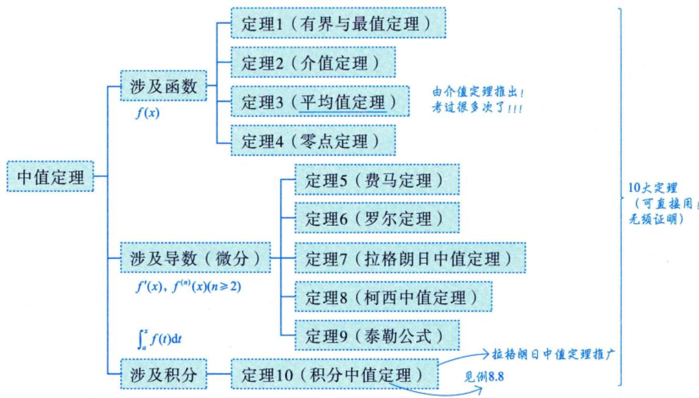

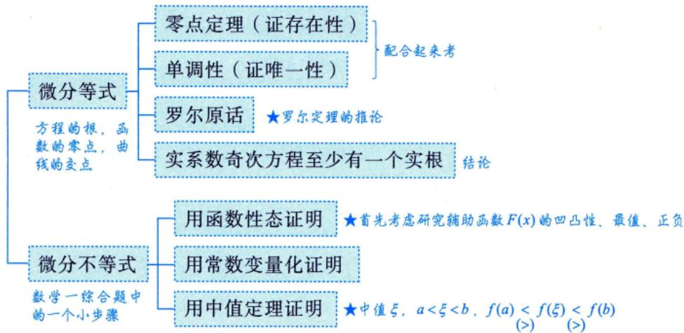

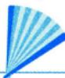

# 基础内容精讲

# 中值定理

# 涉及函数的中值定理

设 $f(x)$ 在 $[a,b]$ 上连续，则

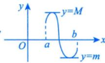

有界 $|f(x)| \leqslant M$

定理1（有界与最值定理） $m \leqslant f(x) \leqslant M$ ，其中 $m, M$ 分别为 $f(x)$ 在 $[a, b]$ 上的最小值与最大值.

定理2（介值定理）当 $m \leqslant \mu \leqslant M$ 时，存在 $\xi \in [a, b]$ ，使得 $f(\xi) = \mu$ 。

如， $f(x)$ 在[0,2]上连续， $f(0) = 0$ ， $f(1) = 1$ ，则存在 $\xi \in (0,1)$ ，使 $f(\xi) = \frac{1}{2}$

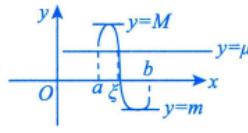

（离散的）平均值定理： $f(\xi) = \frac{1}{n}\sum_{i = 1}^{n}f(x_i).$

(连续的)平均值定理： $f(\xi) = \frac{1}{b - a}\int_{a}^{b}f(x)\mathrm{d}x.$ 定理3（平均值定理）当 $a <   x_1 <   x_2 <   \dots <  x_n <   b$ 时，在 $[x_{1},x_{n}]$ 内至少存在一点 $\xi$ ，使得

$$
f (\xi) = \frac {f \left(x _ {1}\right) + f \left(x _ {2}\right) + \cdots + f \left(x _ {n}\right)}{n}.
$$

注证 由闭区间连续函数的最值定理，得

$$
m \leqslant f \left(x _ {1}\right) \leqslant M,
$$

$$
m \leqslant f \left(x _ {2}\right) \leqslant M,
$$

$$
m \leqslant f (x _ {n}) \leqslant M,
$$

$$
m \leqslant \frac {f \left(x _ {1}\right) + \cdots + f \left(x _ {n}\right)}{n} \leqslant M,
$$

则存在 $\xi \in [x_1, x_n] \subset [a, b]$ 使得 $f(\xi) = \frac{f(x_1) + \cdots + f(x_n)}{n}$ .

定理4（零点定理）当 $f(a)\cdot f(b) < 0$ 时，存在 $\xi \in (a,b)$ ，使得 $f(\xi) = 0$ ：

$a, b$ 为无定义点，可直接用

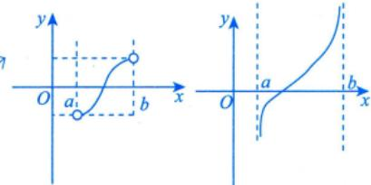

注 推广的零点定理：若 $f(x)$ 在 $(a,b)$ 内连续， $\lim_{x\to a^{+}}f(x) = \alpha ,\lim_{x\to b^{-}}f(x) = \beta$ ，且 $\alpha \cdot \beta < 0$ ，则 $f(x) = 0$ 在 $(a,b)$ 内至少有一个根，这里 $a,b,\alpha ,\beta$ 可以是有限数，也可以是无穷大.

例6.1 设函数 $f(x)$ 在 $[0, 1]$ 上连续，且 $f(1) = 0$ ， $f\left(\frac{1}{2}\right) = 1$ ，证明：存在 $\eta \in \left(\frac{1}{2}, 1\right)$ ，使得 $f(\eta) = \eta$ .

0分析 涉及关系式，“做一至两步的逆运算”只需证 $f(\eta) - \eta = 0$

证 令 $F(x) = f(x) - x$ ，则函数 $F(x) = f(x) - x$ 在 $\left[\frac{1}{2}, 1\right]$ 上连续，且有

$$
F \left(\frac {1}{2}\right) = f \left(\frac {1}{2}\right) - \frac {1}{2} = \frac {1}{2} > \overline {{0}}, F (1) = f (1) - 1 = - 1 <   \overline {{0}}, \text {端 点 值 异 号}
$$

由于 $F\left(\frac{1}{2}\right) \cdot F(1) < 0$ ，根据零点定理可知，存在 $\eta \in \left(\frac{1}{2}, 1\right)$ ，使得 $F(\eta) = 0$ ，即 $f(\eta) = \eta$ ：

例6.2 设函数 $f(x)$ 在区间 $[0,1]$ 上连续，且 $f(1) > 0$ ， $\lim_{x \to 0^{+}} \frac{f(x)}{x} < 0$ 。证明：方程 $f(x) = 0$ 在区间 $(0,1)$ 内至少存在一个实根。一般作为解答题的第一问极限必须存在，才可和“0”比大小。

证 由 $\lim_{x\to 0^{+}}\frac{f(x)}{x} < 0$ 与极限的保号性可知，存在 $a\in (0,1)$ ，使得 $\frac{f(a)}{a} < 0$ ，即 $f(a) < 0$ ：

又 $f(1) > 0$ ，所以存在 $b\in (a,1)\subset (0,1)$ ，使得 $f(b) = 0$ ，即方程 $f(x) = 0$ 在区间 $(0,1)$ 内至少存在一个实根.

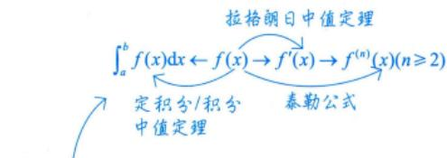

# 2 涉及导数（微分）的中值定理

历史故事：费马,被称为最业余的数学家,比牛顿大42岁,是个律师。

1637年他在图书馆看书时，看到了“ $x^{2} + y^{2} = z^{2}$ 必存在正整数解”，他违反规定写了一段话：

$$
\left. \begin{array}{r l} & x ^ {3} + y ^ {3} = z ^ {3} \\ & x ^ {4} + y ^ {4} = z ^ {4} \\ & \dots \\ & x ^ {n} + y ^ {n} = z ^ {n} \end{array} \right\} \text {一 律 没 有 正 整 数 解 .}
$$

费马说：“此处太小写不下，不予证明了”。费马大定理提出了好的问题，实际上，比解决它更好！

定理5（费马定理）设 $f(x)$ 在点 $x_0$ 处满足 $\left\{ \begin{array}{ll}\text{①可导，} & \text{左右导数存在且相等}\\ \text{则} f^{\prime}(x_0) = 0\\ \text{②取极值，} & \text{极值点} \end{array} \right.$

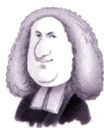

费马

(1601-1665)

注 (1) 证明费马定理.

不妨假设 $f(x)$ 在点 $x_0$ 处取得极大值，则存在 $x_0$ 的邻域 $U(x_0)$ ，对任意的 $x \in U(x_0)$ ，都有 $\Delta f = f(x) - f(x_0) \leq 0$ ，于是根据导数的定义与极限的保号性，有

$$
f _ {-} ^ {\prime} \left(x _ {0}\right) = \lim  _ {x \rightarrow x _ {0}} \frac {f (x) - f \left(x _ {0}\right)}{x - x _ {0}} \geqslant 0,
$$

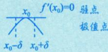

$$
f _ {+} ^ {\prime} \left(x _ {0}\right) = \lim  _ {x \rightarrow x _ {0} ^ {*}} \frac {f (x) - f \left(x _ {0}\right)}{x - x _ {0}} \leqslant 0.
$$

又 $f(x)$ 在点 $x_0$ 处可导，于是 $f_{-}^{\prime}(x_0) = f_{+}^{\prime}(x_0)$ ，故 $f^{\prime}(x_0) = 0$

(2) 当一个人跑到最远处时，他的速度为零；当一个人跑得最快时，他的加速度为零。这些都是费马定理在生活中的通俗应用。

例6.3（导数零点定理）设 $f(x)$ 在 $[a,b]$ 上可导，证明当 $f_{+}^{\prime}(a)\cdot f_{-}^{\prime}(b) < 0$ 时，存在 $\xi \in (a,b)$

使得

$f^{\prime}(x)$ 存在

由此知最大值取在区间内，而区间内的最值必为极值，端点的最值不一定是极值 $\frac{1 \cdots 1}{a a + \delta_1} \quad b - \delta_2 \quad b \rightarrow x$

$$
f ^ {\prime} (\xi) = 0.
$$

证 不妨设 $f_{+}^{\prime}(a) > 0, f_{-}^{\prime}(b) < 0$ ，于是

(端点不谈论极值,因为在区间外侧并无定义)

由 $f_{+}^{\prime}(a) = \lim_{x\to a^{+}}\frac{f(x) - f(a)}{x - a} >0$ ，可得存在 $\delta_1 > 0$ ，在 $(a,a + \delta_1)$ 内， $f(x) > f(a)$ ；脱帽法  
由 $f_{-}^{\prime}(b) = \lim_{x\to b^{-}}\frac{f(x) - f(b)}{x - b} < 0$ ，可得存在 $\delta_2 > 0$ ，在 $(b - \delta_2,b)$ 内， $f(x) > f(b)$ ：

故 $f(a)$ 与 $f(b)$ 均不是 $f(x)$ 在 $[a,b]$ 上的最大值，则 $f(x)$ 在 $(a,b)$ 内取得最大值，根据费马定理可知，存在 $\xi \in (a,b)$ ，使得 $f^{\prime}(\xi) = 0$ ：

# 定理6（罗尔定理）

设 $f(x)$ 满足 $\left\{ \begin{array}{l l} 1 & \text { 在 } [a, b] \text { 上连续 ， } \\ 2 & \text { 在 } (a, b) \text { 内可导 ， 则存在 } \xi \in (a, b) \text { ， 使得 } f^{\prime}(\xi) = 0 \\ 3 & f(a) = f(b) \end{array} \right.$

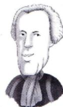  
罗尔

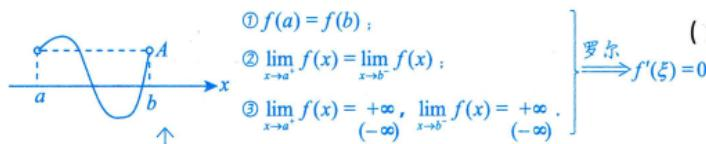  
(1652-1719)

注1 推广的罗尔定理.

设 $f(x)$ 在 $(a,b)$ 内可导， $\lim_{x\to a^{+}}f(x) = \lim_{x\to b^{-}}f(x) = A$ ，则在 $(a,b)$ 内至少存在一点 $\xi$ ，使 $f^{\prime}(\xi) = 0$ ，其中区间 $(a,b)$ 可以是有限区间也可以是无穷区间， $A$ 可以是有限数也可以是无穷大.

注2 罗尔定理的使用往往需要构造辅助函数，其方法总结如下.

(1) 简单情形：题设 $f(x)$ 即为辅助函数（研究对象）.  
(2)复杂情形. 一般不用 $f$ ,而用一个神秘的“ $F$ ”——辅助函数

① 乘积求导公式 $(uv)' = u'v + uv'$ 的逆用.

a. $[f(x)f(x)]' = [f^2(x)]' = 2f(x) \cdot f'(x)$ .

见到 $f(x)f'(x)$ ，令 $F(x) = f^2(x)$ 。逆运算

b. $[f(x)\bullet f'(x)]' = [f'(x)]^2 +f(x)f''(x).$

见到 $[f'(x)]^2 + f(x)f''(x)$ ，令 $F(x) = f(x)f'(x)$ 。

c. $[f(x)\mathrm{e}^{\varphi (x)}]^{\prime} = f^{\prime}(x)\mathrm{e}^{\varphi (x)} + f(x)\mathrm{e}^{\varphi (x)}\bullet \varphi^{\prime}(x) = [f^{\prime}(x) + f(x)\varphi^{\prime}(x)]\mathrm{e}^{\varphi (x)}.$

见到 $f^{\prime}(x) + f(x)\varphi^{\prime}(x)$ ，令 $F(x) = f(x)\mathrm{e}^{\varphi (x)}$

常考以下情形.

$\varphi (x) = x\Rightarrow$ 见到 $f^{\prime}(x) + f(x)$ ，令 $F(x) = f(x)\mathrm{e}^{x}$

$\varphi (x) = -x\Rightarrow$ 见到 $f^{\prime}(x) - f(x)$ ，令 $F(x) = f(x)\mathrm{e}^{-x}$

$\varphi (x) = kx\Rightarrow$ 见到 $f^{\prime}(x) + kf(x)$ ，令 $F(x) = f(x)\mathrm{e}^{kx}$

$(uv)'' = u''v + 2u'v' + uv''$ 亦有可能考到.

$②$ 商的求导公式 $\left(\frac{u}{v}\right)' = \frac{u'v - uv'}{v^2}$ 的逆用.

a. $\left[\frac{f(x)}{x}\right]' = \frac{f'(x)x - f(x)}{x^2}.$

见到 $f^{\prime}(x)x - f(x),x\neq 0$ ，令 $F(x) = \frac{f(x)}{x}$

b. $\left[\frac{f'(x)}{f(x)}\right]' = \frac{f''(x)f(x) - [f'(x)]^2}{f^2(x)}$

见到 $f^{\prime \prime}(x)f(x) - [f^{\prime}(x)]^{2},f(x)\neq 0$ ，令 $F(x) = \frac{f'(x)}{f(x)}$

c. $[\ln f(x)]' = \frac{f'(x)}{f(x)}$ 故 $[\ln f(x)]'' = \left[\frac{f'(x)}{f(x)}\right]' = \frac{f''(x)f(x) - [f'(x)]^2}{f^2(x)}.$

见到 $f''(x)f(x) - [f'(x)]^2$ ， $f(x) > 0$ ，亦可考虑令 $F(x) = \ln f(x)$ ：

事实上，这些辅助函数的构造不仅仅限于罗尔定理的使用。

例6.4 设 $f(x)$ 在 $[0,3]$ 上连续，在 $(0,3)$ 内可导，且 $f(0) + f(1) + f(2) = 3$ ， $f(3) = 1$ 。证明：必存在 $\xi \in (0,3)$ ，使得 $f'(\xi) = 0$ 。

证 因为 $f(x)$ 在 $[0, 3]$ 上连续，所以 $f(x)$ 在 $[0, 2]$ 上连续，且在 $[0, 2]$ 上必有最大值 $M$ 和最小值 $m$ ，于是

$$
m \leqslant f (0) \leqslant M, m \leqslant f (1) \leqslant M, m \leqslant f (2) \leqslant M,
$$

故 $m \leqslant \frac{f(0) + f(1) + f(2)}{3} = 1 \leqslant M.$ 平均值定理

由介值定理可知，至少存在一点 $c\in [0,2]$ ，使得 $f(c) = \frac{f(0) + f(1) + f(2)}{3} = 1$

所以函数 $f(x)$ 在 $[c,3]$ 上满足罗尔定理的条件，于是存在 $\xi \in (c,3)\subset (0,3)$ ，使得 $f^{\prime}(\xi) = 0$ ：

例6.5 设 $f(x)$ 在 $[a,b]$ 上连续，在 $(a,b)$ 内可导， $f(a) = 0, a > 0$ ，证明：存在 $\xi \in (a,b)$ 使得 $f(\xi) = \frac{b - \xi}{a} f'(\xi)$ ：

分析 先将结论改写为 $f^{\prime}(\xi) - \frac{a}{b - \xi} f(\xi) = 0$ （对照 $f^{\prime}(x) + f(x)\varphi^{\prime}(x)$ ，所以构造辅助函数 $F(x) = f(x)\mathrm{e}^{\int \left(\frac{a}{b - x}\right)\mathrm{d}x} =$ $f(x)(b - x)^a$ ，再利用罗尔定理即可. $① F ( a ) = f ( a ) ( b - a ) ^ { a } = 0 ~ ;$ $② F ( b ) = f ( b ) ( b - b ) ^ { a } = 0$

证 令 $F(x) = f(x)(b - x)^{a}$ ，显然 $\widehat{F(a)} = F(b) = 0$ ，由罗尔定理知，存在 $\xi \in (a, b)$ ，使得 $F'(\xi) = 0$ 即 $f'(\xi)(b - \xi)^{a} - af(\xi)(b - \xi)^{a - 1} = 0$ ，已知 $a > 0$ ，故 $f(\xi) = \frac{b - \xi}{a} f'(\xi)$ .

注上面是证明一阶导数为0，也就是使用一次罗尔定理的问题，但有些题目涉及二阶导数为0，即要多次使用罗尔定理，这种问题的难点是要找到函数值相等的三个不同点，即 $f(a) = f(b) = f(c)$ （不

妨设 $a < b < c$ ，分别在 $[a, b], [b, c]$ 上使用罗尔定理，有 $f'(\xi_1) = f'(\xi_2) = 0, \xi_1 \in (a, b), \xi_2 \in (b, c)$ ，进而在 $[\xi_1, \xi_2]$ 上再对 $f'(x)$ 使用罗尔定理，得 $f''(\xi) = 0$ ，其中 $\xi \in (\xi_1, \xi_2) \subset (a, c)$ . 如例6.6.

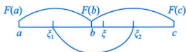

$$
\text {由} F ^ {\prime} (\xi_ {1}) = F ^ {\prime} (\xi_ {2}) = 0, \text {得} F ^ {\prime \prime} (\xi) = 0
$$

例6.6 设函数 $f(x)$ 在 $[0,1]$ 上连续，在 $(0,1)$ 内二阶可导，过点 $A(0,f(0))$ 与点 $B(1,f(1))$ 的直线与曲线 $y = f(x)$ 相交于点 $C(c,f(c))$ ，其中 $0 < c < 1$ ，证明：存在 $\xi \in (0,1)$ ，使得 $f''(\xi) = 0$ ：

证 根据题意，过点 $A$ 与点 $B$ 的直线方程为 $y_{1} = [f(1) - f(0)]x + f(0)$

令 $F(x) = f(x) - y_{1} = f(x) - [f(1) - f(0)]x - f(0)$ ，又 $f(c) = [f(1) - f(0)]\cdot c + f(0)$ ，且 $F(0) = 0$ ， $F(1) = 0$ ， $F(c) = f(c) - [f(1) - f(0)]\cdot c - f(0) = 0$ ，则 $F(x)$ 在 $[0, c]$ 与 $[c, 1]$ 上均满足罗尔定理的条件，于是可得 $F'(\xi_1) = F'(\xi_2) = 0$ ， $\xi_1 \in (0, c)$ ， $\xi_2 \in (c, 1)$ . 因为 $F(x)$ 有三个零点

再由罗尔定理可得 $F''(\xi) = f''(\xi) = 0, \xi \in (\xi_1, \xi_2) \subset (0, 1)$ ，命题得证.

公式 直线方程 $y_{1} - f(0) = \frac{f(1) - f(0)}{1 - 0} (x - 0)$

注 大于等于2阶为高阶.

若证 $f^{(n)}(\xi) = 0$ 用罗尔定理可能性大；

若证 $f^{(n)}(\xi)\neq 0$ （不等式）用泰勒公式可能性大.

例6.7 设函数 $f(x)$ 在区间 $[0,1]$ 上具有二阶导数，且 $f(1) > 0$ ， $\lim_{x \to 0^{+}} \frac{f(x)}{x} < 0$ 。证明：方程 $f(x)f''(x) + [f'(x)]^2 = 0$ 在区间 $(0,1)$ 内至少存在两个不同实根。说明函数 $f(x)$ 在闭区间上左端点右连续，右端点左连续

分析 辅助函数为 $F(x) = f(x)\cdot f^{\prime}(x)$ ，即证 $\left\{ \begin{array}{l}F^{\prime}(\xi_{1}) = 0,\\ F^{\prime}(\xi_{2}) = 0, \end{array} \right.$ 其中 $\xi_{1}$ 与 $\xi_{2}$ 不相等.

证 由题设知 $f(x)$ 连续且 $\lim_{x \to 0^+} \frac{f(x)}{x}$ 存在，所以 $f(0) = 0$ . 又由例6.2知 $f(b) = 0$ ， $b \in (0,1)$ ，由罗尔定理知，存在 $c \in (0,b) \subset (0,1)$ ，使得

$$
f ^ {\prime} (c) = 0.
$$

令 $F(x) = f(x)f'(x)$ ，由题设知 $F(x)$ 在区间 $[0, b]$ 上可导，且

$$
F (0) = 0, F (c) = 0, F (b) = 0. \rightarrow \text {由} f ^ {\prime} (c) = 0 \text {得 到}
$$

根据罗尔定理，存在 $\xi \in (0,c)$ ， $\eta \in (c,b)$ ，使得 $F^{\prime}(\xi) = F^{\prime}(\eta) = 0$ ，即 $\xi ,\eta$ 是方程 $f(x)f''(x) + f'(x)]^2 = 0$ 在区间(0,1)内的两个不同实根.

# 定理7（拉格朗日中值定理）

设 $f(x)$ 满足 $\left\{ \begin{array}{ll}\text{①在} [a,b]\text{上连续，}\\ \text{②在} (a,b)\text{内可导，} \end{array} \right.$ 则存在 $\xi \in (a,b)$ ，使得

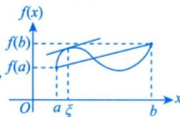

  
拉格朗日

或者写成

若在区间 $(a,b)$ 上处处变化率为0，则 $f(b) = f(a)$ 为常数

(1736-1813)

$$
f ^ {\prime} (\xi) = \frac {f (b) - f (a)}{b - a}.
$$

注 见到 $f(a) - f(b)$ 或 $f$ 与 $f'$ 的关系，一般想到用拉格朗日中值定理. 拉格朗日中值定理的作用是用导函数的值来控制函数值的增减.

例6.8 若 $f(x)$ 在 $(a, b)$ 内可导且 $f'(x)$ 有界，证明： $f(x)$ 在 $(a, b)$ 内有界。

证 因为 $f(x)$ 在 $(a, b)$ 内可导，所以 $f(x)$ 在 $(a, b)$ 内连续，因此对任意 $x_0 \in (a, b)$ ， $f(x_0)$ 存在，对任意 $x \in (a, b)$ ，不妨设 $x < x_0$ ，对 $f(x)$ 在 $[x, x_0]$ 上应用拉格朗日中值定理，有

$$
f (x) - f \left(x _ {0}\right) = f ^ {\prime} (\xi) \left(x - x _ {0}\right), \xi \in \left(x, x _ {0}\right), \text {关 系 式}
$$

则 $\left|f(x)\right|\leqslant \left|f(x_0)\right| + \left|f'(\xi)\right|\left|x - x_0\right|$ ，由于 $f^{\prime}(x)$ 有界，故存在 $k > 0$ ，使得对任意 $x\in (a,b)$ ，有 $\mid f^{\prime}(x)\mid \leqslant k$ 学会翻译数学名词 ★关系式

则 $|f'(\xi)| \leqslant k$ ，故

$$
\left| f (x) \right| \leqslant \left| f \left(x _ {0}\right) \right| + k \left| x - x _ {0} \right| \leqslant \left| f \left(x _ {0}\right) \right| + k (b - a) \stackrel {\text {记}} {=} M,
$$

即 $f(x)$ 在 $(a,b)$ 内有界.

★ $|A| - |B| \leqslant |A + B| \leqslant |A| + |B|$

例6.9 设 $f(x)$ 在 $[0,1]$ 上连续，在 $(0,1)$ 内可导， $f(0) = 0$ ，且 $f(x)$ 在 $[0,1]$ 上不恒等于零。证明：存在 $\xi \in (0,1)$ ，使得 $f(\xi)f'(\xi) > 0$ 。

$\mathcal{P}$ 分析 令 $F(x) = \frac{1}{2} f^2 (x),\frac{1}{2} f^2\rightarrow ff'\rightarrow (f')^2 +ff''$ ，欲证 $F^{\prime}(\xi) = 0$ 想到罗尔定理；欲证 $F^{\prime}(\xi) > 0$ 想到拉格朗日中值定理.

证 令 $F(x) = \frac{1}{2} f^2 (x)$ ，则 $F(0) = \frac{1}{2} f^{2}(0) = 0$ ，因为 $f(x)$ 不恒为0，于是必存在某点 $a\in (0,1]$ 使得 $f(a)\neq 0$ ，则 $F(a) = \frac{1}{2} f^{2}(a) > 0$ ，由拉格朗日中值定理可知，存在 $\xi \in (0,a)\subset (0,1)$ ，使得 $F^{\prime}(\xi) = \frac{F(a) - F(0)}{a - 0} >0$ ，即 $f(\xi)f^{\prime}(\xi) > 0$ ：

例6.10 设函数 $f(x)$ 满足 $f(0) = 0$ ，且当 $x > 0$ 时， $f(x) < 0$ ， $f'(x) < 0$ ， $f''(x) > 0$ ，则当 $0 < a < x < b$ 时，有（ ）.

(A) $xf(x) > af(a)$

(B) $bf(b) > xf(x)$

(C) $xf(a) > af(x)$

(D) $xf(b) > bf(x)$

解 应选(D).

令 $g(x) = xf(x),x > 0$ ，则 $g^{\prime}(x) = f(x) + xf^{\prime}(x) <   0,g(x)$ 单调减少，故当 $0 <   a <   x <   b$ 时， $g(b) <   g(x) <   g(a)$ ，即 $bf(b) <   xf(x) <   af(a)$ ，选项(A)，(B)错误.

再令 $h(x) = \frac{f(x)}{x}, x > 0$ ，则

$$
\begin{array}{l} h ^ {\prime} (x) = \frac {x f ^ {\prime} (x) - f (x)}{x ^ {2}} \quad \text {判 断 不 出} f, x f ^ {\prime} \text {的 关 系 ，} \\ = \frac {x f ^ {\prime} (x) - [ f (x) - f (0) ]}{x ^ {2}} = \frac {x f ^ {\prime} (x) - f ^ {\prime} (\xi) \cdot x}{x ^ {2}} \\ = \frac {f ^ {\prime} (x) - f ^ {\prime} (\xi) > 0}{x}, \\ \end{array}
$$

其中 $0 < \xi < x$ 。由 $f''(x) > 0$ ，知 $f'(x)$ 单调增加， $f'(x) > f'(\xi)$ ，则 $h'(x) > 0, h(x)$ 单调增加，故当 $0 < a < x < b$ 时， $h(a) < h(x) < h(b)$ ，即 $\frac{f(a)}{a} < \frac{f(x)}{x} < \frac{f(b)}{b}$ ，也即 $af(x) > xf(a), xf(b) > bf(x)$ ，选项(C)

错误，选(D).

定理8（柯西中值定理）用参数方程来表达

$①$ 在 $[a,b]$ 上连续，设 $f(x),g(x)$ 满足 $②$ 在 $(a,b)$ 内可导，则存在 $\xi \in (a,b)$ ，使得 $③ g^{\prime}(x)\neq 0$

法国科学院院长拉格朗日（欧拉的学生）的学  
生，徽积合收官人之一.数学故事：拉格朗日让  
其父亲答应柯西15岁前不学数学，15岁后拉格  
朗日亲自来教

往往考查一个具体函数，一个抽象函数

f(b)-f(a）=g(b)-g(a) $\frac{f^{\prime}(\xi)}{g^{\prime}(\xi)}\xrightarrow{\text{同}}$ 个5 “参数方程 $x = g(t)$ 求导而来

  
柯西

(1789-1857)

例6.11 设 $f(x)$ 在 $[a, b]$ 上连续，在 $(a, b)$ 内可导， $0 < a < b$ ，证明：至少存在一点 $\xi \in (a, b)$ ，使得 $f(b) - f(a) = \xi \ln \frac{b}{a} f'(\xi)$ .

证 因为 $f(x)$ 与 $g(x) = \ln x$ 在 $[a, b]$ 上连续，在 $(a, b)$ 内可导，且 $g'(x) = \frac{1}{x} \neq 0 (0 < a < x < b)$ ，即 $f(x)$ 与 $g(x) = \ln x$ 在 $[a, b]$ 上满足柯西中值定理的条件，则至少存在一点 $\xi \in (a, b)$ ，使得

$$
\frac {f (b) - f (a)}{\ln b - \ln a} = \frac {f ^ {\prime} (\xi)}{\frac {1}{\xi}},
$$

即

$$
f (b) - f (a) = \xi \ln \frac {b}{a} f ^ {\prime} (\xi).
$$

定理9（泰勒公式）微今中值定理

(1) 带拉格朗日余项的 $n$ 阶泰勒公式.

此公式适用于区间 $[a,b]$ ，常在证明题中使用，如证不等式、中值等式等

设 $f(x)$ 在点 $x_0$ 的某个邻域内 $n + 1$ 阶导数存在，则对该邻域内的任意点 $x$ ，有

$$
f (x) = f \left(x _ {0}\right) + f ^ {\prime} \left(x _ {0}\right) \left(x - x _ {0}\right) + \dots + \frac {1}{n !} f ^ {(n)} \left(x _ {0}\right) \left(x - x _ {0}\right) ^ {n} + \frac {f ^ {(n + 1)} (\xi)}{(n + 1) !} \left(x - x _ {0}\right) ^ {n + 1},
$$

其中 $\xi$ 介于 $x, x_0$ 之间.

(2) 带佩亚诺余项的 $n$ 阶泰勒公式.

此公式仅适用于点 $x = x_0$ 及其邻域，常用于研究点 $x = x_0$ 处的某些结论，如求极限、判定无穷小的阶数、判定极值等

设 $f(x)$ 在点 $x_0$ 处 $n$ 阶可导，则存在 $x_0$ 的一个邻域，对于该邻域内的任意点 $x$ ，有

局部上

$$
f (x) = f \left(x _ {0}\right) + f ^ {\prime} \left(x _ {0}\right) \left(x - x _ {0}\right) + \dots + \frac {1}{n !} f ^ {(n)} \left(x _ {0}\right) \left(x - x _ {0}\right) ^ {n} + o \left(\left(x - x _ {0}\right) ^ {n}\right).
$$

思想：用多项式来近似表示 $f(x)$

注1 当 $x_0 = 0$ 时的泰勒公式称为麦克劳林公式.

拉格朗日余项

$$
\begin{array}{l} f (x) = f (0) + f ^ {\prime} (0) x + \frac {f ^ {\prime \prime} (0)}{2 !} x ^ {2} + \dots + \frac {f ^ {(n)} (0)}{n !} x ^ {n} + \boxed {\frac {f ^ {(n + 1)} (\xi)}{(n + 1) !} x ^ {n + 1}}, \text {其 中} \xi \text {介 于} 0 \text {和} x \text {之 间}. \\ f (x) = f (0) + f ^ {\prime} (0) x + \frac {f ^ {\prime \prime} (0)}{2 !} x ^ {2} + \dots + \frac {f ^ {(n)} (0)}{n !} x ^ {n} + \boxed {o (x ^ {n})}. \\ \end{array}
$$

注2 几个重要函数的麦克劳林展开式.

(1) $e^x = 1 + x + \frac{1}{2!} x^2 + \dots + \frac{1}{n!} x^n + o(x^n)$ .   
(2) $\sin x = x - \frac{x^3}{3!} +\dots +(-1)^n\frac{x^{2n + 1}}{(2n + 1)!} +o(x^{2n + 1})$   
(3) $\cos x = 1 - \frac{x^2}{2!} + \frac{x^4}{4!} - \dots + (-1)^n \frac{x^{2n}}{(2n)!} + o(x^{2n})$ .   
(4) $\frac{1}{1 - x} = 1 + x + x^2 +\dots +x^n +o(x^n)$   
(5) $\frac{1}{1 + x} = 1 - x + x^2 -\dots +(-1)^n x^n +o(x^n)$   
(6) $\ln (1 + x) = x - \frac{x^2}{2} +\frac{x^3}{3} -\dots +(-1)^{n - 1}\frac{x^n}{n} +o(x^n)$   
(7) $(1 + x)^{\alpha} = 1 + \alpha x + \frac{\alpha(\alpha - 1)}{2!} x^{2} + \dots + \frac{\alpha(\alpha - 1)\cdots(\alpha - n + 1)}{n!} x^{n} + o(x^{n})$ (5）的推广记住前三项即可

例6.12 设函数 $f(x)$ 在 $[0, 1]$ 上二阶可导，且 $\int_0^1 f(x)\mathrm{d}x = 0$ ，则（ ）.

(A) 当 $f^{\prime}(x) < 0$ 时， $f\left(\frac{1}{2}\right) < 0$

(B) 当 $f''(x) < 0$ 时， $f\left(\frac{1}{2}\right) < 0$

(C) 当 $f^{\prime}(x) > 0$ 时， $f\left(\frac{1}{2}\right) < 0$

(D) 当 $f''(x) > 0$ 时， $f\left(\frac{1}{2}\right) < 0$

分析 与高阶导数有关的不等式考虑泰勒公式.

解 应选(D).

方法一 已知 $f(x)$ 在 $[0,1]$ 上二阶可导，则由带拉格朗日余项的泰勒公式有

$f(x) = f\left(\frac{1}{2}\right) + f^{\prime}\left(\frac{1}{2}\right)\left(x - \frac{1}{2}\right) + \frac{1}{2} f^{\prime \prime}(\xi)\left(x - \frac{1}{2}\right)^{2},$ 可从几何上直接得出其中 $\xi$ 介于 $x$ 与 $\frac{1}{2}$ 之间.对上式在[0,1]上取积分得 $\int_0^{2x_0}(x - x_0)\mathrm{d}x = 0$ $= f\left(\frac{1}{2}\right) + f^{\prime}\left(\frac{1}{2}\right)\bullet \frac{1}{2}\left(x - \frac{1}{2}\right)^{2}\Bigg{|}_{0}^{1} + \frac{1}{2}\int_{0}^{1}f^{\prime \prime}(\xi)\left(x - \frac{1}{2}\right)^{2}\mathrm{d}x = 0,$

移项整理得 $f\left( \frac{1}{2}\right)  =  - \frac{1}{2}{\int }_{0}^{1}{f}^{\prime \prime }\left( \xi \right) {\left( x - \frac{1}{2}\right) }^{2}\mathrm{\;d}x$ . 关,是 $\xi  = \xi \left( x\right)$ ,不是常数.

故当 $f^{\prime \prime}(x) > 0$ 时，有 $f''(\xi) > 0$ ，则 $f\left(\frac{1}{2}\right) < 0$ 。因此选(D)。由积分保号性， $\int_0^1 f''(\xi)\left(x - \frac{1}{2}\right)^2\mathrm{d}x > 0$

方法二 先写出泰勒公式 $f(x) = f\left(\frac{1}{2}\right) + f^{\prime}\left(\frac{1}{2}\right)\left(x - \frac{1}{2}\right) + \frac{f^{\prime\prime}(\xi)}{2}\left(x - \frac{1}{2}\right)^{2}. \xi \in \left(x, \frac{1}{2}\right) \subset (0, 1)$ 或 $\left(\frac{1}{2}, x\right)$

若 $f''(\xi) > 0$ ，则 $\frac{f''(\xi)}{2}\left(x - \frac{1}{2}\right)^2\geqslant 0$ ，故 $f(x)\geqslant f\left(\frac{1}{2}\right) + f^{\prime}\left(\frac{1}{2}\right)\left(x - \frac{1}{2}\right).$

对上式两边同时积分，在[0，1]上有

$$
\int_ {0} ^ {1} f (x) \mathrm {d} x > \int_ {0} ^ {1} \left[ f \left(\frac {1}{2}\right) + f ^ {\prime} \left(\frac {1}{2}\right) \left(x - \frac {1}{2}\right) \right] \mathrm {d} x,
$$

故 $\int_0^1\left[f\left(\frac{1}{2}\right) + f'\left(\frac{1}{2}\right)\left(x - \frac{1}{2}\right)\right]\mathrm{d}x < 0,$

因为 $\int_0^1 f'(\frac{1}{2})\left(x - \frac{1}{2}\right)\mathrm{d}x = 0$ ，所以 $\int_0^1 f\left(\frac{1}{2}\right)\mathrm{d}x < 0, f\left(\frac{1}{2}\right) < 0.$

例6.13 设函数 $f(x)$ 在区间 $[-1, 1]$ 上具有三阶连续导数，且 $f(-1) = 0$ ， $f(1) = 1$ ， $f'(0) = 0$ ，证

证明：在区间 $(-1, 1)$ 内至少存在一点 $\xi$ ，使 $f''(\xi) = 3$ 。

分析 遇到 $f$ 与 $f^{(n)}(n\geqslant 2)$ 的关系，考虑泰勒公式.

证 将 $f(x)$ 在 $x = 0$ 处展开成带拉格朗日余项的二阶泰勒公式，得

$$
f (x) = f (0) + f ^ {\prime} (0) x + \frac {1}{2 !} f ^ {\prime \prime} (0) x ^ {2} + \frac {1}{3 !} f ^ {\prime \prime} (\eta) x ^ {3},
$$

其中 $\eta$ 介于0与 $x$ 之间， $x\in [-1,1]$

分别令 $x = -1$ 和 $x = 1$ ，并结合已知条件，得

$$
0 = f (- 1) = f (0) + \frac {1}{2} f ^ {\prime \prime} (0) - \frac {1}{6} f ^ {\prime \prime \prime} (\eta_ {1}), - 1 <   \eta_ {1} <   0,
$$

$$
1 = f (1) = f (0) + \frac {1}{2} f ^ {\prime \prime} (0) + \frac {1}{6} f ^ {\prime \prime} (\eta_ {2}), 0 <   \eta_ {2} <   1,
$$

两式相减，可得 $f^{\prime \prime}(\eta_1) + f^{\prime \prime}(\eta_2) = 6$

由 $f^{\prime \prime}(x)$ 的连续性知， $f^{\prime \prime}(x)$ 在区间 $[\eta_1,\eta_2]$ 上有最大值和最小值，设它们分别为 $M$ 和 $m$ ，则有

$$
m \leqslant \frac {1}{2} [ f ^ {\prime \prime} (\eta_ {1}) + f ^ {\prime \prime} (\eta_ {2}) ] \leqslant M, \quad \text {由} m \leqslant f ^ {\prime \prime} (x) \leqslant M, \quad \text {则} m \leqslant f ^ {\prime \prime} (\eta_ {1}) \leqslant M,
$$

再由连续函数的介值定理知，至少存在一点 $\xi \in [\eta_1, \eta_2] \subset (-1, 1)$ ，使

$$
f ^ {\prime \prime} (\xi) = \frac {1}{2} \left[ f ^ {\prime \prime} \left(\eta_ {1}\right) + f ^ {\prime \prime} \left(\eta_ {2}\right) \right] = 3.
$$

注 泰勒公式：

$$
f (x) = f (x _ {0}) + f ^ {\prime} (x _ {0}) (x - x _ {0}) + \frac {1}{2 !} f ^ {\prime \prime} (x _ {0}) (x - x _ {0}) ^ {2} + \frac {1}{3 !} f ^ {\prime \prime \prime} (\eta) (x - x _ {0}) ^ {3} (\eta \text {介 于} x, x _ {0} \text {之 间}),
$$

关键是把握好展开点 $x_0$ （取已知导数值的点或待证导数值的点）和被展开点 $x$ （取已知函数值的点或特殊点，如端点、中间点等），同时要想办法消去未知的函数项或导数项，向结论靠拢.

# 微分等式

方程 $f(x) = 0$ 的根就是函数 $f(x)$ 的零点。从几何上讲，方程的根作为两条曲线的交点，代数语言“ $f(x) = g(x)$ 的根”与几何语言“曲线 $f(x)$ 与 $g(x)$ 的交点”，两者概念不同，但描述的是同一件事。基于此，为讨论方程的根，有时可改为讨论曲线的交点。讨论方程根的问题（也称为函数的零点问题）通常可以考虑下面这些方法。

零点定理（证明根的存在性）

若 $f(x)$ 在 $[a,b]$ 上连续，且 $f(a)f(b) < 0$ ，则 $f(x) = 0$ 在 $(a,b)$ 内至少有一个根.

单调性（证明根的唯一性）

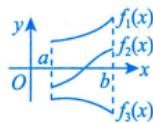

若 $f(x)$ 在 $(a,b)$ 内单调，则 $f(x) = 0$ 在 $(a,b)$ 内至多有一个根，这里区间 $(a,b)$ 可以是有限区间也可以是无穷区间.

3 罗尔定理及其推论

当不易使用零点定理时，可考虑罗尔定理及其推论（罗尔定理见“一、2.定理6”）

注 若 $f(x)$ 在区间 $I$ 上 $n$ 阶可导，且 $f^{(n)}(x) \neq 0$ ，即 $f^{(n)}(x) = 0$ 无实根（至多有 0 个根），于是 $f(x) = 0$ 至多有 $n$ 个根。如 $f^{\prime \prime}(x) \neq 0$ ，则 $f(x) = 0$ 至多 3 个根（以阶数换个数）。

证（反证法）假设 $f(x) = 0$ 在 $I$ 上至少有 $n + 1$ 个实根，此处只证明 $n + 1$ 个根时推出矛盾，其余同理，则 $f(x_{1}) = f(x_{2}) = \dots = f(x_{n + 1}) = 0$ ：

阶数上升 得个数减少

不妨设 $x_{1} < x_{2} < \dots < x_{n + 1}$ ，由罗尔定理，则 $f^{\prime}(x) = 0$ 至少有 $_n$ 个实根（每一个小区间用罗尔定理）.依次逐阶递推，则 $f''(x) = 0$ 至少有 $n - 1$ 个实根，…， $f^{(n)}(x) = 0$ 必至少有一个实根，设为 $\xi$ 即 $f^{(n)}(\xi) = 0$ ，与题干矛盾，故假设不成立，原命题得证.

事实上有更一般的结论，即罗尔原话（罗尔定理的推论）：若 $f^{(n)}(x) = 0$ 至多有 $k$ 个根，则 $f(x) = 0$ 至多有 $k + n$ 个根。如 $f^{\prime \prime}(x) = 0$ 至多一个根，则 $f^{\prime}(x) = 0$ 至多3个根。

4 实系数奇次方程至少有一个实根

注 证明任何实系数奇次方程

$$
x ^ {2 n + 1} + a _ {1} x ^ {2 n} + \dots + a _ {2 n} x + a _ {2 n + 1} = 0
$$

至少有一个实根.

证设

$$
f (x) = x ^ {2 n + 1} + a _ {1} x ^ {2 n} + \dots + a _ {2 n} x + a _ {2 n + 1},
$$

则 $\lim_{x\to +\infty}f(x) = +\infty$ ， $\lim_{x\to -\infty}f(x) = -\infty$ ，由 $f(x)$ 的连续性及推广的零点定理，知存在 $\xi \in (-\infty , + \infty)$ ，使 $f(\xi) = 0$ ，即 $f(x) = 0$ 至少有一个实根.

例6.14 在区间 $(-\infty, +\infty)$ 内，方程 $\left|x\right|^{\frac{1}{4}} + \left|x\right|^{\frac{1}{2}} - \cos x = 0$ （ ）

(A)无实根

(B)有且仅有一个实根

(C)有且仅有两个实根

(D) 有无穷多个实根

解 应选(C).

$$
\text {因} | x | ^ {\frac {1}{4}} > 1, | x | ^ {\frac {1}{2}} > 1, | x | ^ {\frac {1}{4}} + | x | ^ {\frac {1}{2}} - \cos x > 0
$$

记 $f(x) = |x|^{\frac{1}{4}} + |x|^{\frac{1}{2}} - \cos x$ ，易知 $f(x)$ 为偶函数，又因为当 $x > 1$ 时 $\begin{array}{r}f(x) > 0, \end{array}$ 故只需判断 $f(x) = 0$ 故无实根在[0,1]内有无实根即可.因为 $f(0) = -1 <   0,f(1) = 2 - \cos 1 > 0$ ，且当 $x\in (0,1)$ 时， $f^{\prime}(x) = \frac{1}{4} x^{-\frac{3}{4}}+$ 不是方程的根故只需研究 $\frac{1}{2} x^{-\frac{1}{2}} + \sin x > 0$ ，所以 $f(x) = 0$ 在 $(0, + \infty)$ 内有且仅有一个实根.故在 $(-\infty , + \infty)$ 内 $f(x) = 0$ 有且仅有两个实根.故答案选(C).对称区间上的偶函数

注此题若换元，令 $\left|x\right|^{\frac{1}{4}} = t$ ，方程变为 $t + t^2 -\cos t^4 = 0$ ，计算时看起来更“舒服”

例6.15 若 $3a^{2} - 5b < 0$ ，则方程 $x^{5} + 2ax^{3} + 3bx + 4c = 0$ （ 实系数奇次方程

(A) 无实根

(B)有唯一实根

(C)有三个不同实根

(D) 有五个不同实根

解 应选(B).

# 结论

由于 $f(x) = x^{5} + 2ax^{3} + 3bx + 4c$ 是奇次多项式，故方程 $f(x) = 0$ 至少有一个实根，令 $f^{\prime}(x) = 0$ ，可知双二次方程 $5x^{4} + 6ax^{2} + 3b = 0$ 对应于 $x^{2}$ 的判别式 $\Delta = 12(3a^{2} - 5b) < 0$ ，则方程 $f^{\prime}(x) = 0$ 无实根， $f(x)$ 单调，所以方程 $f(x) = 0$ 有唯一实根. 故答案选 (B).

$$
\text {令} t = x ^ {2} \text {, 则} 5 t ^ {2} + 6 a t + 3 b = 0, \Delta = 3 6 a ^ {2} - 6 0 b = 1 2 (3 a ^ {2} - 5 b) <   0
$$

例6.16 证明 $2^{x} - x^{2} - 1 = 0$ 有且仅有三个根.

证 ①存在性.

# 观察法

令 $f(x) = 2^{x} - x^{2} - 1 = 0$ ，显然 $x_{1} = 0, x_{2} = 1$ 为根，又 $f(2) = -1 < 0$ ， $f(5) = 2^{5} - 25 - 1 = 6 > 0$ ，则 $f(x) = 0$ 在 (2,5) 内至少有一个根，即 $f(x) = 0$ 至少有三个根.

②唯一性.

# >零点定理，不具唯一性

由 $f^{\prime}(x) = 2^{x}\cdot \ln 2 - 2x$ ， $f''(x) = 2^{x}\bullet \ln^{2}2 - 2$ ， $f^{\prime \prime}(x) = 2^{x}\bullet \ln^{3}2\neq 0$ ，知 $f(x) = 0$ 至多有三个根，即 $f(x) = 0$ 有且仅有三个根.单调性不将判断就继续求导→f（x）=0至多0个根个数→f（x）=0至多0+3=3个根

例6.17

和方程 $\mathrm{e}^x = kx$ 有且仅有一个实根，则 $k$ 的取值范围是

分析 含参方程（不等式）的讨论.题中“有且仅有一个实根”表示 $y = \frac{e^x}{x}$ 与 $y = k$ 两条曲线的交点仅有一个.

解 应填 $k = \mathrm{e}$ 或 $k < 0$ ：

方法一 直接法. 令 $F(x) = \mathrm{e}^{x} - kx$ ，则 $F^{\prime}(x) = \mathrm{e}^{x} - k$ ，当 $k < 0$ 时， $F^{\prime}(x) > 0$ ， $F(x)$ 单调增加，又 $\lim_{x\to -\infty}F(x) = -\infty$ ， $\lim_{x\to +\infty}F(x) = +\infty$ ，则 $F(x) = 0$ 有且仅有一个实根；

当 $k = 0$ 时， $F(x) = \mathrm{e}^{x}$ ， $F(x)$ 恒大于0，显然不满足；

当 $k > 0$ 时，令 $F^{\prime}(x) = 0$ ，有 $x = \ln k$ ，则当 $x\in (-\infty ,\ln k)$ 时， $F(x)$ 单调减少，当 $x\in (\ln k, + \infty)$ 时， $F(x)$ 单调增加，又 $\lim_{x\to +\infty}F(x) = +\infty$ ， $\lim_{x\to -\infty}F(x) = +\infty$ ，则当且仅当 $F(\ln k) = 0$ 时， $F(x) = 0$ 有且仅有一个实根，解得 $k = e$ ：

综上，当 $k = \mathrm{e}$ 或 $k < 0$ 时，方程 $\mathrm{e}^x = kx$ 有且仅有一个实根.

方法二 分离法. 联立方程组 $\left\{ \begin{array}{l} y = \frac{\mathrm{e}^x}{x}, \\ y = k, \end{array} \right.$ 且由例5.13，可得图6-1.

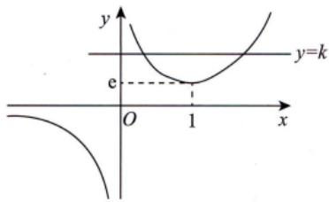  
图6-1

故当 $k = \mathrm{e}$ 或 $k < 0$ 时， $y = \frac{\mathrm{e}^x}{x}$ 与 $y = k$ 有且仅有一个交点，即方程 $\mathrm{e}^x = kx$ 有且仅有一个实根.

例6.18 已知方程 $x^{n} + nx - 1 = 0$ ，其中 $n$ 为正整数.证明此方程存在唯一正实根 $x_{n}$ ：

证 记 $f_{n}(x) = x^{n} + nx - 1$ . 当 $x > 0$ 时， $f_{n}'(x) = nx^{n-1} + n > 0$ ，故 $f_{n}(x)$ 在 $[0, +\infty)$ 上单调增加.

由于 ${f}_{n}\left( 0\right)  =  - 1 < 0,{f}_{n}\left( 1\right)  = n \geq  1$ ,根据连续函数的零点定理知方程至多有一个实根至少有一个实根 ${x}^{n} + {nx} - 1 = 0$

存在唯一正实根 $x_{n}$ ，且 $0 <   x_{n} <   1$ ：

注 新概念： $\{f_n(x)\}$ 函数列——一族函数.

$$
f _ {n} (x) = x ^ {n} + n x - 1 = 0,
$$

$$
\begin{array}{c} f _ {1} (x) = x + x - 1 = 0 \quad \Rightarrow x _ {1}, \\ f _ {2} (x) = x ^ {2} + 2 x - 1 = 0 \quad \Rightarrow x _ {2}, \\ \dots \quad \dots \\ f _ {n} (x) = x ^ {n} + n x - 1 = 0 \quad \Rightarrow x _ {n}. \end{array}
$$

解的数族

# 三 微分不等式

# 1 用函数性态（包括单调性、凹凸性和最值等）证明不等式

一般地，使用如下依据。

(1) 若有 $f^{\prime}(x) \geqslant 0, a < x < b$ ，则有 $f(a) \leqslant f(x) \leqslant f(b)$ .

★ (2) 若有 $f''(x) \geqslant 0, a < x < b$ ，则有 $f'(a) \leqslant f'(x) \leqslant f'(b)$ .

① 当 $f^{\prime}(a) > 0$ 时， $f^{\prime}(x) > 0$ ，则 $f(x)$ 单调增加；  
② 当 $f^{\prime}(b) < 0$ 时， $f^{\prime}(x) < 0$ ，则 $f(x)$ 单调减少.

当 $x_0$ 为极大值点时，即为 $I$ 内的最大值点，有 $\overline{f(x) \leqslant M}$ ★(3)设 $f(x)$ 在 $I$ 内连续，且有唯一的极值点 $x_0$ ，则 $\begin{cases} \text{当} x_0 \text{为极大值点时，即为} I \text{内的最小值点，有} \\ f(x_0) \leqslant f(x), \end{cases}$ 当 $x_0$ 为极小值点时，即为 $I$ 内的最小值点，有 $f(x) \geqslant m$

其中 $x\in I$ ：

★ (4) 若有 $f^{\prime \prime}(x) > 0, a < x < b, f(a) = f(b) = 0$ ，则有 $f(x) < 0$ .

例6.19 证明当 $0 < x < \frac{\pi}{2}$ 时，有 $\sin x > \frac{2x}{\pi}.$ $\frac{2x}{\pi} < \sin x < x$

证方法一 若证 $\sin x > \frac{2x}{\pi}$ ，即需证 $\frac{\sin x}{x} > \frac{2}{\pi}$ 令 $f(x) = \frac{\sin x}{x}, x \in \left(0, \frac{\pi}{2}\right)$ 则

主流方法：单调性

${f}^{\prime }\left( x\right)  = \frac{x\cos x - \sin x}{x}$ . 定不出正负,继续求导

分母大于0，只需研究分子

令 $g(x) = x\cos x - \sin x, x \in \left(0, \frac{\pi}{2}\right)$ ，得 $g'(x) = -x\sin x < 0$ ，则 $g(x)$ 单调递减， $g(x) < g(0) = 0$ ，所以 $g(x) < g(0) = 0$ ，即

$$
\sin x > \frac {2 x}{\pi}, x \in \left(0, \frac {\pi}{2}\right).
$$

方法二 设 $f(x) = \sin x - \frac{2x}{\pi}$ ， $x \in \left(0, \frac{\pi}{2}\right)$ ，则

凹凸性

$$
f ^ {\prime} (x) = \cos x - \frac {2}{\pi}, f ^ {\prime \prime} (x) = - \sin x <   0,
$$

所以曲线 $f(x) = \sin x - \frac{2x}{\pi}$ 在 $\left(0, \frac{\pi}{2}\right)$ 内是凸的，又 $f(0) = f\left(\frac{\pi}{2}\right) = 0$ ，所以 $f(x) = \sin x - \frac{2x}{\pi} > 0$ ，即

$$
\sin x > \frac {2 x}{\pi}, x \in \left(0, \frac {\pi}{2}\right).
$$

例6.20 证明： $\left(\ln \frac{1 + x}{x} -\frac{1}{1 + x}\right)^2 <  \frac{1}{x(1 + x)^2} (x > 0).$

证 只要证明当 $x > 0$ 时， $\left|\ln \frac{1 + x}{x} -\frac{1}{1 + x}\right| - \frac{1}{\sqrt{x}(1 + x)} < 0$ 即可.

令

$$
f (x) = \ln \frac {1 + x}{x} - \frac {1}{1 + x} = \ln (1 + x) - \ln x - \frac {1}{1 + x},
$$

则

补充中值定理结论：

令 $f(t) = \ln t$ ，则存在 $\xi \in (x, x + 1]$

$$
\begin{array}{l} f ^ {\prime} (x) = \frac {1}{1 + x} - \frac {1}{x} + \frac {1}{(1 + x) ^ {2}} \\ = \frac {(1 + x) x - (1 + x) ^ {2} + x}{x (1 + x) ^ {2}} \\ = \frac {- 1}{x (1 + x) ^ {2}} <   0, \\ \end{array}
$$

使得 $\ln (1 + x) - \ln x = \frac{1}{\xi} \cdot 1$

又因为 $\frac{1}{1 + x} <  \frac{1}{\xi} <  \frac{1}{x}$

所 $\frac{1}{1 + x} <  \ln \left(1 + \frac{1}{x}\right) <   \frac{1}{x}.$ 记住！！

又 $\lim_{x\to +\infty}f(x) = 0$ ，所以 $f(x) > 0$ ：

令

$$
g (x) = \ln \frac {1 + x}{x} - \frac {1}{1 + x} - \frac {1}{\sqrt {x} (1 + x)},
$$

则

$$
\begin{array}{l} g ^ {\prime} (x) = \frac {1}{1 + x} - \frac {1}{x} + \frac {1}{(1 + x) ^ {2}} + \frac {\frac {1}{2 \sqrt {x}} \cdot (1 + x) + \sqrt {x}}{x (1 + x) ^ {2}} \\ = \frac {- 2 \sqrt {x} + 1 + x + 2 x}{2 x ^ {\frac {3}{2}} (1 + x) ^ {2}} = \frac {1 + 3 x - 2 \sqrt {x}}{2 x ^ {\frac {3}{2}} (1 + x) ^ {2}}. \\ \end{array}
$$

为 $h(x)$ 的驻点，

① 当 $x > \frac{1}{9}$ 时， $h'(x) > 0$ ；

② 当 $x < \frac{1}{9}$ 时， $h'(x) < 0$

唯一的极小值为最小值

再令 $h(x) = 1 + 3x - 2\sqrt{x}$ ，则 $h'(x) = 3 - \frac{1}{\sqrt{x}}$ 令 $0$ ，得 $x = \frac{1}{9}$ ，为唯一极小值点，也即最小值点，且 $h_{\min} = \frac{2}{3} > 0$ ，故 $h(x) > 0$ ，于是 $g'(x) > 0$ ，即 $g(x)$ 在 $(0, +\infty)$ 上单调增加，且 $\lim_{x \to +\infty} g(x) = 0$ ，所以 $g(x) < 0$ ，证毕.

# 用常数变量化证明不等式

如果欲证的不等式中都是常数，则可以将其中一个或者几个常数变量化，再利用上面所述的导数工具去证明。

# 用中值定理证明不等式

主要用拉格朗日中值定理或者泰勒公式.

例6.21 设 $0 < a < b$ ，证明不等式

利用中值定理： $\frac{\ln b - \ln a}{b - a} = \frac{1}{\xi}$ ，其中

$$
0 <   a <   \xi <   b. \text {即} 0 <   \frac {1}{b} <   \frac {1}{\xi} <   \frac {1}{a}
$$

$$
\frac {2 a}{a ^ {2} + b ^ {2}} <   \frac {\ln b - \ln a}{b - a} <   \frac {1}{\sqrt {a b}}.
$$

证 先证右边的不等式.

设

构造辅助函数 $\varphi (x) = \ln x - \ln a - \frac{x - a}{\sqrt{ax}} (x > a > 0)$

因为

$$
\varphi^ {\prime} (x) = \frac {1}{x} - \frac {1}{\sqrt {a}} \left(\frac {1}{2 \sqrt {x}} + \frac {a}{2 x \sqrt {x}}\right) = \frac {2 \sqrt {a x} - x - a}{2 x \sqrt {a x}} = - \frac {(\sqrt {x} - \sqrt {a}) ^ {2}}{2 x \sqrt {a x}} <   0,
$$

故当 $x > a$ 时， $\varphi (x)$ 单调减少，又 $\varphi (a) = 0$ ，所以当 $x > a$ 时， $\varphi (x) <   \varphi (a) = 0$ ，即

$$
\ln x - \ln a <   \frac {x - a}{\sqrt {a x}} ,
$$

特别地，当 $x = b > a$ 时，便有

常数变量化

$$
\ln b - \ln a <   \frac {b - a}{\sqrt {a b}},
$$

即 $\frac{\ln b - \ln a}{b - a} < \frac{1}{\sqrt{ab}}.$

再证左边的不等式.

设

$$
f (x) = \ln x (x > a > 0),
$$

由拉格朗日中值定理知，至少存在一点 $\xi \in (a,b)$ ，使

$$
\frac {\ln b - \ln a}{b - a} = (\ln x) ^ {\prime} \big | _ {x = \xi} = \frac {1}{\xi}.
$$

由于 $0 < a < \xi < b$ ，且 $a^2 + b^2 > 2ab$ ，所以 $\frac{1}{\xi} > \frac{1}{b} > \frac{2a}{a^2 + b^2}$ ，从而有

$$
\frac {\ln b - \ln a}{b - a} = \frac {1}{\xi} > \frac {2 a}{a ^ {2} + b ^ {2}}.
$$

综上，不等式 $\frac{2a}{a^2 + b^2} < \frac{\ln b - \ln a}{b - a} < \frac{1}{\sqrt{ab}}$ 成立.

# 基础习题精练

# 习题

6.1 设常数 $k > 0$ ，函数 $f(x) = \ln x - \frac{x}{\mathrm{e}} + k$ 在 $(0, +\infty)$ 内的零点个数为（ ）.

(A)3

(B)2

(C)1

(D)0

6.2 若函数 $f(x) = \frac{1}{x\mathrm{e}^{-x} - a}$ 在 $(- \infty, + \infty)$ 内处处连续，则常数 $a$ 的取值范围为（ ）.

(A) $a <   0$

(B) $a > \mathrm{e}^{-1}$

(C) $a <   \mathrm{e}^{-1}$

(D) $0 < a < \mathrm{e}^{-1}$

6.3 设实数 $a_0, a_1, a_2, \dots, a_n$ 满足 $a_0 + \frac{a_1}{2} + \frac{a_2}{3} + \dots + \frac{a_n}{n + 1} = 0$ . 证明：方程

$$
a _ {0} + a _ {1} x + a _ {2} x ^ {2} + \dots + a _ {n} x ^ {n} = 0
$$

在 $(0,1)$ 内至少有一个根.

6.4 设函数 $f(x)$ 在 $[a, b]$ 上连续，在 $(a, b)$ 内可导，且 $f(a) = f(b) = 0$ ，证明：

(1) 存在 $\xi \in (a, b)$ ，使 $f(\xi) + \xi f'(\xi) = 0$ ；  
(2) 存在 $\eta \in (a, b)$ ，使 $\eta f(\eta) + f'(\eta) = 0$ 。  
6.5 设 $f(x)$ 在 $[0,1]$ 上连续，在 $(0,1)$ 内可导，证明：至少存在一点 $\xi \in (0,1)$ ，使得 $f(1) = 3\xi^2 f(\xi) + \xi^3 f'(\xi)$ .  
6.6 已知 $f(x)$ 在 $[0,1]$ 上连续，在 $(0,1)$ 内可导，且 $f(0) = 0$ ， $f(1) = 1$ 。证明：  
(1) 存在 $\xi \in (0, 1)$ ，使得 $f(\xi) = 1 - \xi$ ；  
(2) 存在 $\eta, \tau \in (0,1), \eta \neq \tau$ ，使得 $f'(\eta)f'(\tau) = 1$ 。  
6.7 设函数 $f(x)$ 在 $[a, b]$ 上连续 $(0 < a < b)$ ，在 $(a, b)$ 内可导，且 $f(a) \neq f(b)$ . 证明：存在 $\xi, \eta \in (a, b)$ ，使得 $\frac{f'(\xi)}{2\xi} = \frac{f'(\eta)}{b + a}$ .  
6.8 设 $f(x)$ 在 $[0,1]$ 上具有二阶导数，且满足条件 $|f(x)| \leqslant a, |f''(x)| \leqslant b$ ，其中 $a, b$ 都是非负常数， $c$ 是 $(0,1)$ 内任意一点。  
(1) 写出 $f(x)$ 在点 $x = c$ 处带拉格朗日型余项的一阶泰勒公式；  
(2) 证明 $\left| f'(x) \right| \leqslant 2a + \frac{b}{2}$ .

6.9 证明 $0 < x < \frac{\pi}{4}$ 时，有 $\tan x < \frac{4}{\pi} x$   
6.10 设 $p, q$ 是大于 1 的常数，并且 $\frac{1}{p} + \frac{1}{q} = 1$ 。证明：对于任意的 $x > 0$ ，有 $\frac{1}{p} x^p + \frac{1}{q} \geqslant x$ 。

# 解答

6.1 (B) 解 易知 $f'(x) = \frac{1}{x} - \frac{1}{e}$ . 当 $x > e$ 时， $f'(x) < 0$ ；当 $0 < x < e$ 时， $f'(x) > 0$ ，故在 $(0, e)$ 和 $(e, +\infty)$ 内 $f(x)$ 分别至多有一个零点，又 $f(e) = k > 0$ ， $\lim_{x \to 0^+} f(x) = -\infty$ ， $\lim_{x \to +\infty} f(x) = -\infty$ ，所以 $f(x)$ 在 $(0, +\infty)$ 内有两个零点。故答案选 (B)。  
6.2 (B) 解 令 $g(x) = x \mathrm{e}^{-x} - a$ ，则函数 $f(x) = \frac{1}{x \mathrm{e}^{-x} - a}$ 在 $(- \infty, + \infty)$ 内处处连续等价于函数 $g(x)$ 在 $(- \infty, + \infty)$ 内没有零点。

$$
g ^ {\prime} (x) = \mathrm {e} ^ {- x} (1 - x),
$$

令 $g^{\prime}(x) = 0$ ，得 $x = 1$ .因为当 $x <   1$ 时， $g^{\prime}(x) > 0,g(x)$ 单调增加，当 $x > 1$ 时， $g^{\prime}(x) <   0,g(x)$ 单调减少，所以 $\max \{g(x)\} = g(1) = \mathrm{e}^{-1} - a$ .又 $\lim_{x\to -\infty}g(x) = \lim_{x\to -\infty}(xe^{-x} - a) = -\infty ,\lim_{x\to +\infty}g(x) = \lim_{x\to +\infty}(xe^{-x} - a) = -a$ ，故当 $\max \{g(x)\} = \mathrm{e}^{-1} - a <   0$ 时，即当 $a > \mathrm{e}^{-1}$ 时，函数 $g(x)$ 没有零点.此时，函数 $f(x)$ 在 $(-\infty , + \infty)$ 内处处连续.

6.3 证明 令 $F(x) = a_{0}x + \frac{a_{1}}{2} x^{2} + \frac{a_{2}}{3} x^{3} + \dots +\frac{a_{n}}{n + 1} x^{n + 1},0\leqslant x\leqslant 1$ ，显然 $F(0) = 0$ ，且

$$
F (1) = a _ {0} + \frac {a _ {1}}{2} + \frac {a _ {2}}{3} + \dots + \frac {a _ {n}}{n + 1} = 0,
$$

故由罗尔定理知，存在 $\xi \in (0,1)$ ，使 $F'(\xi) = 0$ ，即 $a_0 + a_1\xi + a_2\xi^2 + \dots + a_n\xi^n = 0$ ，故所证方程在 $(0,1)$ 内至少有一个根.

6.4 证明 (1) 设 $\varphi(x) = xf(x)$ ，则 $\varphi(x)$ 在 $[a, b]$ 上连续，在 $(a, b)$ 内可导，且 $\varphi(a) = \varphi(b) = 0$ ，由罗尔定理得，存在 $\xi \in (a, b)$ ，使 $\varphi'(\xi) = 0$ ，即 $f(\xi) + \xi f'(\xi) = 0$ 。

(2) 设 $F(x) = \mathrm{e}^{\frac{x^2}{2}} f(x)$ ，则 $F(x)$ 在 $[a, b]$ 上连续，在 $(a, b)$ 内可导，且 $F(a) = F(b) = 0$ ，由罗尔定理得，存在 $\eta \in (a, b)$ ，使 $F'(\eta) = \mathrm{e}^{\frac{\eta^2}{2}} f'(\eta) + \mathrm{e}^{\frac{\eta^2}{2}} \cdot \eta \cdot f(\eta) = 0$ ，由于 $\mathrm{e}^{\frac{\eta^2}{2}} \neq 0$ ，则有 $\eta f(\eta) + f'(\eta) = 0$ 。

6.5 证明 注意到 $3x^{2}f(x) + x^{3}f^{\prime}(x)$ 是 $x^{3}f(x)$ 的导函数，故令 $F(x) = x^{3}f(x)$ ，易知 $F(x)$ 在 $[0,1]$ 上连续，在 $(0,1)$ 内可导，即 $F(x)$ 在 $[0,1]$ 上满足拉格朗日中值定理的条件，于是得

$$
F (1) - F (0) = F ^ {\prime} (\xi), \xi \in (0, 1),
$$

即

$$
f (1) = 3 \xi^ {2} f (\xi) + \xi^ {3} f ^ {\prime} (\xi).
$$

6.6 证明 (1) 令 $F(x) = f(x) - 1 + x$ ，可得 $\left\{ \begin{array}{l} F(0) = f(0) - 1 + 0 = -1 < 0, \\ F(1) = f(1) - 1 + 1 = 1 > 0, \end{array} \right.$ 由零点定理可知，存在 $\xi \in (0,1)$ ，使得 $F(\xi) = 0$ ，即 $f(\xi) = 1 - \xi$ .

(2)用 $\xi$ 将[0，1]划分为[0， $\xi ],[\xi ,1]$ ，再用拉格朗日中值定理有

$$
f (\xi) - f (0) = f ^ {\prime} (\eta) (\xi - 0), \eta \in (0, \xi),
$$

$$
f (1) - f (\xi) = f ^ {\prime} (\tau) (1 - \xi), \tau \in (\xi , 1),
$$

则 $f^{\prime}(\eta) = \frac{f(\xi) - f(0)}{\xi} = \frac{1 - \xi}{\xi},f^{\prime}(\tau) = \frac{f(1) - f(\xi)}{1 - \xi} = \frac{\xi}{1 - \xi}.$

故 $f^{\prime}(\eta)f^{\prime}(\tau) = 1$

6.7 证明 对 $f(x)$ 在 $[a, b]$ 上应用拉格朗日中值定理，则

$$
f (b) - f (a) = f ^ {\prime} (\eta) (b - a), \eta \in (a, b),
$$

对 $f(x),x^{2}$ 在 $[a,b]$ 上应用柯西中值定理，则

$$
\frac {f (b) - f (a)}{b ^ {2} - a ^ {2}} = \frac {f ^ {\prime} (\xi)}{2 \xi}, \xi \in (a, b),
$$

所以 $f(b) - f(a) = \frac{f'(\xi)}{2\xi} (b^2 -a^2)$ ，则

$$
f ^ {\prime} (\eta) (b - a) = \frac {f ^ {\prime} (\xi)}{2 \xi} (b ^ {2} - a ^ {2}),
$$

即 $\frac{f'(\xi)}{2\xi} = \frac{f'(\eta)}{b + a}$

6.8 (1) 解 $f(x) = f(c) + f'(c)(x - c) + \frac{f''(\xi)}{2!} (x - c)^2$ ，其中 $\xi = c + \theta (x - c), 0 < \theta < 1$ .

(2)证明 在以上一阶泰勒公式中，分别令 $x = 0$ 和 $x = 1$ ，则有

$$
f (0) = f (c) - f ^ {\prime} (c) c + \frac {f ^ {\prime \prime} (\xi_ {1})}{2 !} c ^ {2}, 0 <   \xi_ {1} <   c <   1,
$$

$$
f (1) = f (c) + f ^ {\prime} (c) (1 - c) + \frac {f ^ {\prime \prime} (\xi_ {2})}{2 !} (1 - c) ^ {2}, 0 <   c <   \xi_ {2} <   1,
$$

两式相减得 $f(1) - f(0) = f'(c) + \frac{1}{2!} [f''(\xi_2)(1 - c)^2 - f''(\xi_1)c^2],$

于是 $\left|f^{\prime}(c)\right|\leqslant \left|f(1)\right| + \left|f(0)\right| + \frac{1}{2}\left|f^{\prime \prime}(\xi_2)\right|(1 - c)^2 +\frac{1}{2}\left|f^{\prime \prime}(\xi_1)\right|c^2\leqslant a + a + \frac{b}{2} [(1 - c)^2 +c^2 ],$

又因 $c\in (0,1),(1 - c)^2 +c^2\leqslant 1$ ，故 $\left|f^{\prime}(c)\right|\leqslant 2a + \frac{b}{2}$

又 $f(0) = f(1) + f'(1)(0 - 1) + \frac{f''(\xi_3)}{2!} (0 - 1)^2, 0 < \xi_3 < 1,$

$$
f (1) = f (0) + f ^ {\prime} (0) (1 - 0) + \frac {f ^ {\prime \prime} (\xi_ {4})}{2 !} (1 - 0) ^ {2}, 0 <   \xi_ {4} <   1,
$$

故 $\left|f^{\prime}(0)\right|\leqslant \left|f(1)\right| + \left|f(0)\right| + \frac{1}{2}\left|f^{\prime \prime}(\xi_4)\right|\leqslant 2a + \frac{b}{2},$

$$
\left| f ^ {\prime} (1) \right| \leqslant \left| f (1) \right| + \left| f (0) \right| + \frac {1}{2} \left| f ^ {\prime \prime} (\xi_ {3}) \right| \leqslant 2 a + \frac {b}{2}.
$$

综上所述， $\left|f^{\prime}(x)\right|\leqslant 2a + \frac{b}{2}.$

6.9 证明 设 $f(x) = \tan x - \frac{4}{\pi} x, x \in \left(0, \frac{\pi}{4}\right)$ ，则

$$
f ^ {\prime} (x) = \sec^ {2} x - \frac {4}{\pi}, f ^ {\prime \prime} (x) = 2 \sec^ {2} x \tan x > 0,
$$

所以曲线 $f(x) = \tan x - \frac{4}{\pi} x$ 在 $\left(0, \frac{\pi}{4}\right)$ 内是凹的. 又 $f(0) = f\left(\frac{\pi}{4}\right) = 0$ ，所以 $f(x) = \tan x - \frac{4}{\pi} x < 0$ ，即

$$
\tan x <   \frac {4}{\pi} x, x \in \left(0, \frac {\pi}{4}\right).
$$

6.10 证明 令 $f(x) = \frac{1}{p} x^p + \frac{1}{q} - x$ ，则

$$
f ^ {\prime} (x) = x ^ {p - 1} - 1, f ^ {\prime \prime} (x) = (p - 1) x ^ {p - 2}.
$$

令 $f^{\prime}(x) = 0$ ，得唯一驻点 $x = 1$ 。由 $f^{\prime \prime}(1) = p - 1 > 0$ ，知当 $x = 1$ 时， $f(x)$ 取极小值，即最小值，从而当 $x > 0$ 时，有 $f(x) \geqslant f(1) = 0$ ，即

$$
\frac {1}{p} x ^ {p} + \frac {1}{q} \geqslant x.
$$

# 第7讲

# 一元函数微分学的应用（三）物理应用与经济应用

强调：用数学工具解决应用问题，不会出现过于专业的问题

<table><tr><td>考题</td><td>物理应用与相关变化率（仅数学一、数学二）、复利与连续复利（仅数学三）、导数的经济应用（仅数学三）</td></tr><tr><td>题型</td><td>选择题、填空题、解答题</td></tr><tr><td>目标</td><td>①了解导数的物理意义，会用导数描述一些物理量（仅数学一、数学二）；
②了解导数的经济意义（含边际与弹性的概念）（仅数学三）</td></tr><tr><td>重难点</td><td>相关变化率（仅数学一、数学二）</td></tr></table>

# 基础知识结构

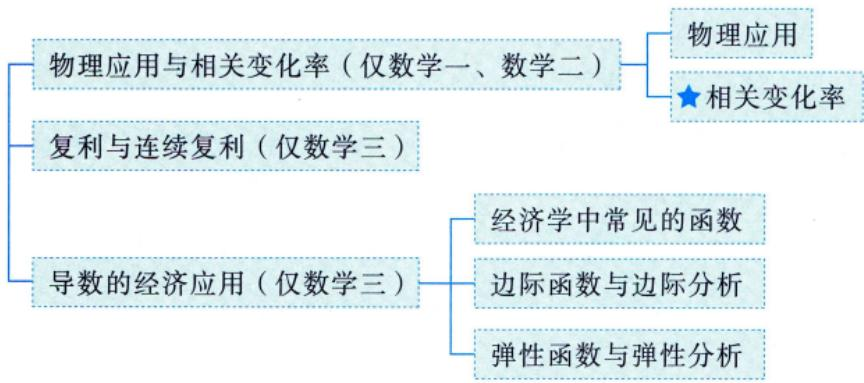

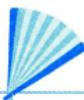

# 基础内容精讲

# 物理应用与相关变化率（仅数学一、数学二）

# 物理应用

相关物理概念：①位移对时间的变化率（速度）；

② 速度对时间的变化率（加速度）；  
③ 牛顿第二定律 $\left( {F = {ma}}\right)$ .

已知质点运动的位移 $s$ 关于时间 $t$ 的函数为 $s = s(t)$ ，称它为质点的运动方程（位移方程），则其速度为

$$
v (t) = \lim  _ {\Delta t \rightarrow 0} \frac {\Delta s}{\Delta t} = s ^ {\prime} (t), \quad v (t) = \frac {\mathrm {d} s}{\mathrm {d} t}
$$

其加速度为

$a(t) = \frac{\mathrm{d}\nu}{\mathrm{d}t} = \frac{\mathrm{d}\nu}{\mathrm{d}s}\cdot \frac{\mathrm{d}s}{\mathrm{d}t}\left(\text{或} a(t) = \frac{\mathrm{d}\left(\frac{\mathrm{d}s}{\mathrm{d}t}\right)}{\mathrm{d}t} = \frac{\mathrm{d}^2s}{\mathrm{d}t^2}\right)$ $a(t) = \lim_{\Delta t\to 0}\frac{\Delta\nu}{\Delta t} = \nu '(t) = s''(t).$ $\frac{\mathrm{d}\nu}{\mathrm{d}s}\cdot \nu$ （更利于解决含s，不涉及t的相关微分方程问题，第15讲再学习）

这就是导数的物理意义.

# 相关变化率

研究 $\frac{\mathrm{d}A}{\mathrm{d}B} = \frac{\mathrm{d}A}{\mathrm{d}C}\cdot \frac{\mathrm{d}C}{\mathrm{d}B}$

① 若已知 $\frac{\mathrm{d}A}{\mathrm{d}B}$ , $\frac{\mathrm{d}C}{\mathrm{d}B}$ , 则 $\frac{\mathrm{d}A}{\mathrm{d}C} = \frac{\frac{\mathrm{d}A}{\mathrm{d}B}}{\frac{\mathrm{d}C}{\mathrm{d}B}}$ （通过已知求未知）；  
② 该等式建立了 $\frac{\mathrm{d}A}{\mathrm{d}B}$ 与 $\frac{\mathrm{d}C}{\mathrm{d}B}$ 的关系， $A$ ， $B$ ， $C$ 可以扩展为很多实际的量，比如某冰块质量（ $m$ ）对温度（ $c$ ）随时间（ $t$ ）的变化率

$$
\frac {\mathrm {d} m}{\mathrm {d} t} = \frac {\mathrm {d} m}{\mathrm {d} c} \cdot \frac {\mathrm {d} c}{\mathrm {d} t} \Rightarrow \frac {\mathrm {d} m}{\mathrm {d} c} = \frac {\frac {\mathrm {d} m}{\mathrm {d} t}}{\frac {\mathrm {d} c}{\mathrm {d} t}}.
$$

注 微分学中经济应用较多，积分学中物理应用较多.

$f^{\prime}(x)$ 已知，若告知 $\frac{\mathrm{d}x}{\mathrm{d}t}$ 则 $\frac{\mathrm{d}y}{\mathrm{d}t}$ 便可求. 若函数 $y = f(x)$ 由参数方程 $\left\{ \begin{array}{l} x = x(t), \\ y = y(t) \end{array} \right.$ 确定且可导，则 $\frac{\mathrm{d}y}{\mathrm{d}t} = \frac{\mathrm{d}y}{\mathrm{d}x} \cdot \frac{\mathrm{d}x}{\mathrm{d}t} = f'(x) \frac{\mathrm{d}x}{\mathrm{d}t}$ ，上式中， $\frac{\mathrm{d}y}{\mathrm{d}t}$ 与 $\frac{\mathrm{d}x}{\mathrm{d}t}$ 由 $f^{\prime}(x)$ 联系在一起，这种相互关联的变化率称为相关变化率。

注单独出题不难，常见的是速度、位移、加速度与相关变化率的综合题，难度在于和微分方程相结合.

例7.1 已知动点 $P$ 在曲线 $y = x^3$ 上运动，记坐标原点与点 $P$ 间的距离为 $l$ 。若点 $P$ 的横坐标对时间的变化率为常数 $\nu_0$ ，则当点 $P$ 运动到点 $(1,1)$ 时， $l$ 对时间的变化率是

解 应填 $2\sqrt{2} v_{0}$

由题设知 $l = \sqrt{x^2 + y^2} = \sqrt{x^2 + x^6}$ ，则

$$
\frac {\mathrm {d} l}{\mathrm {d} t} = \boxed {\frac {\mathrm {d} l}{\mathrm {d} x}} \cdot \boxed {\frac {\mathrm {d} x}{\mathrm {d} t}} = \frac {2 x + 6 x ^ {5}}{2 \sqrt {x ^ {2} + x ^ {6}}} \cdot v _ {0},
$$

$$
\left. \frac {\mathrm {d} l}{\mathrm {d} t} \right| _ {x = 1} = \frac {8}{2 \sqrt {2}} v _ {0} = 2 \sqrt {2} v _ {0}.
$$

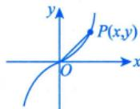

方法总结 涉及相关变化率问题： $①$ 建立相关变量方程； $②$ 求导找出相关变化率，进而通过已知变化率求未知变化率.

注 更为综合的物理应用会涉及微分方程，将在第15讲学习.

# 二 复利与连续复利（仅数学三）

复利计算公式为

$$
A _ {m} = A (1 + r) ^ {m}, \xrightarrow [ m \text {个} ]{A (1 + r) (1 + r) \dots (1 + r)}
$$

其中 $A$ 表示一开始的本金， $r$ 表示每一期的利率， $m$ 表示复利的总期数， $A_{m}$ 表示 $m$ 期后的余额.

① 如果年利率为 $r$ 的利息一年支付 1 次，那么当初始存款为 $A$ 元时， $t$ 年后余额 $A_{t}$ 则为

$$
A _ {t} = A (1 + r) ^ {t}.
$$

② 如果年利率为 $r$ 的利息一年支付 $n$ 次，那么当初始存款为 $A$ 元时， $t$ 年后余额 $A_{t}$ 则为

$$
A _ {t} = A \left(1 + \frac {r}{n}\right) ^ {n t} \xrightarrow [ n \text {个} ]{A} A \underbrace {\left[ \left(1 + \frac {r}{n}\right) \cdots \left(1 + \frac {r}{n}\right) \right] \left[ \left(1 + \frac {r}{n}\right) \cdots \left(1 + \frac {r}{n}\right) \right] \cdots \left[ \left(1 + \frac {r}{n}\right) \cdots \left(1 + \frac {r}{n}\right) \right]}
$$

记 $A\mathrm{e}^{n} = R\Rightarrow A = R\mathrm{e}^{-r}$ 规值 ③对于 $②$ ，当 $\lim_{n\to \infty}A_t = \lim_{n\to \infty}A\left(1 + \frac{r}{n}\right)^{nt} = Ae^{rt}$ ，这称为连续复利.→掌握至此即可，无须深入学习支付无数次

注 考试时要弄清楚①，②，③三种情况，题目会明确告知。

例7.2 设某酒厂有一批新酿的好酒，如果现在（假定 $t = 0$ ）就售出，总收入为 $R_0$ 元；如果窖藏起来，待来日按陈酒价格出售， $t$ 年末总收入为 $R = R_0 \mathrm{e}^{\frac{2}{5} \sqrt{t}}$ 。假定银行的年利率 $r$ 为 $6\%$ ，并以连续复

利计息，若 $t_0$ 年售出可使总收入的现值最大，则客藏的时间 $t_0 =$

$\mathcal{P}$ 分析 碰到应用题，找到关系式、定义式、约束式，先写定义式（现值），再代入关系式 $R = R_{0} \mathrm{e}^{\frac{2}{5}\sqrt{t}}$ ，最后按照一元函数求最值的方法，找到驻点即为所求.

解 应填11.

根据连续复利公式，这批酒在窖藏 $t$ 年末售出时总收入 $R$ 的现值为 $A(t) = Re^{-rt}$ ，而 $R = R_0e^{\frac{2}{3}\sqrt{t}}$ 故 $A(t) = R_0\mathrm{e}^{\frac{2}{5}\sqrt{t} -rt}$ . 令 $\frac{\mathrm{d}A}{\mathrm{d}t} = R_0\mathrm{e}^{\frac{2}{5}\sqrt{t} -rt}\left(\frac{1}{5\sqrt{t}} -r\right) = 0$ ，得驻点 $t_0 = \frac{1}{25r^2}$ . 当 $0 < t_0 < \frac{1}{25r^2}$ 时， $\frac{\mathrm{d}A}{\mathrm{d}t} > 0$ ；当 $t_0 > \frac{1}{25r^2}$ 时， $\frac{\mathrm{d}A}{\mathrm{d}t} < 0$ 元连续函数中唯一极值点就是最值点于是， $t_0 = \frac{1}{25r^2}$ 是极大值点亦是最大值点，故窖藏 $t_0 = \frac{1}{25r^2}$ 年售出可使总收入的现值最大. 当约束式 $r = 6\%$ 时， $t_0 = \frac{100}{9} \approx 11$ （年）

方法总结 用好定义式与关系式，利用求导工具找最值即可。

# 三 导数的经济应用（仅数学三）

# 经济学中常见的函数

需求：欲望与能力的统一价格增加 购买力下降

(1)需求函数.

设某产品的需求量为 $Q$ ，价格为 $p$ ，则 $Q = Q(p)$ 称为需求函数，且 $Q$ 一般为单调减少函数.

(2)供给函数.

设某产品的供给量为 $q$ ，价格为 $p$ ，则 $q = q(p)$ 称为供给函数，且 $q$ 一般为单调增加函数.

(3) 成本函数.

设生产产品的总投入为 $C$ ，它由固定成本 $C_1$ （常量）和可变成本 $C_2(Q)$ 两部分组成，其中 $Q$ 表示产量. 成本函数为 $C = C(Q) = C_1 + C_2(Q)$ ，称 $\frac{C}{Q}$ 为平均成本，记为 $\overline{C}$ 或 $AC$ ，即

$$
A C = \overline {{C}} = \frac {C}{Q} = \frac {C _ {1}}{Q} + \frac {C _ {2} (Q)}{Q}.
$$

(4) 收益（入）函数.

设产品售出后所得的收益为 $R$ ，则

$$
R = R (Q) = p Q,
$$

其中 $p$ 是价格， $Q$ 是销售量.

# (5) 利润函数.

设收益扣除成本后的利润为 $L$ ，则

$$
L = L (Q) = R (Q) - C (Q),
$$

其中 $Q$ 为销售量.

注如无特殊情况说明，需求与供给函数以价格 $p$ 为自变量，成本、收益与利润函数以产量 $Q$ 为自变量.

# 2 边际函数与边际分析

在经济学中，若函数 $f(x)$ 可导，则称 $f^{\prime}(x)$ 为 $f(x)$ 的边际函数。 $f^{\prime}(x_0)$ 称为 $f(x)$ 在 $x_0$ 点的边际值。用边际函数来分析经济量的变化叫边际分析。

由 $\Delta y\approx \mathrm{dy}$ ，即 $f(x_0 + \Delta x) - f(x_0)\approx f'(x_0)\Delta x$ ，取 $\Delta x = 1$ ，得 $f(x_{0} + 1) - f(x_{0})\approx f^{\prime}(x_{0})$

于是，边际值 $f^{\prime}(x_0)$ 被解释为：在 $x_0$ 点，当 $x$ 改变一个单位时，函数 $f(x)$ 近似（在实际问题中，经常略去“近似”二字）改变 $|f'(x_0)|$ 个单位。 $f^{\prime}(x_0)$ 的符号反映自变量的改变与因变量的改变是同向还是

反向.

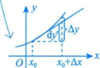

$\int f^{\prime}(x_0) > 0 \stackrel{<}{=} 0$ 同向改变，

$\left|f^{\prime}(x_0) < 0\right\rangle$ 反向改变

(1) 边际成本.

设总成本函数为 $C = C(Q)(Q$ 为产量），则边际成本函数（记为 $MC$ ）为 $MC = C'(Q)$

(2) 边际收益.

设总收益函数为 $R = R(Q)(Q$ 为销售量），则边际收益函数（记为MR）为 $MR = R^{\prime}(Q)$

(3) 边际利润.

设利润函数为 $L = L(Q)(Q$ 为销售量），则边际利润函数（记为 $ML$ ）为 $ML = L^{\prime}(Q)$

# 弹性函数与弹性分析

在经济学中，把因变量对自变量变化的反应的灵敏度，称为弹性或弹性系数。设函数 $y = f(x)$ 可导，称

$$
\eta = \lim  _ {\Delta x \rightarrow 0} \frac {\Delta y}{y} / \frac {\Delta x}{x} = \frac {x}{y} y ^ {\prime} = \frac {x}{f (x)} f ^ {\prime} (x) = \frac {E y}{E x}
$$

为函数 $y = f(x)$ 的弹性函数，称

$$
\eta \left| _ {x = x _ {0}} = \frac {x _ {0}}{f (x _ {0})} f ^ {\prime} (x _ {0}) \right.
$$

为函数 $f(x)$ 在 $x_0$ 处的（点）弹性.

$\eta \left| {x = {x}_{0}}\right.$ 表示在 ${x}_{0}$ 处,当自变量 $x$ 改变 1% 时,因变量 $y$ 将改变 $\left| \eta \right| \mathop{\sum }\limits_{{x = {x}_{0}}}1\%  = \left| \frac{{x}_{0}}{f\left( {x}_{0}\right) }{f}^{\prime }\left( {x}_{0}\right) \right| \%$ ,其符号反 映自变量 $x$ 与因变量 $y$ 的改变是同向还是反向. 取 $\eta  = {0.54} = \frac{0.54\% }{1\% } \rightarrow$ 因变量改变 ${0.54}\%$ 用弹性函数来分析经济量的变化叫弹性分析. 自变量改变 $1\%$

(1)需求的价格弹性.

$$
\eta_ {d} = \frac {E Q}{E p} = \frac {p}{Q} \frac {\mathrm {d} Q}{\mathrm {d} p} = \frac {p}{Q (p)} Q ^ {\prime} (p).
$$

一般地，需求函数单调减少，故 $Q^{\prime}(p) < 0$ ，从而 $\eta_d < 0$ ：

其经济意义：当价格为 $p$ 时，若提价（降价） $1\%$ ，则需求量将减少（增加） $\left|\eta_{d}\right|\%$

注 若题设要求 $\eta_{d} > 0$ ，则取 $\eta_{d} = -\frac{p}{Q(p)} Q^{\prime}(p)$

(2)供给的价格弹性.

$$
\eta_ {s} = \frac {E q}{E p} = \frac {p}{q} \frac {\mathrm {d} q}{\mathrm {d} p} = \frac {p}{q (p)} q ^ {\prime} (p).
$$

一般地，供给函数单调增加，故 $q^{\prime}(p) > 0$ ，从而 $\eta_s > 0$ ：

其经济意义：当价格为 $p$ 时，若提价（降价） $1\%$ ，则供给量将增加（减少） $\eta_{s}\%$

(3) 收益的价格弹性.

$$
\eta_ {r} = \frac {E R}{E p} = \frac {p}{R} \frac {\mathrm {d} R}{\mathrm {d} p} = \frac {p}{R (p)} R ^ {\prime} (p).
$$

一般地，收益函数单调增加，故 $R^{\prime}(p) > 0$ ，从而 $\eta_r > 0$ ：

其经济意义：当价格为 $p$ 时，若提价（降价） $1\%$ ，则收益将增加（减少） $\eta_r\%$ ：

例7.3 设生产某商品的固定成本为60000元，可变成本为20元/件，价格函数为 $p = 60 - \frac{Q}{1000}$ （ $p$ 是单价，单位：元； $Q$ 是销量，单位：件）。已知产销平衡，求：

(1) 该商品的边际利润函数；  
(2)当 $p = 50$ 元时的边际利润，并解释其经济意义； $\longrightarrow$ 数学三的热门考点  
(3) 使得利润最大的单价 $p$ .

分析 ① 先写利润函数，再对 $Q$ 求偏导数得到边际利润；

②代入价格函数求 $Q$ ，再代入 $L^{\prime}(Q)$   
③令 $L^{\prime}(Q) = 0$ ，解出 $Q$ 再代入价格函数，求 $p$

解 (1) 成本函数 $C(Q) = 60000 + 20Q$ ，收益函数 $R(Q) = pQ = 60Q - \frac{Q^2}{1000}$ ，利润函数

$$
L (Q) = R (Q) - C (Q) = - \frac {Q ^ {2}}{1 0 0 0} + 4 0 Q - 6 0 0 0 0,
$$

故该商品的边际利润函数 $L^{\prime}(Q) = -\frac{Q}{500} + 40$ .

(2)当 $p = 50$ 元时，销量 $Q = 10000$ 件， $L^{\prime}(10000) = 20$ 元.

其经济意义：销售第10001件商品所得利润为20元.

(3) 令 $L^{\prime}(Q) = -\frac{Q}{500} + 40 = 0$ ，得 $Q = 20000$ 件，且 $L^{\prime \prime}(20000) < 0$ ，故当 $Q = 20000$ 件时利润最大，此时 $p = 40$ 元.

例7.4 设某商品需求量 $Q$ 是价格 $p$ 的单调减少函数： $Q = Q(p)$ ，其中需求弹性 $\eta = \frac{2p^2}{192 - p^2} > 0$ ：

(1) 设 $R = R(p)$ 为总收益函数, 证明 $\frac{\mathrm{d}R}{\mathrm{d}p} = Q(1 - \eta)$ ; 作为结论用已说明, 若无说明, 则以 $Q$ 为自变量

(2)当 $p = 6$ 时，求总收益对价格的弹性，并说明其经济意义.

分析 ① 写出 $R(p)$ ，再对 $p$ 求导，代入 $\eta$ 即可；

② 写出 $\frac{ER}{Ep}$ ，代入 $\eta = \frac{2p^2}{192 - p^2}$ 即可.

(1)证 由题设得 $R(p) = pQ(p)$ , 两边对 $p$ 求导, 得 $\eta = -\frac{p}{Q}\frac{\mathrm{d}Q}{\mathrm{d}p}$ .

$$
\frac {\mathrm {d} R}{\mathrm {d} p} = Q + p \frac {\mathrm {d} Q}{\mathrm {d} p} = Q \left(1 + \boxed {P} \frac {\mathrm {d} Q}{\mathrm {d} p}\right) = Q (1 - \eta).
$$

(2) 解 $\frac{ER}{Ep} = \frac{p}{R}\frac{\mathrm{d}R}{\mathrm{d}p} = \frac{p}{pQ} Q(1 - \eta) = 1 - \eta = 1 - \frac{2p^2}{192 - p^2} = \frac{192 - 3p^2}{192 - p^2}$ .

$$
\left. \frac {E R}{E p} \right| _ {p = 6} = \frac {1 9 2 - 3 \times 6 ^ {2}}{1 9 2 - 6 ^ {2}} = \frac {7}{1 3} \approx 0. 5 4.
$$

其经济意义：当 $p = 6$ 时，若价格上涨 $1\%$ ，则总收益将增加 $0.54\%$

例7.5 设某商品需求量 $Q$ 对价格 $P$ 的弹性为 $\eta (\eta >0)$ ， $R$ 为收益，则（

(A)当 $\eta < 1$ ， $\Delta P > 0$ 时， $\Delta R > 0$   
(B)当 $\eta < 1$ ， $\Delta P <   0$ 时， $\Delta R > 0$   
(C)当 $\eta >1$ ， $\Delta P > 0$ 时， $\Delta R > 0$   
(D)当 $\eta >1$ ， $\Delta P <   0$ 时， $\Delta R <   0$

$\boxed{ \begin{array}{rl} \end{array} }$ 分析 利用结论 $\frac{\mathrm{d}R}{\mathrm{d}P} = Q(1 - \eta)$ 进行分析.

解 应选(A).

$$
\frac {\mathrm {d} R}{\mathrm {d} P} = \frac {\mathrm {d} (P Q)}{\mathrm {d} P} = Q + P \frac {\mathrm {d} Q}{\mathrm {d} P} = Q + Q \cdot \frac {P}{Q} \frac {\mathrm {d} Q}{\mathrm {d} P} = Q (1 - \eta).
$$

当 $\eta < 1$ 时， $\frac{\mathrm{d}R}{\mathrm{d}P} > 0$ ，即 $\Delta P_{(<0)} > 0$ 时， $\Delta R_{(<0)} > 0$ 。

当 $\eta > 1$ 时， $\frac{\mathrm{d}R}{\mathrm{d}P} < 0$ ，即 $\Delta P > 0$ 时， $\Delta R < 0$ 。故选 (A)。

# 基础习题精练

# 习题

7.1（仅数学一、数学二）质点 $P$ 沿抛物线 $x = y^{2}(y > 0)$ 移动， $P$ 的横坐标 $x$ 对时间的变化率为 $5\mathrm{cm / s}$ . 当 $x = 9$ 时，点 $P$ 到原点 $O$ 的距离对时间的变化率为  
7.2（仅数学三）设某产品的需求函数为 $Q = Q(P)$ ，需求的价格弹性为 $\varepsilon$ ， $0 < \varepsilon < 1$ .已知产品收益 $R$ 对价格的边际为 $s$ ，且产销平衡，则产品的产量应是 （用 $\varepsilon ,s$ 的函数表示）.  
7.3（仅数学一、数学二）甲车以 $24\mathrm{km / h}$ 的速度向北行驶，同时正东 $10\mathrm{km}$ 处乙车以 $20\mathrm{km / h}$ 的速度向东行驶。从这一时刻起经过1小时后，求两车间的距离对时间的变化率。  
7.4（仅数学三）已知某企业的总收入函数为 $R = 26x - 2x^2 - 4x^3$ ，总成本函数为 $C = 8x + x^2$ ，其中 $x$ 表示产品的产量，求利润函数、边际收入函数、边际成本函数以及企业获得最大利润时的产量和最大利润。

# 解答

7.1 $\frac{95}{6\sqrt{10}}\mathrm{cm / s}$ 解点 $P$ 到原点 $o$ 的距离 $s = \sqrt{x^2 + y^2}$ ，于是

$$
\frac {\mathrm {d} s}{\mathrm {d} t} = \frac {\mathrm {d}}{\mathrm {d} t} \sqrt {x ^ {2} + y ^ {2}} = \frac {\mathrm {d}}{\mathrm {d} x} \sqrt {x ^ {2} + x} \cdot \frac {\mathrm {d} x}{\mathrm {d} t} = \frac {5 (2 x + 1)}{2 \sqrt {x ^ {2} + x}},
$$

当 $x = 9$ 时， $\frac{\mathrm{d}}{\mathrm{d}t}\sqrt{x^2 + y^2}\bigg|_{x = 9} = \frac{5(2x + 1)}{2\sqrt{x^2 + x}}\bigg|_{x = 9} = \frac{95}{6\sqrt{10}} (\mathrm{cm / s})$

7.2 $\frac{s}{1 - \varepsilon}$ 解 需求的价格弹性为 $-\frac{Q'}{Q} P$ ，其中 $Q$ 为需求量，即产量， $P$ 为价格。依题意，

$-\frac{Q^{\prime}}{Q} P = \varepsilon$ ，即

$$
P Q ^ {\prime} = - \varepsilon Q.
$$

收益函数 $R = PQ$ ，它对价格的边际为 $\frac{\mathrm{d}R}{\mathrm{d}P}$ ，由题意，

$$
s = \frac {\mathrm {d} R}{\mathrm {d} P} = Q + P Q ^ {\prime} = (1 - \varepsilon) Q,
$$

所以 $Q = \frac{s}{1 - \varepsilon}$

7.3解设甲车最初在原点 $o$ 处，乙车在 $C$ 处， $OC = 10\mathrm{km}$ ，在 $t$ 小时后，甲在 $A$ 点，乙在 $B$ 点，如图7-1所示.设 $AB = s$ ， $OA = x$ ， $CB = y$ ，则 $s = \sqrt{x^2 + (y + 10)^2}$ ，其中 $s = s(t)$ ， $x = x(t)$ ， $y = y(t)$ 都是关于 $t$ 的函数.写成

$$
s ^ {2} = x ^ {2} + (y + 1 0) ^ {2},
$$

两边对 $t$ 求导，得 $2s\cdot \frac{\mathrm{d}s}{\mathrm{d}t} = 2x\frac{\mathrm{d}x}{\mathrm{d}t} +2(y + 10)\frac{\mathrm{d}y}{\mathrm{d}t}$ ，即

$$
\frac {\mathrm {d} s}{\mathrm {d} t} = \frac {x \frac {\mathrm {d} x}{\mathrm {d} t} + (y + 1 0) \frac {\mathrm {d} y}{\mathrm {d} t}}{\sqrt {x ^ {2} + (y + 1 0) ^ {2}}}
$$

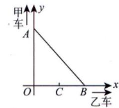  
图7-1

上式表达了三个变化率 $\frac{\mathrm{d}s}{\mathrm{d}t}, \frac{\mathrm{d}x}{\mathrm{d}t}, \frac{\mathrm{d}y}{\mathrm{d}t}$ 之间的关系. 已知 $\frac{\mathrm{d}x}{\mathrm{d}t} = 24, \frac{\mathrm{d}y}{\mathrm{d}t} = 20$ . 当 $t = 1$ 时， $x = 24, y = 20$ 代入上式，得 $\frac{\mathrm{d}s}{\mathrm{d}t} = \frac{196}{\sqrt{41}} \approx 30.6(\mathrm{km/h})$ .

7.4 解 利润函数 $L = R - C = 18x - 3x^2 - 4x^3$ ，边际收入函数 $MR = \frac{\mathrm{d}R}{\mathrm{d}x} = 26 - 4x - 12x^2$ ，边际成本函数 $MC = \frac{\mathrm{d}C}{\mathrm{d}x} = 8 + 2x$ 。

令 $\frac{\mathrm{d}L}{\mathrm{d}x} = 18 - 6x - 12x^2 = 0$ 得 $x = 1, x = -\frac{3}{2}$ （舍去）. 又 $\left.\frac{\mathrm{d}^2L}{\mathrm{d}x^2}\right|_{x=1} = (-6 - 24x)\Bigg|_{x=1} = -30 < 0$ ，可知当 $x = 1$ 时， $L$ 取得极大值，为 $L\Bigg|_{x=1} = (18x - 3x^2 - 4x^3)\Bigg|_{x=1} = 11$ . 因为 $x > 0$ 时， $L(x)$ 只有一个极大值，故此极大值就是最大值. 所以当产量为1时利润最大，最大利润为11.

# 第8讲

# 一元函数积分学的概念与性质

<table><tr><td>考题</td><td>不定积分、定积分、变限积分、反常积分</td></tr><tr><td>题型</td><td>选择题、填空题</td></tr><tr><td>目标</td><td>①理解原函数的概念,理解不定积分和定积分的概念(仅数学一、数学二);理解原函数与不定积分的概念,了解定积分的概念(仅数学三). ②掌握不定积分和定积分的性质及定积分中值定理(仅数学一、数学二);掌握不定积分的基本性质,了解定积分的基本性质,了解定积分中值定理(仅数学三). ③理解积分上限的函数,会求它的导数. ④理解反常积分的概念,了解反常积分收敛的比较判别法</td></tr><tr><td>重难点</td><td>①不定积分和定积分的性质及积分中值定理; ②变限积分函数的概念与性质; ③反常积分的概念及敛散性</td></tr></table>

# 基础知识结构

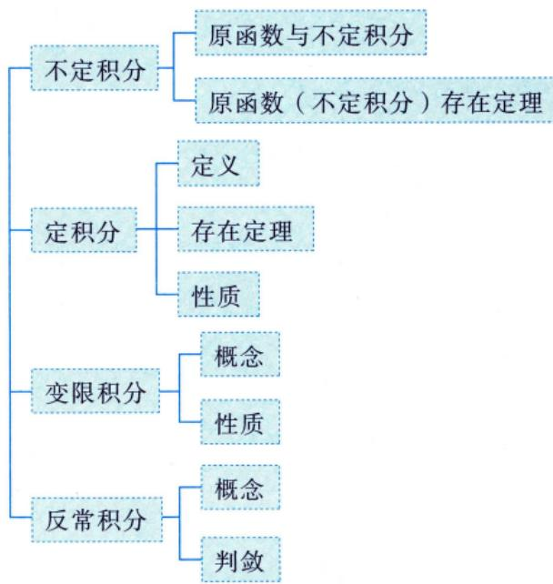

# 不定积分

# 原函数与不定积分

设函数 $f(x)$ 定义在某区间 $I$ 上，若存在可导函数 $F(x)$ ，对于该区间上任意一点都有 $F^{\prime}(x) = f(x)$ 成立，则称 $F(x)$ 是 $f(x)$ 在区间 $I$ 上的一个原函数。称 $\int f(x)\mathrm{d}x = F(x) + C$ 为 $f(x)$ 在区间 $I$ 上的不定积分。

仅是表达原函数的记号

全体原函数

问：为什么强调一个？

答：因为若 $F^{\prime}(x) = f(x)$

则对于任意常数 $C$ ，都有 $[F(x) + C]' = F'(x) = f(x)$

故 $F(x) + C$ 也是原函数，所以 $f(x)$ 若有原函数，则原函数

一定有无穷多个， $F(x) + C$ 称为全体原函数

注 谈到函数 $f(x)$ 的原函数与不定积分，必须指明 $f(x)$ 所定义的区间.

例8.1 设 $0 < x < 1$ ，且 $\int (1 - x^2)f(x^2)\mathrm{d}x = \arcsin x + C$ ，则 $f(x) = (\quad)$ .

(A) $(1 - x)^{\frac{3}{2}}$

(B) $(1 - x)^{-\frac{3}{2}}$

(C) $(1 - x^{2})^{\frac{3}{2}}$

(D) $(1 - x^{2})^{-\frac{3}{2}}$

分析 按照原函数定义 $\int \overline{f(x)}\mathrm{d}x = F(x) + C$

解 应选(B).

根据原函数 $F(x)$ 的定义 $F^{\prime}(x) = f(x)$ 求解.

将所给表达式的等式两端分别关于 $x$ 求导，得

$$
\left[ \int (1 - x ^ {2}) f (x ^ {2}) d x \right] ^ {\prime} = (\arcsin x + C) ^ {\prime},
$$

即

故 $f(x^{2}) = (1 - x^{2})^{-\frac{3}{2}},$

$$
f (x) = (1 - x) ^ {- \frac {3}{2}}.
$$

故选 (B).

例8.2 函数 $f(x) = \begin{cases} \sqrt{1 + x^2}, & x < 0, \\ (x + 1)\cos x, & x > 0 \end{cases}$ 的一个原函数为（ ）.

(A) $F(x) = \left\{ \begin{array}{ll}\ln \left(\sqrt{1 + x^2} -x\right), & x\leqslant 0,\\ (x + 1)\cos x - \sin x, & x > 0 \end{array} \right.$   
(B) $F(x) = \left\{ \begin{array}{ll}\ln \left(\sqrt{1 + x^2} -x\right) + 1, & x\leqslant 0,\\ (x + 1)\cos x - \sin x, & x > 0 \end{array} \right.$   
(C) $F(x) = \left\{ \begin{array}{ll}\ln \left(\sqrt{1 + x^2} +x\right), & x\leqslant 0,\\ (x + 1)\sin x + \cos x, & x > 0 \end{array} \right.$   
(D) $F(x) = \left\{ \begin{array}{ll}\ln \left(\sqrt{1 + x^2} +x\right) + 1, & x\leqslant 0,\\ (x + 1)\sin x + \cos x, & x > 0 \end{array} \right.$

分析 $F^{\prime}(x) = f(x)$ .由 $f(x)$ 处处有定义得 $F(x)$ 处处可导，推出 $F(x)$ 处处连续.

解 应选(D).

对于选项(A)： $\lim_{x\to 0^{-}}F(x) = 0$ ， $\lim_{x\to 0^{+}}F(x) = 1$ ，由于 $F(x)$ 在 $x = 0$ 处左右极限不同，故 $F(x)$ 不连续.

对于选项(C)： $\lim_{x\to 0^{-}}F(x) = 0$ ， $\lim_{x\to 0^{+}}F(x) = 1$ ，由于 $F(x)$ 在 $x = 0$ 处左右极限不同，故 $F(x)$ 不连续.由 $F^{\prime}(x) = f(x)$ 知， $F(x)$ 必连续，故可排除(A)，(C).

对于选项(B)：当 $x > 0$ 时， $F^{\prime}(x) = \cos x - (x + 1)\sin x - \cos x = -(x + 1)\sin x\neq (x + 1)\cos x$ ，故可排除(B).因此选(D).

# 原函数（不定积分）存在定理

(1) 连续函数 $f(x)$ 必有原函数 $F(x)$ .

不作要求，但最好在草稿本上写一遍，大致思路要懂

注 证明：如果函数 $f(x)$ 在 $[a, b]$ 上连续，则函数 $F(x) = \int_{a}^{x} f(t) \mathrm{d}t$ 在 $[a, b]$ 上可导，且 $F'(x) = f(x)$ 。证 若 $x \in (a, b)$ ，取 $\Delta x$ 使 $x + \Delta x \in (a, b)$ ，则 说明 $\int_{a}^{x} f(x) \mathrm{d}x = \int_{a}^{x} f(t) \mathrm{d}t + C$

$$
\begin{array}{l} \Delta F = F (x + \Delta x) - F (x) = \int_ {a} ^ {x + \Delta x} f (t) d t - \int_ {a} ^ {x} f (t) d t \\ = \int_ {a} ^ {x} f (t) d t + \int_ {x} ^ {x + \Delta x} f (t) d t - \int_ {a} ^ {x} f (t) d t = \boxed {\int_ {x} ^ {x + \Delta x} f (t) d t}, \\ \end{array}
$$

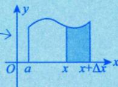

使用积分中值定理，有 $\int_{x}^{x + \Delta x}f(t)\mathrm{d}t = f(\xi)\Delta x$ ，其中 $\xi$ 介于 $x$ 与 $x + \Delta x$ 之间，当 $\Delta x\to 0$ 时， $\xi \rightarrow x$ ，于是

若 $x = a$ ，取 $\Delta x > 0$ ，则同理可证 $F_{+}^{\prime}(a) = f(a)$ ；若 $x = b$ ，取 $\Delta x < 0$ ，则同理可证 $F_{-}^{\prime}(b) = f(b)$ ：

注意：当四则运算中出现不同形式的表达式时，需要化为统一的形式，本题借助了积分中值定理.

① $\int f(x) \mathrm{d}x$ 称为不定积分，表示全体原函数.

② $\int_{a}^{b} f(x) \mathrm{d}x$ 称为定积分，表示面积.

③ $F(x) = \int_{a}^{x} f(t) \, \mathrm{d}t$ 称为变上限积分，表示动态的面积。

④积分中值定理：若函数 $f(x)$ 在区间 $[a, b]$ 上连续，则至少存在一点 $\xi \in [a, b]$ ，使

总结： $f(x)$ 连续 $\Rightarrow \left\{ \begin{array}{l} \int f(x)\mathrm{d}x = \int_{a}^{x}f(t)\mathrm{d}t + C,\\  \left[\int_{a}^{x}f(t)\mathrm{d}t\right]^{\prime} = f(x). \end{array} \right.$

(2) 含有第一类间断点和无穷间断点的函数 $f(x)$ 在包含该间断点的区间内必没有原函数 $F(x)$ .

注1 (1) 函数 $f(x)$ 在定义域 $I$ 上可导，则

(2) 函数 $f(x)$ 存在与 $f^{\prime}(x)$ 存在的区别.

① a. $f(x)$ 在 $x = x_0$ 处的极限存在不能得出 $f(x)$ 在 $x = x_0$ 处连续。

如 $\mathop{\lim }\limits_{{x \rightarrow  {x}_{0}}}f\left( x\right)  = a$ ,但 $f\left( {x}_{0}\right)$ 有可能等于 $a$ ,也有可能不等于 $a$ .

b. $f(x)$ 可导，且 $\lim_{x\to x_0}f'(x) = a$ ，则 $f^{\prime}(x)$ 在 $x_0$ 处连续.

证 $f^{\prime}(x_0) = \lim_{x\to x_0}\frac{f(x) - f(x_0)}{x - x_0}\frac{\frac{0}{0}}{\text{洛必达法则}}\lim_{x\to x_0}f^{\prime}(x) = a.$

② a. $f(x)$ 存在不能得出 $f(x)$ 有介值性.

介值定理：函数 $f(x)$ 在 $[a, b]$ 上连续，且 $f(a) = A$ ， $f(b) = B$ ，则当 $A < u < B$ 时，存在 $\xi \in (a, b)$ ，使 $f(\xi) = u$ ：

b. $f^{\prime}(x)$ 存在，可得 $f^{\prime}(x)$ 有介值性.

达布定理： $f(x)$ 在 $[a,b]$ 上可导， $f_{+}^{\prime}(a)\neq f_{-}^{\prime}(b)$ ，则对任意介于 $f_{+}^{\prime}(a)$ 与 $f_{-}^{\prime}(b)$ 之间的 $\pmb{u}$ ，存在 $\xi \in (a,b)$ ，使得

$$
f ^ {\prime} (\xi) = u,
$$

证 令 $F(x) = f(x) - ux$ ，则 $F'(x) = f'(x) - u$ 。

不妨设 $f_{+}^{\prime}(a) < u < f_{-}^{\prime}(b)$ ，则 $f_{+}^{\prime}(a) - u < 0$ ， $f_{-}^{\prime}(b) - u > 0$ ，即 $F_{+}^{\prime}(a) < 0$ ， $F_{-}^{\prime}(b) > 0$ 。

由例6.3，可知存在 $\xi \in (a,b)$ ，使 $F^{\prime}(\xi) = 0$ ，即 $f^{\prime}(\xi) = u$ ：

$f^{\prime}(x)$ 存在 $\neq 0$ ，则 $f^{\prime}(x)$ 必保号（恒正或恒负）. 反证：假设存在 $f^{\prime}(a) <   0,f^{\prime}(b) > 0,$ ③由 $②$ b.可得 在 $[a,b]$ 上 $f^{\prime}(x)$ 存在，则 $f^{\prime}(x)$ 无第一类间断点. 则存在 $\xi \in (a,b),f^{\prime}(\xi) = 0$ ，矛盾.

注2证设 $F(x)$ 为 $f(x)$ 在 $I$ 内的一个原函数，则 $F(x)$ 在 $I$ 内可导，且 $F^{\prime}(x) = f(x)$ ，并设 $x = x_0 \in I$ 为 $F^{\prime}(x)$ 的间断点，我们讨论如下三种情况：

(1) $x = x_0$ 为可去间断点，即 $\lim_{x\to x_0}F'(x)$ 存在且为 $A$ ，但 $A\neq F^{\prime}(x_0)$ ，而

$$
F ^ {\prime} (x _ {0}) = \lim  _ {x \to x _ {0}} \frac {F (x) - F (x _ {0})}{x - x _ {0}} \xlongequal {\text {洛 必 达 法 则}} \lim  _ {x \to x _ {0}} F ^ {\prime} (x) = A, \text {矛 盾};
$$

(2) $x = x_0$ 为跳跃间断点，即 $\lim_{x\to x_0^+}F'(x)$ 存在且为 $A_{+}$ ， $\lim_{x\to x_0^-}F'(x)$ 存在且为 $A_{-}$ ，但 $A_{+}\neq A_{-}$ ，而

$$
F _ {+} ^ {\prime} (x _ {0}) = \lim  _ {x \to x _ {0} ^ {+}} \frac {F (x) - F (x _ {0})}{x - x _ {0}} \xlongequal {\text {洛 必 达 法 则}} \lim  _ {x \to x _ {0} ^ {+}} F ^ {\prime} (x) = A _ {+},
$$

$F(x)$ 在 $I$ 上处处可导

$$
F _ {-} ^ {\prime} (x _ {0}) = \lim  _ {x \to x _ {0}} \frac {F (x) - F (x _ {0})}{x - x _ {0}} \xlongequal {\text {洛 必 达 法 则}} \lim  _ {x \to x _ {0}} F ^ {\prime} (x) = A _ {-},
$$

又 $F^{\prime}(x_0)$ 是存在的，则 $F_{+}^{\prime}(x_0) = F_{-}^{\prime}(x_0)$ ，即 $A_{+} = A_{-}$ ，矛盾；

(3) $x = x_0$ 为无穷间断点，即 $\lim_{x\to x_0}F'(x) = \infty$ ，而

$$
F ^ {\prime} (x _ {0}) = \lim  _ {x \to x _ {0}} \frac {F (x) - F (x _ {0})}{x - x _ {0}} \xlongequal {\text {洛 必 达 法 则}} \lim  _ {x \to x _ {0}} F ^ {\prime} (x) = \infty ,
$$

又 $F^{\prime}(x_0)$ 是存在的，矛盾.

综上所述，(1)，(2)和(3)的情形均不存在原函数，即导函数 $F^{\prime}(x)$ 在 $I$ 内必定没有第一类间断点和无穷间断点，也即含有第一类间断点和无穷间断点的函数 $f(x)$ 在包含该间断点的区间内没有原函数 $F(x)$ 。

注3 含有振荡间断点的函数是否有原函数呢？这是不确定的。举例来说，对于

$$
f (x) = \left\{ \begin{array}{l l} 2 x \sin \frac {1}{x} - \cos \frac {1}{x}, & x \neq 0, \\ 0, & x = 0, \end{array} \right.
$$

$\lim_{x \to 0} f(x)$ 不存在，其在 $(- \infty, + \infty)$ 上不连续，它有一个振荡间断点 $x = 0$ ，但是它在 $(- \infty, + \infty)$ 上存在原函数

$$
F (x) = \left\{ \begin{array}{l l} x ^ {2} \sin \frac {1}{x}, & x \neq 0, \\ 0, & x = 0. \end{array} \right.
$$

经验证，当 $x \neq 0$ 时， $F'(x) = 2x\sin \frac{1}{x} - \cos \frac{1}{x}$ ；当 $x = 0$ 时， $F'(0) = \lim_{x \to 0} \frac{x^2 \cdot \sin \frac{1}{x} - 0}{x - 0} = 0$ ，即对于 $(- \infty, + \infty)$ 上任一点都有 $F'(x) = f(x)$ 成立。

当然，对于

$$
f (x) = \left\{ \begin{array}{l l} \frac {1}{x} \sin \frac {1}{x}, & x \neq 0, \\ 0, & x = 0, \end{array} \right.
$$

其在 $(-\infty, +\infty)$ 上也有一个振荡间断点 $x = 0$ ，但其在 $(-\infty, +\infty)$ 上没有原函数。

注4 综合以上几点，可以得出重要结论：可导函数 $F(x)$ 求导后的函数 $F^{\prime}(x) = f(x)$ 不一定是连续函数，也可能有振荡间断点：连续函数或含振荡间断点的函数若 $F(x)$ 处处可导 $\Rightarrow F^{\prime}(x)$ 有介值性极限存在 $\Leftrightarrow F^{\prime}(x)$ 连续 $\neq 0\Rightarrow F(x)$ 单调

注5至此，我们可以总结导函数 $f^{\prime}(x)$ 的性质了.

(1) 如果导函数 $f^{\prime}(x)$ 存在，当导函数在一点极限存在时，导函数在这一点必连续.

对比函数就会知道，如果函数在一点极限存在，并不能得出函数在这一点连续的结论.

导函数之所以有这个特性，而函数没有，归根结底是因为导函数存在（即函数可导），是指那些点相依相偎、充分靠近，也就是说，导函数如果存在，它们天生就是点点相依相偎的，而函数存在，只是每个点都在那里，也就是在那里而已，它们无牵无挂。所以，不要只记住导函数也是函数，更要记住，导函数是性质极强的函数。导函数在这一点存在（事实上函数在这一点连续就够了），就能保证点点相依相偎。那么，如果导函数在一点存在，且它在这一点的极限值也存在时，必等于这一点的导数值，也就是说导函数在这一点必连续。

所以可以继续思考下去，得到微积分里极为重要的一个结论：

(2) 如果导函数在一点存在，则这一点一定不会是导函数的第一类间断点.

对比函数，函数在一点存在，可以是第一类间断点.

为什么？因为导函数在一点存在，讨论它在这一点是不是第一类间断点，关键是看在导函数左右极限都存在的条件下，是左右极限不等（跳跃间断），还是左右极限相等但不等于导数值（可去间断）。显然，导函数在一点存在时，它的左极限和右极限如果存在，必然分别等于这一点的左右导数值，由于这一点可导，左右导数值相等，于是导函数的左右极限值也必然相等，也就回到了（1）.故一个可导函数的导函数是没有第一类间断点的。

请再思考：在一条处处有切线的曲线上，会不会发生切线斜率值在一点突变的情况？为什么？

答：在几何上讲的曲线处处有切线，在微分学上对应的就是导函数处处存在或无穷大。这里，切线斜率为无穷大是一种需要斟酌的情形。在高等数学（微积分）中，无穷大是（特殊的）不存在，对应着铅直切线（斜率无穷大，不存在），但事实上，如果我们把 $y = x$ 对调（或者说旋转 $90^{\circ}$ ），铅直变成水平，斜率为0，这就是存在的了，比如 $y = x^{3}$ 与 $y = x^{\frac{1}{3}}$ ，就很容易理解。既然 $x = 0$ 附近 $y = x^{3}$ 切线的斜率是没有突变的，那么 $x = 0$ 附近 $y = x^{\frac{1}{3}}$ 切线的斜率也不会突变。非零无穷小和无穷大互为倒数关系，在斜率这里就有了很好的体现。琢磨一下，为什么说非零无穷小和无穷大对应呢？因为 $y = x^{3}$ 虽然在 $x = 0$ 处导数（变化率）等于0，可是它不是没有变化，显然 $x = 0$ 处左边的函数值为负，右边的函数值为正，只是从导数这个变化率工具上来说，它没有能力（不够精确）测量到这

个变化而已（也许以后你们还会接触到分数阶导数甚至更为精细的刻画变化率的工具）.

(3) 若 $f(x)$ 可导，则 $f^{\prime}(x)$ 可能连续，也可能含有振荡间断点.

连续不难理解，那么振荡间断点是什么样子？它是真的断了吗？在现代数学提出了超实数理论后，我们已经知道了，事实上，没有什么线是连着的，只是点与点近不近，有多近的问题罢了。

① 设 $f_{1}(x) = \sin x$ ， $\lim_{x \to +\infty} \sin x$ 振荡不存在，其大致图形为

$②$ 设

$$
f _ {2} (x) = \left\{ \begin{array}{l l} \sin \frac {1}{x}, & x \neq 0, \\ 0, & x = 0, \end{array} \right.
$$

可以看出， $\sin \frac{1}{x}$ 由 $\sin u$ 和 $u = \frac{1}{x}$ 复合而成.当 $x\to 0^{+}$ 时， $u\rightarrow +\infty$ ，故 $\lim_{x\to 0^{+}}\sin {\frac{1}{x}}$ 依然是振荡不存在.

但这里有一个关键问题：这里的振荡是在 $x\to 0^{+}$ 时发生的，也就是 $\pmb{x}$ 与0充分靠近、无限靠近时

发生的，于是可以看作将①中的 “无限压缩”成

将 $x\to 0^{-}$ 也画出来，则大致图形为 $\sin \frac{1}{x}$

a.所谓“无限压缩”，可以认为在 $x = 0$ 的任意邻域内，都有无数次-1到1的振荡.  
b.若将横坐标 $x$ 的比例放大无穷倍，就会看到形如 的样子了.我们能够放大无穷倍吗？显然不能，故我们是看不到实际图形的，好在人类有思考能力可以想象到.  
c.振荡间断点露出了本来的面目，放大无穷倍后，即 还原成原来的样子，它是这样的：  
至此，我们明白了：

a.“振荡”是它的左右函数值的特征，即 密集地像矩形块一样无限靠近y轴.

b. “间断”只是在描述上述特征，即 $\lim_{x\to 0}\sin{\frac{1}{x}}$ 不存在.

谁叫连续的定义是 $\lim_{x\to x_0}f(x) = f(x_0)$ 呢，就因为 $\lim_{x\to 0}\sin {\frac{1}{x}}\neq \sin {\frac{1}{x}}\Bigg|_{x = 0}$ （无定义），于是只能叫间断.即使定义成 $\left\{ \begin{array}{ll}\sin {\frac{1}{x}}, & x\neq 0,\\ 0, & x = 0, \end{array} \right.$ 依然是 $\lim_{x\to 0}\sin {\frac{1}{x}}\neq 0$ ，也只能叫间断.

不过，对于 $\left\{ \begin{array}{ll} \sin \frac{1}{x}, & x \neq 0, \\ 0, & x = 0 \end{array} \right.$ 这样的振荡间断点，我们可以说，曲线上的点均是相依相偎的，它

们并没有“断开”（如像一样跳跃断开，或像一样可去断开），

而是像图形一样绵延不绝.

总之，形如 $f(x) = \left\{ \begin{array}{ll} \sin \frac{1}{x}, & x \neq 0, \\ 0, & x = 0 \end{array} \right.$ 这样的振荡间断点，没有实际上的“断开”，它们是点点相依相偎的。只是它有一个独特的地方，即无限次振荡，故只能称间断，曰：（无限次）振荡使得极限不存在而不得不称为间断的点。

还记得“连续函数”必有原函数吗？原函数当然是可导函数。也就是说，一个“点点相依相偎”（连续）的函数，一定有（是）一个“点点相依相偎更近”（可导）的函数求导而得到的。反过来说，一个“点点相依相偎更近”（可导）的函数，求导后，会得到一个“点点相依相偎”（可以理解为靠近程度降低）的函数。于是，不只是连续函数“点点相依相偎”，我们研究得如此细致的“振荡间断函数”也可以“点点相依相偎”啊！故可导函数求导后，可能得到连续函数，也可能得到含振荡间断点的函数，只要这些函数“点点相依相偎”（足够近）就行。

于是，若 $f(x)$ 可导，则 $f'(x)$ 可能连续，也可能含有振荡间断点。

现在可以准确回答这个问题了——振荡间断点是什么样子？它是真的断了吗？

设

$$
f (x) = \left\{ \begin{array}{l l} x ^ {2} \cos \frac {1}{x}, & x \neq 0, \\ 0, & x = 0, \end{array} \right.
$$

其在 $(-\infty, +\infty)$ 上处处可导，且其导函数为

$$
f ^ {\prime} (x) = \left\{ \begin{array}{l l} 2 x \cos \frac {1}{x} + \sin \frac {1}{x}, & x \neq 0, \\ 0, & x = 0. \end{array} \right.
$$

显然，

$$
\lim  _ {x \rightarrow 0} f ^ {\prime} (x) \stackrel {(*)} {=} \lim  _ {x \rightarrow 0} 2 x \cos \frac {1}{x} + \lim  _ {x \rightarrow 0} \sin \frac {1}{x} = \lim  _ {x \rightarrow 0} \sin \frac {1}{x},
$$

极限振荡不存在. 请原谅我在 (*) 处鲁莽地拆开了, 那只是为了让各位更清楚地看到 $\lim_{x \to 0} \sin \frac{1}{x}$ . 如前

所述，函数 $\left\{ \begin{array}{ll} \sin \frac{1}{x}, & x \neq 0, \\ 0, & x = 0 \end{array} \right.$ 放大无穷倍后的样子为

导函数的值不会突变，我们可以放心了。

以上我们讨论了函数真实存在的样子，事实上，微积分就是在研究函数微观上的样子，当你懂得了这些，就会逐渐发现它们的威力，并拥有了揭示真实的力量。

# 二 定积分

# 1 定义

①分割(分割方法不唯一,只要分成n传即

可)；②近似；③求和；④取极限.

(1)定积分的概念.

若函数 $f(x)$ 在区间 $[a, b]$ 上有界，在 $(a, b)$ 上任取 $n - 1$ 个分点 $x_{i} (i = 1, 2, 3, \dots, n - 1)$ ，定义 $x_{0} = a$ 和 $x_{n} = b$ ，且 $a = x_{0} < x_{1} < x_{2} < x_{3} < \dots < x_{n - 1} < x_{n} = b$ ，记 $\Delta x_{k} = x_{k} - x_{k - 1}, k = 1, 2, 3, \dots, n$ 。并任取一点 $\xi_{k} \in [x_{k - 1}, x_{k}]$ ，记 $\lambda = \max_{1 \leqslant k \leqslant n} \{\Delta x_{k}\}$ ，若当 $\lambda \to 0$ 时，极限 $\lim_{\lambda \to 0} \sum_{k = 1}^{n} f(\xi_{k}) \Delta x_{k}$ 存在且与分点 $x_{i}$ 及点 $\xi_{k}$ 的取法

无关，则称函数 $f(x)$ 在区间 $[a, b]$ 上可积，即

如果你问我, 积分号 “ $\int$ ” 是怎么来的, 我情愿你这样看:

但事实上, 积分号 “ $\int$ ” 是莱布尼茨给出的, 在德国小城汉诺威 (莱布尼茨在这里度过了人生的最后时光) 的莱布尼茨纪念馆的一传他的手稿中, 明确写到: $\int$ 来自 “summa” 的首字母 $s$ 拉长, 写成了 “ $\int$ ”.

注 定积分的定义是由德国数学家波恩哈德·黎曼(Bernhard Riemann)给出的，故这种积分又被称为黎曼积分.

(2)几何意义.

黎曼(1826-1866)

在 $[a, b]$ 上，① 若 $f(x) \geqslant 0$ ，定积分 $\int_{a}^{b} f(x) \mathrm{d}x$ 表示由曲线 $y = f(x)$ 、直线 $x = a$ 、直线 $x = b$ 与 $x$ 轴所围成的曲边梯形的面积[见图8-1(a)]；② 若 $f(x) \leqslant 0$ ，定积分 $\int_{a}^{b} f(x) \mathrm{d}x$ 表示由曲线 $y = f(x)$ 、直线 $x = a$ 、直线 $x = b$ 与 $x$ 轴所围成的曲边梯形面积的负值[见图8-1(b)]；③ 若 $f(x)$ 既有正值又有负值，定积分 $\int_{a}^{b} f(x) \mathrm{d}x$ 表示 $x$ 轴上方图形的面积减去 $x$ 轴下方图形的面积[见图8-1(c)].

  
定积分=面积  
(a)

  
定积分 $=$ 面积的负值  
(b)

  
定积分 $=$ 面积的代数和 $= S_{\text{上}} - S_{\text{下}}$   
(c)   
图8-1

(3)定积分的精确定义.

当定积分存在时，存在两个“任取”：分点 $x_{i}$ 任取，一点 $\xi_{i} \in (x_{i - 1}, x_{i})$ 任取。故可作两个“特取”：

将 $[a,b]n$ 等分且取每个小区间的右端点为 $\xi_{i}$ （见图8-2)，即

① $n$ 等分并取右端点的函数值作为高；

  
图8-2

若将式子中的 $a, b$ 特殊化为0，1这两个数，得出的形式更为简单：

(4) 定积分的值与字母无关.

当定积分存在时，有

$$
\int_ {a} ^ {b} f (x) \mathrm {d} x = \int_ {a} ^ {b} f (t) \mathrm {d} t = \int_ {a} ^ {b} f (u) \mathrm {d} u, \quad \text {注 : 积 分 与 字 母 无 关 , 无 论} x, t, u, \text {都 只 是 一 个 符 号}
$$

这就是说，定积分的值只与被积函数及积分区间有关，而与积分变量的记法无关.

是个客观存在的数量值

# 存在定理

定积分的存在性，也称一元函数的（常义）可积性。这里的“常义”是指“区间有限，函数有界”，也有人称为“黎曼”可积性，与后面要谈到的“区间无穷，函数无界”的“反常”积分有所区别。在本讲中所谈到的可积性都是指常义可积性。

  
函数与积分区间值限制在框之内.

按照《全国硕士研究生招生考试数学考试大纲》，定积分存在定理包括下面两个方面.

(1) 定积分存在的充分条件.

① 若 $f\left( x\right)$ 在 $\lbrack a,b\rbrack$ 上连续,则 ${\int }_{a}^{b}f\left( x\right) \mathrm{d}x$ 存在.

闭区间上连续函数一定有界；

连续函数一定存在不定积分；

连续函数一定存在定积分.

② 若 $f\left( x\right)$ 在 $\lbrack a,b\rbrack$ 上单调,则 ${\int }_{a}^{b}f\left( x\right) \mathrm{d}x$ 存在.

由于函数单调，故 $f(a)$ ， $f(b)$ 即为函数的界，对任意 $x\in (a,b)$ ， $f(x)$ 一定介于 $f(a)$ ， $f(b)$ 之间

③若 $f\left( x\right)$ 在 $\lbrack a,b\rbrack$ 上有界,且只有有限个间断点,则 ${\int }_{a}^{b}f\left( x\right) \mathrm{d}x$ 存在.

不包含无穷间断点,因为无穷间断点会导致无界

④ 若 $f(x)$ 在 $[a, b]$ 上有有限个第一类间断点，则 $\int_{a}^{b} f(x) \mathrm{d}x$ 存在.

(2)定积分存在的必要条件.

可积函数必有界，即若定积分 $\int_{a}^{b}f(x)\mathrm{d}x$ 存在，则 $f(x)$ 在 $[a,b]$ 上必有界.

注1 关于定积分存在的必要条件，不妨这样理解：当我们任意分割图形底边为若干小段时，若 $f(x)$ 在区间 $[a, b]$ 上无界，则至少存在一个小段 $\Delta x$ ，在 $\Delta x$ 上， $f(x)$ 可以任意大，于是一个“小竖条”的面积 $f(x) \Delta x$ 便可以无穷大，这样整个曲边梯形的面积就是无穷大，于是极限就不存在了，所以可积函数必有界。

注意与反常积分作区分：反常积分有可能出现函数无界的情况.

注2 函数不定积分存在定理与定积分存在定理的区别与联系见例8.3.

# 3 性质（假设以下积分均存在）

两个规定：

(1) 当 $b = a$ 时， $\int_{a}^{a} f(x) \, \mathrm{d}x = 0$ ；  
(2) 当 $a > b$ 时， $\int_{a}^{b}f(x)\mathrm{d}x = -\int_{b}^{a}f(x)\mathrm{d}x.$

性质1（求区间长度）假设 $a < b$ ，则 $\int_{a}^{b}\mathrm{d}x = b - a = L$ ，其中 $L$ 为区间 $[a,b]$ 的长度.

性质2（积分的线性性质）设 $k_{1}, k_{2}$ 为常数，则 $\int_{a}^{b}[k_{1}f(x)\pm k_{2}g(x)]\mathrm{d}x = k_{1}\int_{a}^{b}f(x)\mathrm{d}x\pm k_{2}\int_{a}^{b}g(x)\mathrm{d}x.$

性质3（积分的可加（拆）性）无论 $a, b, c$ 的大小如何，总有 $\int_{a}^{b} f(x) \mathrm{d}x = \int_{a}^{c} f(x) \mathrm{d}x + \int_{c}^{b} f(x) \mathrm{d}x$ .

性质4（积分的保号性）若在区间 $[a,b]$ 上 $f(x)\leqslant g(x)$ ，则有 $\int_{a}^{b}f(x)\mathrm{d}x\leqslant \int_{a}^{b}g(x)\mathrm{d}x$

特殊地，有 $\left|\int_{a}^{b}f(x)\mathrm{d}x\right|\leqslant \int_{a}^{b}\left|f(x)\right|\mathrm{d}x.$ “亡羊补牢”“未雨绸缪”

由图可得， $\left|\int_{a}^{b}f(x)\mathrm{d}x\right| = |5 - 3| = 2,\int_{a}^{b}\left|f(x)\right|\mathrm{d}x = 5 + 3 = 8$ ，则有 $\left|\int_{a}^{b}f(x)\mathrm{d}x\right|\leqslant \int_{a}^{b}|f(x)|\mathrm{d}x.$

注事实上，设 $f(x)$ 是 $[a,b]$ 上非负的连续函数，只要 $f(x)$ 不恒等于零，则必有

$$
\int_ {a} ^ {b} f (x) \mathrm {d} x > 0.
$$

在有些积分不等式的证明与定积分值的估计中，要求获得严格的不等式结果，便需要用到这个结论，其证明见例8.7.

极限戴帽法： $f(x) > 0$ ，则 $\lim_{x\to \infty}f(x)\geqslant 0$ 与极限作区分 极限脱帽法： $\lim_{x\to x}\lim_{x\to x}f(x) > 0$ ，则 $f(x) > 0$

积分： $f\left( x\right)  - g\left( x\right)  \leq  0,a < b$ ,则 ${\int }_{a}^{b}\left\lbrack  {f\left( x\right)  - g\left( x\right) }\right\rbrack  \mathrm{d}x \leq  0$ . 若有条件 $f\left( x\right)  - g\left( x\right)$ 连续,且不恒为0,则 ${\int }_{a}^{b}\left\lbrack  {f\left( x\right)  - g\left( x\right) }\right\rbrack$

性质5（估值定理）设 $M, m$ 分别是 $f(x)$ 在 $[a,b]$ 上的最大值和最小值， $L$ 为区间 $[a,b]$ 的长度，则有

$$
m L \leqslant \int_ {a} ^ {b} f (x) \mathrm {d} x \leqslant M L.
$$

注证 $\int_{a}^{b}m\mathrm{d}x\leqslant \int_{a}^{b}f(x)\mathrm{d}x\leqslant \int_{a}^{b}M\mathrm{d}x$ ，有 $mL\leqslant \int_{a}^{b}f(x)\mathrm{d}x\leqslant ML.$

★★★性质6（中值定理）设 $f(x)$ 在区间 $[a,b]$ 上连续，则在 $[a,b]$ 上至少存在一点 $\xi$ ，使得

$$
\int_ {a} ^ {b} f (x) \mathrm {d} x = f (\xi) (b - a).
$$

例8.3 在区间[-1,2]上，以下四个结论：

$f(x) = \left\{ \begin{array}{ll}2, & x > 0,\\ 1, & x = 0,\\ -1, & x <   0 \end{array} \right.$ $x = 0$ 是鞅跃间断点  
$2x\sin \frac{1}{x^2} -\frac{2}{x}\cos \frac{1}{x^2},\quad x\neq 0,$ $f(x) = \left\{ \begin{array}{ll}2x\sin \frac{1}{x^2} -\frac{2}{x}\cos \frac{1}{x^2}, & x\neq 0,\\ 0, & x = 0 \end{array} \right.$ 有原函数，其定积分也存在；  
$③ f ( x ) = \left\{ \begin{array} { l l } {  \frac { 1 } { x } , } & { x \neq 0 , } \\ { 0 , } & { x = 0 } \end{array} \right.$ 没有原函数，其定积分也不存在；  
$4f(x) = \left\{ \begin{array}{ll}2x\cos {\frac{1}{x}} + \sin {\frac{1}{x}}, & x\neq 0,\\ 0, & x = 0 \end{array} \right.$ 有原函数，其定积分也存在.

正确结论的个数为（ ）.

(A)1

(B)2

(C)3

(D)4

分析 有第一类间断点和无穷间断点的函数 $f(x)$ 在包含该间断点的区间内必没有原函数.

定积分存在的充分条件：① $f(x)$ 在 $[a, b]$ 上连续；② $f(x)$ 在 $[a, b]$ 上有界，且只有有限个间断点；③ $f(x)$ 在 $[a, b]$ 上单调.

定积分存在的必要条件：① $[a,b]$ 有限长度；② $f(x)$ 在 $[a,b]$ 上有界.

解 应选(B).

本题通过具体的例子考查考生是否能够明确区分不定积分与定积分的存在性.逐个分析即可.

对于 $f(x) = \left\{ \begin{array}{ll}2, & x > 0,\\ 1, & x = 0,\\ -1, & x <   0, \end{array} \right.$ 由于 $x = 0$ 是其跳跃间断点，根据不定积分存在定理，在任意一个包含 $x = 0$ 的区间 $[a,b]$ 上， $f(x)$ 一定不存在原函数，但由于 $f(x)$ 满足定积分存在定理，故定积分 $\int_{a}^{b}f(x)\mathrm{d}x$ 存在，所以 $①$ 错误.

对于 $f(x) = \left\{ \begin{array}{ll}2x\sin \frac{1}{x^2} -\frac{2}{x}\cos \frac{1}{x^2}, & x\neq 0,\\ 0, & x = 0, \end{array} \right.$ $x = 0$ 是其振荡间断点，但是容易验证：

若 $F(x) = \left\{ \begin{array}{ll}x^{2}\sin \frac{1}{x^{2}}, & x\neq 0,\\ 0, & x = 0, \end{array} \right.$ 则 $F^{\prime}(x) = f(x)(-\infty <  x <   + \infty)$ ，所以 $f(x)$ 存在原函数，但在任意一个包含 $x = 0$ 的区间 $[a,b]$ 上，定积分 $\int_{a}^{b}f(x)\mathrm{d}x$ 不存在，因为在 $x = 0$ 的邻域内 $f(x)$ 无界，所以 $②$ 错误.

对于 $f(x) = \left\{ \begin{array}{ll} \frac{1}{x}, & x \neq 0, \\ 0, & x = 0, \end{array} \right.$ 因为 $x = 0$ 是其无穷间断点，所以 $f(x)$ 在包含 $x = 0$ 的区间 $[a,b]$ 上不存在原函数，定积分 $\int_{a}^{b} f(x) \mathrm{d}x$ 也不存在，所以③正确.

对于 $f(x) = \left\{ \begin{array}{ll}2x\cos \frac{1}{x} +\sin \frac{1}{x}, & x\neq 0,\\ 0, & x = 0, \end{array} \right.$ 它在 $(-\infty , + \infty)$ 内存在原函数 $F(x) = \left\{ \begin{array}{ll}x^{2}\cos \frac{1}{x}, & x\neq 0,\\ 0, & x = 0, \end{array} \right.$ 并且在任意一个包含 $x = 0$ 的区间 $[a,b]$ 上，定积分 $\int_{a}^{b}f(x)\mathrm{d}x$ 也存在，因为 $f(x)$ 有界且只有一个振荡间断点，所以④正确.

综上所述，答案选择(B).

$$
\left| 2 x \cos \frac {1}{x} + \sin \frac {1}{x} \right| \leqslant 2 | x | \cdot \left| \cos \frac {1}{x} \right| + \left| \sin \frac {1}{x} \right| \leqslant 2 \cdot 2 \cdot 1 + 1 = 5
$$

例8.4 设可导函数 $y = f(x)$ 在 $[0, +\infty)$ 上的值域是 $[0, +\infty)$ ， $f(0) = 0$ ， $f'(x) > 0$ ， $x = \varphi(y)$ 是 $y = f(x)$ 的反函数。记 $I = \int_{0}^{a} f(x) \, \mathrm{d}x + \int_{0}^{b} \varphi(y) \, \mathrm{d}y$ ，常数 $a, b > 0$ ，当 $a < \varphi(b)$ 时，则（ ）.

(A) $I > ab$

(B) $I <   ab$

$y = f(x)$ 和 $x = \varphi (y)$ 是同一条曲线，与 $y = f^{-1}(x)$ 关于 $y = x$ 对称

(C) $I = ab$

(D) $I$ 与 $ab$ 的大小关系不确定

解 应选(A).

由题设易知， $f(x)$ 是过原点且在 $[0, +\infty)$ 上单调递增的函数.已知 $x = \varphi (y)$ 是 $y = f(x)$ 的反函数，则 $x = \varphi (y)$ 与 $y = f(x)$ 在同一坐标系下共线，如图8-3所示.

  
图8-3

由图8-3可知， $I = \int_0^a f(x)\mathrm{d}x + \int_0^b\varphi (y)\mathrm{d}y$

$$
= S _ {1} + S _ {2} + S _ {3} > S _ {1} + S _ {2} = a b,
$$

故 $I > ab$ .因此选(A).

例8.5 $y = \mathrm{e}^{-x}\sin x$ 在 $[0, + \infty)$ 上与 $x$ 轴所围平面区域的面积写成如下表达式：

① $\int_0^{+\infty}\mathrm{e}^{-x}\left|\sin x\right|\mathrm{d}x$ ；② $\left|\int_0^{+\infty}\mathrm{e}^{-x}\sin x\mathrm{d}x\right|$ ；③ $\lim_{n\to \infty}\sum_{k = 0}^{n}\left|\int_{k\pi}^{(k + 1)\pi}\mathrm{e}^{-x}\sin x\mathrm{d}x\right|$

其中正确表达式的个数是（ ）.

(A) 0

(B) 1

(C) 2

(D) 3

解 应选(C).

由“二、1.(2)”定积分的几何意义，因 $y = \mathrm{e}^{-x}\sin x$ 在 $[0, + \infty)$ 上既有正值，也有负值，故 $\int_0^{+\infty}\mathrm{e}^{-x}\sin x\mathrm{d}x$ 表示其在 $x$ 轴上方所围图形的面积减去其在 $x$ 轴下方所围图形的面积，如图8-4所示. $\left|\int_0^{+\infty}\mathrm{e}^{-x}\sin x\mathrm{d}x\right|$ 表示面积差的绝对值，不符合题意，排除②.

而 $\int_0^{+\infty}\mathrm{e}^{-x}|\sin x|\mathrm{d}x = \int_0^{+\infty}|\mathrm{e}^{-x}\sin x|\mathrm{d}x$ ，表示 $|\mathrm{e}^{-x}\sin x|$ 在 $[0, + \infty)$ 上与 $x$ 轴所围图形的面积，如图8-5所示，符合题意，故①正确.

  
图8-4

对于③， $\left|\int_{k\pi}^{(k + 1)\pi}\mathrm{e}^{-x}\sin x\mathrm{d}x\right|$ 表示在 $[k\pi ,(k + 1)\pi ]$ 上 $\mathrm{e}^{-x}\sin x$ 与 $x$ 轴所围图形的面积，故 $\lim_{n\to \infty}\sum_{k = 0}^{n}\left|\int_{k\pi}^{(k + 1)\pi}\mathrm{e}^{-x}\sin x\mathrm{d}x\right|$ 亦符合题意，故③正确.所以正确的表达式有2个. 图8-5

例8.6 $\lim_{n\to \infty}\left(\frac{n + 1}{n^2 + 1} +\frac{n + 2}{n^2 + 4} +\frac{n + 3}{n^2 + 9} +\dots +\frac{n + n}{n^2 + n^2}\right) = ()$

(A) $\int_0^1\frac{1 + x}{1 + x^2}\mathrm{d}x$

(B) $\int_0^1\frac{1}{1 + x}\mathrm{d}x$

(C) $\int_0^1\frac{x}{1 + x^2}\mathrm{d}x$

(D) $\int_0^1\frac{2x}{1 + x^2}\mathrm{d}x$

$\lim_{n\to \infty}\sum_{i = 1}^{n}f\left(\frac{i}{n}\right)\cdot \frac{1}{n} = \int_{0}^{1}f(x)\mathrm{d}x,\lim_{n\to \infty}\sum_{i = 1}^{n}f\left(\frac{2i - 1}{2n}\right)\frac{1}{n} = \int_{0}^{1}f(x)\mathrm{d}x.$

如 $\lim_{n\to \infty}\left(\frac{1}{n^2 + n + 1} +\frac{2}{n^2 + n + 2} +\dots +\frac{n}{n^2 + n + n}\right)$ ，利用夹逼准则，有

$$
\frac {\frac {n (n + 1)}{2}}{n ^ {2} + n + n} \leqslant \sum_ {i = 1} ^ {n} \frac {i}{n ^ {2} + n + i} \leqslant \frac {\frac {n (n + 1)}{2}}{n ^ {2} + n + 1},
$$

故 $\lim_{n\to \infty}\sum_{i = 1}^{n}\frac{i}{n^2 + n + i} = \frac{1}{2}.$

此题若用夹逼准则，有

$$
\frac {n ^ {2} + \frac {n (n + 1)}{2}}{n ^ {2} + n ^ {2}} <   \sum_ {i = 1} ^ {n} \frac {n + i}{n ^ {2} + i ^ {2}} <   \frac {n ^ {2} + \frac {n (n + 1)}{2}}{n ^ {2} + 1},
$$

夹不住

所以此题采用“凑定积分定义”法，即对于 $\lim_{n\to \infty}\sum_{i = 1}^{n}g(n,i)$ ，判别 $g(n,i)$ 能否写成 $f\left(\frac{i}{n}\right)\cdot \frac{1}{n}$ 或 $\frac{1}{n} f\left(\frac{2i - 1}{2n}\right)$

解 应选(A).

$$
\lim  _ {n \rightarrow \infty} \left(\frac {n + 1}{n ^ {2} + 1} + \frac {n + 2}{n ^ {2} + 4} + \frac {n + 3}{n ^ {2} + 9} + \dots + \frac {n + n}{n ^ {2} + n ^ {2}}\right) = \lim  _ {n \rightarrow \infty} \sum_ {i = 1} ^ {n} \frac {n + i}{n ^ {2} + i ^ {2}}
$$

$\Rightarrow$ 对于 $n$ 项和的极限,先提 $\frac{1}{n}$ ;

若能凑成 $f\left(\frac{i}{n}\right)$ ，则用定积分定义：

若不能，则考虑夹逼准则

$$
\stackrel {\text {①}} {=} \lim  _ {n \rightarrow \infty} \sum_ {i = 1} ^ {n} \frac {n ^ {2} + n i}{n ^ {2} + i ^ {2}} \cdot \frac {1}{n} \stackrel {\text {②}} {=} \lim  _ {n \rightarrow \infty} \sum_ {i = 1} ^ {n} \frac {1 + \frac {i}{n}}{1 + \left(\frac {i}{n}\right) ^ {2}} \cdot \frac {1}{n} \stackrel {\text {③}} {=} \int_ {0} ^ {1} \frac {1 + x}{1 + x ^ {2}} d x.
$$

注 “凑定积分定义”的步骤如下：

① 先提出 $\frac{1}{n}$ ；② 再凑出 $\frac{i}{n}$ ；③ 由于 $\frac{i}{n} = 0 + \frac{1 - 0}{n}i$ ，故 $\frac{i}{n}$ 可以读作“0到1上的 $x$ ”，且 $\frac{1}{n} = \frac{1 - 0}{n}$ ，读作“0到1上的 $\mathrm{dx}$ ”，于是，“凑定义”完毕。

例8.7 设 $f(x)$ 是 $[a, b]$ 上非负的连续函数，且 $f(x)$ 不恒等于零，证明必有 $\int_{a}^{b} f(x) \mathrm{d}x > 0$

证 因函数 $f(x)$ 在 $[a, b]$ 上不恒等于零，且非负，故至少存在一点 $x_0 \in (a, b)$ ，使得 $f(x_0) \neq 0$ ，即 $f(x_0) > 0$ 。

由连续函数的局部保号性知，存在 $\delta > 0$ 与 $\eta > 0$ ，使得当 $x \in [x_0 - \delta, x_0 + \delta] \subset [a, b]$ 时，恒有 $f(x) \geqslant \eta > 0$ ：

根据定积分的不等式性质，有 $\int_{a}^{b}f(x)\mathrm{d}x\geqslant \int_{x_0 - \delta}^{x_0 + \delta}f(x)\mathrm{d}x\geqslant \eta \int_{x_0 - \delta}^{x_0 + \delta}\mathrm{d}x = 2\eta \delta >0$

注该命题的推论：若连续函数 $f(x),g(x)$ 满足 $f(x)\geq g(x)$ ，且 $f(x)$ 不恒等于 $g(x)$ ，又 $a <   b$ ，则必有严格不等式 $\int_{a}^{b}f(x)\mathrm{d}x > \int_{a}^{b}g(x)\mathrm{d}x$ ： $\begin{array}{l}f(x) - g(x)\geq 0\\ \downarrow \\ \int_{a}^{b}[f(x) - g(x)]\mathrm{d}x\geq 0\\ \downarrow \\ \int_{a}^{b}f(x)\mathrm{d}x\geq \int_{a}^{b}g(x)\mathrm{d}x\\ \text{若} f(x),g(x)\text{连续，不恒等，则满足严格不等式.} \end{array}$

例8.8 设 $f(x)$ 在 $[a,b]$ 上连续，证明存在 $\xi \in [a,b]$ ，使得

$$
\int_ {a} ^ {b} f (x) \mathrm {d} x = f (\xi) (b - a).
$$

证 因为 $f(x)$ 在 $[a, b]$ 上连续，所以 $f(x)$ 在 $[a, b]$ 上存在最大值 $M$ 与最小值 $m$ ，使得

$$
m (b - a) \leqslant \int_ {a} ^ {b} f (x) d x \leqslant M (b - a),
$$

故

$$
m \leqslant \frac {1}{b - a} \int_ {a} ^ {b} f (x) d x \leqslant M.
$$

由介值定理可知，存在 $\xi \in [a,b]$ ，使得 $f(\xi) = \frac{1}{b - a}\int_{a}^{b}f(x)\mathrm{d}x$ ，得证.

注 如何证明 $\xi \in (a,b)$ 时，结论仍成立？

设 $f(x)$ 在 $[a,b]$ 上连续，证明存在 $\xi \in (a,b)$ ，使得 $\int_{a}^{b}f(x)\mathrm{d}x = f(\xi)(b - a)$

证方法一令 $F(x) = \int_{a}^{x}f(t)\mathrm{d}t$ ，在 $[a,b]$ 上用拉格朗日中值定理，则 $F(b) - F(a) = F^{\prime}(\xi)(b - a)$ 即

得证. 见到 $\int_{a}^{b}f(x)\mathrm{d}x = \int_{a}^{b}f(x)\mathrm{d}x = f(\xi)(b - a),\xi \in (a,b),$ ①用积分中值定理： $\int_{a}^{b}f(x)\mathrm{d}x = f(\xi)(b - a),$ ②改成 $\int_{a}^{x}f(t)\mathrm{d}t$ ，辅助法

方法二 可用常数 $k$ 来证明 $\int_{a}^{b}f(x)\mathrm{d}x = f(\xi)(b - a)$

令 $k = \frac{\int_{a}^{b}f(x)\mathrm{d}x}{b - a}$ ，设 $F(x) = \int_{a}^{x}f(t)\mathrm{d}t - k(x - a)$ ，则 $F(b) = F(a) = 0$ ，故由罗尔定理知，存在 $\xi \in (a,b)$ ，使 $F^{\prime}(\xi) = 0$ ，故 $\int_{a}^{b}f(x)\mathrm{d}x = f(\xi)(b - a)$ ：

考研真题中已经考过，可直接在大题中使用，不必证明.

例8.9 设 $I_{1} = \int_{0}^{\frac{\pi}{4}}\frac{\tan x}{x}\mathrm{d}x,I_{2} = \int_{0}^{\frac{\pi}{4}}\frac{x}{\tan x}\mathrm{d}x$ ，则（ ）

(A) $I_{1} > I_{2} > 1$

(B) $1 > I_{1} > I_{2}$

(C) $I_{2} > I_{1} > 1$

(D) $1 > I_{2} > I_{1}$

解 应选(B).

方法一 当 $x \in \left(0, \frac{\pi}{4}\right)$ 时， $0 < \sin x < x < \tan x$ ，故 $\frac{\tan x}{x} > \frac{x}{\tan x}$ ，则

$$
I _ {1} = \int_ {0} ^ {\frac {\pi}{4}} \frac {\tan x}{x} d x > \int_ {0} ^ {\frac {\pi}{4}} \frac {x}{\tan x} d x = I _ {2}.
$$

这便排除了选项(C)和(D).

由第2讲“6.注(2)⑦”重要不等式可知，当 $0 < x < \frac{\pi}{4}$ 时， $\frac{\tan x}{x} < \frac{4}{\pi}$ ，则有 $I_{1} = \int_{0}^{\frac{\pi}{4}} \frac{\tan x}{x} \, \mathrm{d}x < \frac{4}{\pi} \int_{0}^{\frac{\pi}{4}} \, \mathrm{d}x = 1$ 故(B)正确.

方法二 $I_{2} - I_{1} = \int_{0}^{\frac{\pi}{4}}\frac{x}{\tan x} -\frac{\tan x}{x}\mathrm{d}x = \int_{0}^{\frac{\pi}{4}}\frac{(x + \tan x)(x - \tan x)}{x\tan x}\mathrm{d}x.$

由积分的保号性，可知当 $x \in \left(0, \frac{\pi}{4}\right)$ 时， $x - \tan x < 0$ ，故 $I_2 - I_1 < 0$ ，即 $I_2 < I_1$ 。

令 $g(x) = \frac{\tan x}{x}$ ，则 $g'(x) = \frac{x\sec^2 x - \tan x}{x^2} = \frac{x - \sin x \cdot \cos x}{x^2\cos^2 x}$ .

当 $x \in \left(0, \frac{\pi}{4}\right)$ 时， $g'(x) > 0$ ，故 $g(x)$ 单调递增，则

$$
g (x) <   g \left(\frac {\pi}{4}\right) = \frac {4}{\pi},
$$

即 $I_{1} < 1$ ，故 $I_{2} < I_{1} < 1$ .因此选(B).

例8.10 设 $M = \int_{0}^{\frac{\pi}{2}}\sin (\sin x)\mathrm{d}x$ ， $N = \int_0^{\frac{\pi}{2}}\cos (\cos x)\mathrm{d}x$ ，则（ ）

(A) $M <   1 <   N$

(B) $M <   N <   1$

(C) $N <   M <   1$

(D) $1 < M < N$

$\mathcal{P}$ 分析 考查复合函数 $f[g(x)]$

涉及知识点： $\int_0^{\frac{\pi}{2}}f(\sin x)\mathrm{d}x = \int_0^{\frac{\pi}{2}}f(\cos x)\mathrm{d}x.$

令 $x = \frac{\pi}{2} - t$ ，则有 $\int_{0}^{\frac{\pi}{2}} f(\sin x) \mathrm{d}x = \int_{0}^{\frac{\pi}{2}} f(\cos t) \mathrm{d}t$ .

积分与字母无关 $\int_0^{\frac{\pi}{2}}f(\cos x)\mathrm{d}x$

解 应选(A).

$\sin (\sin x), \cos (\cos x)$ 均在 $\left[0, \frac{\pi}{2}\right]$ 上连续，由 $\sin x \leqslant x$ 知 $\sin (\sin x) \leqslant \sin x$ ，且 $\sin (\sin x) \neq \sin x$ （ $x \in \left[0, \frac{\pi}{2}\right]$ ），故

$\int_0^{\frac{\pi}{2}}\sin (\sin x)\mathrm{d}x <   \int_0^{\frac{\pi}{2}}\sin x\mathrm{d}x = 1$ ，即 $M <   1$ ：

又 $\int_0^{\frac{\pi}{2}}\cos (\cos x)\mathrm{d}x\frac{\text{令}x = \frac{\pi}{2} - t}{\int_0^{\frac{\pi}{2}}\cos(\sin t)\mathrm{d}t} >\int_0^{\frac{\pi}{2}}\cos t\mathrm{d}t = 1$ ，即 $N > 1$

因此选(A).

# 三 变限积分

→本质是一个由定积分定义的函数.

# 概念

当 $x$ 在 $[a, b]$ 上变动时，对应于每一个 $x$ 值，积分 $\int_{a}^{x} f(t) \mathrm{d}t$ 都有一个确定的值，因此 $\int_{a}^{x} f(t) \mathrm{d}t$ 是一个关于 $x$ 的函数，记作

$$
F (x) = \int_ {a} ^ {x} f (t) \mathrm {d} t (a \leqslant x \leqslant b),
$$

称函数 $F\left( x\right)$ 为变上限的定积分. 同理可以定义变下限的定积分和上、下限都变化的定积分, 这些都称为变限积分. 事实上, 变限积分就是定积分的推广.

4 $\int_{x^2}^{e^x}f(t)\mathrm{d}t$

# 性质

(1) 函数 $f\left( x\right)$ 在 $I$ 上可积,则函数 $F\left( x\right)  = {\int }_{a}^{x}f\left( t\right) \mathrm{d}t$ 在 $I$ 上连续. $f\left( x\right)$ 可导 $\Rightarrow$ 连续 $\Rightarrow$ 可积 $\Rightarrow$ 有界

$F(x)$ 若存在，则其一定连续.与 $f(x)$ 作区分： $f(x)$ 存在但其并不一定连续.

★★★(2)函数 $f(x)$ 在 $I$ 上连续，则函数 $F(x) = \int_{a}^{x}f(t)\mathrm{d}t$ 在 $I$ 上可导且 $F^{\prime}(x) = f(x)$ ：

(3)若 $x = x_0\in I$ 是 $f(x)$ 唯一的跳跃间断点，则 $F(x) = \int_{a}^{x}f(t)\mathrm{d}t$ 在 $x_0$ 处不可导，且 $\left\{ \begin{array}{l}F_{-}^{\prime}(x_{0}) = \lim_{x\to x_{0}^{-}}f(x),\\ F_{+}^{\prime}(x_{0}) = \lim_{x\to x_{0}^{+}}f(x). \end{array} \right.$ 若 $x = x_0\in I$ 是 $f(x)$ 唯一的可去间断点，则 $F(x) = \int_{a}^{x}f(t)\mathrm{d}t$ 在 $x_0$ 处可导，且 $F^{\prime}(x_0) = \lim_{x\to x_0}f(x)\neq f(x_0)$ 依据可去间断点的定义

注 (1)第一个性质的证明如下. 该证明不需掌握, 看懂即可.

证对任意 $x,x + \Delta x\in I$ ，有

由可积的必要条件可知，存在 $M > 0$ ，使得在 $I$ 上有 $\left|f(x)\right|\leqslant M$ ，所以有

$$
0 \leqslant | F (x + \Delta x) - F (x) | \leqslant M | \Delta x |,
$$

则 $\lim_{\Delta x\to 0}\left|F(x + \Delta x) - F(x)\right| = 0$ ，即 $\lim_{\Delta x\to 0}[F(x + \Delta x) - F(x)] = 0$ 或 $\lim_{\Delta x\to 0}F(x + \Delta x) = F(x)$ 充要条件 F（x）在x点连续的定义

由此可见，对于变限积分 $F(x) = \int_{a}^{x} f(t) \, \mathrm{d}t$ ，只要它存在，就必然是连续的。

(2) 第二个性质的证明如下.

证对任意的 $x,x + \Delta x\in I$ ，由于函数 $f(x)$ 连续，因此

$$
\begin{array}{l} \lim  _ {\Delta x \rightarrow 0} \frac {F (x + \Delta x) - F (x)}{\Delta x} = \lim  _ {\Delta x \rightarrow 0} \frac {\int_ {a} ^ {x + \Delta x} f (t) d t - \int_ {a} ^ {x} f (t) d t}{\Delta x} \\ = \lim  _ {\Delta x \rightarrow 0} \frac {\int_ {x} ^ {x + \Delta x} f (t) \mathrm {d} t}{\Delta x} = \lim  _ {\Delta x \rightarrow 0} \frac {f (\xi) \Delta x}{\Delta x} = \lim  _ {\Delta x \rightarrow 0} f (\xi) = f (x), \\ \end{array}
$$

其中 $\xi$ 介于 $x$ 与 $x + \Delta x$ 之间.

由此可见，如果函数 $f(x)$ 在区间 $I$ 上连续，则 $F(x) = \int_{a}^{x} f(t) \, \mathrm{d}t$ 是 $f(x)$ 在区间 $I$ 上的一个原函数。

(3) 第三个性质的证明如下.

证 因为 $x = x_0 \in I$ 是 $f(x)$ 唯一的间断点，所以 $x \neq x_0$ 时， $f(x)$ 连续，此时 $F(x) = \int_{a}^{x} f(t) \, \mathrm{d}t$ 可导，且 $F'(x) = f(x)$ ，而 $F'(x_0) = \lim_{x \to x_0} \frac{F(x) - F(x_0)}{x - x_0}$ .

若 $x_0 \in I$ 是 $f(x)$ 的跳跃间断点，则 $F_{-}^{\prime}(x_0) = \lim_{x \to x_0^-} f(x), F_{+}^{\prime}(x_0) = \lim_{x \to x_0^+} f(x)$ ，因为 $\lim_{x \to x_0^-} f(x) \neq \lim_{x \to x_0^+} f(x)$ ，所以此时 $F_{-}^{\prime}(x_0) \neq F_{+}^{\prime}(x_0)$ ，即 $F(x) = \int_a^x f(t) \, \mathrm{d}t$ 在 $x_0$ 处不可导。

若 $x_0 \in I$ 是 $f(x)$ 的可去间断点，则 $\lim_{x \to x_0} f(x)$ 存在，于是 $F'(x_0) = \lim_{x \to x_0} f(x)$ 存在。

例8.11 设函数 $y = f(x)$ 在区间 $[-1, 3]$ 上的图形如图8-6所示，则函数 $F(x) = \int_{0}^{x} f(t) \, \mathrm{d}t$ 的图形为（ ）.

  
图8-6

# 解 应选(D).

本题有三个要点：第一，变限积分只要存在就必连续，故排除(B)；第二，由 $f(x)$ 有两个跳跃间断点可知， $F(x)$ 应有两个不可导点，排除(A)；第三， $F(0) = \int_{0}^{0} f(t) \, \mathrm{d}t = 0$ ，所以 $F(x)$ 的图像过原点，排除(C). 故答案选择(D).

注本题是考研真题，如果考生能够熟练掌握一元函数积分学的有关概念和性质，便可轻松解决这个问题，而无须进行烦琐的计算，从这个角度说，本题是概念题.

例8.12 设函数 $f(x) = \begin{cases} \cos x, & 0 \leqslant x < \pi, \\ 1, & \pi \leqslant x \leqslant 2\pi, \end{cases} \quad F(x) = \int_{0}^{x} f(t) \, \mathrm{d}t$ ，则（ ）.

(A) $x = \pi$ 是函数 $F(x)$ 的跳跃间断点

(B) $x = \pi$ 是函数 $F(x)$ 的可去间断点

(C) $F(x)$ 在 $x = \pi$ 处连续但不可导

(D) $F(x)$ 在 $x = \pi$ 处可导

解应选(C). $\lim_{x\to \pi}\cos x = -1;\lim_{x\to \pi^+}1 = 1$

方法一 由于 $x = \pi$ 为 $f\left( x\right)$ 的跳跃间断点,因此 $F\left( x\right)  = {\int }_{0}^{x}f\left( t\right) \mathrm{d}t$ 在 $x = \pi$ 处连续但不可导,故选(C).

方法二 $F(x) = \int_{0}^{x}f(t)\mathrm{d}t = \left\{ \begin{array}{ll}\int_{0}^{x}\cos t\mathrm{d}t, & 0\leqslant x <   \pi ,\\ \int_{0}^{\pi}\cos t\mathrm{d}t + \int_{\pi}^{x}1\mathrm{d}t, & \pi \leqslant x\leqslant 2\pi \end{array} \right. = \left\{ \begin{array}{ll}\sin x, & 0\leqslant x <   \pi ,\\ x - \pi , & \pi \leqslant x\leqslant 2\pi . \end{array} \right.$

因为 $\lim_{x\to \pi^{+}}F(x) = \lim_{x\to \pi^{-}}F(x) = F(\pi) = 0$ ，所以 $F(x)$ 在 $x = \pi$ 处连续.而

$$
F _ {-} ^ {\prime} (\pi) = \lim  _ {x \rightarrow \pi} \frac {F (x) - F (\pi)}{x - \pi} = \lim  _ {x \rightarrow \pi} \frac {\sin x - 0}{x - \pi} = \lim  _ {x \rightarrow \pi} \frac {\cos x}{1} = - 1,
$$

$$
F _ {+} ^ {\prime} (\pi) = \lim  _ {x \rightarrow \pi^ {*}} \frac {F (x) - F (\pi)}{x - \pi} = \lim  _ {x \rightarrow \pi^ {*}} \frac {x - \pi - 0}{x - \pi} = 1,
$$

因此 $F_{-}^{\prime}(\pi)\neq F_{+}^{\prime}(\pi)$ ，即 $F(x)$ 在 $x = \pi$ 处不可导.

例8.13 设 $f(x) = \begin{cases} \mathrm{e}^{x^2} + x^2, & x \neq 0, \\ a, & x = 0, \end{cases}$ 其中 $a$ 为常数，令 $F(x) = \int_{-1}^{x} f(t) \, \mathrm{d}t$ ，则以下命题：

① 当 $a = 1$ 时， $F(x)$ 在 $x = 0$ 处可导；  
② 当 $a \neq 1$ 时， $F(x)$ 在 $x = 0$ 处可导；  
③当 $a = 1$ 时， $F(x)$ 在 $x = 0$ 处不可导；  
④ 当 $a \neq 1$ 时， $F(x)$ 在 $x = 0$ 处不可导.

所有真命题的序号为（ ）.

(A) ①④

(B) ①②

(C) ③④

(D) ②③

解 应选(B).

若 $a = 1$ ，则 $f(x)$ 在 $x = 0$ 处连续，此时 $F(x)$ 在 $x = 0$ 处可导，且 $F^{\prime}(0) = f(0) = 1$ ：

若 $a \neq 1$ ，则 $x = 0$ 是 $f(x)$ 的可去间断点，此时

$$
F ^ {\prime} (0) = \lim  _ {x \rightarrow 0} \frac {\int_ {- 1} ^ {x} (\mathrm {e} ^ {t ^ {2}} + t ^ {2}) \mathrm {d} t - \int_ {- 1} ^ {0} (\mathrm {e} ^ {t ^ {2}} + t ^ {2}) \mathrm {d} t}{x - 0} \xlongequal {\text {洛 必 达 法 则}} \lim  _ {x \rightarrow 0} (\mathrm {e} ^ {x ^ {2}} + x ^ {2}) = 1 ,
$$

于是 ${F}^{\prime }\left( 0\right)$ 存在,即 $F\left( x\right)$ 在 $x = 0$ 处仍可导,故选(B). 或用“三、2.(3)”的结论,直接有

注 当 $a \neq 1$ 时， $F'(0) = 1 \neq a = f(0)$ ，在包含 $x = 0$ 的区间上， $F(x)$ 不是 $f(x)$ 的原函数。

例8.14 设 $a > 0$ ，函数 $f(x)$ 在 $[0, +\infty)$ 内连续有界， $C$ 为任意常数，证明： $y = \mathrm{e}^{-ax}\left[\int_0^x f(t)\mathrm{e}^{at}\mathrm{d}t + C\right]$ 有界。

证 由 $f(x)$ 在 $[0, +\infty)$ 内有界，设 $|f(x)| \leqslant M$ ，则当 $x \geqslant 0$ 时，有

$$
\begin{array}{l} \left| y (x) \right| = \left| e ^ {- a x} \left[ C + \int_ {0} ^ {x} f (t) e ^ {a t} d t \right] \right| \leqslant \left| C e ^ {- a x} \right| + e ^ {- a x} \left| \int_ {0} ^ {x} f (t) e ^ {a t} d t \right| \longrightarrow \text {使 用} | a \pm b | \leqslant | a | + | b | \\ \leqslant | C | + \mathrm {e} ^ {- a x} \int_ {0} ^ {x} | f (t) \mathrm {e} ^ {a t} | \mathrm {d} t \leqslant | C | + M \mathrm {e} ^ {- a x} \int_ {0} ^ {x} \mathrm {e} ^ {a t} \mathrm {d} t \\ = | C | + \frac {M}{a} (1 - e ^ {- a x}) \leqslant | C | + \frac {M}{a}, \quad \int_ {0} ^ {x} e ^ {a t} d t = \frac {1}{a} \int_ {0} ^ {x} e ^ {a t} d (a t) = \frac {1}{a} (e ^ {a x} - 1) \\ \end{array}
$$

得证.

# 四 反常积分

# 1 概念

前面已经指出,定积分存在有两个必要条件：一是积分区间有限,二是被积函数有界. 如果破坏了积分区间的有限性,就引出无穷区间上的反常积分；如果破坏了被积函数的有界性,就引出无界函数的反常积分.

$$
\left\{ \begin{array}{l} \text {定 积 分 (常 义 积 分)} \left\{ \begin{array}{l} \text {区 间 有 限} \\ \text {被 积 函 数 有 界} \end{array} \right. \\ \text {反 常 积 分 (广 义 积 分)} \end{array} \right.
$$

(1) 无穷区间上反常积分的概念与敛散性.

定义1 设 $F(x)$ 是 $f(x)$ 在相应区间上的一个原函数.

$①$

$$
\int_ {a} ^ {+ \infty} f (x) d x = \lim  _ {x \rightarrow + \infty} F (x) - F (a),
$$

若上述极限存在，则称反常积分收敛，否则称发散。

$②$

$$
\int_ {- \infty} ^ {b} f (x) d x = F (b) - \lim  _ {x \rightarrow - \infty} F (x),
$$

若上述极限存在，则称反常积分收敛，否则称发散。

$③$

$$
\int_ {- \infty} ^ {+ \infty} f (x) d x = \int_ {- \infty} ^ {x _ {0}} f (x) d x + \int_ {x _ {0}} ^ {+ \infty} f (x) d x,
$$

若右端两个积分都收敛，则称反常积分收敛，否则称发散

只要有一个发散，则原反常积分就发散

使 $f(x)$ 在 $x_0$ 的邻域内无界点即为瑕点，

$\lim_{x \to 0} \frac{1}{x} = \infty, x = 0$ 为瑕点；

再如 $\lim_{x\to 0}\frac{1}{x}\sin {\frac{1}{x}} =$ 无界振荡， $x = 0$ 为瑕点

(2)无界函数的反常积分的概念与敛散性.

定义2设 $F(x)$ 是 $f(x)$ 在相应区间上的一个原函数， $x_0$ 为 $f(x)$ 的瑕点.

$①$ 若 $x = a$ 是唯一瑕点，则

$$
\int_ {a} ^ {b} f (x) \mathrm {d} x = F (b) - \lim  _ {x \rightarrow a ^ {\prime}} F (x),
$$

若上述极限存在，则称反常积分收敛，否则称发散。

② 若 $x = b$ 是唯一瑕点，则

$$
\int_ {a} ^ {b} f (x) \mathrm {d} x = \lim  _ {x \rightarrow b ^ {-}} F (x) - F (a),
$$

若上述极限存在，则称反常积分收敛，否则称发散。

$③$ 若 $x = c\in (a,b)$ 是唯一瑕点，则

$$
\int_ {a} ^ {b} f (x) \mathrm {d} x = \int_ {a} ^ {c} f (x) \mathrm {d} x + \int_ {c} ^ {b} f (x) \mathrm {d} x,
$$

只要等号右边有一个发散，左边即发散.不存在“发散 $+$ 发散 $=$ 收敛”的情形.如 $\int_{-\infty}^{+\infty}x^3\mathrm{d}x = \int_{-\infty}^{0}x^{3}\mathrm{d}x + \int_{0}^{+\infty}x^{3}\mathrm{d}x$ 由于 $\int_{-\infty}^{0}x^{3}\mathrm{d}x = -\infty$ ，发散，故 $\int_{-\infty}^{+\infty}x^{3}\mathrm{d}x$ 发散，而不是 $\int_{-\infty}^{+\infty}x^{3}\mathrm{d}x = 0.\int_{-\infty}^{+\infty}x^{3}\mathrm{d}x\neq \lim_{R\to +\infty}\int_{-R}^{R}x^{3}\mathrm{d}x$ ，只有当反常积分收敛时， $\int_{-\infty}^{+\infty}f(x)\mathrm{d}x = \lim_{R\to +\infty}\int_{-R}^{R}f(x)\mathrm{d}x$ 才成立.

若右端两个积分都收敛，则称反常积分收敛，否则称发散.

注1在反常积分中，一般把“∞”和瑕点统称为奇点. 判别前提

在判别积分敛散性时，一个积分中只能有一个奇点，若出现两个及以上奇点，需拆分.

注2 请看 (2) 的①，当 $x = a$ 为 $f(x)$ 的瑕点时， $f(x)$ 便是一个无界函数了，积分 $\int_{a}^{b} f(x) \mathrm{d} x$ 也可能存在。细心的考生可能会联想到，前面我们不是说“ $\int_{a}^{b} f(x) \mathrm{d} x$ 存在的必要条件是 $f(x)$ 有界”吗？这不是矛盾了吗？事实上，前面所说的 $\int_{a}^{b} f(x) \mathrm{d} x$ 是定积分（黎曼积分），而这里的 $\int_{a}^{b} f(x) \mathrm{d} x$ 是反常积分，它们并不是一个概念，所以没有任何矛盾。只是当考生读完这一段，最好今后在提到积分存在时，特别强调一下，是定积分存在（黎曼可积，常义可积），还是反常积分存在（广义可积）。

# 敛散性的判别法

(1) 无穷区间.

利用不等式放缩

比较判别法 设函数 $f(x), g(x)$ 在区间 $[a, +\infty)$ 上连续，并且 $0 \leqslant f(x) \leqslant g(x)$ （ $a \leq x < +\infty$ ），则

① 当 $\int_{a}^{+\infty} g(x) \mathrm{d}x$ 收敛时， $\int_{a}^{+\infty} f(x) \mathrm{d}x$ 收敛；

② 当 $\int_{a}^{+\infty} f(x) \mathrm{d}x$ 发散时， $\int_{a}^{+\infty} g(x) \mathrm{d}x$ 发散.

比较判别法的极限形式设函数 $f(x),g(x)$ 在区间 $[a, + \infty)$ 上连续，且 $f(x)\geqslant 0,g(x) > 0,\lim_{x\to +\infty}\frac{f(x)}{g(x)} = \lambda$ （有限或 $\infty$ ，则 说明 $f(x),g(x)$ 是同阶无穷小 计算极限

① 当 $\lambda \neq 0$ 且 $\lambda \neq \infty$ 时， $\int_{a}^{+\infty} f(x) \, \mathrm{d}x$ 与 $\int_{a}^{+\infty} g(x) \, \mathrm{d}x$ 有相同的敛散性；

$\Rightarrow f(x)$ 趋于0的速度比 $g(x)$ 更快.

②当 $\lambda = 0$ 时，若 $\int_{a}^{+\infty} g(x) \mathrm{d}x$ 收敛，则 $\int_{a}^{+\infty} f(x) \mathrm{d}x$ 也收敛；

$g(x)$ 趋于0的速度比 $f(x)$ 更快

③当 $\lambda = \infty$ 时，若 $\int_{a}^{+\infty}g(x)\mathrm{d}x$ 发散，则 $\int_{a}^{+\infty}f(x)\mathrm{d}x$ 也发散.

(2) 无界函数.

利用不等式放缩

比较判别法 设 $f(x), g(x)$ 在 $(a, b]$ 上连续，瑕点同为 $x = a$ ，并且 $0 \leqslant f(x) \leqslant g(x) (a < x \leqslant b)$ ，则

① 当 $\int_{a}^{b} g(x) \mathrm{d}x$ 收敛时， $\int_{a}^{b} f(x) \mathrm{d}x$ 收敛；

② 当 $\int_{a}^{b} f(x) \mathrm{d}x$ 发散时， $\int_{a}^{b} g(x) \mathrm{d}x$ 发散.

比较判别法的极限形式设 $f(x),g(x)$ 在 $(a,b]$ 上连续，瑕点同为 $x = a$ ，并且 $f(x)\geqslant 0,g(x)>$ $0(a <   x\leqslant b),\lim_{x\to a^{+}}\frac{f(x)}{g(x)} = \lambda$ （有限或 $\infty$ ，则 计算极限

说明 $f(x),g(x)$ 是同阶无穷大

① 当 $\lambda \neq 0$ 且 $\lambda \neq \infty$ 时， $\int_{a}^{b} f(x) \, \mathrm{d}x$ 和 $\int_{a}^{b} g(x) \, \mathrm{d}x$ 有相同的敛散性；

$g(x)$ 趋于 $\infty$ 的速度比 $f(x)$ 更快

②当 $\lambda = 0$ 时，若 $\int_{a}^{b} g(x) \mathrm{d}x$ 收敛，则 $\int_{a}^{b} f(x) \mathrm{d}x$ 也收敛；

$f(x)$ 趋于 $\infty$ 的速度比 $g(x)$ 更快

③当 $\lambda = \infty$ 时，若 $\int_{a}^{b}g(x)\mathrm{d}x$ 发散，则 $\int_{a}^{b}f(x)\mathrm{d}x$ 也发散.

两个重要结论.

收敛, $0 < p < 1$ , $\int_0^1\frac{1}{x^p}\mathrm{d}x$ 发散, $p \geqslant 1$ $p = 1$ 是临界值. $\int_0^1\frac{1}{x}\mathrm{d}x = 0 - \lim_{x\to 0^+}\ln x = +\infty$ $p$ 越小越收敛

收敛， $p > 1$ ， $\int_{1}^{+\infty}\frac{1}{x}\mathrm{d}x = \lim_{x\to +\infty}\ln x - \ln 1 = +\infty$ 发散， $p\leqslant 1$ . $p$ 越大越收敛

对于①，盯着 $x \to 0^{+}$ 看， $x^p$ 的次数 $p$ ：当 $p \geqslant 1$ 时， $x^p$ 趋于 0 的“速度”够快，其倒数 $\frac{1}{x^p}$ 趋于 $+\infty$ 的“速度”亦够快，积分发散；当 $0 < p < 1$ 时， $x^p$ 趋于 0 的“速度”不够快，其倒数 $\frac{1}{x^p}$ 趋于 $+\infty$ 的“速度”亦不够快，积分收敛。

懂得了以上道理后，便可有所发挥，如当 $x \to 0^+$ 时， $\sin x \sim x$ ，这意味着 $\sin x$ 与 $x$ 趋于 0 的“速度”一样。故 $\int_{0}^{1} \frac{1}{\sin^p x} \mathrm{d}x$ （有时命制成 $\int_{0}^{\frac{\pi}{2}} \frac{1}{\sin^p x} \mathrm{d}x$ ）依然满足 $\lim_{x \to 0^+} \frac{\sin x}{x} = 1$ ，故 $\lim_{x \to 0^+} \frac{\sin^p x}{x^p} = 1$ 。

收敛， $0 <   p <   1$ 发散， $p\geqslant 1$

事实上，凡是与 $x$ 趋于0的“速度”一样的函数 $f(x)$ 均可如上讨论.

对于②，盯着 $x \to +\infty$ 看， $x^p$ 的次数 $p$ ：当 $p > 1$ 时， $x^p$ 趋于 $+\infty$ 的“速度”够快，其倒数 $\frac{1}{x^p}$ 趋于0的“速度”亦够快，积分收敛；当 $p \leqslant 1$ 时， $x^p$ 趋于 $+\infty$ 的“速度”不够快，其倒数 $\frac{1}{x^p}$ 趋于0的“速度”亦不够快，积分发散。

这里的发挥简单些，如当 $x\to +\infty$ 且 $a > 0$ 时， $ax + b$ 亦趋于 $+\infty$ ，与 $x$ 趋于 $+\infty$ 的“速度”一样.当 $ax + b\geq k > 0$ 时， $\int_1^{+\infty}\frac{1}{(ax + b)^p}\mathrm{d}x$ 依然满足收敛， $p > 1$ 发散， $p\leqslant 1$

例8.15 设 $a > b > 0$ ，反常积分 $\int_0^{+\infty}\frac{1}{x^a + x^b}\mathrm{d}x$ 收敛，则（ ）.

(A) $a > 1$ 且 $b > 1$

(B) $a > 1$ 且 $b <   1$

(C) $a < 1$ 且 $a + b > 1$

(D) $a < 1$ 且 $b < 1$

解 应选(B).

理论依据在“四、2”的注中讲过了，来看此题：

$$
I = \int_ {0} ^ {1} \frac {1}{x ^ {a} + x ^ {b}} d x + \int_ {1} ^ {+ \infty} \frac {1}{x ^ {a} + x ^ {b}} d x = I _ {1} + I _ {2}.
$$

对于 $I_{1}$ ，盯着 $x\to 0^{+}$ 看，由于 $a > b > 0$ ，因此 $x^b$ 趋于0的“速度”慢于 $x^a$ 趋于0的“速度”，

$x^{a} + x^{b}\sim x^{b}$ ，于是 $I_{1}$ 与 $\int_0^1\frac{1}{x^b}\mathrm{d}x$ 同敛散，则 $b <   1$ ：

对于 $I_{2}$ ，盯着 $x\to +\infty$ 看，由于 $a > b > 0$ ，因此 $x^a$ 趋于 $+\infty$ 的“速度”快于 $x^{b}$ 趋于 $+\infty$ 的“速度”， $x^{a} + x^{b}$ 与 $x^{a}$ 为等价无穷大量，于是 $I_{2}$ 与 $\int_1^{+\infty}\frac{1}{x^a}\mathrm{d}x$ 同敛散，则 $a > 1$ ：

综上， $a > 1$ 且 $b <   1$ ，故选(B).

例8.16 若反常积分 $\int_{1}^{+\infty}\left(e^{-\cos{\frac{1}{x}}} - e^{-1}\right)x^{k}dx$ 收敛，则 $k$ 的取值范围是

解 应填 $k < 1$ ：

盯着 $x\to +\infty$ 看，由 $\mathrm{e}^{-\cos \frac{1}{x}} - \mathrm{e}^{-1} = \mathrm{e}^{-1}\left(\mathrm{e}^{-\cos \frac{1}{x} +1} - 1\right)$ ，又当 $x\rightarrow +\infty$ 时，

$$
e ^ {- \cos \frac {1}{x} + 1} - 1 \sim 1 - \cos \frac {1}{x} \sim \frac {1}{2} \cdot \frac {1}{x ^ {2}},
$$

故原反常积分与 $\int_{1}^{+\infty}\frac{1}{x^{2 - k}}\mathrm{d}x$ 同敛散，故当 $2 - k > 1$ ，即 $k < 1$ 时，原反常积分收敛.

例8.17 以下反常积分发散的是（

(A) $\int_{1}^{+\infty}\left[\ln \left(1 + \frac{1}{x}\right) - \frac{1}{1 + x}\right]\mathrm{d}x$

(B) $\int_0^{+\infty}\frac{\ln x}{1 + x^2}\mathrm{d}x$

(C) $\int_{-1}^{1}\frac{\mathrm{d}x}{\sin x}$

(D) $\int_{-\infty}^{+\infty}\frac{\sin x}{1 + x^2}\mathrm{d}x$

解 应选(C). $\ln \left(1 + \frac{1}{x}\right) = \ln \frac{x + 1}{x} = \ln (x + 1) - \ln x \xrightarrow{\text{拉格朗日中值定理}} \frac{1}{\xi}, x < \xi < x + 1.$ 对于(A)，对 $x \in [1, +\infty)$ ，有故 $\frac{1}{x + 1} < \frac{1}{\xi} < \frac{1}{x}$ 即 $\frac{1}{x + 1} < \ln \left(1 + \frac{1}{x}\right) < \frac{1}{x}.$ $0 < \ln \left(1 + \frac{1}{x}\right) - \frac{1}{1 + x} < \frac{1}{x} - \frac{1}{x + 1} = \frac{1}{x(x + 1)} < \frac{1}{x^2}.$

由 $\int_{1}^{+\infty}\frac{1}{x^2}\mathrm{d}x$ 收敛，可知 $\int_{1}^{+\infty}\left[\ln \left(1 + \frac{1}{x}\right) - \frac{1}{1 + x}\right]\mathrm{d}x$ 收敛.

对于 (B), $\int_{0}^{+\infty} \frac{\ln x}{1 + x^2} \mathrm{d}x = \int_{0}^{1} \frac{\ln x}{1 + x^2} \mathrm{d}x + \int_{1}^{+\infty} \frac{\ln x}{1 + x^2} \mathrm{d}x.$ 当 $x \to +\infty$ 时, $\lim_{x \to +\infty} \frac{\frac{\ln x}{1 + x^2}}{\frac{\ln x}{x^2}} = 1.$

因为

$$
\lim  _ {x \rightarrow 0 ^ {+}} \frac {\frac {\ln x}{1 + x ^ {2}}}{\ln x} = 1,
$$

故 $\int_{1}^{+\infty}\frac{\ln x}{1 + x^2}\mathrm{d}x$ 故散性与 $\int_{1}^{+\infty}\frac{\ln x}{x^2}\mathrm{d}x$ 相同，此式收敛，则 $\int_{1}^{+\infty}\frac{\ln x}{1 + x^2}\mathrm{d}x$ 收敛

且反常积分 $\int_0^1\ln x\mathrm{d}x$ 收敛，所以反常积分 $\int_0^1\frac{\ln x}{1 + x^2}\mathrm{d}x$ 收敛.

又因为

$\lim_{x \to 0^+} \frac{\ln x}{\frac{1}{\sqrt{x}}} = \lim_{x \to 0^+} \sqrt{x} \ln x = 0$ ，而 $\int_0^1 \frac{1}{\sqrt{x}} \, \mathrm{d}x$ 收敛，故 $\int_0^1 \ln x \, \mathrm{d}x$ 收敛.

$$
\lim  _ {x \rightarrow + \infty} \frac {\frac {\ln x}{1 + x ^ {2}}}{\frac {1}{x ^ {\frac {3}{2}}}} = 0,
$$

且反常积分 $\int_{1}^{+\infty}\frac{1}{x^{\frac{3}{2}}}\mathrm{d}x$ 收敛，所以反常积分 $\int_{1}^{+\infty}\frac{\ln x}{1 + x^2}\mathrm{d}x$ 收敛.

综上可知，反常积分 $\int_0^{+\infty}\frac{\ln x}{1 + x^2}\mathrm{d}x$ 收敛.

对于(C)，由于 $\lim_{x\to 0^{+}}\frac{\frac{1}{\sin x}}{\frac{1}{x}} = 1$ ，因此 $\int_0^1\frac{1}{\sin x}\mathrm{d}x$ 发散.而 $\int_{-1}^{1}\frac{1}{\sin x}\mathrm{d}x = \int_{-1}^{0}\frac{1}{\sin x}\mathrm{d}x + \int_{0}^{1}\frac{1}{\sin x}\mathrm{d}x$ ，可知 $\int_{-1}^{1}\frac{1}{\sin x}\mathrm{d}x$ 发散.

对于(D)， $\int_{-\infty}^{+\infty}\frac{\sin x}{1 + x^2}\mathrm{d}x = \int_{-\infty}^{0}\frac{\sin x}{1 + x^2}\mathrm{d}x + \int_{0}^{+\infty}\frac{\sin x}{1 + x^2}\mathrm{d}x$ ，且有

$$
\int_ {0} ^ {+ \infty} \frac {\sin x}{1 + x ^ {2}} d x \leqslant \int_ {0} ^ {+ \infty} \left| \frac {\sin x}{1 + x ^ {2}} \right| d x \leqslant \int_ {0} ^ {+ \infty} \frac {1}{1 + x ^ {2}} d x = \arctan x | _ {0} ^ {+ \infty} = \frac {\pi}{2},
$$

由对称区间反常积分结论（见下面的注），可知 $\int_{-\infty}^{+\infty}\frac{\sin x}{1 + x^2}\mathrm{d}x$ 收敛.

注 当 $f(x)$ 为偶函数且 $\int_0^{+\infty}f(x)\mathrm{d}x$ 收敛时，

$$
\int_ {- \infty} ^ {+ \infty} f (x) d x = 2 \int_ {0} ^ {+ \infty} f (x) d x.
$$

当 $f(x)$ 为奇函数且 $\int_0^{+\infty}f(x)\mathrm{d}x$ 收敛时，

$$
\int_ {- \infty} ^ {+ \infty} f (x) d x = 0.
$$

例8.18 已知 $\alpha > 0$ ，则对于反常积分 $\int_{0}^{1} \frac{\ln x}{x^{\alpha}} \mathrm{d}x$ 的敛散性的判别，正确的是（ ）.

(A)当 $\alpha \geqslant 1$ 时，积分收敛

(B)当 $\alpha <  1$ 时，积分收敛

(C)敛散性与 $\alpha$ 的取值无关，必收敛

(D)敛散性与 $\alpha$ 的取值无关，必发散

比较判别法 $\left\{ \begin{array}{l}1\text{放缩} 0\leqslant f(x)\leqslant g(x)\\ \frac{0}{0},\\ 2\text{计算极限}\left\{ \begin{array}{l}\frac{0}{0},\\ \frac{\infty}{\infty}. \end{array} \right. \end{array} \right.$

解 应选(B).

当 $\alpha < 1$ 时，取充分小的正数 $\varepsilon$ ，使得 $\alpha + \varepsilon < 1$ ，由于

$$
\lim  _ {x \rightarrow 0 ^ {+}} x ^ {\alpha + \varepsilon} \frac {\ln x}{x ^ {\alpha}} = \lim  _ {x \rightarrow 0 ^ {+}} x ^ {\varepsilon} \ln x = \lim  _ {x \rightarrow 0 ^ {+}} \frac {\ln x}{x ^ {- \varepsilon}} = \lim  _ {x \rightarrow 0 ^ {+}} \frac {\frac {1}{x}}{- \varepsilon x ^ {- \varepsilon - 1}} = \lim  _ {x \rightarrow 0 ^ {+}} \left(- \frac {1}{\varepsilon} x ^ {\varepsilon}\right) = 0,
$$

故当 $x \to 0^+$ 时， $\frac{1}{x^{\alpha + \varepsilon}}$ 是比 $\frac{\ln x}{x^{\alpha}}$ 高阶的无穷大量，因为当 $\alpha + \varepsilon < 1$ 时， $\int_{0}^{1} \frac{1}{x^{\alpha + \varepsilon}} \, \mathrm{d}x$ 收敛，于是 $\int_{0}^{1} \frac{\ln x}{x^{\alpha}} \, \mathrm{d}x$ 收敛，选项 (B) 正确；

当 $\alpha \geqslant 1$ 时，由于 $\lim_{x\to 0^{+}}x^{\alpha}\frac{\ln x}{x^{\alpha}} = \infty$ ，故当 $x\to 0^{+}$ 时， $\frac{1}{x^{\alpha}}$ 是比 $\frac{\ln x}{x^{\alpha}}$ 低阶的无穷大量，因为当 $\alpha \geqslant 1$ 时， $\int_0^1\frac{1}{x^\alpha}\mathrm{d}x$ 发散，于是 $\int_0^1\frac{\ln x}{x^\alpha}\mathrm{d}x$ 发散. $\lim_{x\to 0^{+}}\frac{\frac{\ln x}{x^{\alpha}}}{\frac{1}{x^{\alpha}}}$ 是比较判别法的极限形式

注

$$
\int_ {0} ^ {1} \frac {\ln x}{x ^ {p}} \mathrm {d} x \left\{ \begin{array}{l l} \text {收 敛 ,} & 0 \leqslant p <   1, \\ \text {发 散 ,} & p \geqslant 1. \end{array} \right.
$$

例8.19 已知 $\alpha > 0$ ，则对于反常积分 $\int_{1}^{+\infty} \frac{\ln x}{x^{\alpha}} \mathrm{d}x$ 的敛散性的判别，正确的是（ ）.

(A)当 $0 <   \alpha \leqslant 1$ 时，积分收敛

(B)当 $\alpha >1$ 时，积分收敛

(C)敛散性与 $\alpha$ 无关，必收敛

(D)敛散性与 $\alpha$ 无关，必发散

分析 反常积分判别敛散性.

$$
\begin{array}{r l} & {\text {比 较 判 别 法}} \\ & {\text {比较 判 别 法}} \\ & {\text {比较 判 别 法}} \\ & {\text {比 较 判 别 法}} \\ & {\text {比较 判 别 法}} \\ & {\text {比 较 判 别 法}} \\ & {\text {比 较 判 别 法}} \\ & {\text {比 较 判 别 法}} \\ & {\text {比 较 判 别 法}} \\ & {\text {比 较 判 别 法}} \\ & {\text {比 较 判 别 法}} \\ & {\text {比 较 判 别 法}} \\ & \end{array}
$$

补充：若 $\lim_{x\to +\infty}x^{p}f(x) = \lambda \geqslant 0$ ，且 $p > 1$ ，则 $\int_1^{+\infty}f(x)\mathrm{d}x$ 收敛.

解 应选(B).

$\lim_{x \to +\infty} \frac{f(x)}{\frac{1}{x^p}} = 0, p > 1$ 时， $\int_{1}^{+\infty} \frac{1}{x^p} \mathrm{d}x$ 收敛，故 $\int_{1}^{+\infty} f(x) \mathrm{d}x$ 收敛.

当 $0 < \alpha \leqslant 1$ 且 $x$ 充分大时， $\frac{\ln x}{x^{\alpha}} > \frac{1}{x^{\alpha}}$ ，由于 $\int_{1}^{+\infty} \frac{1}{x^{\alpha}} \mathrm{d}x$ 发散，因此 $\int_{1}^{+\infty} \frac{\ln x}{x^{\alpha}} \mathrm{d}x$ 发散；

当 $\alpha > 1$ 时，取充分小的正数 $\varepsilon$ ，使 $\alpha - \varepsilon > 1$ ，由 $\lim_{x \to +\infty} \frac{\frac{\ln x}{x^{\alpha}}}{\frac{1}{x^{\alpha - \varepsilon}}} = \frac{\frac{0}{0}}{\frac{0}{x^{\alpha - \varepsilon}}} \lim_{x \to +\infty} \frac{\ln x}{x^{\varepsilon}} = 0$ ，且 $\int_{1}^{+\infty} \frac{1}{x^{\alpha - \varepsilon}} \mathrm{d}x$ 收敛，

故 $\int_{1}^{+\infty}\frac{\ln x}{x^{\alpha}}\mathrm{d}x$ 收敛.

故选 (B).

# 基础习题精练

# 习题

8.1 设 $I_{1} = \int_{0}^{\frac{\pi}{2}}\frac{\sin x}{x}\mathrm{d}x$ ， $I_{2} = \int_{0}^{\frac{\pi}{2}}\frac{x}{\sin x}\mathrm{d}x$ ，则（ ）.

(A) $I_{1} > I_{2} > 1$

(B) $1 > I_{1} > I_{2}$

(C) $I_{2} > I_{1} > 1$

(D) $1 > I_{2} > I_{1}$

8.2 设 $f(x) = \begin{cases} x, & x < 0, \\ \frac{1}{2}, & x = 0, \\ 1, & x > 0, \end{cases}$ 则下列命题：

① $f(x)$ 在 $[-1, 1]$ 上有原函数；

② $f(x)$ 在 $[-1, 1]$ 上可积；

③ $F(x) = \int_{-1}^{x}f(t)\mathrm{d}t$ 在 $x = 0$ 处可导；

$④ F ( x ) = \int _ { - 1 } ^ { x } f ( t ) \mathrm { d } t$ 在 $x = 0$ 处连续但不可导.

正确命题的个数为（ ）.

(A)1

(B)2

(C)3

(D)4

8.3 若反常积分 $\int_0^{+\infty}\frac{\ln x}{(1 + x)x^{1 - p}}\mathrm{d}x$ 收敛，则（ ）.

(A) $p <   1$

(B) $p > 1$

(C) $0 < p < 1$

(D) $0\leqslant p <   1$

$$
8. 4 \quad \lim  _ {n \rightarrow \infty} \left(\frac {1}{\sqrt {n ^ {2} + n}} + \frac {1}{\sqrt {n ^ {2} + 2 n}} + \frac {1}{\sqrt {n ^ {2} + 3 n}} + \dots + \frac {1}{\sqrt {n ^ {2} + n ^ {2}}}\right) = \underline {{}}.
$$

$$
\lim  _ {n \rightarrow \infty} \sum_ {i = 1} ^ {n} \frac {\sin \frac {i \pi}{n}}{n + \frac {1}{i}} = \underline {{}}. \tag {8.5}
$$

8.6 设 $F(x) = \int_{0}^{x}(t - [t])\mathrm{d}t$ ，其中 $[x]$ 表示不超过 $x$ 的最大整数，则 $F_{-}^{\prime}(1) + F_{+}^{\prime}(1) =$

8.7 讨论 $\int_{2}^{+\infty}\frac{1}{x\ln^{p}x}\mathrm{d}x$ 的敛散性，其中 $p$ 为任意实数.

# 解答

8.1 (C) 解 当 $x \in \left(0, \frac{\pi}{2}\right)$ 时， $\sin x < x$ ，故 $\frac{x}{\sin x} > 1 > \frac{\sin x}{x}$ ，则

$$
I _ {2} = \int_ {0} ^ {\frac {\pi}{2}} \frac {x}{\sin x} d x > \int_ {0} ^ {\frac {\pi}{2}} \frac {\sin x}{x} d x = I _ {1},
$$

排除选项(A)和(B).

由第2讲“6.注(2)⑧”可知，当 $0 < x < \frac{\pi}{2}$ 时， $\frac{\sin x}{x} >\frac{2}{\pi}$ ，则有

$$
I _ {1} = \int_ {0} ^ {\frac {\pi}{2}} \frac {\sin x}{x} d x > \int_ {0} ^ {\frac {\pi}{2}} \frac {2}{\pi} d x = 1.
$$

故(C)正确.

8.2 (B) 解 $x = 0$ 是 $f(x)$ 的跳跃间断点，于是①错误；

$f(x)$ 在 $[-1, 1]$ 上有界且只有一个间断点，于是②正确；

在 $f(x)$ 的跳跃间断点 $x = 0$ 处， $F(x)$ 连续但不可导，于是③错误，④正确.

进一步，本题的 $f(x) = \left\{ \begin{array}{ll}x, & x <   0,\\ \frac{1}{2}, & x = 0,\\ 1, & x > 0 \end{array} \right.$ 可由 $\lim_{t\to 0^{+}}\frac{x + \mathrm{e}^{\frac{x}{t}}}{1 + \mathrm{e}^{\frac{x}{t}}}$ 获得，即 $f(x) = \lim_{t\to 0^{+}}\frac{x + \mathrm{e}^{\frac{x}{t}}}{1 + \mathrm{e}^{\frac{x}{t}}}$

8.3 (C) 解此积分为有一个瑕点 $x = 0$ 的无穷区间上的反常积分，可写为

$$
\int_ {0} ^ {+ \infty} \frac {\ln x}{(1 + x) x ^ {1 - p}} d x = \int_ {0} ^ {1} \frac {\ln x}{(1 + x) x ^ {1 - p}} d x + \int_ {1} ^ {+ \infty} \frac {\ln x}{(1 + x) x ^ {1 - p}} d x.
$$

对任意 $\varepsilon > 0$ ，有

$$
\lim  _ {x \rightarrow 0 ^ {+}} \frac {\frac {\ln x}{(1 + x) x ^ {1 - p}}}{\frac {1}{x ^ {1 - p + \varepsilon}}} = \lim  _ {x \rightarrow 0 ^ {+}} x ^ {\varepsilon} \ln x = 0,
$$

若 $\int_0^1\frac{1}{x^{1 - p + \varepsilon}}\mathrm{d}x$ 收敛，即 $1 - p < 1, p > 0$ ，则 $\int_0^1\frac{\ln x}{(1 + x)x^{1 - p}}\mathrm{d}x$ 也收敛.

对任意 $\varepsilon > 0$ ，有

$$
\lim  _ {x \rightarrow + \infty} \frac {\frac {\ln x}{(1 + x) x ^ {1 - p}}}{\frac {1}{x ^ {2 - p - \varepsilon}}} = \lim  _ {x \rightarrow + \infty} \frac {\ln x}{x ^ {\varepsilon}} = 0,
$$

若 $\int_{1}^{+\infty}\frac{1}{x^{2 - p - \varepsilon}}\mathrm{d}x$ 收敛，即 $2 - p > 1, p < 1$ ，则 $\int_{1}^{+\infty}\frac{\ln x}{(1 + x)x^{1 - p}}\mathrm{d}x$ 也收敛.

综上，当 $0 < p < 1$ 时，反常积分 $\int_0^{+\infty}\frac{\ln x}{(1 + x)x^{1 - p}}\mathrm{d}x$ 收敛.

8.4 $2\sqrt{2} - 2$ 解 原式 $= \lim_{n \to \infty} \sum_{i=1}^{n} \frac{1}{\sqrt{n^2 + ni}} = \lim_{n \to \infty} \sum_{i=1}^{n} \frac{1}{\sqrt{1 + \frac{i}{n}}} \cdot \frac{1}{n}$

$$
= \int_ {0} ^ {1} \frac {1}{\sqrt {1 + x}} d x = 2 \sqrt {1 + x} \Big | _ {0} ^ {1} = 2 \sqrt {2} - 2.
$$

注 能凑成 $\frac{i}{n}$ ，则用定积分定义；凑不成的，先用放缩法，放缩后再用定积分定义。常见的几种凑定积分定义的式子有

$$
\begin{array}{l} \lim  _ {n \rightarrow \infty} \left(\frac {1}{n + 1} + \frac {1}{n + 2} + \dots + \frac {1}{n + n}\right) = \lim  _ {n \rightarrow \infty} \sum_ {i = 1} ^ {n} \frac {1}{n + i} = \lim  _ {n \rightarrow \infty} \sum_ {i = 1} ^ {n} \frac {1}{1 + \frac {i}{n}} \cdot \frac {1}{n} \tag {1} \\ = \int_ {0} ^ {1} \frac {1}{1 + x} d x = \ln (1 + x) \bigg | _ {0} ^ {1} = \ln 2. \\ \end{array}
$$

这里分母上有 $n + i$ ，提出 $n$ 后，会化成 $1 + \frac{i}{n}$

$$
\begin{array}{l} \lim  _ {n \rightarrow \infty} \left(\frac {n}{n ^ {2} + 1 ^ {2}} + \frac {n}{n ^ {2} + 2 ^ {2}} + \dots + \frac {n}{n ^ {2} + n ^ {2}}\right) = \lim  _ {n \rightarrow \infty} \sum_ {i = 1} ^ {n} \frac {n}{n ^ {2} + i ^ {2}} \tag {2} \\ = \lim  _ {n \rightarrow \infty} \sum_ {i = 1} ^ {n} \frac {n ^ {2}}{n ^ {2} + i ^ {2}} \cdot \frac {1}{n} = \lim  _ {n \rightarrow \infty} \sum_ {i = 1} ^ {n} \frac {1}{1 + \left(\frac {i}{n}\right) ^ {2}} \cdot \frac {1}{n} \\ = \int_ {0} ^ {1} \frac {1}{1 + x ^ {2}} d x = \arctan x \left| _ {0} ^ {1} = \frac {\pi}{4} \right.. \\ \end{array}
$$

这里分母上有 $n^2 + i^2$ ，提出 $n^2$ 后，会化成 $1 + \left(\frac{i}{n}\right)^2$ .

(3) 对于本题，分母上有 $n^2 + n i$ ，提出 $n^2$ 后，会化成 $1 + \frac{i}{n}$ .

8.5 $\frac{2}{\pi}$ 解 当各项分母相同且均为 $n$ 时，

$$
\lim  _ {n \rightarrow \infty} \sum_ {i = 1} ^ {n} \frac {\sin \frac {i \pi}{n}}{n} = \lim  _ {n \rightarrow \infty} \frac {1}{n} \sum_ {i = 1} ^ {n} \sin \frac {i}{n} \pi = \int_ {0} ^ {1} \sin \pi x d x,
$$

于是，先对 $\sum_{i = 1}^{n}\frac{\sin\frac{i\pi}{n}}{n + \frac{1}{i}}$ 进行放缩，有

$$
\sum_ {i = 1} ^ {n} \frac {\sin \frac {i \pi}{n}}{n + 1} \leqslant \sum_ {i = 1} ^ {n} \frac {\sin \frac {i \pi}{n}}{n + \frac {1}{i}} \leqslant \sum_ {i = 1} ^ {n} \frac {\sin \frac {i \pi}{n}}{n},
$$

由于

$$
\lim  _ {n \rightarrow \infty} \sum_ {i = 1} ^ {n} \frac {\sin \frac {i \pi}{n}}{n} = \lim  _ {n \rightarrow \infty} \frac {1}{n} \sum_ {i = 1} ^ {n} \sin \frac {i}{n} \pi = \int_ {0} ^ {1} \sin \pi x d x = \frac {2}{\pi},
$$

$$
\lim  _ {n \rightarrow \infty} \sum_ {i = 1} ^ {n} \frac {\sin \frac {i \pi}{n}}{n + 1} = \lim  _ {n \rightarrow \infty} \frac {n}{n + 1} \cdot \frac {1}{n} \sum_ {i = 1} ^ {n} \sin \frac {i}{n} \pi = 1 \cdot \int_ {0} ^ {1} \sin \pi x d x = \frac {2}{\pi},
$$

因此，由夹逼准则得

$$
\lim  _ {n \rightarrow \infty} \sum_ {i = 1} ^ {n} \frac {\sin \frac {i \pi}{n}}{n + \frac {1}{i}} = \frac {2}{\pi}.
$$

8.6 1 解 设 $f(x) = x - [x]$ ，其图形如图8-7所示，

  
图8-7

方法一 因为 $x = 1$ 是 $y = f(x)$ 的跳跃间断点，所以

$$
F _ {-} ^ {\prime} (1) = \lim  _ {x \rightarrow \Gamma} f (x) = 1, F _ {+} ^ {\prime} (1) = \lim  _ {x \rightarrow \Gamma} f (x) = 0,
$$

故 $F_{-}^{\prime}(1) + F_{+}^{\prime}(1) = 1$

方法二 $F_{-}^{\prime}(1) = \lim_{x\to 1^{-}}\frac{F(x) - F(1)}{x - 1} = \lim_{x\to 1^{-}}\frac{\int_{0}^{x}t\mathrm{d}t - \frac{1}{2}}{x - 1} = \lim_{x\to 1^{-}}\frac{x}{1} = 1,$

$$
\begin{array}{l} F _ {+} ^ {\prime} (1) = \lim  _ {x \rightarrow 1 ^ {+}} \frac {F (x) - F (1)}{x - 1} = \lim  _ {x \rightarrow 1 ^ {+}} \frac {\int_ {0} ^ {1} t d t + \int_ {1} ^ {x} (t - 1) d t - \frac {1}{2}}{x - 1} \\ = \lim  _ {x \rightarrow 1 ^ {+}} \frac {\int_ {1} ^ {x} (t - 1) \mathrm {d} t}{x - 1} = \lim  _ {x \rightarrow 1 ^ {+}} \frac {x - 1}{1} = 0, \\ \end{array}
$$

故 $F_{-}^{\prime}(1) + F_{+}^{\prime}(1) = 1$

8.7 分析 本题考查反常积分敛散性的判别法（通过计算结果来判别是否收敛），是历届考生复习

得比较薄弱的知识点.

解 ① 当 $p = 1$ 时， $\int_{2}^{+\infty} \frac{1}{x \ln x} \, \mathrm{d}x = \ln |\ln x|_{2}^{+\infty} = +\infty$ ，发散；

② 当 $p \neq 1$ 时，

$$
\int_ {2} ^ {+ \infty} \frac {\mathrm {d} x}{x \ln^ {p} x} = \frac {1}{1 - p} (\ln x) ^ {1 - p} \Bigg | _ {2} ^ {+ \infty},
$$

当 $p > 1$ 时， $\lim_{x\to +\infty}(\ln x)^{1 - p} = 0$ ，故收敛；当 $p <   1$ 时， $\lim_{x\to +\infty}(\ln x)^{1 - p} = +\infty$ ，故发散.

综上， $\int_{2}^{+\infty}\frac{1}{x\ln^{p}x}\mathrm{d}x\left\{ \begin{array}{ll}\text{收敛，} p > 1,\\ \text{发散，} p\leqslant 1. \end{array} \right.$

# 第9讲

# 一元函数积分学的计算

<table><tr><td>考题</td><td>不定积分、定积分、变限积分和反常积分的计算</td></tr><tr><td>题型</td><td>选择题、填空题、解答题</td></tr><tr><td>目标</td><td>①掌握不定积分的基本公式,掌握不定积分与定积分的换元积分法与分部积分法;②会求有理函数、三角函数有理式和简单无理函数的积分;③掌握牛顿-莱布尼茨公式;④会计算反常积分</td></tr><tr><td>重难点</td><td>①不定积分和反常积分的计算;②定积分的计算和方法;③变限积分的计算和结论;④有些原函数无法用基本初等函数进行表示</td></tr></table>

# 基础知识结构

基本积分公式的由来： $[F(x)]' = f(x) \Rightarrow \int f(x) \mathrm{d}x = F(x) + C$ ， $\left(\frac{1}{k+1} x^{k+1}\right)' = x^k \Rightarrow \int x^k \mathrm{d}x = \frac{1}{k+1} x^{k+1} + C.$ 不定积分中四大积分方法 $F'(x)$ $f(x)$ $\int f(x) \mathrm{d}x$ $F(x)$

需要牢记,是所有积分计算的基础11 ！所有的积分计算通过各种方法最后都化为基本积分公式.

两个难点：① $F^{\prime}(x) = f(x)$ ，使用基本的积分方法找不到 $F(x)$

② 有的原函数无法用基本初等函数进行表示.

# 一 基本积分公式

以下10组公式，要牢记.

① $\int x^{k} \mathrm{d}x = \frac{1}{k + 1} x^{k + 1} + C, k \neq -1$ ; $\left\{ \begin{array}{l} \int \frac{1}{x^2} \mathrm{d}x = -\frac{1}{x} + C, \\ \int \frac{1}{\sqrt{x}} \mathrm{d}x = 2\sqrt{x} + C. \end{array} \right.$   
② $\int_{x} \frac{1}{x} \mathrm{d}x = \ln |x| + C$ . $\rightarrow (\ln x)' = \frac{1}{x}$   
③ $\int \mathrm{e}^{x}\mathrm{d}x = \mathrm{e}^{x} + C$ ； $\int a^x\mathrm{d}x = \frac{a^x}{\ln a} +C,a > 0$ 且 $a\neq 1.\longrightarrow (a^x)^r = a^x\ln a$   
④ $\int \sin x \mathrm{d}x = -\cos x + C; \int \cos x \mathrm{d}x = \sin x + C;$

$\int \tan x \mathrm{d}x = -\ln |\cos x| + C; \int \cot x \mathrm{d}x = \ln |\sin x| + C;$ 角度一： $(- \ln |\cos x|)' = \tan x \Rightarrow \int \tan x \mathrm{d}x = -\ln |\cos x| + C.$

角度二： $\int \tan x\mathrm{d}x = \int \frac{\sin x}{\cos x}\mathrm{d}x = -\int \frac{1}{\cos x} (\cos x)'\mathrm{d}x$ （凑微分）

$$
\underline {{\underline {{u}} = \cos x}} - \int \frac {1}{u} d u = - \ln | u | + C = - \ln | \cos x | + C.
$$

$$
\int \frac {\mathrm {d} x}{\cos x} = \int \sec x \mathrm {d} x = \ln | \sec x + \tan x | + C; \quad \star
$$

$$
\int \frac {\mathrm {d} x}{\sin x} = \int \csc x \mathrm {d} x = \ln | \csc x - \cot x | + C;
$$

$$
\int \sec^ {2} x d x = \tan x + C; \int \csc^ {2} x d x = - \cot x + C;
$$

$$
\int \sec x \tan x d x = \sec x + C; \int \csc x \cot x d x = - \csc x + C.
$$

⑤ $\int \frac{1}{1 + x^2} \, \mathrm{d}x = \arctan x + C,$ $\int \frac{1}{a^2 + x^2} \, \mathrm{d}x = \frac{1}{a} \arctan \frac{x}{a} + C (a > 0).$ $\int \frac{1}{x^2 + a^2} \, \mathrm{d}x = \frac{1}{a} \int \frac{1}{1 + \left(\frac{x}{a}\right)^2} \left(\frac{x}{a}\right)' \, \mathrm{d}x.$   
$\int \frac{1}{\sqrt{1 - x^2}}\mathrm{d}x = \arcsin x + C,$ $\frac{\frac{x}{a} = u}{\frac{1}{a}\int\frac{1}{1 + u^2}}$ ⑥ $\int \frac{1}{\sqrt{a^2 - x^2}}\mathrm{d}x = \arcsin \frac{x}{a} +C(a > 0).$ $= \frac{1}{a}\arctan \frac{x}{a} +C$

$\int \frac{1}{\sqrt{x^2 + a^2}}\mathrm{d}x = \ln (x + \sqrt{x^2 + a^2}) + C$ （常见 $a = 1)$ $\int \frac{1}{\sqrt{x^2 - a^2}}\mathrm{d}x = \ln |x + \sqrt{x^2 - a^2}| + C(|x| > |a|).$   
⑧ $\int \frac{1}{x^2 - a^2} \, \mathrm{d}x = \frac{1}{2a} \ln \left| \frac{x - a}{x + a} \right| + C \left( \int \frac{1}{a^2 - x^2} \, \mathrm{d}x = \frac{1}{2a} \ln \left| \frac{x + a}{x - a} \right| + C \right).$ $\int \frac{1}{a^2 - x^2} \, \mathrm{d}x = -\int \frac{1}{x^2 - a^2} \, \mathrm{d}x = -\frac{1}{2a} \ln \left| \frac{x - a}{x + a} \right| + C$ ⑨ $\int \sqrt{a^2 - x^2} \, \mathrm{d}x = \frac{a^2}{2} \arcsin \frac{x}{a} + \frac{x}{2} \sqrt{a^2 - x^2} + C (a > |x| \geqslant 0).$ $= \frac{1}{2a} \ln \left| \frac{x + a}{x - a} \right| + C.$   
⑩ $\int \sin^2 x\mathrm{d}x = \frac{x}{2} -\frac{\sin 2x}{4} +C\left(\sin^2 x = \frac{1 - \cos 2x}{2}\right);$ 记住2次方即可，3次方不用再记

$$
\begin{array}{l} \int \cos^ {2} x d x = \frac {x}{2} + \frac {\sin 2 x}{4} + C \left(\cos^ {2} x = \frac {1 + \cos 2 x}{2}\right); \\ \int \tan^ {2} x d x = \tan x - x + C (\tan^ {2} x = \sec^ {2} x - 1); \\ \int \cot^ {2} x d x = - \cot x - x + C (\cot^ {2} x = \csc^ {2} x - 1). \\ \end{array}
$$

# 不定积分的积分法

# 1 凑微分法

$$
\int f [ g (x) ] g ^ {\prime} (x) \mathrm {d} x = \int f [ g (x) ] \mathrm {d} [ g (x) ] = \int f (u) \mathrm {d} u. \longrightarrow \text {若 可 以 代 入 基 本 积 分 公 式 ， 则 结 束}
$$

注1 当被积函数比较复杂时，拿出一部分放到d后面去，若能凑成 $\int f(u)\mathrm{d}u$ 的形式，则凑微分成功.比如，

$$
\int \frac {\ln^ {5} x}{x} d x = \int \ln^ {5} x \cdot \frac {1}{x} d x = \int \ln^ {5} x d (\ln x) = \frac {\ln^ {6} x}{6} + C. \quad \text {即 注 2 的 ③}   \int \ln^ {5} x \cdot (\ln x) ^ {\prime} d x   f [ g (x) ] g ^ {\prime} (x)
$$

# $\rightarrow$ 放入 $\mathrm{d}$ 后面要熟练

注2 常用的凑微分公式：

① 由于 $x \mathrm{d}x = \frac{1}{2} \mathrm{~d}(x^2)$ ，故 $\int x f(x^2) \mathrm{d}x = \frac{1}{2} \int f(x^2) \mathrm{d}(x^2) = \frac{1}{2} \int f(u) \mathrm{d}u$ 。  
② 由于 $\sqrt{x} \mathrm{d}x = \frac{2}{3} \mathrm{~d}\left(x^{\frac{3}{2}}\right)$ ，故 $\int \sqrt{x} f\left(x^{\frac{3}{2}}\right) \mathrm{d}x = \frac{2}{3} \int f\left(x^{\frac{3}{2}}\right) \mathrm{d}\left(x^{\frac{3}{2}}\right) = \frac{2}{3} \int f(u) \mathrm{d}u$ 。

③ 由于 $\frac{\mathrm{d}x}{\sqrt{x}} = 2\mathrm{d}(\sqrt{x})$ ，故 $\int \frac{f(\sqrt{x})}{\sqrt{x}}\mathrm{d}x = 2\int f(\sqrt{x})\mathrm{d}(\sqrt{x}) = 2\int f(u)\mathrm{d}u$ 。  
④ 由于 $\frac{\mathrm{d}x}{x^2} = \mathrm{d}\left(-\frac{1}{x}\right)$ ，故 $\int \frac{f\left(-\frac{1}{x}\right)}{x^2} \mathrm{d}x = \int f\left(-\frac{1}{x}\right) \mathrm{d}\left(-\frac{1}{x}\right) = \int f(u) \mathrm{d}u$ 。  
⑤ 由于当 $x > 0$ 时， $\frac{1}{x}\mathrm{d}x = \mathrm{d}(\ln x)$ ，故 $\int \frac{f(\ln x)}{x}\mathrm{d}x = \int f(\ln x)\mathrm{d}(\ln x) = \int f(u)\mathrm{d}u$   
⑥ 由于 $\mathrm{e}^x\mathrm{d}x = \mathrm{d}(\mathrm{e}^x)$ ，故 $\int \mathrm{e}^{x}f(\mathrm{e}^{x})\mathrm{d}x = \int f(\mathrm{e}^{x})\mathrm{d}(\mathrm{e}^{x}) = \int f(u)\mathrm{d}u$ 。  
⑦ 由于 $a^x \mathrm{d}x = \frac{1}{\ln a} \mathrm{d}(a^x)$ , $a > 0$ , $a \neq 1$ , 故 $\int a^x f(a^x) \mathrm{d}x = \frac{1}{\ln a} \int f(a^x) \mathrm{d}(a^x) = \frac{1}{\ln a} \int f(u) \mathrm{d}u$ .  
⑧ 由于 $\sin x \mathrm{d}x = \mathrm{d}(-\cos x)$ ，故 $\int \sin x \cdot f(-\cos x) \mathrm{d}x = \int f(-\cos x) \mathrm{d}(-\cos x) = \int f(u) \mathrm{d}u$ 。  
⑨ 由于 $\cos x \mathrm{d}x = \mathrm{d}(\sin x)$ ，故 $\int \cos x \cdot f(\sin x) \mathrm{d}x = \int f(\sin x) \mathrm{d}(\sin x) = \int f(u) \mathrm{d}u$ 。  
⑩ 由于 $\frac{\mathrm{d}x}{\cos^2 x} = \sec^2 x \, \mathrm{d}x = \mathrm{d}(\tan x)$ ，故 $\int \frac{f(\tan x)}{\cos^2 x} \, \mathrm{d}x = \int f(\tan x) \, \mathrm{d}(\tan x) = \int f(u) \, \mathrm{d}u$ 。  
① 由于 $\frac{\mathrm{d}x}{\sin^2 x} = \csc^2 x \, \mathrm{d}x = \mathrm{d}(-\cot x)$ ，故 $\int \frac{f(-\cot x)}{\sin^2 x} \, \mathrm{d}x = \int f(-\cot x) \, \mathrm{d}(-\cot x) = \int f(u) \, \mathrm{d}u$ 。  
② 由于 $\frac{1}{1 + x^2} \mathrm{d}x = \mathrm{d}(\arctan x)$ ，故 $\int \frac{f(\arctan x)}{1 + x^2} \mathrm{d}x = \int f(\arctan x) \mathrm{d}(\arctan x) = \int f(u) \mathrm{d}u$ 。  
由于 $\frac{1}{\sqrt{1 - x^2}}\mathrm{d}x = \mathrm{d}(\arcsin x)$ ，故 $\int \frac{f(\arcsin x)}{\sqrt{1 - x^2}}\mathrm{d}x = \int f(\arcsin x)\mathrm{d}(\arcsin x) = \int f(u)\mathrm{d}u$

$$
\int \frac {(\arcsin x) ^ {2}}{\sqrt {1 - x ^ {2}}} d x = \int (\arcsin x) ^ {2} d (\arcsin x) \underbrace {\arcsin x = u} _ {\text {a r c s i n}} \int u ^ {2} d u = \frac {1}{3} u ^ {3} + C = \frac {1}{3} \arcsin^ {3} x + C
$$

↓ 1 选择复杂部分求导（arcsinx）² 1 g(x)

例9.1 求不定积分 $\int \frac{\sqrt{x}}{\sqrt{4 - x^3}}\mathrm{d}x$

解

$$
\int \frac {\sqrt {x}}{\sqrt {4 - x ^ {3}}} \mathrm {d} x = \frac {2}{3} \int \frac {\mathrm {d} (x ^ {\frac {3}{2}})}{\sqrt {4 - (x ^ {\frac {3}{2}}) ^ {2}}} = \frac {2}{3} \int \frac {\mathrm {d} (x ^ {\frac {3}{2}})}{2 \sqrt {1 - \left(\frac {1}{2} x ^ {\frac {3}{2}}\right) ^ {2}}}
$$

$$
= \frac {2}{3} \int \frac {\mathrm {d} \left(\frac {1}{2} x ^ {\frac {3}{2}}\right)}{\sqrt {1 - \left(\frac {1}{2} x ^ {\frac {3}{2}}\right) ^ {2}}} = \frac {2}{3} \arcsin \left(\frac {1}{2} x ^ {\frac {3}{2}}\right) + C.
$$

例9.2 求不定积分 $\int \mathrm{e}^{\frac{\sin\theta}{\cos\theta + \sin\theta}}\cdot \frac{1}{(\cos\theta + \sin\theta)^2}\mathrm{d}\theta$ （真题中大题最后一步）

分析 若不是常用的凑微分公式，则可对被积函数的复杂部分 $g(x)$ 求导，若 $g^{\prime}(x) = f(x)$ ，即 $\mathrm{d}[g(x)] = f(x)\mathrm{d}x$ 则 $\int f(x)g(x)\mathrm{d}x = \int g(x)\mathrm{d}[g(x)]$ ，凑微分成功.

解 对复杂部分求导：

$$
\left(\frac {\sin \theta}{\cos \theta + \sin \theta}\right) ^ {\prime} = \frac {\cos \theta (\cos \theta + \sin \theta) - \sin \theta (- \sin \theta + \cos \theta)}{(\cos \theta + \sin \theta) ^ {2}} = \frac {1}{(\cos \theta + \sin \theta) ^ {2}},
$$

故

$$
\mathrm {d} \left(\frac {\sin \theta}{\cos \theta + \sin \theta}\right) = \frac {1}{(\cos \theta + \sin \theta) ^ {2}} \mathrm {d} \theta ,
$$

于是 原式 $= \int \mathrm{e}^{\frac{\sin\theta}{\cos\theta + \sin\theta}}\mathrm{d}\left(\frac{\sin\theta}{\cos\theta + \sin\theta}\right) = \mathrm{e}^{\frac{\sin\theta}{\cos\theta + \sin\theta}} + C.$ 2 换元法

# 换元法

(1)基本思想.

$$
\begin{array}{l} {\int f (x) \mathrm {d} x \xlongequal {x = g (u)} \int f [ g (u) ] \mathrm {d} [ g (u) ] = \int f [ g (u) ] g ^ {\prime} (u) \mathrm {d} u.} \\ {\quad \downarrow} \\ {\text {本 质 :} f (x) \text {比 较 复 杂 ， 如 ＂} \sqrt {} ”, \sqrt {e ^ {x} + 1}, \sqrt {\frac {2 x + 1}{x + 1}}, \frac {1}{\sqrt {e ^ {2 x} + 1}}.} \\ {\text {引 入 新 的 自 变 量} u, \text {将 原 式 化 简 为} \int h (u) \mathrm {d} u, \text {可 代 入 公 式}} \end{array}
$$

注 (1) 当被积函数不容易积分（比如含有根式或含有反三角函数）时，可以通过换元的方法从 $\mathrm{d}$ 后面拿出一部分放到前面来，就成为 $\int f[g(u)]g'(u)\mathrm{d}u$ 的形式，若 $f[g(u)]g'(u)$ 容易积分，则换元成功。

(2) $x = g(u)$ 须是单调可导函数，且不要忘记计算结束后用反函数 $u = g^{-1}(x)$ 回代.

(2) 常用换元法.

① 三角函数代换——当被积函数含有如下根式时，可作三角函数代换，这里 $a > 0$ ：

② 恒等变形后作三角函数代换——当被积函数含有根式 $\sqrt{ax^2 + bx + c}$ 时，可先化为以下三种形式：

$$
\sqrt {\varphi^ {2} (x) + k ^ {2}}, \sqrt {\varphi^ {2} (x) - k ^ {2}}, \sqrt {k ^ {2} - \varphi^ {2} (x)},
$$

再作三角函数代换.

解题利器：“令复杂 $= t$ ” 举重若轻” 1 3 根式代换——当被积函数含有根式 $\sqrt[n]{ax + b}$ ，√ax+b，√ae+等时，一般令根式√=t (因为事实上，很难通过根号内换元的办法凑成平方，所以根号无法去掉).对既含有 $\sqrt[n]{ax + b}$ ，也含有 $\sqrt[m]{ax + b}$ 的函数，一般取m，n的最小公倍数l，令 $\sqrt[1]{ax + b} = t$ ：

比如，含有 $\sqrt[2]{ax + b}, \sqrt[3]{ax + b}$ 的函数，令 $t = \sqrt[6]{ax + b}$ .

④ 倒代换——当被积函数分母的幂次比分子高两次及两次以上时,作倒代换,令 $x = \frac{1}{t}$ .

$$
\begin{array}{l} \downarrow \text {未 必 一 定 用 . 如} \int \frac {1}{x (x ^ {3} + 1)} d x = \int \frac {x ^ {2}}{x ^ {3} (x ^ {3} + 1)} d x = \frac {1}{3} \int \frac {1}{x ^ {3} (x ^ {3} + 1)} d (x ^ {3}) \\ \xlongequal {x ^ {3} = t} \frac {1}{3} \int \frac {1}{t (t + 1)} d t = \frac {1}{3} \int \left(\frac {1}{t} - \frac {1}{t + 1}\right) d t \\ = \frac {1}{3} (\ln | t | - \ln | t + 1 |) + C \\ = \frac {1}{3} \ln \left| \frac {x ^ {3}}{x ^ {3} + 1} \right| + C \\ \end{array}
$$

⑤ 复杂函数的直接代换——当被积函数中含有 $a^x, \mathrm{e}^x, \ln x, \arcsin x, \arctan x$ 等时，可考虑直接令复杂函数等于 $t$ ，值得指出的是，当 $\ln x, \arcsin x, \arctan x$ 与 $P_n(x)$ 或 $\mathrm{e}^{ax}$ 作乘法时（其中 $P_n(x)$ 为 $x$ 的 $n$ 次多项式），优先考虑分部积分法。

例9.3 求不定积分 $\int \sqrt{a^2 - x^2}\mathrm{d}x(a > 0)$

解设 $x = a\sin t$ ，则 $\mathrm{dx} = a\cos t\mathrm{dt},t = \arcsin {\frac{x}{a}}$ ，所以

$$
\begin{array}{l} \int \sqrt {a ^ {2} - x ^ {2}} d x = \int \sqrt {a ^ {2} - a ^ {2} \sin^ {2} t} \cdot a \cos t d t = a ^ {2} \int \cos^ {2} t d t = \frac {a ^ {2}}{2} \int (1 + \cos 2 t) d t \\ = \frac {a ^ {2}}{2} t + \frac {a ^ {2}}{4} \sin 2 t + C = \frac {a ^ {2}}{2} t + \frac {a ^ {2}}{2} \sin t \cos t + C \\ = \frac {a ^ {2}}{2} \arcsin \frac {x}{a} + \frac {x}{2} \sqrt {a ^ {2} - x ^ {2}} + C. \\ \end{array}
$$

# 3 分部积分法

(1) $\int_{\substack{\downarrow \\ \text{难算}}} u \mathrm{d}v = uv - \int_{\substack{\downarrow \\ \text{易算}}} v \mathrm{d}u.$

注1这个方法主要适用于求 $\int u\mathrm{d}v$ 比较困难，而 $\int v\mathrm{d}u$ 比较容易的情形.

注2积分后会“简单”些的函数宜取作 $\nu$ ；微分后会“简单”些的函数宜取作 $u$ .故 $u,v$ 的选取原则为 指、三均可为 $u$

反对幂 (三) (指) $\int {udv}$ $\int vdu$

相对位置在左边的宜选作 $u$ ，用来求导；相对位置在右边的宜选作 $\nu$ ，用来积分，即

(1) 被积函数为 $P_{n}(x)\mathrm{e}^{kx}$ ， $P_{n}(x)\sin ax$ ， $P_{n}(x)\cos ax$ 等形式时，一般来说选取 $u = P_{n}(x)$ ；  
(2) 被积函数为 $\mathrm{e}^{\alpha x}\sin bx, \mathrm{e}^{\alpha x}\cos bx$ 等形式时， $u$ 可以取两因子中的任意一个；  
(3) 被积函数为 $P_{n}(x)\ln x, P_{n}(x)\arcsin x, P_{n}(x)\arctan x$ 等形式时，一般分别选取

$$
\begin{array}{l} \int_ {u} ^ {\infty} \ln (1 + x ^ {2}) d x = \int_ {u} ^ {\infty} \ln (1 + x ^ {2}) \cdot x ^ {\prime} d x \\ = \ln (1 + x ^ {2}) \cdot x - \int x \cdot \frac {2 x}{1 + x ^ {2}} d x \\ = x \ln (1 + x ^ {2}) - 2 \int \frac {x ^ {2} + 1 - 1}{x ^ {2} + 1} d x \\ = x \ln (1 + x ^ {2}) - 2 x + 2 \arctan x + C. \\ \end{array}
$$

$$
\begin{array}{l} \int x ^ {3} e ^ {x} d x = \int x ^ {3} d (e ^ {x}) = x ^ {3} e ^ {x} - \int e ^ {x} \cdot 3 x ^ {2} d x \\ = x ^ {3} e ^ {x} - 3 \int x ^ {2} d (e ^ {x}) \\ = x ^ {3} e ^ {x} - 3 \left(x ^ {2} e ^ {x} - \int e ^ {x} \cdot 2 x d x\right) \\ = x ^ {3} e ^ {x} - 3 x ^ {2} e ^ {x} + 6 x e ^ {x} - 6 e ^ {x} + C \\ \end{array}
$$

(2) 分部积分法的推广公式与 $\int P_n(x)\mathrm{e}^{kx}\mathrm{d}x, \int P_n(x)\sin ax\mathrm{d}x, \int P_n(x)\cos bx\mathrm{d}x.$

设函数 $u = u(x)$ 与 $\nu = \nu (x)$ 具有直到第 $n + 1$ 阶的连续导数，并根据分部积分公式

$$
\int u \mathrm {d} v = u v - \int v \mathrm {d} u,
$$

则有

$$
\int u v ^ {(n + 1)} d x = u v ^ {(n)} - u ^ {\prime} v ^ {(n - 1)} + u ^ {\prime \prime} v ^ {(n - 2)} - \dots + (- 1) ^ {n} u ^ {(n)} v + (- 1) ^ {n + 1} \int u ^ {(n + 1)} v d x.
$$

注 证明 $n = 3$ 时，如下：

$$
\int u v ^ {(4)} \mathrm {d} x = u v ^ {(3)} - u ^ {\prime} v ^ {\prime \prime} + u ^ {\prime \prime} v ^ {\prime} - u ^ {(3)} v + \int u ^ {(4)} v \mathrm {d} x.
$$

证

$$
\int u v ^ {(4)} d x = \int u d [ v ^ {(3)} ] = u v ^ {(3)} - \int u ^ {\prime} v ^ {(3)} d x,
$$

$$
\int u ^ {\prime} v ^ {(3)} \mathrm {d} x = \int u ^ {\prime} \mathrm {d} (v ^ {\prime \prime}) = u ^ {\prime} v ^ {\prime \prime} - \int u ^ {\prime \prime} v ^ {\prime \prime} \mathrm {d} x,
$$

$$
\int u ^ {\prime \prime} v ^ {\prime \prime} d x = \int u ^ {\prime \prime} d (v ^ {\prime}) = u ^ {\prime \prime} v ^ {\prime} - \int u ^ {(3)} v ^ {\prime} d x,
$$

$$
\int u ^ {(3)} v ^ {\prime} d x = \int u ^ {(3)} d v = u ^ {(3)} v - \int u ^ {(4)} v d x.
$$

联立以上式子，得

$$
\int u v ^ {(4)} d x = u v ^ {(3)} - u ^ {\prime} v ^ {\prime \prime} + u ^ {\prime \prime} v ^ {\prime} - u ^ {(3)} v + \int u ^ {(4)} v d x.
$$

事实上，可写成如下表格：

<table><tr><td>u的各阶导数</td><td>u</td><td>u&#x27;</td><td>u&quot;</td><td>u(3)</td><td>u(4)</td></tr><tr><td>v(4)的各阶原函数</td><td>v(4)</td><td>v(3)</td><td>v&quot;</td><td>v&#x27;</td><td>v</td></tr></table>

计算方法：以 $u$ 作起点左上、右下错位相乘，各项符号“+”“-”相间，最后一项为 $\int u^{(4)}v\mathrm{d}x$ 。比如，求不定积分 $\int (x^3 +2x + 6)\mathrm{e}^{2x}\mathrm{d}x$ ，则

<table><tr><td>u x3+2x+6</td><td>3x2+2</td><td>6x</td><td>6</td><td>0</td></tr><tr><td>v(4) e2x</td><td>1/2e2x</td><td>1/4e2x</td><td>1/8e2x</td><td>1/16e2x</td></tr></table>

利用上述表格，可得

原式 $= (x^{3} + 2x + 6)\left(\frac{1}{2}\mathrm{e}^{2x}\right) - (3x^{2} + 2)\left(\frac{1}{4}\mathrm{e}^{2x}\right) + 6x\left(\frac{1}{8}\mathrm{e}^{2x}\right) - 6\left(\frac{1}{16}\mathrm{e}^{2x}\right) + \int 0\cdot \left(\frac{1}{16}\mathrm{e}^{2x}\right)\mathrm{d}x$

$$
= \left(\frac {1}{2} x ^ {3} - \frac {3}{4} x ^ {2} + \frac {7}{4} x + \frac {1 7}{8}\right) e ^ {2 x} + C.
$$

例9.4 求不定积分 $\int \frac{x\mathrm{e}^x}{\sqrt{\mathrm{e}^x - 1}}\mathrm{d}x$

分析 ① $\int_{\downarrow}^{\Delta}\mathrm{d}x\rightarrow \int_{\downarrow}\nabla \mathrm{d}x$ . $②$ 带 $\sqrt{}$ 且无平方项，整体代换令其为 $u$ 稳定不好求易求

解本题主要考查换元法、分部积分法.

令 $u = \sqrt{\mathrm{e}^x - 1}$ ，则 $x = \ln (1 + u^{2})$ ， $\mathrm{dx} = \frac{2u}{1 + u^2}\mathrm{d}u$ ，从而

$$
\begin{array}{l} \int \frac {x \mathrm {e} ^ {x}}{\sqrt {\mathrm {e} ^ {x} - 1}} \mathrm {d} x = \int \frac {(1 + u ^ {2}) \ln (1 + u ^ {2})}{u} \cdot \frac {2 u}{1 + u ^ {2}} \mathrm {d} u = 2 \int \ln (1 + u ^ {2}) \mathrm {d} u \\ = 2 u \ln \left(1 + u ^ {2}\right) - \int \frac {4 u ^ {2}}{1 + u ^ {2}} d u = 2 u \ln \left(1 + u ^ {2}\right) - 4 u + 4 \arctan u + C \\ = 2 x \sqrt {e ^ {x} - 1} - 4 \sqrt {e ^ {x} - 1} + 4 \arctan \sqrt {e ^ {x} - 1} + C. \\ \end{array}
$$

例9.5 求不定积分 $\int \frac{x\mathrm{e}^{\arctan x}}{(1 + x^2)^{\frac{3}{2}}}\mathrm{d}x$

P分析 带 $\sqrt{}$ 且有平方项 $\rightarrow$ 三角代换 $x = \tan t\to$ 消√

解本题涉及换元法、分部积分法.

设 $x = \tan t$ ，则

$$
\int \frac {x e ^ {\arctan x}}{(1 + x ^ {2}) ^ {\frac {3}{2}}} d x = \int \frac {e ^ {t} \tan t}{(1 + \tan^ {2} t) ^ {\frac {3}{2}}} \sec^ {2} t d t = \int e ^ {t} \sin t d t,
$$

又 $\int \mathrm{e}^{t}\sin t\mathrm{d}t\stackrel {(*)}{=}\int \mathrm{e}^{t}\mathrm{d}(\cos t) = -\left(\mathrm{e}^{t}\cos t - \int \mathrm{e}^{t}\cos t\mathrm{d}t\right)$ 分部积分可能会建立欲求积分的方程

故原式 $= \int \mathrm{e}^{t}\sin t\mathrm{d}t = \frac{1}{2}\mathrm{e}^{t}(\sin t - \cos t) + C = \frac{(x - 1)\mathrm{e}^{\arctan x}}{2\sqrt{1 + x^{2}}} +C.$

注 (*) 处亦可直接套用如下公式：

$$
1 \int e ^ {a x} \sin b x d x = \frac {\left| \begin{array}{l l} (e ^ {a x}) ^ {\prime} & (\sin b x) ^ {\prime} \\ e ^ {a x} & \sin b x \end{array} \right|}{a ^ {2} + b ^ {2}} + C = \frac {a e ^ {a x} \sin b x - b e ^ {a x} \cos b x}{a ^ {2} + b ^ {2}} + C;
$$

$$
2 \int e ^ {a x} \cos b x d x = \frac {\left| \begin{array}{l l} (e ^ {a x}) ^ {\prime} & (\cos b x) ^ {\prime} \\ e ^ {a x} & \cos b x \end{array} \right|}{a ^ {2} + b ^ {2}} + C = \frac {a e ^ {a x} \cos b x + b e ^ {a x} \sin b x}{a ^ {2} + b ^ {2}} + C.
$$

再如， $\int \mathrm{e}^{-x}\sin nx\mathrm{d}x = \frac{-\mathrm{e}^{-x}\sin nx - ne^{-x}\cos nx}{(-1)^2 + n^2} +C.$

例9.6 设 $f(\ln x) = \frac{\ln(1 + x)}{x}$ ，计算 $\int f(x)\mathrm{d}x$

分析 首先，本题要求出 $f(x)$ 的表达式，一般方法是令 $t = \ln x$ .其次，计算具体积分，或先凑微分再分部积分，或换元再分部积分.

解设 $\ln x = t$ ，则 $x = \mathrm{e}^t$ ， $f(t) = \frac{\ln(1 + \mathrm{e}^t)}{\mathrm{e}^t}$ ，故

$$
\begin{array}{l} \int f (x) d x = \int \frac {\ln (1 + e ^ {x})}{e ^ {x}} d x = - \int \ln (1 + e ^ {x}) d (e ^ {- x}) \\ = - \mathrm {e} ^ {- x} \ln (1 + \mathrm {e} ^ {x}) + \int \frac {1}{1 + \mathrm {e} ^ {x}} d x \\ = - \mathrm {e} ^ {- x} \ln (1 + \mathrm {e} ^ {x}) + \int \left(1 - \frac {\mathrm {e} ^ {x}}{1 + \mathrm {e} ^ {x}}\right) \mathrm {d} x \\ = - \mathrm {e} ^ {- x} \ln (1 + \mathrm {e} ^ {x}) + x - \ln (1 + \mathrm {e} ^ {x}) + C \\ = x - \left(1 + e ^ {- x}\right) \ln \left(1 + e ^ {x}\right) + C. \\ \end{array}
$$

例9.7 计算不定积分 $\int \mathrm{e}^{2x}(\tan x + 1)^2\mathrm{d}x$

分析 展开平方，利用三角函数公式化简.

解

$$
\begin{array}{l} \int \mathrm {e} ^ {2 x} (\tan x + 1) ^ {2} \mathrm {d} x = \int \mathrm {e} ^ {2 x} (\sec^ {2} x + 2 \tan x) \mathrm {d} x \\ = \int \mathrm {e} ^ {2 x} \sec^ {2} x \mathrm {d} x + 2 \int \mathrm {e} ^ {2 x} \tan x \mathrm {d} x \\ = \int e ^ {2 x} d (\tan x) + 2 \int e ^ {2 x} \tan x d x \\ = \mathrm {e} ^ {2 x} \tan x - 2 \int \mathrm {e} ^ {2 x} \tan x \mathrm {d} x + 2 \int \mathrm {e} ^ {2 x} \tan x \mathrm {d} x \rightarrow \text {通 过 分 部 积 分 ， 出 现 正 负 相 反 的 积 分} \\ = \mathrm {e} ^ {2 x} \tan x + C. \\ \end{array}
$$

# 4有理函数的积分

(1)定义.

形如 $\int \frac{P_n(x)}{Q_m(x)}\mathrm{d}x(n <   m)$ 的积分称为有理函数的积分，其中 $P_{n}(x),Q_{m}(x)$ 分别是 $x$ 的 $n$ 次多项式和 $m$ 次多项式. $\frac{P_n(x)}{Q_m(x)}\left\{ \begin{array}{ll}n <   m\\ n\geqslant m \end{array} \right.$ 真分式，真分式 $= x + 1$ ，真分式.比如： $\frac{x^2}{x + 1} = \frac{x^2 - 1 + 1}{x + 1} = x - 1 + \frac{1}{x + 1}$

(2) 思想.

若 $Q_{m}(x)$ 在实数域内可因式分解，则因式分解后再把 $\frac{P_n(x)}{Q_m(x)}$ 拆成若干项最简有理分式之和.

有理式 $=$ 最简有理分式之和，其中最简有理分式分为 $\frac{A}{ax + b}$ ， $\frac{A_k}{(ax + b)^k}$ ， $\frac{Ax + B}{px^2 + qx + r}$ ， $\frac{A_kx + B_k}{(px^2 + qx + r)^k}$ （ $k = 2,3,\dots$ ）. 积分易算

比如

$$
\int \frac {1}{x + 1} d x = \ln | x + 1 | + C,
$$

$$
\int \frac {2}{(2 x - 1) ^ {2}} d x = \int \frac {1}{(2 x - 1) ^ {2}} d (2 x - 1) = - \frac {1}{2 x - 1} + C,
$$

$$
\int \frac {x - 1}{x ^ {2} + 1} d x = \int \frac {1}{2} \frac {2 x}{x ^ {2} + 1} d x - \int \frac {1}{x ^ {2} + 1} d x = \frac {1}{2} \ln (x ^ {2} + 1) - \arctan x + C.
$$

利用分部积分逆推 $I = \int \frac{\mathrm{d}x}{(1 + x^2)^2}$ ，由于

$$
\begin{array}{l} \int \frac {1}{1 + x ^ {2}} d x = \frac {x}{1 + x ^ {2}} + \int x \cdot \frac {2 x}{(1 + x ^ {2}) ^ {2}} d x \\ = \frac {x}{1 + x ^ {2}} + 2 \int \frac {x ^ {2} + 1 - 1}{(1 + x ^ {2}) ^ {2}} d x \\ = \frac {x}{1 + x ^ {2}} + 2 \arctan x - 2 I, \\ \end{array}
$$

因此 $I = \frac{x}{2(1 + x^2)} +\frac{1}{2}\arctan x + C$

(3)方法（如何拆）.

① $Q_{m}(x)$ 的一次单因式 $ax + b$ 产生一项 $\frac{A}{ax + b}$ .  
② $Q_{m}(x)$ 的 $k$ 重一次因式 $(ax + b)^{k}$ 产生 $k$ 项，分别为 $\frac{A_1}{ax + b},\frac{A_2}{(ax + b)^2},\dots ,\frac{A_k}{(ax + b)^k} (k = 2,3,\dots)$   
③ $Q_{m}(x)$ 的二次单因式 $px^{2} + qx + r$ 产生一项 $\frac{Ax + B}{px^2 + qx + r}$ .  
④ $Q_{m}(x)$ 的 $k$ 重二次因式 $(px^{2} + qx + r)^{k}$ 产生 $k$ 项，分别为

$$
\frac {A _ {1} x + B _ {1}}{p x ^ {2} + q x + r}, \frac {A _ {2} x + B _ {2}}{(p x ^ {2} + q x + r) ^ {2}}, \dots , \frac {A _ {k} x + B _ {k}}{(p x ^ {2} + q x + r) ^ {k}}
$$

比如， $Q_{m}(x) = (ax + b)^{2}(px^{2} + qx + r)^{2}$ ，则有

$$
\frac {P}{Q} = \frac {A _ {1}}{a x + b} + \frac {A _ {2}}{(a x + b) ^ {2}} + \frac {A _ {3} x + B}{p x ^ {2} + q x + r} + \frac {A _ {4} x + C}{(p x ^ {2} + q x + r) ^ {2}}.
$$

例9.8 求 $\int \frac{4x^2 - 6x - 1}{(x + 1)(2x - 1)^2}\mathrm{d}x$

解本题主要考查有理函数的积分.

先将被积函数分解为最简有理分式之和.这时应有分解式

$$
\frac {4 x ^ {2} - 6 x - 1}{(x + 1) (2 x - 1) ^ {2}} = \frac {A}{x + 1} + \frac {B}{2 x - 1} + \frac {C}{(2 x - 1) ^ {2}},
$$

问题是如何定出 $A, B, C$ 这三个数. 右边通分后等号左、右两边的分子应恒等，即

$$
4 x ^ {2} - 6 x - 1 \equiv A (2 x - 1) ^ {2} + B (x + 1) (2 x - 1) + C (x + 1). \tag {*}
$$

由此恒等式不难定出 $A, B, C$ 来，常用的方法有两种。

一种方法是将等式右端展开，得到

$$
4 x ^ {2} - 6 x - 1 \equiv (4 A + 2 B) x ^ {2} + (- 4 A + B + C) x + (A - B + C),
$$

因为这是恒等式，等号左、右两边 $x$ 的同次幂的系数应该相等，故应有

$$
\left\{ \begin{array}{l} 4 A + 2 B = 4, \\ - 4 A + B + C = - 6, \\ A - B + C = - 1, \end{array} \right.
$$

解得 $A = 1, B = 0, C = -2$

这种方法比较死板，且解系数满足的方程组有时较烦琐。我们希望能求得 $A, B, C$ 应满足的较简单的条件。

另一种方法是根据在恒等式中以变量 $x$ 的任意值代入等号两边应该得到相同的值，利用这一性质，赋予 $x$ 适当的值，可以得到 $A, B, C$ 应满足的简单条件。例如，在 (*) 式中

令 $x = -1$ ，有 $9 = 9A$ ， $A = 1$

令 $x = \frac{1}{2}$ ，有 $-3 = \frac{3}{2} C, C = -2$

令 $x = 0$ ，有 $-1 = A - B + C$ ，可求出 $B = 0$ ：

两种方法求得的结果一致：

$$
\frac {4 x ^ {2} - 6 x - 1}{(x + 1) (2 x - 1) ^ {2}} = \frac {1}{x + 1} - \frac {2}{(2 x - 1) ^ {2}}.
$$

因此可求得

$$
\begin{array}{l} \int \frac {4 x ^ {2} - 6 x - 1}{(x + 1) (2 x - 1) ^ {2}} d x = \int \frac {d x}{x + 1} - \int \frac {2}{(2 x - 1) ^ {2}} d x \\ = \ln | x + 1 | + \frac {1}{2 x - 1} + C _ {1}. \\ \end{array}
$$

例9.9 求 $\int \frac{x}{x^3 - x^2 + x - 1}\mathrm{d}x$

$\mathcal{P}$ 分析 对分母进行因式分解（不会很难） $\rightarrow$ 拆分母，求参数 $\rightarrow$ 对最简有理分式积分.

解 本题主要考查有理函数的积分.

因为 $x^{3} - x^{2} + x - 1 = (x - 1)(x^{2} + 1)$ ，设

$$
\frac {x}{x ^ {3} - x ^ {2} + x - 1} = \frac {A}{x - 1} + \frac {B x + C}{x ^ {2} + 1},
$$

这时应有

$$
x \equiv A (x ^ {2} + 1) + (B x + C) (x - 1), \tag {*}
$$

在 (*) 式中，令 $x = 1$ ，得 $1 = 2A$ ， $A = \frac{1}{2}$ ；令 $x = 0$ ，得 $0 = A - C$ ， $C = \frac{1}{2}$ 。

比较 $(\ast)$ 式两端 $x^{2}$ 的系数，有 $0 = A + B$ ，已求得 $A = \frac{1}{2}$ 故有 $B = -\frac{1}{2}$ 于是可得

$$
\begin{array}{l} \int \frac {x}{x ^ {3} - x ^ {2} + x - 1} d x = \frac {1}{2} \int \frac {d x}{x - 1} - \frac {1}{2} \int \frac {x - 1}{x ^ {2} + 1} d x \\ = \frac {1}{2} \ln | x - 1 | - \frac {1}{4} \ln (x ^ {2} + 1) + \frac {1}{2} \arctan x + C _ {1} \\ = \frac {1}{4} \ln \frac {(x - 1) ^ {2}}{x ^ {2} + 1} + \frac {1}{2} \arctan x + C _ {1}. \\ \end{array}
$$

注 ① 形如 $R(\sin x, \cos x)$ 的有理式称为三角函数有理式. →有理函数

a. 令 $t = \tan \frac{x}{2}$ , $\sin x = \frac{2t}{1 + t^2}$ , $\cos x = \frac{1 - t^2}{1 + t^2}$ （万能公式），则有

$$
\int R (\sin x, \cos x) d x = \int R \left(\frac {2 t}{1 + t ^ {2}}, \frac {1 - t ^ {2}}{1 + t ^ {2}}\right) \frac {2}{1 + t ^ {2}} d t = \int \frac {P _ {n} (t)}{Q _ {m} (t)} d t.
$$

b. 若 $R(\sin x, \cos x) = -R(-\sin x, \cos x)$ ，令 $\cos x = t$ 凑微分。

若 $R(\sin x, \cos x) = -R(\sin x, -\cos x)$ ，令 $\sin x = t$ 凑微分.

若 $R(\sin x, \cos x) = R(-\sin x, -\cos x)$ ，令 $\tan x = t$ 凑微分.

② $\int f(\sqrt{a^2 + x^2})\mathrm{d}x\xrightarrow{x = a\tan t}$ 有理函数.

$\int f\left(\sqrt{\frac{ax + b}{cx + d}}\right)\mathrm{d}x\xrightarrow{t = \sqrt{\frac{ax + b}{cx + d}}}$ 有理函数.

例9.10 $\int \frac{2x + 3}{x^2 - x + 1}\mathrm{d}x = \underline{\quad}.$

解 应填 $\ln (x^{2} - x + 1) + \frac{8\sqrt{3}}{3}\arctan \frac{2x - 1}{\sqrt{3}} +C.$

$$
\int \frac {2 x + 3}{x ^ {2} - x + 1} d x = \int \frac {2 x - 1 + 4}{x ^ {2} - x + 1} d x
$$

已是最简有理分式，请注意看接下来的积分方法

分子凑为“ $k$ （分母）+常数”，用

$$
\int \frac {u ^ {\prime}}{u} d x = \int \frac {d u}{u} = \ln | u | + C
$$

$$
\begin{array}{l} = \int \frac {1}{x ^ {2} - x + 1} d (x ^ {2} - x + 1) + \int \frac {4}{x ^ {2} - x + 1} d x \\ = \ln (x ^ {2} - x + 1) + 4 \int \frac {1}{x ^ {2} - x + 1} d x \\ \end{array}
$$

$$
\begin{array}{l} = \ln (x ^ {2} - x + 1) + 4 \int \frac {1}{\left(x - \frac {1}{2}\right) ^ {2} + \left(\frac {\sqrt {3}}{2}\right) ^ {2}} d \left(x - \frac {1}{2}\right) \\ = \ln (x ^ {2} - x + 1) + \frac {8 \sqrt {3}}{3} \arctan \frac {2 x - 1}{\sqrt {3}} + C. \\ \end{array}
$$

# 三 定积分的计算 牛顿-莱布尼茨公式及其推广

  
牛顿

(1643-1727)

设函数 $F(x)$ 是连续函数 $f(x)$ 在 $[a,b]$ 上的一个原函数，则

$$
\int_ {a} ^ {b} f (x) \mathrm {d} x = F (x) \big | _ {a} ^ {b} = F (b) - F (a).
$$

证 令 $G(x) = \int_{a}^{x}f(t)\mathrm{d}t$ ， $a\leqslant x\leqslant b$ ，则有

$$
G (b) = \int_ {a} ^ {b} f (t) \mathrm {d} t, G (a) = 0,
$$

又 $F^{\prime}(x) = f(x)$ 且 $G(x) = F(x) + C$ ，则

$$
\int_ {a} ^ {b} f (x) \mathrm {d} x = G (b) - G (a) = F (b) - F (a).
$$

小故事：莱布尼茨写信给康熙皇帝请求在北京创立研究院被拒绝，否则可能此公式会被称为康熙公式

注2 牛顿-莱布尼茨公式推广.

(1) 若 $f(x)$ 在 $[a, b]$ 上有原函数 $F(x)$ ，则 $\int_{a}^{b} f(x) \mathrm{d}x = F(b) - F(a)$ .

(2) 若 $f(x)$ 在 $[a, b]$ 上分段有原函数，如 $[a, c)$ 上有原函数 $F_{1}(x)$ ， $(c, b]$ 上有原函数 $F_{2}(x)$ ，则

$$
\begin{array}{l} \int_ {a} ^ {b} f (x) \mathrm {d} x = \int_ {a} ^ {c} f (x) \mathrm {d} x + \int_ {c} ^ {b} f (x) \mathrm {d} x \\ = F _ {1} (c - 0) - F _ {1} (a) + F _ {2} (b) - F _ {2} (c + 0). \\ \end{array}
$$

若 $F_{1}(c - 0), F_{2}(c + 0)$ 存在，则 $\int_{a}^{b} f(x) \mathrm{d}x$ 收敛，见习题9.10.

若 $F_{1}(c - 0), F_{2}(c + 0)$ 至少有一个不存在，则 $\int_{a}^{b} f(x) \mathrm{d}x$ 发散.

  
莱布尼茨

(1646-1716)

例9.11 设 $f\left(x + \frac{1}{x}\right) = \frac{x + x^3}{1 + x^4}$ ，则 $\int_{2}^{2\sqrt{2}}f(x)\mathrm{d}x =$

$\mathcal{P}$ 分析 求 $f(x)\rightarrow$ 计算积分.

解 应填 $\frac{1}{2}\ln 3$

由例1.1知，当 $x \geqslant 2$ 时， $f(x) = \frac{x}{x^2 - 2}$ ，则

$$
\int_ {2} ^ {2 \sqrt {2}} f (x) d x = \int_ {2} ^ {2 \sqrt {2}} \frac {x}{x ^ {2} - 2} d x = \left. \frac {1}{2} \ln \left(x ^ {2} - 2\right) \right| _ {2} ^ {2 \sqrt {2}} = \frac {1}{2} \ln 3.
$$

由牛顿-莱布尼茨公式结合不定积分的计算方法，有定积分的换元积分法和分部积分法，分别如下.

(1)定积分的换元积分法.

设 $f(x)$ 在 $[a,b]$ 上连续，函数 $x = \varphi (t)$ 满足 $① \varphi (\alpha) = a$ ， $\varphi (\beta) = b$ ； $② x = \varphi (t)$ 在 $[\alpha ,\beta ]$ 或 $[\beta ,\alpha ]$

上有连续的导数，且其值域为 $R_{\varphi} = [a,b]$ ，则有常考：令 $x = \frac{\pi}{2}\pm t$ ，则有 $\begin{cases} \sin \left(\frac{\pi}{2}\pm t\right) = \cos t;\\ \cos \left(\frac{\pi}{2}\pm t\right) = \mp \sin t. \end{cases}$ $\int_{a}^{b}f(x)\mathrm{d}x = \int_{\alpha}^{\beta}f[\varphi (t)]\varphi '(t)\mathrm{d}t.$ 令 $x = \pi \pm t$ ，则有 $\begin{cases} \sin (\pi \pm t) = \mp \sin t;\\ \cos (\pi \pm t) = -\cos t \end{cases}$

注 当 $\varphi(t)$ 的值域 $R_{\varphi}$ 超出 $[a, b]$ ，但 $\varphi(t)$ 满足其余条件时，只要 $f(x)$ 在 $R_{\varphi}$ 上连续，则上述结论仍成立。

(2)定积分的分部积分法.

$$
\int_ {a} ^ {b} u (x) v ^ {\prime} (x) \mathrm {d} x = u (x) v (x) \big | _ {a} ^ {b} - \int_ {a} ^ {b} v (x) u ^ {\prime} (x) \mathrm {d} x,
$$

这里要求 $u^{\prime}(x),\nu^{\prime}(x)$ 在 $[a,b]$ 上连续.

注 在计算定积分时，下面这些结论是很有用的。

(1) 设 $f(x)$ 为连续的偶函数，则

(2) 设 $f(x)$ 为连续的奇函数，则

(3) 设 $f(x)$ 是以 $T$ 为周期的连续函数，则对任意的实数 $a$ ，都有

即在长度为一个周期的区间上的定积分，与该区间的起点位置无关，其证明见例9.16.

(4) 设 $f(x)$ 为连续函数，则

$$
\int_ {a} ^ {b} f (x) \mathrm {d} x = \int_ {a} ^ {b} f (a + b - x) \mathrm {d} x,
$$

这叫“区间再现公式”，其证明见例9.17

$\star (5)\int_0^{\frac{\pi}{2}}\sin^n x\mathrm{d}x = \int_0^{\frac{\pi}{2}}\cos^n x\mathrm{d}x = \left\{ \begin{array}{ll}\frac{n - 1}{n}\bullet \frac{n - 3}{n - 2}\bullet \dots \bullet \frac{2}{3}\bullet 1, & n\text{为大于1的奇数，}\\ \frac{n - 1}{n}\bullet \frac{n - 3}{n - 2}\bullet \dots \bullet \frac{1}{2}\bullet \frac{\pi}{2}, & n\text{为正偶数．} \end{array} \right.$   
$\star (6)\int_0^\pi \sin^n x\mathrm{d}x = \left\{ \begin{array}{ll}2\cdot \frac{n - 1}{n}\cdot \frac{n - 3}{n - 2}\dots \cdot \frac{2}{3}\cdot 1, & n\text{为大于1的奇数，}\\ 2\cdot \frac{n - 1}{n}\cdot \frac{n - 3}{n - 2}\dots \cdot \frac{1}{2}\cdot \frac{\pi}{2}, & n\text{为正偶数，} \end{array} \right.$

$\int_0^\pi \cos^n x\mathrm{d}x = \left\{ \begin{array}{ll}0, & n\text{为正奇数，}\\ 2\cdot \frac{n - 1}{n}\cdot \frac{n - 3}{n - 2}\dots \cdot \frac{1}{2}\cdot \frac{\pi}{2}, & n\text{为正偶数.} \end{array} \right.$   
$\star (7)\int_0^{2\pi}\cos^n x\mathrm{d}x = \int_0^{2\pi}\sin^n x\mathrm{d}x = \left\{ \begin{array}{ll}0, & n\text{为正奇数，}\\ 4\cdot \frac{n - 1}{n}\cdot \frac{n - 3}{n - 2}\dots \cdot \frac{1}{2}\cdot \frac{\pi}{2}, & n\text{为正偶数.} \end{array} \right.$

(5)，(6)，(7)叫华里士公式，利用华里士公式可快速计算某些特殊的定积分，如

$$
\int_ {0} ^ {\frac {\pi}{2}} \sin^ {8} x d x = \frac {7}{8} \cdot \frac {5}{6} \cdot \frac {3}{4} \cdot \frac {1}{2} \cdot \frac {\pi}{2} = \frac {3 5 \pi}{2 5 6},
$$

$$
\int_ {0} ^ {\pi} \sin^ {9} x d x = 2 \int_ {0} ^ {\frac {\pi}{2}} \sin^ {9} x d x = 2 \cdot \frac {8}{9} \cdot \frac {6}{7} \cdot \frac {4}{5} \cdot \frac {2}{3} \cdot 1 = \frac {2 5 6}{3 1 5}.
$$

例9.12 $\lim_{n\to \infty}\frac{1}{n}\sum_{i = 1}^{n}[\ln (3n - 2i) - \ln (n + 2i)] = \underline{\quad}.$

分析 $\ln (3n - 2i) - \ln (n + 2i) = \ln \frac{3n - 2i}{n + 2i} = \ln \frac{3 - 2\frac{i}{n}}{1 + 2\frac{i}{n}}.$

解 应填0.

原式 $= \lim_{n\to \infty}\frac{1}{n}\sum_{i = 1}^{n}\ln \frac{3n - 2i}{n + 2i} = \lim_{n\to \infty}\frac{1}{n}\sum_{i = 1}^{n}\ln \frac{3 - 2\frac{i}{n}}{1 + 2\frac{i}{n}}$

$$
= \int_ {0} ^ {1} \ln \frac {3 - 2 x}{1 + 2 x}   \mathrm {d} x = \int_ {0} ^ {1} \ln \frac {\frac {3}{2} - x}{\frac {1}{2} + x}   \mathrm {d} x   \xlongequal {\text {令} x - \frac {1}{2} = t} \int_ {- \frac {1}{2}} ^ {\frac {1}{2}} \ln \frac {1 - t}{1 + t}   \mathrm {d} t  ,
$$

由于 $\ln \frac{1 - t}{1 + t} = \ln (1 - t) - \ln (1 + t)$ 为奇函数，故原式 $= 0$

例9.13 求 $\int_{-1}^{1}x^{2}\sqrt{1 - x^{2}}\mathrm{d}x$

$\rho$ 分析 中含平方项 $\rightarrow$ 三角函数代换.

解 因被积函数为偶函数，故

$$
\int_ {- 1} ^ {1} x ^ {2} \sqrt {1 - x ^ {2}} d x = 2 \int_ {0} ^ {1} x ^ {2} \sqrt {1 - x ^ {2}} d x.
$$

再作三角变换，令 $x = \sin t$ ，当 $x = 0$ 时，可取 $t = 0$ ；当 $x = 1$ 时，可取 $t = \frac{\pi}{2}$ ，且当 $t \in \left[0, \frac{\pi}{2}\right]$ 时， $x = \sin t$ 不超出原上、下限的区间 $[0, 1]$ ，在 $\left[0, \frac{\pi}{2}\right]$ 上， $x' = x'(t) = \cos t$ 连续。于是

原式 $= 2\int_{0}^{1}x^{2}\sqrt{1 - x^{2}}\mathrm{d}x = 2\int_{0}^{\frac{\pi}{2}}\sin^{2}t\cos^{2}t\mathrm{d}t$

$$
\begin{array}{l} = 2 \left(\int_ {0} ^ {\frac {\pi}{2}} \sin^ {2} t \mathrm {d} t - \int_ {0} ^ {\frac {\pi}{2}} \sin^ {4} t \mathrm {d} t\right) \\ = 2 \left(\frac {1}{2} \times \frac {\pi}{2} - \frac {3}{4} \times \frac {1}{2} \times \frac {\pi}{2}\right) = \frac {\pi}{8}. \\ \end{array}
$$

注 从原则上讲，作变换 $x = \sin t$ 后，当 $x = 0$ 时，可取 $t = 0, \pm \pi, \pm 2\pi, \dots$ ；当 $x = 1$ 时，可取 $t = \frac{\pi}{2}, \frac{\pi}{2} \pm 2\pi, \dots$ ，上、下限有多种组合可满足定理条件。但被积函数中 $\sqrt{1 - x^2} = \sqrt{1 - \sin^2 t} = |\cos t|$ ，在不同组合中，此绝对值的处理有简有繁，应引起注意，不要自找麻烦。

例9.14 $\int_0^1\arcsin \sqrt{1 - x^2}\mathrm{d}x = .$

分析 ① $\int_{\substack{\downarrow \\ u}}\arcsin \sqrt{1 - x^2}\mathrm{d}x\rightarrow \int_{\substack{\downarrow \\ v}}u\mathrm{d}v$ （难算） $= uv - \int v\mathrm{d}u$ （易算）.

② $\sqrt{}$ 中含平方项 $\rightarrow$ 三角函数代换.

解 应填1.

方法一 分部积分法.

$$
\begin{array}{l} \int_ {0} ^ {1} \arcsin \sqrt {1 - x ^ {2}} d x = x \arcsin \sqrt {1 - x ^ {2}} \Big | _ {0} ^ {1} - \int_ {0} ^ {1} x d (\arcsin \sqrt {1 - x ^ {2}}) \\ = - \int_ {0} ^ {1} x \mathrm {d} (\arcsin \sqrt {1 - x ^ {2}}) = \int_ {0} ^ {1} x \frac {1}{\sqrt {1 - x ^ {2}}} \mathrm {d} x = - \frac {1}{2} \int_ {0} ^ {1} \frac {\mathrm {d} (1 - x ^ {2})}{\sqrt {1 - x ^ {2}}} \\ = - \sqrt {1 - x ^ {2}} \Big | _ {0} ^ {1} = 1. \\ \end{array}
$$

方法二 换元法.

$$
\begin{array}{l} \int_ {0} ^ {1} \arcsin \sqrt {1 - x ^ {2}} d x \xlongequal {x = \cos t} \int_ {- \frac {\pi}{2}} ^ {0} \arcsin (- \sin t) \cdot (- \sin t) d t \\ = \int_ {- \frac {\pi}{2}} ^ {0} t \sin t d t = - t \cos t \left| _ {- \frac {\pi}{2}} ^ {0} + \sin t \right| _ {- \frac {\pi}{2}} ^ {0} = 1. \\ \end{array}
$$

例9.15 $\int_0^1 x\arcsin \sqrt{4x - 4x^2}\mathrm{d}x = .$ （重要题源）

分析 $\sqrt{4x - 4x^2} = \sqrt{1^2 - (1 - 2x)^2}\Rightarrow$ 三角函数代换，令 $1 - 2x = \cos t$ （从头开始）

$\Rightarrow$ 令 $1 - 2x = t$ （利用例9.14方法一的结论）

解 应填 $\frac{1}{2}$

$$
\begin{array}{l} \int_ {0} ^ {1} x \arcsin \sqrt {4 x - 4 x ^ {2}} d x = \int_ {0} ^ {1} x \arcsin \sqrt {1 - (1 - 2 x) ^ {2}} d x \\ \frac {\text {令} 1 - 2 x = t}{x = \frac {1}{2} (1 - t)} \frac {1}{2} \int_ {1} ^ {- 1} (1 - t) \arcsin \sqrt {1 - t ^ {2}} \left(- \frac {1}{2} \mathrm {d} t\right) = \frac {1}{4} \int_ {- 1} ^ {1} (1 - t) \arcsin \sqrt {1 - t ^ {2}} \mathrm {d} t \\ = \frac {1}{4} \int_ {- 1} ^ {1} \arcsin \sqrt {1 - t ^ {2}} d t - \frac {1}{4} \int_ {- 1} ^ {1} t \arcsin \sqrt {1 - t ^ {2}} d t \\ = \frac {1}{2} \int_ {0} ^ {1} \arcsin \sqrt {1 - t ^ {2}} d t, \\ \end{array}
$$

由例9.14知， $\int_0^1\arcsin \sqrt{1 - t^2}\mathrm{d}t = 1$ ，故原式 $= \frac{1}{2}$

例 9.16 证明: 若函数 $f\left( x\right)$ 是以 $T$ 为周期的连续函数,则对任意的实数 $a$ ,都有

$$
\int_ {a} ^ {a + T} f (x) \mathrm {d} x = \int_ {0} ^ {T} f (x) \mathrm {d} x.
$$

证 $\int_{a}^{a + T}f(x)\mathrm{d}x = \int_{a}^{0}f(x)\mathrm{d}x + \int_{0}^{T}f(x)\mathrm{d}x + \int_{T}^{a + T}f(x)\mathrm{d}x.$

设 $t = x - T$ ，则

$$
\int_ {T} ^ {a + T} f (x) \mathrm {d} x = \int_ {0} ^ {a} f (t + T) \mathrm {d} t = \int_ {0} ^ {a} f (t) \mathrm {d} t = \int_ {0} ^ {a} f (x) \mathrm {d} x,
$$

所以

$$
\int_ {a} ^ {a + T} f (x) \mathrm {d} x = \int_ {a} ^ {0} f (x) \mathrm {d} x + \int_ {0} ^ {T} f (x) \mathrm {d} x + \int_ {0} ^ {a} f (x) \mathrm {d} x = \int_ {0} ^ {T} f (x) \mathrm {d} x.
$$

注 若函数 $f\left( x\right)$ 是连续且以 $T$ 为周期的奇函数,则 ${\int }_{0}^{T}f\left( x\right) \mathrm{d}x = 0$ .

例9.17 设 $f(x)$ 为连续函数，证明 $\int_{a}^{b} f(x) \, \mathrm{d}x = \int_{a}^{b} f(a + b - x) \, \mathrm{d}x$ .

证 作变量代换，令 $x = a + b - t$ ，则

$$
\int_ {a} ^ {b} f (x) d x = \int_ {b} ^ {a} f (a + b - t) (- d t)
$$

$$
= \int_ {a} ^ {b} f (a + b - t) d t = \int_ {a} ^ {b} f (a + b - x) d x,
$$

证毕.

注 (1)此结论的证明过程比较简单，但其用处很大.

(2) 若 $f(x)$ 复杂， $f(x) + f(a + b - x)$ 简单，则考虑 $\int_{a}^{b} f(x) \, \mathrm{d}x = \int_{a}^{b} \frac{f(x) + f(a + b - x)}{2} \, \mathrm{d}x$ .

比如

$$
\begin{array}{l} \int_ {0} ^ {\frac {\pi}{4}} \ln (1 + \tan x) d x = \int_ {0} ^ {\frac {\pi}{4}} \ln \left[ 1 + \tan \left(\frac {\pi}{4} - x\right) \right] d x = \int_ {0} ^ {\frac {\pi}{4}} \ln \frac {2}{1 + \tan x} d x \\ = \int_ {0} ^ {\frac {\pi}{4}} \frac {\ln (1 + \tan x) + \ln \frac {2}{1 + \tan x}}{2} d x = \frac {\pi}{8} \ln 2. \\ \end{array}
$$

例9.18 设 $f(x)$ 在 $[0, 1]$ 上连续，证明 $\int_0^\pi xf(\sin x)\mathrm{d}x = \frac{\pi}{2}\int_0^\pi f(\sin x)\mathrm{d}x$ ，并计算 $\int_0^\pi x\sin^9 x\mathrm{d}x$ 。

分析 $\int_0^\pi xf(\sin x)\mathrm{d}x\xrightarrow{\text{难算}}$ 区间再现.

解 令 $x = \pi - t$ ，作区间再现换元，有

$$
\begin{array}{l} \int_ {0} ^ {\pi} x f (\sin x) \mathrm {d} x = \int_ {\pi} ^ {0} (\pi - t) f [ \sin (\pi - t) ] (- \mathrm {d} t) \\ = \int_ {0} ^ {\pi} (\pi - t) f (\sin t) d t = \int_ {0} ^ {\pi} (\pi - x) f (\sin x) d x \\ = \pi \int_ {0} ^ {\pi} f (\sin x) d x - \int_ {0} ^ {\pi} x f (\sin x) d x, \\ \end{array}
$$

故

$$
\int_ {0} ^ {\pi} x f (\sin x) \mathrm {d} x = \frac {\pi}{2} \int_ {0} ^ {\pi} f (\sin x) \mathrm {d} x.
$$

$$
\int_ {0} ^ {\pi} x \sin^ {9} x d x = \frac {\pi}{2} \int_ {0} ^ {\pi} \sin^ {9} x d x = \pi \times \frac {8}{9} \times \frac {6}{7} \times \frac {4}{5} \times \frac {2}{3} = \frac {1 2 8 \pi}{3 1 5}.
$$

例9.19 设 $f(x) = \int_{1}^{x^2} \mathrm{e}^{-t^2} \, \mathrm{d}t$ ，则 $\int_{0}^{1} x f(x) \, \mathrm{d}x = (\quad)$ .

(A) $\frac{1}{4} (e^{-1} + 1)$

(B) $\frac{1}{4} (e^{-1} - 1)$

(C) $\frac{1}{4} (e + 1)$

(D) $\frac{1}{4} (e - 1)$

分析 ①可积不可求积函数见例14.6的注；

② 变限积分求导公式见“四、变限积分的计算”；

③ $\int u\mathrm{d}v = uv - \int v\mathrm{d}u$ （不可求积先求导）.

解 应选(B).

由于 $f(x) = \int_{1}^{x^2}\mathrm{e}^{-t^2}\mathrm{d}t$ 不能积出来，故由分部积分公式有 $\int_0^1 xf(x)\mathrm{d}x = \frac{x^2}{2} f(x)\Bigg|_0^1 -\int_0^1\frac{x^2}{2}\bullet f'(x)\mathrm{d}x$ ，可见，

如果能得出 $f(1), f'(x)$ ，即可求解本题.

令 $x = 1$ ，由 $f(x)$ 表达式可得 $f(1) = \int_{1}^{1}\mathrm{e}^{-t^2}\mathrm{d}t = 0$ ，又 $f^{\prime}(x) = \mathrm{e}^{-x^{4}}(x^{2})^{\prime} = 2x\mathrm{e}^{-x^{4}}$ ，因此

$$
\begin{array}{l} \int_ {0} ^ {1} x f (x) \mathrm {d} x = - \int_ {0} ^ {1} \frac {x ^ {2}}{2} \cdot 2 x \mathrm {e} ^ {- x ^ {4}} \mathrm {d} x = - \int_ {0} ^ {1} x ^ {3} \mathrm {e} ^ {- x ^ {4}} \mathrm {d} x = \frac {1}{4} \int_ {0} ^ {1} \mathrm {e} ^ {- x ^ {4}} \mathrm {d} (- x ^ {4}) \\ = \frac {1}{4} \mathrm {e} ^ {- x ^ {4}} \Bigg | _ {0} ^ {1} = \frac {1}{4} (\mathrm {e} ^ {- 1} - 1). \\ \end{array}
$$

故选 (B).

# 四 变限积分的计算

# 1 求导公式

设 $F(x) = \int_{\varphi_1(x)}^{\varphi_2(x)}f(t)\mathrm{d}t$ ，其中 $f(x)$ 在 $[a,b]$ 上连续，可导函数 $\varphi_{1}(x)$ 和 $\varphi_{2}(x)$ 的值域在 $[a,b]$ 上，则在函数 $\varphi_{1}(x)$ 和 $\varphi_{2}(x)$ 的公共定义域上，有

$$
\begin{array}{l} F ^ {\prime} (x) = \frac {\mathrm {d}}{\mathrm {d} x} \left[ \int_ {\varphi_ {1} (x)} ^ {\varphi_ {2} (x)} f (t) \mathrm {d} t \right] = f [ \varphi_ {2} (x) ] \varphi_ {2} ^ {\prime} (x) - f [ \varphi_ {1} (x) ] \varphi_ {1} ^ {\prime} (x). \\ \left[ \int_ {x ^ {2}} ^ {\sin^ {2} x} f (t ^ {2}) \mathrm {d} t \right] ^ {\prime} = 2 \sin x \cos x \cdot f (\sin^ {4} x) - 2 x \cdot f (x ^ {4}) \\ \end{array}
$$

注我们称上面公式中的 $x$ 为“求导变量”， $t$ 为“积分变量”。当被积函数中只含“积分变量” $t$ 时，才能用求导公式，若被积函数中有“求导变量” $x$ ，则必须通过恒等变形（比如变量代换等）将其移出被积函数，才能使用变限积分求导公式。

例9.20 曲线 $y = \int_{0}^{\sin x} e^{t^{2}} \, \mathrm{d}t$ 在点(0,0)处的法线方程为（ ）.

(A) $y = \frac{1}{2} x$

(B) $y = -\frac{1}{2} x$

(C) $y = x$

(D) $y = -x$

$\rho$ 分析 欲求曲线在给定点处的法线方程，应先检查此点是否在曲线上，如果此点在曲线上，再求该点处切线的斜率，最后利用点斜式求法线方程.

解 应选(D).

易知点 $(0,0)$ 在曲线 $y = \int_0^{\sin x}\mathrm{e}^{t^2}\mathrm{d}t$ 上.

由于 $y' = \mathrm{e}^{\sin^2 x} \cdot \cos x, \left. y' \right|_{x=0} = 1$ ，可知切线斜率 $k = 1$ ，法线斜率为 $-\frac{1}{k} = -1$ ，因此所求法线方程为 $y = -x$ 。故选 (D)。

例9.21 $F(x) = \int_{0}^{\frac{\pi}{2}}|\sin x - \sin t|\mathrm{d}t(x\geqslant 0)$ 在 $x\to 0^{+}$ 处的二次泰勒多项式为 $a + bx + cx^2$ ，则

$$
a b c = \underline {{}}.
$$

分析 $\int_{a}^{b}f(x,t)\mathrm{d}t = F(x)$ 不是一个定积分，而是一个函数.

解 应填 $-\frac{\pi}{2}$

去掉绝对值 $\Rightarrow$ 求 $F(x) \Rightarrow$ 泰勒公式 $\left\{ \begin{array}{l} \text { 直接展开 (定义法)} \\ \text { 利用已有展开式 (公式法)} \end{array} \right.$

当 $x\to 0^{+}$ 时，

$$
\begin{array}{l} = x \sin x + (\cos x - 1) + \cos x - \sin x \cdot \left(\frac {\pi}{2} - x\right) \\ = \left(2 x - \frac {\pi}{2}\right) \sin x + 2 \cos x - 1. \\ \end{array}
$$

方法一 直接展开. $\sin x = x + o(x^2)$

$$
\cos x = 1 - \frac {1}{2} x ^ {2} + o \left(x ^ {2}\right),
$$

$$
\begin{array}{l} F (x) = \left(2 x - \frac {\pi}{2}\right) \left[ x + o \left(x ^ {2}\right) \right] + 2 \left[ 1 - \frac {1}{2} x ^ {2} + o \left(x ^ {2}\right) \right] - 1 \\ = 1 - \frac {\pi}{2} x + x ^ {2} + o (x ^ {2}), \\ \end{array}
$$

因此 $a = 1, b = -\frac{\pi}{2}, c = 1$ ，故 $abc = -\frac{\pi}{2}$

方法二 由 $F^{\prime}(x) = 2\sin x + \left(2x - \frac{\pi}{2}\right)\cos x - 2\sin x = \left(2x - \frac{\pi}{2}\right)\cos x,$

$$
F ^ {\prime \prime} (x) = 2 \cos x - \left(2 x - \frac {\pi}{2}\right) \sin x,
$$

故 $F(0) = 1, F_{+}^{\prime}(0) = -\frac{\pi}{2}, F_{+}^{\prime \prime}(0) = 2,$

$$
\begin{array}{l} F (x) = F (0) + F _ {+} ^ {\prime} (0) x + \frac {F _ {+} ^ {\prime \prime} (0)}{2 !} x ^ {2} + \dots \\ = 1 - \frac {\pi}{2} x + x ^ {2} + \dots , \\ \end{array}
$$

即 $a = 1, b = -\frac{\pi}{2}, c = 1$ ，故 $abc = -\frac{\pi}{2}$

例9.22 设函数 $f(x)$ 可导，且 $f(x) < -2xf'(x)$ ，则曲线 $F(x) = \int_{0}^{x}tf(x^{2} - t^{2})\mathrm{d}t$ （ ）

(A) 在 $x = 0$ 处取极大值

(B) 在 $x = 0$ 处取极小值

(C) 拐点是 $(0, 0)$

(D) 在 $(0, 0)$ 处既非极值点也非拐点

分析 ① 对于 $f\left( {{x}^{2} - {t}^{2}}\right)$ ,令 ${x}^{2} - {t}^{2} = u \Rightarrow  f\left( u\right)$ ;

② 换元后对 $x$ 求导，利用极值充分判别法.

解 应选(A).

令 $x^{2} - t^{2} = u$ ，则

$$
F (x) = \frac {1}{2} \int_ {0} ^ {x ^ {2}} f (u) d u,
$$

于是 $F^{\prime}(x) = \frac{1}{2}\cdot 2xf(x^{2}) = xf(x^{2}),$

$$
F ^ {\prime \prime} (x) = f \left(x ^ {2}\right) + 2 x ^ {2} f ^ {\prime} \left(x ^ {2}\right).
$$

因为 $f(x) < -2xf'(x)$ ，所以 $f(x^2) + 2x^2f'(x^2) < 0$ ，即 $F''(x) < 0$ ，另外， $F(0) = F'(0) = 0$ ，故由判别极值的第二充分条件， $F(x)$ 在 $x = 0$ 处取极大值，选(A).

# 2重要结论

(1) $f(x)$ 为可积的奇函数 $\Rightarrow \left\{ \begin{array}{l} \int_0^x f(t)\mathrm{d}t\text{为偶函数，}\\ \int_a^x f(t)\mathrm{d}t\text{为偶函数} (a\neq 0) \end{array} \right.$

注 (1) 若 $f\left( x\right)$ 为连续的奇函数,则 ${\int }_{a}^{x}f\left( t\right) \mathrm{d}t + C$ 也是偶函数,故 $f\left( x\right)$ 的全体原函数均为偶函数.

(2) 只需要被积函数可积，即可有变限积分的相关性质，只有被积函数连续时，才能谈原函数的相关性质，以下同.

(2) $f(x)$ 为可积的偶函数 $\Rightarrow \left\{ \begin{array}{l} \int_0^x f(t)\mathrm{d}t\text{为奇函数，}\\ \int_a^x f(t)\mathrm{d}t(a\neq 0)\\ \text{若}\int_a^x f(t)\mathrm{d}t\neq \int_0^x f(t)\mathrm{d}t\text{，为非奇非偶函数.} \end{array} \right.$

注 若 $f\left( x\right)$ 为连续的偶函数,则 $f\left( x\right)$ 的全体原函数中,只有 ${\int }_{0}^{x}f\left( t\right) \mathrm{d}t$ 是奇函数.

(3) $f(x)$ 是可积的且以 $T$ 为周期的周期函数，则 $\int_0^x f(t)\mathrm{d}t$ 是以 $T$ 为周期的周期函数 $\Leftrightarrow \int_0^T f(x)\mathrm{d}x = 0$

注 $\int_{a}^{x}f(t)\mathrm{d}t = \int_{a}^{0}f(t)\mathrm{d}t + \int_{0}^{x}f(t)\mathrm{d}t$ 亦是以 $T$ 为周期的周期函数 $(a\neq 0)$ ：

例9.23 证明连续的奇函数的一切原函数都是偶函数；连续的偶函数的原函数中仅有一个原函数是奇函数。

证 设 $f(x)$ 是连续函数，则其一个原函数可以表示为 $F(x) = \int_{a}^{x} f(t) \, \mathrm{d}t$ .

若 $f(x)$ 是连续的奇函数，即有 $f(x) = -f(-x)$ ，且 $\int_{-a}^{a} f(t) \, \mathrm{d}t = 0$ ，则

$$
F (- x) = \int_ {a} ^ {- x} f (t) \mathrm {d} t \xlongequal {t = - u} - \int_ {- a} ^ {x} f (- u) \mathrm {d} u = \int_ {- a} ^ {a} f (u) \mathrm {d} u + \int_ {a} ^ {x} f (u) \mathrm {d} u = 0 + F (x) = F (x),
$$

所以连续的奇函数的一切原函数都是偶函数.

若 $f(x)$ 是连续的偶函数，即有 $f(-x) = f(x)$ ，且 $\int_{-a}^{a}f(t)\mathrm{d}t = 2\int_{0}^{a}f(t)\mathrm{d}t$ ，则

$$
F (- x) = \int_ {a} ^ {- x} f (t) \mathrm {d} t \xlongequal {t = - u} - \int_ {- a} ^ {x} f (- u) \mathrm {d} u = - \int_ {- a} ^ {a} f (u) \mathrm {d} u - \int_ {a} ^ {x} f (u) \mathrm {d} u = - 2 \int_ {0} ^ {a} f (u) \mathrm {d} u - F (x),
$$

只有当 $\int_0^a f(u)\mathrm{d}u = 0$ 时， $F(-x) = -F(x)$ ，即连续的偶函数的原函数中仅有一个原函数为奇函数.

设奇函数 $f(x)$ 在 $(-\infty , + \infty)$ 上具有连续导数，则（ ）.

(A) $\int_0^x [\cos f(t) + f'(t)]\mathrm{d}t$ 是奇函数

(B) $\int_0^x [\cos f(t) + f'(t)]\mathrm{d}t$ 是偶函数

(C) $\int_0^x [\cos f'(t) + f(t)]\mathrm{d}t$ 是奇函数

(D) $\int_0^x [\cos f'(t) + f(t)]\mathrm{d}t$ 是偶函数

分析 内偶则偶，内奇同外.

$\cos f(t)\Rightarrow$ 偶， $\cos f^{\prime}(t)\Rightarrow$ 偶；

$\cos f(t) + f'(t) \Rightarrow$ 偶， $\cos f'(t) + f(t) \Rightarrow$ 非奇非偶.

解 应选(A).

由题设可知 $\cos f(x)$ 和 $f^{\prime}(x)$ 均为偶函数，则由上述重要结论(2)知， $\int_0^x [\cos f(t) + f'(t)]\mathrm{d}t$ 为奇函数.

一练 判别函数 $f(x) = \int_0^{\sin x}\cos t^2\mathrm{d}t$ 的奇偶性.

分析 令 $h(x) = \int_0^x\cos t^2\mathrm{d}t$ ，则 $f(x) = h(\sin x) = h[g(x)]$ ，又有内奇同外，且 $h(x)$ 为奇函数，故 $f(x)$ 为奇函数.

例9.25 设 $f(x)$ 连续且以 $T$ 为周期， $F(x) = \int_{a}^{x}f(t)\mathrm{d}t$

证明：(1)当且仅当 $\int_0^T f(x)\mathrm{d}x = 0$ 时， $F(x)$ 以 $T$ 为周期；

(2) $F(x) - \frac{\int_0^T f(x)\mathrm{d}x}{T} x$ 以 $T$ 为周期.

证 (1) $F(x + T) = \int_{a}^{x + T}f(t)\mathrm{d}t = \int_{a}^{x}f(t)\mathrm{d}t + \int_{x}^{x + T}f(t)\mathrm{d}t,$

因为 $f(x)$ 以 $T$ 为周期，于是 $\int_{x}^{x + T}f(t)\mathrm{d}t = \int_{0}^{T}f(t)\mathrm{d}t$ ，即 $F(x + T) - F(x) = \int_0^T f(t)\mathrm{d}t$ ，所以当且仅当

$\int_0^T f(t)\mathrm{d}t = 0$ ，即 $\int_0^T f(x)\mathrm{d}x = 0$ 时， $F(x)$ 以 $T$ 为周期.

(2) 记 $\varphi(x) = F(x) - \frac{\int_{0}^{T} f(x) \mathrm{d}x}{T} x = \int_{a}^{x} f(t) \mathrm{d}t - \frac{\int_{0}^{T} f(x) \mathrm{d}x}{T} x,$

于是 $\varphi (x + T) - \varphi (x) = \int_{a}^{x + T}f(t)\mathrm{d}t - \frac{\int_{0}^{T}f(x)\mathrm{d}x}{T} (x + T) - \left[\int_{a}^{x}f(t)\mathrm{d}t - \frac{\int_{0}^{T}f(x)\mathrm{d}x}{T} x\right]$

$$
= \int_ {x} ^ {x + T} f (t) d t - \frac {\int_ {0} ^ {T} f (x) d x}{T} \cdot T = \int_ {0} ^ {T} f (t) d t - \int_ {0} ^ {T} f (x) d x = 0,
$$

故 $\varphi (x) = F(x) - \frac{\int_0^Tf(x)\mathrm{d}x}{T} x$ 以 $T$ 为周期.

# 五 反常积分的计算 → 往往是在收敛的条件下

在计算反常积分时，注意识别奇点（端点、内部）.小心！例9.26 计算反常积分 $\int_{\frac{1}{2}}^{\frac{3}{2}}\frac{\mathrm{d}x}{\sqrt{|x - x^2|}}.$

$\mathcal{P}$ 分析 注意内部的点 $x = 1$ 为瑕点， $\lim_{x\to 1}\frac{1}{\sqrt{|x - x^2|}} = \infty \Rightarrow$ 反常积分拆区间去绝对值.

解 注意到被积函数含有绝对值符号且 $x = 1$ 是其无穷间断点，故

$$
\text {原 式} = \int_ {\frac {1}{2}} ^ {1} \frac {\mathrm {d} x}{\sqrt {x - x ^ {2}}} + \int_ {1} ^ {\frac {3}{2}} \frac {\mathrm {d} x}{\sqrt {x ^ {2} - x}}.
$$

而 $\int_{\frac{1}{2}}^{1}\frac{\mathrm{d}x}{\sqrt{x - x^2}} = \int_{\frac{1}{2}}^{1}\frac{\mathrm{d}x}{\sqrt{\frac{1}{4} - \left(x - \frac{1}{2}\right)^2}} = \arcsin \left(2x - 1\right)\Bigg|_{\frac{1}{2}}^{1} = \arcsin 1 = \frac{\pi}{2},$

$$
\begin{array}{l} \int_ {1} ^ {\frac {3}{2}} \frac {\mathrm {d} x}{\sqrt {x ^ {2} - x}} = \int_ {1} ^ {\frac {3}{2}} \frac {\mathrm {d} x}{\sqrt {\left(x - \frac {1}{2}\right) ^ {2} - \frac {1}{4}}} = \ln \left[\left(x - \frac {1}{2}\right) + \sqrt {\left(x - \frac {1}{2}\right) ^ {2} - \frac {1}{4}} \right] \Bigg | _ {0} ^ {\frac {3}{2}} \rightarrow \text {取 极 限} \\ = \ln (2 + \sqrt {3}), \\ \end{array}
$$

因此 $\int_{\frac{1}{2}}^{\frac{3}{2}}\frac{\mathrm{d}x}{\sqrt{|x - x^2|}} = \frac{\pi}{2} +\ln (2 + \sqrt{3}).$

例9.27 求 $\int_{3}^{+\infty}\frac{\mathrm{d}x}{(x - 1)^4\sqrt{x^2 - 2x}}.$

解

原式 $= \int_{3}^{+\infty}\frac{\mathrm{d}x}{(x - 1)^{4}\sqrt{(x - 1)^{2} - 1}}\frac{x - 1 = \sec\theta}{\int_{\frac{\pi}{3}}^{\frac{\pi}{2}}\frac{\sec\theta\tan\theta}{\sec^{4}\theta\tan\theta}\mathrm{d}\theta}$

$$
= \int_ {- \frac {\pi}{3}} ^ {\frac {\pi}{2}} (1 - \sin^ {2} \theta) \cos \theta d \theta = \frac {2}{3} - \frac {3 \sqrt {3}}{8}.
$$

注 在收敛的条件下，通过换元可能实现反常积分与定积分的相互转化.

例9.28

计算 $I_{n} = \int_{0}^{+\infty} x^{n} \mathrm{e}^{-x} \, \mathrm{d}x$ （ $n$ 为非负整数）.

分析

分部积分法可能会建立递推式 $I_{n} = f(I_{n - 1})$

解

由分部积分法，得

$$
I _ {n} = - \int_ {0} ^ {+ \infty} x ^ {n} \mathrm {d} (\mathrm {e} ^ {- x}) = (- x ^ {n} \mathrm {e} ^ {- x}) \bigg | _ {0} ^ {+ \infty} + n \int_ {0} ^ {+ \infty} x ^ {n - 1} \mathrm {e} ^ {- x} \mathrm {d} x = n I _ {n - 1}, n = 1, 2, \dots ,
$$

其中 $\lim_{x\to +\infty}x^n e^{-x} = 0$ .又因为

$$
I _ {0} = \int_ {0} ^ {+ \infty} \mathrm {e} ^ {- x} \mathrm {d} x = - \left. \mathrm {e} ^ {- x} \right| _ {0} ^ {+ \infty} = 1,
$$

所以

$$
I _ {n} = n I _ {n - 1} = n (n - 1) I _ {n - 2} = \dots = n (n - 1) \dots 1 \cdot I _ {0} = n!.
$$

注 计算积分时，若能用上“ $\Gamma$ 函数”的知识，会既快速又准确。

(1) 定义: $\Gamma(\alpha) = \int_{0}^{+\infty} x^{\alpha - 1} \mathrm{e}^{-x} \, \mathrm{d}x \xlongequal{x = t^2} 2 \int_{0}^{+\infty} t^{2\alpha - 1} \mathrm{e}^{-t^2} \, \mathrm{d}t (x, t > 0)$ .   
(2) 递推式: $\Gamma (\alpha +1) = \int_{0}^{+\infty}x^{\alpha}\mathrm{e}^{-x}\mathrm{d}x = -\int_{0}^{+\infty}x^{\alpha}\mathrm{d}(\mathrm{e}^{-x}) = -x^{\alpha}\mathrm{e}^{-x}\bigg|_{0}^{+\infty} + \int_{0}^{+\infty}\mathrm{e}^{-x}\alpha x^{\alpha -1}\mathrm{d}x = \alpha \Gamma (\alpha)$ ,

其中 $\Gamma (1) = 1,\Gamma \left(\frac{1}{2}\right) = \sqrt{\pi}$ ，故 $\Gamma (n + 1) = n!,\Gamma (2) = 1,\Gamma \left(\frac{5}{2}\right) = \frac{3}{2}\cdot \frac{1}{2}\cdot \Gamma \left(\frac{1}{2}\right) = \frac{3}{4}\sqrt{\pi}.$

$\Gamma (1) = \int_0^{+\infty}\mathrm{e}^{-x}\mathrm{d}x = 1$

$$
\rightarrow \Gamma \left(\frac {1}{2}\right) = 2 \int_ {0} ^ {+ \infty} e ^ {- t ^ {2}} d t = \sqrt {\pi}
$$

为什么？例14.11会告诉我们，

考研中不做研究

诺贝尔物理学奖得主费曼喜欢“在积分号下求导”这种被数学家认为不严谨甚至“荒唐”的方法.如已知 $\int_0^{+\infty}e^{-x}\mathrm{d}x = 1$ ，简单推广为 $\int_0^{+\infty}e^{-ax}\mathrm{d}x = \frac{1}{a},a > 0.$ 一个有意思的规章是：视 $a$ 为变量，等式两边对 $a$ 求导，注意左边是在积分号下对 $a$ 求导，有 $\int_0^{+\infty}(e^{-ax})_a^\prime dx = \left(\frac{1}{a}\right)_a^\prime$ 即 $-\int_{0}^{+\infty}x\bullet e^{-ax}\mathrm{d}x = -\frac{1}{a^2}$ ，重复上述工作，直到 $(-1)^n\int_0^{+\infty}x^n e^{-ax}\mathrm{d}x = (-1)^n\frac{n!}{a^{n + 1}}$ ，再令 $a = 1$ ，得 $\int_0^{+\infty}x^n e^{-x}\mathrm{d}x = n!$ .费曼对自己的这个“减法”非常得意，他说：“无论用什么方法，即使是戏法，只有答案对了，才是唯一重要的.”

例9.29 设 $f(x) = \begin{cases} \frac{4x^2}{a^3\sqrt{\pi}} e^{-\frac{x^2}{a^2}}, & x > 0, \\ 0, & x \leqslant 0, \end{cases}$ $a$ 为正常数，则 $\int_0^{+\infty} x^2 f(x) \, \mathrm{d}x =$

解 应填 $\frac{3}{2} a^2$

$$
\begin{array}{l} \int_ {0} ^ {+ \infty} x ^ {2} f (x) d x = \frac {2 a ^ {2}}{\sqrt {\pi}} \cdot 2 \int_ {0} ^ {+ \infty} \left(\frac {x}{a}\right) ^ {2 \cdot \frac {5}{2} - 1} e ^ {- \left(\frac {x}{a}\right) ^ {2}} d \left(\frac {x}{a}\right) = \frac {2 a ^ {2}}{\sqrt {\pi}} \cdot \Gamma \left(\frac {5}{2}\right) \\ = \frac {2 a ^ {2}}{\sqrt {\pi}} \cdot \frac {3}{2} \cdot \frac {1}{2} \cdot \Gamma \left(\frac {1}{2}\right) = \frac {3}{2} a ^ {2}. \\ \end{array}
$$

注

$$
\Gamma (\alpha) = \int_ {0} ^ {+ \infty} x ^ {\alpha - 1} e ^ {- x} d x = \int_ {0} ^ {1} x ^ {\alpha - 1} e ^ {- x} d x + \int_ {1} ^ {+ \infty} x ^ {\alpha - 1} e ^ {- x} d x.
$$

① 当 $\alpha - 1 \geqslant 0$ 时，

$$
\lim  _ {x \rightarrow + \infty} \frac {x ^ {\alpha - 1} e ^ {- x}}{\frac {1}{x ^ {2}}} \stackrel {0} {=} \lim  _ {x \rightarrow + \infty} x ^ {\alpha + 1} e ^ {- x} = 0,
$$

由于 $\int_{1}^{+\infty}\frac{1}{x^2}\mathrm{d}x$ 收敛，因此 $\int_{1}^{+\infty}x^{\alpha -1}\mathrm{e}^{-x}\mathrm{d}x$ 收敛.

② 当 $\alpha - 1 < 0$ 时， $\int_{0}^{1} \frac{1}{x^{1 - \alpha}} e^{-x} dx$ 等价于研究 $\int_{0}^{1} \frac{1}{x^{1 - \alpha}} dx$ 的敛散性，则 $1 - \alpha < 1$ ，即当 $0 < \alpha < 1$ 时， $\int_{0}^{1} \frac{1}{x^{1 - \alpha}} e^{-x} dx$ 收敛，显然 $\int_{1}^{+\infty} \frac{1}{x^{1 - \alpha}} e^{-x} dx$ 收敛。

综上所述，当 $\alpha > 0$ 时， $\Gamma(\alpha)$ 收敛.

# 基础习题精练

# 习题

9.1 若 $\int xf(x)\mathrm{d}x = \arcsin x + C$ ，则 $\int \frac{1}{f(x)}\mathrm{d}x = \underline{\quad}$   
9.2 若 $f(x) = \frac{1}{1 + x^2} + x^3 \int_0^1 f(x) \, \mathrm{d}x$ ，则 $\int_0^1 f(x) \, \mathrm{d}x =$   
$\lim_{x\to +\infty}\frac{\int_{e}^{x}\left(1 - \frac{1}{t}\right)^{t}\cdot e^{et}dt}{e^{ex}} = \_$

9.4 设 $f(x)$ 的一个原函数为 $\ln^2 x$ ，则 $\int xf'(x)\mathrm{d}x = \_$   
9.5 $\int \frac{\arcsin\sqrt{x}}{\sqrt{x}}\mathrm{d}x = \underline{\quad}$   
9.6 $\int_{2}^{+\infty}\frac{\mathrm{d}x}{(x + 7)\sqrt{x - 2}} = \underline{\quad}$   
9.7 计算 $\int \arcsin \sqrt{\frac{x}{a + x}} \, \mathrm{d}x$ （ $a$ 是大于 0 的常数）  
9.8 求 $\int \frac{\arctan e^x}{e^x} dx$   
9.9 求 $\int \max \{1, |x|\} \mathrm{d}x$   
9.10 求定积分 $\int_0^{\frac{3}{4}\pi} \frac{1}{1 + \cos^2 x} \, \mathrm{d}x$ .  
9.11 计算 $\int_{-\frac{\pi}{4}}^{\frac{\pi}{4}}\mathrm{e}^{\frac{x}{2}}\frac{\cos x - \sin x}{\sqrt{\cos x}}\mathrm{d}x$   
9.12 计算 $I = \int_{0}^{\pi}\frac{x\sin x}{1 + \cos^{2}x}\mathrm{d}x.$   
9.13 求 $\int_{-1}^{1}\frac{x + 1}{1 + \sqrt[3]{x^2}}\mathrm{d}x$   
9.14 设 $f(x) = \begin{cases} \frac{1}{1 + \sin x}, & x \geqslant 0, \\ \frac{1}{1 + e^x}, & x < 0, \end{cases}$ 求 $\int_{-1}^{\frac{\pi}{4}} f(x) \mathrm{d}x$ .   
9.15 设 $x \geqslant -1$ ，求 $\int_{-1}^{x} (1 - |t|) \, \mathrm{d}t$ .  
9.16 求连续函数 $f(x)$ ，使它满足 $\int_0^1 f(tx)\mathrm{d}t = f(x) + x\sin x$ .  
9.17 设 $f(x) = \int_0^1 t |t - x| \, \mathrm{d}t$ ，求 $f'(x)$ 。

# 解答

9.1 $-\frac{1}{3} (1 - x^2)^{\frac{3}{2}} + C_1$ 解由 $\int xf(x)\mathrm{d}x = \arcsin x + C$ 求导可得 $xf(x) = \frac{1}{\sqrt{1 - x^2}}$ 则 $\frac{1}{f(x)} = x\sqrt{1 - x^2}$ 故

$$
\int \frac {1}{f (x)} d x = \int x \sqrt {1 - x ^ {2}} d x = - \frac {1}{3} (1 - x ^ {2}) ^ {\frac {3}{2}} + C _ {1}.
$$

9.2 $\frac{\pi}{3}$ 解 定积分 $\int_0^1 f(x)\mathrm{d}x$ 是一个常数，所以等式两端同时在[0,1]上对 $x$ 进行积分得

$$
\int_ {0} ^ {1} f (x) \mathrm {d} x = \int_ {0} ^ {1} \frac {1}{1 + x ^ {2}} \mathrm {d} x + \int_ {0} ^ {1} \left[ x ^ {3} \int_ {0} ^ {1} f (x) \mathrm {d} x \right] \mathrm {d} x,
$$

即

$$
\begin{array}{l} \int_ {0} ^ {1} f (x) \mathrm {d} x = \arctan x \bigg | _ {0} ^ {1} + \int_ {0} ^ {1} f (x) \mathrm {d} x \int_ {0} ^ {1} x ^ {3} \mathrm {d} x \\ = \frac {\pi}{4} + \frac {1}{4} \int_ {0} ^ {1} f (x) d x, \\ \end{array}
$$

解得 $\int_0^1 f(x)\mathrm{d}x = \frac{\pi}{3}$

9.3 $\frac{1}{\mathrm{e}^2}$ 解 原式 $= \lim_{x\to +\infty}\frac{\left(1 - \frac{1}{x}\right)^x\cdot\mathrm{e}^{\mathrm{ex}}}{\mathrm{e}\cdot\mathrm{e}^{\mathrm{ex}}} = \frac{\mathrm{e}^{-1}}{\mathrm{e}} = \frac{1}{\mathrm{e}^2}.$

9.4 $2\ln x - \ln^2 x + C$ 解被积函数中有 $f^{\prime}(x)$ ，用分部积分法.

$$
\int x f ^ {\prime} (x) \mathrm {d} x = \int x \mathrm {d} [ f (x) ] = x f (x) - \int f (x) \mathrm {d} x = x f (x) - \ln^ {2} x + C,
$$

其中

$$
f (x) = \left(\ln^ {2} x\right) ^ {\prime} = \frac {2 \ln x}{x},
$$

于是 $\int xf'(x)\mathrm{d}x = 2\ln x - \ln^2 x + C.$

9.5 $2\sqrt{x}\arcsin \sqrt{x} + 2\sqrt{1 - x} + C$ 解 去掉根号将会使计算变得简单. 令 $\sqrt{x} = t, x = t^2$ ，则

$$
\begin{array}{l} \int \frac {\arcsin \sqrt {x}}{\sqrt {x}} d x = 2 \int t \cdot \frac {\arcsin t}{t} d t = 2 \int \arcsin t d t = 2 (t \arcsin t + \sqrt {1 - t ^ {2}}) + C \\ = 2 \sqrt {x} \arcsin \sqrt {x} + 2 \sqrt {1 - x} + C. \\ \end{array}
$$

9.6 $\frac{\pi}{3}$ 解 令 $t = \sqrt{x - 2}$ ，则 $x = t^2 + 2$ ， $\mathrm{dx} = 2t\mathrm{dt}$ 。当 $x = 2$ 时， $t = 0$ ；当 $x \to +\infty$ 时， $t \to +\infty$ 。

$$
\text {原 式} = \int_ {0} ^ {+ \infty} \frac {2 t \mathrm {d} t}{(t ^ {2} + 9) t} = \lim  _ {b \rightarrow + \infty} \left(\frac {2}{3} \arctan \frac {t}{3} \Bigg | _ {0} ^ {b}\right) = \frac {\pi}{3}.
$$

9.7 解 令 $\arcsin \sqrt{\frac{x}{a + x}} = t, x = \frac{a\sin^2t}{1 - \sin^2t} = a\tan^2 t$ ，于是

$$
\begin{array}{l} \int \arcsin \sqrt {\frac {x}{a + x}} \mathrm {d} x = \int t \mathrm {d} (a \tan^ {2} t) = a t \tan^ {2} t - a \int \tan^ {2} t \mathrm {d} t \\ = a t \tan^ {2} t + a \int (1 - \sec^ {2} t) d t = a t \tan^ {2} t + a t - a \tan t + C \\ = (a + x) \arcsin \sqrt {\frac {x}{a + x}} - \sqrt {a x} + C. \\ \end{array}
$$

9.8 解 因为不满足凑微分法的条件，所以要用分部积分法。

方法一 $\int \frac{\arctan\mathrm{e}^x}{\mathrm{e}^x}\mathrm{d}x = -\int \arctan \mathrm{e}^xd(\mathrm{e}^{-x}) = -\mathrm{e}^{-x}\arctan \mathrm{e}^x +\int \frac{\mathrm{d}x}{1 + \mathrm{e}^{2x}}$

$$
\begin{array}{l} = - \mathrm {e} ^ {- x} \arctan \mathrm {e} ^ {x} + \int \left(1 - \frac {\mathrm {e} ^ {2 x}}{1 + \mathrm {e} ^ {2 x}}\right) \mathrm {d} x \\ = - \mathrm {e} ^ {- x} \arctan \mathrm {e} ^ {x} + x - \frac {1}{2} \ln (1 + \mathrm {e} ^ {2 x}) + C. \\ \end{array}
$$

方法二 令 $\mathrm{e}^x = t$ ，则

$$
\begin{array}{l} \int \frac {\arctan e ^ {x}}{e ^ {x}} d x = \int \frac {\arctan t}{t ^ {2}} d t = - \int \arctan t d \left(\frac {1}{t}\right) = - \frac {1}{t} \arctan t + \int \frac {d t}{t (1 + t ^ {2})} \\ = - \frac {1}{t} \arctan t + \int \frac {\mathrm {d} t}{t} - \int \frac {t \mathrm {d} t}{1 + t ^ {2}} = - \frac {1}{t} \arctan t + \ln t - \frac {1}{2} \ln (1 + t ^ {2}) + C \\ = - \frac {1}{\mathrm {e} ^ {x}} \arctan \mathrm {e} ^ {x} + x - \frac {1}{2} \ln (1 + \mathrm {e} ^ {2 x}) + C. \\ \end{array}
$$

9.9 解 设 $f(x) = \max \{1, |x|\}$ ，则

$$
f (x) = \left\{ \begin{array}{l l} - x, & x <   - 1, \\ 1, & - 1 \leqslant x \leqslant 1, \\ x, & x > 1. \end{array} \right.
$$

由于 $f(x)$ 在 $(-\infty , + \infty)$ 上连续，因此必存在原函数 $F(x)$ ，即

$$
F (x) = \left\{ \begin{array}{l l} - \frac {x ^ {2}}{2} + C _ {1}, & x <   - 1, \\ x + C _ {2}, & - 1 \leqslant x \leqslant 1, \\ \frac {x ^ {2}}{2} + C _ {3}, & x > 1, \end{array} \right.
$$

又 $F(x)$ 在 $(-\infty, +\infty)$ 上处处连续，可得 $\left\{ \begin{array}{l} -\frac{1}{2} + C_1 = -1 + C_2, \\ 1 + C_2 = \frac{1}{2} + C_3, \end{array} \right.$ 令 $C_1 = C$ ，则可得 $C_2 = \frac{1}{2} + C$ ， $C_3 = 1 + C$ 。故

$$
\text {原 式} = \left\{ \begin{array}{l l} - \frac {x ^ {2}}{2} + C, & x <   - 1, \\ x + \frac {1}{2} + C, & - 1 \leqslant x \leqslant 1, \\ \frac {x ^ {2}}{2} + 1 + C, & x > 1. \end{array} \right.
$$

注事实上，本题是一个分段函数的不定积分，这类问题的关键是分段求出每段上的原函数后，适当调整每一段上的常数使其原函数在分段函数的分段点处连续.

9.10 解 $\int \frac{1}{1 + \cos^2 x} \, \mathrm{d}x = \int \frac{\sec^2 x}{2 + \tan^2 x} \, \mathrm{d}x = \int \frac{\sqrt{2} \, \mathrm{d}\left(\frac{\tan x}{\sqrt{2}}\right)}{2\left[1 + \left(\frac{\tan x}{\sqrt{2}}\right)^2\right]}$

$$
= \frac {1}{\sqrt {2}} \arctan \frac {\tan x}{\sqrt {2}} + \dot {C},
$$

取 $C = 0$ 即得 $\frac{1}{1 + \cos^2 x}$ 的一个原函数

$$
F (x) = \frac {1}{\sqrt {2}} \arctan \frac {\tan x}{\sqrt {2}},
$$

于是 $\int_{0}^{\frac{3}{4}\pi}\frac{1}{1 + \cos^{2}x}\mathrm{d}x = \frac{1}{\sqrt{2}}\arctan \frac{\tan x}{\sqrt{2}}\bigg|_{0}^{\frac{3}{4}\pi} = \frac{1}{\sqrt{2}}\arctan \frac{-1}{\sqrt{2}}$ 根据积分的保号性，这显然是错误的结果，错误的根源在于误用牛顿－莱布尼茨公式，这里 $F(x) = \frac{1}{\sqrt{2}}\arctan \frac{\tan x}{\sqrt{2}}$ 并不是 $\frac{1}{1 + \cos^2x}$ 在 $\left[0,\frac{3}{4}\pi \right]$ 上的原函数（ $F(x)$ 在 $x = \frac{\pi}{2}$ 处无意义），应该分区间使用牛顿－莱布尼茨公式.于是

$$
\begin{array}{l} \int_ {0} ^ {\frac {3}{4} \pi} \frac {1}{1 + \cos^ {2} x} d x = \int_ {0} ^ {\frac {1}{2} \pi} \frac {1}{1 + \cos^ {2} x} d x + \int_ {\frac {1}{2} \pi} ^ {\frac {3}{4} \pi} \frac {1}{1 + \cos^ {2} x} d x \\ = \lim  _ {x \rightarrow \left(\frac {\pi}{2}\right) ^ {-}} F (x) - F (0) + F \left(\frac {3}{4} \pi\right) - \lim  _ {x \rightarrow \left(\frac {\pi}{2}\right) ^ {+}} F (x) \\ = \frac {1}{\sqrt {2}} \cdot \frac {\pi}{2} - 0 + \frac {1}{\sqrt {2}} \arctan \frac {- 1}{\sqrt {2}} - \frac {1}{\sqrt {2}} \cdot \left(- \frac {\pi}{2}\right) \\ = \frac {\pi}{\sqrt {2}} - \frac {1}{\sqrt {2}} \arctan \frac {1}{\sqrt {2}}. \\ \end{array}
$$

9.11 解 $\int_{-\frac{\pi}{4}}^{\frac{\pi}{4}}\mathrm{e}^{\frac{x}{2}}\frac{\cos x - \sin x}{\sqrt{\cos x}}\mathrm{d}x = \int_{-\frac{\pi}{4}}^{\frac{\pi}{4}}\mathrm{e}^{\frac{x}{2}}\sqrt{\cos x}\mathrm{d}x - \int_{-\frac{\pi}{4}}^{\frac{\pi}{4}}\mathrm{e}^{\frac{x}{2}}\frac{\sin x}{\sqrt{\cos x}}\mathrm{d}x$

$$
\begin{array}{l} = \int_ {- \frac {\pi}{4}} ^ {\frac {\pi}{4}} \mathrm {e} ^ {\frac {x}{2}} \sqrt {\cos x} \mathrm {d} x + 2 \int_ {- \frac {\pi}{4}} ^ {\frac {\pi}{4}} \mathrm {e} ^ {\frac {x}{2}} \mathrm {d} (\sqrt {\cos x}) \\ = \int_ {- \frac {\pi}{4}} ^ {\frac {\pi}{4}} \mathrm {e} ^ {\frac {x}{2}} \sqrt {\cos x} \mathrm {d} x + 2 \mathrm {e} ^ {\frac {x}{2}} \sqrt {\cos x} \left| _ {- \frac {\pi}{4}} ^ {\frac {\pi}{4}} - \int_ {- \frac {\pi}{4}} ^ {\frac {\pi}{4}} \mathrm {e} ^ {\frac {x}{2}} \sqrt {\cos x} \mathrm {d} x \right. \\ = \sqrt [ 4 ]{8} \left(e ^ {\frac {\pi}{8}} - e ^ {- \frac {\pi}{8}}\right). \\ \end{array}
$$

积分过程中， $\int_{-\frac{\pi}{4}}^{\frac{\pi}{4}}\mathrm{e}^{\frac{x}{2}}\sqrt{\cos x}\mathrm{d}x$ 被相互抵消，这是分部积分法的一种特殊类型，与循环积分类似.

9.12 解 令 $x = \pi - t$ ，则

$$
\begin{array}{l} I = \int_ {0} ^ {\pi} \frac {x \sin x}{1 + \cos^ {2} x} d x = \int_ {\pi} ^ {0} \frac {(\pi - t) \sin (\pi - t)}{1 + \cos^ {2} (\pi - t)} (- d t) = \int_ {0} ^ {\pi} \frac {(\pi - t) \sin t}{1 + \cos^ {2} t} d t \\ = \pi \int_ {0} ^ {\pi} \frac {\sin t}{1 + \cos^ {2} t} d t - \int_ {0} ^ {\pi} \frac {t \sin t}{1 + \cos^ {2} t} d t = \pi \int_ {0} ^ {\pi} \frac {\sin t}{1 + \cos^ {2} t} d t - I, \\ \end{array}
$$

于是 $I = \frac{\pi}{2}\int_{0}^{\pi}\frac{\sin t}{1 + \cos^{2}t}\mathrm{d}t = -\frac{\pi}{2}\int_{0}^{\pi}\frac{1}{1 + \cos^{2}t}\mathrm{d}(\cos t) = -\frac{\pi}{2}\cdot \arctan (\cos t)\Bigg{|}_{0}^{\pi} = \frac{\pi^{2}}{4}.$

9.13 解 如果作变换 $\sqrt[3]{x^2} = t$ ，则 $x = \pm \sqrt{t^3}$ 。在 $x$ 的区间 $[-1, 1]$ 上的积分，应分两段 $[-1, 0]$ 与 $[0, 1]$ 来处理（即相应地，在前一段上取 $x = -\sqrt{t^3}$ ；在后一段上取 $x = \sqrt{t^3}$ ）。如果作变换 $\sqrt[3]{x} = t$ ，则 $x = t^3$ 。虽然不必将区间 $[-1, 1]$ 分两段处理，但也不是最好的办法。经仔细审题发现

$$
\int_ {- 1} ^ {1} \frac {x + 1}{1 + \sqrt [ 3 ]{x ^ {2}}} d x = \int_ {- 1} ^ {1} \frac {x}{1 + \sqrt [ 3 ]{x ^ {2}}} d x + \int_ {- 1} ^ {1} \frac {1}{1 + \sqrt [ 3 ]{x ^ {2}}} d x = 0 + 2 \int_ {0} ^ {1} \frac {1}{1 + \sqrt [ 3 ]{x ^ {2}}} d x,
$$

其中前一项因为被积函数是奇函数，故在对称区间上的积分应为0；后一项因为被积函数在对称区间上是偶函数.

再作积分变量代换，令 $\sqrt[3]{x^2} = t$ ，有 $x = \sqrt{t^3}$ $\mathrm{dx} = \frac{3}{2}\sqrt{t}\mathrm{dt}$ .当 $x = 0$ 时， $t = 0$ ；当 $x = 1$ 时， $t = 1$ .于是

原式 $= 3\int_{0}^{1}\frac{\sqrt{t}}{1 + t}\mathrm{d}t\stackrel {\sqrt{t} = u}{= 6\int_{0}^{1}\frac{u^2}{1 + u^2}}\mathrm{d}u = 6 - 6\arctan 1 = 6 - \frac{3}{2}\pi .$

注 可见仔细审题，利用积分性质，会给解题带来方便.

9.14 解 $\int_{-1}^{\frac{\pi}{4}} f(x) \mathrm{d}x = \int_{-1}^{0} f(x) \mathrm{d}x + \int_{0}^{\frac{\pi}{4}} f(x) \mathrm{d}x = \int_{-1}^{0} \frac{\mathrm{d}x}{1 + \mathrm{e}^{x}} + \int_{0}^{\frac{\pi}{4}} \frac{\mathrm{d}x}{1 + \sin x},$

$$
\int_ {- 1} ^ {0} \frac {\mathrm {d} x}{1 + \mathrm {e} ^ {x}} \xlongequal {\mathrm {e} ^ {x} = t} \int_ {\mathrm {e} ^ {- 1}} ^ {1} \frac {1}{1 + t} \cdot \frac {1}{t} \mathrm {d} t = \int_ {\mathrm {e} ^ {- 1}} ^ {1} \left(\frac {1}{t} - \frac {1}{1 + t}\right) \mathrm {d} t = \ln \frac {t}{1 + t} \Bigg | _ {\mathrm {e} ^ {- 1}} ^ {1} = - \ln 2 + \ln (1 + \mathrm {e}),
$$

$$
\begin{array}{l} \int_ {0} ^ {\frac {\pi}{4}} \frac {\mathrm {d} x}{1 + \sin x} = \int_ {0} ^ {\frac {\pi}{4}} \frac {1 - \sin x}{\cos^ {2} x} \mathrm {d} x = \int_ {0} ^ {\frac {\pi}{4}} \sec^ {2} x \mathrm {d} x - \int_ {0} ^ {\frac {\pi}{4}} \frac {\sin x}{\cos^ {2} x} \mathrm {d} x \\ = \tan x \left| _ {0} ^ {\frac {\pi}{4}} - \frac {1}{\cos x} \right| _ {0} ^ {\frac {\pi}{4}} = 1 - (\sqrt {2} - 1) = 2 - \sqrt {2}, \\ \end{array}
$$

从而 $\int_{-1}^{\frac{\pi}{4}}f(x)\mathrm{d}x = -\ln 2 + \ln (1 + \mathrm{e}) + 2 - \sqrt{2}.$

9.15 解 当 $-1 \leqslant x < 0$ 时，

原式 $= \int_{-1}^{x}(1 + t)\mathrm{d}t = \frac{1}{2} (1 + t)^{2}\Bigg{|}_{-1}^{x} = \frac{1}{2} (1 + x)^{2};$

当 $x \geqslant 0$ 时，

原式 $= \int_{-1}^{0}(1 + t)\mathrm{d}t + \int_{0}^{x}(1 - t)\mathrm{d}t = 1 - \frac{1}{2} (1 - x)^{2}$

9.16 解 当 $x \neq 0$ 时，令 $tx = u$ ，则原式 $= \frac{1}{x} \int_{0}^{x} f(u) \, \mathrm{d}u = f(x) + x \sin x$ ，即

$$
\int_ {0} ^ {x} f (u) \mathrm {d} u = x f (x) + x ^ {2} \sin x,
$$

两边对 $x$ 求导，得

$$
f (x) = f (x) + x f ^ {\prime} (x) + 2 x \sin x + x ^ {2} \cos x,
$$

即

$$
f ^ {\prime} (x) = - 2 \sin x - x \cos x,
$$

积分，得

$$
\begin{array}{l} f (x) = 2 \cos x - \int x d (\sin x) = 2 \cos x - x \sin x - \cos x + C \\ = \cos x - x \sin x + C. \\ \end{array}
$$

当 $x = 0$ 时，上式 $f(0)$ 仍满足题干.

注 不要把 $\int_0^1 f(tx)\mathrm{d}t$ 误认为定积分.

9.17 解 当 $x \leqslant 0$ 时，

$$
f (x) = \int_ {0} ^ {1} t (t - x) d t = \frac {1}{3} - \frac {x}{2};
$$

当 $0 < x \leqslant 1$ 时，

$$
\begin{array}{l} f (x) = \int_ {0} ^ {x} t (x - t) d t + \int_ {x} ^ {1} t (t - x) d t \\ = \frac {1}{3} - \frac {x}{2} + \frac {x ^ {3}}{3}; \\ \end{array}
$$

当 $x > 1$ 时，

$$
f (x) = \int_ {0} ^ {1} t (x - t) d t = \frac {x}{2} - \frac {1}{3},
$$

则 $f^{\prime}(x) = \left\{ \begin{array}{ll} - \frac{1}{2}, & x <   0,\\ x^{2} - \frac{1}{2}, & 0 <   x <   1,\\ \frac{1}{2}, & x > 1. \end{array} \right.$

又 $f_{-}^{\prime}(0) = \lim_{x\to 0^{-}}\frac{\frac{1}{3} - \frac{x}{2} - \frac{1}{3}}{x - 0} = -\frac{1}{2},f_{+}^{\prime}(0) = \lim_{x\to 0^{+}}\frac{\frac{1}{3} - \frac{x}{2} + \frac{x^{3}}{3} - \frac{1}{3}}{x - 0} = -\frac{1}{2},$

可知 $f_{-}^{\prime}(0) = f_{+}^{\prime}(0)$ ，故 $f^{\prime}(0) = -\frac{1}{2}$ .

又 $f_{-}^{\prime}(1) = \lim_{x\to 1^{-}}\frac{\frac{1}{3} - \frac{x}{2} + \frac{x^{3}}{3} - \frac{1}{6}}{x - 1} = \frac{1}{2},f_{+}^{\prime}(1) = \lim_{x\to 1^{+}}\frac{\frac{x}{2} - \frac{1}{3} - \frac{1}{6}}{x - 1} = \frac{1}{2},$

可知 $f_{-}^{\prime}(1) = f_{+}^{\prime}(1)$ ，故 $f^{\prime}(1) = \frac{1}{2}$ .

综上， $f^{\prime}(x) = \left\{ \begin{array}{ll} - \frac{1}{2}, & x <   0,\\ x^{2} - \frac{1}{2}, & 0\leqslant x <   1,\\ \frac{1}{2}, & x\geqslant 1. \end{array} \right.$

# 第10讲

# 一元函数积分学的应用（一）几何应用

总目标：套公式, $\overrightarrow{\text{做计算}} \rightarrow$ 第9讲的内容. 核心

<table><tr><td>考题</td><td>①平面图形的面积,旋转体的体积,函数的平均值; ②形心坐标公式,平面曲线的弧长,旋转曲面的面积(侧面积)(仅数学一、数学二)</td></tr><tr><td>题型</td><td>选择题、填空题、解答题</td></tr><tr><td>目标</td><td>①掌握用定积分表达和计算一些几何量(平面图形的面积、平面曲线的弧长、旋转体的体积及 侧面积、平行截面面积为已知的立体体积、质心、形心等)及函数的平均值(仅数学一、数学二); ②会利用定积分计算平面图形的面积、旋转体的体积和函数的平均值(仅数学三)</td></tr><tr><td>重难点</td><td>平面图形的面积、旋转体的体积</td></tr></table>

# 基础知识结构

# 基础内容精讲

假设以下曲线都是光滑的. 三大体系下的图形：①直角坐标系下（直接算）②参数方程下 直接算（少）换元法1用定积分表达和计算平面图形的面积 可以推广为用收敛的反常积分进行表示推广：可能用到在收敛情况下的反常积分及时回看，补上，以免遗忘

(1)曲线 $y = y_{1}(x)$ 与 $y = y_{2}(x)$ 及 $x = a$ ， $x = b(a < b)$ 所围成的平面图形的面积

$$
S = \int_ {a} ^ {b} | y _ {1} (x) - y _ {2} (x) | d x.
$$

计算一个带绝对值的函数的定积分

小提示：随着学习的进行,知识会遗忘,所以要及时进行复习,因此在学面积之前,可以先回看前面学到的平面图形.

及时复习晦 话，遗忘曲线就会出现许多巍跃间断点

记忆小曲线 $\Rightarrow$ 复习2~3次，遗忘内容大幅度减少

微元法.

用大的面积减去小的面积，即 $S = \int_{a}^{b}y_{1}\mathrm{d}x - \int_{a}^{b}y_{2}\mathrm{d}x$

① 取微元： $\Delta S = |y_1(x) - y_2(x)|\mathrm{d}x$

② 积分： $S = \int_{a}^{b}\left|y_{1} - y_{2}\right|\mathrm{d}x.$

(2)曲线 $r = r_1(\theta)$ 与 $r = r_{2}(\theta)$ 与两射线 $\theta = \alpha$ 与 $\theta = \beta (0 <   \beta -\alpha \leqslant 2\pi)$ 所围成的曲边扇形的面积

$$
S = \frac {1}{2} \int_ {\alpha} ^ {\beta} \left| r _ {1} ^ {2} (\theta) - r _ {2} ^ {2} (\theta) \right| d \theta .
$$

绝对值：保证差值非负

当 $\mathrm{d}\theta \to 0$ 时，可将扇形区域近似看作三角形，计算三角形面积： $\frac{1}{2} r_2(\theta)\cdot r_2(\theta)\mathrm{d}\theta -\frac{1}{2} r_1(\theta)\cdot r_1(\theta)\mathrm{d}\theta$ 微元法.

$①$ 用经过 $o$ 的射线去切分扇形区域，  
②取微元：用大“三角形”面积-小“三角形”面积.

$$
\Delta S = \frac {1}{2} r _ {2} (\theta) \cdot r _ {2} (\theta) \mathrm {d} \theta - \frac {1}{2} r _ {1} (\theta) \cdot r _ {1} (\theta) \mathrm {d} \theta = \frac {1}{2} \left| r _ {2} ^ {2} (\theta) - r _ {1} ^ {2} (\theta) \right| \mathrm {d} \theta .
$$

③ 积分： $S = \int_{\alpha}^{\beta}\frac{1}{2}\left|r_2^2 (\theta) - r_1^2 (\theta)\right|\mathrm{d}\theta .$

例10.1 设 $A_{n}$ 是曲线 $y = x^{n}$ 与 $y = x^{n + 1}(n = 1,2,\dots)$ 所围区域的面积，则 $\lim_{n\to \infty}\left(2\sum_{k = 1}^{n}A_k\right)^n =$

分析 ① 求交点. $\left\{ \begin{array}{l} y = x^n, \\ y = x^{n+1} \end{array} \Rightarrow x^n = x^{n+1} \Rightarrow x = 0 \text{ 或 } x = 1 \right.$ .

$②$ 画图（见图10-1）.

图10-1

③ 套公式，做计算，得到 $A_{n}$ 的具体表达式.  
④代入 $A_{n}$ ，求极限.

解 应填 $\mathbf{e}^{-2}$

由

$$
\left\{ \begin{array}{l} y = x ^ {n}, \\ y = x ^ {n + 1} \end{array} \Rightarrow x ^ {n + 1} - x ^ {n} = 0 \Rightarrow x ^ {n} (x - 1) = 0 \Rightarrow x = 0, x = 1 \right.,
$$

得 $y = x^{n}$ 与 $y = x^{n + 1}$ 的交点为 $(0,0),(1,1)$ ，故

$$
A _ {n} = \int_ {0} ^ {1} \left(x ^ {n} - x ^ {n + 1}\right) d x = \left(\frac {1}{n + 1} x ^ {n + 1} - \frac {1}{n + 2} x ^ {n + 2}\right) \Bigg | _ {0} ^ {1} = \frac {1}{n + 1} - \frac {1}{n + 2},
$$

则 $\lim_{n\to \infty}\left(2\sum_{k = 1}^{n}A_k\right)^n = \lim_{n\to \infty}\left[\sum_{k = 1}^{n}\left(\frac{2}{k + 1} -\frac{2}{k + 2}\right)\right]^n$

$$
= \lim  _ {n \rightarrow \infty} \left(\frac {2}{2} - \frac {2}{3} + \frac {2}{3} - \frac {2}{4} + \dots + \frac {2}{n + 1} - \frac {2}{n + 2}\right) ^ {n} = \underbrace {\lim  _ {n \rightarrow \infty} \left(1 - \frac {2}{n + 2}\right) ^ {n}} _ {\downarrow} = e ^ {- 2}.
$$

可以把 $n$ 当作 $x$ ,无须用归结原则化为函数极限

例10.2 求由摆线 $\left\{ \begin{array}{l} x = a(t - \sin t), \\ y = a(1 - \cos t) \end{array} \right.$ ( $a > 0$ ) 的一拱（见图10-2）与 $x$ 轴所围平面图形的面积.

  
图10-2

参数方程下的问题是重点. ① $\left\{ \begin{array}{l} x = x(t), \\ y = y(t) \end{array} \Rightarrow y = f(x) \right.$ 它们所有对应点的函数值均相同  
给定参数方程，其实是对定积分计算的换元法的变相  
考查.当 $f$ 复杂时，引进一个新的自变量 $t$ 进行处理. $S = \int_{0}^{2\pi} f(x) \mathrm{d}x$ （直角坐标系） $x = x(t) \int_{\alpha}^{\beta} y(t) x'(t) \mathrm{d}t = \int_{0}^{2\pi} y(t) \mathrm{d}[x(t)]$

分析 ①画出摆线（考试不会给出图！！！）.

$②$ 按照直角坐标系去理解参数方程，套直角坐标系下的面积公式进行计算.

$$
\left\{ \begin{array}{l} x = x (t), \\ y = y (t) \end{array} \Rightarrow y = f (x) = f [ x (t) ] = y (t) \right..
$$

比如： $\left\{ \begin{array}{l}x = 2t,\\ y = t^2 \end{array} \right.\Rightarrow y = \frac{1}{4} x^2 = f(x) = f[x(t)] = \frac{1}{4} (2t)^2 = t^2 = y(t).$

$$
S = \int_ {a} ^ {b} f (x) \mathrm {d} x \xlongequal {x = x (t)} \int_ {x ^ {- 1} (a)} ^ {x ^ {- 1} (b)} f [ x (t) ] \mathrm {d} [ x (t) ] = \int_ {\alpha} ^ {\beta} y (t) x ^ {\prime} (t) \mathrm {d} t.
$$

解当 $t = 0$ 或 $t = 2\pi$ 时， $y = 0$ .故当 $\pmb{t}$ 由0变到 $2\pi$ 时，曲线正好成一拱，所以

$$
\begin{array}{l} S = \int_ {0} ^ {2 \pi a} y (x) \mathrm {d} x \frac {x = a (t - \sin t)}{y (x) = y [ a (t - \sin t) ]} \int_ {0} ^ {2 \pi} a (1 - \cos t) [ a (t - \sin t) ] ^ {\prime} \mathrm {d} t \\ = \int_ {0} ^ {2 \pi} a ^ {2} (1 - \cos t) ^ {2} d t = a ^ {2} \int_ {0} ^ {2 \pi} (1 - 2 \cos t + \cos^ {2} t) d t \\ = a ^ {2} \int_ {0} ^ {2 \pi} d t - 2 a ^ {2} \int_ {0} ^ {2 \pi} \cos t d t + a ^ {2} \int_ {0} ^ {2 \pi} \cos^ {2} t d t \\ = 2 a ^ {2} \pi + 4 a ^ {2} \boxed {\int_ {0} ^ {\frac {\pi}{2}} \cos^ {2} t d t} = 3 a ^ {2} \pi . \\ \end{array}
$$

方法总结 参数方程下面积公式的本质：直角坐标系下的面积公式的换元法形式. $x = x(t)$

例10.3 伯努利双纽线 $r^2 = a^2\cos 2\theta$ 围成的图形的面积为

分析 ①画图. ②套公式，做计算（借助对称性简化计算）.

解 应填 $a^2$

如图10-3所示，利用对称性，所求图形面积是阴影部分面积的4倍.

阴影部分的图形由射线 $\theta = 0, \theta = \frac{\pi}{4}$ 与伯努利双纽线 $r^2 = a^2\cos 2\theta$ 围成，于是所求的平面图形面积为

$$
S = 4 \int_ {0} ^ {\frac {\pi}{4}} \frac {1}{2} a ^ {2} \cos 2 \theta d \theta = a ^ {2} \sin 2 \theta \left| _ {0} ^ {\frac {\pi}{4}} = a ^ {2} \right..
$$

  
图10-3

例10.4 求曲线 $y = \mathrm{e}^{-x}\sin x (x\geqslant 0)$ 与 $x$ 轴所围平面图形的面积

分析 ①画图：如图10-4所示.

  
图10-4

② 套公式： $S = \int_{0}^{+\infty} \mathrm{e}^{-x} |\sin x| \, \mathrm{d}x$ 保持非负（对应图形在 $x$ 轴下方的部分向上翻折）

③做计算（难度在于处理绝对值）：

$$
S = \int_ {0} ^ {\pi} \mathrm {e} ^ {- x} \sin x \mathrm {d} x + \int_ {\pi} ^ {2 \pi} (- \mathrm {e} ^ {- x} \sin x) \mathrm {d} x + \int_ {2 \pi} ^ {3 \pi} \mathrm {e} ^ {- x} \sin x \mathrm {d} x + \dots = \lim  _ {n \rightarrow \infty} \sum_ {k = 0} ^ {n} \left| \int_ {k \pi} ^ {(k + 1) \pi} \mathrm {e} ^ {- x} \sin x \mathrm {d} x \right|.
$$

解 $S = \int_{0}^{+\infty}\mathrm{e}^{-x}\left|\sin x\right|\mathrm{d}x = \lim_{n\to \infty}\sum_{k = 0}^{n}\left|\int_{k\pi}^{(k + 1)\pi}\mathrm{e}^{-x}\sin x\mathrm{d}x\right|$ ，其中 “前世今生”见例8.5③

$$
\begin{array}{l} \int_ {k \pi} ^ {(k + 1) \pi} e ^ {- x} \sin x d x = \frac {1}{2} \left| \begin{array}{l l} (e ^ {- x}) ^ {\prime} & (\sin x) ^ {\prime} \\ e ^ {- x} & \sin x \end{array} \right| _ {k \pi} ^ {(k + 1) \pi} \\ = - \frac {1}{2} \mathrm {e} ^ {- x} (\cos x + \sin x) \Bigg | _ {k \pi} ^ {(k + 1) \pi} \\ = - \frac {1}{2} e ^ {- (k + 1) \pi} \cdot (- 1) ^ {k + 1} + \frac {1}{2} e ^ {- k \pi} \cdot (- 1) ^ {k} \\ = \frac {(- 1) ^ {k}}{2} e ^ {- k \pi} (e ^ {- \pi} + 1), \\ \end{array}
$$

套公式，计算量大，重视计算

故 $S = \frac{\mathrm{e}^{-\pi} + 1}{2}\lim_{n\to \infty}\sum_{k = 0}^{n}(\mathrm{e}^{-\pi})^k = \frac{\mathrm{e}^{-\pi} + 1}{2}\cdot \frac{1}{1 - \mathrm{e}^{-\pi}} = \frac{\mathrm{e}^{-\pi} + 1}{2(1 - \mathrm{e}^{-\pi})}.$

# 用定积分表达和计算旋转体的体积

(1)曲线 $y = y(x)$ 与 $x = a$ ， $x = b(a < b)$ 及 $x$ 轴围成的曲边梯形绕 $x$ 轴旋转一周所得到的旋转体的体积为

$$
\begin{array}{l} \text {②} \Delta V = \pi y ^ {2} (x) d x. \\ ③ \text {积 分}: V _ {x} = \int_ {a} ^ {b} \pi y ^ {2} (x) d x. \\ \end{array}
$$

例10.5 求曲线 $y = \mathrm{e}^{\frac{x}{2}}\sqrt{\sin x}$ 在 $[0, 2\pi]$ 部分与 $x$ 轴围成的平面图形绕 $x$ 轴旋转一周所成的旋转体的体积.

分析 ① 确定 $x$ 的取值范围： $\sqrt{\sin x} \Rightarrow \sin x \geqslant 0 \Rightarrow x \in [0, \pi]$

② 套公式： $V_{x} = \int_{0}^{\pi}\pi (\mathrm{e}^{-\frac{x}{2}}\sqrt{\sin x})^{2}\mathrm{d}x.$

解 $y = \mathrm{e}^{-\frac{x}{2}}\sqrt{\sin x}$ 在 $[0,\pi ]$ 上存在，在 $(\pi ,2\pi)$ 内不存在，故

$$
V = \int_ {0} ^ {\pi} \pi y ^ {2} (x) \mathrm {d} x = \int_ {0} ^ {\pi} \pi \mathrm {e} ^ {- x} \sin x \mathrm {d} x \xlongequal {\text {见 注}} \frac {1}{2} \pi (1 + \mathrm {e} ^ {- \pi}) .
$$

注 $\int_0^\pi \pi \mathrm{e}^{-x}\sin x\mathrm{d}x = \frac{\pi}{2}\left|\begin{array}{cc}(\mathrm{e}^{-x})' & (\sin x)'\\ \mathrm{e}^{-x} & \sin x \end{array}\right|_0^\pi = -\frac{\pi}{2} (\cos x + \sin x)\mathrm{e}^{-x}\Bigg|_0^\pi = \frac{\pi}{2} (\mathrm{e}^{-\pi} + 1).$

(2) 曲线 $y = y(x)$ 与 $x = a$ ， $x = b (0 \leqslant a < b)$ 及 $x$ 轴围成的曲边梯形绕 $y$ 轴旋转一周所得到的旋转体的体积为

$$
V _ {y} = 2 \pi \int_ {a} ^ {b} x | y (x) | d x. \tag {*}
$$

注 公式 $(\ast)$ 有时用起来很方便，现简单推导如下（微元法）：

取 $[x, x + \Delta x](\Delta x > 0)$ ，得到一个小竖条，如图10-5的阴影区域所示，此小竖条绕着 $y$ 轴旋转一周，成为一个“圆柱壳”，将其沿任何一条竖线“切开”，可展开为一个“长方体”，其体积为

  
图10-5

$\mathrm{d}V_{y} = 2\pi x|y(x)|\mathrm{d}x,$ 故 $V_{y} = 2\pi \int_{a}^{b}x\bigl {|}y(x)\bigr {|}\mathrm{d}x.$

总结 $V_{x} = \pi \int_{a}^{b}$ 2dx， 往“口”里代 $V_{y} = 2\pi \int_{a}^{b}x|\square |\mathrm{d}x.$

例10.6 设函数 $f(x)$ 的定义域为 $(0, +\infty)$ ，且满足 $2f(x) + x^{2}f\left(\frac{1}{x}\right) = \frac{x^{2} + 2x}{\sqrt{1 + x^{2}}}$ . 求 $f(x)$ ，并求曲线 $y = f(x)$ ，直线 $y = \frac{1}{2}, y = \frac{\sqrt{3}}{2}$ 及 $y$ 轴所围图形绕 $x$ 轴旋转一周所成旋转体的体积.

分析 ① $x$ 与 $y$ 地位交换，求出 $y = f(x) \Rightarrow x = \varphi(y)$

② 套 $V_{y}$ 体积公式， $y$ 作自变量， $x$ 作因变量，有 $V_{y} = \int_{\frac{1}{2}}^{\frac{\sqrt{3}}{2}} 2\pi y \cdot \varphi(y) \, \mathrm{d}y$ .

解 由例1.2知

$$
\begin{array}{l} \left(1 + x ^ {2}\right) y ^ {2} = x ^ {2} \\ f (x) = \frac {x}{\sqrt {1 + x ^ {2}}} (x > 0). \\ \Rightarrow y ^ {2} + x ^ {2} y ^ {2} - x ^ {2} = 0 \\ \Rightarrow x ^ {2} (y ^ {2} - 1) = - y ^ {2} \\ \Rightarrow x = \frac {y}{\sqrt {1 - y ^ {2}}} \\ \end{array}
$$

由 $y = \frac{x}{\sqrt{1 + x^2}}$ 得 $x = \frac{y}{\sqrt{1 - y^2}} (0 < y < 1)$ ，从而 $y = f(x), y = \frac{1}{2}, y = \frac{\sqrt{3}}{2}$ 及 $y$ 轴所围图形绕 $x$ 轴旋转一周所成旋转体的体积为

$$
\begin{array}{l} V = 2 \pi \int_ {\frac {1}{2}} ^ {\frac {\sqrt {3}}{2}} x y d y = 2 \pi \int_ {\frac {1}{2}} ^ {\frac {\sqrt {3}}{2}} \frac {y ^ {2}}{\sqrt {1 - y ^ {2}}} d y \\ \xlongequal {\text {令} y = \sin t} 2 \pi \int_ {\frac {\pi}{6}} ^ {\frac {\pi}{3}} \sin^ {2} t \mathrm {d} t = 2 \pi \int_ {\frac {\pi}{6}} ^ {\frac {\pi}{3}} \frac {1 - \cos 2 t}{2} \mathrm {d} t \\ = \frac {\pi^ {2}}{6}. \\ \end{array}
$$

方法总结 学会利用反函数，将绕 $x$ 轴旋转用 $V_{y}$ 的体积公式表示出来.

此题增加了2个综合性考查：

①要把 $f(x)$ 求出来.   
② $x$ ， $y$ 地位交换，先反解，再套公式计算.

(3) 平面曲线绕定直线旋转.

若出现2个及以上的交点,则不适用,如

平面曲线 $L$ ： $y = f(x)$ ， $a\leqslant x\leqslant b$ ，且 $f(x)$ 可导.

定直线 $L_{0}$ ： $Ax + By + C = 0$ ，且过 $L_{0}$ 的任一条垂线与 $L$ 至多有一个交点，如图10-6所示，则 $L$ 绕 $L_{0}$ 旋转一周所得旋转体的体积为

$$
\star V = \frac {\pi}{(A ^ {2} + B ^ {2}) ^ {\frac {3}{2}}} \int_ {a} ^ {b} [ A x + B f (x) + C ] ^ {2} | A f ^ {\prime} (x) - B | d x. \tag {10-1}
$$

  
图10-6

特别地，若 $A = C = 0, B \neq 0$ ，则 $L_{0}$ 为 $y = 0$ （ $x$ 轴），如图10-7所示， $L$ 绕 $L_{0}$ 旋转一周所得旋转体的体积为

$$
\begin{array}{l} V = \pi \int_ {a} ^ {b} f ^ {2} (x) d x. \quad \rightarrow V = \frac {\pi}{(B ^ {2}) ^ {\frac {3}{2}}} \int_ {a} ^ {b} [ B f (x) ] ^ {2} | - B | d x \\ = \frac {\pi}{| B | ^ {3}} \int_ {a} ^ {b} B ^ {2} | B | f ^ {2} (x) d x = \pi \int_ {a} ^ {b} f ^ {2} (x) d x \\ \end{array}
$$

  
图10-7

注 掌握住此结论，会套公式即可.

公式 $|B^3| \Rightarrow |B| B^2 = B^2|B|$

例10.7 过坐标原点作曲线 $y = \mathrm{e}^{x}$ 的切线，该切线与曲线 $y = \mathrm{e}^{x}$ 以及 $x$ 轴围成的向 $x$ 轴负向无限伸展的平面图形记为 $D$ . 求：

(1) $D$ 的面积 $A$   
(2) $D$ 绕直线 $x = 1$ 旋转一周所成的旋转体的体积 $V$

分析 先求切点与切线方程，进而套面积公式和旋转体体积公式.

解设切点坐标为 $P(x_0,y_0)$ ，于是曲线 $y = \mathrm{e}^{x}$ 在点 $P$ 的切线斜率为

$$
y ^ {\prime} \left(x _ {0}\right) = e ^ {x _ {0}},
$$

切线方程为

$$
\rightarrow y (0) = 0
$$

$$
y - y _ {0} = \mathrm {e} ^ {x _ {0}} (x - x _ {0}).
$$

因为该切线经过点 $(0,0)$ ，所以 $-y_{0} = -x_{0}\mathrm{e}^{x_{0}}$ 。又因为 $y_{0} = \mathrm{e}^{x_{0}}$ ，代入求得 $x_{0} = 1$ ，从而 $y_{0} = \mathrm{e}^{x_{0}} = \mathrm{e}$ ，切线方程为 $y = \mathrm{ex}$ ，如图10-8所示。

  
图10-8

(1)取水平条面积微元，则 $D$ 的面积

若取竖直条面积微元：

$$
\Delta S _ {1} = \mathrm {e} ^ {x} \mathrm {d} x, \Delta S _ {2} = (\mathrm {e} ^ {x} - \mathrm {e} x) \mathrm {d} x,
$$

再积分： $S = \int_{-\infty}^{0}\mathrm{e}^{x}\mathrm{d}x + \int_{0}^{1}(\mathrm{e}^{x} - \mathrm{e}x)\mathrm{d}x,$

则较为麻烦，故不建议

$$
\begin{array}{l} A = \int_ {0} ^ {\mathrm {e}} \left(\frac {y}{\mathrm {e}} - \ln y\right) \mathrm {d} y \xrightarrow {\int \ln y \mathrm {d} y = y \ln y - \int y \cdot \frac {1}{y} \mathrm {d} y = y \ln y - y + C} \\ = \frac {1}{e} \cdot \frac {y ^ {2}}{2} \Bigg | _ {0} ^ {e} - (y \ln y - y) \Bigg | _ {0} ^ {e} \\ = \frac {\mathrm {e}}{2} + \lim _ {y \to 0 ^ {+}} y \ln y = \frac {\mathrm {e}}{2}. \\ \end{array}
$$

(2) $D$ 绕直线 $x = 1$ 旋转一周所成的旋转体的体积微元为

先取微元：用“大体积”-“小体积” dV=[π(1-lny)²-π（1-）²]dy,

从而

再积分 $\leftarrow V = \pi \int_{0}^{\mathrm{e}}\left(\ln^{2}y - 2\ln y + \frac{2y}{\mathrm{e}} -\frac{y^{2}}{\mathrm{e}^{2}}\right)\mathrm{d}y$

$$
= \pi \left(y \ln^ {2} y - 4 y \ln y + 4 y + \frac {y ^ {2}}{e} - \frac {y ^ {3}}{3 e ^ {2}}\right) \Bigg | _ {0} ^ {e} = \frac {5}{3} \pi e.
$$

注第(2)问也可以直接套公式（10-1），可得方法二.

$L_{0}:x = 1\Rightarrow Ax + By + C = 0$ 中， $A = 1$ ， $B = 0$ ， $C = -1$ ：

$$
L: y _ {\text {大}} = \mathrm {e} ^ {x}, y _ {\text {小}} = \mathrm {e} x.
$$

由 $V = \frac{\pi}{(A^2 + B^2)^{\frac{3}{2}}}\int_a^b [Ax + Bf(x) + C]^2\left|Af'(x) - B\right|\mathrm{d}x,$

得 $V_{\text{大}} = \pi \int_{-\infty}^{1}(x - 1)^{2}\mathrm{e}^{x}\mathrm{d}x, V_{\text{小}} = \pi \int_{0}^{1}(x - 1)^{2}\mathrm{e}\mathrm{d}x,$

则 $V = V_{\text{大}} - V_{\text{小}}$

$$
\begin{array}{l} = \pi \int_ {- \infty} ^ {1} (x - 1) ^ {2} e ^ {x} d x - \pi \int_ {0} ^ {1} (x - 1) ^ {2} e d x \\ = \pi \int_ {- \infty} ^ {1} (x - 1) ^ {2} d \left(e ^ {x}\right) - e \pi \int_ {0} ^ {1} \left(x ^ {2} - 2 x + 1\right) d x \\ = \pi \mathrm {e} ^ {x} (x - 1) ^ {2} \Big | _ {- \infty} ^ {1} - 2 \pi \int_ {- \infty} ^ {1} (x - 1) \cdot \mathrm {e} ^ {x} \mathrm {d} x - \frac {\pi \mathrm {e}}{3} \\ = - 2 \pi \int_ {- \infty} ^ {1} (x - 1) d \left(e ^ {x}\right) - \frac {\pi e}{3} \\ = - 2 \pi \mathrm {e} ^ {x} \cdot (x - 1) \bigg | _ {- \infty} ^ {1} + 2 \pi \int_ {- \infty} ^ {1} \mathrm {e} ^ {x} \mathrm {d} x - \frac {\pi \mathrm {e}}{3} \\ = 2 \pi e ^ {x} \Big | _ {- \infty} ^ {1} - \frac {\pi e}{3} \\ = \frac {5 \pi e}{3}. \\ \end{array}
$$

# 3 用定积分表达和计算函数的平均值

设 $x \in [a, b]$ ，函数 $y(x)$ 在 $[a, b]$ 上的平均值为 $\bar{y} = \frac{1}{b - a}\int_{a}^{b}y(x)\mathrm{d}x \Rightarrow \bar{y} = y(\xi)$ ， $\xi \in [a, b]$ （由积分中值定理可得）：

例10.8 设 $f(x)$ 连续，且 $f(x + 2) - f(x) = x$ ， $\int_0^2 f(x)\mathrm{d}x = 0$ ，则 $f(x)$ 在[1,3]上的平均值为

关系式

分析

$①$ 套公式： $\overline{f} = \frac{1}{3 - 1}\int_{1}^{3}f(x)\mathrm{d}x = \frac{1}{2}\int_{1}^{3}f(x)\mathrm{d}x\leqslant$

观察可知区间长度均为2

② a. $f(x + 2) - f(x) \Rightarrow$ 联想周期性（本题中的 $f(x)$ 未必具有周期性）.

若 $f(x)$ 是周期为 $T$ 的周期函数，则 $\int_{a}^{a + T} f(x) \, \mathrm{d}x = \int_{0}^{T} f(x) \, \mathrm{d}x (f(x + T) = f(x))$

设 $F(x) = \int_{x}^{x + 2}f(t)\mathrm{d}t$ ，则 $\overline{f} = \frac{F(1)}{2}$

b. 反写一至两步，联想经典形式 $\left[\int_{\varphi_1(x)}^{\varphi_2(x)}f(t)\mathrm{d}t\right]^{\prime}$ ，则

$$
\left[ \int_ {x} ^ {x + 2} f (t) d t \right] = f (x + 2) - f (x).
$$

由a.或者b.都可以想到，令 $F(x) = \int_{x}^{x + 2}f(t)\mathrm{d}t$

解 应填 $\frac{1}{4}$

记 $F(x) = \int_{x}^{x + 2}f(t)\mathrm{d}t$ ，则

变限积分函数

$$
F ^ {\prime} (x) = f (x + 2) - f (x) = x,
$$

故 $F(x) = \int x\mathrm{d}x = \frac{1}{2} x^2 +C.$

由 $F(0) = \int_0^2 f(x)\mathrm{d}x = 0 = C$ ，得 $F(x) = \frac{1}{2} x^{2}$ ，则 $\int_1^3 f(x)\mathrm{d}x = F(1) = \frac{1}{2}$ ，故

$$
\bar {f} = \frac {1}{3 - 1} \int_ {1} ^ {3} f (x) d x = \frac {1}{2} F (1) = \frac {1}{4}.
$$

方法总结 学会观察条件，得到有效信息，产生联想，进而快速解题.

# 4 其他几何应用（仅数学一、数学二）

(1) “平面上的曲边梯形”的形心坐标公式.

是几何量，还有质心、重心

设平面区域 $D = \{(x,y)|0\leqslant y\leqslant f(x),a\leqslant x\leqslant b\}$ ， $y = f(x)$ 在 $[a,b]$ 上连续，如图10-9所示.现推导 $D$ 的形心坐标 $\overline{x}$ ， $\overline{y}$ 的计算公式．

$$
\bar {x} = \frac {\iint_ {D} x \mathrm {d} \sigma}{\iint_ {D} \mathrm {d} \sigma} = \frac {\left. \int_ {a} ^ {b} \mathrm {d} x \int_ {0} ^ {f (x)} x \mathrm {d} y \right|}{\left. \int_ {a} ^ {b} \mathrm {d} x \int_ {0} ^ {f (x)} \mathrm {d} y \right|} = \frac {\left. \int_ {a} ^ {b} x f (x) \mathrm {d} x \right|}{\left. \int_ {a} ^ {b} f (x) \mathrm {d} x \right|};
$$

  
图10-9

$$
\bar {y} = \frac {\iint_ {D} y \mathrm {d} \sigma}{\iint_ {D} \mathrm {d} \sigma} = \frac {\left| \int_ {a} ^ {b} \mathrm {d} x \int_ {0} ^ {f (x)} y \mathrm {d} y \right|}{\left| \int_ {a} ^ {b} \mathrm {d} x \int_ {0} ^ {f (x)} \mathrm {d} y \right|} = \frac {\frac {1}{2} \int_ {a} ^ {b} f ^ {2} (x) \mathrm {d} x}{\left| \int_ {a} ^ {b} f (x) \mathrm {d} x \right|}
$$

套公式，记住结论即可。

例10.9 设曲线 $L$ 的方程为 $y = \frac{1}{4} x^2 -\frac{1}{2}\ln x, 1\leqslant x\leqslant e, D$ 是由曲线 $L$ 和直线 $x = 1, x = e$ 及 $x$ 轴围成的平面图形，则 $D$ 的形心的横坐标为

$\int_{1}^{\mathrm{e}}x\left(\frac{1}{4} x^{2} - \frac{1}{2}\ln x\right)\mathrm{d}x$ 直接套公式得 $\overline{x} = \frac{\int_1^{\mathrm{e}}x\left(\frac{1}{4}x^2 - \frac{1}{2}\ln x\right)\mathrm{d}x}{\int_1^{\mathrm{e}}\left(\frac{1}{4}x^2 - \frac{1}{2}\ln x\right)\mathrm{d}x}$

解 应填 $\frac{3(\mathrm{e}^2 + 1)(\mathrm{e}^2 - 3)}{4(\mathrm{e}^3 - 7)}$

平面图形 $D$ 的形心的横坐标的计算公式为 $\overline{x} = \frac{\int_{1}^{e}xy\mathrm{d}x}{\int_{1}^{e}y\mathrm{d}x}$ ，其中

$$
\int_ {1} ^ {\mathrm {e}} x y \mathrm {d} x = \int_ {1} ^ {\mathrm {e}} x \left(\frac {1}{4} x ^ {2} - \frac {1}{2} \ln x\right) \mathrm {d} x = \left(\frac {1}{1 6} x ^ {4} - \frac {1}{4} x ^ {2} \ln x + \frac {1}{8} x ^ {2}\right) \Bigg | _ {1} ^ {\mathrm {e}} = \frac {1}{1 6} (\mathrm {e} ^ {2} + 1) (\mathrm {e} ^ {2} - 3),
$$

$$
\int_ {1} ^ {\mathrm {e}} y \mathrm {d} x = \int_ {1} ^ {\mathrm {e}} \left(\frac {1}{4} x ^ {2} - \frac {1}{2} \ln x\right) \mathrm {d} x = \left(\frac {1}{1 2} x ^ {3} - \frac {1}{2} x \ln x + \frac {1}{2} x\right) \Bigg | _ {1} ^ {\mathrm {e}} = \frac {1}{1 2} \mathrm {e} ^ {3} - \frac {7}{1 2},
$$

所以 $D$ 的形心的横坐标为

$$
\bar {x} = \frac {\frac {1}{1 6} (\mathrm {e} ^ {2} + 1) (\mathrm {e} ^ {2} - 3)}{\frac {1}{1 2} \mathrm {e} ^ {3} - \frac {7}{1 2}} = \boxed {\frac {3 (\mathrm {e} ^ {2} + 1) (\mathrm {e} ^ {2} - 3)}{4 (\mathrm {e} ^ {3} - 7)}}. \longrightarrow \text {考 研 题 答 案 必 必 简 洁 ， 要 多 做 计 算}
$$

(2)平面曲线的弧长.

① 若平面光滑曲线由直角坐标方程 $y = y(x) (a \leqslant x \leqslant b)$ 给出，则 $s = \int_{a}^{b} \sqrt{1 + [y'(x)]^2} \, \mathrm{d}x$ .  
② 若平面光滑曲线由参数方程 $\left\{ \begin{array}{l} x = x(t), \\ y = y(t) \end{array} \right.$ ( $\alpha \leqslant t \leqslant \beta$ ) 给出，则 $s = \int_{\alpha}^{\beta} \sqrt{\left[x'(t)\right]^2 + \left[y'(t)\right]^2} \, \mathrm{d}t$ 。  
③若平面光滑曲线由极坐标方程 $r = r(\theta)(\alpha \leqslant \theta \leqslant \beta)$ 给出，则 $s = \int_{\alpha}^{\beta}\sqrt{[r(\theta)]^2 + [r'(\theta)]^2}\mathrm{d}\theta$

例10.10 曲线 $y = \ln (1 - x^2)$ 上相应于 $0 \leqslant x \leqslant \frac{1}{2}$ 的一段弧的长度为

分析 只需套公式，做计算即可，不用画图.

解 应填 $\ln 3 - \frac{1}{2}$

套公式 $s = \int_0^{\frac{1}{2}}\sqrt{1 + (y')^2}\mathrm{d}x = \int_0^{\frac{1}{2}}\sqrt{1 + \left(\frac{-2x}{1 - x^2}\right)^2}\mathrm{d}x = \int_0^{\frac{1}{2}}\frac{1 + x^2}{1 - x^2}\mathrm{d}x$ 做计算  
\[
\begin{aligned}
& = \int_0^{\frac{1}{2}}\frac{x^2 - 1 + 2}{1 - x^2}\mathrm{d}x = \int_0^{\frac{1}{2}}\left(\frac{2}{1 - x^2} -1\right)\mathrm{d}x\\
& = \int_0^{\frac{1}{2}}\left(\frac{1}{1 + x} +\frac{1}{1 - x} -1\right)\mathrm{d}x = \ln 3 - \frac{1}{2}.
\end{aligned}
\]

例10.11 阿基米德螺线 $r = \theta$ 上相应于 $\theta$ 从0到 $2\pi$ 一段的弧长为

分析 套极坐标求弧长的公式.

解 应填 $\pi \sqrt{1 + 4\pi^2} + \frac{1}{2}\ln \left(2\pi + \sqrt{1 + 4\pi^2}\right)$ .

阿基米德螺线的图形如图10-10所示，

由题意，所求弧长为

  
图10-10

[ s = \int_{0}^{2\pi} \sqrt{[r(\theta)]^2 + [r'(\theta)]^2} \, \mathrm{d}\theta ]  
[ = \int_{0}^{2\pi} \sqrt{\theta^2 + 1^2} \, \mathrm{d}\theta ]  
[ = \int_{0}^{2\pi} \sqrt{1 + \theta^2} \, \mathrm{d}\theta ]  
[ = \int_{0}^{2\pi} \sqrt{1 + \theta^2} \, \mathrm{d}\theta ]  
[ = \int_{0}^{2\pi} \sqrt{1 + \theta^2} \, \mathrm{d}\theta ]  
[ = \left[\frac{\theta}{2} \sqrt{1 + \theta^2} + \frac{1}{2} \ln \left(\theta + \sqrt{1 + \theta^2}\right)\right]_0^{2\pi} = \frac{1}{2} \cdot \sqrt{1 + \theta^2} \cdot \theta + \frac{1}{2} \ln \left(\sqrt{\theta^2 + 1} + \theta\right) + C ]  
[ = \pi \sqrt{1 + 4\pi^2} + \frac{1}{2} \ln \left(2\pi + \sqrt{1 + 4\pi^2}\right). ]

(3) 旋转曲面的面积（侧面积）. $\longrightarrow$ 在弧长公式基础上多乘了 $2\pi |y(x)|$

$①$ 曲线 $L:y = f(x)(a\leqslant x\leqslant b)$ 绕 $x$ 轴旋转一周所得旋转曲面的面积

$$
S = 2 \pi \int_ {a} ^ {b} | y | \sqrt {1 + \left(y _ {x} ^ {\prime}\right) ^ {2}} d x.
$$

$②$ 曲线 $L$ ： $\left\{ \begin{array}{l}x = x(t),\\ y = y(t) \end{array} \right.$ $(\alpha \leqslant t\leqslant \beta ,x^{\prime}(t)\neq 0)$ 绕 $x$ 轴旋转一周所得旋转曲面的面积

  
算体积用 $\mathrm{dx}$ ，算侧面积用ds

S=2π|f(x)|ds 弧微

$$
S = 2 \pi \int_ {\alpha} ^ {\beta} | y (t) | \sqrt {\left(x _ {t} ^ {\prime}\right) ^ {2} + \left(y _ {t} ^ {\prime}\right) ^ {2}} d t.
$$

③曲线 $L$ ： $r = r(\theta)(\alpha \leqslant \theta \leqslant \beta)$ 绕 $x$ 轴旋转一周所得旋转曲面的面积

$$
S = 2 \pi \int_ {\alpha} ^ {\beta} | r (\theta) \sin \theta | \sqrt {[ r (\theta) ] ^ {2} + [ r ^ {\prime} (\theta) ] ^ {2}} d \theta .
$$

例10.12 曲线 $y = \sqrt{x - 1} (1\leqslant x\leqslant 2)$ 绕 $x$ 轴旋转一周所得到的旋转体的表面积为

解 应填 $\frac{\pi}{6} (5\sqrt{5} -1)$

曲线 $y = \sqrt{x - 1} (1\leqslant x\leqslant 2)$ 绕 $x$ 轴旋转一周所得到的旋转体的表面积为

$$
S = \int_ {1} ^ {2} 2 \pi y \sqrt {1 + \left(y ^ {\prime}\right) ^ {2}} d x = \pi \int_ {1} ^ {2} \sqrt {4 x - 3} d x = \frac {\pi}{6} (5 \sqrt {5} - 1).
$$

算出来多少就是多少，不用担心结果古怪。

例10.13 已知星形线的方程为 $\left\{ \begin{array}{l} x = 2\cos^3 t, \\ y = 2\sin^3 t, \end{array} \right.$ 则它绕 $x$ 轴旋转一周而成的旋转体的表面积为

分析 利用对称性算出 $y$ 轴右侧的表面积，再乘以2即可.

套公式： $S = \int_{\alpha}^{\beta}2\pi |y(t)|\sqrt{(x_t')^2 + (y_t')^2}\mathrm{d}t$ ，再做计算.

解 应填 $\frac{48}{5}\pi$

旋转体的表面积为

$$
\begin{array}{l} S = 2 \int_ {0} ^ {\frac {\pi}{2}} 2 \pi y \sqrt {\left(x _ {t} ^ {\prime}\right) ^ {2} + \left(y _ {t} ^ {\prime}\right) ^ {2}} d t \quad \rightarrow = \sqrt {\left[ 6 \cos^ {2} t (- \sin t) \right] ^ {2} + \left(6 \sin^ {2} t \cos t\right) ^ {2}} \\ = 4 \pi \int_ {0} ^ {\frac {\pi}{2}} 2 \sin^ {3} t \cdot 6 \sin t \cos t d t = 6 \sin t \cos t \\ = 4 8 \pi \int_ {0} ^ {\frac {\pi}{2}} \sin^ {4} t d (\sin t) \\ = 4 8 \pi \cdot \frac {\sin^ {5} t}{5} \Bigg | _ {0} ^ {\frac {\pi}{2}} = \frac {4 8}{5} \pi . \\ \end{array}
$$

(4)平行截面面积为已知的立体体积. (考研未考过)

考研历史上尚未出现过，考题不太好出

如图10-11所示，在区间 $[a,b]$ 上，垂直于 $x$ 轴的平面截立体 $\Omega$ 所得到的截面面积为 $x$ 的连续函数 $A(x)$ 取体积微元： $\mathrm{d}V = A(x)\mathrm{d}x$ ，则 $\Omega$ 的体积为

$$
V = \int_ {a} ^ {b} A (x) d x.
$$

  
图10-11

旋转体体积是其特例.

例10.14 曲线 $y = \sqrt{x}$ 与 $y = x$ 所围平面有界区域绕直线 $y = x$ 旋转一周所得旋转体的体积

# 考研数学基础30讲·高等数学分册

为

$\boxed{\rho}$ 分析 $r = \frac{\sqrt{x} - x}{\sqrt{2}}$

取微元：dV=π·（）²·√2dx 2

解 应填 $\frac{\sqrt{2}}{60}\pi$

$y = \sqrt{x}$ 与 $y = x$ 交于点 $(0,0),(1,1)$ ，如图10-12所示，曲线 $y = \sqrt{x}$ 上的点到 $y = x$ 的距离为 $r = \frac{\sqrt{x} - x}{\sqrt{2}}$ ，故垂直于 $x$ 轴的平面截“该旋转体”所得的截面面积为 $A(x) = \sqrt{2}\pi \left(\frac{\sqrt{x} - x}{\sqrt{2}}\right)^{2}$ .因此，旋转体的体积为

$$
V = \int_ {0} ^ {1} \sqrt {2} \pi \left(\frac {\sqrt {x} - x}{\sqrt {2}}\right) ^ {2} d x = \int_ {0} ^ {1} \frac {\pi}{\sqrt {2}} \left(x - 2 x ^ {\frac {3}{2}} + x ^ {2}\right) d x = \frac {\sqrt {2}}{6 0} \pi .
$$

  
图10-12

注 ①事实上， $V = \int_{a}^{b} A(x) \, \mathrm{d}x$ 就是 $V = \int_{a}^{b} \pi f^{2}(x) \, \mathrm{d}x$ 的一般化.

② 为什么 $A(x) = \sqrt{2} \cdot \pi \left(\frac{\sqrt{x} - x}{\sqrt{2}}\right)^2$ ？

设 $\alpha$ 为曲线 $y = \sqrt{x}$ 任一点的切线与 $x$ 轴正方向的夹角， $\beta$ 为直线 $y = x$ 与 $x$ 轴正方向的夹角.

由于此题的对称性，视任一点处 $\alpha = \beta$ ，误差抵消，为0.（\*）

如图10-13所示，在曲线 $y = \sqrt{x}$ 上的任一点 $(x_i, \sqrt{x_i})$ 处均作平行于 $y = x$ 的直线，则

$$
\Delta u = \sqrt {2} \Delta x, r (x _ {i}) = [ f (x _ {i}) - x _ {i} ] \cdot \frac {1}{\sqrt {2}} = \frac {\sqrt {x _ {i}} - x _ {i}}{\sqrt {2}},
$$

  
图10-13

故 $V = \lim_{n\to \infty}\sum_{i = 1}^{n}\pi \bullet r^2 (x_i)\bullet \Delta u = \lim_{n\to \infty}\sum_{i = 1}^{n}\pi \bullet \left(\frac{\sqrt{x_i} - x_i}{\sqrt{2}}\right)^2\bullet \sqrt{2}\Delta x = \int_0^1\pi \left(\frac{\sqrt{x} - x}{\sqrt{2}}\right)^2\bullet \sqrt{2}\mathrm{d}x = \frac{\sqrt{2}}{60}\pi .$

事实上，这种处理作了等价变换。

（\*）处的解释如图10-14所示：

  
图10-14

本题所用方法要有足够的经验，才能作上述等价变换，这是一种数学“直觉”，此方法要视具体情况而定，不能一味套公式，要求较高，供参考。

# 基础习题精练

# 习题

10.1 位于曲线 $y = \frac{1}{\sqrt{1 + x^2}} (0 \leqslant x < +\infty)$ 下方， $x$ 轴上方的无界区域绕 $x$ 轴旋转一周所得旋转体的体积为

10.2 圆域 $x^{2} + (y - b)^{2}\leqslant k^{2}(0 <   k <   b)$ 绕 $\mathcal{X}$ 轴旋转一周所得旋转体的体积 $V =$

10.3（仅数学一、数学二）曲线 $x = \frac{1}{4} y^2 -\frac{1}{2}\ln y$ 相应于 $1\leqslant y\leqslant e$ 的一段弧的长度为

10.4（仅数学一、数学二）星形线 $x = \cos^3 t$ ， $y = \sin^3 t(0\leqslant t\leqslant 2\pi)$ 的弧长为

10.5 函数 $y = \frac{x^2}{\sqrt{1 - x^2}}$ 在区间 $\left[\frac{1}{2}, \frac{\sqrt{3}}{2}\right]$ 上的平均值为

10.6 求曲线 $y = \sqrt{x}$ 的一条切线 $l$ ，使该曲线与切线 $l$ 及直线 $x = 0, x = 2$ 所围成图形的面积最小。

10.7 设 $D_{1}$ 是由抛物线 $y = 2x^{2}$ 和直线 $x = a, x = 2$ 及 $y = 0$ 所围成的平面区域， $D_{2}$ 是由抛物线

$y = 2x^{2}$ 和直线 $y = 0$ ， $x = a$ 所围成的平面区域，其中 $0 < a < 2$ ：

(1)求 $D_{1}$ 绕 $x$ 轴旋转一周而成的旋转体体积 $V_{1}$ ， $D_{2}$ 绕 $y$ 轴旋转一周而成的旋转体体积 $V_{2}$   
(2) 问当 $a$ 为何值时， $V_{1} + V_{2}$ 取得最大值？并求此最大值.

10.8 计算由摆线 $\left\{ \begin{array}{l} x = a(t - \sin t), \\ y = a(1 - \cos t) \end{array} \right.$ ( $a > 0, 0 \leqslant t \leqslant 2\pi$ ) 与 $x$ 轴所围平面图形绕 $y$ 轴旋转一周所得旋转体的体积.

10.9 求曲线 $y = 3 - \left|x^{2} - 1\right|$ 与 $x$ 轴围成的封闭图形绕直线 $y = 3$ 旋转一周所得旋转体的体积.

# 解答

10.1 $\frac{\pi^2}{2}$ 解 所求体积为

$$
\int_ {0} ^ {+ \infty} \pi \left(\frac {1}{\sqrt {1 + x ^ {2}}}\right) ^ {2} d x = \lim  _ {b \rightarrow + \infty} \pi \int_ {0} ^ {b} \frac {1}{1 + x ^ {2}} d x = \pi \lim  _ {b \rightarrow + \infty} \arctan x \Big | _ {0} ^ {b} = \frac {\pi^ {2}}{2}.
$$

10.2 $2\pi^2 k^2 b$ 解如图10-15所示，上半圆周为 $y_{2} = b + \sqrt{k^{2} - x^{2}}$ ，下半圆周为 $y_{1} = b - \sqrt{k^{2} - x^{2}}$ 其体积微元为

$$
\begin{array}{l} \mathrm {d} V = \left(\pi y _ {2} ^ {2} - \pi y _ {1} ^ {2}\right) \mathrm {d} x \\ = \pi \left[ \left(b + \sqrt {k ^ {2} - x ^ {2}}\right) ^ {2} - \left(b - \sqrt {k ^ {2} - x ^ {2}}\right) ^ {2} \right] d x \\ = 4 \pi b \sqrt {k ^ {2} - x ^ {2}} d x. \\ \end{array}
$$

则所求旋转体的体积为

$$
\begin{array}{l} V = 4 \pi b \int_ {- k} ^ {k} \sqrt {k ^ {2} - x ^ {2}} d x = 8 \pi b \int_ {0} ^ {k} \sqrt {k ^ {2} - x ^ {2}} d x \\ = 8 \pi b \cdot \frac {\pi k ^ {2}}{4} = 2 \pi^ {2} k ^ {2} b. \\ \end{array}
$$

  
图10-15

注 采用对 $y$ 积分，即取微元 $[y, y + \mathrm{dy}]$ 亦可算出 $V$ .

10.3 $\frac{1}{4} (e^2 + 1)$ 解 以 $y$ 作为参数，则

$$
\mathrm {d} s = \sqrt {\left(\frac {\mathrm {d} x}{\mathrm {d} y}\right) ^ {2} + 1} \mathrm {d} y = \sqrt {\left(\frac {y}{2} - \frac {1}{2 y}\right) ^ {2} + 1} \mathrm {d} y = \frac {1}{2} \left(y + \frac {1}{y}\right) \mathrm {d} y,
$$

故弧长为 $s = \int_{1}^{\mathrm{e}}\frac{1}{2}\left(y + \frac{1}{y}\right)\mathrm{d}y = \frac{1}{4} (\mathrm{e}^{2} + 1).$

10.46解如图10-16所示，曲线具有对称性，我们只需计算在第一象限的弧段，即 $t\in \left[0,\frac{\pi}{2}\right]$ 对应部分的弧长.故

$$
\begin{array}{l} s = 4 \int_ {0} ^ {\frac {\pi}{2}} \sqrt {\left[ x ^ {\prime} (t) \right] ^ {2} + \left[ y ^ {\prime} (t) \right] ^ {2}} d t \\ = 4 \int_ {0} ^ {\frac {\pi}{2}} \sqrt {\left(- 3 \cos^ {2} t \sin t\right) ^ {2} + \left(3 \sin^ {2} t \cos t\right) ^ {2}} d t \\ = 4 \int_ {0} ^ {\frac {\pi}{2}} 3 | \sin t \cos t | d t = 1 2 \int_ {0} ^ {\frac {\pi}{2}} \sin t \cos t d t = 6. \\ \end{array}
$$

  
图10-16

10.5 $\frac{\sqrt{3} + 1}{12}\pi$ 解 函数 $y = f(x)$ 在区间 $[a,b]$ 上的平均值是指 $\frac{1}{b - a}\int_{a}^{b}f(x)\mathrm{d}x$ ，故所求的平均值为

$$
\frac {2}{\sqrt {3} - 1} \int_ {\frac {1}{2}} ^ {\frac {\sqrt {3}}{2}} \frac {x ^ {2}}{\sqrt {1 - x ^ {2}}} d x.
$$

令 $x = \sin \theta$ ，则

$$
\text {上 式} = \frac {2}{\sqrt {3} - 1} \int_ {\frac {\pi}{6}} ^ {\frac {\pi}{3}} \sin^ {2} \theta \mathrm {d} \theta = \frac {2}{\sqrt {3} - 1} \left(\frac {1}{2} \theta - \frac {1}{4} \sin 2 \theta\right) \Bigg | _ {\frac {\pi}{6}} ^ {\frac {\pi}{3}} = \frac {\sqrt {3} + 1}{1 2} \pi .
$$

10.6 解 因为 $y' = \frac{1}{2\sqrt{x}}$ ，所以 $y = \sqrt{x}$ 在点 $(t, \sqrt{t})$ 处的切线 $l$ 的方程为

$$
y - \sqrt {t} = \frac {1}{2 \sqrt {t}} (x - t)  ,     \text {即}   y = \frac {1}{2 \sqrt {t}} x + \frac {\sqrt {t}}{2} .
$$

所围面积为

$$
S (t) = \int_ {0} ^ {2} \left[ \left(\frac {1}{2 \sqrt {t}} x + \frac {\sqrt {t}}{2}\right) - \sqrt {x} \right] d x = \frac {1}{\sqrt {t}} + \sqrt {t} - \frac {4 \sqrt {2}}{3}.
$$

令 $S^{\prime}(t) = -\frac{1}{2} t^{-\frac{3}{2}} + \frac{1}{2} t^{-\frac{1}{2}} = 0$ ，得 $t = 1$ ：

又 $S''(1) > 0$ ，故当 $t = 1$ 时， $S$ 取最小值，此时 $l$ 的方程为 $y = \frac{x}{2} + \frac{1}{2}$ .

10.7 解 (1) 由题意得

$$
V _ {1} = \pi \int_ {a} ^ {2} (2 x ^ {2}) ^ {2} d x = \frac {4}{5} \pi (3 2 - a ^ {5}),
$$

$$
V _ {2} = \pi a ^ {2} \cdot 2 a ^ {2} - \pi \int_ {0} ^ {2 a ^ {2}} \frac {y}{2} d y = \pi a ^ {4}.
$$

(2) 由 (1) 得

$$
V = V _ {1} + V _ {2} = \frac {4}{5} \pi (3 2 - a ^ {5}) + \pi a ^ {4}.
$$

令

$$
V ^ {\prime} = 4 \pi a ^ {3} (1 - a) = 0,
$$

得区间(0,2)内唯一的驻点 $a = 1$ ，且 $V''(1) = -4\pi < 0$ ，因此 $a = 1$ 是极大值点，即最大值点，此时

$$
V _ {\max } = \frac {1 2 9}{5} \pi .
$$

10.8 解 作平面图形，如图10-17所示。

方法一 平面图形绕 $y$ 轴旋转一周所得旋转体体积为

$$
\begin{array}{l} V _ {y} = \pi \left[ \int_ {0} ^ {2 a} x _ {2} ^ {2} (y) d y - \int_ {0} ^ {2 a} x _ {1} ^ {2} (y) d y \right] \\ = \pi \left[ \int_ {2 \pi} ^ {\pi} a ^ {2} (t - \sin t) ^ {2} a \sin t d t - \int_ {0} ^ {\pi} a ^ {2} (t - \sin t) ^ {2} a \sin t d t \right] \\ = \pi a ^ {3} \left[ - \int_ {\pi} ^ {2 \pi} (t - \sin t) ^ {2} \sin t d t - \int_ {0} ^ {\pi} (t - \sin t) ^ {2} \sin t d t \right] \\ = - \pi a ^ {3} \int_ {0} ^ {2 \pi} (t - \sin t) ^ {2} \sin t d t, \\ \end{array}
$$

  
图10-17

其中 $\int_0^{2\pi}(t - \sin t)^2\sin t\mathrm{d}t = \int_0^{2\pi}(t^2\sin t + \sin^3 t - 2t\sin^2 t)\mathrm{d}t = \int_0^{2\pi}t^2\sin t\mathrm{d}t - \int_0^{2\pi}2t\sin^2 t\mathrm{d}t.$

因为 $\int_0^{2\pi}t^2\sin t\mathrm{d}t = -t^2\cos t\bigg|_0^{2\pi} + \int_0^{2\pi}2t\cos t\mathrm{d}t$

$$
= - 4 \pi^ {2} + 2 t \sin t \Big | _ {0} ^ {2 \pi} - \int_ {0} ^ {2 \pi} 2 \sin t d t = - 4 \pi^ {2},
$$

$$
\begin{array}{l} \int_ {0} ^ {2 \pi} 2 t \sin^ {2} t d t = \int_ {0} ^ {2 \pi} 2 t \frac {1 - \cos 2 t}{2} d t = \int_ {0} ^ {2 \pi} (t - t \cos 2 t) d t \\ = \left. \left(\frac {1}{2} t ^ {2} - \frac {t \sin 2 t}{2}\right) \right| _ {0} ^ {2 \pi} + \int_ {0} ^ {2 \pi} \frac {\sin 2 t}{2} d t \\ = 2 \pi^ {2} - \frac {\cos 2 t}{4} \Bigg | _ {0} ^ {2 \pi} = 2 \pi^ {2}, \\ \end{array}
$$

所以 $\int_0^{2\pi}(t - \sin t)^2\sin t\mathrm{d}t = -4\pi^2 -2\pi^2 = -6\pi^2,$

则 $V_{y} = -\pi a^{3}\cdot (-6\pi^{2}) = 6\pi^{3}a^{3}.$

方法二 平面图形绕 $y$ 轴旋转一周所得旋转体的体积为

$$
\begin{array}{l} V _ {y} = 2 \pi \int_ {0} ^ {2 \pi a} x y (x) d x \\ = 2 \pi \int_ {0} ^ {2 \pi} a (t - \sin t) a (1 - \cos t) a (1 - \cos t) d t \\ = 2 \pi a ^ {3} \int_ {0} ^ {2 \pi} (t - 2 t \cos t + t \cos^ {2} t - \sin t + 2 \sin t \cos t - \sin t \cos^ {2} t) d t \\ = 6 \pi^ {3} a ^ {3}. \\ \end{array}
$$

10.9 解 作出图形，如图10-18所示。

$\widehat{AB}$ 的方程为 $y = x^{2} + 2(0 \leqslant x \leqslant 1)$ , $\widehat{BC}$ 的方程为 $y = 4 - x^{2}(1 \leqslant x \leqslant 2)$ .

  
图10-18

设旋转体在区间[0,1]上的体积为 $V_{1}$ ，在区间[1,2]上的体积为 $V_{2}$ ，则它们的体积微元分别为

$$
\begin{array}{l} \mathrm {d} V _ {1} = \pi \left\{3 ^ {2} - \left[ 3 - \left(x ^ {2} + 2\right) \right] ^ {2} \right\} \mathrm {d} x = \pi \left(8 + 2 x ^ {2} - x ^ {4}\right) \mathrm {d} x, \\ \mathrm {d} V _ {2} = \pi \left\{3 ^ {2} - [ 3 - (4 - x ^ {2}) ] ^ {2} \right\} \mathrm {d} x = \pi (8 + 2 x ^ {2} - x ^ {4}) \mathrm {d} x. \\ \end{array}
$$

由对称性得

$$
\begin{array}{l} V = 2 \left(V _ {1} + V _ {2}\right) = 2 \pi \int_ {0} ^ {1} \left(8 + 2 x ^ {2} - x ^ {4}\right) d x + 2 \pi \int_ {1} ^ {2} \left(8 + 2 x ^ {2} - x ^ {4}\right) d x \\ = 2 \pi \int_ {0} ^ {2} \left(8 + 2 x ^ {2} - x ^ {4}\right) d x = \frac {4 4 8}{1 5} \pi . \\ \end{array}
$$

# 第11讲

# 一元函数积分学的应用（二）

# ——积分等式与积分不等式

<table><tr><td>考题</td><td>积分等式、积分不等式的求法</td></tr><tr><td>题型</td><td>解答题</td></tr><tr><td>目标</td><td>①掌握定积分中值定理,掌握用夹逼准则求一类积分极限与证明某些特殊的积分等式; ②掌握函数单调性、拉格朗日中值定理、泰勒公式、换元积分法与分部积分法、牛顿-莱布尼 茨公式,并会证明积分形式的不等式</td></tr><tr><td>重难点</td><td>①求积分; ②积分后求极限</td></tr></table>

# 基础知识结构

# 基础内容精讲

积分等式问题主要涉及积分形式的中值定理（见例11.1，例11.2)，用夹逼准则求一类积分的极限（见例 $11.3\sim 11.5)$ 与证明某些特殊的积分等式[见例11.6(1)]；积分不等式问题主要涉及积分形式的不等式

证明，可用函数的单调性（见例11.7）、拉格朗日中值定理（见例11.8）、泰勒公式（见例11.9）、积分法（见例11.10)与牛顿-莱布尼茨公式（见例11.11)来解决.

# 积分等式

# 1 用中值定理

$g(x)$ 恒正、恒负或恒为0

例11.1 (1) 设 $f(x), g(x)$ 在 $[a, b]$ 上连续，且 $g(x)$ 在 $[a, b]$ 上不变号，证明：存在 $\xi \in (a, b)$ ，使得

推广的积分中值定理（考试可直接使用） $\int_{a}^{b}f(x)g(x)\mathrm{d}x = f(\xi)\int_{a}^{b}g(x)\mathrm{d}x;$ 当 $g(x) = 1 > 0$ 时，即 $\int_{a}^{b}f(x)\mathrm{d}x = f(\xi)(b - a),\xi \in [a,b]$ （积分中值定理）

★★★(2)设 $f(x)$ 在[1，2]上连续，计算 $\lim_{n\to \infty}\int_{1}^{2}f(x)\mathrm{e}^{-x^n}\mathrm{d}x.$ →

(1) 证 若 $g(x) \equiv 0$ ，结论显然成立；

若 $g(x)\neq 0$ ，由于不变号，不妨设 $g(x) > 0$ .令

$$
F (x) = \int_ {a} ^ {x} f (t) g (t) \mathrm {d} t, G (x) = \int_ {a} ^ {x} g (t) \mathrm {d} t,
$$

在 $[a,b]$ 上应用柯西中值定理，有 $\frac{F(b) - F(a)}{G(b) - G(a)} = \frac{F'(\xi)}{G'(\xi)}$ ，即适用于两个函数

$$
\frac {\int_ {a} ^ {b} f (x) g (x) \mathrm {d} x - 0}{\int_ {a} ^ {b} g (x) \mathrm {d} x - 0} = \frac {f (\xi) g (\xi)}{g (\xi)} = f (\xi),
$$

$$
\int_ {a} ^ {b} f (x) g (x) \mathrm {d} x = f (\xi) \int_ {a} ^ {b} g (x) \mathrm {d} x, \xi \in (a, b),
$$

其中 $\int_{a}^{b}g(x)\mathrm{d}x > 0$ .同理可得 $g(x) <   0$ 时成立.得证.

利用极小

$g(x) > 0$ 见注(2)

(2)解由(1)知， $\int_1^2 f(x)\mathrm{e}^{-x^n}\mathrm{d}x = f(\xi_n)\int_1^2\mathrm{e}^{-x^n}\mathrm{d}x,1 <   \xi_n <   2.$ 因 $f(x)$ 在[1，2]上连续，则 $f(\xi_{n})$ 有界；

又在(1,2)内， $\mathrm{e}^{x^n} > x^n +1 > 0$ ，即 $\frac{1}{\mathrm{e}^{x^n}} < \frac{1}{x^n + 1} < \frac{1}{x^n}$ 放缩法见第2讲“6.央逼准则”附注(2)⑧

于是 $0 <   \int_{1}^{2}\mathrm{e}^{-x^{n}}\mathrm{d}x <   \int_{1}^{2}x^{-n}\mathrm{d}x = \frac{1}{1 - n} x^{1 - n}\Bigg{|}_{1}^{2} = \frac{1}{1 - n} (2^{1 - n} - 1),$ 积分保号性

$$
\lim  _ {n \rightarrow \infty} \frac {1}{1 - n} (2 ^ {1 - n} - 1) = 0,
$$

由夹逼准则得 $\lim_{n\to \infty}\int_{1}^{2}\mathrm{e}^{-x^n}\mathrm{d}x = 0$ .故 $\lim_{n\to \infty}\int_{1}^{2}f(x)\mathrm{e}^{-x^n}\mathrm{d}x = \lim_{n\to \infty}f(\xi_n)\lim_{n\to \infty}\int_1^2\mathrm{e}^{-x^n}\mathrm{d}x = 0.$ 有界 $x$ 无穷小量

注 (1) 由于 $\xi \in (a, b) \subset [a, b]$ , 故闭区间上结论亦成立, 即设 $f(x), g(x)$ 在 $[a, b]$ 上连续且 $g(x)$ 不变号, 则至少存在一点 $\xi \in [a, b]$ , 使得 $\int_{a}^{b} f(x) g(x) \mathrm{d} x = f(\xi) \int_{a}^{b} g(x) \mathrm{d} x$ .

(2) 对于 $\int_{1}^{2} f(x) \mathrm{e}^{-x^n} \mathrm{d}x$ ，虽然上下限为常数，但被积函数 $f(x) \mathrm{e}^{-x^n}$ 与 $n$ 有关，故中值 $\xi_n$ 与 $n$ 有关。同理，对于 $\int_{1}^{2} \mathrm{e}^{-x^n} \mathrm{d}x$ ，若写成 $\int_{1}^{2} \mathrm{e}^{-x^n} \mathrm{d}x = \mathrm{e}^{-\eta_n^m}$ ， $\eta_n \in (1, 2)$ ， $\eta_n$ 亦与 $n$ 有关，考生需注意，此时不能用 $\lim_{n \to \infty} \mathrm{e}^{-\eta_n^m} = 0$ 。

拓展：对于 $\int_{a}^{b}f(x)\mathrm{d}x = f(\xi)(b - a)$ ，当改变区间 $[a,b]\to [a,x]$ 时， $\xi = \xi (x)$

当改变被积函数 $f(x)\rightarrow f(x,n)$ 或 $f_{n}(x)$ （函数组）时， $\xi = \xi (n)$

$\star \star$ 例11.2 设 $f(x)$ 在 $\left[0, \frac{\pi}{2}\right]$ 上有二阶导数，且 $f(0) = 2, f\left(\frac{\pi}{2}\right) = 1, \int_{0}^{\frac{\pi}{2}} f(x) \mathrm{e}^{\sin x} \cos x \mathrm{~d}x = 2(\mathrm{e} - 1)$ . 证明：存在 $\xi \in \left(0, \frac{\pi}{2}\right)$ ，使 $f''(\xi) < 0$ 。

证 由推广的积分中值定理知，存在 $\eta \in \left(0, \frac{\pi}{2}\right)$ ，使得 $f(\eta) \int_{0}^{\frac{\pi}{2}} e^{\sin x} \cos x \, \mathrm{d}x = 2(e - 1)$ .

又 $\int_0^{\frac{\pi}{2}}\mathrm{e}^{\sin x}\cos x\mathrm{d}x = \mathrm{e}^{\sin x}\left|\begin{array}{l}\frac{\pi}{2}\\ 0 \end{array}\right| = \mathrm{e} - 1$ ，于是 $f(\eta)\bullet (\mathrm{e} - 1) = 2(\mathrm{e} - 1)$ ，即存在 $\eta \in \left(0,\frac{\pi}{2}\right)$ ，使得 $f(\eta) = 2$ ：

因 $f(0) = f(\eta) = 2$ .由罗尔定理知，存在 $\xi_1\in (0,\eta)$ ，使得 $f^{\prime}(\xi_{1}) = 0$ .又因为 $f\left(\frac{\pi}{2}\right) = 1,f(\eta)\neq f\left(\frac{\pi}{2}\right),$ 由拉格朗日中值定理知，存在 $\xi_2\in \left(\eta ,\frac{\pi}{2}\right)$ ，使得

$$
f ^ {\prime} (\xi_ {2}) = \frac {f \left(\frac {\pi}{2}\right) - f (\eta)}{\frac {\pi}{2} - \eta} = \frac {1 - 2}{\frac {\pi}{2} - \eta} <   0,
$$

拓展：若 $f(a) = f(b) = f(c)$ ，用三次罗尔定理，

$$
f ^ {\prime} \left(\xi_ {1}\right) = f ^ {\prime} \left(\xi_ {2}\right) = 0.
$$

$f^{\prime \prime}(\xi) = 0$

若 $f(a)\neq f(b)\neq f(c)$ ，用三次拉格朗日中值定理，

由 $f^{\prime}(\xi_1) < 0, f^{\prime}(\xi_2) > 0$ ，由 $f^{\prime}(\xi_1) > 0, f^{\prime}(\xi_2) < 0$

得 $f''(\xi) > 0$

得 $f''(\xi) < 0$ （习题11.1）

再由拉格朗日中值定理知，存在 $\xi \in (\xi_1,\xi_2)\subset \left(0,\frac{\pi}{2}\right)$ ，使得 $f''(\xi) = \frac{f'(\xi_2) - f'(\xi_1)}{\xi_2 - \xi_1} < 0$

# 用夹逼准则

# 例11.3

$$
\lim  _ {n \rightarrow \infty} \int_ {0} ^ {1} (n + 1) x ^ {n} \ln (1 + x) d x = (\quad).
$$

(A) ln 2

(B) 1

(C) $e^2$

(D) $+\infty$

# 应选(A).

# 凑微分法

$$
\begin{array}{l} \int_ {0} ^ {1} (n + 1) x ^ {n} \ln (1 + x) d x = \int_ {0} ^ {1} \ln (1 + x) d (x ^ {n + 1}) \\ = x ^ {n + 1} \ln (1 + x) \Big | _ {0} ^ {1} - \int_ {0} ^ {1} \frac {x ^ {n + 1}}{1 + x} d x \\ = \ln 2 - \int_ {0} ^ {1} \frac {x ^ {n + 1}}{1 + x} d x, \\ \end{array}
$$

对于 $\lim_{n\to \infty}\int_{0}^{1}\frac{x^{n + 1}}{1 + x}\mathrm{d}x$ ，利用放缩法.由于 $0\leqslant \frac{x^{n + 1}}{1 + x}\leqslant x^{n + 1},0\leqslant x\leqslant 1$ ，故

$$
0 \leqslant \int_ {0} ^ {1} \frac {x ^ {n + 1}}{1 + x} d x \leqslant \int_ {0} ^ {1} x ^ {n + 1} d x = \frac {1}{n + 2},
$$

当 $n\to \infty$ 时，由夹逼准则，有 $\lim_{n\to \infty}\int_{0}^{1}\frac{x^{n + 1}}{1 + x}\mathrm{d}x = 0.$ 于是原式 $= \ln 2$

作为第(2)问的提示

# 例11.4

(1) 比较 $\int_0^1 |\ln t|[\ln (1 + t)]^n\mathrm{d}t$ 与 $\int_0^1 t^n |\ln t|\mathrm{d}t(n = 1,2,\dots)$ 的大小，说明理由；

(2) 记 $u_{n} = \int_{0}^{1}\left|\ln t\right|[\ln (1 + t)]^{n}\mathrm{d}t(n = 1,2,\dots)$ ，求 $\lim_{n\to \infty}u_n\rightarrow$ 典型考研命题形式

(1) 当 $0 \leqslant t \leqslant 1$ 时， $0 \leqslant \ln (1 + t) \leqslant t$ ，则 $0 \leqslant [\ln (1 + t)]^n \leqslant t^n$ ，两边同时乘以 $|\ln t|$ ，有

$$
0 \leqslant \left| \ln t \right| \left[ \ln (1 + t) \right] ^ {n} \leqslant t ^ {n} \left| \ln t \right|,
$$

根据积分的保号性，得

$$
\int_ {0} ^ {1} \left| \ln t \right| \left[ \ln (1 + t) \right] ^ {n} d t \leqslant \int_ {0} ^ {1} t ^ {n} \left| \ln t \right| d t.
$$

(2)由(1)知，

$$
0 \leqslant u _ {n} = \int_ {0} ^ {1} | \ln t | [ \ln (1 + t) ] ^ {n} d t \leqslant \int_ {0} ^ {1} t ^ {n} | \ln t | d t.
$$

重要结论 $\lim_{t\to 0^{+}}t^{a}\ln t = 0(a > 0)$ 基本积分法 凑微分法因为 $\int_0^1 t^n |\ln t|\mathrm{d}t = -\int_0^1 t^n\overbrace{\ln t\mathrm{d}t}^\infty = -\frac{t^{n + 1}}{n + 1}\ln t\Bigg|_0^1 +\frac{1}{n + 1}\int_0^1 t^n\mathrm{d}t = 0 + \frac{1}{n + 1}\boxed{\lim_{t\to 0^+}t^{n + 1}\ln t} +\frac{t^{n + 1}}{(n + 1)^2}\Bigg|_0^1 = \frac{1}{(n + 1)^2},$

所以 $\lim_{n\to \infty}\int_0^1 t^n |\ln t|\mathrm{d}t = 0$ ，于是由夹逼准则得 $\lim_{n\to \infty}u_n = 0$

更为一般的结论：设 $f(x)$ 在 $[0,1]$ 上连续，则 $\lim_{n\to \infty}\int_0^1 x^n f(x)\mathrm{d}x = 0$

证 由 $f(x)$ 在 $[0,1]$ 上连续，则 $f(x)$ 在 $[0,1]$ 上有最大值 $M$ 和最小值 $m$ ，即 $m \leqslant f(x) \leqslant M$ ，于是 $mx^n \leqslant x^n f(x) \leqslant Mx^n$ . 根据积分的保号性，有 $\int_0^1 mx^n\mathrm{d}x \leqslant \int_0^1 x^n f(x)\mathrm{d}x \leqslant \int_0^1 Mx^n\mathrm{d}x$ ，即 $\frac{m}{n + 1} \leqslant \int_0^1 x^n f(x)\mathrm{d}x \leqslant \frac{M}{n + 1}$ . 根据夹逼准则，有 $\lim_{n\to \infty}\int_0^1 x^n f(x)\mathrm{d}x = 0$ .

如例11.4中所取的 $f(x) = \left\{ \begin{array}{ll}x|\ln x|, & 0 <   x\leqslant 1,\\ 0, & x = 0, \end{array} \right.$ 则有 $\lim_{n\to \infty}\int_{0}^{1}x^{n - 1}x|\ln x|\mathrm{d}x = \lim_{n\to \infty}\int_{0}^{1}x^{n}|\ln x|\mathrm{d}x = 0$

例11.5 设函数 $f(x) = x - [x]$ ，其中 $[x]$ 表示不超过 $x$ 的最大整数，则 $\lim_{x\to +\infty}\frac{1}{x}\int_0^x f(t)\mathrm{d}t = \_$

$\lim_{x \to +\infty} \frac{\int_{0}^{x} f(t) \mathrm{d}t}{x}\left(\frac{\infty}{\infty}\right)$ 不能用洛必达法则，因为包含跳跃间断点的函数 $f(x)$ 无原函数。

解 应填 $\frac{1}{2}$

由例1.13可知 $f(x)$ 是周期为1的周期函数，其图像如图11-1所示.

  
图11-1

当 $n \leqslant x < n + 1$ ，即 $\frac{1}{n + 1} < \frac{1}{x} \leqslant \frac{1}{n}$ 时， $\frac{n}{2} = \int_{0}^{n} f(t) \, \mathrm{d}t \leqslant \int_{0}^{x} f(t) \, \mathrm{d}t < \int_{0}^{n + 1} f(t) \, \mathrm{d}t = \frac{n + 1}{2}$ ，于是

今母的取值范围

$$
\frac {n}{2 (n + 1)} = \boxed {\frac {1}{n + 1} \int_ {0} ^ {n} f (t) \mathrm {d} t <   \frac {1}{x} \int_ {0} ^ {x} f (t) \mathrm {d} t <   \frac {1}{n} \int_ {0} ^ {n + 1} f (t) \mathrm {d} t} = \frac {n + 1}{2 n}.
$$

当 $x\to +\infty$ 时， $n\to \infty$ ，由夹逼准则，有 $\lim_{x\to +\infty}\frac{1}{x}\int_{0}^{x}f(t)\mathrm{d}t = \frac{1}{2}$

当 $0 < a < y < b, 0 < c < x < d$ 时，

有 $\frac{a}{d} <  \frac{y}{x} <  \frac{b}{c}$

# 用积分法

→恒等变形、换元法、分部积分法

例11.6 设 $f(x)$ 的二阶导数 $f''(x)$ 在 $[0,1]$ 上连续，且 $f(0) = f(1) = 0$ ，证明：

(1) $\int_0^1 f(x)\mathrm{d}x = \frac{1}{2}\int_0^1 x(x - 1)f''(x)\mathrm{d}x;$   
(2) $\left|\int_0^1 f(x)\mathrm{d}x\right|\leqslant \frac{1}{12}\max_{0\leqslant x\leqslant 1}\left\{|f''(x)|\right\} .$

分析 第(1)问出现函数和函数的二阶导数，用两次分部积分法.

证 (1) $\frac{1}{2} \int_{0}^{1} x(x - 1) f''(x) \mathrm{d}x = \frac{1}{2} \int_{0}^{1} \underbrace{x(x - 1)}_{u} \mathrm{d}\left[\underbrace{f'(x)}_{v}\right]$ 分部积分法： $\int u \mathrm{~d} v = u v - \int v \mathrm{~d} u$

$$
\begin{array}{l} = \frac {1}{2} x (x - 1) f ^ {\prime} (x) \Bigg | _ {0} ^ {1} - \frac {1}{2} \int_ {0} ^ {1} f ^ {\prime} (x) (2 x - 1) \mathrm {d} x \\ = - \frac {1}{2} \int_ {0} ^ {1} (2 x - 1) d [ f (x) ] \\ = - \frac {1}{2} (2 x - 1) f (x) \Bigg | _ {0} ^ {1} + \int_ {0} ^ {1} f (x) d x, \\ \end{array}
$$

由条件 $f(0) = f(1) = 0$ ，知结论成立.

(2) 记 $M = \max_{0 \leqslant x \leqslant 1} \left\{ |f''(x)| \right\}$ ，则由 (1) 有

$$
\left| \int_ {0} ^ {1} f (x) d x \right| = \frac {1}{2} \left| \int_ {0} ^ {1} x (x - 1) f ^ {\prime \prime} (x) d x \right| \leqslant \frac {1}{2} \int_ {0} ^ {1} | x (x - 1) | | f ^ {\prime \prime} (x) | d x \leqslant \frac {M}{2} \int_ {0} ^ {1} x (1 - x) d x = \frac {M}{2} \left(\frac {1}{2} - \frac {1}{3}\right) = \frac {M}{1 2}.
$$

得证.

利用第8讲“二、3”的性质4

# 积分不等式

# 用函数的单调性

通常的做法：首先将某一积分限（通常取上限）变量化，然后移项构造辅助函数，由辅助函数的单调性来证明不等式，此方法多用于所给条件为“ $f(x)$ 在 $[a, b]$ 上连续”的情形． $g(x)$ 有界

设函数 $f(x),g(x)$ 在区间 $[a,b]$ 上连续，且 $f(x)$ 单调增加， $0\leqslant g(x)\leqslant 1$ .证明：

(1) $0 \leqslant \int_{a}^{x} g(t) \mathrm{d}t \leqslant x - a, x \in [a, b]$ ;   
(2) $\int_{a}^{a + \int_{a}^{b}g(t)\mathrm{d}t}f(x)\mathrm{d}x\leqslant \int_{a}^{b}f(x)g(x)\mathrm{d}x.$

分析 (1) 中，因为 $a \leqslant x$ ，所以 $\int_{a}^{x} g(t) \, \mathrm{d}t$ 是正向的积分，可直接用积分的保号性；

(2)中，该题是考研以来上限较复杂的定积分，做题时要注意形式的复杂性.

证 (1) 因为 $0 \leqslant g(x) \leqslant 1$ ，所以当 $x \in [a, b]$ 时，有 $\int_{a}^{x} 0 \mathrm{~d} t \leqslant \int_{a}^{x} g(t) \mathrm{d} t \leqslant \int_{a}^{x} 1 \mathrm{~d} t$ ，即

$$
0 \leqslant \int_ {a} ^ {x} g (t) \mathrm {d} t \leqslant x - a.
$$

(2) 令 $F(x) = \int_{a}^{a + \int_{a}^{f} g(u) \, \mathrm{d}u} f(t) \, \mathrm{d}t - \int_{a}^{x} f(t) g(t) \, \mathrm{d}t, x \in [a, b]$ . 三个变量要区分开

因为 $f(x),g(x)$ 在区间 $[a,b]$ 上连续，所以 $F(x)$ 在区间 $[a,b]$ 上可导，且

$$
F ^ {\prime} (x) = f \left[ a + \int_ {a} ^ {x} g (u) \mathrm {d} u \right] g (x) - f (x) g (x) = \left\{f \left[ a + \int_ {a} ^ {x} g (u) \mathrm {d} u \right] - f (x) \right\} g (x).
$$

由(1)知， $\int_{a}^{x}g(u)\mathrm{d}u\leqslant x - a$ ，即 $a + \int_{a}^{x}g(u)\mathrm{d}u\leqslant x,x\in [a,b]$ .又因为 $f(x)$ 单调增加，且 $g(x)\geqslant 0$ 所以 $F^{\prime}(x)\leqslant 0$ ，从而 $F(x)$ 在区间 $[a,b]$ 上单调减少.又 $F(a) = 0$ ，故 $F(b)\leqslant 0$ ，即 $\int_{a}^{a + \int_{a}^{b}g(t)\mathrm{d}t}f(x)\mathrm{d}x\leqslant \int_{a}^{b}f(x)g(x)\mathrm{d}x.$

# 用拉格朗日中值定理

# 这是由拉格朗日中值定理的条件决定的.

此方法多用于所给条件为“ $f(x)$ 一阶可导”且某一端点值较简单（甚至为0）的题目.

例11.8 设 $f(x)$ 在 $[0, 1]$ 上具有一阶连续导数，且 $f(0) = f(1) = 0$ . 记 $M = \max_{x \in [0, 1]} \left\{ |f'(x)| \right\}$ . 证明：

★

见到 $f(x)$ ， $f^{\prime}(x)$ ，想拉格朗日中值定理

即 $f^{\prime}(x)$ 连续

将大区间 $[0,1]$ 分成两个小区间 $[0,x]$ 和 $[x,1]$

在 $[0, x]$ 上对 $f(x)$ 使用拉格朗日中值定理，得 $f(x) - f(0) = f(x) = f'(\xi_1)x$ ，其中 $\xi_1 \in (0, x)$ ，于是

$$
\left| f (x) \right| = \left| f ^ {\prime} (\xi_ {1}) \right| x.
$$

在 $[x,1]$ 上对 $f(x)$ 使用拉格朗日中值定理，得 $f(1) - f(x) = -f(x) = f'(\xi_2)(1 - x)$ ，其中 $\xi_2 \in (x,1)$ ，于是 $\left|f(x)\right| = \left|f'(\xi_2)\right|(1 - x)$ .

当 $x\in [0,1]$ 时，因为 $M = \max \left\{\left|f^{\prime}(x)\right|\right.$ ，所以

$$
\left| f (x) \right| \leqslant M x, \left| f (x) \right| \leqslant M (1 - x),
$$

于是

利用不等式 $\left| {a + b}\right|  \leq  \left| {a}\right|  + \left| b\right|$ ,见第2讲 “6. 夹逼准则” 的注(2)①

$$
\left| \int_ {0} ^ {1} f (x) d x \right| = \left| \int_ {0} ^ {x} f (t) d t + \int_ {x} ^ {1} f (t) d t \right| \leqslant \left| \int_ {0} ^ {x} f (t) d t \right| + \left| \int_ {x} ^ {1} f (t) d t \right| \leqslant \int_ {0} ^ {x} | f (t) | d t + \int_ {x} ^ {1} | f (t) | d t
$$

利用第8讲“二、3”的性质4 $\leqslant M\int_{0}^{x}t\mathrm{d}t + M\int_{x}^{1}(1 - t)\mathrm{d}t = M\left[\frac{x^2}{2} +\frac{(1 - x)^2}{2}\right],$

其中， $\frac{x^2}{2} +\frac{(1 - x)^2}{2} = x^2 -x + \frac{1}{2} = \left(x - \frac{1}{2}\right)^2 +\frac{1}{4}\geqslant \frac{1}{4}$ 故得证.

# 用泰勒公式

此方法多用于所给条件为“ $f(x)$ 二阶可导”且题中有简单函数值（甚至为0）的题目.

例11.9 设 $f(x)$ 在 $[0,2]$ 上二阶导数连续，且 $f(1) = 0$ 。当 $x\in [0,2]$ 时，记 $M = \max \left\{\left|f^{\prime \prime}(x)\right|\right\}$ ，证明： $\left|\int_0^2 f(x)\mathrm{d}x\right|\leqslant \frac{1}{3} M.$ 即 $f''(x)$ 连续

分析 当无法用牛顿-莱布尼茨公式时，可考虑用泰勒公式将被积函数 $f(x)$ 展开成多项式再做.

证 根据题设，选取点 $x_0 = 1$ 展开成泰勒公式，则

$f(x) = f(1) + f'(1)(x - 1) + \frac{f''(\xi)}{2} (x - 1)^2$ （是介于 $x,1$ 之间的关于 $x$ 的函数），

$$
\int_ {0} ^ {2} f (x) \mathrm {d} x = f ^ {\prime} (1) \int_ {0} ^ {2} (x - 1) \mathrm {d} x + \int_ {0} ^ {2} \frac {f ^ {\prime \prime} (\xi)}{2} (x - 1) ^ {2} \mathrm {d} x = \frac {1}{2} \int_ {0} ^ {2} f ^ {\prime \prime} (\xi) (x - 1) ^ {2} \mathrm {d} x,
$$

利用第8讲“二、3”的性质4 利用 $\int_0^{2x_0}(x - x_0)\mathrm{d}x = 0$ $\left|\int_0^2 f(x)\mathrm{d}x\right|\leqslant \frac{1}{2}\int_0^2\left|f''(\xi)\right|(x - 1)^2\mathrm{d}x\leqslant \frac{1}{2} M\int_0^2 (x - 1)^2\mathrm{d}x = \frac{1}{3} M,$

故得证.

# 用积分法

例11.10 设 $f(x)$ 在 $[0,2\pi ]$ 上具有一阶连续导数，且 $f^{\prime}(x)\geqslant 0$ ，证明：对任意正整数 $n$ 有

$$
\left| \int_ {0} ^ {2 \pi} f (x) \sin n x d x \right| \leqslant \frac {2}{n} [ f (2 \pi) - f (0) ].
$$

$\mathbb{P}$ 分析 被积函数是两项相乘的形式，故用分部积分法去做.

证 $\left|\int_0^{2\pi}f(x)\sin nx\mathrm{d}x\right| = \left|\frac{1}{n}\int_0^{2\pi}f(x)\mathrm{d}(\cos nx)\right| = \left|\frac{1}{n} f(x)\cos nx\right|_0^{2\pi} - \frac{1}{n}\int_0^{2\pi}f'(x)\cos nx\mathrm{d}x$

$$
\leqslant \left| \frac {1}{n} f (x) \cos n x \right| _ {0} ^ {2 \pi} + \left| \frac {1}{n} \int_ {0} ^ {2 \pi} f ^ {\prime} (x) \cos n x d x \right|
$$

利用该公式

$$
\begin{array}{l} \left| \int_ {a} ^ {b} u d v \right| = \left| u v \right| _ {a} ^ {b} - \int_ {a} ^ {b} v d u | \\ \leqslant \left| u v \right| _ {a} ^ {b} + \left| \int_ {a} ^ {b} v d u \right| \\ \leqslant \left| u v _ {a} ^ {b} \right| ^ {2} + \int_ {a} ^ {b} | v | d u \\ \end{array}
$$

可得.

证 $\begin{array}{l}\left|\int_0^{2\pi}f(x)\sin nx\mathrm{d}x\right| = \left|\frac{1}{n}\int_0^{2\pi}f(x)\mathrm{d}(\cos nx)\right| = \left|\frac{1}{n} f(x)\cos nx\right|_0^{2\pi} - \frac{1}{n}\int_0^{2\pi}f'(x)\cos nx\mathrm{d}x\\ \leqslant \left|\frac{1}{n} f(x)\cos nx\right|_0^{2\pi}\Bigg{|} + \left|\frac{1}{n}\int_0^{2\pi}f'(x)\cos nx\mathrm{d}x\right|\\ \leqslant \frac{1}{n} [f(2\pi) - f(0)] + \frac{1}{n}\int_0^{2\pi}|f'(x)\cos nx|\mathrm{d}x\\ \leqslant \frac{1}{n} [f(2\pi) - f(0)] + \frac{1}{n}\int_0^{2\pi}f'(x)\mathrm{d}x\\ = \frac{2}{n} [f(2\pi) - f(0)]. \end{array}$ 利用该公式 $\begin{array}{r l r l} & {\left|\int_{a}^{b}u\mathrm{d}v\right| = \left|u v\right|_{a}^{b} - \int_{a}^{b}v\mathrm{d}u\bigg|}\\ & {\leqslant \left|u v\right|_{a}^{b} + \left|\int_{a}^{b}v\mathrm{d}u\right|}\\ & {\leqslant \left|u v\right|_{a}^{b} + \int_{a}^{b}\left|v\right|\mathrm{d}u.} \end{array}$ 由于 $f^{\prime}(x)\geqslant 0$ ，故 $f(2\pi)\geqslant f(0)$ （2号 $f(2\pi) - f(0)\geqslant 0$ $\begin{aligned}&=\frac{2}{n}[f(2\pi)-f(0)]. \end{aligned}$ 可得

# 5 用牛顿-莱布尼茨公式

例11.11 设 $f^{\prime}(x)$ 在 $[a, b]$ 上连续，且 $f(a) = f(b) = 0$ . 证明：

$$
\left| f (x) \right| \leqslant \frac {1}{2} \int_ {a} ^ {b} \left| f ^ {\prime} (x) \right| d x.
$$

分析 证明 $f(x)$ 与 $\int_{a}^{b}f^{\prime}(x)\mathrm{d}x$ 的关系用牛顿-莱布尼茨公式.

证 由 $f(x) = f(x) - f(a) = \int_{a}^{x}f^{\prime}(t)\mathrm{d}t$ ，得

$$
\left| f (x) \right| = \left| \int_ {a} ^ {x} f ^ {\prime} (t) \mathrm {d} t \right| \leqslant \int_ {a} ^ {x} \left| f ^ {\prime} (t) \right| \mathrm {d} t, \tag {①}
$$

由 $f(x) = f(x) - f(b) = \int_{b}^{x}f^{\prime}(t)\mathrm{d}t$ ，得

$$
\left| f (x) \right| = \left| \int_ {b} ^ {x} f ^ {\prime} (t) \mathrm {d} t \right| = \left| \int_ {x} ^ {b} f ^ {\prime} (t) \mathrm {d} t \right| \leqslant \int_ {x} ^ {b} \left| f ^ {\prime} (t) \right| \mathrm {d} t. \tag {2}
$$

式 $①$ +式 $②$ ，得 $2\left|f(x)\right|\leqslant \int_{a}^{x}\left|f^{\prime}(t)\right|\mathrm{d}t + \int_{x}^{b}\left|f^{\prime}(t)\right|\mathrm{d}t = \int_{a}^{b}\left|f^{\prime}(t)\right|\mathrm{d}t$ ，即

$$
\left| f (x) \right| \leqslant \frac {1}{2} \int_ {a} ^ {b} \left| f ^ {\prime} (x) \right| d x.
$$

# 基础习题精练

# 习题

11.1 若函数 $\varphi(x)$ 具有二阶导数，且满足 $\varphi(2) > \varphi(1), \varphi(2) > \int_{2}^{3} \varphi(x) \, \mathrm{d}x$ ，证明：至少存在一点 $\xi \in (1, 3)$ ，使得 $\varphi''(\xi) < 0$ 。  
11.2 证明： $\int_0^{\frac{\pi}{2}}\frac{\cos x}{1 + x^2}\mathrm{d}x\geqslant \int_0^{\frac{\pi}{2}}\frac{\sin x}{1 + x^2}\mathrm{d}x.$   
11.3 设 $\varphi(x)$ 是可微函数 $f(x)$ 的反函数，且 $f(1) = 0$ ，证明：

$$
\int_ {0} ^ {1} \left[ \int_ {0} ^ {f (x)} \varphi (t) d t \right] d x = 2 \int_ {0} ^ {1} x f (x) d x.
$$

11.4 设 $f(x)$ 在 $[a, b]$ 上连续且严格单调增加，证明：

$$
(a + b) \int_ {a} ^ {b} f (x) d x <   2 \int_ {a} ^ {b} x f (x) d x.
$$

11.5 设 $f^{\prime}(x)$ 在 $[0, a]$ 上连续，且 $f(0) = 0$ ，证明：

$$
\left| \int_ {0} ^ {a} f (x) d x \right| \leqslant \frac {M a ^ {2}}{2},
$$

其中 $M = \max_{0\leqslant x\leqslant a}\left|f'(x)\right|$

11.6 设 $f(x)$ 在区间 $[0, 1]$ 上有二阶导数，且 $f\left(\frac{1}{2}\right) = 1$ ， $f''(x) > 0$ ，证明： $\int_0^1 f(x)\mathrm{d}x \geqslant 1$ 。

# 解答

11.1 证明 由积分中值定理，可知至少存在一点 $\eta \in (2,3]$ ，使得

$$
\int_ {2} ^ {3} \varphi (x) d x = \varphi (\eta) (3 - 2) = \varphi (\eta).
$$

对 $\varphi (x)$ 在[1,2]和 $[2,\eta ]$ 上分别应用拉格朗日中值定理，并注意到 $\varphi (1) <   \varphi (2),\varphi (\eta) <   \varphi (2)$ ，得

$$
\varphi^ {\prime} (\xi_ {1}) = \frac {\varphi (2) - \varphi (1)}{2 - 1} > 0, 1 <   \xi_ {1} <   2,
$$

$$
\varphi^ {\prime} (\xi_ {2}) = \frac {\varphi (\eta) - \varphi (2)}{\eta - 2} <   0, 2 <   \xi_ {2} <   \eta \leqslant 3.
$$

在 $[\xi_1,\xi_2]$ 上对导函数 $\varphi^{\prime}(x)$ 应用拉格朗日中值定理，有

$$
\varphi^ {\prime \prime} (\xi) = \frac {\varphi^ {\prime} (\xi_ {2}) - \varphi^ {\prime} (\xi_ {1})}{\xi_ {2} - \xi_ {1}} <   0, \xi \in (\xi_ {1}, \xi_ {2}) \subset (1, 3).
$$

11.2 证明 要证原不等式成立，只需证 $\int_0^{\frac{\pi}{2}}\frac{\cos x - \sin x}{1 + x^2}\mathrm{d}x\geqslant 0$

方法一 $\int_0^{\frac{\pi}{2}}\frac{\cos x - \sin x}{1 + x^2}\mathrm{d}x = \int_0^{\frac{\pi}{4}}\frac{\cos x - \sin x}{1 + x^2}\mathrm{d}x + \int_{\frac{\pi}{4}}^{\frac{\pi}{2}}\frac{\cos x - \sin x}{1 + x^2}\mathrm{d}x.$

在上式右边第二项积分中，令 $x = \frac{\pi}{2} - t$ ，得

$$
\begin{array}{l} \int_ {0} ^ {\frac {\pi}{2}} \frac {\cos x - \sin x}{1 + x ^ {2}} d x = \int_ {0} ^ {\frac {\pi}{4}} \frac {\cos x - \sin x}{1 + x ^ {2}} d x + \int_ {0} ^ {\frac {\pi}{4}} \frac {\sin t - \cos t}{1 + \left(\frac {\pi}{2} - t\right) ^ {2}} d t \\ = \int_ {0} ^ {\frac {\pi}{4}} (\cos x - \sin x) \left[ \frac {1}{1 + x ^ {2}} - \frac {1}{1 + \left(\frac {\pi}{2} - x\right) ^ {2}} \right] d x \geqslant 0, \\ \end{array}
$$

故原式得证.

方法二 $\int_0^{\frac{\pi}{2}}\frac{\cos x - \sin x}{1 + x^2}\mathrm{d}x$

$$
\begin{array}{l} = \int_ {0} ^ {\frac {\pi}{4}} \frac {\cos x - \sin x}{1 + x ^ {2}} d x + \int_ {\frac {\pi}{4}} ^ {\frac {\pi}{2}} \frac {\cos x - \sin x}{1 + x ^ {2}} d x \\ = \frac {1}{1 + \xi^ {2}} \int_ {0} ^ {\frac {\pi}{4}} (\cos x - \sin x) d x + \frac {1}{1 + \eta^ {2}} \int_ {\frac {\pi}{4}} ^ {\frac {\pi}{2}} (\cos x - \sin x) d x \\ = (\sqrt {2} - 1) \left(\frac {1}{1 + \xi^ {2}} - \frac {1}{1 + \eta^ {2}}\right), \\ \end{array}
$$

其中 $0 \leqslant \xi \leqslant \frac{\pi}{4}, \frac{\pi}{4} \leqslant \eta \leqslant \frac{\pi}{2}$ ，从而有

$$
\int_ {0} ^ {\frac {\pi}{2}} \frac {\cos x - \sin x}{1 + x ^ {2}} d x \geqslant 0,
$$

故原式得证.

11.3 分析 左端定积分的被积函数为变限积分，考虑分部积分法。

证明 $\int_0^1\left[\int_0^{f(x)}\varphi (t)\mathrm{d}t\right]\mathrm{d}x = x\int_0^{f(x)}\varphi (t)\mathrm{d}t\bigg|_0^1 -\int_0^1 x\varphi [f(x)]\bullet f'(x)\mathrm{d}x$

$$
\begin{array}{l} = - \int_ {0} ^ {1} x ^ {2} \cdot f ^ {\prime} (x) d x = - \int_ {0} ^ {1} x ^ {2} d [ f (x) ] \\ = - x ^ {2} f (x) \bigg | _ {0} ^ {1} + 2 \int_ {0} ^ {1} x f (x) d x = 2 \int_ {0} ^ {1} x f (x) d x. \\ \end{array}
$$

11.4 分析 $(a + b)\int_{a}^{b}f(x)\mathrm{d}x < 2\int_{a}^{b}xf(x)\mathrm{d}x\Leftrightarrow (a + b)\int_{a}^{b}f(x)\mathrm{d}x - 2\int_{a}^{b}xf(x)\mathrm{d}x < 0$ ，可构造辅助函数，用单调性证明.

证明 令 $F(t) = (a + t)\int_{a}^{t}f(x)\mathrm{d}x - 2\int_{a}^{t}xf(x)\mathrm{d}x,t\in [a,b]$ ，则

$$
\begin{array}{l} F ^ {\prime} (t) = \int_ {a} ^ {t} f (x) d x + (a + t) f (t) - 2 t f (t) = \int_ {a} ^ {t} f (x) d x - (t - a) f (t) \\ = \int_ {a} ^ {t} f (x) d x - \int_ {a} ^ {t} f (t) d x = \int_ {a} ^ {t} [ f (x) - f (t) ] d x. \\ \end{array}
$$

因为 $f(x)$ 在 $[a, b]$ 上严格单调增加，所以 $f(x) - f(t) < 0$ ，于是有

$$
F ^ {\prime} (t) = \int_ {a} ^ {t} [ f (x) - f (t) ] d x <   0,
$$

即 $F(t)$ 严格单调减少，又 $F(a) = 0$ ，所以 $F(b) < 0$ ，即

$$
(a + b) \int_ {a} ^ {b} f (x) d x - 2 \int_ {a} ^ {b} x f (x) d x <   0,
$$

即 $(a + b)\int_{a}^{b}f(x)\mathrm{d}x <   2\int_{a}^{b}xf(x)\mathrm{d}x.$

11.5 证明 方法一 任取 $x \in (0, a]$ ，由微分中值定理有

$$
f (x) - f (0) = f ^ {\prime} (\xi) x, \xi \in (0, x).
$$

又因 $f(0) = 0$ ，故 $f(x) = f'(\xi)x, x \in (0, a]$ ，于是

$$
\left| \int_ {0} ^ {a} f (x) d x \right| = \left| \int_ {0} ^ {a} f ^ {\prime} (\xi) x d x \right| \leqslant \int_ {0} ^ {a} | f ^ {\prime} (\xi) | x d x \leqslant M \int_ {0} ^ {a} x d x = \frac {M}{2} a ^ {2}.
$$

方法二 设 $x \in [0, a]$ ，由 $f(0) = 0$ 知

$$
\int_ {0} ^ {x} f ^ {\prime} (t) \mathrm {d} t = f (x) - f (0) = f (x),
$$

于是

$$
\left| f (x) \right| = \left| \int_ {0} ^ {x} f ^ {\prime} (t) \mathrm {d} t \right| \leqslant \int_ {0} ^ {x} \left| f ^ {\prime} (t) \right| \mathrm {d} t \leqslant \int_ {0} ^ {x} M \mathrm {d} t = M x,
$$

故

$$
\left| \int_ {0} ^ {a} f (x) d x \right| \leqslant \int_ {0} ^ {a} | f (x) | d x \leqslant \int_ {0} ^ {a} M x d x = \frac {M a ^ {2}}{2}.
$$

注对积分 $\left|\int_0^a f(x)\mathrm{d}x\right|$ 作估计，只要对被积函数 $f(x)$ 作估计即可.条件中给出导数 $f^{\prime}(x)$ 及 $f(0) = 0$ 的信息，自然想办法把 $f(x)$ 和 $f^{\prime}(x)$ 联系起来.在高等数学中，联系 $f(x)$ 和 $f^{\prime}(x)$ 有两种常用的办法，一是微分学中的拉格朗日中值定理（方法一），二是积分学中的牛顿-莱布尼茨公式（方法二）

11.6 证明 $f(x) = f\left(\frac{1}{2}\right) + f'\left(\frac{1}{2}\right)\left(x - \frac{1}{2}\right) + \frac{f''(\xi)}{2!}\left(x - \frac{1}{2}\right)^2,$

其中 $\xi$ 介于 $x$ 与 $\frac{1}{2}$ 之间. 又由 $f''(x) > 0$ ，则 $f''(\xi) > 0$ ，于是

$$
f (x) \geqslant f \left(\frac {1}{2}\right) + f ^ {\prime} \left(\frac {1}{2}\right) \left(x - \frac {1}{2}\right).
$$

两边在区间[0,1]上对 $x$ 积分，得

$$
\begin{array}{l} \int_ {0} ^ {1} f (x) \mathrm {d} x \geqslant \int_ {0} ^ {1} \left[ f \left(\frac {1}{2}\right) + f ^ {\prime} \left(\frac {1}{2}\right) \left(x - \frac {1}{2}\right) \right] \mathrm {d} x \\ = f \left(\frac {1}{2}\right) + f ^ {\prime} \left(\frac {1}{2}\right) \int_ {0} ^ {1} \left(x - \frac {1}{2}\right) d x = f \left(\frac {1}{2}\right) = 1. \\ \end{array}
$$

# 第12讲

# 一元函数积分学的应用（三）

# ——物理应用与经济应用

<table><tr><td>考题</td><td>变力沿直线做功、抽水做功、静水压力、引力的求法(仅数学一、数学二),经济类题目求 解(仅数学三)</td></tr><tr><td>题型</td><td>选择题、填空题、解答题</td></tr><tr><td>目标</td><td>①掌握求解变力沿直线做功、抽水做功、静水压力、引力的方法(仅数学一、数学二); ②掌握求解经济应用的题目(仅数学三)</td></tr><tr><td>重难点</td><td>静水压力的求法(仅数学一、数学二)</td></tr></table>

# 基础知识结构

涉及：①平均值；②边际与总量关系（用牛顿-莱布尼茨公式处理问题）

# 物理应用（仅数学一、数学二）

# 变力沿直线做功

设方向沿 $x$ 轴正向的力函数为 $y = F(x)(a \leqslant x \leqslant b)$ ，则物体沿 $x$ 轴从点 $a$ 移动到点 $b$ 时，变力 $F(x)$ 所做的功（见图12-1）为

$W = \int_{a}^{b}F(x)\mathrm{d}x,$ 功的微元 $\mathrm{d}W = F(x)\mathrm{d}x$ ： 表示小的矩形条的面积（从 $a$ 到 $b$ 进行累加，表示总功）

几何上为曲边梯形的面积，

物理上为变力沿直线做功.

  
图12-1

击入木板的深度成正比，在击第一次时，将铁钉击入木板 $1\mathrm{cm}$ 如果铁锤每次击打做功相等，则第二锤可将铁钉又击入

分析 ① 翻译成数学语言 + 引入记号 ↓

成正比： $f = kx$ 阻力： $f$

功相等： $W_{1} = W_{2}$ 第一次做的功： $W_{1}$

深度： $x$

第二次做的功： $W_{2}$

② 取微元： $\mathrm{d}W_{1} = kx\mathrm{d}x$ ， $\mathrm{d}W_{2} = kx\mathrm{d}x$   
③ 积分 $W_{1} = \int_{0}^{x_{1}} kx\mathrm{d}x$ ， $W_{2} = \int_{x_{1}}^{x_{2}} kx\mathrm{d}x$ 。

解 应填 $(\sqrt{2} - 1)\mathrm{cm}$ ：

设第 $n$ 次击打后，铁钉击入木板的深度为 $x_{n}$ cm，第 $n$ 次击打时，铁锤所做的功为 $W_{n}(n = 1,2)$ ，由题设，当铁钉击入木板的深度为 $x$ cm时，木板对铁钉的阻力的大小为 $kx$ （ $k$ 为常数），所以

$$
W _ {1} = \int_ {0} ^ {x _ {1}} k x \mathrm {d} x = \frac {k}{2} x _ {1} ^ {2}, x _ {1} = 1;
$$

$$
W _ {2} = \int_ {x _ {1}} ^ {x _ {2}} k x d x = \frac {k}{2} x _ {2} ^ {2} - \frac {k}{2} x _ {1} ^ {2},
$$

又 $W_{2} = W_{1}$ ，从而

$$
\frac {k}{2} x _ {2} ^ {2} = 2 W _ {1} = k,
$$

于是 $x_{2} = \sqrt{2}$

所以第二锤可将铁钉又击入 $(\sqrt{2} - 1)\mathrm{cm}$

# 抽水做功

如图12-2所示，将容器中的水全部抽出所做的功为

$$
W = \rho g \int_ {a} ^ {b} x A (x) d x,
$$

其中 $\rho$ 为水的密度， $g$ 为重力加速度.

功的微元 $\mathrm{d}W = \rho g x A(x) \mathrm{d}x$ 为位于 $x$ 处厚度为 $\mathrm{d}x$ ，水平截面面积为 $A(x)$ 的一层水被抽出（路程为 $x$ ）所做的功.

求解这类问题的关键是确定 $x$ 处的水平截面面积 $A(x)$ ，其余的量都是固定的.

  
图12-2

注 $\mathrm{d}W = \boxed{\rho gA(x)\mathrm{d}x}$ 1 $x = \rho gA(x)\bullet x\mathrm{d}x$

例12.2 有一倒圆锥形容器，高为 $a$ ，上底半径为 $b$ ，装满水.记水的密度为 $\rho$ ，重力加速度为 $g$ ，则将容器中的水全部从容器顶部抽出所做的功为

分析 ①建立坐标系（对称、高为正）；  
②取微元 $\mathrm{d}W = \rho gA(x)x\mathrm{d}x;$ （20 $\pi \cdot \frac{(a - x)^2b^2}{a^2}$   
③ 积分 $W = \int_{0}^{a} \rho g \pi x \frac{(a - x)^{2} b^{2}}{a^{2}} \, \mathrm{d}x$ .  
解 应填 $\frac{1}{12}\rho ga^2 b^2\pi$

如图12-3所示，建立坐标系.在 $x$ 处的水平截面的半径 $r$ 满足 $\frac{r}{b} = \frac{a - x}{a}$ ，即

$$
r = \frac {b (a - x)}{a}.
$$

截面面积 $A(x) = \pi r^2 = \pi \cdot \left[\frac{b(a - x)}{a}\right]^2 = \frac{b^2(a - x)^2\pi}{a^2}.$

所以将水全部抽出所做的功

$$
\begin{array}{l} W = \rho g \int_ {0} ^ {a} x A (x) d x = \rho g \int_ {0} ^ {a} x \frac {b ^ {2} (a - x) ^ {2} \pi}{a ^ {2}} d x \\ = \frac {1}{1 2} \rho g a ^ {2} b ^ {2} \pi . \\ \end{array}
$$

  
图12-3

# 静水压力（水压力）

$⑦$ 默认不流动水给的压力为静水压力。

垂直浸没在水中的平板ABCD（见图12-4)的一侧受到的水压力为

$$
P = \rho g \int_ {a} ^ {b} x [ f (x) - h (x) ] d x,
$$

其中 $\rho$ 为水的密度， $g$ 为重力加速度.

压力微元 $\mathrm{d}P = \rho g x [f(x) - h(x)]\mathrm{d}x$ ，即图中矩形条所受到的压力. $x$ 表示水深， $f(x) - h(x)$ 是矩形条的宽度， $\mathrm{dx}$ 是矩形条的高度.

  
图12-4

注 水压力问题的特点：压强随水的深度的改变而改变。求解这类问题的关键是确定水深 $x$ 处的平板的宽度 $f(x) - h(x)$ 。

例12.3 斜边长为 $2a$ 的等腰直角三角形平板铅直地沉没在水中，且斜边与水面相齐。记重力加速度为 $g$ ，水的密度为 $\rho$ ，则该平板一侧所受的水压力为

分析 建系、取微元、再积分即可.

解 应填 $\frac{1}{3} a^3\rho g$

如图12-5所示，该平板一侧所受的水压力为

$$
P = \int_ {0} ^ {a} 2 \rho g (a - y) y d y = 2 \rho g \int_ {0} ^ {a} (a y - y ^ {2}) d y = 2 \rho g \left(\frac {a ^ {3}}{2} - \frac {a ^ {3}}{3}\right) = \frac {1}{3} a ^ {3} \rho g.
$$

  
图12-5

# 引力

设有一长度为 $l$ 、线密度为常数 $\mu$ 的细棒，在与细棒右端的距离为 $a$ 处有一质量为 $m$ 的质点 $M$ （见图12-6），已知引力常量为 $G$ ，则质点 $M$ 与细棒之间的引力的大小为 $\int_{-l}^{0}\frac{Gm\mu}{(a - x)^2}\mathrm{d}x$

  
图12-6

# 古鲁金第一定理及其应用（仅数学一、数学二）

# 1 “三心”的概念

首先，要知道质心、重心与形心的概念。

质心是指物体的质量分布中心，是物体的固有特性。

重心是指物体所受地球引力的重力分布中心，依赖于重力场，在均匀重力场下，重心与质心重合，在非均匀重力场下，重心一般不是质心.

形心是指几何图形的分布中心，是固有几何量。当物体密度为常数时，物体质心与其几何体形心重合。

故在满足均匀重力场及均质条件下，重心、质心、形心三心重合.

# 2 质心计算公式与力矩计算公式

先考虑一个简单情形.

如图12-7(a)所示，设 $x_{1}$ 处质量为 $m_{1}$ ， $x_{2}$ 处质量为 $m_{2}$ ，问 $\overline{x}$ 为何值时，系统平衡？

显然，由力矩相等，有 $(\overline{x} -x_{1})m_{1}g = (x_{2} - \overline{x})m_{2}g$ ，得

$$
\bar {x} = \frac {x _ {1} m _ {1} + x _ {2} m _ {2}}{m _ {1} + m _ {2}}.
$$

推广至二维平面上有 $n$ 个质点的情形，如图12-7(b)所示，有

$$
\bar {x} = \frac {\sum_ {i = 1} ^ {n} x _ {i} m _ {i}}{\sum_ {i = 1} ^ {n} m _ {i}}, \bar {y} = \frac {\sum_ {i = 1} ^ {n} y _ {i} m _ {i}}{\sum_ {i = 1} ^ {n} m _ {i}},
$$

其中， $M_y = \sum_{i=1}^{n} x_i m_i$ 刻画系统绕 $y$ 轴旋转的趋势大小，称为力矩。 $M_x$ 同理可解释。

  
图12-7

进一步地，如图12-8(a)所示，质量系统对任一条直线 $L_{0}$ ： $ax + by + c = 0$ 的力矩为

$$
M _ {L _ {0}} = \sum_ {i = 1} ^ {n} r _ {i} m _ {i} = \sum_ {i = 1} ^ {n} \frac {\left| a x _ {i} + b y _ {i} + c \right|}{\sqrt {a ^ {2} + b ^ {2}}} m _ {i}.
$$

当质量系统为连续可求长曲线段 $L$ ： $y = f(x)$ 时，如图12-8(b)所示，有

$$
\Delta m _ {i} = \rho (\xi_ {i}) \Delta s _ {i}, \Delta M _ {i L _ {0}} = r _ {i} \rho (\xi_ {i}) \Delta s _ {i},
$$

故总力矩为

$$
\begin{array}{l} M _ {L _ {0}} = \lim  _ {n \rightarrow \infty} \sum_ {i = 1} ^ {n} \Delta M _ {i L _ {0}} = \lim  _ {n \rightarrow \infty} \sum_ {i = 1} ^ {n} r _ {i} \rho (\xi_ {i}) \Delta s _ {i} = \int_ {a} ^ {b} \frac {\left| a x + b y + c \right|}{\sqrt {a ^ {2} + b ^ {2}}} \rho (x) d s \\ = \int_ {a} ^ {b} \frac {\left| a x + b y + c \right|}{\sqrt {a ^ {2} + b ^ {2}}} \rho (x) \sqrt {1 + \left[ f ^ {\prime} (x) \right] ^ {2}} d x. \tag {12-1} \\ \end{array}
$$

当 $\rho =$ 常数时，则有

$$
r (\bar {x}, \bar {y}) = \frac {M _ {L _ {0}}}{M} = \frac {\int_ {a} ^ {b} \frac {\left| a x + b y + c \right|}{\sqrt {a ^ {2} + b ^ {2}}} \sqrt {1 + \left[ f ^ {\prime} (x) \right] ^ {2}} d x}{\int_ {a} ^ {b} \sqrt {1 + \left[ f ^ {\prime} (x) \right] ^ {2}} d x}, \tag {12-2}
$$

其中 $r(\overline{x},\overline{y})$ 指形心 $(\overline{x},\overline{y})$ 到直线 $L_{0}$ 的距离.

  
图12-8

# 古鲁金第一定理

如图12-9所示，将曲线段 $L$ 任意切分成 $n$ 段， $\Delta s_{i}(i = 1,2,\dots ,n)$ 为每一小段的长度，在 $\Delta s_{i}$ 上任取一点 $(\xi_i,\eta_i)$ ，记 $\lambda = \max_{i}\{\Delta s_{i}\}$ ，则 $\Delta s_{i}$ 绕直线 $L_{0}$ 旋转一周的侧面积为

$$
\Delta A _ {i} = 2 \pi r _ {i} \Delta s _ {i} = 2 \pi \cdot \frac {\left| a \xi_ {i} + b \eta_ {i} + c \right|}{\sqrt {a ^ {2} + b ^ {2}}} \Delta s _ {i},
$$

故曲线段 $L$ 绕直线 $L_{0}$ 旋转一周的侧面积为

$$
\begin{array}{l} A = \lim  _ {\lambda \rightarrow 0} \sum_ {i = 1} ^ {n} \Delta A _ {i} = \lim  _ {\lambda \rightarrow 0} 2 \pi \cdot \frac {\left| a \xi_ {i} + b \eta_ {i} + c \right|}{\sqrt {a ^ {2} + b ^ {2}}} \Delta s _ {i} \\ = \int_ {a} ^ {b} 2 \pi \cdot \frac {\left| a x + b y + c \right|}{\sqrt {a ^ {2} + b ^ {2}}} \sqrt {1 + \left[ f ^ {\prime} (x) \right] ^ {2}} d x. \tag {12-3} \\ \end{array}
$$

与公式(12-2)比较，得

$$
r (\bar {x}, \bar {y}) = \frac {M _ {L _ {0}}}{M} = \frac {2 \pi M _ {L _ {0}}}{2 \pi M} = \frac {A}{2 \pi \cdot l},
$$

即

  
图12-9

如图12-10所示，当质量系统为连续可求面积的平面有界闭区域时，有

$$
\Delta M _ {i} = \rho (\xi_ {i}, \eta_ {i}) \Delta \sigma_ {i}, \quad \Delta M _ {i t _ {0}} = r _ {i} \rho (\xi_ {i}, \eta_ {i}) \Delta \sigma_ {i},
$$

记 $\lambda = \max_{i}\{\Delta \sigma_{i}\}$ ，则总力矩为

$$
\begin{array}{l} M _ {L _ {0}} = \lim  _ {\lambda \rightarrow 0} \sum_ {i = 1} ^ {n} \Delta M _ {i L _ {0}} = \lim  _ {\lambda \rightarrow 0} \sum_ {i = 1} ^ {n} r _ {i} \rho (\xi_ {i}, \eta_ {i}) \Delta \sigma_ {i} = \iint_ {D} r (x, y) \rho (x, y) d \sigma \\ = \iint_ {D} \frac {\left| a x + b y + c \right|}{\sqrt {a ^ {2} + b ^ {2}}} \rho (x, y) \mathrm {d} \sigma . \tag {12-4} \\ \end{array}
$$

当 $\rho =$ 常数时，则有

$$
r (\bar {x}, \bar {y}) = \frac {M _ {L _ {0}}}{M} = \frac {\iint_ {D} \frac {\left| a x + b y + c \right|}{\sqrt {a ^ {2} + b ^ {2}}} \mathrm {d} \sigma}{\iint_ {D} \mathrm {d} \sigma}, \tag {12-5}
$$

其中 $r(\overline{x},\overline{y})$ 为形心 $(\overline{x},\overline{y})$ 到直线 $L$ 的距离.

  
图12-10

注 注例 曲线 $x^{2} + y^{2} = 1$ 绕直线 $x = 2$ 旋转一周所成的旋转体的表面积为

解 由古鲁金第一定理，有

# 经济应用（仅数学三）

$①$ 总成本 $C(Q)$ ，边际成本 $C^\prime (Q)$ ，固定成本 $C_0$ 之间的关系为

$C(Q) = \int_0^Q C'(t)\mathrm{d}t + C_0.$ $②$ 总收益 $R(Q)$ 与边际收益 $R^{\prime}(Q)$ 之间的关系为 牛顿-莱布尼茨公式

注 $\bar{y} = \frac{1}{b - a}\int_{a}^{b}f(x)\mathrm{d}x.$

例12.4 已知某产品的边际成本为 $4 + \frac{x}{4}$ （万元/单位），固定成本为1万元，产品对价格的需求弹性为 $\frac{p}{8 - p}$ ， $p > 0$ ，产品最大需求量为8，其中 $x$ 表示产量， $p$ 表示价格，求使产品取最大利润时的产量和价格。

$\boxed{ \begin{array}{rl} \end{array} }$ 翻译成数学语言 $+$ 引入记号： $\left\{ \begin{array}{l} C^{\prime}(x) = 4 + \frac{x}{4}, C(0) = 1, \\ -\frac{\mathrm{d}x}{\mathrm{d}p}\cdot \frac{p}{x} = \frac{p}{8 - p}, x(0) = 8. \end{array} \right.$

解 由 $C^{\prime}(x) = 4 + \frac{x}{4}, C(0) = 1$ ，可得

$$
C (x) = \int_ {0} ^ {x} C ^ {\prime} (t) d t + C (0) = 4 x + \frac {x ^ {2}}{8} + 1.
$$

又 $\eta_0 = \frac{-p\mathrm{d}x}{x\mathrm{d}p} = \frac{p}{8 - p}$ （注意：由经济意义知 $\frac{p}{8 - p} > 0$ ），故 $\frac{\mathrm{d}x}{x} = \frac{\mathrm{d}p}{p - 8}$ ，可得

$$
\ln | x | = \ln | p - 8 | + \ln c.
$$

由 $x(0) = 8$ 可得 $c = 1$ .所以 $x = 8 - p,R(x) = 8x - x^{2}$ .故

$$
\begin{array}{l} L (x) = R (x) - C (x) = \left(8 x - x ^ {2}\right) - \left(4 x + \frac {x ^ {2}}{8} + 1\right) \\ = - \frac {9}{8} x ^ {2} + 4 x - 1. \\ \end{array}
$$

令 $L^{\prime}(x) = 4 - \frac{9}{4} x = 0$ ，可得 $x_0 = \frac{16}{9}$

因为 $L''(x) = -\frac{9}{4} < 0$ ，所以 $x_0 = \frac{16}{9}$ 为最大值点，这时 $p = 8 - x_0 = \frac{56}{9}$ .故当产量为 $\frac{16}{9}$ 个单位，价格为 $\frac{56}{9}$ 万元时，利润最大.

# 基础习题精练

# 习题

12.1（仅数学一、数学二）由曲线 $y = f_{1}(x)$ ， $y = f_{2}(x)$ 及直线 $x = a$ ， $x = b (a < b)$ 所围成的平面板铅直地没入容重为 $r (r = \rho g$ ，表示单位体积液体的重力）的液体中， $x$ 轴铅直向下，液面与 $y$ 轴重合，如图12-11所示，平面板所受液压力为（ ）.

  
图12-11

(A) $\int_{a}^{b}x[f_{2}(x) - f_{1}(x)]\mathrm{d}x$   
(B) $\int_{a}^{b}rx[f_1(x) - f_2(x)]\mathrm{d}x$   
(C) $\int_{a}^{b}r[f_{2}(x) - f_{1}(x)]\mathrm{d}x$   
(D) $\int_{a}^{b}rx[f_2(x) - f_1(x)]\mathrm{d}x$

12.2（仅数学三）当某商品销售量为 $a$ 时，边际收入为 $R^{\prime}(a) = 200 - \frac{a}{50}$ ，则销售量为2000时的平均单位收入为  
12.3（仅数学一、数学二）有一半径为 $4\mathrm{m}$ 的半球形水池蓄满了水，现在要将水全部抽到距水池原水面 $6\mathrm{m}$ 高的水箱中，求需做多少功。（水的密度 $\rho = 1000\mathrm{kg / m^3}$ ，重力加速度 $g = 9.8\mathrm{m / s^2}$ ， $\pi = 3.14$ ）  
12.4（仅数学三）设某商品的最大需求量为1200件，该商品的需求函数 $Q = Q(p)$ ，需求弹性 $\eta = \frac{p}{120 - p} (\eta > 0)$ ， $p$ 为单价（单位：万元）。

(1) 求需求函数的表达式；  
(2) 求 $p = 100$ 万元时的边际收益，并说明其经济意义.

# 解答

12.1 (D) 解由图12-12可知，在 $[x, x + \mathrm{d}x]$ 上液体对阴影部分的压力微元为

$$
r x \left[ f _ {2} (x) - f _ {1} (x) \right] d x.
$$

因此平面板所受液压力为

  
图12-12

$$
F = \int_ {a} ^ {b} r x \left[ f _ {2} (x) - f _ {1} (x) \right] d x.
$$

故选 (D).

12.2 180 解 由题意可得，

$$
\bar {R} = \frac {1}{2 0 0 0} \int_ {0} ^ {2 0 0 0} \left(2 0 0 - \frac {a}{5 0}\right) d a = \frac {1}{2 0 0 0} \left(2 0 0 a - \frac {a ^ {2}}{1 0 0}\right) \Bigg | _ {0} ^ {2 0 0 0} = 1 8 0.
$$

12.3 解 如图 12-13 所示，建立坐标系。在 $y$ 处的水面面积为

$$
\pi \left(4 ^ {2} - y ^ {2}\right) = \pi \left(1 6 - y ^ {2}\right),
$$

在区间 $[y, y + \mathrm{dy}]$ 上的体积微元为

$$
\pi (1 6 - y ^ {2}) \mathrm {d} y,
$$

提升此体积微元的水所需要的力的微元为

$$
\rho g \pi (1 6 - y ^ {2}) d y,
$$

  
图12-13

其中 $\rho = 1000\mathrm{kg / m^3}$ ， $g = 9.8\mathrm{m / s}^2$ ， $\pi = 3.14$ .提升到距原水面 $6\mathrm{m}$ 高处等于提升距离为 $(6 - y)\mathrm{m}$ ，从而提升此微元的水需做功的微元为

$$
(6 - y) \rho g \pi (1 6 - y ^ {2}) d y,
$$

所以将水全部提升至原水面上方 $6\mathrm{m}$ 处需做功为

$$
W = \int_ {- 4} ^ {0} (6 - y) \rho g \pi (1 6 - y ^ {2}) d y = 3 2 0 \pi \rho g \approx 9 8 4 7 (\mathrm {k J}).
$$

12.4 解 (1) 由题设

$$
- \frac {p}{Q} Q ^ {\prime} = \frac {p}{1 2 0 - p},
$$

所以 $\int \frac{\mathrm{d}Q}{Q} = -\int \frac{1}{120 - p}\mathrm{d}p$ ，可得 $\ln Q = \ln (120 - p) + \ln C$ ，即 $Q = C(120 - p)$ ：

又最大需求量为1200件，故 $C = 10$ ，所以需求函数 $Q = 1200 - 10p$ ：

(2) 由 (1) 知，收益函数 $R = 120Q - \frac{1}{10} Q^2$ ，边际收益 $R'(Q) = 120 - \frac{1}{5} Q$ .

当 $p = 100$ 时， $Q = 200$ ，故当 $p = 100$ 万元时的边际收益 $R'(200) = 80$ 。其经济意义：当销售量为200时，再增加一个单位的销售量，商品所得收益增加80万元。

# 第13讲

# 多元函数微分学

联想与一元的 $①$ 联系形式本质

<table><tr><td>考题</td><td>连续、可微、隐函数存在定理、极值与最值</td></tr><tr><td>题型</td><td>选择题、填空题、解答题</td></tr><tr><td>目标</td><td>①会求全微分，了解全微分存在的必要条件和充分条件，了解全微分形式不变性，了解隐函数存在定理，会求多元隐函数的偏导数； ②了解二元函数的二阶泰勒公式（仅数学一）； ③掌握多元函数极值存在的必要条件，了解二元函数极值存在的充分条件，会求二元函数的极值，会用拉格朗日乘数法求条件极值，会求简单多元函数的最大值和最小值，并会解决一些简单的应用问题</td></tr><tr><td>重难点</td><td>①可微的判断；②条件最值与拉格朗日乘数法</td></tr></table>

# 基础知识结构

